# API Reference

<cite>
**Referenced Files in This Document**
- [client.ts](file://src/integrations/supabase/client.ts)
- [types.ts](file://src/integrations/supabase/types.ts)
- [AuthContext.tsx](file://src/contexts/AuthContext.tsx)
- [Auth.tsx](file://src/pages/Auth.tsx)
- [useStudents.ts](file://src/hooks/useStudents.ts)
- [index.ts](file://supabase/functions/generate-student-qr/index.ts)
- [index.ts](file://supabase/functions/send-enrollment-email/index.ts)
- [index.ts](file://supabase/functions/sync-students/index.ts)
- [index.ts](file://supabase/functions/nocodb-proxy/index.ts)
- [20260205040000_school_year_segregation.sql](file://supabase/migrations/20260205040000_school_year_segregation.sql)
- [20260205025900_create_raw_scores.sql](file://supabase/migrations/20260205025900_create_raw_scores.sql)
- [20251217184133_59f306e7-bb2b-4574-9bbc-3aa9fbfc4c53.sql](file://supabase/migrations/20251217184133_59f306e7-bb2b-4574-9bbc-3aa9fbfc4c53.sql)
</cite>

## Table of Contents
1. [Introduction](#introduction)
2. [Project Structure](#project-structure)
3. [Core Components](#core-components)
4. [Architecture Overview](#architecture-overview)
5. [Detailed Component Analysis](#detailed-component-analysis)
6. [Dependency Analysis](#dependency-analysis)
7. [Performance Considerations](#performance-considerations)
8. [Troubleshooting Guide](#troubleshooting-guide)
9. [Conclusion](#conclusion)
10. [Appendices](#appendices)

## Introduction
This document provides comprehensive API documentation for the St. Francis Portal REST API and integration interfaces. It covers:
- Supabase client initialization and typed database access
- Authentication endpoints and flows
- Data manipulation APIs via Supabase client and React Query hooks
- Real-time subscription capabilities and row-level security policies
- Edge Function interfaces (Deno functions) for QR generation, email delivery, student synchronization, and third-party proxying
- Utility functions and integration patterns
- Request/response schemas, error handling, and authentication methods
- Examples of common usage patterns, parameter validation, and response processing

## Project Structure
The API surface spans three primary areas:
- Frontend integration with Supabase client and typed database access
- Authentication context and UI-driven login flow
- Supabase Edge Functions for serverless integrations
- Supabase migrations defining tables, policies, and real-time publication

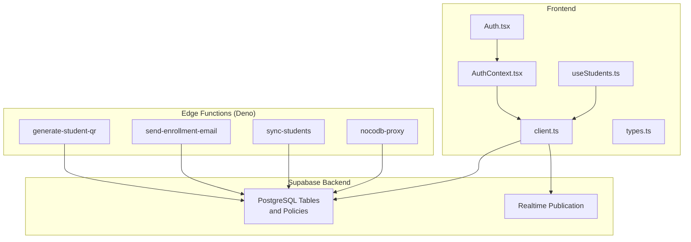

**Diagram sources**
- [client.ts](file://src/integrations/supabase/client.ts#L1-L17)
- [types.ts](file://src/integrations/supabase/types.ts#L1-L120)
- [AuthContext.tsx](file://src/contexts/AuthContext.tsx#L1-L214)
- [Auth.tsx](file://src/pages/Auth.tsx#L1-L243)
- [useStudents.ts](file://src/hooks/useStudents.ts#L1-L144)
- [index.ts](file://supabase/functions/generate-student-qr/index.ts#L1-L100)
- [index.ts](file://supabase/functions/send-enrollment-email/index.ts#L1-L104)
- [index.ts](file://supabase/functions/sync-students/index.ts#L1-L167)
- [index.ts](file://supabase/functions/nocodb-proxy/index.ts#L1-L72)

**Section sources**
- [client.ts](file://src/integrations/supabase/client.ts#L1-L17)
- [types.ts](file://src/integrations/supabase/types.ts#L1-L120)
- [AuthContext.tsx](file://src/contexts/AuthContext.tsx#L1-L214)
- [Auth.tsx](file://src/pages/Auth.tsx#L1-L243)
- [useStudents.ts](file://src/hooks/useStudents.ts#L1-L144)

## Core Components
- Supabase client initialization with local storage persistence and automatic token refresh
- Typed database interface for strongly-typed queries and mutations
- Authentication context managing session, roles, impersonation, and audit logs
- UI-driven login flow with validation, rate limiting, and audit logging
- React Query hooks for CRUD operations on students
- Edge Functions for QR generation, email delivery, student sync, and NocoDB proxying

**Section sources**
- [client.ts](file://src/integrations/supabase/client.ts#L1-L17)
- [types.ts](file://src/integrations/supabase/types.ts#L1-L120)
- [AuthContext.tsx](file://src/contexts/AuthContext.tsx#L1-L214)
- [Auth.tsx](file://src/pages/Auth.tsx#L1-L243)
- [useStudents.ts](file://src/hooks/useStudents.ts#L1-L144)

## Architecture Overview
The system integrates frontend React components with Supabase for authentication, data, and real-time updates, and uses Supabase Edge Functions for serverless tasks.

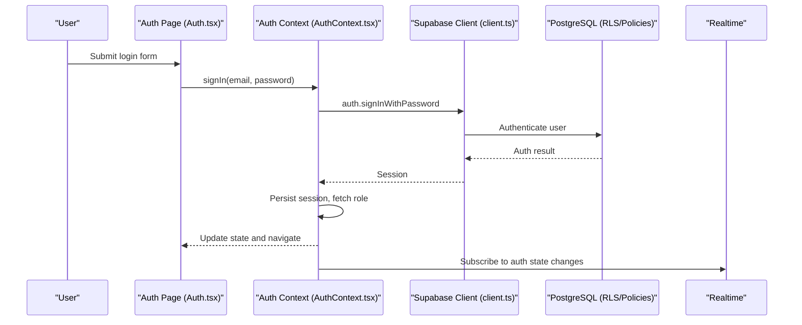

**Diagram sources**
- [Auth.tsx](file://src/pages/Auth.tsx#L53-L100)
- [AuthContext.tsx](file://src/contexts/AuthContext.tsx#L110-L128)
- [client.ts](file://src/integrations/supabase/client.ts#L11-L17)

## Detailed Component Analysis

### Supabase Client and Typed Database
- Initializes Supabase client with environment variables for URL and publishable key
- Enables local storage persistence, session persistence, and automatic token refresh
- Provides a strongly-typed client bound to the generated Database type

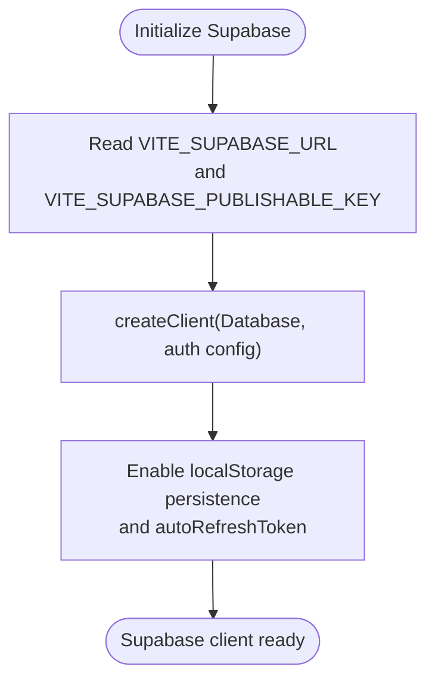

**Diagram sources**
- [client.ts](file://src/integrations/supabase/client.ts#L5-L17)

**Section sources**
- [client.ts](file://src/integrations/supabase/client.ts#L1-L17)
- [types.ts](file://src/integrations/supabase/types.ts#L1-L120)

### Authentication Endpoints and Flows
- Sign-in: Uses password-based authentication with audit logging
- Sign-up: Triggers email confirmation with redirect and custom user data
- Sign-out: Clears session and logs audit events
- Role resolution: Fetches user role from a dedicated table
- Impersonation: Admin-only capability with session and audit logging

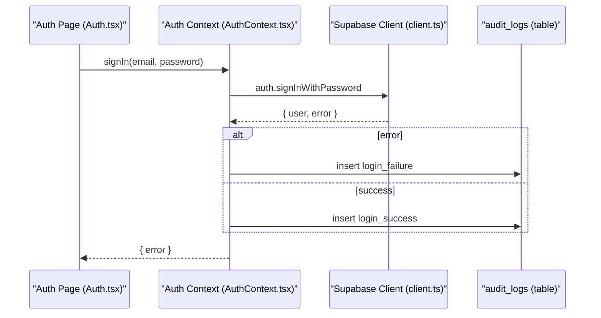

**Diagram sources**
- [Auth.tsx](file://src/pages/Auth.tsx#L53-L100)
- [AuthContext.tsx](file://src/contexts/AuthContext.tsx#L110-L128)

**Section sources**
- [AuthContext.tsx](file://src/contexts/AuthContext.tsx#L1-L214)
- [Auth.tsx](file://src/pages/Auth.tsx#L1-L243)

### Data Manipulation APIs (React Query Hooks)
- List students with joined grades
- Create, update, delete, and bulk-create students
- Automatic cache invalidation and toast notifications
- Optional enrichment of school_id based on school code

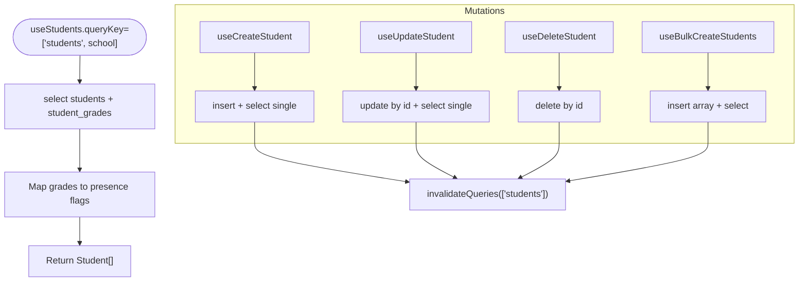

**Diagram sources**
- [useStudents.ts](file://src/hooks/useStudents.ts#L8-L41)
- [useStudents.ts](file://src/hooks/useStudents.ts#L43-L73)
- [useStudents.ts](file://src/hooks/useStudents.ts#L75-L98)
- [useStudents.ts](file://src/hooks/useStudents.ts#L100-L120)
- [useStudents.ts](file://src/hooks/useStudents.ts#L122-L143)

**Section sources**
- [useStudents.ts](file://src/hooks/useStudents.ts#L1-L144)

### Real-time Subscription APIs
- Auth state subscriptions are established on app load
- Realtime publication enabled for specific tables (e.g., raw_scores)
- Clients subscribe to auth state changes and table updates

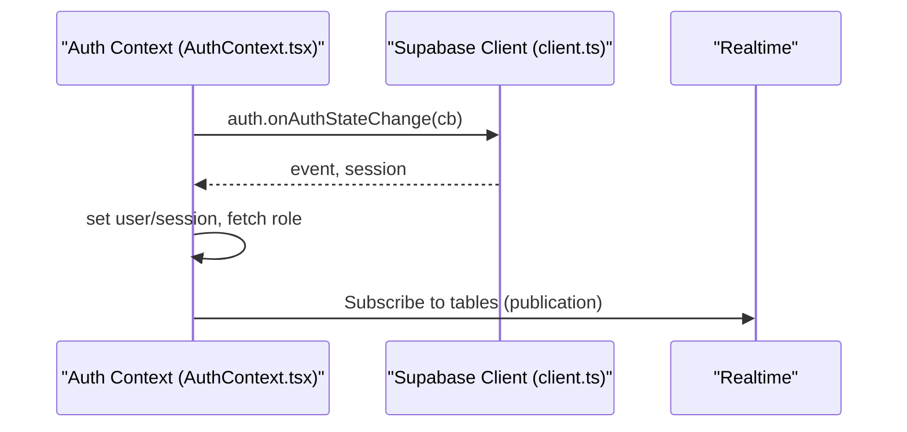

**Diagram sources**
- [AuthContext.tsx](file://src/contexts/AuthContext.tsx#L76-L94)
- [20260205025900_create_raw_scores.sql](file://supabase/migrations/20260205025900_create_raw_scores.sql#L42-L43)

**Section sources**
- [AuthContext.tsx](file://src/contexts/AuthContext.tsx#L64-L108)
- [20260205025900_create_raw_scores.sql](file://supabase/migrations/20260205025900_create_raw_scores.sql#L1-L48)

### Edge Function Interfaces

#### Generate Student QR (generate-student-qr)
- HTTP method: POST
- Request body: { student_id: string }
- Response body: { qr_data_url: string }
- Behavior:
  - Validates presence of student_id
  - Fetches student LRN, name, and school code
  - Generates QR payload and returns a data URL image
  - Returns 400 if missing student_id, 404 if student not found, 500 on internal errors
- CORS: Permissive headers for cross-origin requests

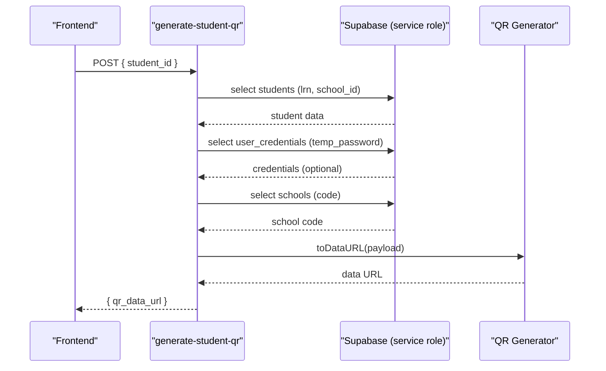

**Diagram sources**
- [index.ts](file://supabase/functions/generate-student-qr/index.ts#L10-L99)

**Section sources**
- [index.ts](file://supabase/functions/generate-student-qr/index.ts#L1-L100)

#### Send Enrollment Email (send-enrollment-email)
- HTTP method: POST
- Request body: { to: string, studentName: string, school: string, username: string, password?: string, qrCodeUrl?: string }
- Response body: Forwarded Resend API response or mock success when API key is missing
- Behavior:
  - Requires RESEND_API_KEY; logs and returns mock success if missing
  - Sends HTML email with credentials and optional QR code image
  - Returns 400 on Resend API error, 500 on internal error

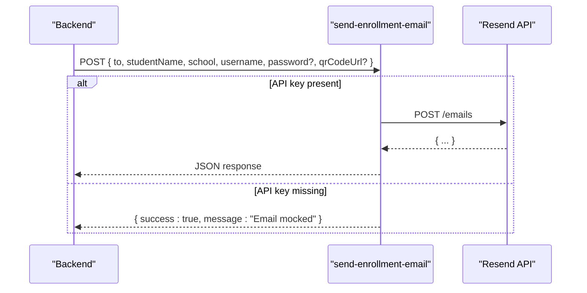

**Diagram sources**
- [index.ts](file://supabase/functions/send-enrollment-email/index.ts#L19-L101)

**Section sources**
- [index.ts](file://supabase/functions/send-enrollment-email/index.ts#L1-L104)

#### Sync Students (sync-students)
- HTTP method: OPTIONS (preflight), GET/POST
- Headers: x-api-key (required), x-forwarded-for/x-real-ip (rate limiting)
- Query parameters/body: { school?: string } (optional filter)
- Response body: { success: boolean, count: number, students: Student[], synced_at: string }
- Behavior:
  - Enforces rate limit (simple in-memory map)
  - Validates API key from environment
  - Selects students with optional school filter
  - Returns 401 for unauthorized, 429 for rate limit exceeded, 500 on query error

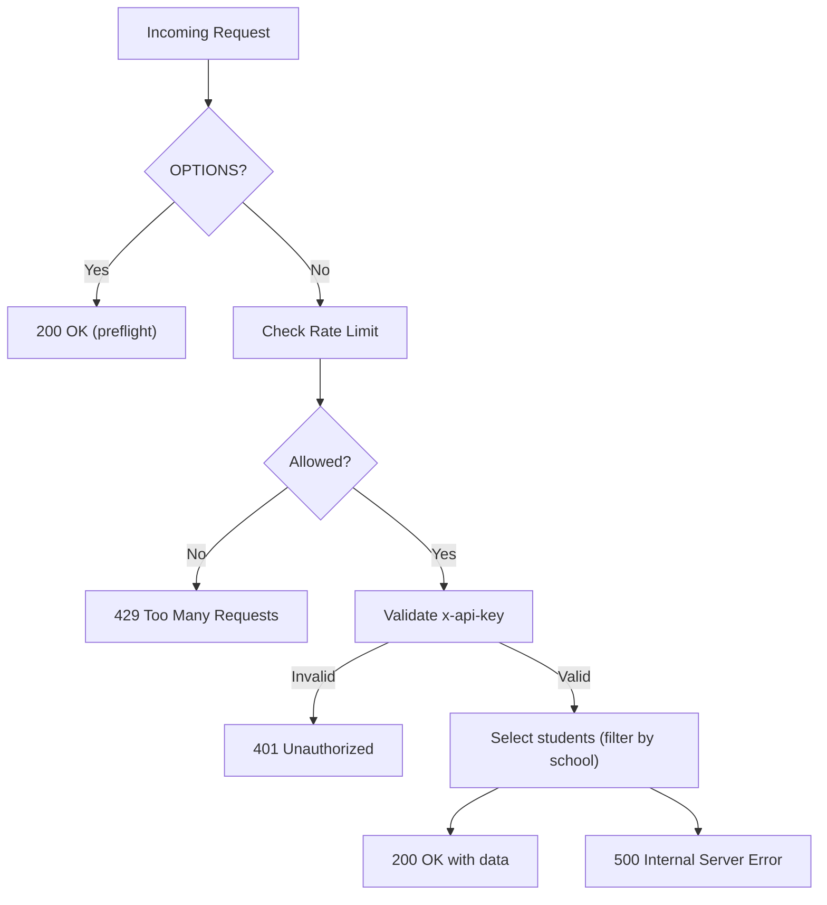

**Diagram sources**
- [index.ts](file://supabase/functions/sync-students/index.ts#L49-L166)

**Section sources**
- [index.ts](file://supabase/functions/sync-students/index.ts#L1-L167)

#### NocoDB Proxy (nocodb-proxy)
- HTTP method: Any (action), requires Authorization header
- Request body: { action?: string, path?: string, body?: any }
- Behavior:
  - Authenticates caller via Supabase auth.getUser
  - Proxies request to NocoDB base URL with xc-token
  - Returns JSON or structured error if non-JSON response
  - Returns 401 if unauthorized, 502 if NocoDB returns non-JSON

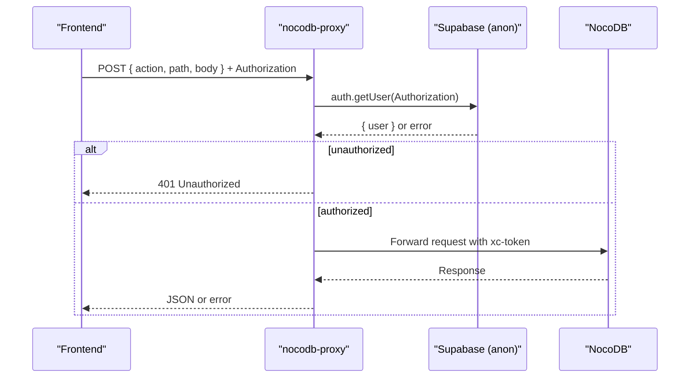

**Diagram sources**
- [index.ts](file://supabase/functions/nocodb-proxy/index.ts#L9-L71)

**Section sources**
- [index.ts](file://supabase/functions/nocodb-proxy/index.ts#L1-L72)

### Webhook Endpoints
- The Edge Functions implement HTTP endpoints suitable for webhooks:
  - generate-student-qr: Accepts POST with student_id
  - send-enrollment-email: Accepts POST with email payload
  - sync-students: Accepts GET/POST with optional filters and requires x-api-key
  - nocodb-proxy: Accepts POST with action/path/body and Authorization
- These endpoints can be invoked by external systems or Supabase Edge Functions runtime.

[No sources needed since this section summarizes endpoint behavior without analyzing specific files]

## Dependency Analysis
- Frontend depends on Supabase client and typed database definitions
- Authentication context depends on Supabase auth and audit logging
- Data hooks depend on Supabase client and React Query
- Edge Functions depend on Supabase service role keys and environment variables
- Migrations define row-level security and real-time publication

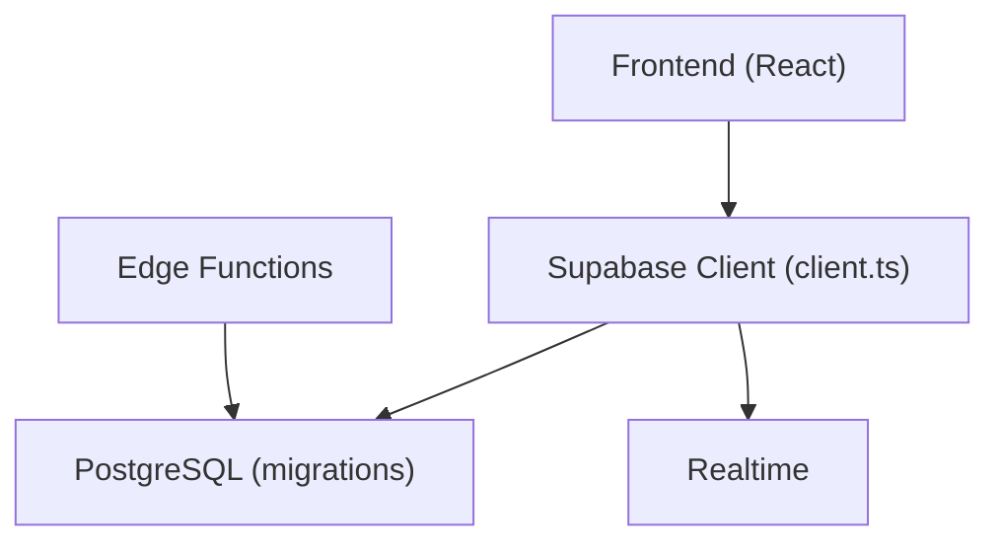

**Diagram sources**
- [client.ts](file://src/integrations/supabase/client.ts#L1-L17)
- [20260205040000_school_year_segregation.sql](file://supabase/migrations/20260205040000_school_year_segregation.sql#L1-L264)
- [20260205025900_create_raw_scores.sql](file://supabase/migrations/20260205025900_create_raw_scores.sql#L1-L48)

**Section sources**
- [client.ts](file://src/integrations/supabase/client.ts#L1-L17)
- [20260205040000_school_year_segregation.sql](file://supabase/migrations/20260205040000_school_year_segregation.sql#L1-L264)
- [20260205025900_create_raw_scores.sql](file://supabase/migrations/20260205025900_create_raw_scores.sql#L1-L48)

## Performance Considerations
- Use indexes created by migrations for efficient filtering and joins
- Prefer selective queries with filters (e.g., school, academic_year) to minimize payload
- Leverage real-time subscriptions for live updates instead of polling
- Cache results on the client using React Query and invalidate on mutations
- Rate-limit external integrations (e.g., email provider) and apply rate limiting in sync-students

[No sources needed since this section provides general guidance]

## Troubleshooting Guide
- Authentication failures:
  - Verify environment variables for Supabase URL and keys
  - Check audit logs for login_failure entries
  - Confirm user role retrieval and session persistence
- Edge Function errors:
  - Ensure required environment variables are set (e.g., SUPABASE_SERVICE_ROLE_KEY, RESEND_API_KEY)
  - Validate API key for sync-students
  - Inspect function logs for detailed error messages
- Data access issues:
  - Confirm row-level security policies and user roles
  - Verify real-time publication settings for subscribed tables

**Section sources**
- [AuthContext.tsx](file://src/contexts/AuthContext.tsx#L110-L128)
- [index.ts](file://supabase/functions/sync-students/index.ts#L75-L91)
- [20260205040000_school_year_segregation.sql](file://supabase/migrations/20260205040000_school_year_segregation.sql#L24-L40)

## Conclusion
The St. Francis Portal integrates a robust Supabase backend with a React frontend and Deno-based Edge Functions. Authentication is handled centrally with audit logging, data operations leverage typed Supabase client and React Query, and real-time updates keep clients synchronized. Edge Functions extend functionality for QR generation, email delivery, data synchronization, and third-party proxying, all secured with appropriate headers and environment variables.

[No sources needed since this section summarizes without analyzing specific files]

## Appendices

### Request/Response Schemas

- Authentication
  - POST /api/auth/sign_in
    - Request: { email: string, password: string }
    - Response: { error: string | null }
  - POST /api/auth/sign_up
    - Request: { email: string, password: string, full_name: string }
    - Response: { error: string | null }
  - POST /api/auth/sign_out
    - Response: void

- Students (React Query)
  - GET /api/students
    - Response: Student[]
  - POST /api/students
    - Request: StudentFormData
    - Response: Student
  - PUT /api/students/:id
    - Request: StudentFormData
    - Response: Student
  - DELETE /api/students/:id
    - Response: void
  - POST /api/students/bulk
    - Request: StudentFormData[]
    - Response: Student[]

- Edge Functions
  - POST /functions/generate-student-qr
    - Request: { student_id: string }
    - Response: { qr_data_url: string }
  - POST /functions/send-enrollment-email
    - Request: { to: string, studentName: string, school: string, username: string, password?: string, qrCodeUrl?: string }
    - Response: Forwarded from Resend API
  - GET|POST /functions/sync-students
    - Headers: x-api-key
    - Request: { school?: string } (optional)
    - Response: { success: boolean, count: number, students: Student[], synced_at: string }
  - POST /functions/nocodb-proxy
    - Headers: Authorization
    - Request: { action?: string, path?: string, body?: any }
    - Response: { data: any, configured: boolean }

**Section sources**
- [Auth.tsx](file://src/pages/Auth.tsx#L53-L100)
- [useStudents.ts](file://src/hooks/useStudents.ts#L11-L41)
- [index.ts](file://supabase/functions/generate-student-qr/index.ts#L10-L99)
- [index.ts](file://supabase/functions/send-enrollment-email/index.ts#L19-L101)
- [index.ts](file://supabase/functions/sync-students/index.ts#L49-L166)
- [index.ts](file://supabase/functions/nocodb-proxy/index.ts#L9-L71)

### Authentication Methods
- Password-based authentication with email or LRN normalization
- Email confirmation and magic links via Supabase auth
- Service role keys for privileged Edge Functions
- Impersonation mode for administrative actions

**Section sources**
- [Auth.tsx](file://src/pages/Auth.tsx#L71-L76)
- [AuthContext.tsx](file://src/contexts/AuthContext.tsx#L161-L187)

### Parameter Validation and Response Processing
- Frontend validation with Zod schema for login form
- Rate limiting and lockout logic for failed attempts
- Toast notifications for success/error feedback
- Audit logging for authentication and data operations

**Section sources**
- [Auth.tsx](file://src/pages/Auth.tsx#L16-L19)
- [Auth.tsx](file://src/pages/Auth.tsx#L56-L100)
- [AuthContext.tsx](file://src/contexts/AuthContext.tsx#L110-L128)
- [useStudents.ts](file://src/hooks/useStudents.ts#L65-L72)