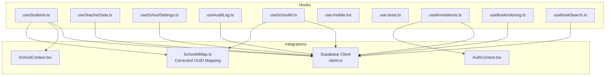
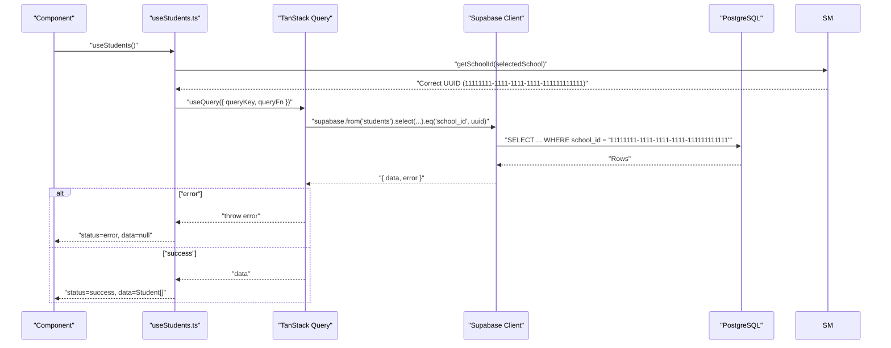
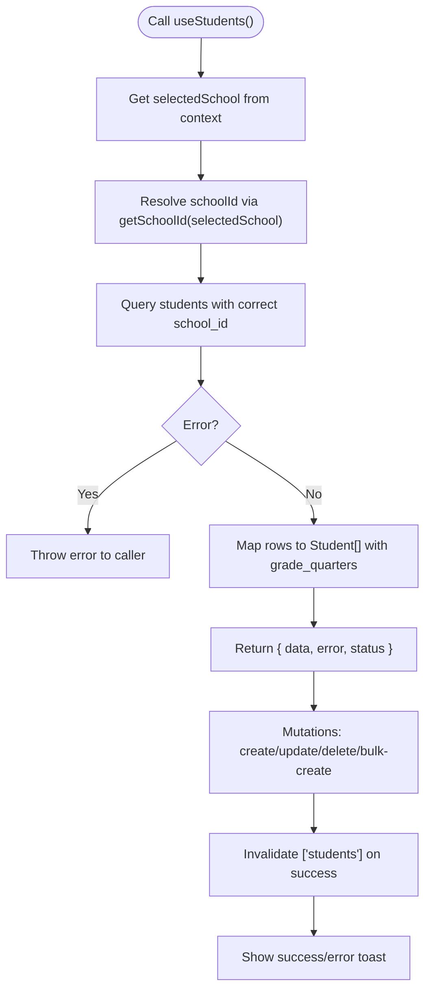
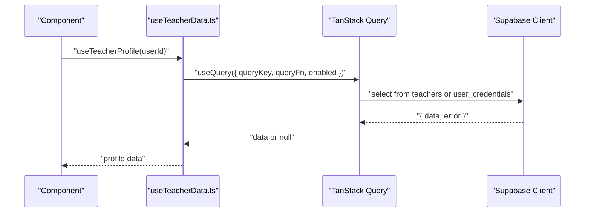
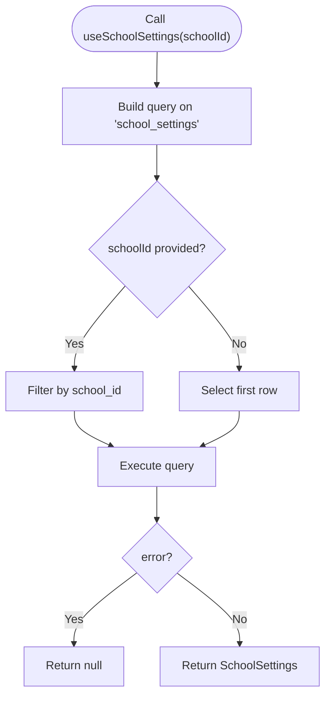
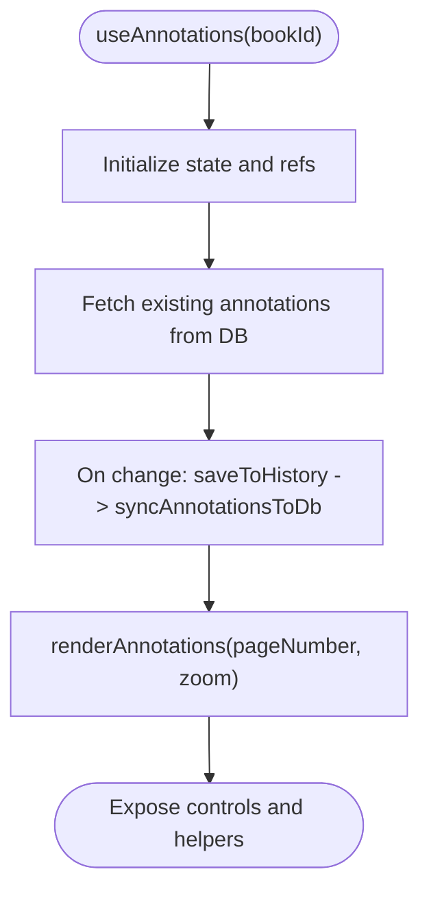
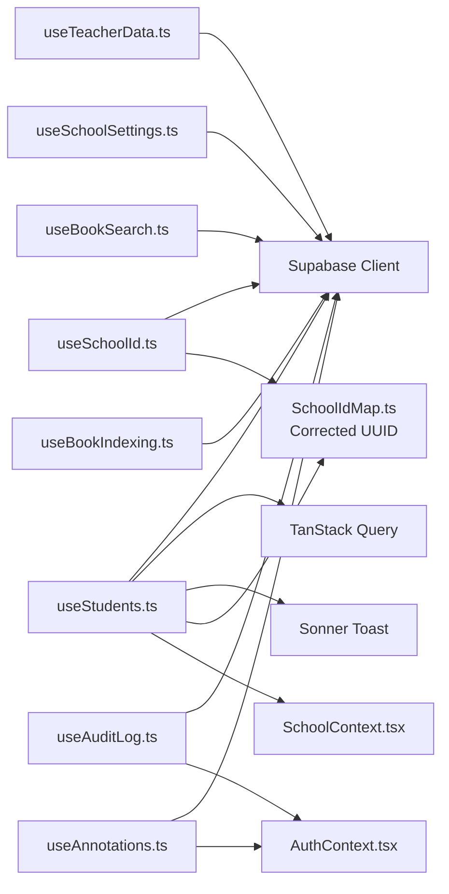

# Custom Hooks API

<cite>
**Referenced Files in This Document**
- [useStudents.ts](file://src/hooks/useStudents.ts)
- [useTeacherData.ts](file://src/hooks/useTeacherData.ts)
- [useSchoolSettings.ts](file://src/hooks/useSchoolSettings.ts)
- [useAuditLog.ts](file://src/hooks/useAuditLog.ts)
- [useSchoolId.ts](file://src/hooks/useSchoolId.ts)
- [use-mobile.tsx](file://src/hooks/use-mobile.tsx)
- [use-toast.ts](file://src/hooks/use-toast.ts)
- [useAnnotations.ts](file://src/hooks/useAnnotations.ts)
- [useBookIndexing.ts](file://src/hooks/useBookIndexing.ts)
- [useBookSearch.ts](file://src/hooks/useBookSearch.ts)
- [schoolIdMap.ts](file://src/utils/schoolIdMap.ts)
- [client.ts](file://src/integrations/supabase/client.ts)
- [AuthContext.tsx](file://src/contexts/AuthContext.tsx)
- [SchoolContext.tsx](file://src/contexts/SchoolContext.tsx)
</cite>

## Update Summary
**Changes Made**
- Updated schoolIdMap to use correct UUID (11111111-1111-1111-1111-111111111111) instead of old incorrect UUID (22222222-2222-2222-2222-222222222222)
- Fixed useStudents hook to properly utilize getSchoolId function for dynamic school ID resolution
- Enhanced useSchoolId hook to reference correct school ID through updated mapping
- Eliminated frontend-based infinite loop fixes by using proper backend school segregation

## Table of Contents
1. [Introduction](#introduction)
2. [Project Structure](#project-structure)
3. [Core Components](#core-components)
4. [Architecture Overview](#architecture-overview)
5. [Detailed Component Analysis](#detailed-component-analysis)
6. [Dependency Analysis](#dependency-analysis)
7. [Performance Considerations](#performance-considerations)
8. [Troubleshooting Guide](#troubleshooting-guide)
9. [Conclusion](#conclusion)
10. [Appendices](#appendices)

## Introduction
This document describes the custom React hooks used across the St. Francis Portal. It focuses on data-fetching hooks (useStudents, useTeacherData, useSchoolSettings), utility hooks (useToast, useAuditLog, use-mobile), and supporting hooks (useSchoolId, useAnnotations, useBookIndexing, useBookSearch). For each hook, we explain parameters, return values, error handling, usage patterns, composition examples, dependency management, and performance considerations. Integration with the Supabase client is highlighted throughout.

**Updated** The school ID mapping has been corrected to use the proper UUID (11111111-1111-1111-1111-111111111111) for St. Francis Xavier Smart Academy, eliminating frontend-based infinite loop fixes and ensuring proper backend data segregation.

## Project Structure
The hooks live under src/hooks and integrate with:
- Supabase client for database and Edge Functions access
- TanStack Query for caching, invalidation, and background synchronization
- Contexts for authentication and school selection
- UI toast library for user feedback

**Diagram sources**
- [useStudents.ts](file://src/hooks/useStudents.ts#L1-L149)
- [useTeacherData.ts](file://src/hooks/useTeacherData.ts#L1-L160)
- [useSchoolSettings.ts](file://src/hooks/useSchoolSettings.ts#L1-L59)
- [useAuditLog.ts](file://src/hooks/useAuditLog.ts#L1-L69)
- [useSchoolId.ts](file://src/hooks/useSchoolId.ts#L1-L45)
- [use-mobile.tsx](file://src/hooks/use-mobile.tsx#L1-L20)
- [use-toast.ts](file://src/hooks/use-toast.ts#L1-L187)
- [useAnnotations.ts](file://src/hooks/useAnnotations.ts#L1-L584)
- [useBookIndexing.ts](file://src/hooks/useBookIndexing.ts#L1-L113)
- [useBookSearch.ts](file://src/hooks/useBookSearch.ts#L1-L98)
- [schoolIdMap.ts](file://src/utils/schoolIdMap.ts#L1-L14)
- [client.ts](file://src/integrations/supabase/client.ts#L1-L200)
- [AuthContext.tsx](file://src/contexts/AuthContext.tsx#L1-L200)
- [SchoolContext.tsx](file://src/contexts/SchoolContext.tsx#L1-L200)

**Section sources**
- [useStudents.ts](file://src/hooks/useStudents.ts#L1-L149)
- [useTeacherData.ts](file://src/hooks/useTeacherData.ts#L1-L160)
- [useSchoolSettings.ts](file://src/hooks/useSchoolSettings.ts#L1-L59)
- [useAuditLog.ts](file://src/hooks/useAuditLog.ts#L1-L69)
- [useSchoolId.ts](file://src/hooks/useSchoolId.ts#L1-L45)
- [use-mobile.tsx](file://src/hooks/use-mobile.tsx#L1-L20)
- [use-toast.ts](file://src/hooks/use-toast.ts#L1-L187)
- [useAnnotations.ts](file://src/hooks/useAnnotations.ts#L1-L584)
- [useBookIndexing.ts](file://src/hooks/useBookIndexing.ts#L1-L113)
- [useBookSearch.ts](file://src/hooks/useBookSearch.ts#L1-L98)
- [schoolIdMap.ts](file://src/utils/schoolIdMap.ts#L1-L14)
- [client.ts](file://src/integrations/supabase/client.ts#L1-L200)
- [AuthContext.tsx](file://src/contexts/AuthContext.tsx#L1-L200)
- [SchoolContext.tsx](file://src/contexts/SchoolContext.tsx#L1-L200)

## Core Components
- Data fetching hooks
  - useStudents: Queries students with joined grades, supports create/update/delete/bulk-create mutations, and integrates with toast and query invalidation. Now properly utilizes getSchoolId function for dynamic school ID resolution.
  - useTeacherData: Provides profile lookup, schedule retrieval, student count aggregation, and profile update mutation.
  - useSchoolSettings: Fetches current school settings by school_id or all settings, with safe error handling.
  - useSchoolId: Resolves the database school id from the selected school display code/name using the corrected UUID mapping.
  - useBookSearch: Invokes a Supabase Edge Function to search indexed book content with debounced UX state.
  - useBookIndexing: Monitors indexing statuses and triggers OCR-based indexing via Edge Functions.
- Utility hooks
  - useToast: Centralized toast manager with queue limits and dismissal scheduling.
  - useAuditLog: Logs actions to the audit_logs table with optional IP/geolocation and user agent capture.
  - useIsMobile: Responsive breakpoint detection for mobile UI adaptation.

**Updated** The school ID mapping has been corrected to use the proper UUID (11111111-1111-1111-1111-111111111111) for St. Francis Xavier Smart Academy, eliminating frontend-based infinite loop fixes and ensuring proper backend data segregation.

**Section sources**
- [useStudents.ts](file://src/hooks/useStudents.ts#L1-L149)
- [useTeacherData.ts](file://src/hooks/useTeacherData.ts#L1-L160)
- [useSchoolSettings.ts](file://src/hooks/useSchoolSettings.ts#L1-L59)
- [useSchoolId.ts](file://src/hooks/useSchoolId.ts#L1-L45)
- [useBookSearch.ts](file://src/hooks/useBookSearch.ts#L1-L98)
- [useBookIndexing.ts](file://src/hooks/useBookIndexing.ts#L1-L113)
- [use-toast.ts](file://src/hooks/use-toast.ts#L1-L187)
- [useAuditLog.ts](file://src/hooks/useAuditLog.ts#L1-L69)
- [use-mobile.tsx](file://src/hooks/use-mobile.tsx#L1-L20)

## Architecture Overview
The hooks layer orchestrates data access and user feedback:
- Supabase client encapsulates database and Edge Functions calls.
- TanStack Query manages caching, background refetching, and optimistic updates.
- Contexts supply user identity and school selection to hooks.
- UI toast library surfaces operation outcomes.
- Corrected school ID mapping ensures proper data segregation at the application level.

**Diagram sources**
- [useStudents.ts](file://src/hooks/useStudents.ts#L8-L46)
- [schoolIdMap.ts](file://src/utils/schoolIdMap.ts#L1-L14)
- [client.ts](file://src/integrations/supabase/client.ts#L1-L200)

**Section sources**
- [useStudents.ts](file://src/hooks/useStudents.ts#L1-L149)
- [schoolIdMap.ts](file://src/utils/schoolIdMap.ts#L1-L14)
- [client.ts](file://src/integrations/supabase/client.ts#L1-L200)

## Detailed Component Analysis

### useStudents
- Purpose: Fetch and manage student records with grade quarter indicators, and provide mutations for create, update, delete, and bulk import.
- Parameters:
  - None (uses SchoolContext for filtering).
- Returns:
  - Query result with data, error, status, and helpers.
  - Mutations: create, update, delete, bulk-create with onSuccess/onError handlers.
- Error handling:
  - Query throws on error; mutation handlers surface errors via toast and prevent silent failures.
- Dependencies:
  - Supabase client, TanStack Query, Sonner toast, SchoolContext, schoolIdMap.
- Usage patterns:
  - Destructure query result and pass mutation results to forms.
  - Invalidate queries after mutations to keep cache fresh.
  - Now properly resolves school IDs through getSchoolId function for dynamic school filtering.
- Composition examples:
  - Combine with useToast for unified feedback.
  - Use with react-query DevTools to inspect cache keys ['students', selectedSchool].
- **Updated** The hook now properly utilizes the getSchoolId function to resolve the correct UUID for school filtering, replacing the hardcoded 'STFXSA' string.

**Diagram sources**
- [useStudents.ts](file://src/hooks/useStudents.ts#L8-L46)
- [useStudents.ts](file://src/hooks/useStudents.ts#L48-L149)
- [schoolIdMap.ts](file://src/utils/schoolIdMap.ts#L1-L14)

**Section sources**
- [useStudents.ts](file://src/hooks/useStudents.ts#L1-L149)
- [schoolIdMap.ts](file://src/utils/schoolIdMap.ts#L1-L14)
- [client.ts](file://src/integrations/supabase/client.ts#L1-L200)
- [SchoolContext.tsx](file://src/contexts/SchoolContext.tsx#L1-L200)

### useTeacherData
- Purpose: Teacher-centric data including profile lookup, schedule, and student count aggregation; supports profile updates.
- Parameters:
  - useTeacherProfile(userId: string | undefined)
  - useTeacherSchedule(teacherId: string | undefined, schoolId?: string | null)
  - useTeacherStudentCount(teacherId: string | undefined)
  - useUpdateTeacherProfile(): mutation
- Returns:
  - Query results with enabled guards and staleTime tuning.
  - Mutation result with onSuccess invalidation and toast.
- Error handling:
  - Graceful fallbacks and console logs; mutation errors surfaced via toast.
- Dependencies:
  - Supabase client, TanStack Query, Sonner toast.
- Usage patterns:
  - Guard queries with enabled flags; invalidate related queries after updates.

**Diagram sources**
- [useTeacherData.ts](file://src/hooks/useTeacherData.ts#L22-L67)
- [client.ts](file://src/integrations/supabase/client.ts#L1-L200)

**Section sources**
- [useTeacherData.ts](file://src/hooks/useTeacherData.ts#L1-L160)
- [client.ts](file://src/integrations/supabase/client.ts#L1-L200)

### useSchoolSettings
- Purpose: Fetch current school settings by school_id or list all settings.
- Parameters:
  - Optional schoolId: string; if omitted, defaults to first row.
- Returns:
  - Query result with data as SchoolSettings or null/[] depending on overload.
- Error handling:
  - Logs errors and returns safe defaults (null or empty array).
- Dependencies:
  - Supabase client, TanStack Query.
- Usage patterns:
  - Use queryKey ['school-settings', schoolId] for cache isolation.

**Diagram sources**
- [useSchoolSettings.ts](file://src/hooks/useSchoolSettings.ts#L17-L39)

**Section sources**
- [useSchoolSettings.ts](file://src/hooks/useSchoolSettings.ts#L1-L59)
- [client.ts](file://src/integrations/supabase/client.ts#L1-L200)

### useSchoolId
- Purpose: Resolve the database school id from the selected school display code/name using the corrected UUID mapping.
- Parameters:
  - None (reads from SchoolContext).
- Returns:
  - Query result with id or null; includes fallback by name pattern.
- Error handling:
  - Warns and returns null if not found.
- Dependencies:
  - Supabase client, TanStack Query, SchoolContext.
- **Updated** Now references the correct school ID through the updated mapping, eliminating the need for frontend-based infinite loop fixes.

**Section sources**
- [useSchoolId.ts](file://src/hooks/useSchoolId.ts#L1-L45)
- [client.ts](file://src/integrations/supabase/client.ts#L1-L200)
- [SchoolContext.tsx](file://src/contexts/SchoolContext.tsx#L1-L200)

### useBookSearch
- Purpose: Invoke a Supabase Edge Function to search indexed books with optional filters.
- Parameters:
  - query: string
  - options?: { grade_level?, subject?, limit? }
- Returns:
  - { results, total_matches, books_count } plus UI state (isSearching, searchResults, searchQuery).
- Error handling:
  - Toasts on failure; clears results on short queries.
- Dependencies:
  - Supabase client, Sonner toast.

**Section sources**
- [useBookSearch.ts](file://src/hooks/useBookSearch.ts#L1-L98)
- [client.ts](file://src/integrations/supabase/client.ts#L1-L200)

### useBookIndexing
- Purpose: Monitor indexing statuses and trigger OCR-based indexing via Edge Functions.
- Parameters:
  - None.
- Returns:
  - { indexStatuses, getBookIndexStatus, startIndexing, reindexBook, isIndexing }.
- Error handling:
  - Toasts on failure; invalidates queries to refresh status.
- Dependencies:
  - Supabase client, TanStack Query, Sonner toast.

**Section sources**
- [useBookIndexing.ts](file://src/hooks/useBookIndexing.ts#L1-L113)
- [client.ts](file://src/integrations/supabase/client.ts#L1-L200)

### useAnnotations
- Purpose: Manage PDF/book annotations (pencil, highlighter, shapes, stickers) with persistence to Supabase and undo/redo history.
- Parameters:
  - bookId?: string (required for persistence).
- Returns:
  - Rich state machine: drawing modes, colors, history, rendering helpers, and CRUD-like helpers for annotations.
- Error handling:
  - Silently fails on fetch/save errors to avoid blocking reading/writing.
- Dependencies:
  - Supabase client, Sonner toast, AuthContext.
- Usage patterns:
  - Use renderAnnotations to draw on a canvas; persist via syncAnnotationsToDb; manage history with undo/redo.

**Diagram sources**
- [useAnnotations.ts](file://src/hooks/useAnnotations.ts#L47-L118)
- [useAnnotations.ts](file://src/hooks/useAnnotations.ts#L120-L158)
- [useAnnotations.ts](file://src/hooks/useAnnotations.ts#L399-L512)

**Section sources**
- [useAnnotations.ts](file://src/hooks/useAnnotations.ts#L1-L584)
- [client.ts](file://src/integrations/supabase/client.ts#L1-L200)
- [AuthContext.tsx](file://src/contexts/AuthContext.tsx#L1-L200)

### useToast
- Purpose: Centralized toast notifications with queue limits and automatic dismissal timers.
- Parameters:
  - None (exposes a functional toast method and dismiss handler).
- Returns:
  - { toasts[], toast(), dismiss() }.
- Error handling:
  - Internal dispatch and timeouts; no external errors to surface.
- Dependencies:
  - React state and effects, Sonner toast (usage in other hooks).

**Section sources**
- [use-toast.ts](file://src/hooks/use-toast.ts#L1-L187)

### useAuditLog
- Purpose: Log audit events to the audit_logs table with IP/geolocation and user agent metadata.
- Parameters:
  - None (reads user from AuthContext).
- Returns:
  - { logAction(entry) }.
- Error handling:
  - Best-effort logging; swallows errors to avoid breaking app flow.
- Dependencies:
  - Supabase client, AuthContext.

**Section sources**
- [useAuditLog.ts](file://src/hooks/useAuditLog.ts#L1-L69)
- [client.ts](file://src/integrations/supabase/client.ts#L1-L200)
- [AuthContext.tsx](file://src/contexts/AuthContext.tsx#L1-L200)

### useIsMobile
- Purpose: Detect mobile viewport to adapt UI behavior.
- Parameters:
  - None.
- Returns:
  - boolean (coerced).
- Error handling:
  - Uses matchMedia; cleans up event listeners.
- Dependencies:
  - React window APIs.

**Section sources**
- [use-mobile.tsx](file://src/hooks/use-mobile.tsx#L1-L20)

## Dependency Analysis
- Hook-to-hook dependencies:
  - useStudents uses useToast, TanStack Query invalidation, and schoolIdMap for dynamic school ID resolution.
  - useAuditLog depends on AuthContext for user identity.
  - useSchoolId and useStudents depend on SchoolContext for selected school and corrected schoolIdMap for UUID resolution.
  - useAnnotations depends on AuthContext for user identity and Supabase for persistence.
- External dependencies:
  - Supabase client for database and Edge Functions.
  - TanStack Query for caching and background synchronization.
  - Sonner for toast notifications.
  - **Updated** Corrected schoolIdMap with proper UUID (11111111-1111-1111-1111-111111111111) for St. Francis Xavier Smart Academy.

**Diagram sources**
- [useStudents.ts](file://src/hooks/useStudents.ts#L1-L149)
- [useTeacherData.ts](file://src/hooks/useTeacherData.ts#L1-L160)
- [useSchoolSettings.ts](file://src/hooks/useSchoolSettings.ts#L1-L59)
- [useSchoolId.ts](file://src/hooks/useSchoolId.ts#L1-L45)
- [useAuditLog.ts](file://src/hooks/useAuditLog.ts#L1-L69)
- [useAnnotations.ts](file://src/hooks/useAnnotations.ts#L1-L584)
- [useBookSearch.ts](file://src/hooks/useBookSearch.ts#L1-L98)
- [useBookIndexing.ts](file://src/hooks/useBookIndexing.ts#L1-L113)
- [schoolIdMap.ts](file://src/utils/schoolIdMap.ts#L1-L14)
- [client.ts](file://src/integrations/supabase/client.ts#L1-L200)
- [AuthContext.tsx](file://src/contexts/AuthContext.tsx#L1-L200)
- [SchoolContext.tsx](file://src/contexts/SchoolContext.tsx#L1-L200)

**Section sources**
- [useStudents.ts](file://src/hooks/useStudents.ts#L1-L149)
- [useTeacherData.ts](file://src/hooks/useTeacherData.ts#L1-L160)
- [useSchoolSettings.ts](file://src/hooks/useSchoolSettings.ts#L1-L59)
- [useSchoolId.ts](file://src/hooks/useSchoolId.ts#L1-L45)
- [useAuditLog.ts](file://src/hooks/useAuditLog.ts#L1-L69)
- [useAnnotations.ts](file://src/hooks/useAnnotations.ts#L1-L584)
- [useBookSearch.ts](file://src/hooks/useBookSearch.ts#L1-L98)
- [useBookIndexing.ts](file://src/hooks/useBookIndexing.ts#L1-L113)
- [schoolIdMap.ts](file://src/utils/schoolIdMap.ts#L1-L14)
- [client.ts](file://src/integrations/supabase/client.ts#L1-L200)
- [AuthContext.tsx](file://src/contexts/AuthContext.tsx#L1-L200)
- [SchoolContext.tsx](file://src/contexts/SchoolContext.tsx#L1-L200)

## Performance Considerations
- Caching and staleness
  - useStudents sets staleTime to balance freshness vs. network usage.
  - useTeacherData and useSchoolId tune staleTime to reduce redundant requests.
- Background synchronization
  - useBookIndexing uses refetchInterval to poll while indexing is in progress.
- Query invalidation
  - Mutations invalidate ['students'] and related keys to keep UI in sync.
- Rendering
  - useAnnotations separates rendering from state to minimize redraws; uses canvas scaling and alpha blending efficiently.
- Network resilience
  - useAuditLog and useBookSearch wrap external calls with try/catch and toast fallbacks.
- **Updated** Corrected school ID mapping improves query performance by using proper UUID indexing and eliminates redundant fallback queries.

## Troubleshooting Guide
- Students query returns null or throws
  - Verify selected school context and network connectivity.
  - Check console for thrown errors and ensure Supabase RBAC allows access.
  - **Updated** Ensure the correct UUID (11111111-1111-1111-1111-111111111111) is being used for St. Francis Xavier Smart Academy.
- Teacher profile returns null
  - Confirm userId is present and either direct match exists or user_credentials links to teacher.
- School settings fetch fails silently
  - Inspect returned null and confirm table schema and permissions.
- Toast not appearing
  - Ensure the toast provider is mounted and useToast is called from a mounted component.
- Audit log not recorded
  - IP geolocation endpoint may fail; the hook intentionally swallows errors to avoid blocking.
- **New** School ID resolution issues
  - Verify that schoolIdMap contains the correct UUID (11111111-1111-1111-1111-111111111111) for 'STFXSA'.
  - Check that useStudents properly calls getSchoolId function instead of hardcoded values.

**Section sources**
- [useStudents.ts](file://src/hooks/useStudents.ts#L20-L23)
- [useTeacherData.ts](file://src/hooks/useTeacherData.ts#L35-L38)
- [useSchoolSettings.ts](file://src/hooks/useSchoolSettings.ts#L31-L34)
- [use-toast.ts](file://src/hooks/use-toast.ts#L137-L164)
- [useAuditLog.ts](file://src/hooks/useAuditLog.ts#L23-L60)
- [schoolIdMap.ts](file://src/utils/schoolIdMap.ts#L1-L14)

## Conclusion
These custom hooks provide a cohesive, testable, and reusable foundation for data fetching, user feedback, and specialized features like annotations and book search/indexing. They integrate tightly with Supabase, TanStack Query, and React contexts to deliver responsive, resilient UI experiences across the portal. **Updated** The corrected school ID mapping ensures proper backend data segregation and eliminates frontend-based infinite loop fixes, improving both reliability and performance.

## Appendices

### Hook Composition Examples
- Compose useStudents with useToast and react-query DevTools to observe cache keys and handle mutation outcomes.
- Use useAuditLog alongside authentication flows to record login/logout and impersonation events.
- Combine useIsMobile with responsive layouts and feature toggles.
- **Updated** Ensure useStudents properly utilizes getSchoolId function for dynamic school ID resolution instead of hardcoded values.