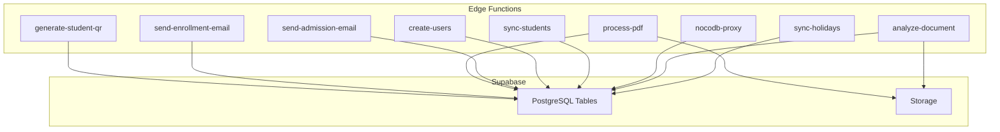
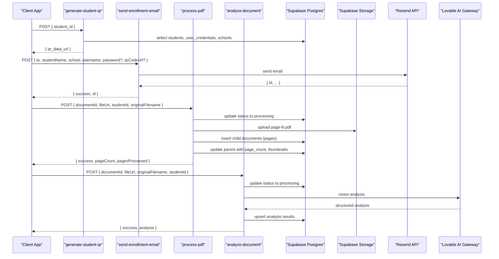
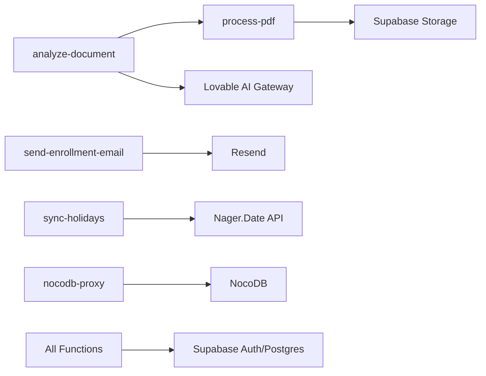

# Edge Functions API

<cite>
**Referenced Files in This Document**
- [generate-student-qr/index.ts](file://supabase/functions/generate-student-qr/index.ts)
- [send-enrollment-email/index.ts](file://supabase/functions/send-enrollment-email/index.ts)
- [process-pdf/index.ts](file://supabase/functions/process-pdf/index.ts)
- [send-admission-email/index.ts](file://supabase/functions/send-admission-email/index.ts)
- [create-users/index.ts](file://supabase/functions/create-users/index.ts)
- [sync-students/index.ts](file://supabase/functions/sync-students/index.ts)
- [nocodb-proxy/index.ts](file://supabase/functions/nocodb-proxy/index.ts)
- [analyze-document/index.ts](file://supabase/functions/analyze-document/index.ts)
- [sync-holidays/index.ts](file://supabase/functions/sync-holidays/index.ts)
- [config.toml](file://supabase/config.toml)
- [20260205041000_school_segregation_enhancements.sql](file://supabase/migrations/20260205041000_school_segregation_enhancements.sql)
- [package.json](file://package.json)
- [README.md](file://README.md)
</cite>

## Table of Contents
1. [Introduction](#introduction)
2. [Project Structure](#project-structure)
3. [Core Components](#core-components)
4. [Architecture Overview](#architecture-overview)
5. [Detailed Component Analysis](#detailed-component-analysis)
6. [Dependency Analysis](#dependency-analysis)
7. [Performance Considerations](#performance-considerations)
8. [Troubleshooting Guide](#troubleshooting-guide)
9. [Conclusion](#conclusion)
10. [Appendices](#appendices)

## Introduction
This document describes the Supabase edge functions used in St. Francis Portal. It covers endpoint behavior, request/response schemas, error handling, authentication and security, webhook integration patterns, and operational guidance for deployment, monitoring, and debugging. The documented functions include generate-student-qr, send-enrollment-email, process-pdf, send-admission-email, create-users, sync-students, nocodb-proxy, analyze-document, and sync-holidays.

## Project Structure
The edge functions live under supabase/functions/<function-name>/index.ts. Each function is a Deno-based HTTP handler that:
- Accepts JSON payloads via POST
- Returns JSON responses with appropriate status codes
- Uses Supabase clients for database access
- Integrates with external services (Resend, Lovable AI Gateway, storage providers)

**Diagram sources**
- [generate-student-qr/index.ts](file://supabase/functions/generate-student-qr/index.ts#L1-L100)
- [send-enrollment-email/index.ts](file://supabase/functions/send-enrollment-email/index.ts#L1-L104)
- [process-pdf/index.ts](file://supabase/functions/process-pdf/index.ts#L1-L194)
- [send-admission-email/index.ts](file://supabase/functions/send-admission-email/index.ts#L1-L126)
- [create-users/index.ts](file://supabase/functions/create-users/index.ts#L1-L545)
- [sync-students/index.ts](file://supabase/functions/sync-students/index.ts#L1-L167)
- [nocodb-proxy/index.ts](file://supabase/functions/nocodb-proxy/index.ts#L1-L72)
- [analyze-document/index.ts](file://supabase/functions/analyze-document/index.ts#L1-L307)
- [sync-holidays/index.ts](file://supabase/functions/sync-holidays/index.ts#L1-L113)

**Section sources**
- [config.toml](file://supabase/config.toml#L1-L1)
- [README.md](file://README.md#L1-L76)

## Core Components
- generate-student-qr: Generates a QR code containing student identity and credentials for ID badges and attendance.
- send-enrollment-email: Sends enrollment confirmation emails with optional QR code attachment.
- process-pdf: Splits PDFs into pages, stores page PDFs, and triggers AI analysis.
- send-admission-email: Sends admission decisions and admin notifications via Resend.
- create-users: Manages user creation, bulk student account creation, resets, and deletions.
- sync-students: Provides filtered student data via API key with rate limiting.
- nocodb-proxy: Proxies authenticated requests to NocoDB with token-based checks.
- analyze-document: Performs AI-powered OCR and classification for images; delegates PDFs to process-pdf.
- sync-holidays: Syncs public holidays into school calendars.

**Section sources**
- [generate-student-qr/index.ts](file://supabase/functions/generate-student-qr/index.ts#L1-L100)
- [send-enrollment-email/index.ts](file://supabase/functions/send-enrollment-email/index.ts#L1-L104)
- [process-pdf/index.ts](file://supabase/functions/process-pdf/index.ts#L1-L194)
- [send-admission-email/index.ts](file://supabase/functions/send-admission-email/index.ts#L1-L126)
- [create-users/index.ts](file://supabase/functions/create-users/index.ts#L1-L545)
- [sync-students/index.ts](file://supabase/functions/sync-students/index.ts#L1-L167)
- [nocodb-proxy/index.ts](file://supabase/functions/nocodb-proxy/index.ts#L1-L72)
- [analyze-document/index.ts](file://supabase/functions/analyze-document/index.ts#L1-L307)
- [sync-holidays/index.ts](file://supabase/functions/sync-holidays/index.ts#L1-L113)

## Architecture Overview
Edge functions communicate with:
- Supabase Auth and Postgres for identity and data
- Supabase Storage for document/page assets
- External services (Resend, Lovable AI Gateway, Nager.Date)

**Diagram sources**
- [generate-student-qr/index.ts](file://supabase/functions/generate-student-qr/index.ts#L1-L100)
- [send-enrollment-email/index.ts](file://supabase/functions/send-enrollment-email/index.ts#L1-L104)
- [process-pdf/index.ts](file://supabase/functions/process-pdf/index.ts#L1-L194)
- [analyze-document/index.ts](file://supabase/functions/analyze-document/index.ts#L1-L307)

## Detailed Component Analysis

### generate-student-qr
- Purpose: Build a QR payload with LRN, temporary password, school code, and timestamp; return a data URL image.
- Authentication: Uses Supabase service role key.
- Request
  - Method: POST
  - Body: { student_id: string }
- Response
  - Success: { qr_data_url: string }
  - Errors: 400 (missing student_id), 404 (student not found), 500 (internal)
- Security
  - CORS allows generic headers; ensure origin restrictions in production.
  - Service role key required for database access.
- Notes
  - QR payload includes optional credentials; ensure transport security.

**Section sources**
- [generate-student-qr/index.ts](file://supabase/functions/generate-student-qr/index.ts#L1-L100)

### send-enrollment-email
- Purpose: Send enrollment confirmation emails with credentials and optional QR code.
- Authentication: Requires RESEND_API_KEY; if missing, logs and returns success (mock mode).
- Request
  - Method: POST
  - Body: { to: string, studentName: string, school: string, username: string, password?: string, qrCodeUrl?: string }
- Response
  - Success: Resend API response
  - Errors: 400 (Resend API error), 500 (unexpected)
- Security
  - API key must be set; otherwise function operates in mock mode.
- Notes
  - HTML template includes credentials and optional QR code image.

**Section sources**
- [send-enrollment-email/index.ts](file://supabase/functions/send-enrollment-email/index.ts#L1-L104)

### process-pdf
- Purpose: Split multi-page PDFs into individual page PDFs, store in storage, and update document metadata.
- Authentication: Uses Supabase service role key; requires DEEPSEEK_API_KEY for downstream analysis.
- Request
  - Method: POST
  - Body: { documentId: string, fileUrl: string, studentId: string, originalFilename?: string }
- Response
  - Success: { success: true, pageCount: number, pagesProcessed: number, message: string }
  - Errors: 400 (missing params), 500 (missing API key or processing failure)
- Processing flow
  - Validates inputs and API keys
  - Updates document status to processing
  - Downloads PDF, iterates pages (limit 20), uploads page-N.pdf
  - Inserts child records for each page
  - Updates parent with page count, thumbnails, and metadata
- Security
  - Service role key required for DB access
  - Storage uploads use service role key

**Section sources**
- [process-pdf/index.ts](file://supabase/functions/process-pdf/index.ts#L1-L194)

### send-admission-email
- Purpose: Send admission approval/rejection/admin notification emails via Resend.
- Authentication: Requires RESEND_API_KEY; logs and returns success if missing.
- Request
  - Method: POST
  - Body: { type: "approval"|"rejection"|"admin_notification", to: string, studentName: string, school: string, level: string, rejectionReason?: string, approvedBy?: string }
- Response
  - Success: Resend API response
  - Errors: 500 (unexpected)
- Security
  - API key required; otherwise operates in mock mode.

**Section sources**
- [send-admission-email/index.ts](file://supabase/functions/send-admission-email/index.ts#L1-L126)

### create-users
- Purpose: Centralized user lifecycle management including admin/registrar/teacher/finance creation, bulk student account creation, resets, and deletions.
- Authentication: Uses Supabase service role key for admin operations.
- Request
  - Method: POST
  - Body: { action: string, ... } where action determines shape:
    - create_admin|create_registrar|create_teacher|create_finance: { email, password?, fullName? }
    - bulk_create_students: { school?: string, gradeLevel?: string }
    - reset_student_accounts: {}
    - create_single_student: { studentId, studentLrn, studentName, studentSchool? }
    - reset_student_password: { credentialId, userId }
    - delete_account: { credentialId, userId }
- Response
  - Success varies by action; includes operation-specific results
  - Errors: 400 (validation or auth errors), 500 (unexpected)
- Security
  - Service role key required for admin operations
  - Passwords are securely generated and stored temporarily

**Section sources**
- [create-users/index.ts](file://supabase/functions/create-users/index.ts#L1-L545)

### sync-students
- Purpose: Provide filtered student data for external systems with rate limiting and API key enforcement.
- Authentication: Requires x-api-key header matching SYNC_API_KEY environment variable.
- Request
  - Method: POST or GET
  - Headers: x-api-key
  - Body (POST): { school?: string }
- Response
  - Success: { success: true, count: number, students: [...], synced_at: string }
  - Errors: 401 (unauthorized), 429 (rate limit), 500 (internal)
- Security
  - API key required
  - In-memory rate limiter per IP (simple implementation)

**Section sources**
- [sync-students/index.ts](file://supabase/functions/sync-students/index.ts#L1-L167)

### nocodb-proxy
- Purpose: Proxy authenticated requests to NocoDB with token validation.
- Authentication: Requires Authorization header; validates against Supabase Auth; requires NOCODB_BASE_URL and NOCODB_API_TOKEN.
- Request
  - Method: POST
  - Body: { action: string, path: string, body?: any }
- Response
  - Success: { data, configured: true }
  - Errors: 401 (unauthorized), 502 (non-JSON response), 500 (internal)
- Security
  - Enforces user auth and validates NocoDB configuration

**Section sources**
- [nocodb-proxy/index.ts](file://supabase/functions/nocodb-proxy/index.ts#L1-L72)

### analyze-document
- Purpose: AI-powered OCR and classification for images; delegates PDFs to process-pdf.
- Authentication: Uses Supabase service role key; requires LOVABLE_API_KEY for Lovable AI Gateway.
- Request
  - Method: POST
  - Body: { documentId: string, fileUrl: string, originalFilename?: string, studentId?: string }
- Response
  - Success: { success: true, analysis: { extracted_text, detected_type, summary, keywords, detected_language, confidence_score, suggested_filename }, renamed_to: string }
  - Errors: 400 (missing params), 429 (rate limit), 402 (credits), 500 (internal)
- Processing flow
  - Detects PDF; if PDF and studentId present, calls process-pdf function
  - Otherwise downloads image, sends to Lovable AI Gateway, parses structured JSON, updates document metadata

**Section sources**
- [analyze-document/index.ts](file://supabase/functions/analyze-document/index.ts#L1-L307)

### sync-holidays
- Purpose: Sync public holidays for a given year into school calendar events.
- Authentication: None required; uses Supabase service role key internally.
- Request
  - Method: POST or GET
  - Body (optional): { year: number }
- Response
  - Success: { success: true, results: [...] }
  - Errors: 400 (bad request), 500 (internal)
- Processing flow
  - Calls Nager.Date API for country-specific holidays
  - Upserts events scoped to school code and year

**Section sources**
- [sync-holidays/index.ts](file://supabase/functions/sync-holidays/index.ts#L1-L113)

## Dependency Analysis
- Internal dependencies
  - analyze-document depends on process-pdf for PDF handling
  - All functions depend on Supabase client libraries and environment variables
- External dependencies
  - Resend for email delivery
  - Lovable AI Gateway for document analysis
  - Nager.Date for holiday data
  - NocoDB via nocodb-proxy

**Diagram sources**
- [analyze-document/index.ts](file://supabase/functions/analyze-document/index.ts#L1-L307)
- [process-pdf/index.ts](file://supabase/functions/process-pdf/index.ts#L1-L194)
- [send-enrollment-email/index.ts](file://supabase/functions/send-enrollment-email/index.ts#L1-L104)
- [sync-holidays/index.ts](file://supabase/functions/sync-holidays/index.ts#L1-L113)
- [nocodb-proxy/index.ts](file://supabase/functions/nocodb-proxy/index.ts#L1-L72)

**Section sources**
- [package.json](file://package.json#L1-L106)

## Performance Considerations
- Concurrency and timeouts
  - Edge Functions have limited execution time; avoid long-running tasks
  - Batch operations (e.g., bulk student creation) should be monitored for latency
- Rate limiting
  - sync-students implements per-IP rate limiting; consider upgrading to distributed store for production
- Storage and PDF processing
  - process-pdf splits PDFs into page-N.pdf; ensure storage quotas are considered
- AI gateway
  - analyze-document handles rate limits and credit exhaustion; implement retry/backoff on client side

[No sources needed since this section provides general guidance]

## Troubleshooting Guide
- Common errors and remedies
  - Missing API keys
    - RESEND_API_KEY: send-enrollment-email and send-admission-email fall back to mock mode
    - LOVABLE_API_KEY: analyze-document returns configuration error
    - DEEPSEEK_API_KEY: process-pdf returns configuration error
  - Unauthorized access
    - sync-students requires x-api-key header
    - nocodb-proxy requires Authorization header and valid user session
  - Database errors
    - Verify service role key and table permissions
    - Check row-level security policies for school-scoped access
- Monitoring and debugging
  - Use Supabase Edge Functions logs for stack traces and error messages
  - For analyze-document, inspect AI gateway responses and rate limit handling
  - For process-pdf, verify storage uploads and page record creation

**Section sources**
- [send-enrollment-email/index.ts](file://supabase/functions/send-enrollment-email/index.ts#L1-L104)
- [send-admission-email/index.ts](file://supabase/functions/send-admission-email/index.ts#L1-L126)
- [analyze-document/index.ts](file://supabase/functions/analyze-document/index.ts#L1-L307)
- [process-pdf/index.ts](file://supabase/functions/process-pdf/index.ts#L1-L194)
- [sync-students/index.ts](file://supabase/functions/sync-students/index.ts#L1-L167)
- [nocodb-proxy/index.ts](file://supabase/functions/nocodb-proxy/index.ts#L1-L72)

## Conclusion
The edge functions ecosystem in St. Francis Portal integrates identity, document processing, AI analysis, and external service communication. Robust error handling, authentication, and security policies are implemented across functions. For production, strengthen rate limiting, enforce stricter CORS, and monitor AI gateway usage.

[No sources needed since this section summarizes without analyzing specific files]

## Appendices

### Environment Variables Reference
- RESEND_API_KEY: Required by send-enrollment-email and send-admission-email
- SUPABASE_URL, SUPABASE_SERVICE_ROLE_KEY: Used by most functions for DB access
- DEEPSEEK_API_KEY: Required by process-pdf
- LOVABLE_API_KEY: Required by analyze-document
- SYNC_API_KEY: Required by sync-students
- NOCODB_BASE_URL, NOCODB_API_TOKEN: Required by nocodb-proxy

**Section sources**
- [send-enrollment-email/index.ts](file://supabase/functions/send-enrollment-email/index.ts#L1-L104)
- [send-admission-email/index.ts](file://supabase/functions/send-admission-email/index.ts#L1-L126)
- [process-pdf/index.ts](file://supabase/functions/process-pdf/index.ts#L1-L194)
- [analyze-document/index.ts](file://supabase/functions/analyze-document/index.ts#L1-L307)
- [sync-students/index.ts](file://supabase/functions/sync-students/index.ts#L1-L167)
- [nocodb-proxy/index.ts](file://supabase/functions/nocodb-proxy/index.ts#L1-L72)

### Security and Access Control
- Row-level security policies restrict access to school-scoped data
- Helper functions and audit tables track access and exports
- Functions use service role keys for administrative operations

**Section sources**
- [20260205041000_school_segregation_enhancements.sql](file://supabase/migrations/20260205041000_school_segregation_enhancements.sql#L1-L403)