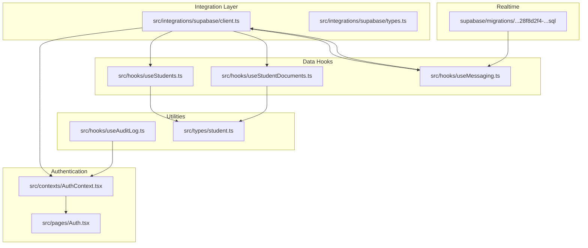
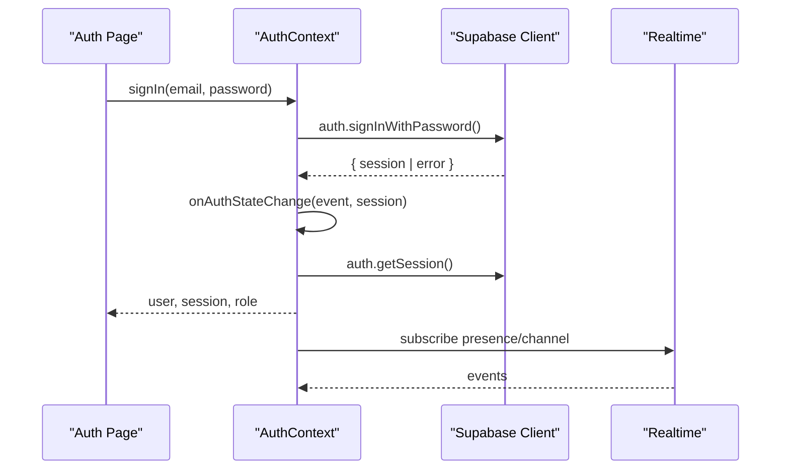
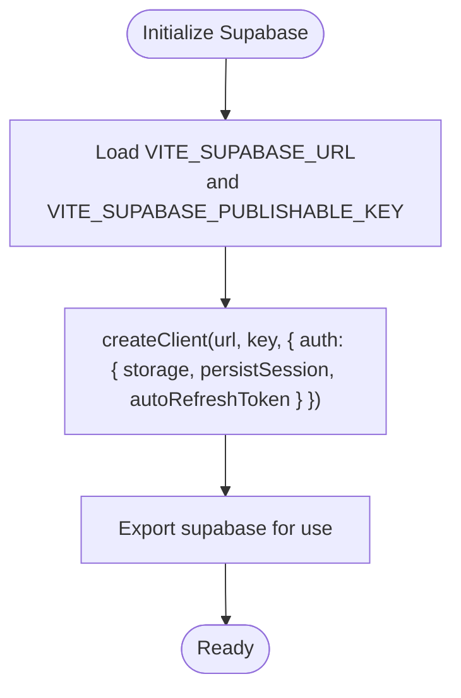
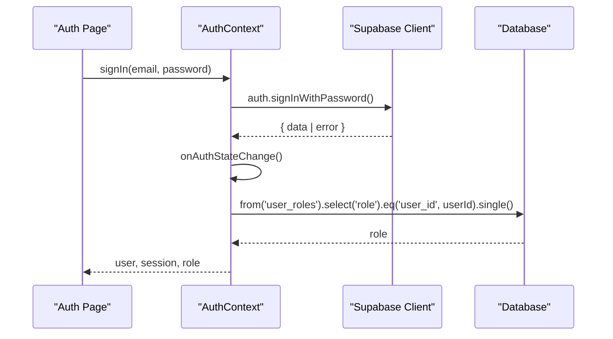
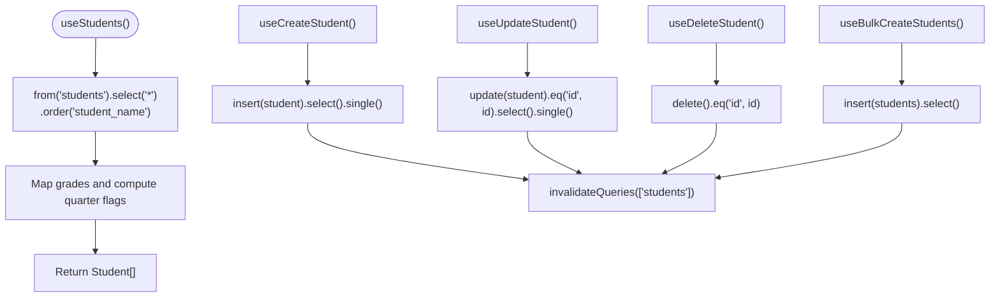
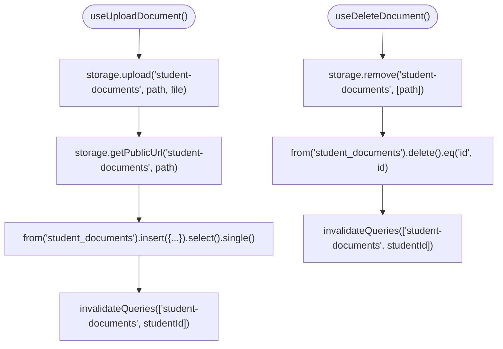
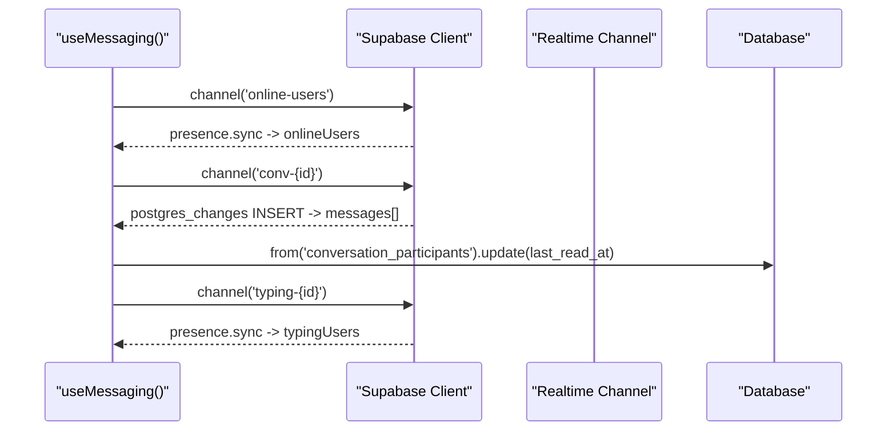
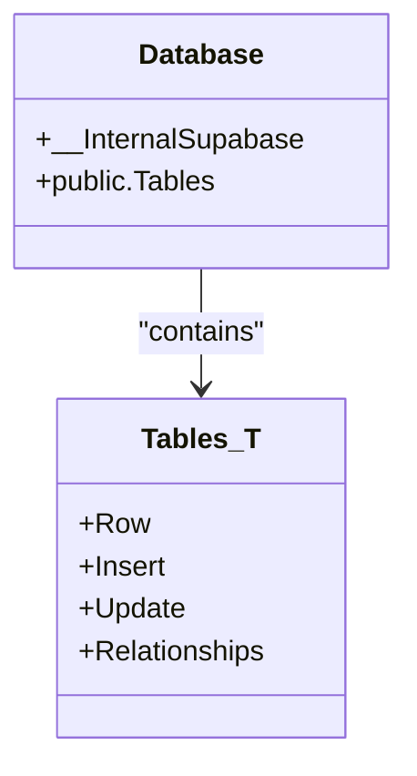
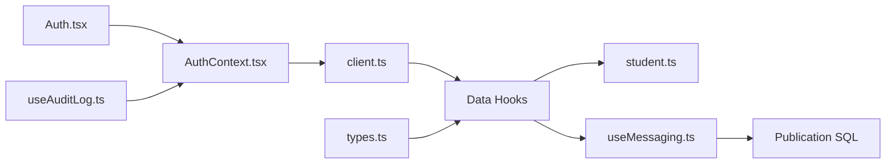

# Supabase Client API

<cite>
**Referenced Files in This Document**
- [client.ts](file://src/integrations/supabase/client.ts)
- [types.ts](file://src/integrations/supabase/types.ts)
- [AuthContext.tsx](file://src/contexts/AuthContext.tsx)
- [Auth.tsx](file://src/pages/Auth.tsx)
- [useStudents.ts](file://src/hooks/useStudents.ts)
- [useStudentDocuments.ts](file://src/hooks/useStudentDocuments.ts)
- [useMessaging.ts](file://src/hooks/useMessaging.ts)
- [useAuditLog.ts](file://src/hooks/useAuditLog.ts)
- [student.ts](file://src/types/student.ts)
- [20260208011932_28f8d2f4-1579-4159-8aa6-0c53262d92ea.sql](file://supabase/migrations/20260208011932_28f8d2f4-1579-4159-8aa6-0c53262d92ea.sql)
</cite>

## Table of Contents
1. [Introduction](#introduction)
2. [Project Structure](#project-structure)
3. [Core Components](#core-components)
4. [Architecture Overview](#architecture-overview)
5. [Detailed Component Analysis](#detailed-component-analysis)
6. [Dependency Analysis](#dependency-analysis)
7. [Performance Considerations](#performance-considerations)
8. [Troubleshooting Guide](#troubleshooting-guide)
9. [Conclusion](#conclusion)

## Introduction
This document provides comprehensive documentation for the Supabase client API used in St. Francis Portal. It covers client initialization, authentication flows, session management, database operations, real-time subscriptions, and error handling patterns. It also documents the generated TypeScript types and their usage across the application.

## Project Structure
The Supabase integration is organized under a dedicated integration module with a client factory, strongly typed database schema, and usage across authentication, data fetching, and real-time features.

**Diagram sources**
- [client.ts](file://src/integrations/supabase/client.ts#L1-L17)
- [types.ts](file://src/integrations/supabase/types.ts#L1-L800)
- [AuthContext.tsx](file://src/contexts/AuthContext.tsx#L1-L216)
- [Auth.tsx](file://src/pages/Auth.tsx#L1-L243)
- [useStudents.ts](file://src/hooks/useStudents.ts#L1-L149)
- [useStudentDocuments.ts](file://src/hooks/useStudentDocuments.ts#L1-L230)
- [useMessaging.ts](file://src/hooks/useMessaging.ts#L1-L435)
- [useAuditLog.ts](file://src/hooks/useAuditLog.ts#L1-L69)
- [student.ts](file://src/types/student.ts#L1-L82)
- [20260208011932_28f8d2f4-1579-4159-8aa6-0c53262d92ea.sql](file://supabase/migrations/20260208011932_28f8d2f4-1579-4159-8aa6-0c53262d92ea.sql#L1-L1)

**Section sources**
- [client.ts](file://src/integrations/supabase/client.ts#L1-L17)
- [types.ts](file://src/integrations/supabase/types.ts#L1-L800)

## Core Components
- Supabase client initialization with environment variables and persistence configuration
- Strongly typed database schema via generated types
- Authentication context managing user sessions, roles, and impersonation
- Data hooks for CRUD operations on students, documents, and messaging
- Real-time subscriptions for chat and presence
- Audit logging integration for authentication events

**Section sources**
- [client.ts](file://src/integrations/supabase/client.ts#L1-L17)
- [types.ts](file://src/integrations/supabase/types.ts#L1-L800)
- [AuthContext.tsx](file://src/contexts/AuthContext.tsx#L1-L216)

## Architecture Overview
The Supabase client is initialized once and shared across the application. Authentication state is managed centrally, while domain-specific hooks encapsulate database operations and real-time updates.

**Diagram sources**
- [Auth.tsx](file://src/pages/Auth.tsx#L53-L100)
- [AuthContext.tsx](file://src/contexts/AuthContext.tsx#L77-L110)
- [useMessaging.ts](file://src/hooks/useMessaging.ts#L296-L323)

## Detailed Component Analysis

### Supabase Client Initialization
The client is created with URL and publishable key from environment variables, configured with localStorage-based session persistence and automatic token refresh.

**Diagram sources**
- [client.ts](file://src/integrations/supabase/client.ts#L5-L17)

**Section sources**
- [client.ts](file://src/integrations/supabase/client.ts#L1-L17)

### Authentication Methods and Session Management
- Authentication flows: sign-in, sign-up, and sign-out
- Centralized session management with onAuthStateChange listener
- Role resolution via user_roles lookup
- Impersonation support with sessionStorage persistence
- Audit logging for login/logout and impersonation actions

**Diagram sources**
- [AuthContext.tsx](file://src/contexts/AuthContext.tsx#L77-L110)
- [AuthContext.tsx](file://src/contexts/AuthContext.tsx#L112-L130)
- [Auth.tsx](file://src/pages/Auth.tsx#L53-L100)

**Section sources**
- [AuthContext.tsx](file://src/contexts/AuthContext.tsx#L1-L216)
- [Auth.tsx](file://src/pages/Auth.tsx#L1-L243)
- [useAuditLog.ts](file://src/hooks/useAuditLog.ts#L1-L69)

### Database Operations: Students
CRUD operations for student records using typed queries and mutations with React Query integration.

**Diagram sources**
- [useStudents.ts](file://src/hooks/useStudents.ts#L11-L46)
- [useStudents.ts](file://src/hooks/useStudents.ts#L48-L125)
- [useStudents.ts](file://src/hooks/useStudents.ts#L127-L149)
- [student.ts](file://src/types/student.ts#L1-L32)

**Section sources**
- [useStudents.ts](file://src/hooks/useStudents.ts#L1-L149)
- [student.ts](file://src/types/student.ts#L1-L82)

### Database Operations: Student Documents
Storage and document management with file uploads, URL generation, and metadata updates.

**Diagram sources**
- [useStudentDocuments.ts](file://src/hooks/useStudentDocuments.ts#L22-L92)
- [useStudentDocuments.ts](file://src/hooks/useStudentDocuments.ts#L159-L192)

**Section sources**
- [useStudentDocuments.ts](file://src/hooks/useStudentDocuments.ts#L1-L230)

### Real-time Subscriptions: Messaging
Real-time chat with presence tracking, typing indicators, and automatic last-read updates.

**Diagram sources**
- [useMessaging.ts](file://src/hooks/useMessaging.ts#L296-L385)
- [20260208011932_28f8d2f4-1579-4159-8aa6-0c53262d92ea.sql](file://supabase/migrations/20260208011932_28f8d2f4-1579-4159-8aa6-0c53262d92ea.sql#L1-L1)

**Section sources**
- [useMessaging.ts](file://src/hooks/useMessaging.ts#L1-L435)
- [20260208011932_28f8d2f4-1579-4159-8aa6-0c53262d92ea.sql](file://supabase/migrations/20260208011932_28f8d2f4-1579-4159-8aa6-0c53262d92ea.sql#L1-L1)

### Generated TypeScript Types
The types module defines the full database schema with Row/Insert/Update types for each table and helper generics for typed queries.

**Diagram sources**
- [types.ts](file://src/integrations/supabase/types.ts#L9-L63)
- [types.ts](file://src/integrations/supabase/types.ts#L3951-L3970)

**Section sources**
- [types.ts](file://src/integrations/supabase/types.ts#L1-L800)

## Dependency Analysis
The application exhibits clear separation of concerns:
- Integration layer: client and types
- Domain layer: data hooks and typed models
- Infrastructure layer: authentication context and audit logging
- Realtime layer: messaging hooks and publication configuration

**Diagram sources**
- [client.ts](file://src/integrations/supabase/client.ts#L1-L17)
- [types.ts](file://src/integrations/supabase/types.ts#L1-L800)
- [useStudents.ts](file://src/hooks/useStudents.ts#L1-L149)
- [useStudentDocuments.ts](file://src/hooks/useStudentDocuments.ts#L1-L230)
- [AuthContext.tsx](file://src/contexts/AuthContext.tsx#L1-L216)
- [Auth.tsx](file://src/pages/Auth.tsx#L1-L243)
- [useAuditLog.ts](file://src/hooks/useAuditLog.ts#L1-L69)
- [useMessaging.ts](file://src/hooks/useMessaging.ts#L1-L435)
- [20260208011932_28f8d2f4-1579-4159-8aa6-0c53262d92ea.sql](file://supabase/migrations/20260208011932_28f8d2f4-1579-4159-8aa6-0c53262d92ea.sql#L1-L1)

**Section sources**
- [client.ts](file://src/integrations/supabase/client.ts#L1-L17)
- [AuthContext.tsx](file://src/contexts/AuthContext.tsx#L1-L216)
- [useMessaging.ts](file://src/hooks/useMessaging.ts#L1-L435)

## Performance Considerations
- Use React Query’s staleTime and enabled flags to minimize unnecessary network calls
- Prefer selective field queries and appropriate ordering to reduce payload sizes
- Batch operations where possible (bulk inserts) to reduce round trips
- Leverage Supabase’s automatic token refresh to avoid frequent re-authentication
- Use presence channels judiciously to avoid excessive updates

## Troubleshooting Guide
Common issues and resolutions:
- Authentication failures: Check environment variables and network connectivity; verify onAuthStateChange handler logs
- Real-time subscription errors: Ensure publication includes relevant tables and channel filters match server-side permissions
- Storage upload failures: Confirm bucket names and upsert policies; validate public URL retrieval
- Audit logging failures: Network errors are handled gracefully; monitor console for suppressed failures

**Section sources**
- [AuthContext.tsx](file://src/contexts/AuthContext.tsx#L112-L130)
- [useMessaging.ts](file://src/hooks/useMessaging.ts#L334-L362)
- [useStudentDocuments.ts](file://src/hooks/useStudentDocuments.ts#L46-L56)
- [useAuditLog.ts](file://src/hooks/useAuditLog.ts#L53-L60)

## Conclusion
St. Francis Portal integrates Supabase through a centralized client, strongly typed schema, and modular hooks. Authentication is robust with session persistence and audit logging, while data operations leverage React Query for caching and optimistic updates. Real-time features are implemented with presence and channel subscriptions, ensuring responsive user experiences.