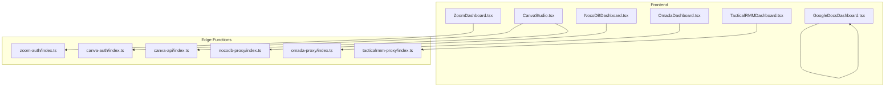
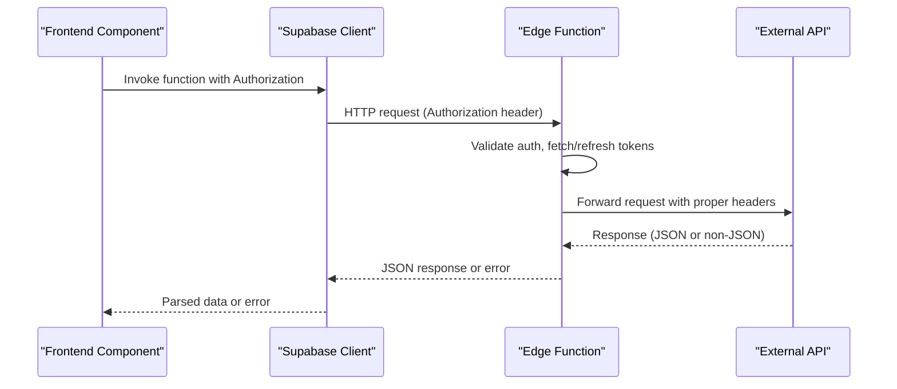
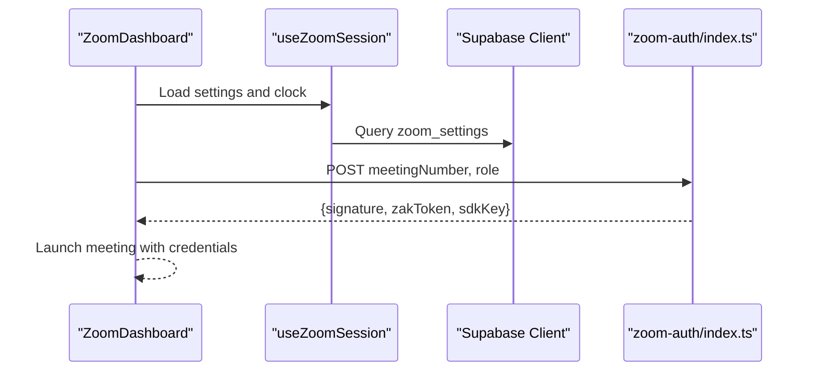
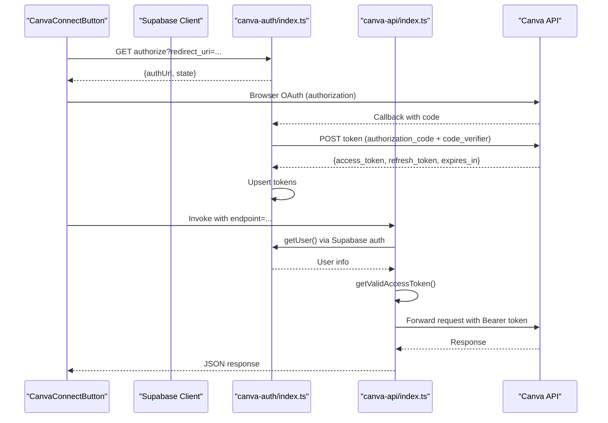
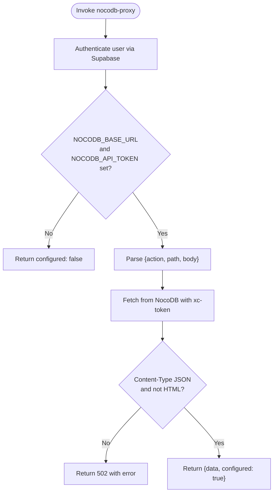
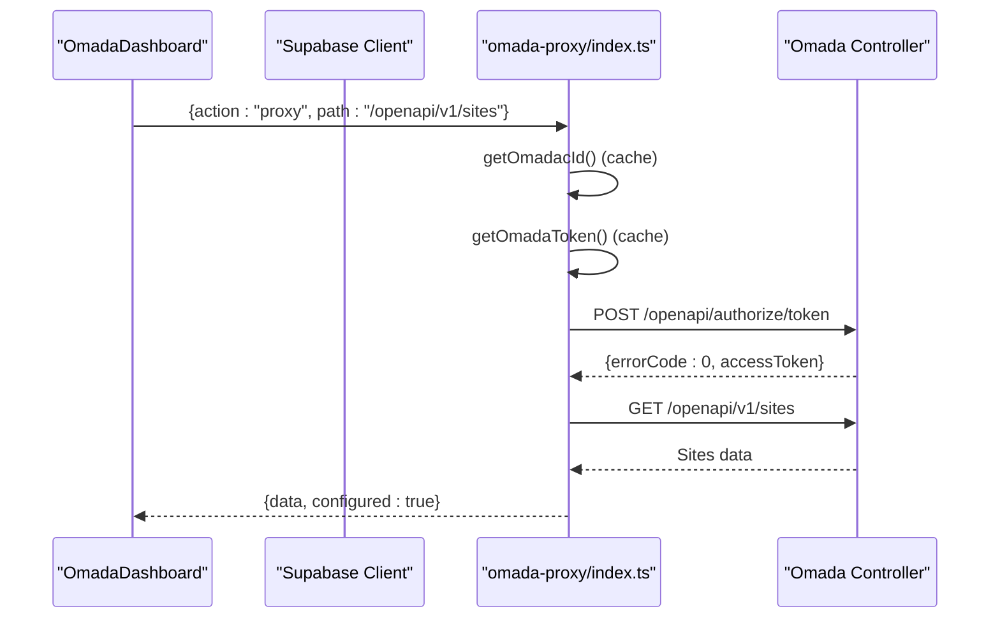
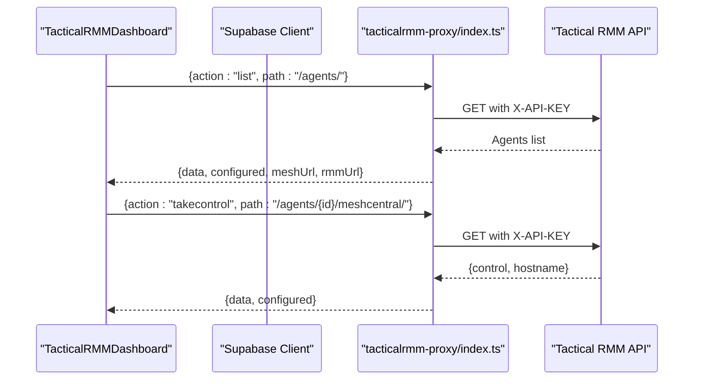
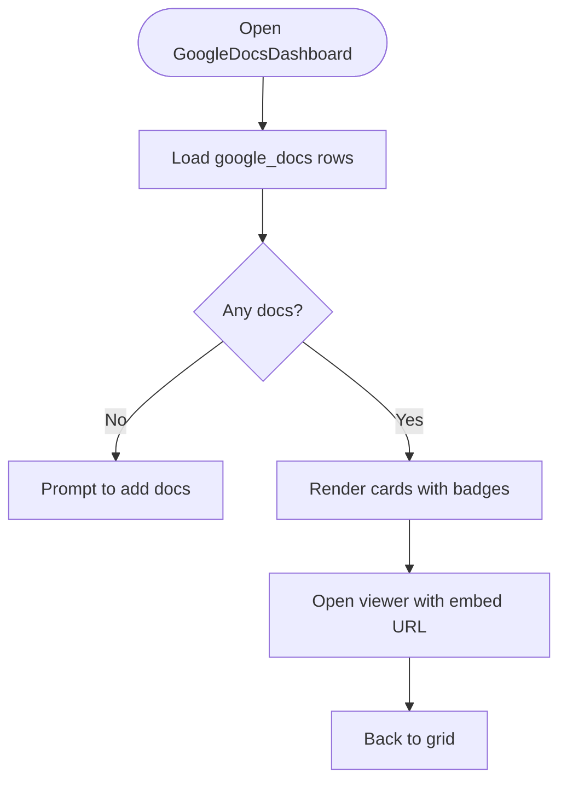
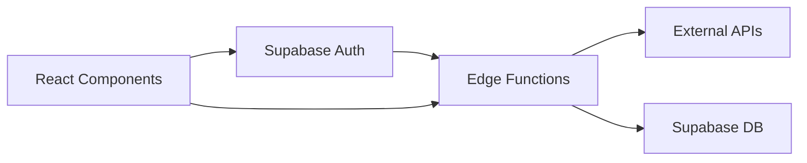

# Third-Party Integration APIs

<cite>
**Referenced Files in This Document**
- [index.ts](file://supabase/functions/canva-api/index.ts)
- [index.ts](file://supabase/functions/canva-auth/index.ts)
- [index.ts](file://supabase/functions/nocodb-proxy/index.ts)
- [index.ts](file://supabase/functions/omada-proxy/index.ts)
- [index.ts](file://supabase/functions/tacticalrmm-proxy/index.ts)
- [index.ts](file://supabase/functions/zoom-auth/index.ts)
- [CanvaConnectButton.tsx](file://src/components/canva/CanvaConnectButton.tsx)
- [CanvaStudio.tsx](file://src/components/canva/CanvaStudio.tsx)
- [NocoDBDashboard.tsx](file://src/components/nocodb/NocoDBDashboard.tsx)
- [OmadaDashboard.tsx](file://src/components/omada/OmadaDashboard.tsx)
- [TacticalRMMDashboard.tsx](file://src/components/tacticalrmm/TacticalRMMDashboard.tsx)
- [types.ts](file://src/components/tacticalrmm/types.ts)
- [GoogleDocsDashboard.tsx](file://src/components/googledocs/GoogleDocsDashboard.tsx)
- [ZoomDashboard.tsx](file://src/components/zoom/ZoomDashboard.tsx)
- [useZoomSession.ts](file://src/hooks/useZoomSession.ts)
- [.env.example](file://.env.example)
</cite>

## Table of Contents
1. [Introduction](#introduction)
2. [Project Structure](#project-structure)
3. [Core Components](#core-components)
4. [Architecture Overview](#architecture-overview)
5. [Detailed Component Analysis](#detailed-component-analysis)
6. [Dependency Analysis](#dependency-analysis)
7. [Performance Considerations](#performance-considerations)
8. [Troubleshooting Guide](#troubleshooting-guide)
9. [Conclusion](#conclusion)

## Introduction
This document describes the third-party service integration APIs used in St. Francis Portal. It covers:
- Zoom API integration for meeting credentials and session scheduling
- Canva API connections with OAuth 2.0 PKCE and proxy endpoints
- NocoDB proxy endpoints for metadata browsing and record retrieval
- Google Docs integration for embedding and managing documents
- Omada network monitoring API proxy with token caching and TLS fallback
- Tactical RMM system integration for agent listing, details, and remote control

The guide details authentication flows, API endpoints, request/response formats, error handling, and practical usage scenarios.

## Project Structure
The integrations are implemented as Supabase Edge Functions (Deno) and React components:
- Edge Functions: proxy and auth flows for external APIs
- Frontend Components: dashboards and UI for interacting with proxied services
- Hooks: frontend logic for Zoom session state and scheduling

**Diagram sources**
- [ZoomDashboard.tsx](file://src/components/zoom/ZoomDashboard.tsx#L1-L308)
- [CanvaStudio.tsx](file://src/components/canva/CanvaStudio.tsx#L1-L199)
- [NocoDBDashboard.tsx](file://src/components/nocodb/NocoDBDashboard.tsx#L1-L233)
- [OmadaDashboard.tsx](file://src/components/omada/OmadaDashboard.tsx#L1-L143)
- [TacticalRMMDashboard.tsx](file://src/components/tacticalrmm/TacticalRMMDashboard.tsx#L1-L250)
- [GoogleDocsDashboard.tsx](file://src/components/googledocs/GoogleDocsDashboard.tsx#L1-L260)
- [index.ts](file://supabase/functions/zoom-auth/index.ts#L1-L120)
- [index.ts](file://supabase/functions/canva-auth/index.ts#L1-L336)
- [index.ts](file://supabase/functions/canva-api/index.ts#L1-L161)
- [index.ts](file://supabase/functions/nocodb-proxy/index.ts#L1-L72)
- [index.ts](file://supabase/functions/omada-proxy/index.ts#L1-L145)
- [index.ts](file://supabase/functions/tacticalrmm-proxy/index.ts#L1-L116)

**Section sources**
- [ZoomDashboard.tsx](file://src/components/zoom/ZoomDashboard.tsx#L1-L308)
- [CanvaStudio.tsx](file://src/components/canva/CanvaStudio.tsx#L1-L199)
- [NocoDBDashboard.tsx](file://src/components/nocodb/NocoDBDashboard.tsx#L1-L233)
- [OmadaDashboard.tsx](file://src/components/omada/OmadaDashboard.tsx#L1-L143)
- [TacticalRMMDashboard.tsx](file://src/components/tacticalrmm/TacticalRMMDashboard.tsx#L1-L250)
- [GoogleDocsDashboard.tsx](file://src/components/googledocs/GoogleDocsDashboard.tsx#L1-L260)
- [index.ts](file://supabase/functions/zoom-auth/index.ts#L1-L120)
- [index.ts](file://supabase/functions/canva-auth/index.ts#L1-L336)
- [index.ts](file://supabase/functions/canva-api/index.ts#L1-L161)
- [index.ts](file://supabase/functions/nocodb-proxy/index.ts#L1-L72)
- [index.ts](file://supabase/functions/omada-proxy/index.ts#L1-L145)
- [index.ts](file://supabase/functions/tacticalrmm-proxy/index.ts#L1-L116)

## Core Components
- Zoom API integration
  - Backend: generates meeting credentials and signatures
  - Frontend: displays session state and controls
- Canva API integration
  - Auth: OAuth 2.0 PKCE with state and code verifier storage
  - Proxy: forwards requests with refreshed access tokens
  - Frontend: connection status, templates, and design grid
- NocoDB proxy
  - Frontend: browses bases, tables, and records
  - Proxy: validates JSON responses and handles errors
- Omada proxy
  - Frontend: controller status and site overview
  - Proxy: token caching, TLS fallback, and health checks
- Tactical RMM proxy
  - Frontend: agent list, filtering, and remote control
  - Proxy: status checks, agent listing, and MeshCentral URL retrieval
- Google Docs integration
  - Frontend: document management and embedded viewer

**Section sources**
- [index.ts](file://supabase/functions/zoom-auth/index.ts#L1-L120)
- [useZoomSession.ts](file://src/hooks/useZoomSession.ts#L1-L113)
- [index.ts](file://supabase/functions/canva-auth/index.ts#L1-L336)
- [index.ts](file://supabase/functions/canva-api/index.ts#L1-L161)
- [CanvaStudio.tsx](file://src/components/canva/CanvaStudio.tsx#L1-L199)
- [NocoDBDashboard.tsx](file://src/components/nocodb/NocoDBDashboard.tsx#L1-L233)
- [index.ts](file://supabase/functions/nocodb-proxy/index.ts#L1-L72)
- [OmadaDashboard.tsx](file://src/components/omada/OmadaDashboard.tsx#L1-L143)
- [index.ts](file://supabase/functions/omada-proxy/index.ts#L1-L145)
- [TacticalRMMDashboard.tsx](file://src/components/tacticalrmm/TacticalRMMDashboard.tsx#L1-L250)
- [types.ts](file://src/components/tacticalrmm/types.ts#L1-L32)
- [index.ts](file://supabase/functions/tacticalrmm-proxy/index.ts#L1-L116)
- [GoogleDocsDashboard.tsx](file://src/components/googledocs/GoogleDocsDashboard.tsx#L1-L260)

## Architecture Overview
The system uses Supabase Edge Functions as secure proxies to third-party APIs. The frontend invokes functions via Supabase client, passing authentication context. Functions validate credentials, refresh tokens when needed, and forward requests to external services.

**Diagram sources**
- [index.ts](file://supabase/functions/canva-api/index.ts#L73-L161)
- [index.ts](file://supabase/functions/canva-auth/index.ts#L44-L336)
- [index.ts](file://supabase/functions/nocodb-proxy/index.ts#L9-L72)
- [index.ts](file://supabase/functions/omada-proxy/index.ts#L87-L145)
- [index.ts](file://supabase/functions/tacticalrmm-proxy/index.ts#L9-L116)

## Detailed Component Analysis

### Zoom API Integration
- Authentication and credentials
  - Generates meeting credentials and JWT signatures using client credentials grant
  - Supports ZAK token generation for host participants
- Frontend integration
  - Uses hook to compute session state and countdown based on school schedule
  - Provides manual override for admin-controlled sessions

**Diagram sources**
- [ZoomDashboard.tsx](file://src/components/zoom/ZoomDashboard.tsx#L1-L308)
- [useZoomSession.ts](file://src/hooks/useZoomSession.ts#L1-L113)
- [index.ts](file://supabase/functions/zoom-auth/index.ts#L81-L120)

**Section sources**
- [index.ts](file://supabase/functions/zoom-auth/index.ts#L1-L120)
- [ZoomDashboard.tsx](file://src/components/zoom/ZoomDashboard.tsx#L1-L308)
- [useZoomSession.ts](file://src/hooks/useZoomSession.ts#L1-L113)

### Canva API Integration
- OAuth 2.0 PKCE flow
  - Generates code verifier and challenge, stores state securely
  - Exchanges authorization code for tokens and persists them
  - Handles token refresh and profile lookup
- Proxy endpoint
  - Validates user, retrieves/refreshes access token, forwards requests
  - Preserves query params and body for various HTTP methods

**Diagram sources**
- [CanvaConnectButton.tsx](file://src/components/canva/CanvaConnectButton.tsx#L1-L65)
- [index.ts](file://supabase/functions/canva-auth/index.ts#L71-L225)
- [index.ts](file://supabase/functions/canva-api/index.ts#L73-L161)

**Section sources**
- [index.ts](file://supabase/functions/canva-auth/index.ts#L1-L336)
- [index.ts](file://supabase/functions/canva-api/index.ts#L1-L161)
- [CanvaStudio.tsx](file://src/components/canva/CanvaStudio.tsx#L1-L199)
- [CanvaConnectButton.tsx](file://src/components/canva/CanvaConnectButton.tsx#L1-L65)

### NocoDB Proxy Endpoints
- Frontend
  - Browses bases, tables, and records with search and pagination
  - Handles configuration state and error feedback
- Proxy
  - Validates JSON responses and returns structured errors
  - Accepts action/method/path/body and forwards to NocoDB

**Diagram sources**
- [NocoDBDashboard.tsx](file://src/components/nocodb/NocoDBDashboard.tsx#L40-L98)
- [index.ts](file://supabase/functions/nocodb-proxy/index.ts#L9-L72)

**Section sources**
- [NocoDBDashboard.tsx](file://src/components/nocodb/NocoDBDashboard.tsx#L1-L233)
- [index.ts](file://supabase/functions/nocodb-proxy/index.ts#L1-L72)

### Omada Network Monitoring API
- Frontend
  - Displays controller status, number of sites, and site details
- Proxy
  - Caches AccessToken and omadacId to reduce auth overhead
  - Implements TLS fallback for certificate issues
  - Health check endpoint and generic proxy action

**Diagram sources**
- [OmadaDashboard.tsx](file://src/components/omada/OmadaDashboard.tsx#L17-L43)
- [index.ts](file://supabase/functions/omada-proxy/index.ts#L39-L145)

**Section sources**
- [OmadaDashboard.tsx](file://src/components/omada/OmadaDashboard.tsx#L1-L143)
- [index.ts](file://supabase/functions/omada-proxy/index.ts#L1-L145)

### Tactical RMM Integration
- Frontend
  - Lists agents, filters by status/site, and supports card/table views
  - Remote control via MeshCentral URL retrieval
- Proxy
  - Status check against agents endpoint
  - Agent detail retrieval and MeshCentral URL resolution
  - Generic proxy with configurable method/path/body

**Diagram sources**
- [TacticalRMMDashboard.tsx](file://src/components/tacticalrmm/TacticalRMMDashboard.tsx#L32-L104)
- [types.ts](file://src/components/tacticalrmm/types.ts#L1-L32)
- [index.ts](file://supabase/functions/tacticalrmm-proxy/index.ts#L9-L116)

**Section sources**
- [TacticalRMMDashboard.tsx](file://src/components/tacticalrmm/TacticalRMMDashboard.tsx#L1-L250)
- [types.ts](file://src/components/tacticalrmm/types.ts#L1-L32)
- [index.ts](file://supabase/functions/tacticalrmm-proxy/index.ts#L1-L116)

### Google Docs Integration
- Frontend
  - Adds/removes documents and opens embedded viewers
  - Detects document type and converts URLs to embeddable format

**Diagram sources**
- [GoogleDocsDashboard.tsx](file://src/components/googledocs/GoogleDocsDashboard.tsx#L53-L140)

**Section sources**
- [GoogleDocsDashboard.tsx](file://src/components/googledocs/GoogleDocsDashboard.tsx#L1-L260)

## Dependency Analysis
- Authentication and authorization
  - All proxy functions authenticate via Supabase auth.getUser using Authorization header
  - Some functions require bearer tokens from Supabase service role for internal DB operations
- Environment configuration
  - Functions read secrets from Deno.env (e.g., client IDs, base URLs, API keys)
  - Frontend reads Supabase project keys from Vite env (.env.example)
- Data models and relationships
  - Canva connections stored in a dedicated table with tokens and expiry
  - Zoom settings stored per school with schedule and breakout room URLs
  - Google Docs stored in a simple table with type and URL

**Diagram sources**
- [index.ts](file://supabase/functions/canva-auth/index.ts#L58-L69)
- [index.ts](file://supabase/functions/canva-api/index.ts#L89-L95)
- [index.ts](file://supabase/functions/nocodb-proxy/index.ts#L16-L24)
- [index.ts](file://supabase/functions/omada-proxy/index.ts#L93-L101)
- [index.ts](file://supabase/functions/tacticalrmm-proxy/index.ts#L15-L23)
- [.env.example](file://.env.example#L1-L9)

**Section sources**
- [index.ts](file://supabase/functions/canva-auth/index.ts#L1-L336)
- [index.ts](file://supabase/functions/canva-api/index.ts#L1-L161)
- [index.ts](file://supabase/functions/nocodb-proxy/index.ts#L1-L72)
- [index.ts](file://supabase/functions/omada-proxy/index.ts#L1-L145)
- [index.ts](file://supabase/functions/tacticalrmm-proxy/index.ts#L1-L116)
- [.env.example](file://.env.example#L1-L9)

## Performance Considerations
- Token caching
  - Omada proxy caches AccessToken and omadacId to minimize repeated auth calls
- Request deduplication
  - Consider adding request deduplication in frontend for frequent refresh actions
- Response parsing
  - Proxies validate content-type and guard against HTML responses to avoid parsing errors
- Network resilience
  - Omada proxy attempts HTTP fallback when TLS errors occur

[No sources needed since this section provides general guidance]

## Troubleshooting Guide
- Authentication failures
  - Verify Authorization header is passed to functions
  - Ensure Supabase project keys and service role keys are configured
- Canva OAuth
  - Confirm state and code_verifier are stored and not expired
  - Check token refresh logic and profile fetch errors
- NocoDB
  - Validate NOCODB_BASE_URL and NOCODB_API_TOKEN
  - Inspect non-JSON responses and return structured errors
- Omada
  - Check TLS certificate issues and fallback behavior
  - Verify client credentials and controller URL
- Tactical RMM
  - Confirm X-API-KEY and URL configuration
  - Validate JSON responses and MeshCentral URL retrieval
- Zoom
  - Ensure client credentials and account ID are set
  - Verify meeting number and role for credential generation

**Section sources**
- [index.ts](file://supabase/functions/canva-auth/index.ts#L133-L150)
- [index.ts](file://supabase/functions/canva-api/index.ts#L23-L52)
- [index.ts](file://supabase/functions/nocodb-proxy/index.ts#L29-L31)
- [index.ts](file://supabase/functions/nocodb-proxy/index.ts#L51-L60)
- [index.ts](file://supabase/functions/omada-proxy/index.ts#L23-L37)
- [index.ts](file://supabase/functions/omada-proxy/index.ts#L42-L56)
- [index.ts](file://supabase/functions/tacticalrmm-proxy/index.ts#L30-L32)
- [index.ts](file://supabase/functions/tacticalrmm-proxy/index.ts#L99-L104)
- [index.ts](file://supabase/functions/zoom-auth/index.ts#L87-L89)

## Conclusion
St. Francis Portal integrates multiple third-party services through secure Supabase Edge Functions. The architecture centralizes authentication, token management, and request forwarding while exposing intuitive dashboards in the frontend. By following the documented flows and troubleshooting tips, administrators can configure and maintain reliable integrations with Zoom, Canva, NocoDB, Omada, and Tactical RMM.