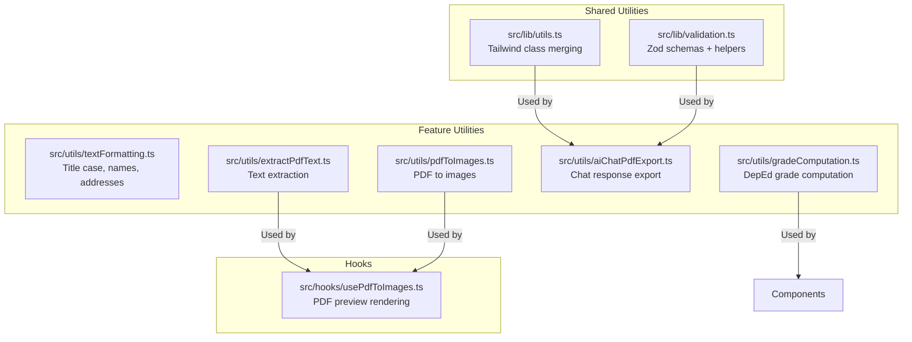
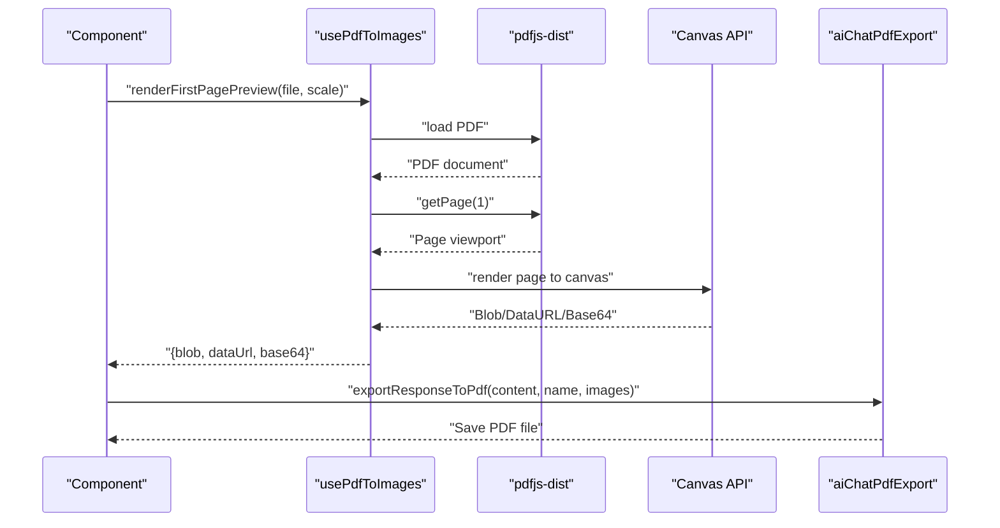
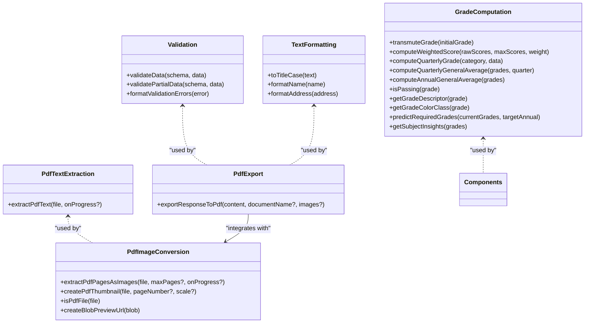
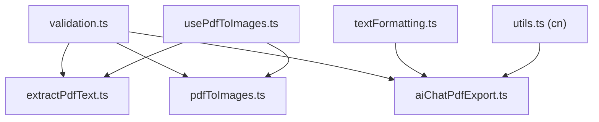

# Utility Functions API

<cite>
**Referenced Files in This Document**
- [src/lib/utils.ts](file://src/lib/utils.ts)
- [src/lib/validation.ts](file://src/lib/validation.ts)
- [src/utils/textFormatting.ts](file://src/utils/textFormatting.ts)
- [src/utils/extractPdfText.ts](file://src/utils/extractPdfText.ts)
- [src/utils/pdfToImages.ts](file://src/utils/pdfToImages.ts)
- [src/utils/aiChatPdfExport.ts](file://src/utils/aiChatPdfExport.ts)
- [src/utils/gradeComputation.ts](file://src/utils/gradeComputation.ts)
- [src/hooks/usePdfToImages.ts](file://src/hooks/usePdfToImages.ts)
</cite>

## Table of Contents
1. [Introduction](#introduction)
2. [Project Structure](#project-structure)
3. [Core Components](#core-components)
4. [Architecture Overview](#architecture-overview)
5. [Detailed Component Analysis](#detailed-component-analysis)
6. [Dependency Analysis](#dependency-analysis)
7. [Performance Considerations](#performance-considerations)
8. [Troubleshooting Guide](#troubleshooting-guide)
9. [Conclusion](#conclusion)

## Introduction
This document catalogs all utility functions and helper modules in St. Francis Portal. It focuses on formatting utilities, validation functions, PDF processing helpers, and calculation utilities. For each utility, we describe function signatures, parameters, return values, and practical usage patterns. We also show how these utilities integrate with components and hooks to support real-world workflows such as chat exports, document processing, and grade computations.

## Project Structure
Utilities are organized into two primary locations:
- Shared helpers under src/lib (general-purpose utilities and validation schemas)
- Feature-specific helpers under src/utils (formatting, PDF processing, exports, and computations)

**Diagram sources**
- [src/lib/utils.ts](file://src/lib/utils.ts#L1-L7)
- [src/lib/validation.ts](file://src/lib/validation.ts#L1-L293)
- [src/utils/textFormatting.ts](file://src/utils/textFormatting.ts#L1-L62)
- [src/utils/extractPdfText.ts](file://src/utils/extractPdfText.ts#L1-L59)
- [src/utils/pdfToImages.ts](file://src/utils/pdfToImages.ts#L1-L117)
- [src/utils/aiChatPdfExport.ts](file://src/utils/aiChatPdfExport.ts#L1-L482)
- [src/utils/gradeComputation.ts](file://src/utils/gradeComputation.ts#L1-L343)
- [src/hooks/usePdfToImages.ts](file://src/hooks/usePdfToImages.ts#L44-L96)

**Section sources**
- [src/lib/utils.ts](file://src/lib/utils.ts#L1-L7)
- [src/lib/validation.ts](file://src/lib/validation.ts#L1-L293)
- [src/utils/textFormatting.ts](file://src/utils/textFormatting.ts#L1-L62)
- [src/utils/extractPdfText.ts](file://src/utils/extractPdfText.ts#L1-L59)
- [src/utils/pdfToImages.ts](file://src/utils/pdfToImages.ts#L1-L117)
- [src/utils/aiChatPdfExport.ts](file://src/utils/aiChatPdfExport.ts#L1-L482)
- [src/utils/gradeComputation.ts](file://src/utils/gradeComputation.ts#L1-L343)
- [src/hooks/usePdfToImages.ts](file://src/hooks/usePdfToImages.ts#L44-L96)

## Core Components
This section summarizes the primary utility categories and their responsibilities.

- Formatting utilities
  - Title case conversion
  - Proper name formatting (including suffixes)
  - Address formatting with abbreviations and numeric handling

- Validation utilities
  - Zod schemas for students, users, academic years, fees, payments, grades, and messages
  - Generic validation helpers for strict and partial data parsing
  - Error formatting for user-friendly feedback

- PDF processing helpers
  - Text extraction from PDFs with progress callbacks and limits
  - Rendering PDF pages to images (WebP blobs) with configurable scales
  - Thumbnail generation for quick previews
  - PDF-to-images conversion with progress tracking

- Calculation utilities
  - DepEd K-12 grade computation (weighted components, transmutation, averages)
  - Passing grade checks and descriptive pass/fail labels
  - Grade analytics (streaks, improvements, consistency)

- Export utilities
  - AI chat response export to PDF with rich formatting, inline links/bold, YouTube embeds, and optional images
  - Automatic table of contents insertion and page numbering

- Integration helpers
  - Tailwind class merging utility
  - PDF preview rendering hook for first-page canvases and base64 previews

**Section sources**
- [src/utils/textFormatting.ts](file://src/utils/textFormatting.ts#L1-L62)
- [src/lib/validation.ts](file://src/lib/validation.ts#L1-L293)
- [src/utils/extractPdfText.ts](file://src/utils/extractPdfText.ts#L1-L59)
- [src/utils/pdfToImages.ts](file://src/utils/pdfToImages.ts#L1-L117)
- [src/utils/aiChatPdfExport.ts](file://src/utils/aiChatPdfExport.ts#L1-L482)
- [src/utils/gradeComputation.ts](file://src/utils/gradeComputation.ts#L1-L343)
- [src/lib/utils.ts](file://src/lib/utils.ts#L1-L7)
- [src/hooks/usePdfToImages.ts](file://src/hooks/usePdfToImages.ts#L44-L96)

## Architecture Overview
The utilities are designed to be reusable across components and hooks. Validation schemas ensure data integrity before processing. PDF helpers encapsulate browser-side rendering and extraction. Export utilities leverage PDF generation libraries to produce printable artifacts. Calculation utilities implement domain-specific formulas for grading.

**Diagram sources**
- [src/hooks/usePdfToImages.ts](file://src/hooks/usePdfToImages.ts#L44-L96)
- [src/utils/aiChatPdfExport.ts](file://src/utils/aiChatPdfExport.ts#L145-L481)

## Detailed Component Analysis

### Formatting Utilities
Functions for text normalization and presentation.

- toTitleCase(text)
  - Purpose: Convert arbitrary text to title case with proper capitalization.
  - Parameters: text (string | null | undefined)
  - Returns: string
  - Usage pattern: Normalize user input or display labels.

- formatName(name)
  - Purpose: Format full names with special handling for suffixes (Jr., Sr., III, etc.).
  - Parameters: name (string | null | undefined)
  - Returns: string
  - Usage pattern: Display student or staff names consistently.

- formatAddress(address)
  - Purpose: Format street addresses with selective uppercase abbreviations and numeric preservation.
  - Parameters: address (string | null | undefined)
  - Returns: string
  - Usage pattern: Clean and present address fields.

**Section sources**
- [src/utils/textFormatting.ts](file://src/utils/textFormatting.ts#L1-L62)

### Validation Utilities
Centralized Zod schemas and helpers for robust input validation.

- Zod schemas
  - Student schema: validates LRN, name, level, school, dates, age, contacts, addresses, and photos.
  - Login/Signup schemas: enforce email and password constraints.
  - Academic year schema: validates name format (YYYY-YYYY), dates, and booleans.
  - Fee item and payment schemas: enforce amounts, methods, and references.
  - Grade schema: validates quarterly scores with bounds.
  - Message schema: validates content length and media attachments.

- Helper functions
  - validateData(schema, data): returns success flag and parsed data or ZodError.
  - validatePartialData(schema, data): allows partial updates via .partial().
  - formatValidationErrors(error): converts ZodError into a readable string.

Integration patterns:
- Components call validateData before submitting forms.
- Hooks use validatePartialData for PATCH requests.
- formatValidationErrors displays concise user-facing messages.

**Section sources**
- [src/lib/validation.ts](file://src/lib/validation.ts#L1-L293)

### PDF Processing Helpers
Browser-based PDF utilities for text extraction and image rendering.

- extractPdfText(file, onProgress?)
  - Purpose: Extract text from PDF pages with progress reporting and character/page limits.
  - Parameters: file (File), onProgress? (callback with currentPage, totalPages)
  - Returns: Promise<ExtractedPdfResult> with text, pageCount, filename
  - Usage pattern: Preprocess documents for AI analysis or indexing.

- extractPdfPagesAsImages(file, maxPages?, onProgress?)
  - Purpose: Render PDF pages to WebP blobs with configurable scale.
  - Parameters: file (File), maxPages? (number), onProgress? (callback)
  - Returns: Promise<PageImage[]> with pageNumber, blob, dataUrl
  - Usage pattern: Generate thumbnails or full-resolution images for preview.

- createPdfThumbnail(file, pageNumber?, scale?)
  - Purpose: Create a small-scale preview URL for a given page.
  - Parameters: file (File), pageNumber? (number), scale? (number)
  - Returns: Promise<string> (object URL)
  - Usage pattern: Quick previews in document lists.

- isPdfFile(file)
  - Purpose: Guard to confirm file type.
  - Parameters: file (File)
  - Returns: boolean

- createBlobPreviewUrl(blob)
  - Purpose: Create object URLs for blob previews.
  - Parameters: blob (Blob)
  - Returns: string

**Section sources**
- [src/utils/extractPdfText.ts](file://src/utils/extractPdfText.ts#L1-L59)
- [src/utils/pdfToImages.ts](file://src/utils/pdfToImages.ts#L1-L117)

### PDF Export Utility (AI Chat)
Exports chat responses to a professionally formatted PDF with rich inline formatting.

- exportResponseToPdf(content, documentName?, images?)
  - Purpose: Produce a PDF from AI chat content with headings, lists, links, YouTube embeds, and optional images.
  - Parameters:
    - content (string): Markdown-like text with optional suggestion blocks
    - documentName? (string): Title for the PDF
    - images? (ChatImage[]): Optional AI-generated images embedded as data URLs
  - Returns: void (triggers download)
  - Features:
    - Automatic detection of section headers, headings, horizontal rules
    - Inline bold and links rendering
    - YouTube URL highlighting and clickable links
    - Optional embedded images
    - Automatic table of contents (when ≥3 headings)
    - Per-page footer and page numbering
    - File size warning for large outputs

Usage patterns:
- Call from a chat action to save a transcript with embedded visuals.
- Integrate with image generation flows to include AI visuals.

**Section sources**
- [src/utils/aiChatPdfExport.ts](file://src/utils/aiChatPdfExport.ts#L1-L482)

### Grade Computation Utilities
Implements DepEd K-12 grade computation and analytics.

- Types and constants
  - SubjectCategory: discriminates subject categories with category-specific weights.
  - PASSING_GRADE: threshold for passing (75).
  - GradeRecord and GradeRecordWithMetadata: typed quarterly and final grades.

- Functions
  - transmuteGrade(initialGrade): maps initial grade to DepEd transmuted rating.
  - computeWeightedScore(rawScores, maxScores, weight): computes weighted score across items.
  - computeQuarterlyGrade(category, data): returns weighted components, initial grade, and transmuted grade.
  - getSubjectCategory(subjectCode, level): infers category from subject and grade level.
  - computeQuarterlyGeneralAverage(grades, quarter): average across subjects for a quarter.
  - computeAnnualGeneralAverage(grades): average across subjects using final grades.
  - isPassing(grade): checks if grade meets passing threshold.
  - getGradeDescriptor(grade): textual descriptor based on thresholds.
  - getGradeColorClass(grade): CSS class for grade display.
  - predictRequiredGrades(currentGrades, targetAnnual): required average for remaining quarters to meet target.
  - getSubjectInsights(grades): identifies streaks, improvements, and consistency.

Usage patterns:
- Compute quarterly and annual averages in grade reports.
- Provide pass/fail descriptors and color-coded displays.
- Generate insights for teacher dashboards and student progress tracking.

**Section sources**
- [src/utils/gradeComputation.ts](file://src/utils/gradeComputation.ts#L1-L343)

### Integration Helpers
- Tailwind class merging
  - cn(...inputs): merges Tailwind classes with clsx and tailwind-merge.

- PDF preview rendering hook
  - renderFirstPagePreview(pdfFile, scale?): renders the first page to canvas, returns blob, data URL, and base64 for preview and AI analysis.

Usage patterns:
- Apply merged classes in UI components.
- Use the hook to generate previews for uploaded PDFs before analysis.

**Section sources**
- [src/lib/utils.ts](file://src/lib/utils.ts#L1-L7)
- [src/hooks/usePdfToImages.ts](file://src/hooks/usePdfToImages.ts#L44-L96)

## Architecture Overview

**Diagram sources**
- [src/lib/validation.ts](file://src/lib/validation.ts#L250-L293)
- [src/utils/textFormatting.ts](file://src/utils/textFormatting.ts#L1-L62)
- [src/utils/extractPdfText.ts](file://src/utils/extractPdfText.ts#L21-L58)
- [src/utils/pdfToImages.ts](file://src/utils/pdfToImages.ts#L70-L117)
- [src/utils/aiChatPdfExport.ts](file://src/utils/aiChatPdfExport.ts#L145-L481)
- [src/utils/gradeComputation.ts](file://src/utils/gradeComputation.ts#L75-L342)

## Dependency Analysis

**Diagram sources**
- [src/lib/validation.ts](file://src/lib/validation.ts#L1-L293)
- [src/utils/extractPdfText.ts](file://src/utils/extractPdfText.ts#L1-L59)
- [src/utils/pdfToImages.ts](file://src/utils/pdfToImages.ts#L1-L117)
- [src/utils/aiChatPdfExport.ts](file://src/utils/aiChatPdfExport.ts#L1-L482)
- [src/utils/textFormatting.ts](file://src/utils/textFormatting.ts#L1-L62)
- [src/lib/utils.ts](file://src/lib/utils.ts#L1-L7)
- [src/hooks/usePdfToImages.ts](file://src/hooks/usePdfToImages.ts#L44-L96)

**Section sources**
- [src/lib/validation.ts](file://src/lib/validation.ts#L1-L293)
- [src/utils/extractPdfText.ts](file://src/utils/extractPdfText.ts#L1-L59)
- [src/utils/pdfToImages.ts](file://src/utils/pdfToImages.ts#L1-L117)
- [src/utils/aiChatPdfExport.ts](file://src/utils/aiChatPdfExport.ts#L1-L482)
- [src/utils/textFormatting.ts](file://src/utils/textFormatting.ts#L1-L62)
- [src/lib/utils.ts](file://src/lib/utils.ts#L1-L7)
- [src/hooks/usePdfToImages.ts](file://src/hooks/usePdfToImages.ts#L44-L96)

## Performance Considerations
- PDF text extraction and image rendering are CPU-intensive. Limit maxPages and character counts to prevent memory pressure.
- Prefer thumbnails for previews; reserve full-resolution rendering for explicit actions.
- Use progress callbacks to keep UI responsive during long operations.
- Validate early with Zod to reduce downstream processing failures.

[No sources needed since this section provides general guidance]

## Troubleshooting Guide
- Validation errors
  - Use formatValidationErrors to present concise, dot-pathed messages to users.
  - For partial updates, ensure the backend handles missing fields gracefully.

- PDF export failures
  - Verify content formatting (links, bold markers) and image data URLs.
  - Check file size warnings; large exports may fail or be truncated.

- PDF rendering issues
  - Confirm worker initialization and bundled worker path.
  - Ensure requested page numbers are within document bounds.

**Section sources**
- [src/lib/validation.ts](file://src/lib/validation.ts#L288-L292)
- [src/utils/aiChatPdfExport.ts](file://src/utils/aiChatPdfExport.ts#L477-L480)
- [src/utils/extractPdfText.ts](file://src/utils/extractPdfText.ts#L1-L59)
- [src/utils/pdfToImages.ts](file://src/utils/pdfToImages.ts#L102-L116)

## Conclusion
The utility modules in St. Francis Portal provide a cohesive foundation for data validation, text formatting, PDF processing, and specialized calculations. By leveraging Zod schemas, browser-based PDF APIs, and domain-specific computation logic, the system ensures correctness, usability, and extensibility across components and workflows.