# Academic Management

<cite>
**Referenced Files in This Document**
- [AcademicYearManagement.tsx](file://src/components/curriculum/AcademicYearManagement.tsx)
- [EnrollmentManagement.tsx](file://src/components/curriculum/EnrollmentManagement.tsx)
- [PromoteStudentsWorkflow.tsx](file://src/components/curriculum/PromoteStudentsWorkflow.tsx)
- [StudentSubjectsManager.tsx](file://src/components/students/StudentSubjectsManager.tsx)
- [GradesManagement.tsx](file://src/components/grades/GradesManagement.tsx)
- [GradeApprovalQueue.tsx](file://src/components/grades/GradeApprovalQueue.tsx)
- [GradeChangeRequestDialog.tsx](file://src/components/grades/GradeChangeRequestDialog.tsx)
- [ExamScheduleManagement.tsx](file://src/components/management/ExamScheduleManagement.tsx)
- [gradeComputation.ts](file://src/utils/gradeComputation.ts)
- [student.ts](file://src/types/student.ts)
</cite>

## Table of Contents
1. [Introduction](#introduction)
2. [Project Structure](#project-structure)
3. [Core Components](#core-components)
4. [Architecture Overview](#architecture-overview)
5. [Detailed Component Analysis](#detailed-component-analysis)
6. [Dependency Analysis](#dependency-analysis)
7. [Performance Considerations](#performance-considerations)
8. [Troubleshooting Guide](#troubleshooting-guide)
9. [Conclusion](#conclusion)
10. [Appendices](#appendices)

## Introduction
This document describes the academic management system covering subject enrollment, grade management and computation, exam scheduling, and academic reporting. It explains curriculum management interfaces, student enrollment workflows, grade approval processes, academic year management, student promotion workflows, grade change requests, analytics, performance tracking, and reporting capabilities. Examples of grade calculation algorithms and academic policy implementations are included to clarify operational mechanics.

## Project Structure
The academic management system is organized by feature domains:
- Curriculum: Academic year management, enrollment automation, and student promotion
- Students: Per-student subject enrollment management
- Grades: Grade entry, computation, approval queue, and change requests
- Management: Exam scheduling aligned to academic years
- Utilities: Grade computation algorithms and shared types

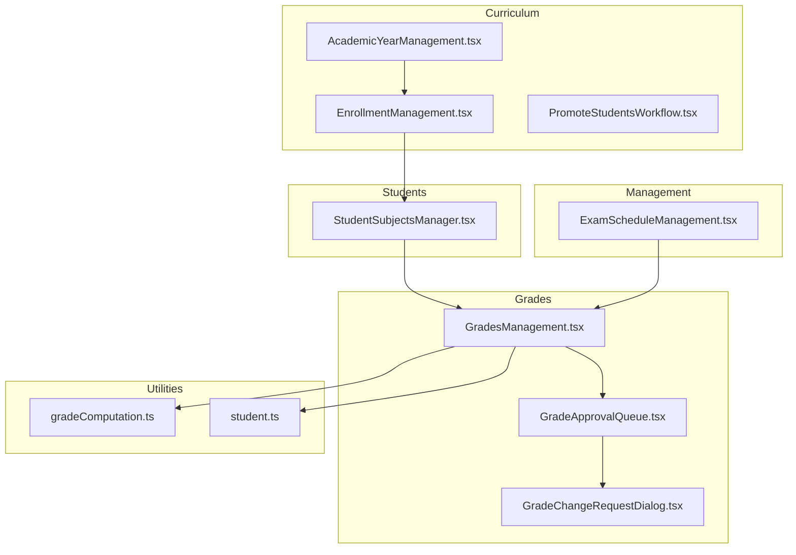

**Diagram sources**
- [AcademicYearManagement.tsx](file://src/components/curriculum/AcademicYearManagement.tsx#L1-L485)
- [EnrollmentManagement.tsx](file://src/components/curriculum/EnrollmentManagement.tsx#L1-L441)
- [PromoteStudentsWorkflow.tsx](file://src/components/curriculum/PromoteStudentsWorkflow.tsx#L1-L377)
- [StudentSubjectsManager.tsx](file://src/components/students/StudentSubjectsManager.tsx#L1-L347)
- [GradesManagement.tsx](file://src/components/grades/GradesManagement.tsx#L1-L800)
- [GradeApprovalQueue.tsx](file://src/components/grades/GradeApprovalQueue.tsx#L1-L405)
- [GradeChangeRequestDialog.tsx](file://src/components/grades/GradeChangeRequestDialog.tsx#L1-L140)
- [ExamScheduleManagement.tsx](file://src/components/management/ExamScheduleManagement.tsx#L1-L554)
- [gradeComputation.ts](file://src/utils/gradeComputation.ts#L1-L343)
- [student.ts](file://src/types/student.ts#L1-L82)

**Section sources**
- [AcademicYearManagement.tsx](file://src/components/curriculum/AcademicYearManagement.tsx#L1-L485)
- [EnrollmentManagement.tsx](file://src/components/curriculum/EnrollmentManagement.tsx#L1-L441)
- [PromoteStudentsWorkflow.tsx](file://src/components/curriculum/PromoteStudentsWorkflow.tsx#L1-L377)
- [StudentSubjectsManager.tsx](file://src/components/students/StudentSubjectsManager.tsx#L1-L347)
- [GradesManagement.tsx](file://src/components/grades/GradesManagement.tsx#L1-L800)
- [GradeApprovalQueue.tsx](file://src/components/grades/GradeApprovalQueue.tsx#L1-L405)
- [GradeChangeRequestDialog.tsx](file://src/components/grades/GradeChangeRequestDialog.tsx#L1-L140)
- [ExamScheduleManagement.tsx](file://src/components/management/ExamScheduleManagement.tsx#L1-L554)
- [gradeComputation.ts](file://src/utils/gradeComputation.ts#L1-L343)
- [student.ts](file://src/types/student.ts#L1-L82)

## Core Components
- Academic Year Management: Create, edit, set current, archive academic years; snapshot grades upon archiving; start new school year via promotion workflow.
- Enrollment Management: Auto-enroll students by grade level; view enrollment statistics; expandable per-grade-level details.
- Student Subjects Manager: Enroll/unenroll/update subject status per academic year; integrates with curriculum enrollment.
- Grades Management: Enter/edit grades per quarter; bulk entry; import/export; compute initial/transmuted grades; submit for approval; lock finalized grades.
- Grade Approval Queue: Approve/submitted/finalized statuses; review change requests; apply approved changes.
- Grade Change Request Dialog: Submit change requests for finalized grades with reasons and proposed values.
- Exam Schedule Management: Schedule exams by subject, grade level, type, quarter, date/time, and room; filter and manage schedules.
- Grade Computation Utilities: Category-based weighted scoring, transmutation, pass/fail thresholds, descriptors, analytics, and predictions.
- Student Types: Shared model for student attributes and grade presence flags.

**Section sources**
- [AcademicYearManagement.tsx](file://src/components/curriculum/AcademicYearManagement.tsx#L1-L485)
- [EnrollmentManagement.tsx](file://src/components/curriculum/EnrollmentManagement.tsx#L1-L441)
- [StudentSubjectsManager.tsx](file://src/components/students/StudentSubjectsManager.tsx#L1-L347)
- [GradesManagement.tsx](file://src/components/grades/GradesManagement.tsx#L1-L800)
- [GradeApprovalQueue.tsx](file://src/components/grades/GradeApprovalQueue.tsx#L1-L405)
- [GradeChangeRequestDialog.tsx](file://src/components/grades/GradeChangeRequestDialog.tsx#L1-L140)
- [ExamScheduleManagement.tsx](file://src/components/management/ExamScheduleManagement.tsx#L1-L554)
- [gradeComputation.ts](file://src/utils/gradeComputation.ts#L1-L343)
- [student.ts](file://src/types/student.ts#L1-L82)

## Architecture Overview
The system uses a React-based frontend with Supabase for data persistence and serverless functions for auxiliary tasks. Workflows span curriculum, enrollment, grading, approvals, and scheduling, with utilities encapsulating grade computation policies.

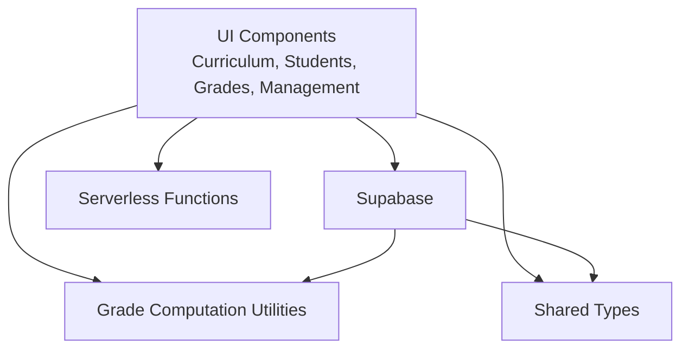

**Diagram sources**
- [AcademicYearManagement.tsx](file://src/components/curriculum/AcademicYearManagement.tsx#L1-L485)
- [EnrollmentManagement.tsx](file://src/components/curriculum/EnrollmentManagement.tsx#L1-L441)
- [StudentSubjectsManager.tsx](file://src/components/students/StudentSubjectsManager.tsx#L1-L347)
- [GradesManagement.tsx](file://src/components/grades/GradesManagement.tsx#L1-L800)
- [GradeApprovalQueue.tsx](file://src/components/grades/GradeApprovalQueue.tsx#L1-L405)
- [ExamScheduleManagement.tsx](file://src/components/management/ExamScheduleManagement.tsx#L1-L554)
- [gradeComputation.ts](file://src/utils/gradeComputation.ts#L1-L343)
- [student.ts](file://src/types/student.ts#L1-L82)

## Detailed Component Analysis

### Academic Year Management
Manages academic years, sets current year, archives years (with immutable grade snapshots), and triggers promotion workflow.

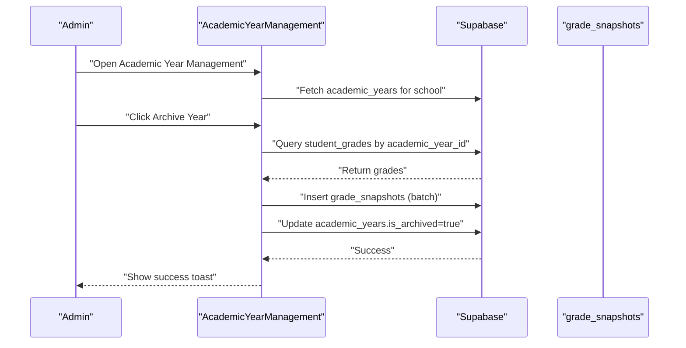

**Diagram sources**
- [AcademicYearManagement.tsx](file://src/components/curriculum/AcademicYearManagement.tsx#L188-L242)

**Section sources**
- [AcademicYearManagement.tsx](file://src/components/curriculum/AcademicYearManagement.tsx#L1-L485)

### Enrollment Management
Automatically enrolls students by grade level into subjects for the selected academic year and displays enrollment statistics.

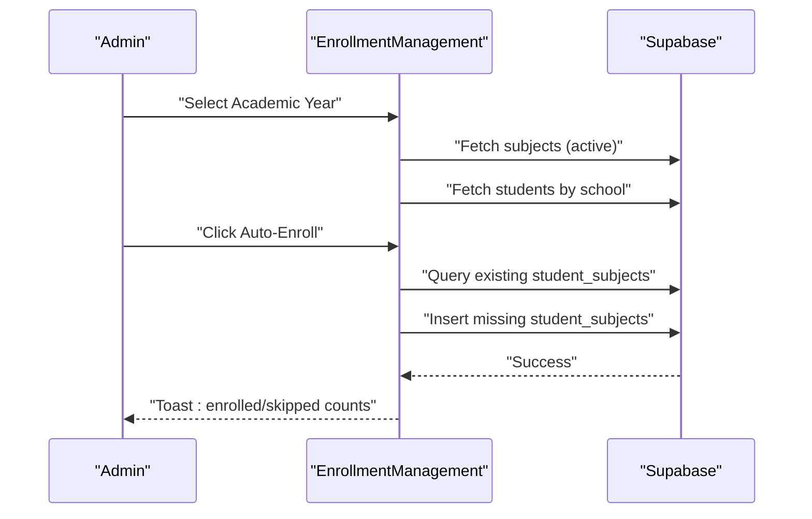

**Diagram sources**
- [EnrollmentManagement.tsx](file://src/components/curriculum/EnrollmentManagement.tsx#L192-L248)

**Section sources**
- [EnrollmentManagement.tsx](file://src/components/curriculum/EnrollmentManagement.tsx#L1-L441)

### Student Subjects Manager
Per-student enrollment management with status updates and unenrollment.

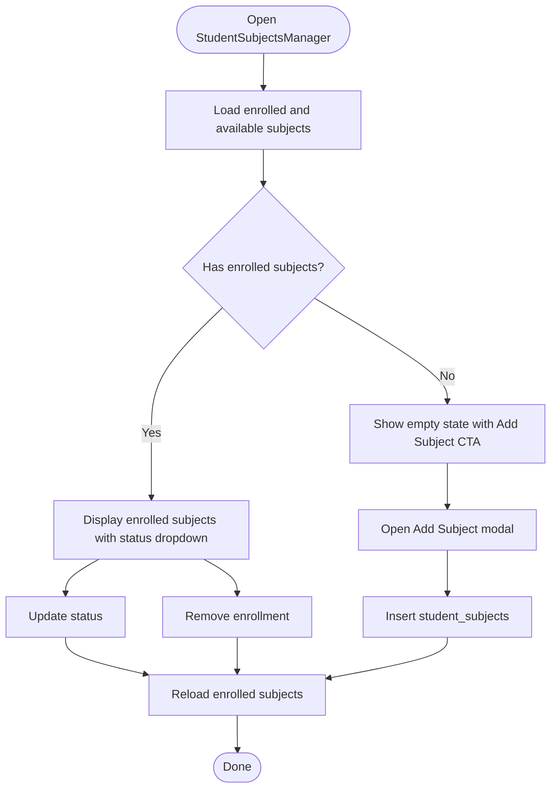

**Diagram sources**
- [StudentSubjectsManager.tsx](file://src/components/students/StudentSubjectsManager.tsx#L67-L186)

**Section sources**
- [StudentSubjectsManager.tsx](file://src/components/students/StudentSubjectsManager.tsx#L1-L347)

### Grades Management
Handles grade entry, bulk entry, import/export, submission, and finalization. Integrates with grade computation utilities.

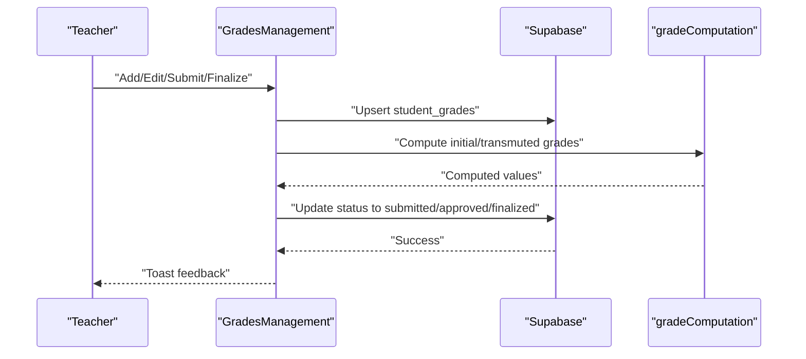

**Diagram sources**
- [GradesManagement.tsx](file://src/components/grades/GradesManagement.tsx#L386-L457)
- [gradeComputation.ts](file://src/utils/gradeComputation.ts#L110-L143)

**Section sources**
- [GradesManagement.tsx](file://src/components/grades/GradesManagement.tsx#L1-L800)
- [gradeComputation.ts](file://src/utils/gradeComputation.ts#L1-L343)

### Grade Approval Queue
Approve submissions, mark ready to finalize, and review change requests.

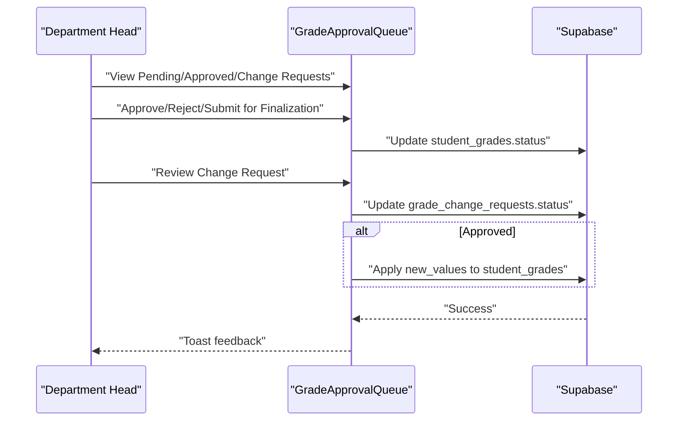

**Diagram sources**
- [GradeApprovalQueue.tsx](file://src/components/grades/GradeApprovalQueue.tsx#L105-L177)

**Section sources**
- [GradeApprovalQueue.tsx](file://src/components/grades/GradeApprovalQueue.tsx#L1-L405)

### Grade Change Request Dialog
Submits change requests for finalized grades with reasons and proposed values.

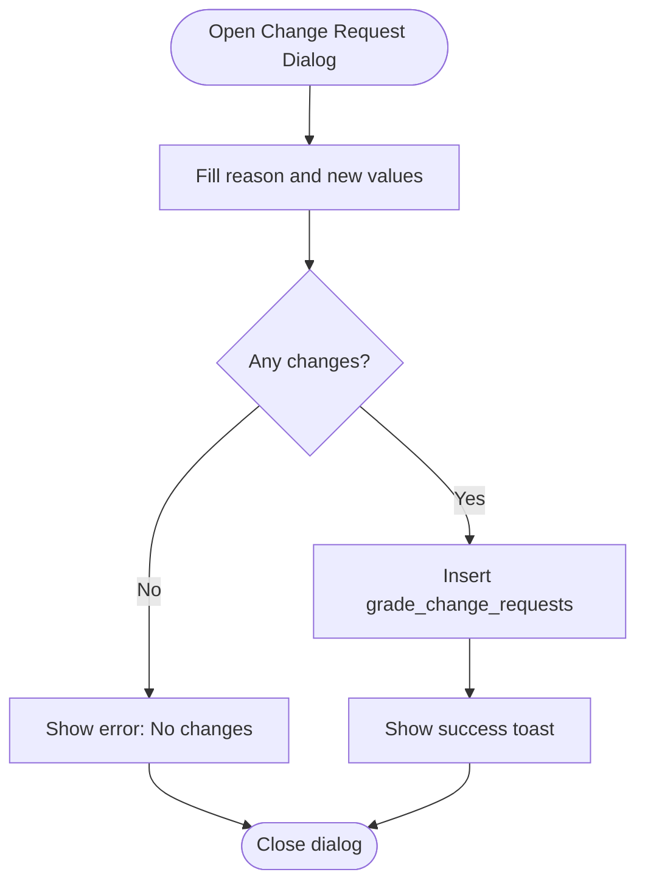

**Diagram sources**
- [GradeChangeRequestDialog.tsx](file://src/components/grades/GradeChangeRequestDialog.tsx#L41-L89)

**Section sources**
- [GradeChangeRequestDialog.tsx](file://src/components/grades/GradeChangeRequestDialog.tsx#L1-L140)

### Exam Schedule Management
Schedules exams by subject, grade level, type, quarter, date/time, and room; supports filtering and CRUD operations.

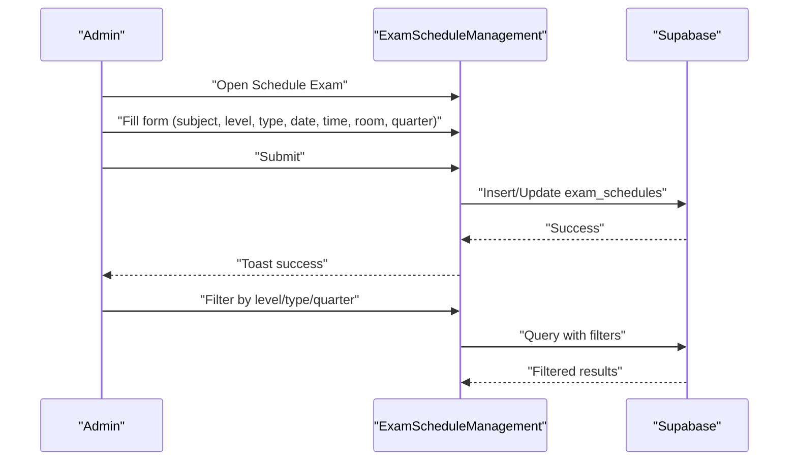

**Diagram sources**
- [ExamScheduleManagement.tsx](file://src/components/management/ExamScheduleManagement.tsx#L120-L171)

**Section sources**
- [ExamScheduleManagement.tsx](file://src/components/management/ExamScheduleManagement.tsx#L1-L554)

### Grade Computation Algorithms and Academic Policies
- Category-based weighted scoring for components (Written Work, Performance Task, Quarterly Assessment)
- Transmutation from initial percentage to 100-point scale
- Pass/fail threshold and descriptors
- General averages and annual averages
- Predictive analytics for target annual averages
- Subject insights (streaks, improvements, consistency)

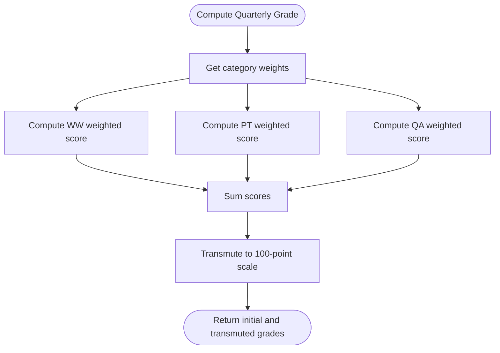

**Diagram sources**
- [gradeComputation.ts](file://src/utils/gradeComputation.ts#L110-L143)
- [gradeComputation.ts](file://src/utils/gradeComputation.ts#L75-L86)

**Section sources**
- [gradeComputation.ts](file://src/utils/gradeComputation.ts#L1-L343)

### Student Promotion Workflow
Promotes students to the next grade level, retains, or marks as graduated; activates the new academic year.

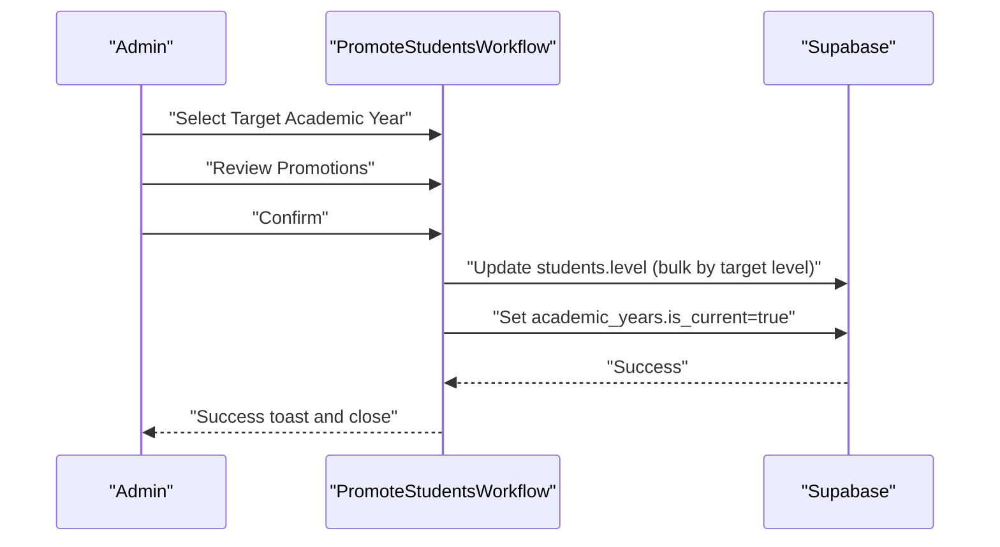

**Diagram sources**
- [PromoteStudentsWorkflow.tsx](file://src/components/curriculum/PromoteStudentsWorkflow.tsx#L119-L174)

**Section sources**
- [PromoteStudentsWorkflow.tsx](file://src/components/curriculum/PromoteStudentsWorkflow.tsx#L1-L377)

## Dependency Analysis
- Components depend on Supabase for data operations and serverless functions for auxiliary tasks (e.g., holiday sync).
- Grades Management depends on grade computation utilities for policy-driven calculations.
- Academic Year Management coordinates with grade snapshotting to enforce immutability.
- Student Subjects Manager depends on Academic Year Context for per-year enrollment.
- Exam Schedule Management depends on Academic Year Context for scoping schedules.

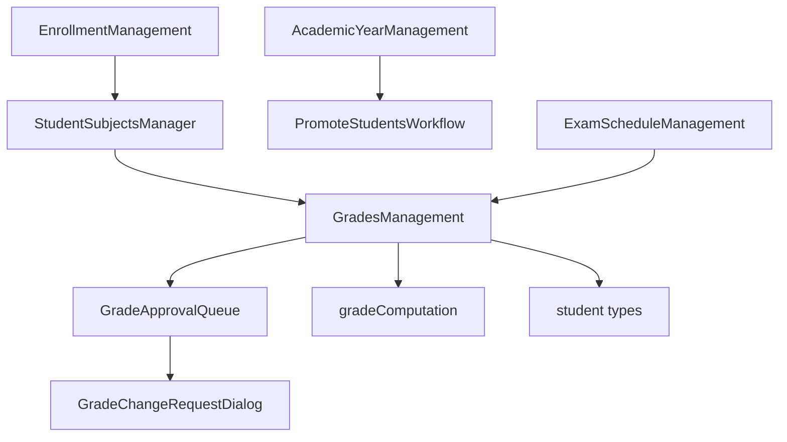

**Diagram sources**
- [EnrollmentManagement.tsx](file://src/components/curriculum/EnrollmentManagement.tsx#L1-L441)
- [StudentSubjectsManager.tsx](file://src/components/students/StudentSubjectsManager.tsx#L1-L347)
- [GradesManagement.tsx](file://src/components/grades/GradesManagement.tsx#L1-L800)
- [GradeApprovalQueue.tsx](file://src/components/grades/GradeApprovalQueue.tsx#L1-L405)
- [GradeChangeRequestDialog.tsx](file://src/components/grades/GradeChangeRequestDialog.tsx#L1-L140)
- [AcademicYearManagement.tsx](file://src/components/curriculum/AcademicYearManagement.tsx#L1-L485)
- [PromoteStudentsWorkflow.tsx](file://src/components/curriculum/PromoteStudentsWorkflow.tsx#L1-L377)
- [ExamScheduleManagement.tsx](file://src/components/management/ExamScheduleManagement.tsx#L1-L554)
- [gradeComputation.ts](file://src/utils/gradeComputation.ts#L1-L343)
- [student.ts](file://src/types/student.ts#L1-L82)

**Section sources**
- [AcademicYearManagement.tsx](file://src/components/curriculum/AcademicYearManagement.tsx#L1-L485)
- [EnrollmentManagement.tsx](file://src/components/curriculum/EnrollmentManagement.tsx#L1-L441)
- [PromoteStudentsWorkflow.tsx](file://src/components/curriculum/PromoteStudentsWorkflow.tsx#L1-L377)
- [StudentSubjectsManager.tsx](file://src/components/students/StudentSubjectsManager.tsx#L1-L347)
- [GradesManagement.tsx](file://src/components/grades/GradesManagement.tsx#L1-L800)
- [GradeApprovalQueue.tsx](file://src/components/grades/GradeApprovalQueue.tsx#L1-L405)
- [GradeChangeRequestDialog.tsx](file://src/components/grades/GradeChangeRequestDialog.tsx#L1-L140)
- [ExamScheduleManagement.tsx](file://src/components/management/ExamScheduleManagement.tsx#L1-L554)
- [gradeComputation.ts](file://src/utils/gradeComputation.ts#L1-L343)
- [student.ts](file://src/types/student.ts#L1-L82)

## Performance Considerations
- Use serverless functions for batch operations (e.g., auto-enrollment) to avoid long-running client-side loops.
- Implement pagination and filtering for large datasets (grades, exams, enrollments).
- Debounce search inputs and use efficient queries with targeted filters.
- Cache frequently accessed lists (subjects, academic years) to reduce redundant network calls.
- Batch upserts for import/export operations to minimize round trips.

## Troubleshooting Guide
- Academic Year Archive: Ensure no concurrent edits during snapshot creation; verify grade snapshots were inserted and year is marked archived.
- Auto-Enrollment: Confirm selected academic year and school context; check for duplicates before insert.
- Grade Submission/Finalization: Verify status transitions and user permissions; ensure finalized grades are protected from direct edits.
- Change Requests: Validate reason length and detect actual value changes; ensure approvals apply only when approved.
- Exam Scheduling: Validate required fields and date comparisons; ensure filters are applied consistently.

**Section sources**
- [AcademicYearManagement.tsx](file://src/components/curriculum/AcademicYearManagement.tsx#L188-L242)
- [EnrollmentManagement.tsx](file://src/components/curriculum/EnrollmentManagement.tsx#L192-L248)
- [GradesManagement.tsx](file://src/components/grades/GradesManagement.tsx#L386-L457)
- [GradeApprovalQueue.tsx](file://src/components/grades/GradeApprovalQueue.tsx#L105-L177)
- [GradeChangeRequestDialog.tsx](file://src/components/grades/GradeChangeRequestDialog.tsx#L41-L89)
- [ExamScheduleManagement.tsx](file://src/components/management/ExamScheduleManagement.tsx#L210-L217)

## Conclusion
The academic management system provides a cohesive suite of tools for curriculum administration, student enrollment, grade management with policy-compliant computation, exam scheduling, and approval workflows. Its modular components integrate with Supabase for robust data operations and with serverless functions for scalable auxiliary tasks. The grade computation utilities embed DepEd policies, while the approval and change request mechanisms ensure governance and auditability.

## Appendices

### Academic Policy and Computation Examples
- Category weights and transmutation table define how raw scores are aggregated and converted.
- Passing threshold and descriptors guide academic evaluation.
- General and annual averages support reporting and classification.
- Predictive analytics assist in advising students toward targets.

**Section sources**
- [gradeComputation.ts](file://src/utils/gradeComputation.ts#L14-L21)
- [gradeComputation.ts](file://src/utils/gradeComputation.ts#L28-L70)
- [gradeComputation.ts](file://src/utils/gradeComputation.ts#L167-L167)
- [gradeComputation.ts](file://src/utils/gradeComputation.ts#L196-L220)
- [gradeComputation.ts](file://src/utils/gradeComputation.ts#L256-L271)