# Academic Year Management

<cite>
**Referenced Files in This Document**
- [AcademicYearContext.tsx](file://src/contexts/AcademicYearContext.tsx)
- [AcademicYearManagement.tsx](file://src/components/curriculum/AcademicYearManagement.tsx)
- [PromoteStudentsWorkflow.tsx](file://src/components/curriculum/PromoteStudentsWorkflow.tsx)
- [YearEndClose.tsx](file://src/components/finance/YearEndClose.tsx)
- [schoolYearQuery.ts](file://src/utils/schoolYearQuery.ts)
- [validation.ts](file://src/lib/validation.ts)
- [20260205040000_school_year_segregation.sql](file://supabase/migrations/20260205040000_school_year_segregation.sql)
- [20260207230259_6e499098-0e40-42e8-9ef1-3617061337e8.sql](file://supabase/migrations/20260207230259_6e499098-0e40-42e8-9ef1-3617061337e8.sql)
- [types.ts](file://src/integrations/supabase/types.ts)
- [TransmutationManager.tsx](file://src/components/students/TransmutationManager.tsx)
- [gradeComputation.ts](file://src/utils/gradeComputation.ts)
- [schoolIdMap.ts](file://src/utils/schoolIdMap.ts)
- [useSchoolId.ts](file://src/hooks/useSchoolId.ts)
- [setup_school.mjs](file://setup_school.mjs)
- [SchoolContext.tsx](file://src/contexts/SchoolContext.tsx)
</cite>

## Update Summary
**Changes Made**
- Updated database-level school context loading solution documentation
- Added new schoolIdMap utility and useSchoolId hook implementation
- Documented the transition from frontend fixes to database-level migration process
- Updated AcademicYearContext to reference correct school ID via schoolIdMap
- Added setup_school.mjs script for database initialization
- Enhanced data segregation enforcement with validation triggers

## Table of Contents
1. [Introduction](#introduction)
2. [Project Structure](#project-structure)
3. [Core Components](#core-components)
4. [Architecture Overview](#architecture-overview)
5. [Detailed Component Analysis](#detailed-component-analysis)
6. [Dependency Analysis](#dependency-analysis)
7. [Performance Considerations](#performance-considerations)
8. [Troubleshooting Guide](#troubleshooting-guide)
9. [Conclusion](#conclusion)

## Introduction
This document provides comprehensive documentation for the academic year management functionality within the St. Francis Xavier Portal. It covers academic year configuration, term setup, school year tracking, the academic year context provider, year-end procedures, academic year transitions, and data segregation between years. The system has evolved from frontend fixes for infinite loop issues to a cleaner database-level migration process that removes stale academic year data and creates new records with correct UUID mappings. It also documents integration with student promotion workflows, grade computation, and year-specific reporting capabilities.

## Project Structure
The academic year management system spans frontend React components, shared utilities, and backend database migrations that enforce school and academic year segregation. Key areas include:
- Context provider for managing the active academic year across the application
- Administrative UI for creating, editing, archiving, and transitioning academic years
- Student promotion workflow that advances students to the next grade level
- Year-end closing and carry-forward functionality for financial records
- Data segregation utilities ensuring records remain isolated by school and academic year
- Grade computation and transmutation utilities integrated with academic year boundaries
- Database-level school context loading solution with validation triggers

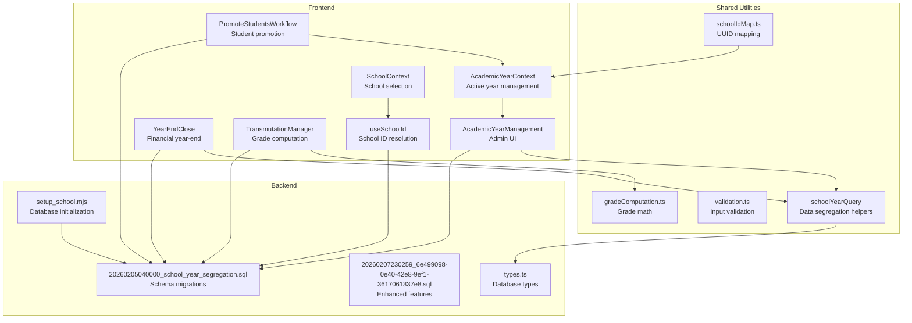

**Diagram sources**
- [AcademicYearContext.tsx](file://src/contexts/AcademicYearContext.tsx#L1-L116)
- [AcademicYearManagement.tsx](file://src/components/curriculum/AcademicYearManagement.tsx#L1-L587)
- [PromoteStudentsWorkflow.tsx](file://src/components/curriculum/PromoteStudentsWorkflow.tsx#L1-L377)
- [YearEndClose.tsx](file://src/components/finance/YearEndClose.tsx#L1-L380)
- [TransmutationManager.tsx](file://src/components/students/TransmutationManager.tsx#L1-L479)
- [schoolYearQuery.ts](file://src/utils/schoolYearQuery.ts#L1-L219)
- [validation.ts](file://src/lib/validation.ts#L136-L148)
- [20260205040000_school_year_segregation.sql](file://supabase/migrations/20260205040000_school_year_segregation.sql#L1-L264)
- [20260207230259_6e499098-0e40-42e8-9ef1-3617061337e8.sql](file://supabase/migrations/20260207230259_6e499098-0e40-42e8-9ef1-3617061337e8.sql#L1-L136)
- [types.ts](file://src/integrations/supabase/types.ts#L17-L62)
- [schoolIdMap.ts](file://src/utils/schoolIdMap.ts#L1-L14)
- [useSchoolId.ts](file://src/hooks/useSchoolId.ts#L1-L45)
- [setup_school.mjs](file://setup_school.mjs#L1-L72)

**Section sources**
- [AcademicYearContext.tsx](file://src/contexts/AcademicYearContext.tsx#L1-L116)
- [AcademicYearManagement.tsx](file://src/components/curriculum/AcademicYearManagement.tsx#L1-L587)
- [schoolYearQuery.ts](file://src/utils/schoolYearQuery.ts#L1-L219)
- [20260205040000_school_year_segregation.sql](file://supabase/migrations/20260205040000_school_year_segregation.sql#L1-L264)

## Core Components
- Academic Year Context Provider: Centralizes the active academic year selection and persistence, ensuring consistent year context across the app with database-level school context loading.
- Academic Year Management UI: Enables administrators to configure academic years, validate date ranges, set current year, and archive past years using the resolved school ID.
- Student Promotion Workflow: Automates student level advancement and activates the new academic year in a controlled, auditable manner.
- Year-End Close and Carry Forward: Manages financial year closure and carries outstanding balances to the next academic year.
- Data Segregation Utilities: Enforces school and academic year isolation for all data operations with validation triggers.
- Grade Computation and Transmutation: Provides DepEd-compliant grade calculation and transmutation integrated with academic year boundaries.
- School Context Resolution: Provides centralized school ID mapping and database-level school context loading with fallback mechanisms.

**Section sources**
- [AcademicYearContext.tsx](file://src/contexts/AcademicYearContext.tsx#L1-L116)
- [AcademicYearManagement.tsx](file://src/components/curriculum/AcademicYearManagement.tsx#L1-L587)
- [PromoteStudentsWorkflow.tsx](file://src/components/curriculum/PromoteStudentsWorkflow.tsx#L1-L377)
- [YearEndClose.tsx](file://src/components/finance/YearEndClose.tsx#L1-L380)
- [schoolYearQuery.ts](file://src/utils/schoolYearQuery.ts#L1-L219)
- [gradeComputation.ts](file://src/utils/gradeComputation.ts#L1-L343)
- [schoolIdMap.ts](file://src/utils/schoolIdMap.ts#L1-L14)
- [useSchoolId.ts](file://src/hooks/useSchoolId.ts#L1-L45)

## Architecture Overview
The system enforces strict data segregation by school and academic year at both the database and application layers. The academic year context provider resolves the selected school code to a UUID via the schools table and loads academic years filtered by school. All database operations leverage shared helpers that inject school_id and academic_year_id filters automatically, preventing cross-school or cross-year data leakage. The database-level migration process ensures data integrity by removing stale academic year data and creating new records with correct UUID mappings.

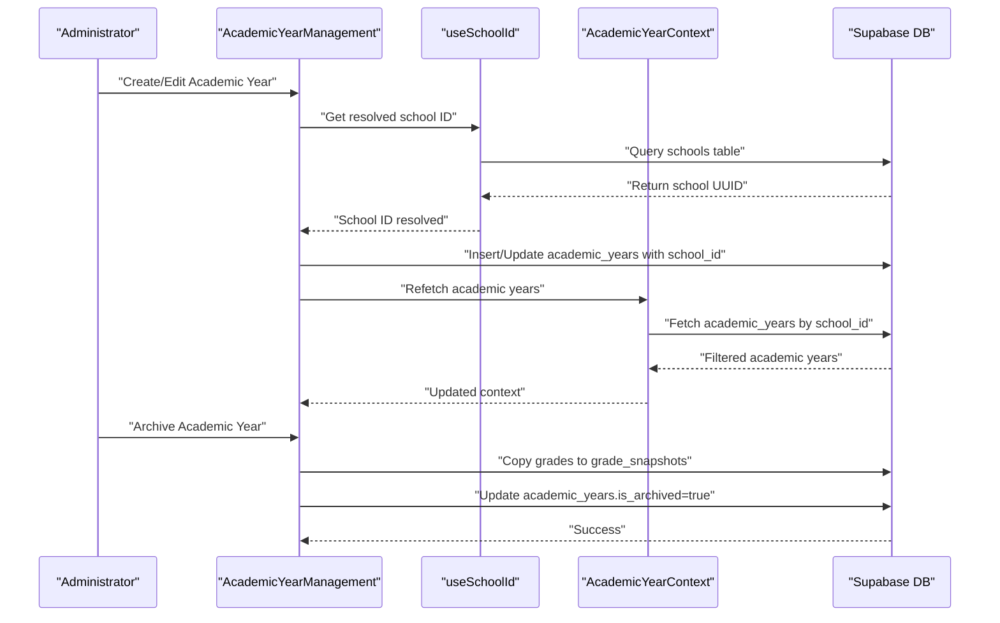

**Diagram sources**
- [AcademicYearManagement.tsx](file://src/components/curriculum/AcademicYearManagement.tsx#L40-L82)
- [useSchoolId.ts](file://src/hooks/useSchoolId.ts#L11-L43)
- [AcademicYearContext.tsx](file://src/contexts/AcademicYearContext.tsx#L34-L45)
- [AcademicYearContext.tsx](file://src/contexts/AcademicYearContext.tsx#L47-L79)

## Detailed Component Analysis

### Academic Year Context Provider
The AcademicYearContext manages the active academic year for the current school with database-level school context loading. It:
- Resolves the selected school code to a UUID via the schools table using Supabase query
- Loads academic years for the resolved school, ordered by start_date descending
- Automatically selects a default current year if none is set
- Persists the selected year in local storage and exposes refetch capability
- Handles infinite loop prevention through proper dependency management

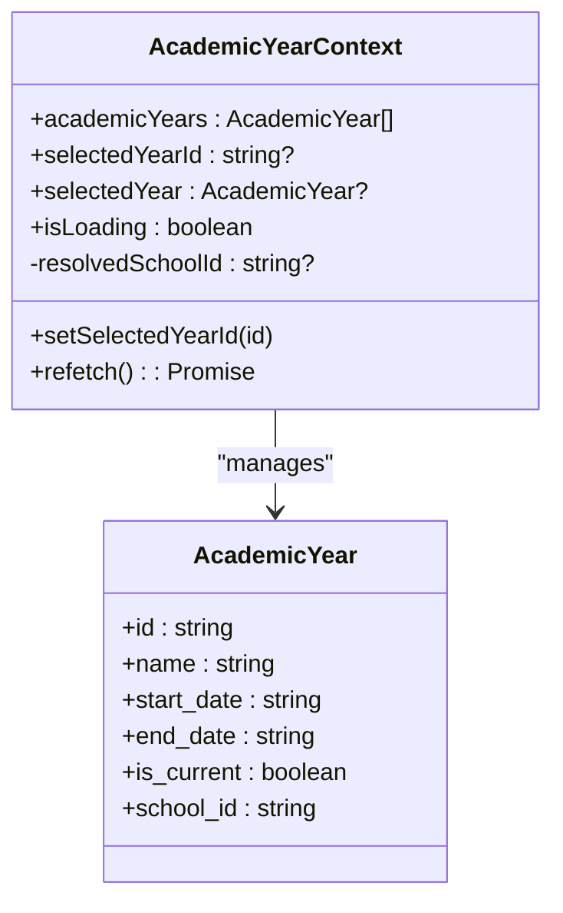

**Diagram sources**
- [AcademicYearContext.tsx](file://src/contexts/AcademicYearContext.tsx#L5-L21)
- [AcademicYearContext.tsx](file://src/contexts/AcademicYearContext.tsx#L25-L107)

**Section sources**
- [AcademicYearContext.tsx](file://src/contexts/AcademicYearContext.tsx#L1-L116)

### Academic Year Management UI
The AcademicYearManagement component provides administrative controls for academic year lifecycle with database-level school context resolution:
- Uses useSchoolId hook to resolve school ID before performing operations
- CRUD operations for academic years scoped to the resolved school ID
- Validation for required fields and date range logic
- Current year designation with automatic unsetting of prior current year
- Archive workflow that creates immutable grade snapshots and locks editing
- Integration with holiday synchronization and student promotion initiation

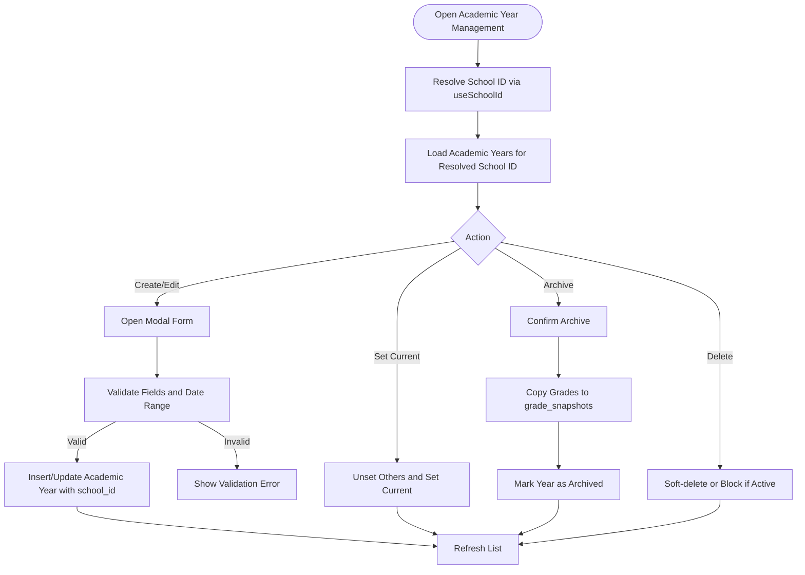

**Diagram sources**
- [AcademicYearManagement.tsx](file://src/components/curriculum/AcademicYearManagement.tsx#L40-L82)
- [AcademicYearManagement.tsx](file://src/components/curriculum/AcademicYearManagement.tsx#L100-L190)
- [AcademicYearManagement.tsx](file://src/components/curriculum/AcademicYearManagement.tsx#L192-L228)
- [AcademicYearManagement.tsx](file://src/components/curriculum/AcademicYearManagement.tsx#L271-L329)

**Section sources**
- [AcademicYearManagement.tsx](file://src/components/curriculum/AcademicYearManagement.tsx#L1-L587)

### School Context Resolution System
The school context resolution system provides centralized school ID mapping and database-level loading:
- schoolIdMap utility provides static UUID mapping for school codes
- useSchoolId hook resolves school codes to UUIDs via database queries
- Fallback mechanisms handle cases where direct code lookup fails
- Cached results prevent excessive database queries
- Integration with AcademicYearContext for seamless school context loading

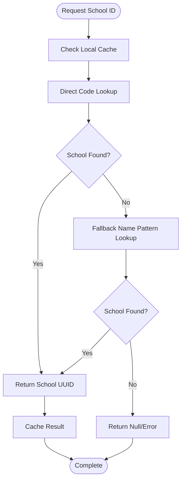

**Diagram sources**
- [useSchoolId.ts](file://src/hooks/useSchoolId.ts#L11-L43)
- [schoolIdMap.ts](file://src/utils/schoolIdMap.ts#L1-L14)

**Section sources**
- [useSchoolId.ts](file://src/hooks/useSchoolId.ts#L1-L45)
- [schoolIdMap.ts](file://src/utils/schoolIdMap.ts#L1-L14)

### Database-Level School Context Loading Solution
The database-level migration process addresses infinite loop issues by:
- Creating a dedicated schools table with UUID primary keys
- Migrating existing academic year data to correct school UUIDs
- Implementing validation triggers to prevent data segregation violations
- Providing setup scripts for database initialization
- Ensuring data integrity through row-level security policies

**Updated** The system now uses a database-level approach that removes stale academic year data and creates new records with correct UUID mappings, eliminating frontend infinite loop issues.

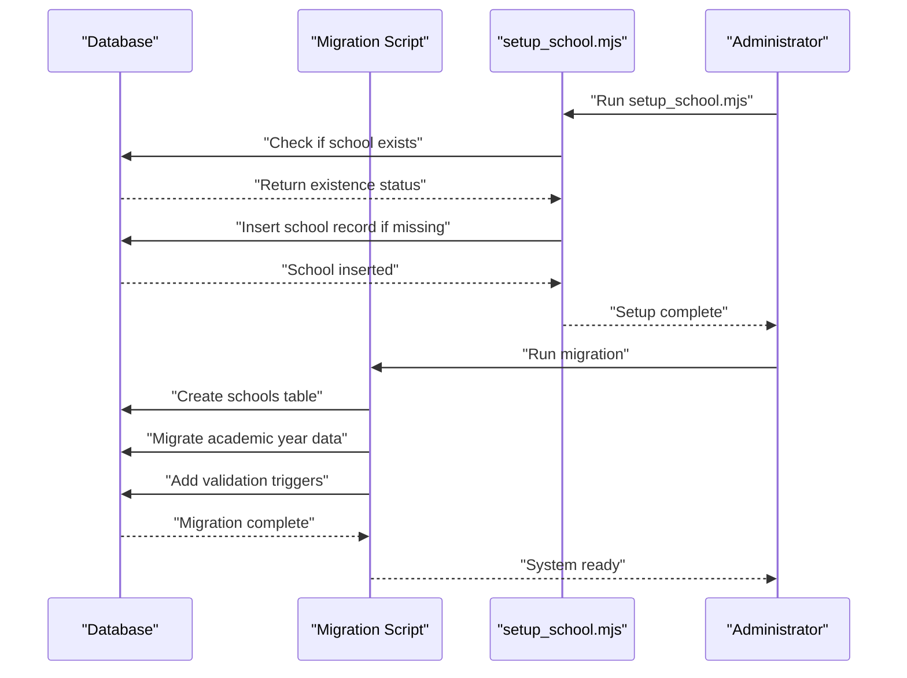

**Diagram sources**
- [setup_school.mjs](file://setup_school.mjs#L11-L69)
- [20260205040000_school_year_segregation.sql](file://supabase/migrations/20260205040000_school_year_segregation.sql#L53-L70)
- [20260205040000_school_year_segregation.sql](file://supabase/migrations/20260205040000_school_year_segregation.sql#L206-L253)

**Section sources**
- [setup_school.mjs](file://setup_school.mjs#L1-L72)
- [20260205040000_school_year_segregation.sql](file://supabase/migrations/20260205040000_school_year_segregation.sql#L1-L264)

### Student Promotion Workflow
The PromoteStudentsWorkflow coordinates student level advancement and academic year activation:
- Selects a target academic year (non-current)
- Loads students from the selected school
- Computes next grade levels and allows manual overrides
- Executes updates to student levels and sets the new academic year as current
- Triggers context refetch to reflect changes

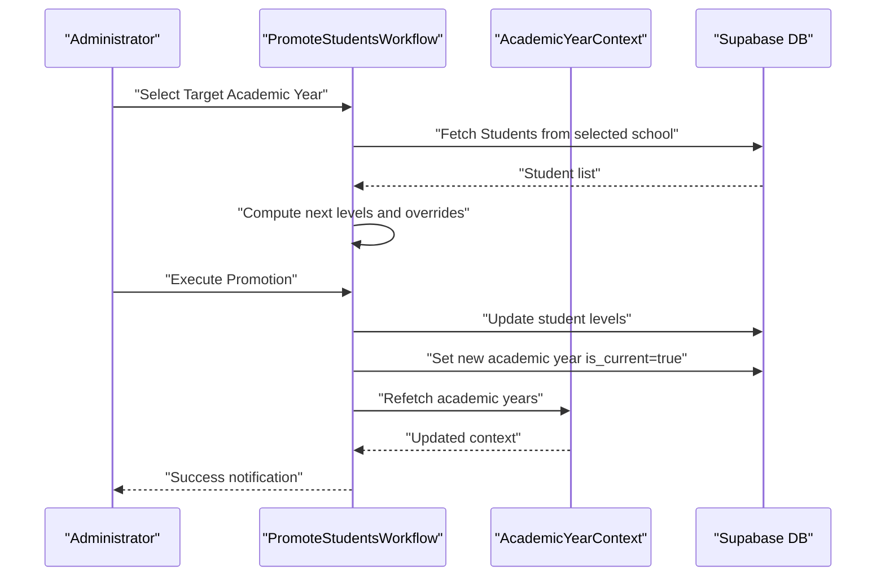

**Diagram sources**
- [PromoteStudentsWorkflow.tsx](file://src/components/curriculum/PromoteStudentsWorkflow.tsx#L61-L174)
- [AcademicYearContext.tsx](file://src/contexts/AcademicYearContext.tsx#L81-L107)

**Section sources**
- [PromoteStudentsWorkflow.tsx](file://src/components/curriculum/PromoteStudentsWorkflow.tsx#L1-L377)

### Year-End Close and Carry Forward
The YearEndClose component handles financial year-end procedures:
- Selects source and target academic years
- Identifies outstanding student assessments
- Carries forward balances to the target year with audit logging
- Prevents duplicate carry-forwards and validates year selection

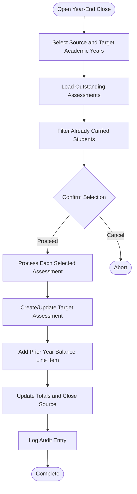

**Diagram sources**
- [YearEndClose.tsx](file://src/components/finance/YearEndClose.tsx#L100-L231)

**Section sources**
- [YearEndClose.tsx](file://src/components/finance/YearEndClose.tsx#L1-L380)

### Data Segregation and Validation
Data segregation is enforced through:
- Database migrations adding school_id and academic_year_id to core tables
- Row-level security policies and validation triggers
- Shared query builders that inject school_id and academic_year_id filters
- Input validation schemas for academic year creation and updates
- Database-level validation function that prevents cross-school data leakage

**Updated** The validation system now includes database-level triggers that automatically validate academic year and school ID relationships, preventing segregation violations at the database level.

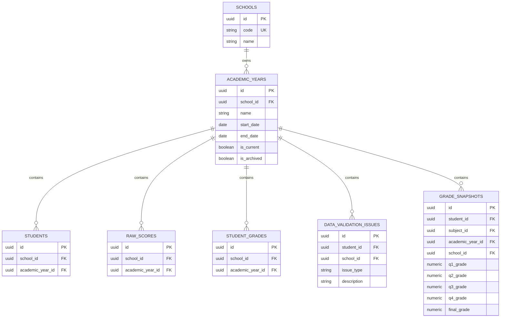

**Diagram sources**
- [20260205040000_school_year_segregation.sql](file://supabase/migrations/20260205040000_school_year_segregation.sql#L8-L99)
- [20260207230259_6e499098-0e40-42e8-9ef1-3617061337e8.sql](file://supabase/migrations/20260207230259_6e499098-0e40-42e8-9ef1-3617061337e8.sql#L5-L53)
- [types.ts](file://src/integrations/supabase/types.ts#L17-L62)

**Section sources**
- [schoolYearQuery.ts](file://src/utils/schoolYearQuery.ts#L1-L219)
- [validation.ts](file://src/lib/validation.ts#L136-L148)
- [20260205040000_school_year_segregation.sql](file://supabase/migrations/20260205040000_school_year_segregation.sql#L206-L253)

### Grade Computation and Transmutation
Grade computation integrates with academic year boundaries:
- Computes weighted scores per quarter with category-specific weights
- Applies DepEd transmutation to convert initial grades to final ratings
- Supports quarterly and annual general averages
- Used in TransmutationManager for per-student grade entry and export

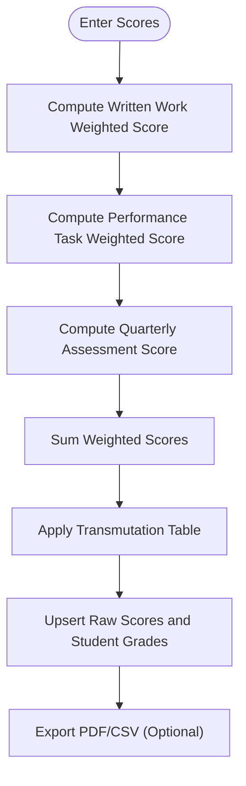

**Diagram sources**
- [TransmutationManager.tsx](file://src/components/students/TransmutationManager.tsx#L118-L215)
- [gradeComputation.ts](file://src/utils/gradeComputation.ts#L110-L143)

**Section sources**
- [TransmutationManager.tsx](file://src/components/students/TransmutationManager.tsx#L1-L479)
- [gradeComputation.ts](file://src/utils/gradeComputation.ts#L1-L343)

## Dependency Analysis
The academic year management system exhibits strong separation of concerns with enhanced database-level integration:
- Context provider depends on school context resolution and academic year retrieval
- UI components depend on Supabase client and shared utilities
- Database migrations define the schema and enforce data segregation
- Validation utilities ensure input correctness before persistence
- School context resolution provides centralized UUID mapping
- Setup scripts handle database initialization and migration

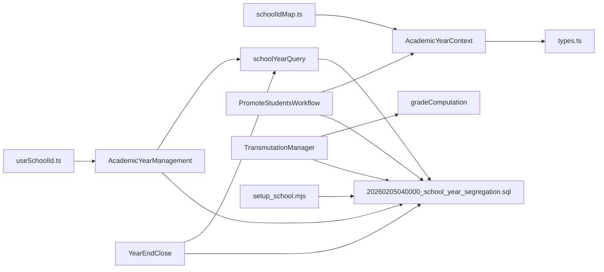

**Diagram sources**
- [AcademicYearContext.tsx](file://src/contexts/AcademicYearContext.tsx#L1-L116)
- [AcademicYearManagement.tsx](file://src/components/curriculum/AcademicYearManagement.tsx#L1-L587)
- [PromoteStudentsWorkflow.tsx](file://src/components/curriculum/PromoteStudentsWorkflow.tsx#L1-L377)
- [YearEndClose.tsx](file://src/components/finance/YearEndClose.tsx#L1-L380)
- [TransmutationManager.tsx](file://src/components/students/TransmutationManager.tsx#L1-L479)
- [schoolYearQuery.ts](file://src/utils/schoolYearQuery.ts#L1-L219)
- [20260205040000_school_year_segregation.sql](file://supabase/migrations/20260205040000_school_year_segregation.sql#L1-L264)
- [schoolIdMap.ts](file://src/utils/schoolIdMap.ts#L1-L14)
- [useSchoolId.ts](file://src/hooks/useSchoolId.ts#L1-L45)
- [setup_school.mjs](file://setup_school.mjs#L1-L72)

**Section sources**
- [AcademicYearContext.tsx](file://src/contexts/AcademicYearContext.tsx#L1-L116)
- [AcademicYearManagement.tsx](file://src/components/curriculum/AcademicYearManagement.tsx#L1-L587)
- [schoolYearQuery.ts](file://src/utils/schoolYearQuery.ts#L1-L219)
- [20260205040000_school_year_segregation.sql](file://supabase/migrations/20260205040000_school_year_segregation.sql#L1-L264)
- [schoolIdMap.ts](file://src/utils/schoolIdMap.ts#L1-L14)
- [useSchoolId.ts](file://src/hooks/useSchoolId.ts#L1-L45)
- [setup_school.mjs](file://setup_school.mjs#L1-L72)

## Performance Considerations
- Database indexing on academic_years.school_id and composite indexes on students.school_id + academic_year_id improve query performance for segregation checks.
- Using shared query builders reduces repeated filter logic and minimizes risk of data leakage.
- Batch operations in student promotion reduce network overhead by grouping updates by target level.
- Local storage caching of selected academic year avoids redundant context resolution.
- School ID resolution caching prevents excessive database queries for school context.
- Database-level validation triggers eliminate frontend validation overhead.
- Setup scripts handle one-time database initialization efficiently.

## Troubleshooting Guide
Common issues and resolutions:
- Academic year not loading: Verify selected school code resolves to a UUID and that academic_years exist for the school.
- Cannot set current year: Ensure no other year is currently flagged as current; the system automatically unsets others before setting a new current year.
- Archive fails: Confirm that grade snapshots were created successfully and that the year is marked archived; check for foreign key constraints preventing deletion.
- Promotion errors: Validate that target academic year is non-current and that student records belong to the selected school.
- Year-end carry-forward failures: Check for existing carry-forwards and ensure source/target years are different; review audit logs for detailed errors.
- School context loading issues: Verify that setup_school.mjs has been run and that the schools table contains the expected school records.
- Infinite loop prevention: Ensure proper dependency management in AcademicYearContext and useSchoolId hook to prevent circular dependencies.

**Updated** Added troubleshooting guidance for school context loading issues and infinite loop prevention.

**Section sources**
- [AcademicYearManagement.tsx](file://src/components/curriculum/AcademicYearManagement.tsx#L192-L228)
- [AcademicYearManagement.tsx](file://src/components/curriculum/AcademicYearManagement.tsx#L271-L329)
- [PromoteStudentsWorkflow.tsx](file://src/components/curriculum/PromoteStudentsWorkflow.tsx#L119-L174)
- [YearEndClose.tsx](file://src/components/finance/YearEndClose.tsx#L100-L231)
- [setup_school.mjs](file://setup_school.mjs#L11-L69)

## Conclusion
The academic year management system provides robust configuration, segregation, and lifecycle management for academic years with enhanced database-level integration. Through the context provider, administrative UI, promotion workflow, and year-end procedures, it ensures data integrity, auditability, and seamless transitions between school years. The evolution from frontend fixes to database-level migration processes demonstrates a cleaner, more maintainable approach to handling school context loading and academic year data segregation. Integration with grade computation and financial workflows further solidifies its role as a central component of the educational administration platform.