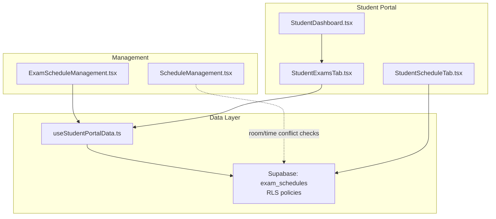
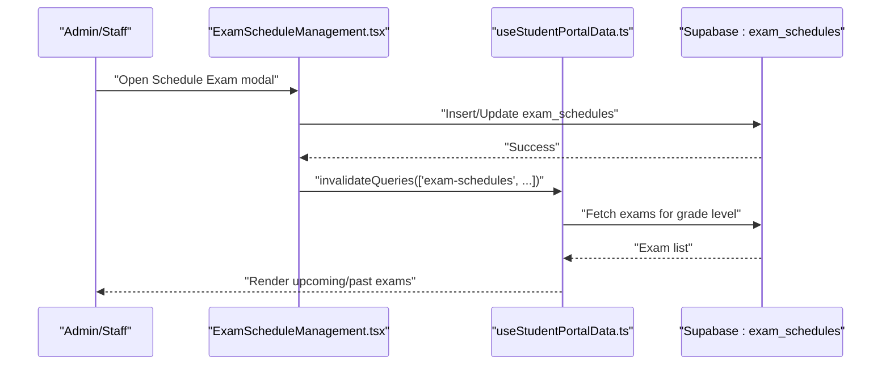
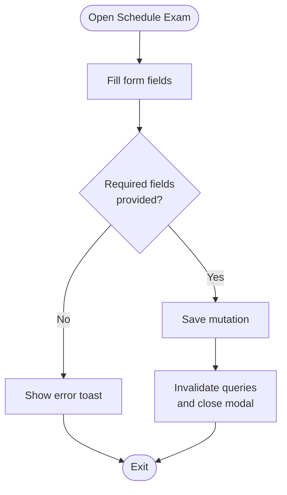
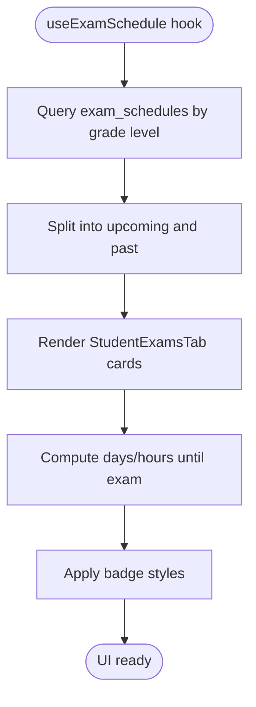
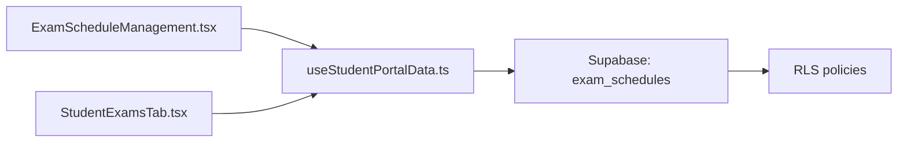
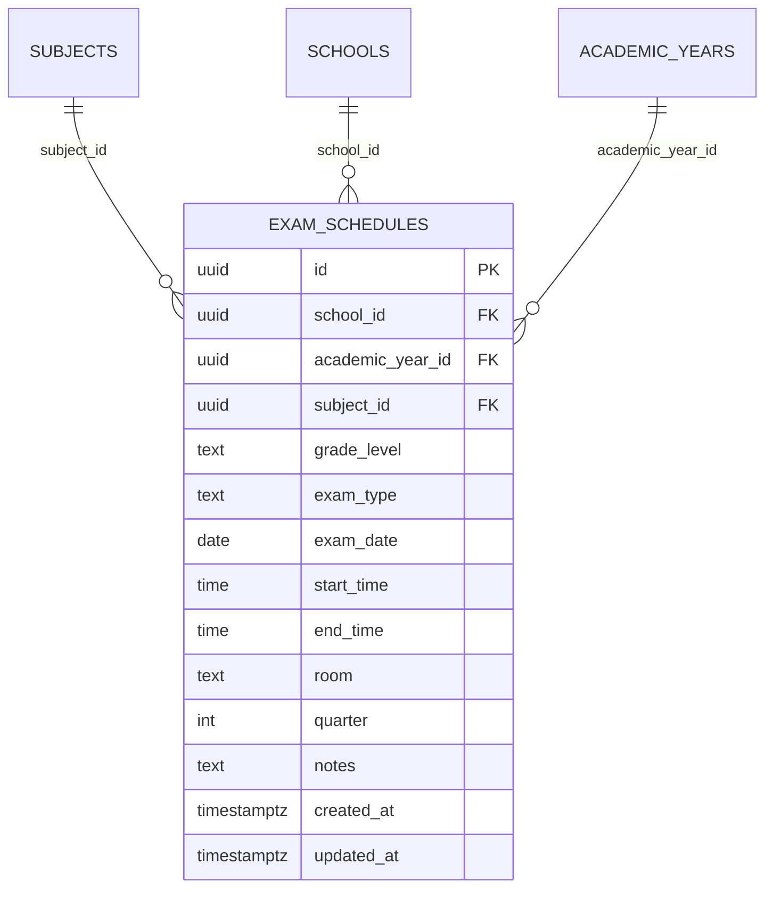

# Exam Scheduling

<cite>
**Referenced Files in This Document**
- [ExamScheduleManagement.tsx](file://src/components/management/ExamScheduleManagement.tsx)
- [StudentExamsTab.tsx](file://src/components/portals/student/StudentExamsTab.tsx)
- [useStudentPortalData.ts](file://src/hooks/useStudentPortalData.ts)
- [types.ts](file://src/integrations/supabase/types.ts)
- [20260206051934_ad262152-1ba2-4505-89d4-c36a4c06b657.sql](file://supabase/migrations/20260206051934_ad262152-1ba2-4505-89d4-c36a4c06b657.sql)
- [ScheduleManagement.tsx](file://src/components/management/ScheduleManagement.tsx)
- [StudentScheduleTab.tsx](file://src/components/portals/student/StudentScheduleTab.tsx)
- [StudentDashboard.tsx](file://src/components/portals/student/StudentDashboard.tsx)
</cite>

## Table of Contents
1. [Introduction](#introduction)
2. [Project Structure](#project-structure)
3. [Core Components](#core-components)
4. [Architecture Overview](#architecture-overview)
5. [Detailed Component Analysis](#detailed-component-analysis)
6. [Dependency Analysis](#dependency-analysis)
7. [Performance Considerations](#performance-considerations)
8. [Troubleshooting Guide](#troubleshooting-guide)
9. [Conclusion](#conclusion)
10. [Appendices](#appendices)

## Introduction
This document explains the exam scheduling system in the portal, focusing on how exams are created, managed, and presented to stakeholders. It covers:
- Exam creation workflows and data model
- Room allocation and timing management
- Scheduling conflicts resolution
- Exam calendar interface and countdowns
- Approvals, invigilation staff, and security protocols
- Integration with subject enrollment and grade management
- Rescheduling and cancellation procedures
- Report generation capabilities

Where relevant, we map UI components to Supabase database tables and policies to clarify data segregation and access controls.

## Project Structure
The exam scheduling feature spans three main areas:
- Management UI for administrators and staff to create, edit, and delete exam schedules
- Student portal UI to display upcoming and past exams with countdowns
- Shared hooks for fetching and categorizing exam data

**Diagram sources**
- [ExamScheduleManagement.tsx](file://src/components/management/ExamScheduleManagement.tsx#L47-L554)
- [StudentExamsTab.tsx](file://src/components/portals/student/StudentExamsTab.tsx#L123-L206)
- [useStudentPortalData.ts](file://src/hooks/useStudentPortalData.ts#L222-L262)
- [20260206051934_ad262152-1ba2-4505-89d4-c36a4c06b657.sql](file://supabase/migrations/20260206051934_ad262152-1ba2-4505-89d4-c36a4c06b657.sql#L156-L173)

**Section sources**
- [ExamScheduleManagement.tsx](file://src/components/management/ExamScheduleManagement.tsx#L47-L554)
- [StudentExamsTab.tsx](file://src/components/portals/student/StudentExamsTab.tsx#L123-L206)
- [useStudentPortalData.ts](file://src/hooks/useStudentPortalData.ts#L222-L262)
- [20260206051934_ad262152-1ba2-4505-89d4-c36a4c06b657.sql](file://supabase/migrations/20260206051934_ad262152-1ba2-4505-89d4-c36a4c06b657.sql#L156-L173)

## Core Components
- ExamScheduleManagement (management): Provides a filterable table of exams, modal form for creating/editing, and deletion confirmation. Supports grade level, exam type, and quarter filters. Stores room and timing details.
- StudentExamsTab (student portal): Displays upcoming and past exams per grade level, with countdown badges and notes rendering.
- useExamSchedule hook: Fetches exams for a given grade level and splits them into upcoming/past categories.
- Supabase exam_schedules table: Stores exam metadata, links to subjects, enforces RLS, and indexes for performance.

Key capabilities:
- Room allocation via the room field
- Timing management via start_time and end_time
- Filtering and categorization for UI consumption
- Data segregation by school_id and academic_year_id

**Section sources**
- [ExamScheduleManagement.tsx](file://src/components/management/ExamScheduleManagement.tsx#L21-L38)
- [ExamScheduleManagement.tsx](file://src/components/management/ExamScheduleManagement.tsx#L73-L103)
- [StudentExamsTab.tsx](file://src/components/portals/student/StudentExamsTab.tsx#L15-L54)
- [useStudentPortalData.ts](file://src/hooks/useStudentPortalData.ts#L222-L262)
- [types.ts](file://src/integrations/supabase/types.ts#L1216-L1222)
- [20260206051934_ad262152-1ba2-4505-89d4-c36a4c06b657.sql](file://supabase/migrations/20260206051934_ad262152-1ba2-4505-89d4-c36a4c06b657.sql#L156-L173)

## Architecture Overview
The system follows a clear separation of concerns:
- UI components render forms and lists
- React Query manages server state and caching
- Supabase provides data persistence and row-level security
- Hooks encapsulate data fetching and categorization logic

**Diagram sources**
- [ExamScheduleManagement.tsx](file://src/components/management/ExamScheduleManagement.tsx#L119-L171)
- [useStudentPortalData.ts](file://src/hooks/useStudentPortalData.ts#L222-L262)
- [20260206051934_ad262152-1ba2-4505-89d4-c36a4c06b657.sql](file://supabase/migrations/20260206051934_ad262152-1ba2-4505-89d4-c36a4c06b657.sql#L156-L173)

## Detailed Component Analysis

### Exam Creation and Management (Admin/Staff)
- Data model: The exam record includes identifiers, grade level, exam type, date, optional times, room, quarter, and notes. It joins with subjects to display subject code and name.
- Filters: Grade level, exam type, and quarter filters refine the list.
- Form fields: Subject, grade level, exam type, date, quarter, start/end times, room, notes.
- Actions: Create, update, delete with confirmation dialogs.
- Validation: Required fields enforced before saving.

Room allocation and timing:
- Room is stored in the room field.
- Times are stored as start_time and end_time for display and scheduling.

**Diagram sources**
- [ExamScheduleManagement.tsx](file://src/components/management/ExamScheduleManagement.tsx#L210-L217)
- [ExamScheduleManagement.tsx](file://src/components/management/ExamScheduleManagement.tsx#L119-L171)

**Section sources**
- [ExamScheduleManagement.tsx](file://src/components/management/ExamScheduleManagement.tsx#L21-L38)
- [ExamScheduleManagement.tsx](file://src/components/management/ExamScheduleManagement.tsx#L387-L528)
- [ExamScheduleManagement.tsx](file://src/components/management/ExamScheduleManagement.tsx#L530-L550)

### Student Exam Calendar Interface
- Upcoming vs past split: The hook separates exams by comparing exam_date to the current date.
- Countdown badges: Dynamic badges indicate days/hours remaining or completion status.
- Notes display: Additional notes are shown with an icon and muted background.
- Skeleton loading: Placeholder cards while data loads.

**Diagram sources**
- [useStudentPortalData.ts](file://src/hooks/useStudentPortalData.ts#L227-L261)
- [StudentExamsTab.tsx](file://src/components/portals/student/StudentExamsTab.tsx#L15-L54)
- [StudentExamsTab.tsx](file://src/components/portals/student/StudentExamsTab.tsx#L56-L121)

**Section sources**
- [StudentExamsTab.tsx](file://src/components/portals/student/StudentExamsTab.tsx#L123-L206)
- [useStudentPortalData.ts](file://src/hooks/useStudentPortalData.ts#L222-L262)

### Room Allocation and Scheduling Conflicts Resolution
- Room field: Stored in exam_schedules.room.
- Conflict detection: The system does not implement explicit room/time conflict checking in the provided code. Room allocation and scheduling conflicts resolution are recommended as enhancements to prevent double-booking.

Room capacity management:
- The exam_schedules table does not include a capacity field. Capacity management would require adding a max_capacity column to rooms and enforcing capacity limits during scheduling.

**Section sources**
- [20260206051934_ad262152-1ba2-4505-89d4-c36a4c06b657.sql](file://supabase/migrations/20260206051934_ad262152-1ba2-4505-89d4-c36a4c06b657.sql#L156-L173)
- [ScheduleManagement.tsx](file://src/components/management/ScheduleManagement.tsx#L22-L31)

### Exam Timing Management
- Timing fields: start_time and end_time are stored and displayed in the UI.
- Time range display: The UI shows a formatted time range when both fields are present.

**Section sources**
- [ExamScheduleManagement.tsx](file://src/components/management/ExamScheduleManagement.tsx#L479-L496)
- [StudentExamsTab.tsx](file://src/components/portals/student/StudentExamsTab.tsx#L87-L95)

### Exam Resource Allocation
- Resources: The exam_schedules table includes room and notes fields for resource-related information.
- Integration: The student schedule tab displays room information for class periods, indicating a similar pattern for exam venues.

**Section sources**
- [20260206051934_ad262152-1ba2-4505-89d4-c36a4c06b657.sql](file://supabase/migrations/20260206051934_ad262152-1ba2-4505-89d4-c36a4c06b657.sql#L168-L170)
- [StudentScheduleTab.tsx](file://src/components/portals/student/StudentScheduleTab.tsx#L110-L123)

### Exam Approval Process, Invigilation Staff, and Security Protocols
- Approval process: Not implemented in the provided code. An approval queue could be modeled after existing grade approval patterns.
- Invigilation staff: Not implemented in the provided code. A staff assignment table and join to exam_schedules would be required.
- Security protocols: The exam_schedules table enables row-level security and exposes read access to anyone. Access roles (admin, registrar) can be extended to manage exams.

**Section sources**
- [20260206051934_ad262152-1ba2-4505-89d4-c36a4c06b657.sql](file://supabase/migrations/20260206051934_ad262152-1ba2-4505-89d4-c36a4c06b657.sql#L175-L179)
- [20260206051934_ad262152-1ba2-4505-89d4-c36a4c06b657.sql](file://supabase/migrations/20260206051934_ad262152-1ba2-4505-89d4-c36a4c06b657.sql#L227-L228)

### Integration with Subject Enrollment and Grade Management
- Subject linkage: Exam records link to subjects via subject_id, enabling display of subject code and name.
- Grade level segregation: Queries filter by grade_level to align with enrollment and grade management boundaries.
- Student dashboard: The student dashboard integrates upcoming exams alongside assignments and announcements.

**Section sources**
- [ExamScheduleManagement.tsx](file://src/components/management/ExamScheduleManagement.tsx#L82-L83)
- [useStudentPortalData.ts](file://src/hooks/useStudentPortalData.ts#L232-L235)
- [StudentDashboard.tsx](file://src/components/portals/student/StudentDashboard.tsx#L285-L285)

### Rescheduling Procedures and Cancellation Workflows
- Rescheduling: Implemented via the edit modal; updates exam_date, times, room, and notes.
- Cancellation: Implemented via delete confirmation dialog; removes the exam record.

**Section sources**
- [ExamScheduleManagement.tsx](file://src/components/management/ExamScheduleManagement.tsx#L189-L208)
- [ExamScheduleManagement.tsx](file://src/components/management/ExamScheduleManagement.tsx#L153-L171)
- [ExamScheduleManagement.tsx](file://src/components/management/ExamScheduleManagement.tsx#L530-L550)

### Report Generation
- Reports hub: The reports module supports generating, previewing, and exporting reports. While not specific to exams, it demonstrates the platform’s reporting capability that can be leveraged for exam analytics.

**Section sources**
- [ReportsHub.tsx](file://src/components/reports/ReportsHub.tsx#L78-L98)

## Dependency Analysis
- UI depends on React Query for data fetching and mutations.
- Hooks encapsulate Supabase queries and categorization logic.
- Database enforces segregation via school_id and academic_year_id and exposes read access to exam schedules.

**Diagram sources**
- [ExamScheduleManagement.tsx](file://src/components/management/ExamScheduleManagement.tsx#L47-L554)
- [useStudentPortalData.ts](file://src/hooks/useStudentPortalData.ts#L222-L262)
- [20260206051934_ad262152-1ba2-4505-89d4-c36a4c06b657.sql](file://supabase/migrations/20260206051934_ad262152-1ba2-4505-89d4-c36a4c06b657.sql#L175-L179)

**Section sources**
- [ExamScheduleManagement.tsx](file://src/components/management/ExamScheduleManagement.tsx#L47-L554)
- [useStudentPortalData.ts](file://src/hooks/useStudentPortalData.ts#L222-L262)
- [20260206051934_ad262152-1ba2-4505-89d4-c36a4c06b657.sql](file://supabase/migrations/20260206051934_ad262152-1ba2-4505-89d4-c36a4c06b657.sql#L156-L173)

## Performance Considerations
- Indexes: The migration creates indexes on school_id, grade_level, and exam_date to improve query performance.
- Caching: React Query caches queries keyed by grade level, school, academic year, and filters.
- UI responsiveness: Skeleton loaders and disabled states improve perceived performance during save/delete operations.

Recommendations:
- Add room/time conflict checks to avoid overlapping schedules.
- Consider capacity limits for rooms and enforce them during scheduling.

**Section sources**
- [20260206051934_ad262152-1ba2-4505-89d4-c36a4c06b657.sql](file://supabase/migrations/20260206051934_ad262152-1ba2-4505-89d4-c36a4c06b657.sql#L227-L228)
- [ExamScheduleManagement.tsx](file://src/components/management/ExamScheduleManagement.tsx#L119-L171)

## Troubleshooting Guide
Common issues and resolutions:
- Missing school or academic year context: Mutations guard against missing identifiers and surface errors.
- Query errors: Toast notifications display error messages from Supabase.
- No exams available: Empty states show friendly messages in both management and student views.
- Past dates: Past exams are visually marked and excluded from “upcoming” lists.

**Section sources**
- [ExamScheduleManagement.tsx](file://src/components/management/ExamScheduleManagement.tsx#L121-L122)
- [ExamScheduleManagement.tsx](file://src/components/management/ExamScheduleManagement.tsx#L148-L150)
- [StudentExamsTab.tsx](file://src/components/portals/student/StudentExamsTab.tsx#L146-L155)

## Conclusion
The exam scheduling system provides a solid foundation for managing exam dates, subjects, and basic room/timing details. It integrates well with the student portal for visibility and with the broader data segregation model. Enhancements such as room capacity management, conflict detection, invigilation staff assignment, and an approval workflow would further strengthen the system.

## Appendices

### Data Model: exam_schedules

**Diagram sources**
- [20260206051934_ad262152-1ba2-4505-89d4-c36a4c06b657.sql](file://supabase/migrations/20260206051934_ad262152-1ba2-4505-89d4-c36a4c06b657.sql#L156-L173)
- [types.ts](file://src/integrations/supabase/types.ts#L1216-L1222)