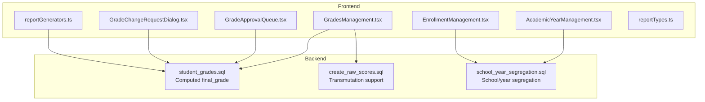
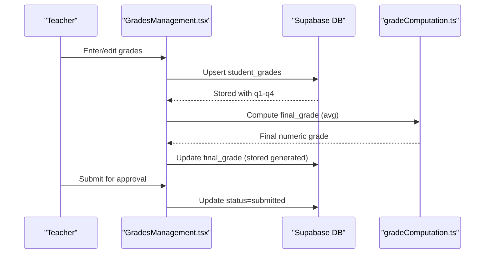
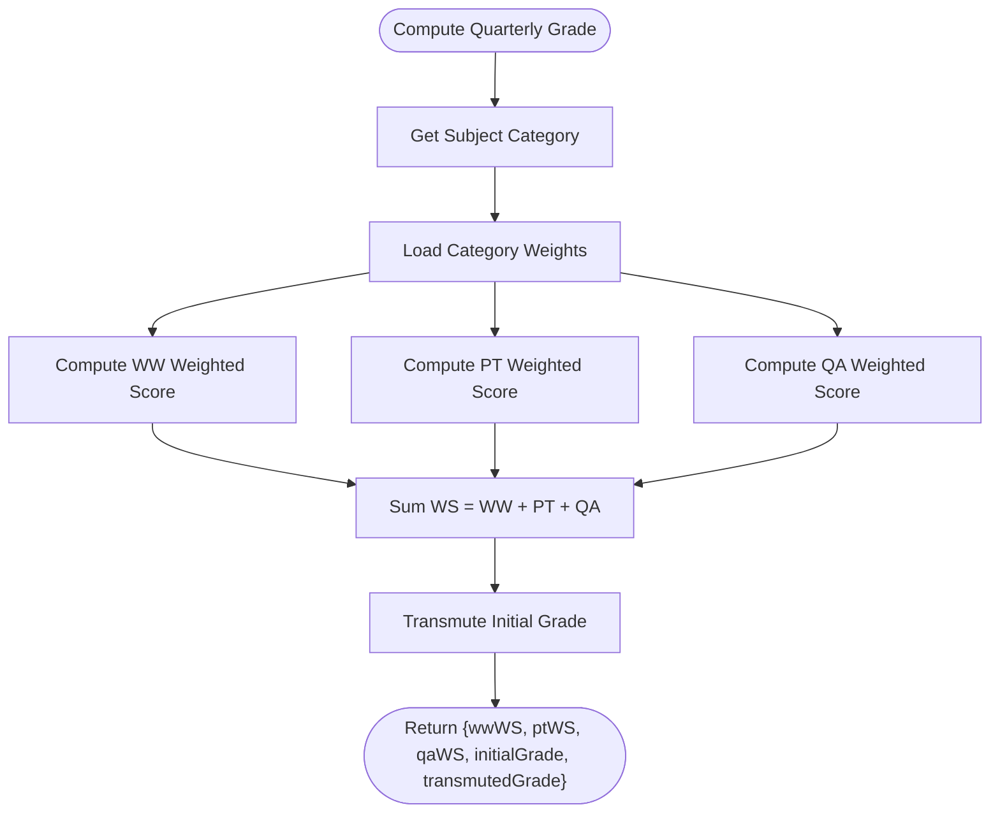
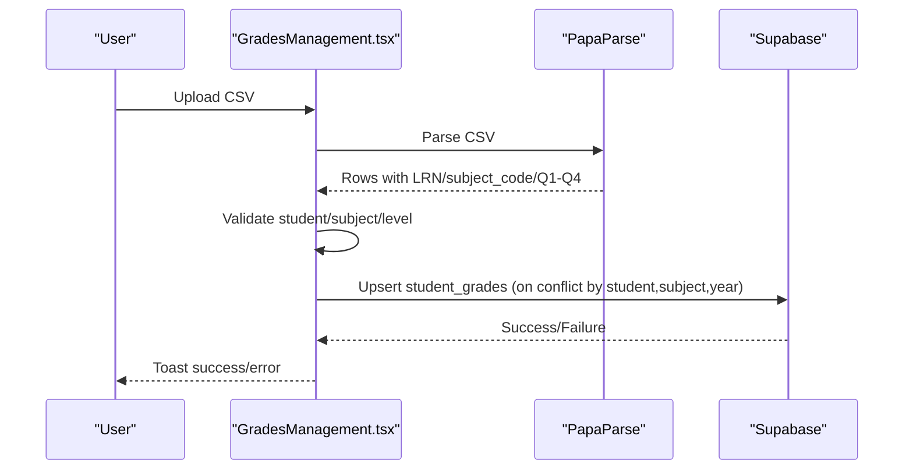
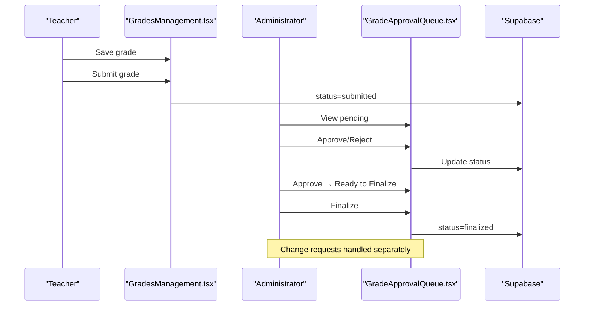
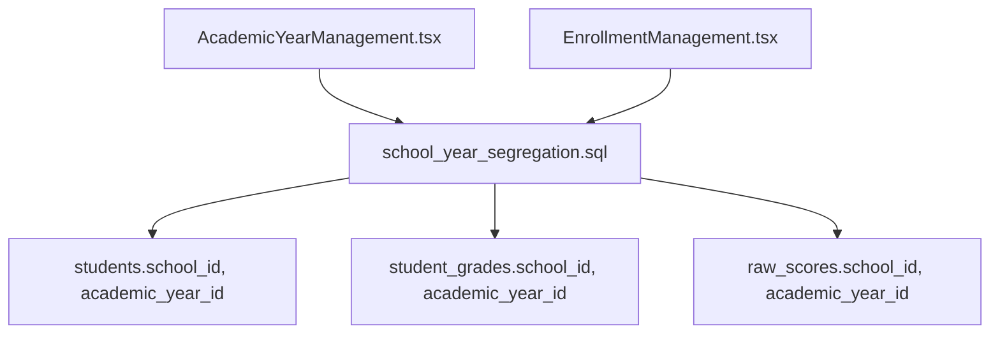
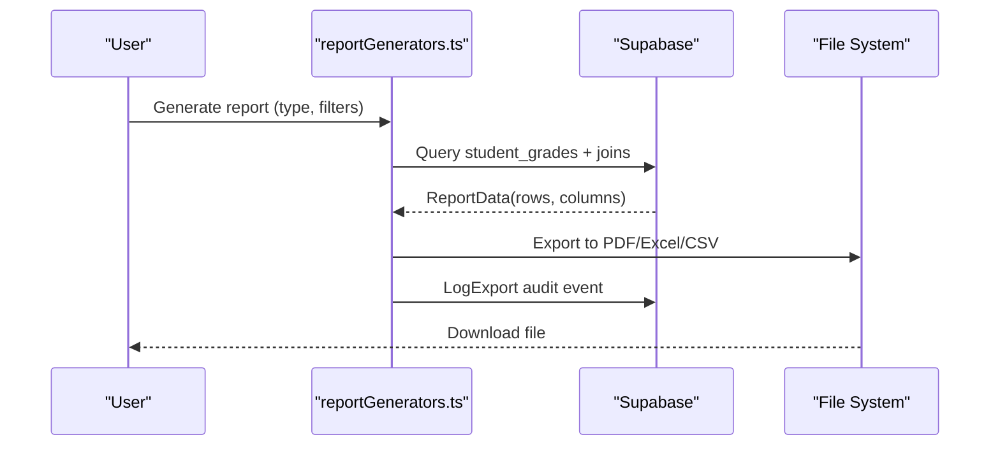
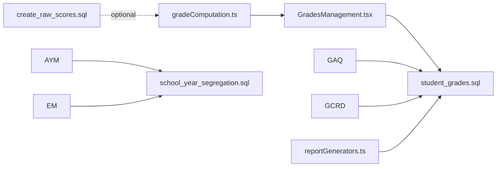
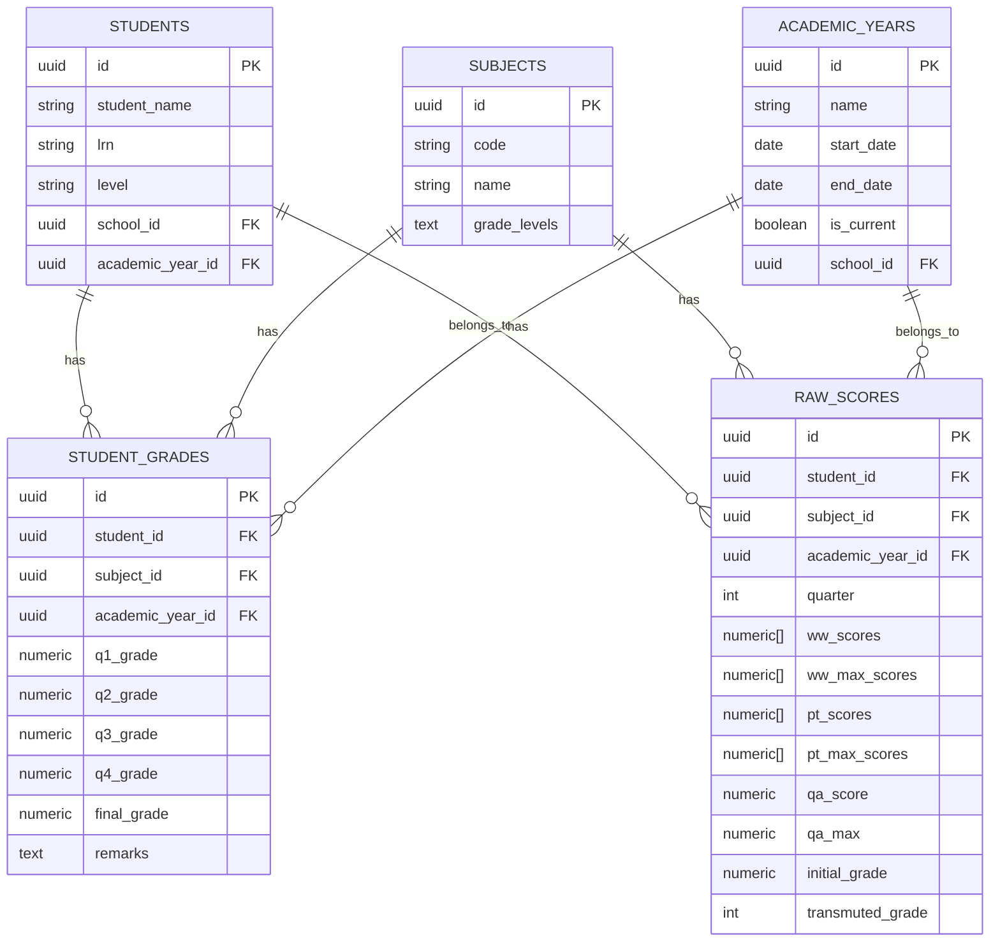

# Grade Management System

<cite>
**Referenced Files in This Document**
- [gradeComputation.ts](file://src/utils/gradeComputation.ts)
- [GradesManagement.tsx](file://src/components/grades/GradesManagement.tsx)
- [GradeApprovalQueue.tsx](file://src/components/grades/GradeApprovalQueue.tsx)
- [GradeChangeRequestDialog.tsx](file://src/components/grades/GradeChangeRequestDialog.tsx)
- [AcademicYearManagement.tsx](file://src/components/curriculum/AcademicYearManagement.tsx)
- [EnrollmentManagement.tsx](file://src/components/curriculum/EnrollmentManagement.tsx)
- [reportGenerators.ts](file://src/components/reports/reportGenerators.ts)
- [reportTypes.ts](file://src/components/reports/reportTypes.ts)
- [create_raw_scores.sql](file://supabase/migrations/20260205025900_create_raw_scores.sql)
- [student_grades.sql](file://supabase/migrations/20251217222414_95537368-a306-4f2c-856f-2fae1bf00271.sql)
- [school_year_segregation.sql](file://supabase/migrations/20260205040000_school_year_segregation.sql)
</cite>

## Table of Contents
1. [Introduction](#introduction)
2. [Project Structure](#project-structure)
3. [Core Components](#core-components)
4. [Architecture Overview](#architecture-overview)
5. [Detailed Component Analysis](#detailed-component-analysis)
6. [Dependency Analysis](#dependency-analysis)
7. [Performance Considerations](#performance-considerations)
8. [Troubleshooting Guide](#troubleshooting-guide)
9. [Conclusion](#conclusion)
10. [Appendices](#appendices)

## Introduction
This document describes the grade management system, covering the grade entry workflow, computation algorithms, validation rules, approval queues, and integration with subject enrollment and academic year tracking. It also documents grade scaling operations, weighted averages, grade change requests, audit trails, and export/report capabilities.

## Project Structure
The grade management system spans frontend components, backend database schemas, and utility modules:

- Frontend components:
  - Grades entry and management interface
  - Approval queue for teacher/admin reviews
  - Change request dialogs
- Backend schema:
  - Student grades storage and computed final grades
  - Raw scores for DepEd transmutation
  - Academic year segregation and school-level data isolation
- Utilities:
  - DepEd-compliant grade computation and transmutation
  - Report generation and export

**Diagram sources**
- [GradesManagement.tsx](file://src/components/grades/GradesManagement.tsx#L123-L800)
- [GradeApprovalQueue.tsx](file://src/components/grades/GradeApprovalQueue.tsx#L43-L405)
- [GradeChangeRequestDialog.tsx](file://src/components/grades/GradeChangeRequestDialog.tsx#L25-L140)
- [AcademicYearManagement.tsx](file://src/components/curriculum/AcademicYearManagement.tsx#L39-L587)
- [EnrollmentManagement.tsx](file://src/components/curriculum/EnrollmentManagement.tsx#L35-L451)
- [reportGenerators.ts](file://src/components/reports/reportGenerators.ts#L1-L292)
- [reportTypes.ts](file://src/components/reports/reportTypes.ts#L1-L131)
- [student_grades.sql](file://supabase/migrations/20251217222414_95537368-a306-4f2c-856f-2fae1bf00271.sql#L1-L22)
- [create_raw_scores.sql](file://supabase/migrations/20260205025900_create_raw_scores.sql#L1-L48)
- [school_year_segregation.sql](file://supabase/migrations/20260205040000_school_year_segregation.sql#L1-L264)

**Section sources**
- [GradesManagement.tsx](file://src/components/grades/GradesManagement.tsx#L123-L800)
- [GradeApprovalQueue.tsx](file://src/components/grades/GradeApprovalQueue.tsx#L43-L405)
- [GradeChangeRequestDialog.tsx](file://src/components/grades/GradeChangeRequestDialog.tsx#L25-L140)
- [AcademicYearManagement.tsx](file://src/components/curriculum/AcademicYearManagement.tsx#L39-L587)
- [EnrollmentManagement.tsx](file://src/components/curriculum/EnrollmentManagement.tsx#L35-L451)
- [reportGenerators.ts](file://src/components/reports/reportGenerators.ts#L1-L292)
- [reportTypes.ts](file://src/components/reports/reportTypes.ts#L1-L131)
- [student_grades.sql](file://supabase/migrations/20251217222414_95537368-a306-4f2c-856f-2fae1bf00271.sql#L1-L22)
- [create_raw_scores.sql](file://supabase/migrations/20260205025900_create_raw_scores.sql#L1-L48)
- [school_year_segregation.sql](file://supabase/migrations/20260205040000_school_year_segregation.sql#L1-L264)

## Core Components
- Grade computation utilities implementing DepEd Order No. 8, 2015:
  - Category-based component weights (Written Work, Performance Task, Quarterly Assessment)
  - Transmutation table mapping initial numeric grades to 1-100 scale
  - Quarter and annual general average calculations
  - Passing grade threshold and descriptors
- Grades management interface:
  - Add/edit/delete individual grades
  - Bulk grade entry per student
  - CSV import/export
  - Status tracking (draft, submitted, approved, finalized)
- Approval queue:
  - Teacher-submitted grades awaiting department head approval
  - Approved grades ready for administrative finalization
  - Pending grade change requests with review workflow
- Academic year and enrollment integration:
  - Academic year lifecycle management
  - Auto-enrollment of students to subjects by grade level
  - School/year segregation enforcing data isolation
- Reporting and exports:
  - Report generators for class grade summaries and report cards
  - Export to PDF, Excel, and CSV
  - Audit logging for exports

**Section sources**
- [gradeComputation.ts](file://src/utils/gradeComputation.ts#L1-L343)
- [GradesManagement.tsx](file://src/components/grades/GradesManagement.tsx#L123-L800)
- [GradeApprovalQueue.tsx](file://src/components/grades/GradeApprovalQueue.tsx#L43-L405)
- [AcademicYearManagement.tsx](file://src/components/curriculum/AcademicYearManagement.tsx#L39-L587)
- [EnrollmentManagement.tsx](file://src/components/curriculum/EnrollmentManagement.tsx#L35-L451)
- [reportGenerators.ts](file://src/components/reports/reportGenerators.ts#L1-L292)

## Architecture Overview
The system follows a layered architecture:
- UI layer: React components for grade entry, approval, and reporting
- Data layer: Supabase tables for student grades, raw scores, and academic year segregation
- Business logic: TypeScript utilities for grade computation and transmutation
- Integration: CSV parsing for import/export, PDF/XLSX generation for reports

**Diagram sources**
- [GradesManagement.tsx](file://src/components/grades/GradesManagement.tsx#L386-L457)
- [student_grades.sql](file://supabase/migrations/20251217222414_95537368-a306-4f2c-856f-2fae1bf00271.sql#L11-L17)
- [gradeComputation.ts](file://src/utils/gradeComputation.ts#L196-L220)

## Detailed Component Analysis

### Grade Computation and Transmutation
- Component weights by subject category:
  - Languages/AP/EsP: WW 30%, PT 50%, QA 20%
  - Science/Math: WW 40%, PT 40%, QA 20%
  - MAPEH/EPP/TLE: WW 20%, PT 60%, QA 20%
  - Senior High categories: CoreSHS, AcademicTrackSHS, TVL/Sports/ArtsSHS with distinct weights
- Weighted score computation:
  - For WW/PT: sum(raw scores)/sum(max scores) × weight
  - For QA: (raw/maximum) × 100 × weight
- Initial grade and transmuted grade:
  - Initial grade = sum of weighted scores
  - Transmuted grade via lookup table from initial grade
- General averages:
  - Quarterly GA = sum of subject grades ÷ count of subjects
  - Annual GA = sum of final grades ÷ count of subjects
- Passing grade threshold: 75; descriptors and color classes provided

**Diagram sources**
- [gradeComputation.ts](file://src/utils/gradeComputation.ts#L110-L143)
- [gradeComputation.ts](file://src/utils/gradeComputation.ts#L75-L86)

**Section sources**
- [gradeComputation.ts](file://src/utils/gradeComputation.ts#L6-L21)
- [gradeComputation.ts](file://src/utils/gradeComputation.ts#L75-L143)
- [gradeComputation.ts](file://src/utils/gradeComputation.ts#L196-L251)

### Grade Entry Workflow
- Individual entry:
  - Select student, subject, academic year
  - Enter Q1–Q4 grades and remarks
  - Save or edit; conflicts handled via upsert
- Bulk entry:
  - Pre-populate subjects based on student’s grade level
  - Fill multiple subjects at once; save upserts per subject
- CSV import:
  - Parse CSV with LRN, subject code, Q1–Q4, remarks
  - Validate student/subject availability and level compatibility
  - Upsert validated rows into student_grades
- CSV export:
  - Filtered export of grades with LRN, subject, academic year, Q1–Q4, final_grade, remarks

**Diagram sources**
- [GradesManagement.tsx](file://src/components/grades/GradesManagement.tsx#L490-L588)

**Section sources**
- [GradesManagement.tsx](file://src/components/grades/GradesManagement.tsx#L248-L364)
- [GradesManagement.tsx](file://src/components/grades/GradesManagement.tsx#L490-L588)
- [GradesManagement.tsx](file://src/components/grades/GradesManagement.tsx#L601-L625)

### Grade Approval Queue System
- Status lifecycle:
  - Draft → Submitted (teacher) → Approved (department head) → Finalized (administrator)
- Pending approvals:
  - View submitted grades and approve/reject
- Ready to finalize:
  - Approve grades and mark finalized
- Change requests:
  - Request changes to finalized grades with reason and proposed values
  - Admin review with optional notes; approved changes applied to student_grades

**Diagram sources**
- [GradesManagement.tsx](file://src/components/grades/GradesManagement.tsx#L386-L394)
- [GradeApprovalQueue.tsx](file://src/components/grades/GradeApprovalQueue.tsx#L105-L133)
- [GradeApprovalQueue.tsx](file://src/components/grades/GradeApprovalQueue.tsx#L155-L177)

**Section sources**
- [GradesManagement.tsx](file://src/components/grades/GradesManagement.tsx#L366-L403)
- [GradeApprovalQueue.tsx](file://src/components/grades/GradeApprovalQueue.tsx#L43-L133)
- [GradeChangeRequestDialog.tsx](file://src/components/grades/GradeChangeRequestDialog.tsx#L25-L89)

### Grade Scaling Operations and Validation Rules
- Numeric ranges:
  - Q1–Q4 grades are numeric with two decimal places
  - Final grade is computed and stored as generated column
- Validation:
  - Prevent duplicate entries per student/subject/year via unique constraints
  - CSV import validates student existence, subject availability, and level compatibility
  - Blocking edits on finalized grades; route change requests through formal workflow
- Transmutation:
  - Initial grade mapped to transmuted grade using predefined table

**Section sources**
- [student_grades.sql](file://supabase/migrations/20251217222414_95537368-a306-4f2c-856f-2fae1bf00271.sql#L7-L17)
- [GradesManagement.tsx](file://src/components/grades/GradesManagement.tsx#L449-L453)
- [GradesManagement.tsx](file://src/components/grades/GradesManagement.tsx#L367-L371)
- [gradeComputation.ts](file://src/utils/gradeComputation.ts#L28-L70)

### Academic Year Tracking and Enrollment Integration
- Academic year management:
  - Create/update/archive academic years with start/end dates
  - Set current year; archive triggers grade snapshot creation
- Enrollment integration:
  - Auto-enroll students to grade-level subjects for selected academic year
  - Enrollment stats and detailed views by grade level
- School/year segregation:
  - All entities linked to school_id and academic_year_id
  - Triggers enforce that academic year belongs to the same school

**Diagram sources**
- [AcademicYearManagement.tsx](file://src/components/curriculum/AcademicYearManagement.tsx#L39-L587)
- [EnrollmentManagement.tsx](file://src/components/curriculum/EnrollmentManagement.tsx#L35-L451)
- [school_year_segregation.sql](file://supabase/migrations/20260205040000_school_year_segregation.sql#L76-L179)

**Section sources**
- [AcademicYearManagement.tsx](file://src/components/curriculum/AcademicYearManagement.tsx#L51-L228)
- [EnrollmentManagement.tsx](file://src/components/curriculum/EnrollmentManagement.tsx#L64-L185)
- [school_year_segregation.sql](file://supabase/migrations/20260205040000_school_year_segregation.sql#L206-L253)

### Grade Reports and Export Functionality
- Report types:
  - Class grade summary, student report card, at-risk learners
- Generation pipeline:
  - Fetch filtered data from student_grades and joined tables
  - Render to PDF (jsPDF + autoTable), Excel (xlsx), or CSV
- Audit logging:
  - Log export events with user, school, academic year, type, filename, record count

**Diagram sources**
- [reportGenerators.ts](file://src/components/reports/reportGenerators.ts#L214-L232)
- [reportGenerators.ts](file://src/components/reports/reportGenerators.ts#L236-L291)

**Section sources**
- [reportGenerators.ts](file://src/components/reports/reportGenerators.ts#L75-L112)
- [reportGenerators.ts](file://src/components/reports/reportGenerators.ts#L236-L291)
- [reportTypes.ts](file://src/components/reports/reportTypes.ts#L80-L94)

## Dependency Analysis
- Frontend-to-backend:
  - GradesManagement and GradeApprovalQueue depend on Supabase client for CRUD operations
  - gradeComputation.ts is a pure utility module consumed by UI components
- Database schema dependencies:
  - student_grades depends on students, subjects, academic_years
  - raw_scores supports DepEd transmutation and is separate from student_grades
  - school_year_segregation enforces referential integrity across entities
- Cohesion and coupling:
  - Grade computation is cohesive and decoupled from UI
  - Approval workflow is centralized in GradeApprovalQueue
  - Reports are decoupled from grade entry logic

**Diagram sources**
- [gradeComputation.ts](file://src/utils/gradeComputation.ts#L1-L343)
- [GradesManagement.tsx](file://src/components/grades/GradesManagement.tsx#L123-L800)
- [GradeApprovalQueue.tsx](file://src/components/grades/GradeApprovalQueue.tsx#L43-L405)
- [GradeChangeRequestDialog.tsx](file://src/components/grades/GradeChangeRequestDialog.tsx#L25-L140)
- [AcademicYearManagement.tsx](file://src/components/curriculum/AcademicYearManagement.tsx#L39-L587)
- [EnrollmentManagement.tsx](file://src/components/curriculum/EnrollmentManagement.tsx#L35-L451)
- [reportGenerators.ts](file://src/components/reports/reportGenerators.ts#L1-L292)
- [student_grades.sql](file://supabase/migrations/20251217222414_95537368-a306-4f2c-856f-2fae1bf00271.sql#L1-L22)
- [create_raw_scores.sql](file://supabase/migrations/20260205025900_create_raw_scores.sql#L1-L48)
- [school_year_segregation.sql](file://supabase/migrations/20260205040000_school_year_segregation.sql#L206-L253)

**Section sources**
- [student_grades.sql](file://supabase/migrations/20251217222414_95537368-a306-4f2c-856f-2fae1bf00271.sql#L1-L22)
- [create_raw_scores.sql](file://supabase/migrations/20260205025900_create_raw_scores.sql#L1-L48)
- [school_year_segregation.sql](file://supabase/migrations/20260205040000_school_year_segregation.sql#L206-L253)

## Performance Considerations
- Database indexing:
  - Unique constraints on student_grades(student_id, subject_id, academic_year_id) for efficient upserts
  - Indexes on raw_scores for student/subject performance
- Computation:
  - Grade computation is O(n) per subject per quarter; optimize by batching where possible
- UI:
  - Memoization of filtered grades reduces re-renders
  - CSV parsing occurs client-side; large files may impact UX

## Troubleshooting Guide
- Duplicate grade entry:
  - Symptom: Error on save indicating duplicate
  - Resolution: Ensure unique combination of student, subject, and academic year
- CSV import failures:
  - Symptom: “No valid grades to import” or parse errors
  - Resolution: Verify LRN/subject code alignment, student/subject existence, and level compatibility
- Finalized grade edits:
  - Symptom: Cannot edit finalized grade
  - Resolution: Use change request dialog to propose modifications for review
- Approval queue actions:
  - Symptom: Approve/finalize buttons disabled
  - Resolution: Ensure network connectivity and correct permissions

**Section sources**
- [GradesManagement.tsx](file://src/components/grades/GradesManagement.tsx#L449-L453)
- [GradesManagement.tsx](file://src/components/grades/GradesManagement.tsx#L367-L371)
- [GradesManagement.tsx](file://src/components/grades/GradesManagement.tsx#L544-L587)
- [GradeApprovalQueue.tsx](file://src/components/grades/GradeApprovalQueue.tsx#L105-L133)

## Conclusion
The grade management system integrates robust grade computation aligned with DepEd standards, a structured approval workflow, and strong academic year and school segregation. Its modular design enables scalable grade entry, reliable computation, and comprehensive reporting/export capabilities.

## Appendices

### Data Model Overview

**Diagram sources**
- [student_grades.sql](file://supabase/migrations/20251217222414_95537368-a306-4f2c-856f-2fae1bf00271.sql#L1-L22)
- [create_raw_scores.sql](file://supabase/migrations/20260205025900_create_raw_scores.sql#L1-L48)
- [school_year_segregation.sql](file://supabase/migrations/20260205040000_school_year_segregation.sql#L76-L179)