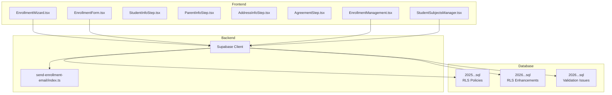
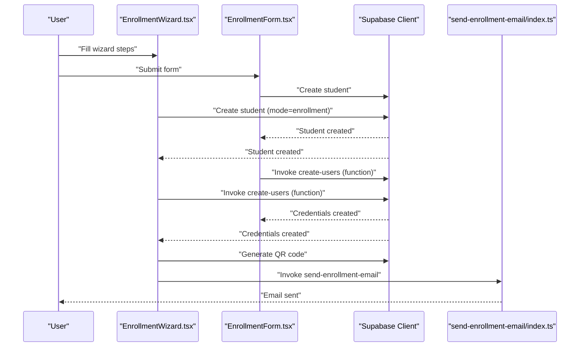
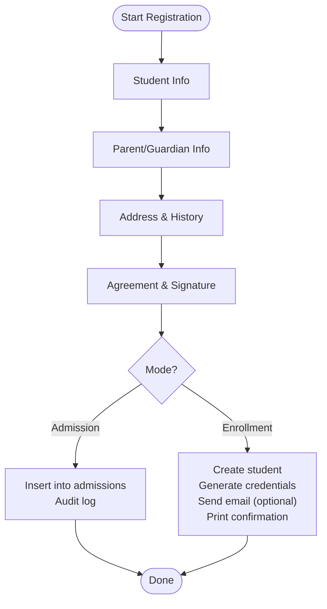
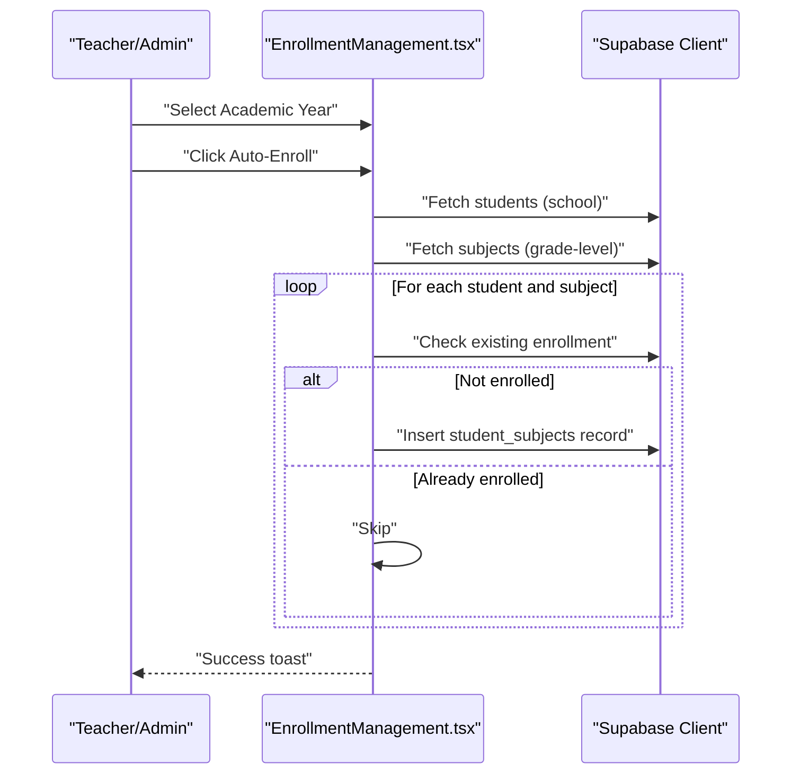
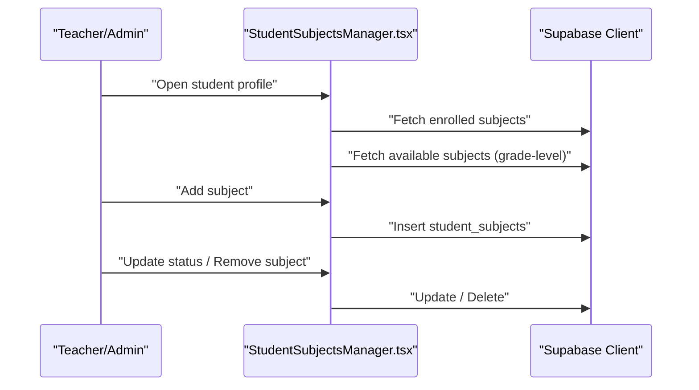
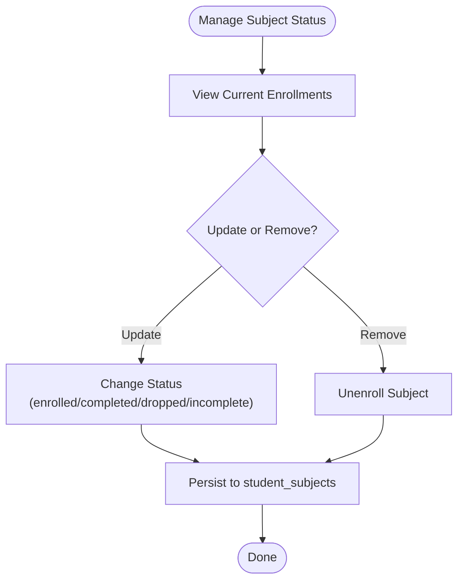
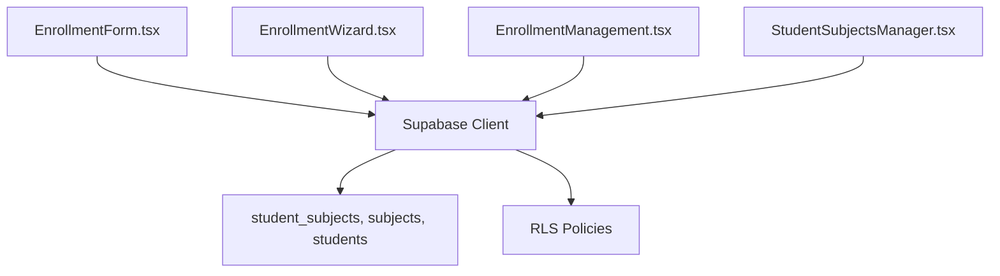
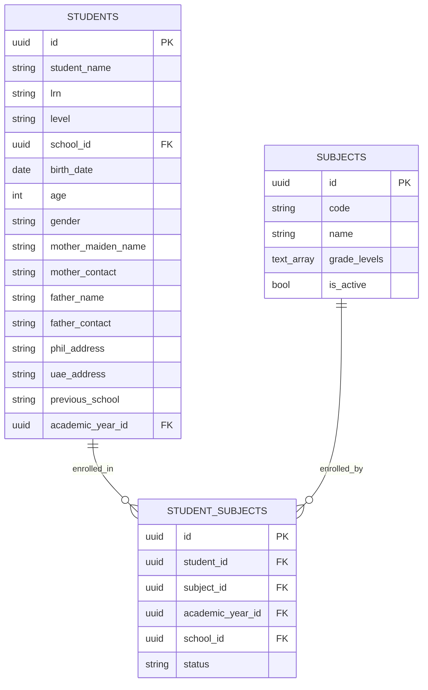

# Student Enrollment

<cite>
**Referenced Files in This Document**
- [EnrollmentWizard.tsx](file://src/components/enrollment/EnrollmentWizard.tsx)
- [EnrollmentForm.tsx](file://src/components/enrollment/EnrollmentForm.tsx)
- [constants.ts](file://src/components/enrollment/constants.ts)
- [StudentInfoStep.tsx](file://src/components/enrollment/steps/StudentInfoStep.tsx)
- [ParentInfoStep.tsx](file://src/components/enrollment/steps/ParentInfoStep.tsx)
- [AddressInfoStep.tsx](file://src/components/enrollment/steps/AddressInfoStep.tsx)
- [AgreementStep.tsx](file://src/components/enrollment/steps/AgreementStep.tsx)
- [EnrollmentManagement.tsx](file://src/components/curriculum/EnrollmentManagement.tsx)
- [StudentSubjectsManager.tsx](file://src/components/students/StudentSubjectsManager.tsx)
- [send-enrollment-email/index.ts](file://supabase/functions/send-enrollment-email/index.ts)
- [20251217203930_6700baf8-76fd-4397-82cc-f0a6dc041330.sql](file://supabase/migrations/20251217203930_6700baf8-76fd-4397-82cc-f0a6dc041330.sql)
- [20260205041000_school_segregation_enhancements.sql](file://supabase/migrations/20260205041000_school_segregation_enhancements.sql)
- [20260207230259_6e499098-0e40-42e8-9ef1-3617061337e8.sql](file://supabase/migrations/20260207230259_6e499098-0e40-42e8-9ef1-3617061337e8.sql)
</cite>

## Table of Contents
1. [Introduction](#introduction)
2. [Project Structure](#project-structure)
3. [Core Components](#core-components)
4. [Architecture Overview](#architecture-overview)
5. [Detailed Component Analysis](#detailed-component-analysis)
6. [Dependency Analysis](#dependency-analysis)
7. [Performance Considerations](#performance-considerations)
8. [Troubleshooting Guide](#troubleshooting-guide)
9. [Conclusion](#conclusion)
10. [Appendices](#appendices)

## Introduction
This document describes the student enrollment system, covering the end-to-end workflow from registration to subject assignment, prerequisites and validations, teacher/admin interfaces, enrollment history, withdrawals, and reporting. It synthesizes frontend UI components, backend Supabase integration, and database policies to present a practical guide for administrators, teachers, and developers.

## Project Structure
The enrollment system spans UI components for student onboarding and management, backend Supabase functions for notifications, and database policies ensuring access control and data integrity.

**Diagram sources**
- [EnrollmentWizard.tsx](file://src/components/enrollment/EnrollmentWizard.tsx#L1-L512)
- [EnrollmentForm.tsx](file://src/components/enrollment/EnrollmentForm.tsx#L1-L782)
- [EnrollmentManagement.tsx](file://src/components/curriculum/EnrollmentManagement.tsx#L1-L451)
- [StudentSubjectsManager.tsx](file://src/components/students/StudentSubjectsManager.tsx#L1-L347)
- [send-enrollment-email/index.ts](file://supabase/functions/send-enrollment-email/index.ts#L1-L104)
- [20251217203930_6700baf8-76fd-4397-82cc-f0a6dc041330.sql](file://supabase/migrations/20251217203930_6700baf8-76fd-4397-82cc-f0a6dc041330.sql#L35-L66)
- [20260205041000_school_segregation_enhancements.sql](file://supabase/migrations/20260205041000_school_segregation_enhancements.sql#L216-L256)
- [20260207230259_6e499098-0e40-42e8-9ef1-3617061337e8.sql](file://supabase/migrations/20260207230259_6e499098-0e40-42e8-9ef1-3617061337e8.sql#L1-L31)

**Section sources**
- [EnrollmentWizard.tsx](file://src/components/enrollment/EnrollmentWizard.tsx#L1-L512)
- [EnrollmentForm.tsx](file://src/components/enrollment/EnrollmentForm.tsx#L1-L782)
- [EnrollmentManagement.tsx](file://src/components/curriculum/EnrollmentManagement.tsx#L1-L451)
- [StudentSubjectsManager.tsx](file://src/components/students/StudentSubjectsManager.tsx#L1-L347)
- [send-enrollment-email/index.ts](file://supabase/functions/send-enrollment-email/index.ts#L1-L104)
- [20251217203930_6700baf8-76fd-4397-82cc-f0a6dc041330.sql](file://supabase/migrations/20251217203930_6700baf8-76fd-4397-82cc-f0a6dc041330.sql#L35-L66)
- [20260205041000_school_segregation_enhancements.sql](file://supabase/migrations/20260205041000_school_segregation_enhancements.sql#L216-L256)
- [20260207230259_6e499098-0e40-42e8-9ef1-3617061337e8.sql](file://supabase/migrations/20260207230259_6e499098-0e40-42e8-9ef1-3617061337e8.sql#L1-L31)

## Core Components
- Registration UIs:
  - Wizard-based onboarding with four steps: learner info, parent/guardian info, address/history, and agreement/signature.
  - Traditional form with inline validation and confirmation dialog.
- Enrollment management:
  - Auto-enrollment of students to grade-level subjects.
  - Per-student subject enrollment and status management.
- Backend integrations:
  - Supabase client for data operations.
  - Email notification via a serverless function.
- Data and access control:
  - Row-level security policies for subjects, academic years, and student-subject enrollments.
  - Enhanced school-scoped access controls for enrollment visibility/manipulation.
  - Data validation issues table for tracking and resolving enrollment problems.

**Section sources**
- [EnrollmentWizard.tsx](file://src/components/enrollment/EnrollmentWizard.tsx#L15-L69)
- [EnrollmentForm.tsx](file://src/components/enrollment/EnrollmentForm.tsx#L28-L47)
- [EnrollmentManagement.tsx](file://src/components/curriculum/EnrollmentManagement.tsx#L15-L49)
- [StudentSubjectsManager.tsx](file://src/components/students/StudentSubjectsManager.tsx#L41-L65)
- [send-enrollment-email/index.ts](file://supabase/functions/send-enrollment-email/index.ts#L1-L104)
- [20251217203930_6700baf8-76fd-4397-82cc-f0a6dc041330.sql](file://supabase/migrations/20251217203930_6700baf8-76fd-4397-82cc-f0a6dc041330.sql#L35-L66)
- [20260205041000_school_segregation_enhancements.sql](file://supabase/migrations/20260205041000_school_segregation_enhancements.sql#L216-L256)
- [20260207230259_6e499098-0e40-42e8-9ef1-3617061337e8.sql](file://supabase/migrations/20260207230259_6e499098-0e40-42e8-9ef1-3617061337e8.sql#L1-L31)

## Architecture Overview
The enrollment system integrates UI components with Supabase for data persistence and with a serverless function for email notifications. Access control is enforced via database row-level security policies and enhanced school-scoped permissions.

**Diagram sources**
- [EnrollmentWizard.tsx](file://src/components/enrollment/EnrollmentWizard.tsx#L146-L319)
- [EnrollmentForm.tsx](file://src/components/enrollment/EnrollmentForm.tsx#L191-L290)
- [send-enrollment-email/index.ts](file://supabase/functions/send-enrollment-email/index.ts#L19-L101)

## Detailed Component Analysis

### Registration Workflow (Wizard and Form)
- Fields and validation:
  - Learner info: name, LRN (12 digits for non-Kinder), grade level, birth date, gender, languages.
  - Parent/guardian info: names and contacts.
  - Address and academic history: Philippine address and previous school.
- Admission vs enrollment mode:
  - Admission mode writes to an admissions table and triggers an admission audit log.
  - Enrollment mode creates a student record, generates credentials, optionally sends an email with QR code, and prints a confirmation.
- Signature and terms:
  - Agreement step requires reading and accepting terms and signing digitally.

**Diagram sources**
- [EnrollmentWizard.tsx](file://src/components/enrollment/EnrollmentWizard.tsx#L76-L319)
- [EnrollmentForm.tsx](file://src/components/enrollment/EnrollmentForm.tsx#L113-L290)
- [StudentInfoStep.tsx](file://src/components/enrollment/steps/StudentInfoStep.tsx#L17-L159)
- [ParentInfoStep.tsx](file://src/components/enrollment/steps/ParentInfoStep.tsx#L13-L82)
- [AddressInfoStep.tsx](file://src/components/enrollment/steps/AddressInfoStep.tsx#L14-L63)
- [AgreementStep.tsx](file://src/components/enrollment/steps/AgreementStep.tsx#L17-L82)

**Section sources**
- [EnrollmentWizard.tsx](file://src/components/enrollment/EnrollmentWizard.tsx#L76-L319)
- [EnrollmentForm.tsx](file://src/components/enrollment/EnrollmentForm.tsx#L113-L290)
- [StudentInfoStep.tsx](file://src/components/enrollment/steps/StudentInfoStep.tsx#L17-L159)
- [ParentInfoStep.tsx](file://src/components/enrollment/steps/ParentInfoStep.tsx#L13-L82)
- [AddressInfoStep.tsx](file://src/components/enrollment/steps/AddressInfoStep.tsx#L14-L63)
- [AgreementStep.tsx](file://src/components/enrollment/steps/AgreementStep.tsx#L17-L82)

### Enrollment Management (Teachers/Administrators)
- Auto-enrollment:
  - Enrolls all students in a school into grade-level subjects for the selected academic year.
  - Skips existing enrollments to avoid duplicates.
- Per-grade overview:
  - Shows student and subject counts per grade level, with expandable details.
  - Displays enrolled subjects per student.
- Prerequisites and capacity:
  - Prerequisites are not explicitly modeled in the UI; however, subjects are filtered by grade levels.
  - Capacity is not enforced in the UI; auto-enrollment inserts records without capacity checks.

**Diagram sources**
- [EnrollmentManagement.tsx](file://src/components/curriculum/EnrollmentManagement.tsx#L202-L258)

**Section sources**
- [EnrollmentManagement.tsx](file://src/components/curriculum/EnrollmentManagement.tsx#L51-L258)

### Per-Student Subject Management
- View enrolled subjects and update status (enrolled, completed, dropped, incomplete).
- Add subjects available for the student’s grade level.
- Remove subjects (unenroll).

**Diagram sources**
- [StudentSubjectsManager.tsx](file://src/components/students/StudentSubjectsManager.tsx#L80-L186)

**Section sources**
- [StudentSubjectsManager.tsx](file://src/components/students/StudentSubjectsManager.tsx#L67-L186)

### Enrollment History Tracking and Withdrawal
- History tracking:
  - Enrollment records persist in the student_subjects table with academic_year_id and status.
  - Per-student subject statuses can be updated to reflect completion or withdrawal.
- Withdrawal:
  - Withdrawal is modeled as changing a subject status to “dropped” or “incomplete,” depending on institutional policy.
  - There is no dedicated “withdrawal” endpoint; status updates serve as the mechanism.

**Diagram sources**
- [StudentSubjectsManager.tsx](file://src/components/students/StudentSubjectsManager.tsx#L172-L186)

**Section sources**
- [StudentSubjectsManager.tsx](file://src/components/students/StudentSubjectsManager.tsx#L172-L186)

### Enrollment Validation Rules
- Required fields:
  - Full name, grade level, birth date, gender, mother’s maiden name, mother’s contact, father’s name, father’s contact, Philippine address.
- Format rules:
  - LRN must be 12 digits; for Kinder, LRN is optional.
  - Phone numbers validated for acceptable formats.
- Age calculation:
  - Age derived from birth date.
- Duplicate LRN prevention:
  - Pre-submission check for existing LRN in the same school.
- Admission-specific:
  - Admission mode inserts into an admissions table and logs actions in an admission audit log.

**Section sources**
- [EnrollmentForm.tsx](file://src/components/enrollment/EnrollmentForm.tsx#L113-L168)
- [EnrollmentWizard.tsx](file://src/components/enrollment/EnrollmentWizard.tsx#L76-L113)
- [constants.ts](file://src/components/enrollment/constants.ts#L1-L20)

### Conflict Resolution for Scheduling Overlaps
- The codebase does not implement automatic scheduling overlap detection or resolution for subjects.
- Recommendation:
  - Introduce a schedule conflict validator that checks overlapping time slots when enrolling students.
  - Provide manual override or conflict resolution UI for administrators.

[No sources needed since this section provides general guidance]

### Grade Level Restrictions
- Grade levels supported include Kinder 1/2 and Levels 1–12.
- Auto-enrollment filters subjects by grade_levels array.
- Admission mode stores grade level and links to academic year.

**Section sources**
- [constants.ts](file://src/components/enrollment/constants.ts#L1-L20)
- [EnrollmentManagement.tsx](file://src/components/curriculum/EnrollmentManagement.tsx#L45-L49)

### Bulk Enrollment Operations
- Implemented via auto-enrollment:
  - Iterates all students in a school and enrolls them into grade-level subjects for the selected academic year.
  - Skips existing enrollments to prevent duplication.

**Section sources**
- [EnrollmentManagement.tsx](file://src/components/curriculum/EnrollmentManagement.tsx#L202-L258)

### Enrollment Reporting and Audit Trails
- Reporting:
  - Enrollment overview cards show student and subject counts per grade level.
  - Expandable rows reveal per-student enrollments.
- Audit trails:
  - Admission mode logs admission submissions.
  - Enhanced RLS policies enable selective visibility of enrollment records by school and roles.

**Section sources**
- [EnrollmentManagement.tsx](file://src/components/curriculum/EnrollmentManagement.tsx#L314-L447)
- [EnrollmentWizard.tsx](file://src/components/enrollment/EnrollmentWizard.tsx#L198-L206)
- [20251217203930_6700baf8-76fd-4397-82cc-f0a6dc041330.sql](file://supabase/migrations/20251217203930_6700baf8-76fd-4397-82cc-f0a6dc041330.sql#L35-L66)
- [20260205041000_school_segregation_enhancements.sql](file://supabase/migrations/20260205041000_school_segregation_enhancements.sql#L216-L256)

## Dependency Analysis
- UI components depend on Supabase client for CRUD operations.
- EnrollmentManagement and StudentSubjectsManager rely on subjects and student_subjects tables.
- Access control depends on RLS policies and user_school_access.

**Diagram sources**
- [EnrollmentForm.tsx](file://src/components/enrollment/EnrollmentForm.tsx#L23-L99)
- [EnrollmentWizard.tsx](file://src/components/enrollment/EnrollmentWizard.tsx#L74-L168)
- [EnrollmentManagement.tsx](file://src/components/curriculum/EnrollmentManagement.tsx#L51-L124)
- [StudentSubjectsManager.tsx](file://src/components/students/StudentSubjectsManager.tsx#L80-L141)
- [20251217203930_6700baf8-76fd-4397-82cc-f0a6dc041330.sql](file://supabase/migrations/20251217203930_6700baf8-76fd-4397-82cc-f0a6dc041330.sql#L35-L66)

**Section sources**
- [EnrollmentForm.tsx](file://src/components/enrollment/EnrollmentForm.tsx#L23-L99)
- [EnrollmentWizard.tsx](file://src/components/enrollment/EnrollmentWizard.tsx#L74-L168)
- [EnrollmentManagement.tsx](file://src/components/curriculum/EnrollmentManagement.tsx#L51-L124)
- [StudentSubjectsManager.tsx](file://src/components/students/StudentSubjectsManager.tsx#L80-L141)
- [20251217203930_6700baf8-76fd-4397-82cc-f0a6dc041330.sql](file://supabase/migrations/20251217203930_6700baf8-76fd-4397-82cc-f0a6dc041330.sql#L35-L66)

## Performance Considerations
- Auto-enrollment loops can be expensive for large schools; consider batching inserts and adding indexes on student_subjects(student_id, subject_id, academic_year_id).
- Debounce or cache grade-level subject queries to reduce repeated network calls.
- Use server-side filtering and pagination for large enrollment lists.

[No sources needed since this section provides general guidance]

## Troubleshooting Guide
- Email notifications:
  - If the Resend API key is missing, the function logs and returns a mock success response; verify environment configuration.
- Credential creation:
  - If account creation fails, the system still enrolls the student and displays a warning; investigate the create-users function logs.
- Data validation issues:
  - Use the data validation issues table to track missing birth dates, invalid contacts, incomplete requirements, and duplicate LRNs.

**Section sources**
- [send-enrollment-email/index.ts](file://supabase/functions/send-enrollment-email/index.ts#L24-L34)
- [EnrollmentForm.tsx](file://src/components/enrollment/EnrollmentForm.tsx#L259-L283)
- [20260207230259_6e499098-0e40-42e8-9ef1-3617061337e8.sql](file://supabase/migrations/20260207230259_6e499098-0e40-42e8-9ef1-3617061337e8.sql#L5-L18)

## Conclusion
The enrollment system provides robust front-end registration experiences, automated subject enrollment, and per-student subject management. Access control and audit logging are enforced via database policies and dedicated tables. To further strengthen the system, implement scheduling conflict detection, explicit prerequisite checks, and capacity management for subjects.

## Appendices

### Data Model Overview

**Diagram sources**
- [EnrollmentManagement.tsx](file://src/components/curriculum/EnrollmentManagement.tsx#L15-L33)
- [StudentSubjectsManager.tsx](file://src/components/students/StudentSubjectsManager.tsx#L41-L53)