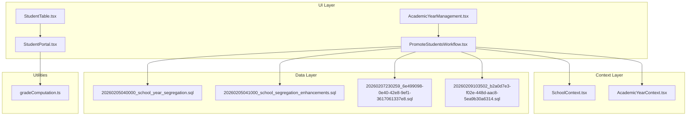
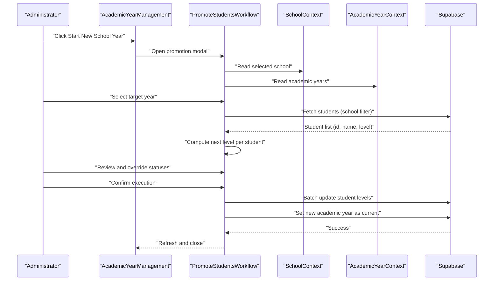
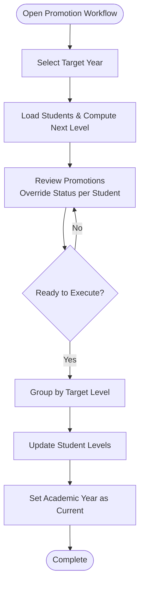
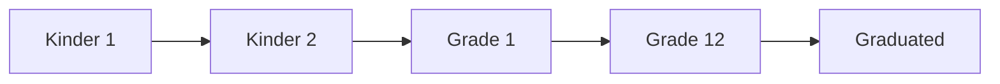
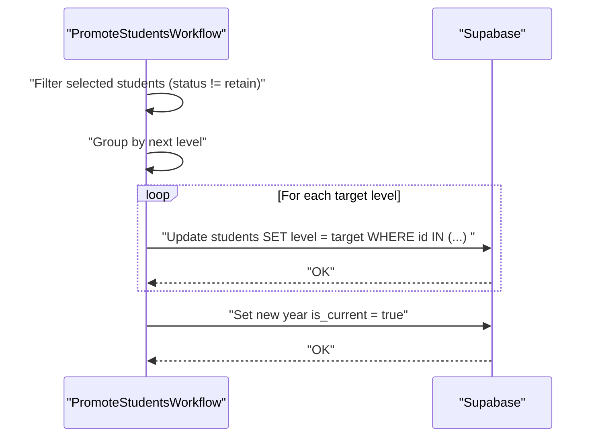
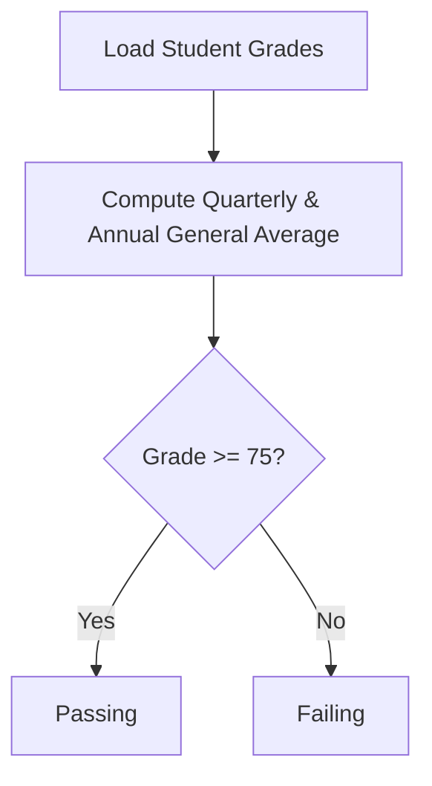
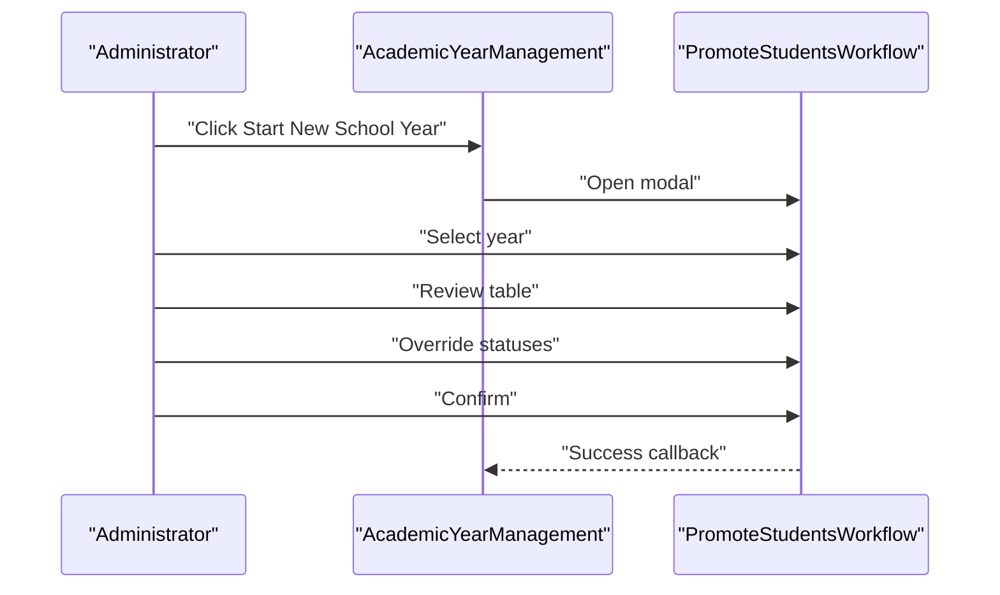
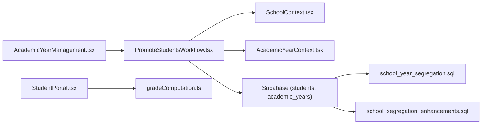

# Student Promotion Workflow

<cite>
**Referenced Files in This Document**
- [PromoteStudentsWorkflow.tsx](file://src/components/curriculum/PromoteStudentsWorkflow.tsx)
- [AcademicYearManagement.tsx](file://src/components/curriculum/AcademicYearManagement.tsx)
- [AcademicYearContext.tsx](file://src/contexts/AcademicYearContext.tsx)
- [SchoolContext.tsx](file://src/contexts/SchoolContext.tsx)
- [student.ts](file://src/types/student.ts)
- [20260205040000_school_year_segregation.sql](file://supabase/migrations/20260205040000_school_year_segregation.sql)
- [20260205041000_school_segregation_enhancements.sql](file://supabase/migrations/20260205041000_school_segregation_enhancements.sql)
- [20260207230259_6e499098-0e40-42e8-9ef1-3617061337e8.sql](file://supabase/migrations/20260207230259_6e499098-0e40-42e8-9ef1-3617061337e8.sql)
- [20260209103502_b2a0d7e3-f02e-448d-aac8-5ea9b30a6314.sql](file://supabase/migrations/20260209103502_b2a0d7e3-f02e-448d-aac8-5ea9b30a6314.sql)
- [StudentTable.tsx](file://src/components/students/StudentTable.tsx)
- [StudentPortal.tsx](file://src/components/portals/StudentPortal.tsx)
- [gradeComputation.ts](file://src/utils/gradeComputation.ts)
</cite>

## Table of Contents
1. [Introduction](#introduction)
2. [Project Structure](#project-structure)
3. [Core Components](#core-components)
4. [Architecture Overview](#architecture-overview)
5. [Detailed Component Analysis](#detailed-component-analysis)
6. [Dependency Analysis](#dependency-analysis)
7. [Performance Considerations](#performance-considerations)
8. [Troubleshooting Guide](#troubleshooting-guide)
9. [Conclusion](#conclusion)

## Introduction
This document explains the student promotion workflow system used to advance learners to the next grade level at the start of a new academic year. It covers grade level progression rules, promotion criteria, batch operations, administrative approval steps, prerequisite verification, academic standing checks, and rollback considerations. It also documents the administrator interface for reviewing student records, verifying prerequisites, approving promotions, validating promotion data, mapping grade levels, and updating academic histories.

## Project Structure
The promotion workflow spans UI components, context providers, and backend data structures:
- UI workflow: PromoteStudentsWorkflow drives the three-step promotion process.
- Academic year orchestration: AcademicYearManagement exposes the “Start New School Year” action and hosts the workflow modal.
- Context providers: SchoolContext and AcademicYearContext supply school and year selection state.
- Data model: Supabase tables and migrations define segregation, validation, and audit capabilities.
- Supporting utilities: Grade computation utilities and student portal components inform academic standing.

**Diagram sources**
- [AcademicYearManagement.tsx](file://src/components/curriculum/AcademicYearManagement.tsx#L35-L557)
- [PromoteStudentsWorkflow.tsx](file://src/components/curriculum/PromoteStudentsWorkflow.tsx#L61-L376)
- [SchoolContext.tsx](file://src/contexts/SchoolContext.tsx#L50-L79)
- [AcademicYearContext.tsx](file://src/contexts/AcademicYearContext.tsx#L25-L107)
- [20260205040000_school_year_segregation.sql](file://supabase/migrations/20260205040000_school_year_segregation.sql#L76-L171)
- [20260205041000_school_segregation_enhancements.sql](file://supabase/migrations/20260205041000_school_segregation_enhancements.sql#L136-L241)
- [20260207230259_6e499098-0e40-42e8-9ef1-3617061337e8.sql](file://supabase/migrations/20260207230259_6e499098-0e40-42e8-9ef1-3617061337e8.sql#L5-L31)
- [20260209103502_b2a0d7e3-f02e-448d-aac8-5ea9b30a6314.sql](file://supabase/migrations/20260209103502_b2a0d7e3-f02e-448d-aac8-5ea9b30a6314.sql#L241-L265)
- [StudentTable.tsx](file://src/components/students/StudentTable.tsx#L400-L422)
- [StudentPortal.tsx](file://src/components/portals/StudentPortal.tsx#L285-L311)
- [gradeComputation.ts](file://src/utils/gradeComputation.ts#L164-L251)

**Section sources**
- [AcademicYearManagement.tsx](file://src/components/curriculum/AcademicYearManagement.tsx#L35-L557)
- [PromoteStudentsWorkflow.tsx](file://src/components/curriculum/PromoteStudentsWorkflow.tsx#L61-L376)
- [AcademicYearContext.tsx](file://src/contexts/AcademicYearContext.tsx#L25-L107)
- [SchoolContext.tsx](file://src/contexts/SchoolContext.tsx#L50-L79)

## Core Components
- PromoteStudentsWorkflow: Implements the three-step promotion flow—select target year, review promotions, and confirm execution. It computes next grade levels, supports manual overrides (promote/retain/graduate), batches updates by target level, and activates the new academic year.
- AcademicYearManagement: Provides the “Start New School Year” action and hosts the promotion workflow modal. It lists academic years and manages current year switching.
- AcademicYearContext and SchoolContext: Supply selected school and academic year data to the workflow.
- Data model and validation: Supabase migrations enforce school segregation, academic year validation, and audit logging for access and modifications.

Key behaviors:
- Grade progression uses a fixed order for Kinder and Grades 1–12, with a special “Graduated” outcome for the highest level.
- Batch updates group student ID lists by target level to minimize database round-trips while preserving correctness.
- Academic year activation toggles the current flag across academic_years.

**Section sources**
- [PromoteStudentsWorkflow.tsx](file://src/components/curriculum/PromoteStudentsWorkflow.tsx#L45-L174)
- [AcademicYearManagement.tsx](file://src/components/curriculum/AcademicYearManagement.tsx#L378-L382)
- [AcademicYearContext.tsx](file://src/contexts/AcademicYearContext.tsx#L25-L107)
- [SchoolContext.tsx](file://src/contexts/SchoolContext.tsx#L50-L79)

## Architecture Overview
The promotion workflow integrates UI, context, and data-layer concerns:

**Diagram sources**
- [AcademicYearManagement.tsx](file://src/components/curriculum/AcademicYearManagement.tsx#L378-L382)
- [PromoteStudentsWorkflow.tsx](file://src/components/curriculum/PromoteStudentsWorkflow.tsx#L61-L174)
- [SchoolContext.tsx](file://src/contexts/SchoolContext.tsx#L50-L79)
- [AcademicYearContext.tsx](file://src/contexts/AcademicYearContext.tsx#L25-L107)

## Detailed Component Analysis

### PromoteStudentsWorkflow: Three-Step Promotion Process
- Step 1: Select Target Year
  - Filters academic years to exclude the current year.
  - Loads students for the selected school and orders by level and name.
- Step 2: Review Promotions
  - Builds a list of PromotionEntry with current and computed next levels.
  - Allows selecting/deselecting students and overriding status per row.
  - Computes summary counts for promoted, retained, and graduated.
- Step 3: Confirm Execution
  - Groups selected students by target level and executes batch updates.
  - Sets the new academic year as current and refreshes context.

**Diagram sources**
- [PromoteStudentsWorkflow.tsx](file://src/components/curriculum/PromoteStudentsWorkflow.tsx#L74-L174)

**Section sources**
- [PromoteStudentsWorkflow.tsx](file://src/components/curriculum/PromoteStudentsWorkflow.tsx#L61-L174)

### Grade Level Progression and Mapping
- Fixed progression order: Kinder 1 → Kinder 2 → Grade 1 → … → Grade 12 → Graduated.
- Normalization handles legacy “Level ” prefixes and numeric levels for backward compatibility.
- Highest grade maps to “Graduated,” enabling administrative designation for graduates.

**Diagram sources**
- [PromoteStudentsWorkflow.tsx](file://src/components/curriculum/PromoteStudentsWorkflow.tsx#L45-L59)

**Section sources**
- [PromoteStudentsWorkflow.tsx](file://src/components/curriculum/PromoteStudentsWorkflow.tsx#L45-L59)

### Batch Promotion Operations
- Filtering: Only selected and non-retained students are included in updates.
- Grouping: Updates are grouped by target level to reduce database calls.
- Execution: Parallel updates per target level using Supabase’s in-filter batching.
- Atomicity: The entire operation proceeds on success; partial failures require re-execution.

**Diagram sources**
- [PromoteStudentsWorkflow.tsx](file://src/components/curriculum/PromoteStudentsWorkflow.tsx#L119-L174)

**Section sources**
- [PromoteStudentsWorkflow.tsx](file://src/components/curriculum/PromoteStudentsWorkflow.tsx#L119-L174)

### Academic Standing Checks and Prerequisite Verification
- Academic standing: The system computes quarterly and annual averages and determines passing status using a fixed threshold.
- Prerequisites: The workflow itself focuses on grade progression; prerequisite checks (e.g., missing documents, finance clearance) are handled elsewhere in the system and can gate enrollment or access.

**Diagram sources**
- [gradeComputation.ts](file://src/utils/gradeComputation.ts#L196-L227)

**Section sources**
- [gradeComputation.ts](file://src/utils/gradeComputation.ts#L164-L251)
- [StudentPortal.tsx](file://src/components/portals/StudentPortal.tsx#L285-L311)

### Promotion Approval Workflow and Administrator Interface
- Access: The “Start New School Year” action is exposed in AcademicYearManagement.
- Modal: PromoteStudentsWorkflow runs inside a modal with a progress stepper.
- Controls: Administrators can select target year, review student promotions, override statuses, and confirm execution.
- Safety: A warning emphasizes irreversibility before executing.

**Diagram sources**
- [AcademicYearManagement.tsx](file://src/components/curriculum/AcademicYearManagement.tsx#L378-L382)
- [PromoteStudentsWorkflow.tsx](file://src/components/curriculum/PromoteStudentsWorkflow.tsx#L61-L376)

**Section sources**
- [AcademicYearManagement.tsx](file://src/components/curriculum/AcademicYearManagement.tsx#L378-L382)
- [PromoteStudentsWorkflow.tsx](file://src/components/curriculum/PromoteStudentsWorkflow.tsx#L191-L376)

### Examples: Promotion Data Validation, Grade Mapping, Academic History Updates
- Data validation: The system validates segregation between academic year and school to prevent cross-school data access and maintains audit logs for access events.
- Grade mapping: The fixed progression order and normalization ensure consistent mapping across diverse data formats.
- Academic history: While the promotion workflow updates student levels, historical grade snapshots are managed during academic year archiving.

**Section sources**
- [20260205040000_school_year_segregation.sql](file://supabase/migrations/20260205040000_school_year_segregation.sql#L206-L254)
- [20260205041000_school_segregation_enhancements.sql](file://supabase/migrations/20260205041000_school_segregation_enhancements.sql#L136-L241)
- [20260207230259_6e499098-0e40-42e8-9ef1-3617061337e8.sql](file://supabase/migrations/20260207230259_6e499098-0e40-42e8-9ef1-3617061337e8.sql#L5-L31)

## Dependency Analysis
Promotion workflow depends on:
- UI components: AcademicYearManagement hosts the workflow modal.
- Context providers: SchoolContext supplies the selected school; AcademicYearContext supplies available academic years and refetch capability.
- Data model: Supabase tables and policies ensure segregation and validation.
- Utilities: Grade computation informs academic standing.

**Diagram sources**
- [AcademicYearManagement.tsx](file://src/components/curriculum/AcademicYearManagement.tsx#L35-L557)
- [PromoteStudentsWorkflow.tsx](file://src/components/curriculum/PromoteStudentsWorkflow.tsx#L61-L376)
- [SchoolContext.tsx](file://src/contexts/SchoolContext.tsx#L50-L79)
- [AcademicYearContext.tsx](file://src/contexts/AcademicYearContext.tsx#L25-L107)
- [20260205040000_school_year_segregation.sql](file://supabase/migrations/20260205040000_school_year_segregation.sql#L76-L171)
- [20260205041000_school_segregation_enhancements.sql](file://supabase/migrations/20260205041000_school_segregation_enhancements.sql#L136-L241)
- [StudentPortal.tsx](file://src/components/portals/StudentPortal.tsx#L285-L311)
- [gradeComputation.ts](file://src/utils/gradeComputation.ts#L164-L251)

**Section sources**
- [AcademicYearManagement.tsx](file://src/components/curriculum/AcademicYearManagement.tsx#L35-L557)
- [PromoteStudentsWorkflow.tsx](file://src/components/curriculum/PromoteStudentsWorkflow.tsx#L61-L376)
- [AcademicYearContext.tsx](file://src/contexts/AcademicYearContext.tsx#L25-L107)
- [SchoolContext.tsx](file://src/contexts/SchoolContext.tsx#L50-L79)

## Performance Considerations
- Batch grouping: Grouping updates by target level reduces database round-trips compared to per-student updates.
- Parallelism: Using Promise.all on grouped updates accelerates processing for large cohorts.
- Indexing: Composite indexes on (school_id, academic_year_id) improve filtering and joins for student queries.
- RLS overhead: Row-level security adds minimal overhead but ensures data isolation across schools.

[No sources needed since this section provides general guidance]

## Troubleshooting Guide
Common issues and resolutions:
- Students not appearing: Verify the selected school filter and that students belong to the current academic year context.
- Promotion fails mid-way: Re-run the workflow; batch updates are executed per target level and can be retried.
- Academic year activation fails: Ensure the target year exists and is not the current year.
- Cross-school data access errors: Confirm segregation policies and that the academic year belongs to the selected school.

Operational safeguards:
- Validation: The system validates that academic year belongs to the same school as the record before updates.
- Audit: Access logs and switch logs capture actions for monitoring and recovery.

**Section sources**
- [20260205040000_school_year_segregation.sql](file://supabase/migrations/20260205040000_school_year_segregation.sql#L206-L254)
- [20260205041000_school_segregation_enhancements.sql](file://supabase/migrations/20260205041000_school_segregation_enhancements.sql#L136-L241)
- [20260207230259_6e499098-0e40-42e8-9ef1-3617061337e8.sql](file://supabase/migrations/20260207230259_6e499098-0e40-42e8-9ef1-3617061337e8.sql#L5-L31)

## Conclusion
The student promotion workflow provides a structured, auditable, and efficient mechanism to advance learners to the next grade level and activate the new academic year. It leverages fixed grade progression rules, batched updates, and strong data segregation to ensure correctness and safety. Administrators can review, override, and approve promotions through a guided interface, while supporting utilities and policies maintain academic integrity and compliance.