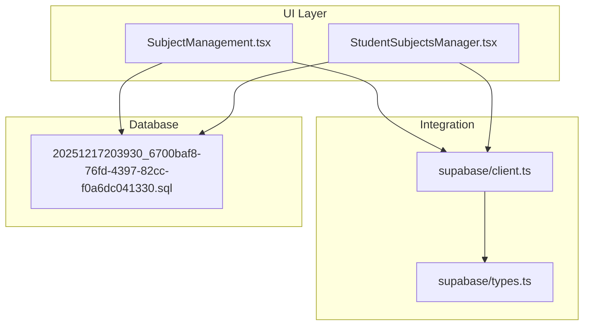
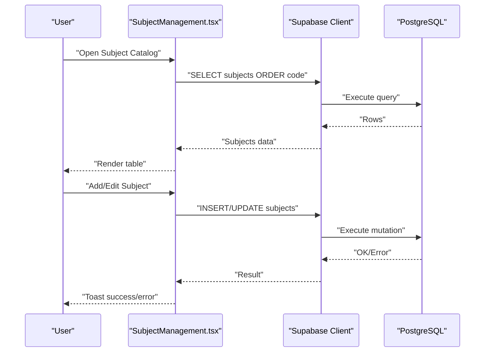
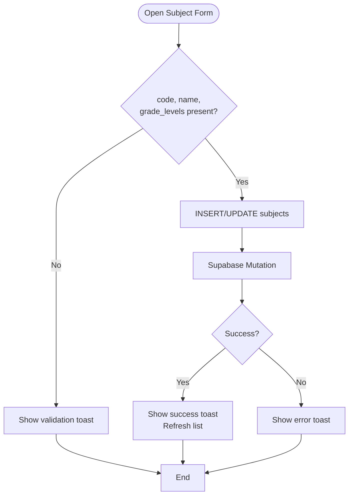
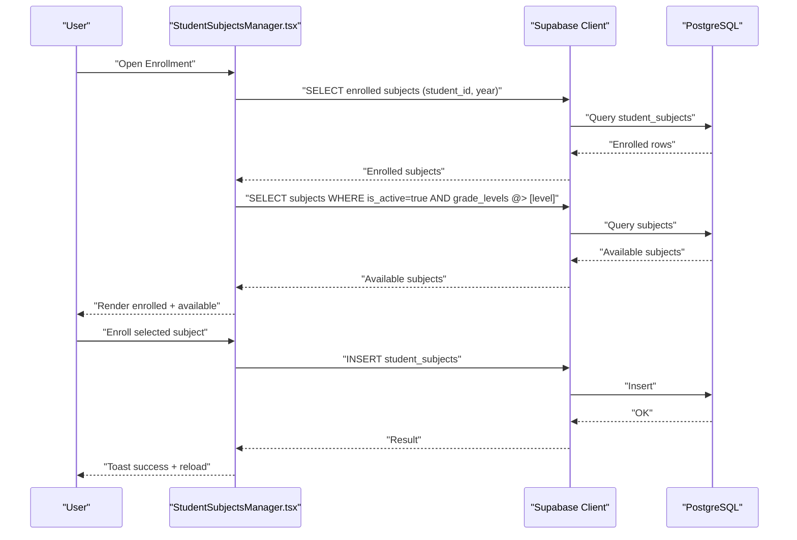
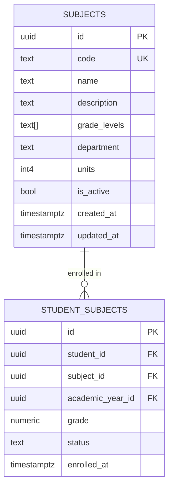
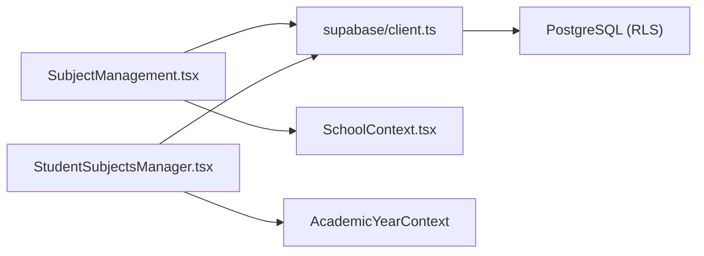

# Subject Management

<cite>
**Referenced Files in This Document**
- [SubjectManagement.tsx](file://src/components/curriculum/SubjectManagement.tsx)
- [client.ts](file://src/integrations/supabase/client.ts)
- [types.ts](file://src/integrations/supabase/types.ts)
- [20251217203930_6700baf8-76fd-4397-82cc-f0a6dc041330.sql](file://supabase/migrations/20251217203930_6700baf8-76fd-4397-82cc-f0a6dc041330.sql)
- [StudentSubjectsManager.tsx](file://src/components/students/StudentSubjectsManager.tsx)
- [SchoolContext.tsx](file://src/contexts/SchoolContext.tsx)
- [validation.ts](file://src/lib/validation.ts)
</cite>

## Table of Contents
1. [Introduction](#introduction)
2. [Project Structure](#project-structure)
3. [Core Components](#core-components)
4. [Architecture Overview](#architecture-overview)
5. [Detailed Component Analysis](#detailed-component-analysis)
6. [Dependency Analysis](#dependency-analysis)
7. [Performance Considerations](#performance-considerations)
8. [Troubleshooting Guide](#troubleshooting-guide)
9. [Conclusion](#conclusion)

## Introduction
This document describes the Subject Management system used to maintain the course catalog, manage subject metadata, and integrate with enrollment workflows. It covers:
- Subject catalog CRUD operations
- Grade level associations and filtering
- Department categorization
- Subject creation workflow with validation and status management
- API interactions via Supabase
- UI components and user flows
- Troubleshooting common issues

## Project Structure
The Subject Management feature spans UI components, Supabase integration, and database schema:
- UI: Subject catalog management and enrollment UI
- Supabase: Client initialization and typed database access
- Database: Subjects table, enrollment table, row-level security, and policies

**Diagram sources**
- [SubjectManagement.tsx](file://src/components/curriculum/SubjectManagement.tsx#L1-L474)
- [StudentSubjectsManager.tsx](file://src/components/students/StudentSubjectsManager.tsx#L1-L347)
- [client.ts](file://src/integrations/supabase/client.ts#L1-L17)
- [types.ts](file://src/integrations/supabase/types.ts#L1-L800)
- [20251217203930_6700baf8-76fd-4397-82cc-f0a6dc041330.sql](file://supabase/migrations/20251217203930_6700baf8-76fd-4397-82cc-f0a6dc041330.sql#L1-L87)

**Section sources**
- [SubjectManagement.tsx](file://src/components/curriculum/SubjectManagement.tsx#L1-L474)
- [client.ts](file://src/integrations/supabase/client.ts#L1-L17)
- [20251217203930_6700baf8-76fd-4397-82cc-f0a6dc041330.sql](file://supabase/migrations/20251217203930_6700baf8-76fd-4397-82cc-f0a6dc041330.sql#L1-L87)

## Core Components
- SubjectManagement UI: Provides CRUD for subjects, search/filter by grade level, and status toggling.
- StudentSubjectsManager UI: Manages student enrollment per academic year and updates subject status.
- Supabase integration: Typed client and database access.
- Database schema: Subjects table with grade levels array, units, department, and is_active flag; student_subjects enrollment table.

Key responsibilities:
- Catalog maintenance: Create, update, delete subjects; manage departments and units.
- Grade association: Associate subjects with multiple grade levels; filter by grade level.
- Status control: Toggle active/inactive; visibility governed by policies.
- Enrollment linkage: Connect subjects to students per academic year.

**Section sources**
- [SubjectManagement.tsx](file://src/components/curriculum/SubjectManagement.tsx#L18-L44)
- [StudentSubjectsManager.tsx](file://src/components/students/StudentSubjectsManager.tsx#L41-L58)
- [20251217203930_6700baf8-76fd-4397-82cc-f0a6dc041330.sql](file://supabase/migrations/20251217203930_6700baf8-76fd-4397-82cc-f0a6dc041330.sql#L1-L87)

## Architecture Overview
The system follows a React + Supabase architecture:
- UI components trigger actions via Supabase client.
- Supabase handles data persistence and row-level security policies.
- Database schema supports arrays for grade levels and unique constraints for subject codes.

**Diagram sources**
- [SubjectManagement.tsx](file://src/components/curriculum/SubjectManagement.tsx#L59-L193)
- [client.ts](file://src/integrations/supabase/client.ts#L11-L17)
- [20251217203930_6700baf8-76fd-4397-82cc-f0a6dc041330.sql](file://supabase/migrations/20251217203930_6700baf8-76fd-4397-82cc-f0a6dc041330.sql#L1-L13)

## Detailed Component Analysis

### Subject Management UI
Responsibilities:
- Load subjects from Supabase and display in a table.
- Provide search by name/code and filter by grade level.
- Modal form for adding/editing subjects with validation.
- Toggle subject status (active/inactive).
- Delete subjects with confirmation.

Validation and UX:
- Required fields: code, name, and at least one grade level.
- Auto-uppercase code input.
- Units minimum 1.
- Grade level multi-select with helpers: auto-select levels with students, select all, clear.

**Diagram sources**
- [SubjectManagement.tsx](file://src/components/curriculum/SubjectManagement.tsx#L144-L193)

**Section sources**
- [SubjectManagement.tsx](file://src/components/curriculum/SubjectManagement.tsx#L46-L217)
- [SubjectManagement.tsx](file://src/components/curriculum/SubjectManagement.tsx#L344-L470)

### Student Enrollment Manager
Responsibilities:
- Fetch enrolled subjects for a student in the selected academic year.
- Fetch available subjects filtered by grade level and active status.
- Enroll/unenroll subjects and update status (enrolled/completed/dropped/incomplete).

**Diagram sources**
- [StudentSubjectsManager.tsx](file://src/components/students/StudentSubjectsManager.tsx#L80-L127)
- [StudentSubjectsManager.tsx](file://src/components/students/StudentSubjectsManager.tsx#L129-L186)

**Section sources**
- [StudentSubjectsManager.tsx](file://src/components/students/StudentSubjectsManager.tsx#L67-L186)

### Supabase Integration
- Client initialization with environment variables for URL and publishable key.
- Typed database access via generated types.

**Section sources**
- [client.ts](file://src/integrations/supabase/client.ts#L1-L17)
- [types.ts](file://src/integrations/supabase/types.ts#L1-L800)

### Database Schema
Subjects table fields:
- id, code (unique), name, description, grade_levels (array), department, units, is_active, timestamps.

Policies:
- View active subjects for general users; admins/registrars can manage.
- Registrars can insert/update; admins have full management.

Enrollment table:
- student_id, subject_id, academic_year_id, grade, status, enrolled_at; unique constraint on (student_id, subject_id, academic_year_id).

**Diagram sources**
- [20251217203930_6700baf8-76fd-4397-82cc-f0a6dc041330.sql](file://supabase/migrations/20251217203930_6700baf8-76fd-4397-82cc-f0a6dc041330.sql#L1-L35)

**Section sources**
- [20251217203930_6700baf8-76fd-4397-82cc-f0a6dc041330.sql](file://supabase/migrations/20251217203930_6700baf8-76fd-4397-82cc-f0a6dc041330.sql#L1-L87)

## Dependency Analysis
- SubjectManagement depends on:
  - Supabase client for data operations
  - SchoolContext for school scoping
  - UI primitives (Dialog, Table, Select, Switch, Checkbox)
- StudentSubjectsManager depends on:
  - Supabase client for enrollment queries and mutations
  - AcademicYearContext for academic year scoping

**Diagram sources**
- [SubjectManagement.tsx](file://src/components/curriculum/SubjectManagement.tsx#L1-L17)
- [StudentSubjectsManager.tsx](file://src/components/students/StudentSubjectsManager.tsx#L1-L39)
- [client.ts](file://src/integrations/supabase/client.ts#L1-L17)

**Section sources**
- [SubjectManagement.tsx](file://src/components/curriculum/SubjectManagement.tsx#L1-L17)
- [StudentSubjectsManager.tsx](file://src/components/students/StudentSubjectsManager.tsx#L1-L39)

## Performance Considerations
- Filtering and search operate client-side on loaded data; consider server-side filtering for large catalogs.
- Grade level filtering uses array membership checks; ensure appropriate indexing if needed.
- Batch operations (e.g., selecting all levels) are efficient due to client-side toggling.
- Enrollment queries join subjects with student_subjects; keep joins minimal and use targeted selects.

## Troubleshooting Guide
Common issues and resolutions:
- Duplicate subject code
  - Symptom: Save fails with a unique constraint error on code.
  - Resolution: Change the subject code to a unique value.
  - Evidence: Unique constraint on code in schema.
- Missing required fields
  - Symptom: Validation toast prompts to fill code, name, and select at least one grade level.
  - Resolution: Complete required fields before saving.
- No subjects found
  - Symptom: Empty table view.
  - Resolution: Add a subject or adjust filters.
- Enrollment conflicts
  - Symptom: Attempting to enroll a subject already enrolled in the same academic year.
  - Resolution: Unique constraint prevents duplicates; remove existing enrollment before re-enrolling.

Operational tips:
- Use “Levels with Students” helper to pre-select grade levels that have enrolled students.
- Use “All” and “Clear” buttons to quickly manage grade level selections.
- Verify active status: only active subjects appear in enrollment lists.

**Section sources**
- [SubjectManagement.tsx](file://src/components/curriculum/SubjectManagement.tsx#L144-L193)
- [20251217203930_6700baf8-76fd-4397-82cc-f0a6dc041330.sql](file://supabase/migrations/20251217203930_6700baf8-76fd-4397-82cc-f0a6dc041330.sql#L4-L13)
- [StudentSubjectsManager.tsx](file://src/components/students/StudentSubjectsManager.tsx#L129-L186)

## Conclusion
The Subject Management system provides a robust UI for maintaining the course catalog, associating subjects with grade levels, categorizing by department, and controlling status. It integrates tightly with Supabase for data persistence and row-level security, and connects to enrollment workflows to support student subject management. The design emphasizes usability with validation, helpful defaults, and clear feedback.