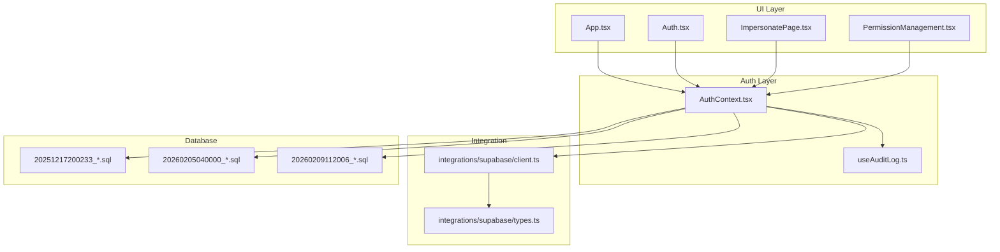
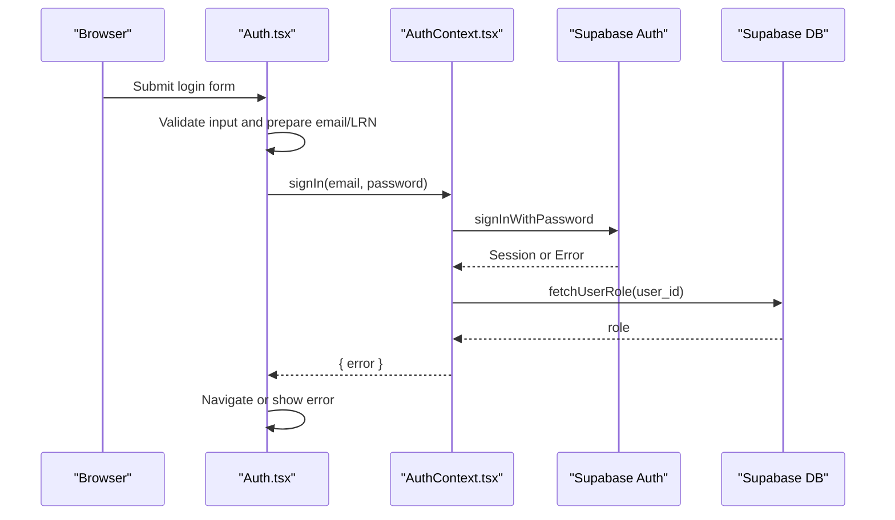
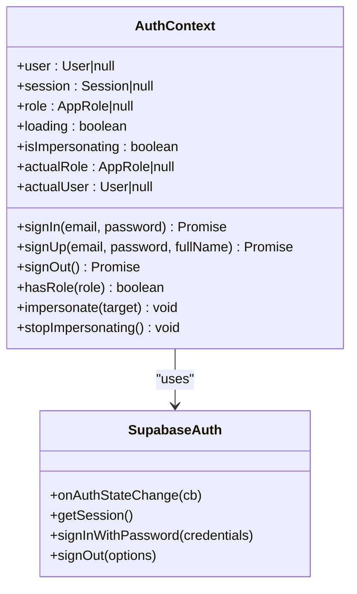
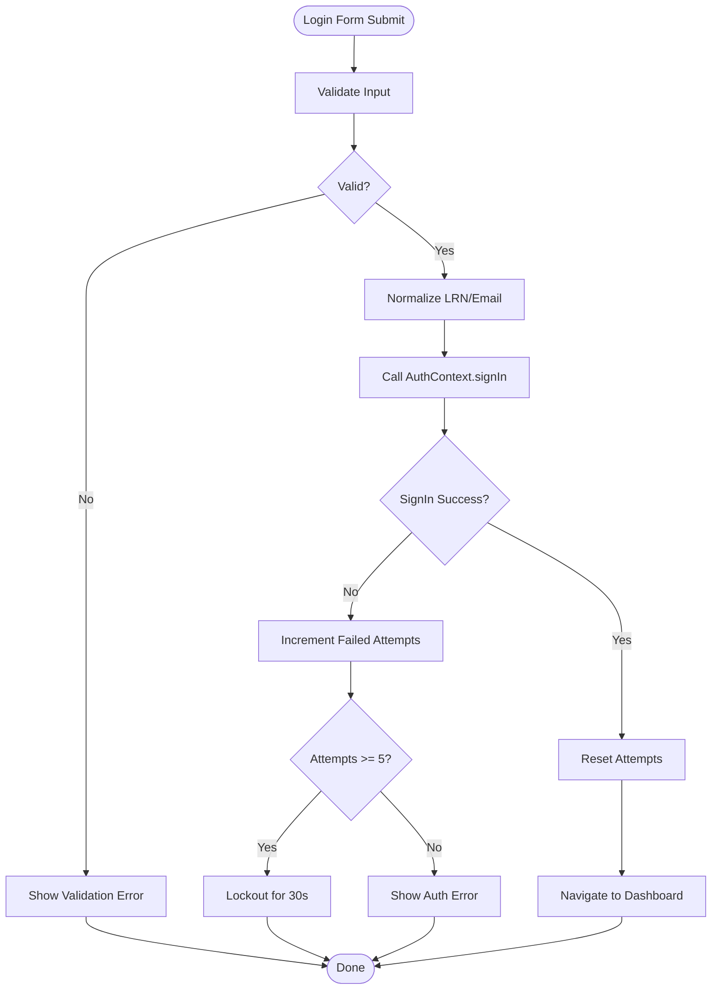
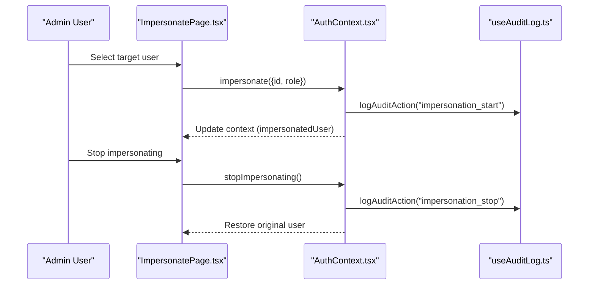
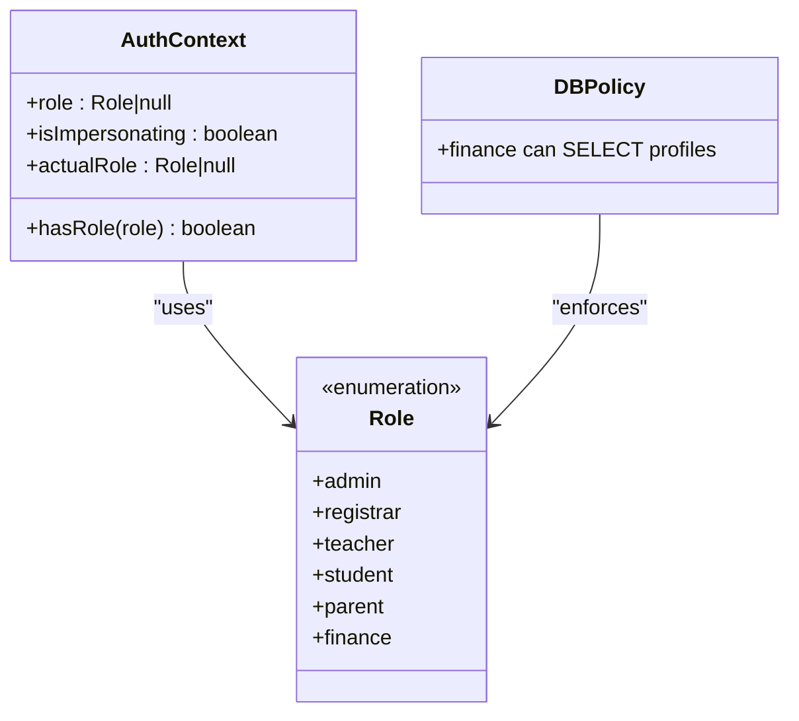
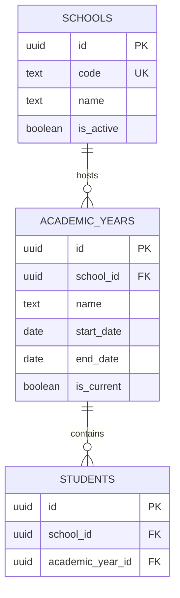
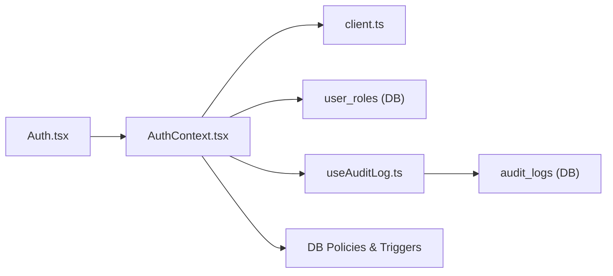

# Authentication & Authorization

<cite>
**Referenced Files in This Document**
- [AuthContext.tsx](file://src/contexts/AuthContext.tsx)
- [Auth.tsx](file://src/pages/Auth.tsx)
- [client.ts](file://src/integrations/supabase/client.ts)
- [types.ts](file://src/integrations/supabase/types.ts)
- [.env](file://.env)
- [.env.example](file://.env.example)
- [App.tsx](file://src/App.tsx)
- [ImpersonatePage.tsx](file://src/components/admin/ImpersonatePage.tsx)
- [PermissionManagement.tsx](file://src/components/admin/PermissionManagement.tsx)
- [useAuditLog.ts](file://src/hooks/useAuditLog.ts)
- [20251217200233_d83c317d-1de8-4a65-95bf-9b8aa958ef31.sql](file://supabase/migrations/20251217200233_d83c317d-1de8-4a65-95bf-9b8aa958ef31.sql)
- [20260205040000_school_year_segregation.sql](file://supabase/migrations/20260205040000_school_year_segregation.sql)
- [20260209112006_bf09bafc-8595-442f-a43c-f7a6676d0a87.sql](file://supabase/migrations/20260209112006_bf09bafc-8595-442f-a43c-f7a6676d0a87.sql)
</cite>

## Table of Contents
1. [Introduction](#introduction)
2. [Project Structure](#project-structure)
3. [Core Components](#core-components)
4. [Architecture Overview](#architecture-overview)
5. [Detailed Component Analysis](#detailed-component-analysis)
6. [Dependency Analysis](#dependency-analysis)
7. [Performance Considerations](#performance-considerations)
8. [Troubleshooting Guide](#troubleshooting-guide)
9. [Conclusion](#conclusion)

## Introduction
This document explains the authentication and authorization system built on Supabase. It covers user session management, role-based access control (RBAC), registration and login flows, impersonation, session persistence, and integration with the multi-school context. It also documents security considerations, token management, and practical patterns for protecting routes and checking permissions.

## Project Structure
The authentication system spans several layers:
- Supabase client configuration and typed database definitions
- Application-wide authentication provider and hooks
- Public authentication UI and routing
- Administrative tools for impersonation and permission management
- Database policies and multi-school segregation

**Diagram sources**
- [App.tsx](file://src/App.tsx#L39-L86)
- [Auth.tsx](file://src/pages/Auth.tsx#L21-L100)
- [AuthContext.tsx](file://src/contexts/AuthContext.tsx#L35-L213)
- [useAuditLog.ts](file://src/hooks/useAuditLog.ts#L23-L60)
- [client.ts](file://src/integrations/supabase/client.ts#L11-L17)
- [types.ts](file://src/integrations/supabase/types.ts#L1-L10)
- [20251217200233_d83c317d-1de8-4a65-95bf-9b8aa958ef31.sql](file://supabase/migrations/20251217200233_d83c317d-1de8-4a65-95bf-9b8aa958ef31.sql#L1-L7)
- [20260205040000_school_year_segregation.sql](file://supabase/migrations/20260205040000_school_year_segregation.sql#L1-L264)
- [20260209112006_bf09bafc-8595-442f-a43c-f7a6676d0a87.sql](file://supabase/migrations/20260209112006_bf09bafc-8595-442f-a43c-f7a6676d0a87.sql#L1-L5)

**Section sources**
- [App.tsx](file://src/App.tsx#L39-L86)
- [AuthContext.tsx](file://src/contexts/AuthContext.tsx#L35-L213)
- [client.ts](file://src/integrations/supabase/client.ts#L11-L17)

## Core Components
- Supabase client configured with local storage persistence and automatic token refresh
- Auth provider managing user/session state, role resolution, impersonation, and audit logging
- Authentication page handling login with rate limiting and audit logging
- Impersonation UI enabling admins to view the system as another user
- Permission management UI for role administration
- Environment variables for Supabase configuration

Key implementation references:
- Supabase client initialization and session persistence
  - [client.ts](file://src/integrations/supabase/client.ts#L11-L17)
- Auth provider lifecycle, role fetching, impersonation, sign out
  - [AuthContext.tsx](file://src/contexts/AuthContext.tsx#L44-L159)
- Login UI, validation, rate limiting, and audit logging
  - [Auth.tsx](file://src/pages/Auth.tsx#L53-L100)
- Impersonation UI and admin-only access
  - [ImpersonatePage.tsx](file://src/components/admin/ImpersonatePage.tsx#L85-L97)
- Permission management role reference
  - [PermissionManagement.tsx](file://src/components/admin/PermissionManagement.tsx#L54-L60)
- Audit logging hook and events
  - [useAuditLog.ts](file://src/hooks/useAuditLog.ts#L23-L60)

**Section sources**
- [client.ts](file://src/integrations/supabase/client.ts#L11-L17)
- [AuthContext.tsx](file://src/contexts/AuthContext.tsx#L44-L159)
- [Auth.tsx](file://src/pages/Auth.tsx#L53-L100)
- [ImpersonatePage.tsx](file://src/components/admin/ImpersonatePage.tsx#L85-L97)
- [PermissionManagement.tsx](file://src/components/admin/PermissionManagement.tsx#L54-L60)
- [useAuditLog.ts](file://src/hooks/useAuditLog.ts#L23-L60)

## Architecture Overview
The system uses Supabase Auth for identity and sessions, with a custom RBAC layer backed by a user_roles table. The Auth provider subscribes to Supabase’s auth state changes, resolves user roles, and exposes helpers for permission checks and impersonation. Administrative tools integrate with the same provider to manage roles and impersonate users.

**Diagram sources**
- [Auth.tsx](file://src/pages/Auth.tsx#L53-L100)
- [AuthContext.tsx](file://src/contexts/AuthContext.tsx#L110-L128)
- [client.ts](file://src/integrations/supabase/client.ts#L11-L17)

**Section sources**
- [Auth.tsx](file://src/pages/Auth.tsx#L53-L100)
- [AuthContext.tsx](file://src/contexts/AuthContext.tsx#L110-L128)
- [client.ts](file://src/integrations/supabase/client.ts#L11-L17)

## Detailed Component Analysis

### Supabase Client and Session Persistence
- Client configured with local storage-backed persistence and automatic token refresh
- Ensures sessions survive page reloads and browser restarts
- Publishable key and URL loaded from environment variables

References:
- [client.ts](file://src/integrations/supabase/client.ts#L11-L17)
- [.env](file://.env#L1-L4)
- [.env.example](file://.env.example#L1-L9)

**Section sources**
- [client.ts](file://src/integrations/supabase/client.ts#L11-L17)
- [.env](file://.env#L1-L4)
- [.env.example](file://.env.example#L1-L9)

### Auth Provider: Session, Role, and Impersonation
Responsibilities:
- Subscribe to Supabase auth state changes
- Resolve user role from user_roles table
- Provide sign-in/sign-up/sign-out
- Support impersonation with admin-only enforcement
- Persist impersonation state in sessionStorage
- Expose hasRole and isImpersonating helpers

**Diagram sources**
- [AuthContext.tsx](file://src/contexts/AuthContext.tsx#L9-L23)
- [AuthContext.tsx](file://src/contexts/AuthContext.tsx#L75-L108)
- [client.ts](file://src/integrations/supabase/client.ts#L11-L17)

**Section sources**
- [AuthContext.tsx](file://src/contexts/AuthContext.tsx#L35-L213)

### Authentication Page: Registration, Login, and Rate Limiting
- Accepts LRN or email; normalizes to email for login
- Client-side validation and server-side error handling
- Rate limiting after repeated failures
- Audit logging for login attempts, successes, and failures

**Diagram sources**
- [Auth.tsx](file://src/pages/Auth.tsx#L53-L100)
- [useAuditLog.ts](file://src/hooks/useAuditLog.ts#L23-L60)

**Section sources**
- [Auth.tsx](file://src/pages/Auth.tsx#L53-L100)
- [useAuditLog.ts](file://src/hooks/useAuditLog.ts#L23-L60)

### Impersonation Functionality
- Admin-only feature to view the system as another user
- Persists impersonation target in sessionStorage
- Updates user ID in context while preserving original role for administrative actions
- Logs impersonation start/stop events

**Diagram sources**
- [ImpersonatePage.tsx](file://src/components/admin/ImpersonatePage.tsx#L85-L97)
- [AuthContext.tsx](file://src/contexts/AuthContext.tsx#L161-L187)
- [useAuditLog.ts](file://src/hooks/useAuditLog.ts#L23-L60)

**Section sources**
- [ImpersonatePage.tsx](file://src/components/admin/ImpersonatePage.tsx#L85-L97)
- [AuthContext.tsx](file://src/contexts/AuthContext.tsx#L161-L187)
- [useAuditLog.ts](file://src/hooks/useAuditLog.ts#L23-L60)

### Role-Based Access Control (RBAC)
- Roles: admin, registrar, teacher, student, parent, finance
- Role resolution via user_roles table
- hasRole helper compares current role (including impersonation override)
- Finance role can view profiles (policy-based)

**Diagram sources**
- [AuthContext.tsx](file://src/contexts/AuthContext.tsx#L7-L23)
- [AuthContext.tsx](file://src/contexts/AuthContext.tsx#L189-L192)
- [20260209112006_bf09bafc-8595-442f-a43c-f7a6676d0a87.sql](file://supabase/migrations/20260209112006_bf09bafc-8595-442f-a43c-f7a6676d0a87.sql#L1-L5)

**Section sources**
- [AuthContext.tsx](file://src/contexts/AuthContext.tsx#L7-L23)
- [AuthContext.tsx](file://src/contexts/AuthContext.tsx#L189-L192)
- [20260209112006_bf09bafc-8595-442f-a43c-f7a6676d0a87.sql](file://supabase/migrations/20260209112006_bf09bafc-8595-442f-a43c-f7a6676d0a87.sql#L1-L5)

### Multi-School Context Integration
- Schools and academic year segregation enforced by database policies and triggers
- Data integrity validated to prevent cross-school/year data leakage
- Roles and access policies scoped per school context

**Diagram sources**
- [20260205040000_school_year_segregation.sql](file://supabase/migrations/20260205040000_school_year_segregation.sql#L8-L19)
- [20260205040000_school_year_segregation.sql](file://supabase/migrations/20260205040000_school_year_segregation.sql#L42-L71)
- [20260205040000_school_year_segregation.sql](file://supabase/migrations/20260205040000_school_year_segregation.sql#L206-L229)

**Section sources**
- [20260205040000_school_year_segregation.sql](file://supabase/migrations/20260205040000_school_year_segregation.sql#L1-L264)

### Protected Routes and Permission Checking Patterns
- Wrap application with AuthProvider so all routes can use useAuth
- Use hasRole for inline permission checks
- Example patterns:
  - Conditional rendering based on role
  - Guarded navigation to admin-only pages
  - Impersonation banner and controls for admin workflows

References:
- [App.tsx](file://src/App.tsx#L57-L77)
- [AuthContext.tsx](file://src/contexts/AuthContext.tsx#L189-L192)
- [ImpersonatePage.tsx](file://src/components/admin/ImpersonatePage.tsx#L102-L122)

**Section sources**
- [App.tsx](file://src/App.tsx#L57-L77)
- [AuthContext.tsx](file://src/contexts/AuthContext.tsx#L189-L192)
- [ImpersonatePage.tsx](file://src/components/admin/ImpersonatePage.tsx#L102-L122)

## Dependency Analysis
- Auth provider depends on Supabase client for auth state and session persistence
- Auth provider queries user_roles to resolve roles
- Impersonation relies on sessionStorage to persist state across reloads
- Audit logging integrates with Supabase tables for auth activity
- Database migrations define policies and triggers enforcing multi-school segregation

**Diagram sources**
- [Auth.tsx](file://src/pages/Auth.tsx#L21-L36)
- [AuthContext.tsx](file://src/contexts/AuthContext.tsx#L44-L62)
- [client.ts](file://src/integrations/supabase/client.ts#L11-L17)
- [useAuditLog.ts](file://src/hooks/useAuditLog.ts#L23-L60)
- [20251217200233_d83c317d-1de8-4a65-95bf-9b8aa958ef31.sql](file://supabase/migrations/20251217200233_d83c317d-1de8-4a65-95bf-9b8aa958ef31.sql#L1-L7)
- [20260205040000_school_year_segregation.sql](file://supabase/migrations/20260205040000_school_year_segregation.sql#L206-L253)

**Section sources**
- [Auth.tsx](file://src/pages/Auth.tsx#L21-L36)
- [AuthContext.tsx](file://src/contexts/AuthContext.tsx#L44-L62)
- [client.ts](file://src/integrations/supabase/client.ts#L11-L17)
- [useAuditLog.ts](file://src/hooks/useAuditLog.ts#L23-L60)
- [20251217200233_d83c317d-1de8-4a65-95bf-9b8aa958ef31.sql](file://supabase/migrations/20251217200233_d83c317d-1de8-4a65-95bf-9b8aa958ef31.sql#L1-L7)
- [20260205040000_school_year_segregation.sql](file://supabase/migrations/20260205040000_school_year_segregation.sql#L206-L253)

## Performance Considerations
- Supabase client auto-refresh minimizes token expiration impact
- Role lookup occurs after auth state resolves; keep user_roles normalized and indexed
- Impersonation state stored in sessionStorage avoids unnecessary DB reads
- Audit logging is best-effort and does not block primary flows

[No sources needed since this section provides general guidance]

## Troubleshooting Guide
Common issues and resolutions:
- Login fails immediately after sign-up
  - Ensure service role policies allow inserting profiles and user_roles during sign-up
    - [20251217200233_d83c317d-1de8-4a65-95bf-9b8aa958ef31.sql](file://supabase/migrations/20251217200233_d83c317d-1de8-4a65-95bf-9b8aa958ef31.sql#L1-L7)
- Role appears as null or defaults to student
  - Verify user_roles entry exists for the user ID
  - Check fetchUserRole error handling fallback
    - [AuthContext.tsx](file://src/contexts/AuthContext.tsx#L44-L62)
- Impersonation not persisting across reloads
  - Confirm sessionStorage keys exist and are parsed correctly
    - [AuthContext.tsx](file://src/contexts/AuthContext.tsx#L65-L73)
- Finance users cannot view profiles
  - Confirm has_role policy for finance role
    - [20260209112006_bf09bafc-8595-442f-a43c-f7a6676d0a87.sql](file://supabase/migrations/20260209112006_bf09bafc-8595-442f-a43c-f7a6676d0a87.sql#L1-L5)
- Cross-school/year data leakage
  - Validate segregation triggers and policies
    - [20260205040000_school_year_segregation.sql](file://supabase/migrations/20260205040000_school_year_segregation.sql#L206-L253)

**Section sources**
- [20251217200233_d83c317d-1de8-4a65-95bf-9b8aa958ef31.sql](file://supabase/migrations/20251217200233_d83c317d-1de8-4a65-95bf-9b8aa958ef31.sql#L1-L7)
- [AuthContext.tsx](file://src/contexts/AuthContext.tsx#L44-L62)
- [AuthContext.tsx](file://src/contexts/AuthContext.tsx#L65-L73)
- [20260209112006_bf09bafc-8595-442f-a43c-f7a6676d0a87.sql](file://supabase/migrations/20260209112006_bf09bafc-8595-442f-a43c-f7a6676d0a87.sql#L1-L5)
- [20260205040000_school_year_segregation.sql](file://supabase/migrations/20260205040000_school_year_segregation.sql#L206-L253)

## Conclusion
The authentication and authorization system leverages Supabase for robust identity and session management, with a custom RBAC layer and administrative tools for impersonation. Multi-school segregation is enforced at the database level, ensuring data isolation. The design balances usability with strong security practices, including audit logging, rate limiting, and explicit role checks.