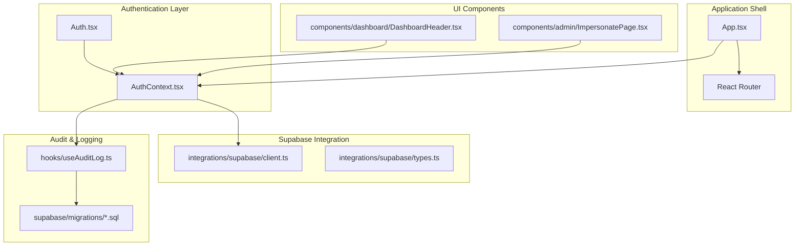
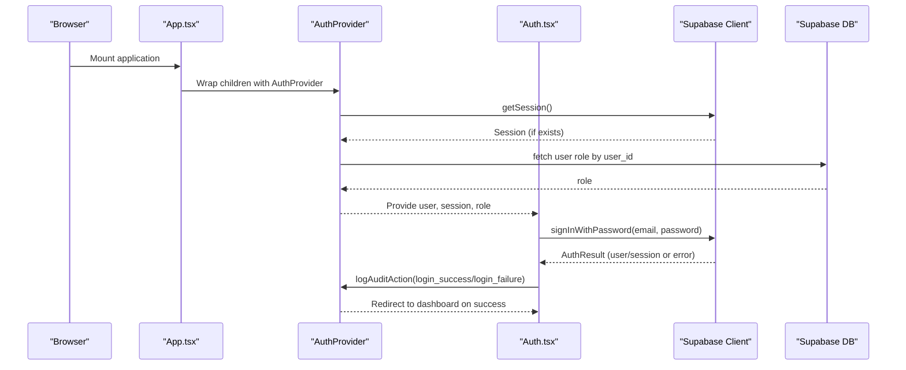
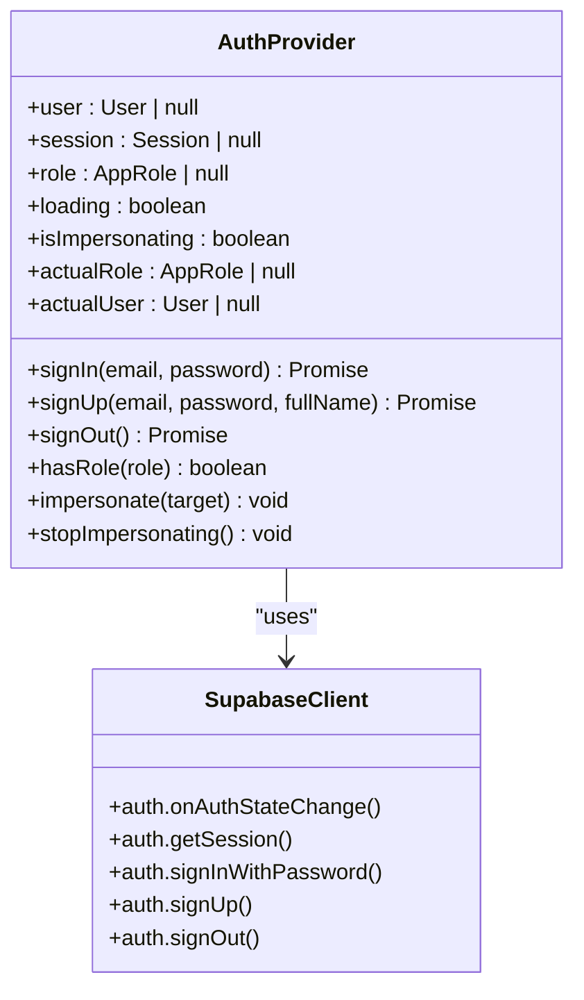
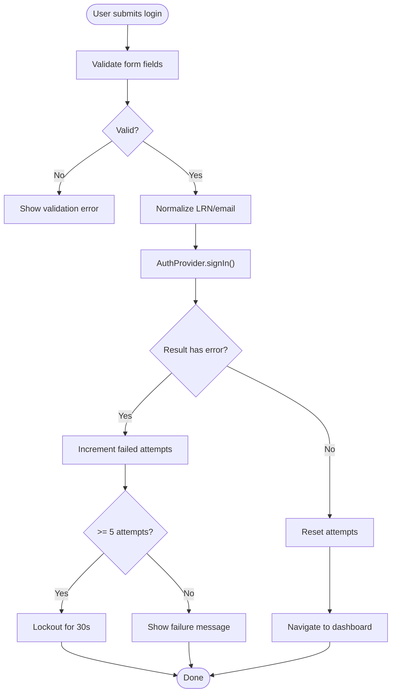
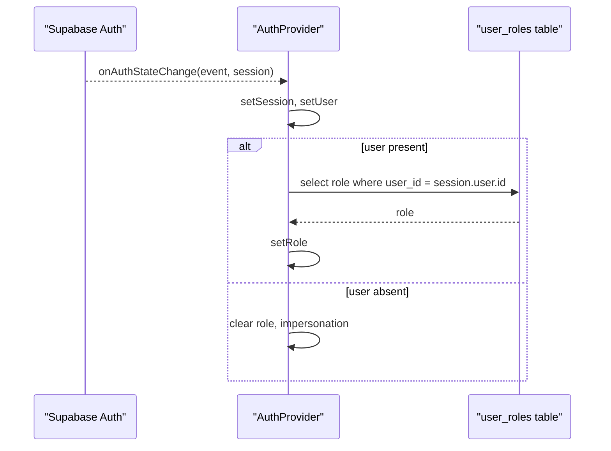
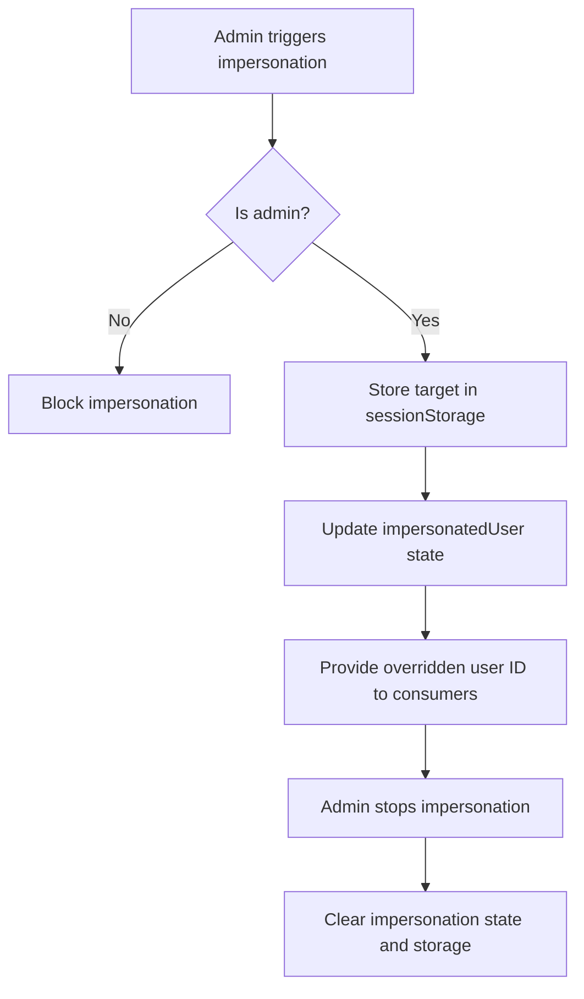
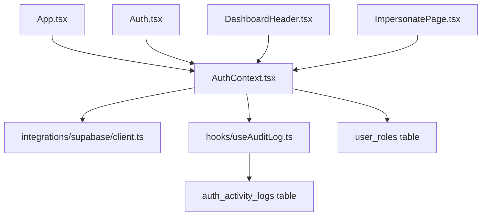

# Authentication Flow

<cite>
**Referenced Files in This Document**
- [AuthContext.tsx](file://src/contexts/AuthContext.tsx)
- [Auth.tsx](file://src/pages/Auth.tsx)
- [client.ts](file://src/integrations/supabase/client.ts)
- [types.ts](file://src/integrations/supabase/types.ts)
- [App.tsx](file://src/App.tsx)
- [useAuditLog.ts](file://src/hooks/useAuditLog.ts)
- [ImpersonatePage.tsx](file://src/components/admin/ImpersonatePage.tsx)
- [DashboardHeader.tsx](file://src/components/dashboard/DashboardHeader.tsx)
- [20260205175436_9782a261-cedc-492e-8661-d963b348e86e.sql](file://supabase/migrations/20260205175436_9782a261-cedc-492e-8661-d963b348e86e.sql)
- [20260209112006_bf09bafc-8595-442f-a43c-f7a6676d0a87.sql](file://supabase/migrations/20260209112006_bf09bafc-8595-442f-a43c-f7a6676d0a87.sql)
</cite>

## Table of Contents
1. [Introduction](#introduction)
2. [Project Structure](#project-structure)
3. [Core Components](#core-components)
4. [Architecture Overview](#architecture-overview)
5. [Detailed Component Analysis](#detailed-component-analysis)
6. [Dependency Analysis](#dependency-analysis)
7. [Performance Considerations](#performance-considerations)
8. [Troubleshooting Guide](#troubleshooting-guide)
9. [Conclusion](#conclusion)

## Introduction
This document explains the complete authentication flow system used by the portal. It covers user login, signup, logout, session management, Supabase integration, token handling, session persistence, the AuthProvider implementation, user state management, real-time authentication state changes, authentication hooks usage, protected route patterns, and error handling. It also documents the relationship between authentication state and other system components.

## Project Structure
The authentication system is centered around a React Context provider that wraps the entire application and integrates with Supabase for authentication and session persistence. Key files include:
- Application shell and routing with AuthProvider at the root
- Authentication UI and logic
- Supabase client configuration with automatic token refresh and session persistence
- Audit logging hooks and database tables for auth activity
- Admin impersonation features

**Diagram sources**
- [App.tsx](file://src/App.tsx#L56-L77)
- [AuthContext.tsx](file://src/contexts/AuthContext.tsx#L35-L213)
- [Auth.tsx](file://src/pages/Auth.tsx#L21-L100)
- [client.ts](file://src/integrations/supabase/client.ts#L11-L17)
- [useAuditLog.ts](file://src/hooks/useAuditLog.ts#L23-L60)
- [20260205175436_9782a261-cedc_492e_8661-d963b348e86e.sql](file://supabase/migrations/20260205175436_9782a261-cedc-492e-8661-d963b348e86e.sql#L1-L64)

**Section sources**
- [App.tsx](file://src/App.tsx#L56-L77)
- [AuthContext.tsx](file://src/contexts/AuthContext.tsx#L35-L213)
- [client.ts](file://src/integrations/supabase/client.ts#L11-L17)

## Core Components
- AuthProvider: Centralizes authentication state, exposes sign-in/sign-up/sign-out, role resolution, impersonation, and real-time auth state synchronization with Supabase.
- Auth UI: Handles login form submission, validation, rate limiting, and redirects after successful login.
- Supabase Client: Configured with local storage-backed session persistence, automatic token refresh, and publishable key.
- Audit Hooks: Centralized logging for login/logout/impersonation actions and failures.
- Protected Components: Components enforce authentication via presence of user/session state.

Key responsibilities:
- Real-time auth state via Supabase auth listeners
- Role resolution from a user_roles table
- Impersonation mode with session isolation
- Audit logging for security and compliance
- Protected route behavior enforced by checking user state

**Section sources**
- [AuthContext.tsx](file://src/contexts/AuthContext.tsx#L9-L33)
- [Auth.tsx](file://src/pages/Auth.tsx#L21-L100)
- [client.ts](file://src/integrations/supabase/client.ts#L11-L17)
- [useAuditLog.ts](file://src/hooks/useAuditLog.ts#L23-L60)

## Architecture Overview
The authentication flow integrates React Context with Supabase Auth. The AuthProvider subscribes to Supabase’s auth state changes, resolves user roles, manages impersonation, and exposes authentication APIs to the rest of the app. The Supabase client persists sessions in localStorage and auto-refreshes tokens. Audit logs capture login/logout and impersonation events.

**Diagram sources**
- [App.tsx](file://src/App.tsx#L56-L77)
- [AuthContext.tsx](file://src/contexts/AuthContext.tsx#L64-L108)
- [Auth.tsx](file://src/pages/Auth.tsx#L53-L100)
- [client.ts](file://src/integrations/supabase/client.ts#L11-L17)
- [useAuditLog.ts](file://src/hooks/useAuditLog.ts#L23-L60)

## Detailed Component Analysis

### AuthProvider Implementation
AuthProvider manages:
- Authentication state: user, session, role, loading
- Real-time auth listener: subscribes to Supabase auth state changes
- Role resolution: queries user_roles table for the current user
- Impersonation: admin-only ability to switch identity while preserving original session
- Authentication actions: signIn, signUp, signOut
- Utility: hasRole for permission checks

**Diagram sources**
- [AuthContext.tsx](file://src/contexts/AuthContext.tsx#L35-L213)
- [client.ts](file://src/integrations/supabase/client.ts#L11-L17)

**Section sources**
- [AuthContext.tsx](file://src/contexts/AuthContext.tsx#L35-L213)

### Authentication UI and Login Flow
The login page validates input, normalizes LRN/email, throttles failed attempts, and calls the AuthProvider’s signIn. On success, it navigates to the dashboard and logs audit events.

**Diagram sources**
- [Auth.tsx](file://src/pages/Auth.tsx#L53-L100)
- [AuthContext.tsx](file://src/contexts/AuthContext.tsx#L110-L128)

**Section sources**
- [Auth.tsx](file://src/pages/Auth.tsx#L53-L100)
- [AuthContext.tsx](file://src/contexts/AuthContext.tsx#L110-L128)

### Supabase Integration and Session Persistence
The Supabase client is configured with:
- Storage: localStorage
- Persist session: true
- Auto refresh token: true

This ensures sessions persist across browser restarts and tokens are refreshed automatically.

**Section sources**
- [client.ts](file://src/integrations/supabase/client.ts#L11-L17)

### Token Handling and Real-Time State Changes
AuthProvider subscribes to Supabase auth state changes to keep user, session, and role synchronized. Role resolution is deferred until after the auth state update to ensure the user ID is available.

**Diagram sources**
- [AuthContext.tsx](file://src/contexts/AuthContext.tsx#L75-L94)
- [AuthContext.tsx](file://src/contexts/AuthContext.tsx#L44-L62)

**Section sources**
- [AuthContext.tsx](file://src/contexts/AuthContext.tsx#L75-L94)
- [AuthContext.tsx](file://src/contexts/AuthContext.tsx#L44-L62)

### Impersonation Mode
Admins can impersonate other users. The system:
- Validates admin role
- Stores impersonation target in sessionStorage
- Temporarily overrides user ID in the exposed context
- Logs impersonation start/stop actions

**Diagram sources**
- [AuthContext.tsx](file://src/contexts/AuthContext.tsx#L161-L187)
- [ImpersonatePage.tsx](file://src/components/admin/ImpersonatePage.tsx#L85-L97)

**Section sources**
- [AuthContext.tsx](file://src/contexts/AuthContext.tsx#L161-L187)
- [ImpersonatePage.tsx](file://src/components/admin/ImpersonatePage.tsx#L85-L97)

### Authentication Hooks Usage
Common usage patterns:
- Use AuthProvider at the root of the app
- Consume useAuth in components to access user, session, role, and actions
- Guard routes by checking user state and redirecting to /auth when unauthenticated
- Use hasRole for fine-grained permissions

Examples of usage locations:
- Dashboard header uses signOut
- Impersonation page uses impersonate/stopImpersonating
- Many components guard access using user presence

**Section sources**
- [DashboardHeader.tsx](file://src/components/dashboard/DashboardHeader.tsx#L25-L26)
- [ImpersonatePage.tsx](file://src/components/admin/ImpersonatePage.tsx#L28-L29)
- [AuthContext.tsx](file://src/contexts/AuthContext.tsx#L192-L192)

### Protected Route Implementation
Protected routes are enforced by checking authentication state:
- Root route checks user state and redirects to /auth if missing
- Other components guard access using user presence

**Section sources**
- [App.tsx](file://src/App.tsx#L62-L74)
- [Auth.tsx](file://src/pages/Auth.tsx#L32-L36)

### Error Handling Patterns
- Login errors are surfaced to the UI and logged as audit events
- Role fetch failures default to a safe role
- Sign out warnings are caught and logged
- Audit logging is resilient and does not break the app

**Section sources**
- [Auth.tsx](file://src/pages/Auth.tsx#L79-L99)
- [AuthContext.tsx](file://src/contexts/AuthContext.tsx#L54-L61)
- [AuthContext.tsx](file://src/contexts/AuthContext.tsx#L156-L158)
- [useAuditLog.ts](file://src/hooks/useAuditLog.ts#L53-L60)

## Dependency Analysis
The authentication system depends on:
- Supabase client for auth operations and session persistence
- Supabase database for user roles and audit logs
- React Context for state distribution
- UI components for authentication UX and protected UI

**Diagram sources**
- [AuthContext.tsx](file://src/contexts/AuthContext.tsx#L35-L213)
- [client.ts](file://src/integrations/supabase/client.ts#L11-L17)
- [useAuditLog.ts](file://src/hooks/useAuditLog.ts#L23-L60)
- [20260205175436_9782a261-cedc_492e_8661-d963b348e86e.sql](file://supabase/migrations/20260205175436_9782a261-cedc-492e-8661-d963b348e86e.sql#L1-L64)
- [App.tsx](file://src/App.tsx#L56-L77)
- [Auth.tsx](file://src/pages/Auth.tsx#L21-L100)
- [DashboardHeader.tsx](file://src/components/dashboard/DashboardHeader.tsx#L25-L26)
- [ImpersonatePage.tsx](file://src/components/admin/ImpersonatePage.tsx#L28-L29)

**Section sources**
- [AuthContext.tsx](file://src/contexts/AuthContext.tsx#L35-L213)
- [client.ts](file://src/integrations/supabase/client.ts#L11-L17)
- [useAuditLog.ts](file://src/hooks/useAuditLog.ts#L23-L60)
- [20260205175436_9782a261-cedc_492e_8661-d963b348e86e.sql](file://supabase/migrations/20260205175436_9782a261-cedc-492e-8661-d963b348e86e.sql#L1-L64)

## Performance Considerations
- Session persistence in localStorage avoids repeated sign-ins across browser sessions.
- Auto token refresh minimizes re-authentication prompts.
- Role resolution is deferred and cached per session to avoid redundant network calls.
- Impersonation state is stored in sessionStorage to avoid polluting localStorage.

## Troubleshooting Guide
Common issues and resolutions:
- Login fails immediately: Verify Supabase URL and publishable key environment variables are set.
- Role appears as student unexpectedly: Confirm user_roles table contains the user’s role; fallback defaults to student.
- Impersonation blocked: Ensure the acting user has admin role.
- Audit logs not appearing: Check auth_activity_logs table policies and network connectivity to external IP geolocation service used by audit hook.

**Section sources**
- [client.ts](file://src/integrations/supabase/client.ts#L5-L6)
- [AuthContext.tsx](file://src/contexts/AuthContext.tsx#L54-L61)
- [AuthContext.tsx](file://src/contexts/AuthContext.tsx#L162-L165)
- [useAuditLog.ts](file://src/hooks/useAuditLog.ts#L26-L38)
- [20260205175436_9782a261-cedc_492e_8661-d963b348e86e.sql](file://supabase/migrations/20260205175436_9782a261-cedc-492e-8661-d963b348e86e.sql#L18-L30)

## Conclusion
The authentication system provides a robust, real-time, and secure foundation for the portal. It leverages Supabase for reliable session management and token handling, centralizes state via a React Context provider, and enforces protection through user-state checks. Audit logging and impersonation capabilities enhance security and operational visibility. Together, these components deliver a scalable and maintainable authentication solution.