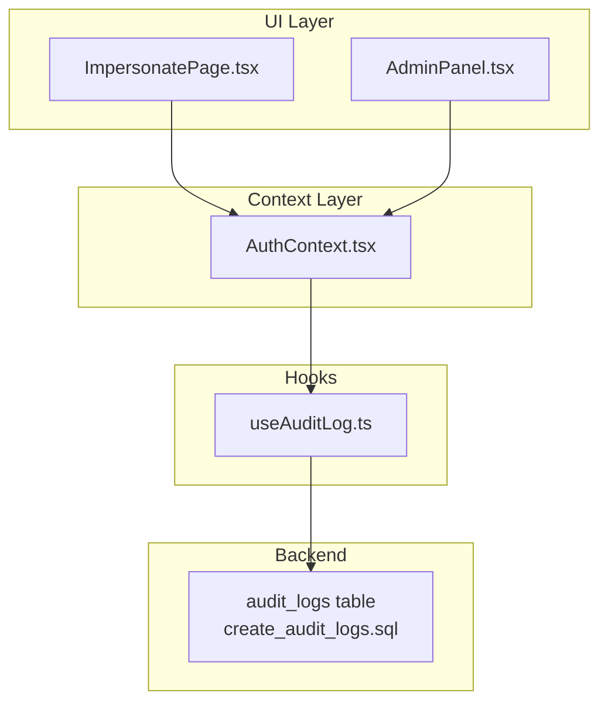
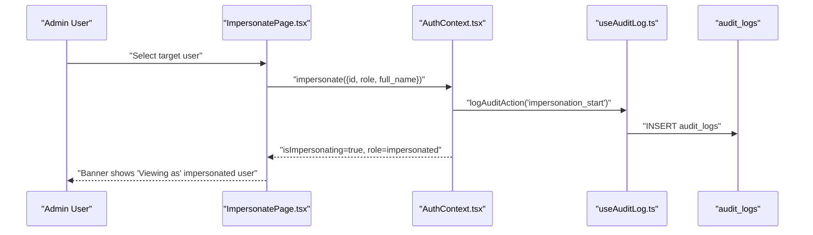
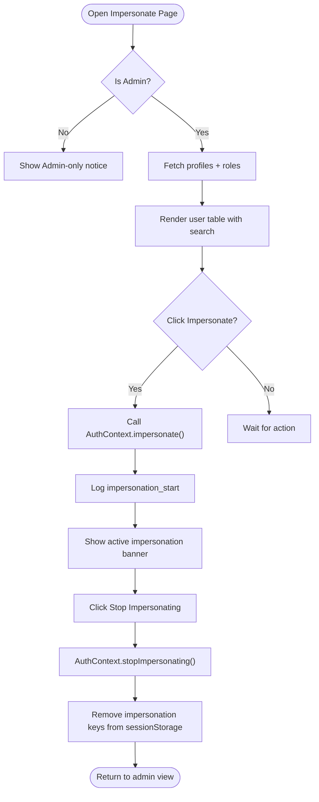
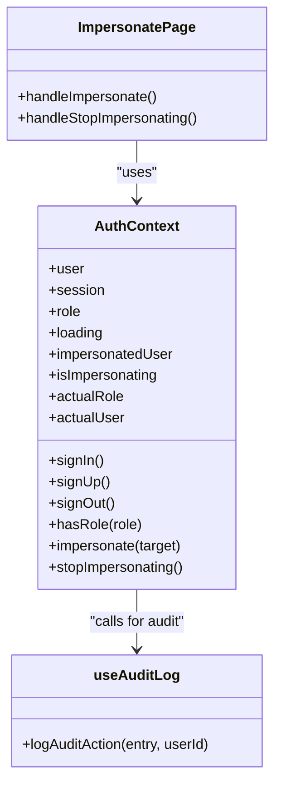
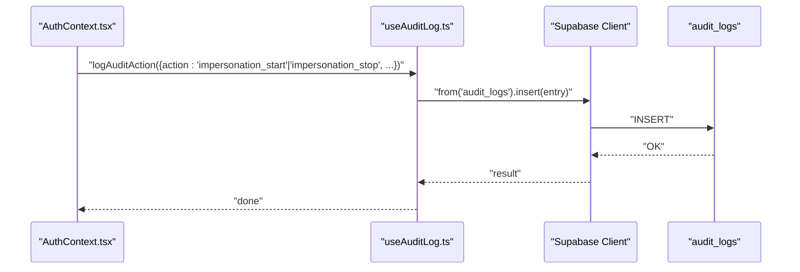
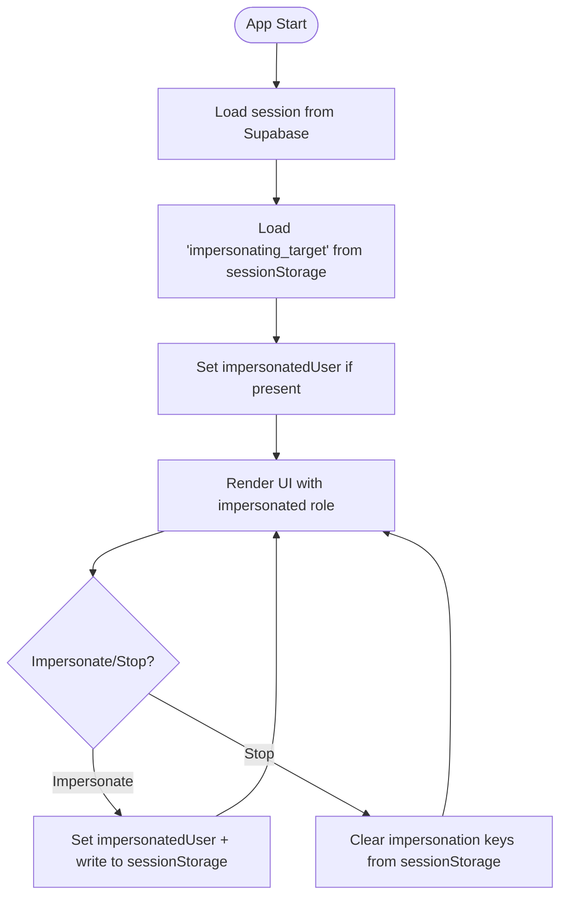
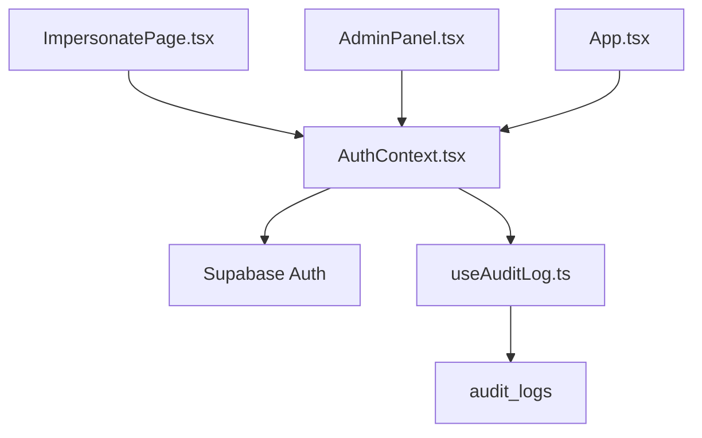

# Impersonation System

<cite>
**Referenced Files in This Document**
- [ImpersonatePage.tsx](file://src/components/admin/ImpersonatePage.tsx)
- [AuthContext.tsx](file://src/contexts/AuthContext.tsx)
- [useAuditLog.ts](file://src/hooks/useAuditLog.ts)
- [App.tsx](file://src/App.tsx)
- [create_audit_logs.sql](file://supabase/migrations/20260209100000_create_audit_logs.sql)
- [AuditDashboard.tsx](file://src/components/management/AuditDashboard.tsx)
- [AdminPanel.tsx](file://src/components/admin/AdminPanel.tsx)
</cite>

## Table of Contents
1. [Introduction](#introduction)
2. [Project Structure](#project-structure)
3. [Core Components](#core-components)
4. [Architecture Overview](#architecture-overview)
5. [Detailed Component Analysis](#detailed-component-analysis)
6. [Dependency Analysis](#dependency-analysis)
7. [Performance Considerations](#performance-considerations)
8. [Troubleshooting Guide](#troubleshooting-guide)
9. [Conclusion](#conclusion)

## Introduction
This document explains the user impersonation system that enables administrators to temporarily assume other users' identities for troubleshooting and support. It covers the workflow, security controls, audit logging, session management, data isolation, automatic cleanup, UI components, permission checks, and safe practices. The system leverages Supabase for authentication and PostgreSQL audit logging, with React state and sessionStorage for runtime state persistence.

## Project Structure
The impersonation system spans UI components, authentication context, and backend audit logging:
- UI: ImpersonatePage provides the admin interface to select and impersonate users.
- Authentication: AuthContext manages roles, impersonation state, and session lifecycle.
- Audit: useAuditLog writes impersonation events to the audit_logs table.
- Backend: Supabase migration defines audit_logs schema and policies.

**Diagram sources**
- [ImpersonatePage.tsx](file://src/components/admin/ImpersonatePage.tsx#L28-L97)
- [AuthContext.tsx](file://src/contexts/AuthContext.tsx#L35-L215)
- [useAuditLog.ts](file://src/hooks/useAuditLog.ts#L23-L60)
- [create_audit_logs.sql](file://supabase/migrations/20260209100000_create_audit_logs.sql#L1-L38)

**Section sources**
- [ImpersonatePage.tsx](file://src/components/admin/ImpersonatePage.tsx#L1-L236)
- [AuthContext.tsx](file://src/contexts/AuthContext.tsx#L1-L216)
- [useAuditLog.ts](file://src/hooks/useAuditLog.ts#L1-L69)
- [create_audit_logs.sql](file://supabase/migrations/20260209100000_create_audit_logs.sql#L1-L38)

## Core Components
- ImpersonatePage: Admin-facing UI to search, select, and impersonate users; displays active impersonation banner and stop controls.
- AuthContext: Centralized authentication and impersonation state, including role checks, impersonation setters, and cleanup.
- useAuditLog: Writes impersonation start/stop events to the audit_logs table with contextual metadata.
- AuditDashboard: Visualizes impersonation events alongside other system actions.

**Section sources**
- [ImpersonatePage.tsx](file://src/components/admin/ImpersonatePage.tsx#L28-L97)
- [AuthContext.tsx](file://src/contexts/AuthContext.tsx#L163-L189)
- [useAuditLog.ts](file://src/hooks/useAuditLog.ts#L4-L21)
- [AuditDashboard.tsx](file://src/components/management/AuditDashboard.tsx#L65-L74)

## Architecture Overview
The impersonation workflow integrates UI selection, context state updates, and audit logging. It preserves data isolation by switching the effective user identity while retaining the original admin session.

**Diagram sources**
- [ImpersonatePage.tsx](file://src/components/admin/ImpersonatePage.tsx#L85-L92)
- [AuthContext.tsx](file://src/contexts/AuthContext.tsx#L163-L177)
- [useAuditLog.ts](file://src/hooks/useAuditLog.ts#L23-L60)
- [create_audit_logs.sql](file://supabase/migrations/20260209100000_create_audit_logs.sql#L1-L15)

## Detailed Component Analysis

### ImpersonatePage: Admin UI for Impersonation
Responsibilities:
- Lists users with search/filter capabilities.
- Validates admin role and prevents self-impersonation.
- Triggers impersonation via AuthContext and shows feedback.
- Displays an active impersonation banner with stop option.

Key behaviors:
- Admin-only visibility ensures only authorized users can access the user list.
- Search filters by name, email, and role.
- Disables impersonation buttons appropriately to prevent redundant actions.
- Uses toast notifications for user feedback.

**Diagram sources**
- [ImpersonatePage.tsx](file://src/components/admin/ImpersonatePage.tsx#L28-L97)
- [AuthContext.tsx](file://src/contexts/AuthContext.tsx#L163-L189)

**Section sources**
- [ImpersonatePage.tsx](file://src/components/admin/ImpersonatePage.tsx#L28-L97)

### AuthContext: Authentication and Impersonation State
Responsibilities:
- Manages user, session, and role state.
- Loads persisted impersonation target from sessionStorage on startup.
- Enforces admin-only impersonation capability.
- Provides impersonate and stopImpersonating functions.
- Cleans up state and sessionStorage on sign-out and auth state changes.

Security and session management:
- Role gate blocks non-admins from impersonating.
- Persists impersonation target in sessionStorage for cross-page reloads.
- Clears impersonation keys on sign-out and auth state changes.
- Exposes actualRole/actualUser for UI differentiation.

**Diagram sources**
- [AuthContext.tsx](file://src/contexts/AuthContext.tsx#L9-L23)
- [ImpersonatePage.tsx](file://src/components/admin/ImpersonatePage.tsx#L85-L97)
- [useAuditLog.ts](file://src/hooks/useAuditLog.ts#L23-L60)

**Section sources**
- [AuthContext.tsx](file://src/contexts/AuthContext.tsx#L41-L110)
- [AuthContext.tsx](file://src/contexts/AuthContext.tsx#L163-L189)

### Audit Logging: Impersonation Events
Responsibilities:
- Defines supported audit actions including impersonation_start and impersonation_stop.
- Collects IP geolocation, user agent, and optional LRN/school metadata.
- Inserts entries into the audit_logs table with row-level security policies.

Integration:
- Called from AuthContext during impersonation start/stop.
- Visualized in AuditDashboard with distinct badges for impersonation actions.

**Diagram sources**
- [AuthContext.tsx](file://src/contexts/AuthContext.tsx#L169-L184)
- [useAuditLog.ts](file://src/hooks/useAuditLog.ts#L23-L60)
- [create_audit_logs.sql](file://supabase/migrations/20260209100000_create_audit_logs.sql#L1-L15)

**Section sources**
- [useAuditLog.ts](file://src/hooks/useAuditLog.ts#L4-L21)
- [useAuditLog.ts](file://src/hooks/useAuditLog.ts#L23-L60)
- [create_audit_logs.sql](file://supabase/migrations/20260209100000_create_audit_logs.sql#L1-L38)
- [AuditDashboard.tsx](file://src/components/management/AuditDashboard.tsx#L65-L74)

### Session Management and Data Isolation
- Runtime state: Impersonation target is stored in sessionStorage to survive page reloads.
- Identity switching: AuthContext merges impersonated identity into the current user object for downstream components.
- Data isolation: Components read from the impersonated context; backend queries remain bound to the authenticated admin session.
- Cleanup: Both stopImpersonating and sign-out remove impersonation keys from sessionStorage.

**Diagram sources**
- [AuthContext.tsx](file://src/contexts/AuthContext.tsx#L66-L75)
- [AuthContext.tsx](file://src/contexts/AuthContext.tsx#L163-L189)

**Section sources**
- [AuthContext.tsx](file://src/contexts/AuthContext.tsx#L66-L75)
- [AuthContext.tsx](file://src/contexts/AuthContext.tsx#L163-L189)

### Permission Checks and Safe Practices
- Admin-only: Only users with role admin can impersonate; unauthorized attempts are blocked.
- Self-impersonation prevention: UI disables impersonating the currently logged-in admin.
- Explicit stop: Users must actively stop impersonation; there is no automatic timeout.
- Audit trail: Every impersonation start/stop is logged with contextual metadata.

**Section sources**
- [AuthContext.tsx](file://src/contexts/AuthContext.tsx#L163-L167)
- [ImpersonatePage.tsx](file://src/components/admin/ImpersonatePage.tsx#L181-L194)
- [useAuditLog.ts](file://src/hooks/useAuditLog.ts#L23-L60)

## Dependency Analysis
The impersonation system depends on:
- Supabase for authentication and audit logging.
- React Query for caching and data invalidation.
- Tailwind/UI components for rendering.

**Diagram sources**
- [AuthContext.tsx](file://src/contexts/AuthContext.tsx#L3-L4)
- [useAuditLog.ts](file://src/hooks/useAuditLog.ts#L1-L2)
- [ImpersonatePage.tsx](file://src/components/admin/ImpersonatePage.tsx#L9-L11)
- [App.tsx](file://src/App.tsx#L7)

**Section sources**
- [AuthContext.tsx](file://src/contexts/AuthContext.tsx#L3-L4)
- [useAuditLog.ts](file://src/hooks/useAuditLog.ts#L1-L2)
- [ImpersonatePage.tsx](file://src/components/admin/ImpersonatePage.tsx#L9-L11)
- [App.tsx](file://src/App.tsx#L7)

## Performance Considerations
- SessionStorage usage: Minimal overhead; avoid large payloads in sessionStorage.
- Audit logging: Network requests are best-effort and do not block UI.
- Role fetching: Deferred after auth state changes to keep initial render responsive.

## Troubleshooting Guide
Common issues and resolutions:
- Cannot impersonate: Verify the current user has role admin; unauthorized attempts are blocked.
- Impersonation not persisting after reload: Ensure sessionStorage is enabled and not cleared by browser settings.
- No impersonation logs: Confirm audit_logs table exists and policies allow inserts; check network errors in the console.
- Active impersonation banner missing: Check that the admin route renders ImpersonatePage and that AuthContext.isImpersonating is true.

**Section sources**
- [AuthContext.tsx](file://src/contexts/AuthContext.tsx#L163-L167)
- [AuthContext.tsx](file://src/contexts/AuthContext.tsx#L66-L75)
- [useAuditLog.ts](file://src/hooks/useAuditLog.ts#L23-L60)
- [create_audit_logs.sql](file://supabase/migrations/20260209100000_create_audit_logs.sql#L1-L38)

## Conclusion
The impersonation system provides a secure, auditable mechanism for administrators to troubleshoot and support users. It enforces strict role-based access, persists state across reloads, maintains data isolation, and records all impersonation actions for accountability. Administrators should always stop impersonation explicitly and follow safe practices to minimize risk.