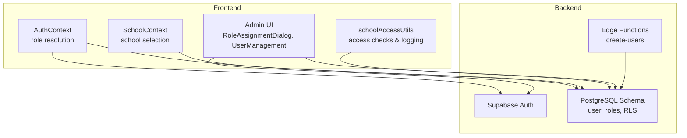
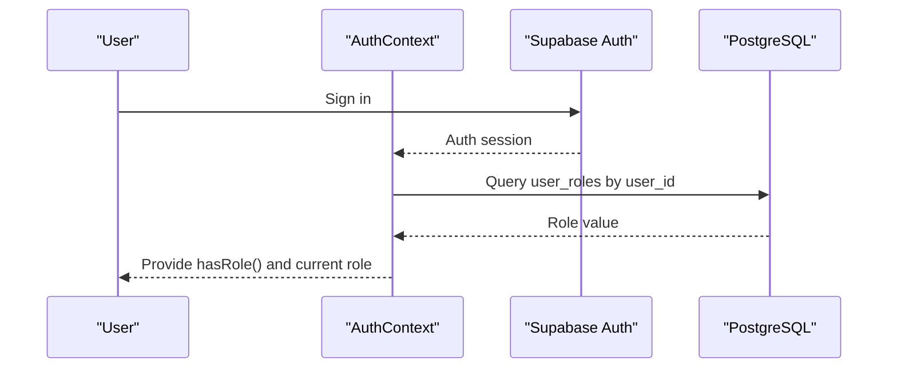
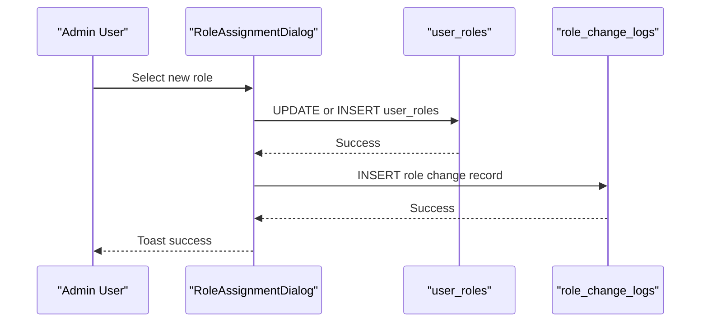
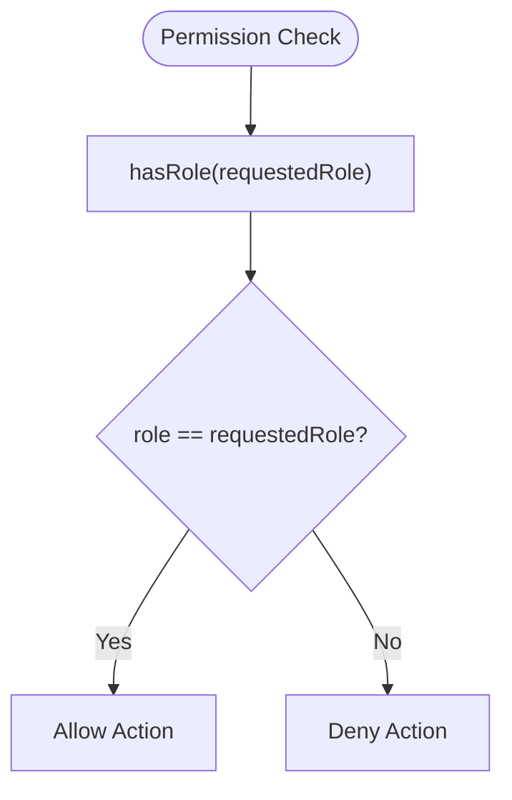
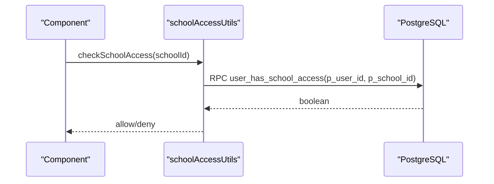
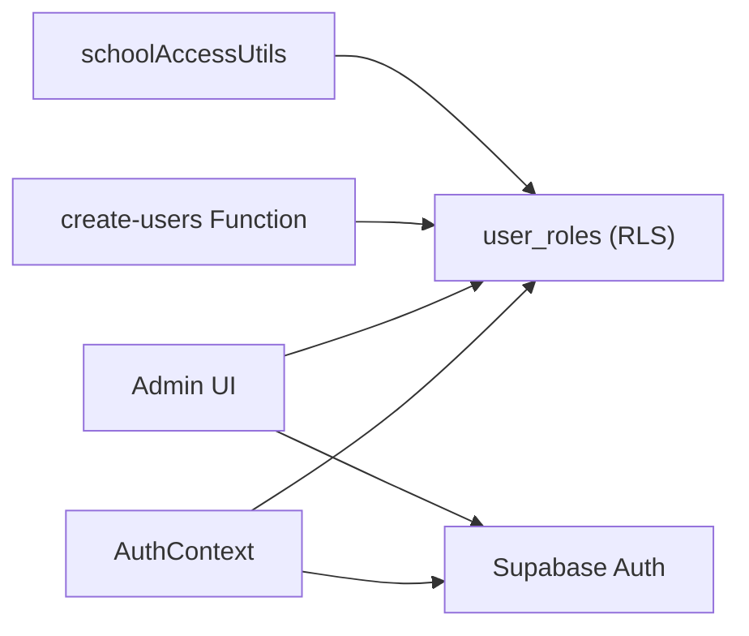

# Role-Based Access Control

<cite>
**Referenced Files in This Document**
- [AuthContext.tsx](file://src/contexts/AuthContext.tsx)
- [SchoolContext.tsx](file://src/contexts/SchoolContext.tsx)
- [schoolAccessUtils.ts](file://src/utils/schoolAccessUtils.ts)
- [types.ts](file://src/integrations/supabase/types.ts)
- [20251217200033_03f3cae0-102d-45cf-9b2e-a9b257e4e2e4.sql](file://supabase/migrations/20251217200033_03f3cae0-102d-45cf-9b2e-a9b257e4e2e4.sql)
- [20260209100000_create_audit_logs.sql](file://supabase/migrations/20260209100000_create_audit_logs.sql)
- [20260210120000_grant_stfxsa_finance_access.sql](file://supabase/migrations/20260210120000_grant_stfxsa_finance_access.sql)
- [RoleAssignmentDialog.tsx](file://src/components/admin/RoleAssignmentDialog.tsx)
- [UserManagement.tsx](file://src/components/admin/UserManagement.tsx)
- [ImpersonatePage.tsx](file://src/components/admin/ImpersonatePage.tsx)
- [PermissionManagement.tsx](file://src/components/admin/PermissionManagement.tsx)
- [PaymentCollection.tsx](file://src/components/finance/PaymentCollection.tsx)
- [create-users/index.ts](file://supabase/functions/create-users/index.ts)
</cite>

## Table of Contents
1. [Introduction](#introduction)
2. [Project Structure](#project-structure)
3. [Core Components](#core-components)
4. [Architecture Overview](#architecture-overview)
5. [Detailed Component Analysis](#detailed-component-analysis)
6. [Dependency Analysis](#dependency-analysis)
7. [Performance Considerations](#performance-considerations)
8. [Troubleshooting Guide](#troubleshooting-guide)
9. [Conclusion](#conclusion)

## Introduction
This document describes the role-based access control (RBAC) system used by the application. It covers the six user roles (admin, registrar, teacher, student, parent, finance), how roles are assigned and enforced, how permissions are checked, and how roles integrate with the multi-school context. It also documents the user_roles table structure, role management workflows, and practical examples of role-based UI rendering and permission enforcement.

## Project Structure
The RBAC system spans frontend contexts, backend database schema, Row-Level Security (RLS) policies, and Supabase Edge Functions. Key areas include:
- Authentication and role resolution in the Auth Context
- Multi-school access utilities and policies
- Database schema and RLS for user roles and school access
- Administrative UI for role assignment and impersonation
- Finance-specific role handling and access grants



**Diagram sources**
- [AuthContext.tsx](file://src/contexts/AuthContext.tsx#L35-L110)
- [SchoolContext.tsx](file://src/contexts/SchoolContext.tsx#L51-L70)
- [schoolAccessUtils.ts](file://src/utils/schoolAccessUtils.ts#L75-L107)
- [20251217200033_03f3cae0-102d-45cf-9b2e-a9b257e4e2e4.sql](file://supabase/migrations/20251217200033_03f3cae0-102d-45cf-9b2e-a9b257e4e2e4.sql#L14-L26)
- [create-users/index.ts](file://supabase/functions/create-users/index.ts#L120-L140)

**Section sources**
- [AuthContext.tsx](file://src/contexts/AuthContext.tsx#L35-L110)
- [SchoolContext.tsx](file://src/contexts/SchoolContext.tsx#L51-L70)
- [schoolAccessUtils.ts](file://src/utils/schoolAccessUtils.ts#L75-L107)
- [20251217200033_03f3cae0-102d-45cf-9b2e-a9b257e4e2e4.sql](file://supabase/migrations/20251217200033_03f3cae0-102d-45cf-9b2e-a9b257e4e2e4.sql#L14-L26)

## Core Components
- Role enumeration and context: The application defines a union type for roles and resolves the current role per session.
- Role persistence: Roles are stored in the user_roles table with RLS policies.
- Multi-school integration: Access to data is governed by school-level policies and utilities.
- Administrative controls: UI dialogs and functions enable role assignment, impersonation, and permission management.
- Finance role: Specialized handling for finance users with explicit grants and policies.

**Section sources**
- [AuthContext.tsx](file://src/contexts/AuthContext.tsx#L7-L23)
- [20251217200033_03f3cae0-102d-45cf-9b2e-a9b257e4e2e4.sql](file://supabase/migrations/20251217200033_03f3cae0-102d-45cf-9b2e-a9b257e4e2e4.sql#L1-L2)
- [schoolAccessUtils.ts](file://src/utils/schoolAccessUtils.ts#L75-L107)
- [RoleAssignmentDialog.tsx](file://src/components/admin/RoleAssignmentDialog.tsx#L40-L49)

## Architecture Overview
The RBAC architecture combines:
- Frontend role resolution via AuthContext
- Backend role storage and RLS policies
- Multi-school access checks and logging
- Administrative workflows for role changes and impersonation
- Finance-specific access grants



**Diagram sources**
- [AuthContext.tsx](file://src/contexts/AuthContext.tsx#L44-L64)
- [20251217200033_03f3cae0-102d-45cf-9b2e-a9b257e4e2e4.sql](file://supabase/migrations/20251217200033_03f3cae0-102d-45cf-9b2e-a9b257e4e2e4.sql#L44-L52)

## Detailed Component Analysis

### Role Model and Permissions
- Roles supported: admin, registrar, teacher, student, parent, finance
- Role resolution: The AuthContext resolves the user’s role from the user_roles table and exposes a hasRole() method for permission checks.
- Default role: On signup, a default student role is assigned via a trigger.
- Finance role: Explicitly included in the app_role enum and granted access to finance-related features and data.

```mermaid
classDiagram
class AppRole {
<<enum>>
"admin"
"registrar"
"teacher"
"student"
"parent"
"finance"
}
class AuthContext {
+role : AppRole
+hasRole(role) boolean
+signIn()
+signOut()
}
class UserRolesTable {
+user_id : UUID
+role : AppRole
+created_at : timestamp
}
AppRole <.. AuthContext : "resolved from"
UserRolesTable --> AuthContext : "queried by"
```

**Diagram sources**
- [AuthContext.tsx](file://src/contexts/AuthContext.tsx#L7-L23)
- [20251217200033_03f3cae0-102d-45cf-9b2e-a9b257e4e2e4.sql](file://supabase/migrations/20251217200033_03f3cae0-102d-45cf-9b2e-a9b257e4e2e4.sql#L1-L2)
- [20251217200033_03f3cae0-102d-45cf-9b2e-a9b257e4e2e4.sql](file://supabase/migrations/20251217200033_03f3cae0-102d-45cf-9b2e-a9b257e4e2e4.sql#L14-L21)

**Section sources**
- [AuthContext.tsx](file://src/contexts/AuthContext.tsx#L7-L23)
- [20251217200033_03f3cae0-102d-45cf-9b2e-a9b257e4e2e4.sql](file://supabase/migrations/20251217200033_03f3cae0-102d-45cf-9b2e-a9b257e4e2e4.sql#L1-L2)
- [20251217200033_03f3cae0-102d-45cf-9b2e-a9b257e4e2e4.sql](file://supabase/migrations/20251217200033_03f3cae0-102d-45cf-9b2e-a9b257e4e2e4.sql#L44-L52)

### Role Assignment Mechanism
- Admin-only assignment: Only users with the admin role can change another user’s role.
- Mutation workflow: The RoleAssignmentDialog updates the user_roles table and logs changes to a dedicated audit table.
- Upsert behavior: If no existing role row is found, a new row is inserted.



**Diagram sources**
- [RoleAssignmentDialog.tsx](file://src/components/admin/RoleAssignmentDialog.tsx#L58-L104)
- [20251217200033_03f3cae0-102d-45cf-9b2e-a9b257e4e2e4.sql](file://supabase/migrations/20251217200033_03f3cae0-102d-45cf-9b2e-a9b257e4e2e4.sql#L68-L69)

**Section sources**
- [RoleAssignmentDialog.tsx](file://src/components/admin/RoleAssignmentDialog.tsx#L40-L49)
- [RoleAssignmentDialog.tsx](file://src/components/admin/RoleAssignmentDialog.tsx#L58-L104)

### Permission Checking Functions
- Frontend checks: The hasRole() method in AuthContext compares the resolved role against the requested role.
- Backend checks: RLS policies enforce who can view or modify roles, and who can access school-bound data.
- Finance access: Dedicated function and policy grant finance users access to specific school data.



**Diagram sources**
- [AuthContext.tsx](file://src/contexts/AuthContext.tsx#L194-L194)
- [20251217200033_03f3cae0-102d-45cf-9b2e-a9b257e4e2e4.sql](file://supabase/migrations/20251217200033_03f3cae0-102d-45cf-9b2e-a9b257e4e2e4.sql#L65-L69)

**Section sources**
- [AuthContext.tsx](file://src/contexts/AuthContext.tsx#L194-L194)
- [20251217200033_03f3cae0-102d-45cf-9b2e-a9b257e4e2e4.sql](file://supabase/migrations/20251217200033_03f3cae0-102d-45cf-9b2e-a9b257e4e2e4.sql#L65-L69)

### Role Hierarchy and Scope
- Role scope: Roles are primarily scoped to the application context; however, multi-school access is managed separately via school access utilities and policies.
- Finance role: Explicitly recognized and granted access to finance-related data and workflows.

**Section sources**
- [20251217200033_03f3cae0-102d-45cf-9b2e-a9b257e4e2e4.sql](file://supabase/migrations/20251217200033_03f3cae0-102d-45cf-9b2e-a9b257e4e2e4.sql#L1-L2)
- [20260210120000_grant_stfxsa_finance_access.sql](file://supabase/migrations/20260210120000_grant_stfxsa_finance_access.sql#L48-L70)

### Multi-School Context Integration
- School access checks: Utility functions verify whether a user has access to a given school and enumerate accessible schools.
- Access logging: Operations on school-bound data are logged for auditability.
- Data isolation: Queries are wrapped to automatically include school_id and academic_year_id, ensuring data remains isolated per school/year.



**Diagram sources**
- [schoolAccessUtils.ts](file://src/utils/schoolAccessUtils.ts#L78-L88)
- [20251217200033_03f3cae0-102d-45cf-9b2e-a9b257e4e2e4.sql](file://supabase/migrations/20251217200033_03f3cae0-102d-45cf-9b2e-a9b257e4e2e4.sql#L3927-L3930)

**Section sources**
- [schoolAccessUtils.ts](file://src/utils/schoolAccessUtils.ts#L78-L107)
- [schoolAccessUtils.ts](file://src/utils/schoolAccessUtils.ts#L376-L467)

### Role-Based UI Rendering and Guards
- Conditional rendering: Components render different UI depending on the current role.
- Guards: Use hasRole() to conditionally show or hide UI elements and routes.
- Examples:
  - RoleAssignmentDialog renders role badges with distinct colors per role.
  - PaymentCollection uses role checks to restrict finance actions.
  - ImpersonatePage allows admin users to temporarily act as another user.

**Section sources**
- [RoleAssignmentDialog.tsx](file://src/components/admin/RoleAssignmentDialog.tsx#L43-L49)
- [PaymentCollection.tsx](file://src/components/finance/PaymentCollection.tsx#L309-L309)
- [ImpersonatePage.tsx](file://src/components/admin/ImpersonatePage.tsx#L50-L50)

### Administrative Controls
- Role assignment: Admins can change roles with optional reason logging and confirmation for sensitive changes.
- Impersonation: Admins can impersonate other users for support or testing, with audit logging and session storage.
- User management: Bulk creation and management of user accounts and credentials.

**Section sources**
- [RoleAssignmentDialog.tsx](file://src/components/admin/RoleAssignmentDialog.tsx#L106-L118)
- [AuthContext.tsx](file://src/contexts/AuthContext.tsx#L163-L189)
- [UserManagement.tsx](file://src/components/admin/UserManagement.tsx#L271-L288)

### Finance Role Integration
- Finance role definition: Included in the app_role enum.
- Access grants: Migrations explicitly grant finance users access to specific school data and set their role in user_roles.
- Edge function integration: The create-users function updates user_roles during provisioning.

**Section sources**
- [20251217200033_03f3cae0-102d-45cf-9b2e-a9b257e4e2e4.sql](file://supabase/migrations/20251217200033_03f3cae0-102d-45cf-9b2e-a9b257e4e2e4.sql#L1-L2)
- [20260210120000_grant_stfxsa_finance_access.sql](file://supabase/migrations/20260210120000_grant_stfxsa_finance_access.sql#L48-L70)
- [create-users/index.ts](file://supabase/functions/create-users/index.ts#L120-L140)

## Dependency Analysis
The RBAC system depends on:
- AuthContext for role resolution and permission checks
- Supabase Auth for session management
- PostgreSQL user_roles table with RLS policies
- Edge Functions for user provisioning and role updates
- schoolAccessUtils for multi-school access and auditing



**Diagram sources**
- [AuthContext.tsx](file://src/contexts/AuthContext.tsx#L44-L64)
- [20251217200033_03f3cae0-102d-45cf-9b2e-a9b257e4e2e4.sql](file://supabase/migrations/20251217200033_03f3cae0-102d-45cf-9b2e-a9b257e4e2e4.sql#L14-L26)
- [create-users/index.ts](file://supabase/functions/create-users/index.ts#L120-L140)
- [schoolAccessUtils.ts](file://src/utils/schoolAccessUtils.ts#L78-L107)

**Section sources**
- [AuthContext.tsx](file://src/contexts/AuthContext.tsx#L44-L64)
- [20251217200033_03f3cae0-102d-45cf-9b2e-a9b257e4e2e4.sql](file://supabase/migrations/20251217200033_03f3cae0-102d-45cf-9b2e-a9b257e4e2e4.sql#L14-L26)
- [create-users/index.ts](file://supabase/functions/create-users/index.ts#L120-L140)
- [schoolAccessUtils.ts](file://src/utils/schoolAccessUtils.ts#L78-L107)

## Performance Considerations
- Role resolution: Minimal overhead; cached per session and resolved once per auth state change.
- RLS policies: Keep queries simple and selective to leverage indexes; avoid unnecessary joins in role-checking contexts.
- Audit logging: Batch or throttle frequent audit events to reduce write load.
- School access utilities: Use RPCs and indexes to minimize latency for access checks.

## Troubleshooting Guide
- Role not updating:
  - Verify the user has admin privileges.
  - Confirm the mutation succeeded and logs were recorded.
- Finance access denied:
  - Ensure the user has a finance role in user_roles and appropriate grants in school access tables.
- Multi-school access issues:
  - Check user_has_school_access RPC response and user_school_access records.
  - Review audit logs for access denials.

**Section sources**
- [RoleAssignmentDialog.tsx](file://src/components/admin/RoleAssignmentDialog.tsx#L58-L104)
- [20260210120000_grant_stfxsa_finance_access.sql](file://supabase/migrations/20260210120000_grant_stfxsa_finance_access.sql#L48-L70)
- [schoolAccessUtils.ts](file://src/utils/schoolAccessUtils.ts#L78-L107)

## Conclusion
The RBAC system combines a simple role model with robust backend enforcement via RLS and administrative controls. Roles are resolved at login and exposed through a straightforward hasRole() interface, while multi-school access is handled by dedicated utilities and policies. Finance-specific roles and grants are explicitly modeled and integrated with provisioning functions to ensure secure and auditable access across the application.