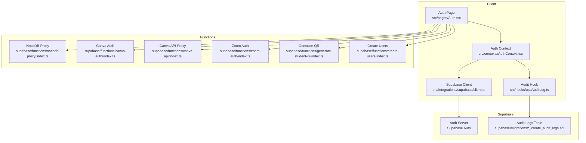
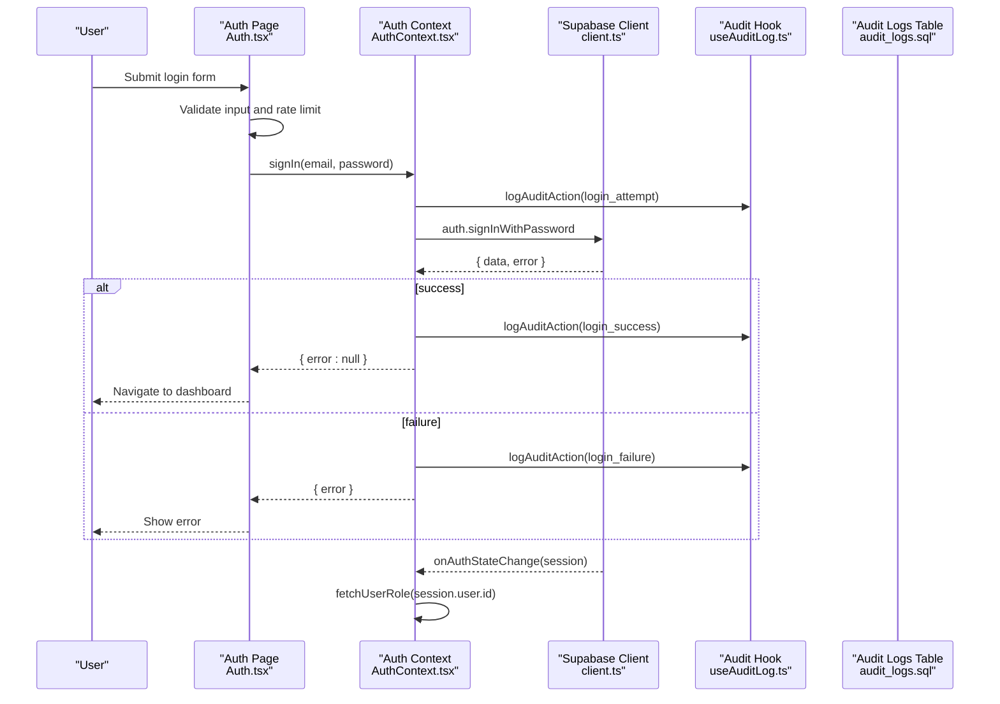
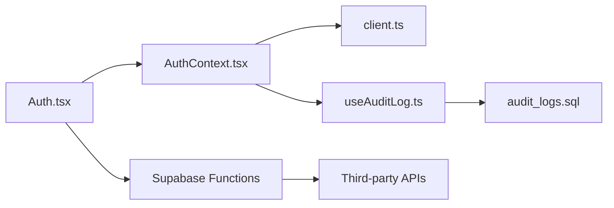

# Security Policies & Best Practices

<cite>
**Referenced Files in This Document**
- [AuthContext.tsx](file://src/contexts/AuthContext.tsx)
- [Auth.tsx](file://src/pages/Auth.tsx)
- [client.ts](file://src/integrations/supabase/client.ts)
- [useAuditLog.ts](file://src/hooks/useAuditLog.ts)
- [20260209100000_create_audit_logs.sql](file://supabase/migrations/20260209100000_create_audit_logs.sql)
- [20251217212846_4bd0879a-4cbe-4887-b15c-7fb0a51779c0.sql](file://supabase/migrations/20251217212846_4bd0879a-4cbe-4887-b15c-7fb0a51779c0.sql)
- [index.ts](file://supabase/functions/nocodb-proxy/index.ts)
- [index.ts](file://supabase/functions/canva-auth/index.ts)
- [index.ts](file://supabase/functions/canva-api/index.ts)
- [index.ts](file://supabase/functions/generate-student-qr/index.ts)
- [index.ts](file://supabase/functions/zoom-auth/index.ts)
- [index.ts](file://supabase/functions/create-users/index.ts)
- [validation.ts](file://src/lib/validation.ts)
</cite>

## Table of Contents
1. [Introduction](#introduction)
2. [Project Structure](#project-structure)
3. [Core Components](#core-components)
4. [Architecture Overview](#architecture-overview)
5. [Detailed Component Analysis](#detailed-component-analysis)
6. [Dependency Analysis](#dependency-analysis)
7. [Performance Considerations](#performance-considerations)
8. [Troubleshooting Guide](#troubleshooting-guide)
9. [Conclusion](#conclusion)
10. [Appendices](#appendices)

## Introduction
This document defines the security policies and best practices for the authentication system. It covers password security requirements, session lifecycle and timeout handling, secure token management, audit logging and monitoring, CORS and CSRF considerations, secure cookie/session handling, secure development practices, vulnerability prevention, incident response, and integration with Supabase security features and custom implementations.

## Project Structure
The authentication system spans client-side React components, a shared Supabase client, and serverless functions. Authentication flows are centralized in the Auth provider and page, with audit logging integrated via a dedicated hook. Supabase-managed authentication is complemented by custom serverless functions for third-party integrations.

**Diagram sources**
- [Auth.tsx](file://src/pages/Auth.tsx#L1-L243)
- [AuthContext.tsx](file://src/contexts/AuthContext.tsx#L1-L216)
- [client.ts](file://src/integrations/supabase/client.ts#L1-L17)
- [useAuditLog.ts](file://src/hooks/useAuditLog.ts#L1-L69)
- [20260209100000_create_audit_logs.sql](file://supabase/migrations/20260209100000_create_audit_logs.sql#L1-L38)
- [index.ts](file://supabase/functions/nocodb-proxy/index.ts#L1-L71)
- [index.ts](file://supabase/functions/canva-auth/index.ts#L34-L81)
- [index.ts](file://supabase/functions/canva-api/index.ts#L75-L117)
- [index.ts](file://supabase/functions/zoom-auth/index.ts#L35-L119)
- [index.ts](file://supabase/functions/generate-student-qr/index.ts#L81-L99)
- [index.ts](file://supabase/functions/create-users/index.ts#L107-L512)

**Section sources**
- [Auth.tsx](file://src/pages/Auth.tsx#L1-L243)
- [AuthContext.tsx](file://src/contexts/AuthContext.tsx#L1-L216)
- [client.ts](file://src/integrations/supabase/client.ts#L1-L17)
- [useAuditLog.ts](file://src/hooks/useAuditLog.ts#L1-L69)
- [20260209100000_create_audit_logs.sql](file://supabase/migrations/20260209100000_create_audit_logs.sql#L1-L38)

## Core Components
- Authentication Provider: Centralizes sign-in, sign-up, sign-out, role resolution, impersonation, and session state synchronization with Supabase.
- Auth Page: Handles login form submission, client-side validation, rate limiting, and audit logging.
- Supabase Client: Configures local storage-backed session persistence, automatic token refresh, and publishable key usage.
- Audit Hook: Provides structured audit logging with IP geolocation and user agent capture.
- Supabase Migrations: Defines audit_logs table with Row Level Security (RLS) and policies for insert/select.
- Functions: Implement CORS, authentication checks, and secure token generation for third-party integrations.

**Section sources**
- [AuthContext.tsx](file://src/contexts/AuthContext.tsx#L1-L216)
- [Auth.tsx](file://src/pages/Auth.tsx#L1-L243)
- [client.ts](file://src/integrations/supabase/client.ts#L1-L17)
- [useAuditLog.ts](file://src/hooks/useAuditLog.ts#L1-L69)
- [20260209100000_create_audit_logs.sql](file://supabase/migrations/20260209100000_create_audit_logs.sql#L1-L38)

## Architecture Overview
The authentication architecture integrates client-side React with Supabase Auth and serverless functions. Supabase manages session tokens and user identity, while custom functions enforce authentication and implement CORS policies. Audit logs are captured centrally and stored with RLS protections.

**Diagram sources**
- [Auth.tsx](file://src/pages/Auth.tsx#L53-L100)
- [AuthContext.tsx](file://src/contexts/AuthContext.tsx#L112-L130)
- [client.ts](file://src/integrations/supabase/client.ts#L1-L17)
- [useAuditLog.ts](file://src/hooks/useAuditLog.ts#L23-L60)
- [20260209100000_create_audit_logs.sql](file://supabase/migrations/20260209100000_create_audit_logs.sql#L1-L38)

## Detailed Component Analysis

### Password Security Requirements
- Client-side validation enforces minimum length and character composition for sign-ups.
- Supabase Auth enforces server-side password policies during sign-up/sign-in.
- Password reset/update flows are restricted to administrators via RLS policies.

Guidelines:
- Enforce strong passwords: minimum 8 characters, uppercase, lowercase, digit, special character.
- Do not store plain-text passwords; rely on Supabase Auth.
- Rotate secrets and review Supabase Auth policies regularly.

**Section sources**
- [validation.ts](file://src/lib/validation.ts#L117-L128)
- [20251217212846_4bd0879a-4cbe-4887-b15c-7fb0a51779c0.sql](file://supabase/migrations/20251217212846_4bd0879a-4cbe-4887-b15c-7fb0a51779c0.sql#L1-L5)

### Session Timeout Handling
- Supabase client is configured with automatic token refresh and persisted sessions in local storage.
- The application listens to Supabase’s auth state change events to keep UI state synchronized.
- Sign-out clears session state and removes impersonation data from storage.

Recommendations:
- Use short-lived sessions for high-risk environments.
- Implement idle timeouts in the UI to prompt re-authentication after inactivity.
- Ensure sign-out scopes match the intended cleanup (e.g., local vs. all devices).

**Section sources**
- [client.ts](file://src/integrations/supabase/client.ts#L11-L17)
- [AuthContext.tsx](file://src/contexts/AuthContext.tsx#L66-L110)
- [AuthContext.tsx](file://src/contexts/AuthContext.tsx#L145-L161)

### Secure Token Management
- Supabase Auth manages access and refresh tokens; avoid exposing them in client logs or URLs.
- Functions implement strict authentication checks using Authorization headers and Supabase service role keys where appropriate.
- Token generation for Zoom uses HMAC-SHA256 with securely stored secrets.

Best practices:
- Never embed secrets in client bundles; use environment variables in functions.
- Validate tokens server-side before forwarding to third-party APIs.
- Rotate secrets periodically and monitor for misuse.

**Section sources**
- [index.ts](file://supabase/functions/zoom-auth/index.ts#L46-L79)
- [index.ts](file://supabase/functions/nocodb-proxy/index.ts#L15-L24)
- [index.ts](file://supabase/functions/canva-auth/index.ts#L58-L69)
- [index.ts](file://supabase/functions/canva-api/index.ts#L83-L95)

### Audit Logging Implementation
- Centralized audit logging via a hook that captures user actions, status, IP geolocation, user agent, and school context.
- Supabase table with RLS policies restricts insert/select permissions.
- Two complementary logging paths: Auth page inserts for login attempts and Auth context uses the audit hook for broader events.

Monitoring and Breach Detection:
- Monitor audit_logs for repeated failures, failed logins from new IPs, and admin impersonation events.
- Alert thresholds: >5 failed attempts per minute, new country/device per user, admin impersonation activity.

**Section sources**
- [useAuditLog.ts](file://src/hooks/useAuditLog.ts#L1-L69)
- [Auth.tsx](file://src/pages/Auth.tsx#L38-L51)
- [20260209100000_create_audit_logs.sql](file://supabase/migrations/20260209100000_create_audit_logs.sql#L1-L38)

### CORS Policies, CSRF Protection, and Secure Cookies
- Functions define explicit CORS headers and handle OPTIONS preflight requests.
- CSRF protection is enforced by requiring Authorization headers and validating tokens via Supabase getUser.
- Secure cookies are managed by Supabase Auth; client uses localStorage for session persistence.

Guidelines:
- Always validate Origin against a strict allowlist in production.
- Use SameSite=Strict/Lax and Secure flags for cookies when applicable.
- Avoid storing sensitive data in localStorage; prefer encrypted storage or server-side sessions.

**Section sources**
- [index.ts](file://supabase/functions/nocodb-proxy/index.ts#L4-L7)
- [index.ts](file://supabase/functions/nocodb-proxy/index.ts#L9-L24)
- [index.ts](file://supabase/functions/canva-auth/index.ts#L44-L48)
- [index.ts](file://supabase/functions/canva-api/index.ts#L75-L81)
- [client.ts](file://src/integrations/supabase/client.ts#L11-L17)

### Secure Development Practices and Vulnerability Prevention
- Validate all inputs on both client and server; sanitize and normalize identifiers (e.g., LRN normalization).
- Rate-limit login attempts and temporarily lock accounts after excessive failures.
- Use RLS policies to restrict access to sensitive tables and views.
- Keep Supabase client configuration secret-free; avoid embedding publishable keys where not needed.

Prevention checklist:
- Enforce HTTPS everywhere.
- Sanitize logs to avoid leaking tokens or PII.
- Review Supabase Auth policies monthly.
- Audit function endpoints for least privilege.

**Section sources**
- [Auth.tsx](file://src/pages/Auth.tsx#L56-L100)
- [validation.ts](file://src/lib/validation.ts#L117-L128)
- [20260209100000_create_audit_logs.sql](file://supabase/migrations/20260209100000_create_audit_logs.sql#L17-L32)

### Incident Response Procedures
- Immediate: Isolate affected accounts, rotate secrets, revoke compromised tokens.
- Investigation: Correlate audit_logs with timestamps and IP geolocation; check for anomalous roles or impersonation.
- Mitigation: Tighten RLS policies, enable secondary verification, and notify users.
- Recovery: Restore from backups, re-validate integrations, and redeploy hardened functions.

[No sources needed since this section provides general guidance]

## Dependency Analysis
The authentication system depends on Supabase Auth for identity and session management, with custom functions extending capabilities. Audit logging is decoupled via a hook and stored in a Supabase table with RLS.

**Diagram sources**
- [Auth.tsx](file://src/pages/Auth.tsx#L1-L243)
- [AuthContext.tsx](file://src/contexts/AuthContext.tsx#L1-L216)
- [client.ts](file://src/integrations/supabase/client.ts#L1-L17)
- [useAuditLog.ts](file://src/hooks/useAuditLog.ts#L1-L69)
- [20260209100000_create_audit_logs.sql](file://supabase/migrations/20260209100000_create_audit_logs.sql#L1-L38)

**Section sources**
- [Auth.tsx](file://src/pages/Auth.tsx#L1-L243)
- [AuthContext.tsx](file://src/contexts/AuthContext.tsx#L1-L216)
- [client.ts](file://src/integrations/supabase/client.ts#L1-L17)
- [useAuditLog.ts](file://src/hooks/useAuditLog.ts#L1-L69)
- [20260209100000_create_audit_logs.sql](file://supabase/migrations/20260209100000_create_audit_logs.sql#L1-L38)

## Performance Considerations
- Minimize synchronous work in auth state listeners; defer role fetching as implemented.
- Cache IP geolocation results when feasible to reduce external API calls.
- Use indexes on audit_logs for efficient querying (already present).

[No sources needed since this section provides general guidance]

## Troubleshooting Guide
Common issues and resolutions:
- Login failures: Check audit_logs for repeated failures and IP anomalies; verify Supabase Auth credentials and policies.
- Session not persisting: Confirm localStorage availability and browser privacy settings; verify Supabase client auth configuration.
- Function unauthorized errors: Ensure Authorization header is forwarded and Supabase getUser succeeds.
- CORS errors: Validate allowlist origins and OPTIONS handling in functions.

**Section sources**
- [Auth.tsx](file://src/pages/Auth.tsx#L79-L92)
- [client.ts](file://src/integrations/supabase/client.ts#L11-L17)
- [index.ts](file://supabase/functions/nocodb-proxy/index.ts#L15-L24)

## Conclusion
The authentication system leverages Supabase Auth for secure identity management, augments it with robust audit logging, and extends capabilities through secure serverless functions. By enforcing strong password policies, managing sessions responsibly, applying CORS and CSRF safeguards, and maintaining strict RLS policies, the system achieves a strong baseline for security. Regular audits, incident response procedures, and adherence to secure development practices will further strengthen resilience.

[No sources needed since this section summarizes without analyzing specific files]

## Appendices

### Audit Log Schema and Policies
- Table: audit_logs with user_id, lrn, action, status, ip_address, country_code, city, user_agent, error_message, school, created_at.
- RLS: Insert allowed for anon/authenticated; Select allowed for authenticated.

**Section sources**
- [20260209100000_create_audit_logs.sql](file://supabase/migrations/20260209100000_create_audit_logs.sql#L1-L38)

### Function Security Patterns
- Require Authorization header and validate with Supabase getUser.
- Return explicit CORS headers and handle OPTIONS preflight.
- Use service role keys only where necessary and scoped to specific operations.

**Section sources**
- [index.ts](file://supabase/functions/nocodb-proxy/index.ts#L15-L24)
- [index.ts](file://supabase/functions/canva-auth/index.ts#L58-L69)
- [index.ts](file://supabase/functions/canva-api/index.ts#L83-L95)
- [index.ts](file://supabase/functions/zoom-auth/index.ts#L81-L119)
- [index.ts](file://supabase/functions/generate-student-qr/index.ts#L81-L99)
- [index.ts](file://supabase/functions/create-users/index.ts#L107-L146)