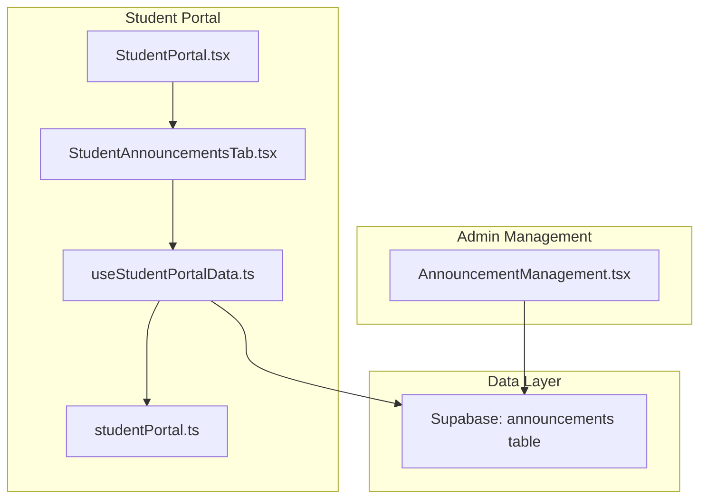
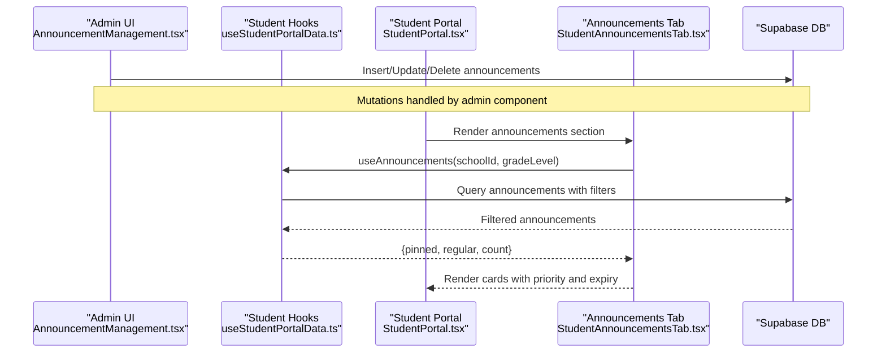
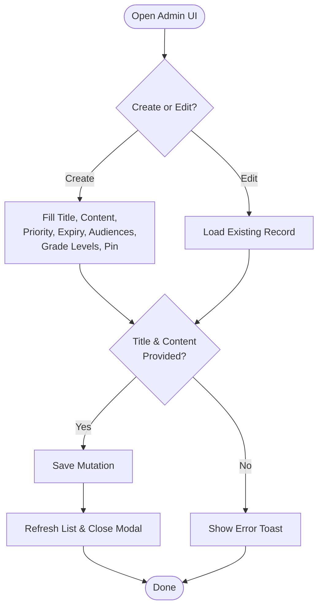
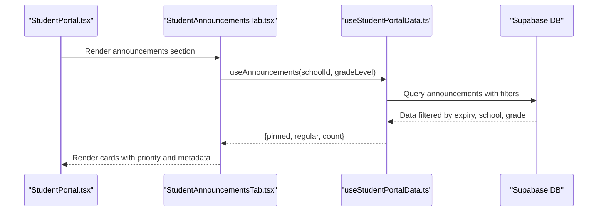
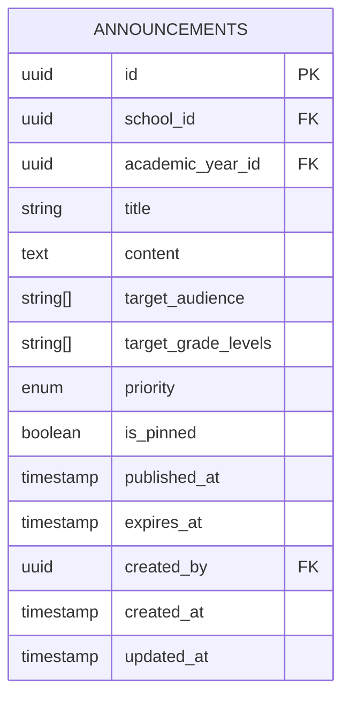
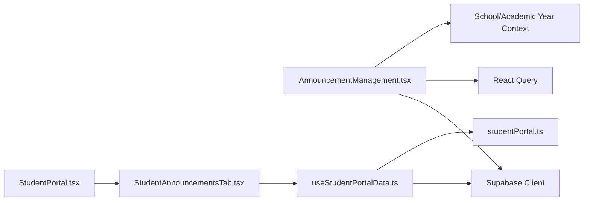

# Announcement Management

<cite>
**Referenced Files in This Document**
- [AnnouncementManagement.tsx](file://src/components/management/AnnouncementManagement.tsx)
- [StudentAnnouncementsTab.tsx](file://src/components/portals/student/StudentAnnouncementsTab.tsx)
- [StudentPortal.tsx](file://src/components/portal/StudentPortal.tsx)
- [useStudentPortalData.ts](file://src/hooks/useStudentPortalData.ts)
- [studentPortal.ts](file://src/types/studentPortal.ts)
- [20260206051934_ad262152-1ba2-4505-89d4-c36a4c06b657.sql](file://supabase/migrations/20260206051934_ad262152-1ba2-4505-89d4-c36a4c06b657.sql)
</cite>

## Table of Contents
1. [Introduction](#introduction)
2. [Project Structure](#project-structure)
3. [Core Components](#core-components)
4. [Architecture Overview](#architecture-overview)
5. [Detailed Component Analysis](#detailed-component-analysis)
6. [Dependency Analysis](#dependency-analysis)
7. [Performance Considerations](#performance-considerations)
8. [Troubleshooting Guide](#troubleshooting-guide)
9. [Conclusion](#conclusion)

## Introduction
This document describes the announcement management system within the portal. It covers how administrators create and edit announcements, how they are filtered and distributed to users, and how they appear in student-facing interfaces. It also documents categorization, targeting, scheduling, and integration with the student portal and widgets.

## Project Structure
The announcement system spans three primary areas:
- Management UI for administrators
- Data fetching and filtering hooks for the student portal
- Student portal integration and display components

**Diagram sources**
- [AnnouncementManagement.tsx](file://src/components/management/AnnouncementManagement.tsx#L46-L569)
- [StudentPortal.tsx](file://src/components/portal/StudentPortal.tsx#L523-L537)
- [StudentAnnouncementsTab.tsx](file://src/components/portals/student/StudentAnnouncementsTab.tsx#L72-L142)
- [useStudentPortalData.ts](file://src/hooks/useStudentPortalData.ts#L268-L321)
- [studentPortal.ts](file://src/types/studentPortal.ts#L116-L143)
- [20260206051934_ad262152-1ba2-4505-89d4-c36a4c06b657.sql](file://supabase/migrations/20260206051934_ad262152-1ba2-4505-89d4-c36a4c06b657.sql#L188-L229)

**Section sources**
- [AnnouncementManagement.tsx](file://src/components/management/AnnouncementManagement.tsx#L46-L569)
- [StudentPortal.tsx](file://src/components/portal/StudentPortal.tsx#L523-L537)
- [StudentAnnouncementsTab.tsx](file://src/components/portals/student/StudentAnnouncementsTab.tsx#L72-L142)
- [useStudentPortalData.ts](file://src/hooks/useStudentPortalData.ts#L268-L321)
- [studentPortal.ts](file://src/types/studentPortal.ts#L116-L143)
- [20260206051934_ad262152-1ba2-4505-89d4-c36a4c06b657.sql](file://supabase/migrations/20260206051934_ad262152-1ba2-4505-89d4-c36a4c06b657.sql#L188-L229)

## Core Components
- AnnouncementManagement: Admin interface for creating, editing, pinning, and deleting announcements; filtering by priority; scheduling expiration; and targeting audiences and grade levels.
- useAnnouncements: Hook that fetches announcements, filters by expiration, school scoping, and grade-level targeting; separates pinned vs. regular.
- StudentAnnouncementsTab: Student-facing tab that displays announcements with priority badges, grade-level indicators, publish dates, and expiration notices.
- StudentPortal integration: Routes the announcements section to the student announcements tab.
- Types and styles: Announcement model and priority color mapping for consistent display.

**Section sources**
- [AnnouncementManagement.tsx](file://src/components/management/AnnouncementManagement.tsx#L23-L44)
- [useStudentPortalData.ts](file://src/hooks/useStudentPortalData.ts#L268-L321)
- [StudentAnnouncementsTab.tsx](file://src/components/portals/student/StudentAnnouncementsTab.tsx#L14-L70)
- [studentPortal.ts](file://src/types/studentPortal.ts#L116-L143)

## Architecture Overview
The system follows a clear separation of concerns:
- Admin actions mutate the announcements table via Supabase.
- Student portal queries announcements with built-in filters for visibility and relevance.
- Display components render announcements consistently across the student portal.

**Diagram sources**
- [AnnouncementManagement.tsx](file://src/components/management/AnnouncementManagement.tsx#L94-L147)
- [useStudentPortalData.ts](file://src/hooks/useStudentPortalData.ts#L268-L321)
- [StudentPortal.tsx](file://src/components/portal/StudentPortal.tsx#L523-L537)
- [StudentAnnouncementsTab.tsx](file://src/components/portals/student/StudentAnnouncementsTab.tsx#L72-L142)

## Detailed Component Analysis

### Admin Announcement Management
- Purpose: Provide a centralized place for staff to create, edit, pin, and delete announcements; set priorities; schedule expiration; and target audiences and grade levels.
- Key features:
  - Priority selection (low, normal, high, urgent) with color-coded badges.
  - Expiration scheduling via datetime-local input.
  - Target audience checkboxes (all, students, teachers, parents, admin, registrar).
  - Optional grade-level targeting from a predefined list.
  - Pin/unpin toggling to elevate visibility.
  - Filtering by priority in the listing.
  - Validation to prevent publishing empty content.
- Data mutations:
  - Create/update: inserts or updates an announcement with school and academic year context.
  - Delete: removes an announcement by ID.
  - Toggle pin: flips the pinned flag.
- Data retrieval:
  - Fetches announcements scoped to the current school and academic year, ordered by pinned and publish date.
  - Optionally filters by priority.

**Diagram sources**
- [AnnouncementManagement.tsx](file://src/components/management/AnnouncementManagement.tsx#L201-L208)
- [AnnouncementManagement.tsx](file://src/components/management/AnnouncementManagement.tsx#L94-L127)

**Section sources**
- [AnnouncementManagement.tsx](file://src/components/management/AnnouncementManagement.tsx#L46-L569)

### Student Portal Announcement Display
- Purpose: Present announcements to students in a digestible format with emphasis on pinned items and priority.
- Key features:
  - Two-column layout: pinned announcements highlighted with a border and pin icon; recent announcements below.
  - Priority badges with color mapping.
  - Grade-level badges when applicable.
  - Publish date and relative time display.
  - Expiration notices when applicable.
  - Skeleton loaders during initial load.
  - Empty state with icon and message.
- Data filtering:
  - Uses the shared hook to fetch announcements filtered by expiration, optional school scoping, and grade-level targeting.

**Diagram sources**
- [StudentPortal.tsx](file://src/components/portal/StudentPortal.tsx#L523-L537)
- [StudentAnnouncementsTab.tsx](file://src/components/portals/student/StudentAnnouncementsTab.tsx#L72-L142)
- [useStudentPortalData.ts](file://src/hooks/useStudentPortalData.ts#L268-L321)

**Section sources**
- [StudentAnnouncementsTab.tsx](file://src/components/portals/student/StudentAnnouncementsTab.tsx#L72-L142)
- [useStudentPortalData.ts](file://src/hooks/useStudentPortalData.ts#L268-L321)

### Data Model and Policies
- Announcement model includes fields for title, content, target audiences, optional grade-level targeting, priority, pinned flag, timestamps, and optional expiration.
- Row-level security allows anyone to view announcements but restricts management to authorized staff.
- Indexes exist on school and publish date for efficient queries.

**Diagram sources**
- [20260206051934_ad262152-1ba2-4505-89d4-c36a4c06b657.sql](file://supabase/migrations/20260206051934_ad262152-1ba2-4505-89d4-c36a4c06b657.sql#L188-L229)
- [studentPortal.ts](file://src/types/studentPortal.ts#L116-L131)

**Section sources**
- [studentPortal.ts](file://src/types/studentPortal.ts#L116-L131)
- [20260206051934_ad262152-1ba2-4505-89d4-c36a4c06b657.sql](file://supabase/migrations/20260206051934_ad262152-1ba2-4505-89d4-c36a4c06b657.sql#L188-L229)

## Dependency Analysis
- Admin component depends on:
  - Supabase client for CRUD operations.
  - React Query for caching and refetching.
  - UI primitives for forms and dialogs.
  - School and academic year context for scoping.
- Student components depend on:
  - Shared hook for data fetching and filtering.
  - Types for consistent typing.
  - Priority color mapping for visual cues.
- Database:
  - Dedicated announcements table with RLS policies and indexes.

**Diagram sources**
- [AnnouncementManagement.tsx](file://src/components/management/AnnouncementManagement.tsx#L1-L22)
- [useStudentPortalData.ts](file://src/hooks/useStudentPortalData.ts#L1-L16)
- [studentPortal.ts](file://src/types/studentPortal.ts#L116-L143)
- [StudentPortal.tsx](file://src/components/portal/StudentPortal.tsx#L24-L29)

**Section sources**
- [AnnouncementManagement.tsx](file://src/components/management/AnnouncementManagement.tsx#L1-L22)
- [useStudentPortalData.ts](file://src/hooks/useStudentPortalData.ts#L1-L16)
- [studentPortal.ts](file://src/types/studentPortal.ts#L116-L143)
- [StudentPortal.tsx](file://src/components/portal/StudentPortal.tsx#L24-L29)

## Performance Considerations
- Client-side filtering: The student hook filters announcements by grade-level and expiration; keep lists reasonably sized to avoid heavy client computations.
- Pagination: If the number of announcements grows significantly, consider server-side pagination or limit the number of returned records.
- Caching: React Query caches queries keyed by school, grade, and academic year; ensure cache invalidation occurs after admin mutations.
- Rendering: The student tab renders cards conditionally; avoid unnecessary re-renders by memoizing computed values.

## Troubleshooting Guide
- Announcements not visible to students:
  - Verify the announcement’s expiration date is in the future.
  - Confirm the student’s grade level matches the announcement’s target grade levels.
  - Ensure the school scoping aligns with the student’s school.
- Admin cannot publish/edit:
  - Check RLS policies for the announcements table; only authorized staff can manage.
- Duplicate or missing announcements:
  - Confirm the school and academic year filters are correct in both admin and student queries.
- UI not updating after changes:
  - Ensure cache invalidation occurs after save/delete/toggle pin mutations.

**Section sources**
- [useStudentPortalData.ts](file://src/hooks/useStudentPortalData.ts#L272-L305)
- [20260206051934_ad262152-1ba2-4505-89d4-c36a4c06b657.sql](file://supabase/migrations/20260206051934_ad262152-1ba2-4505-89d4-c36a4c06b657.sql#L209-L213)

## Conclusion
The announcement management system provides a robust foundation for creating, targeting, scheduling, and displaying announcements across the portal. Administrators can efficiently manage content with granular targeting and scheduling, while students receive a clear, prioritized view tailored to their grade and school context. The shared hook ensures consistent filtering and performance across the student portal.