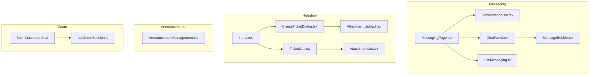
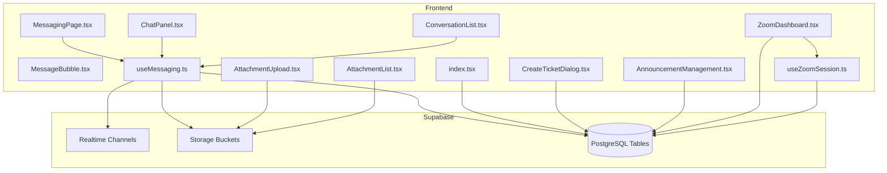
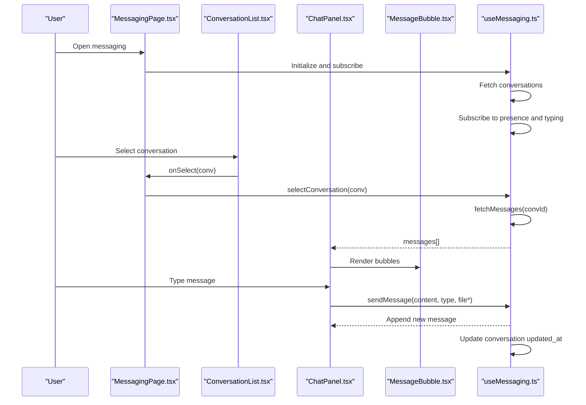
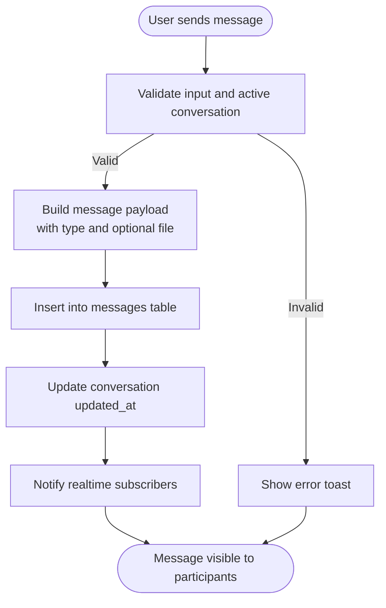
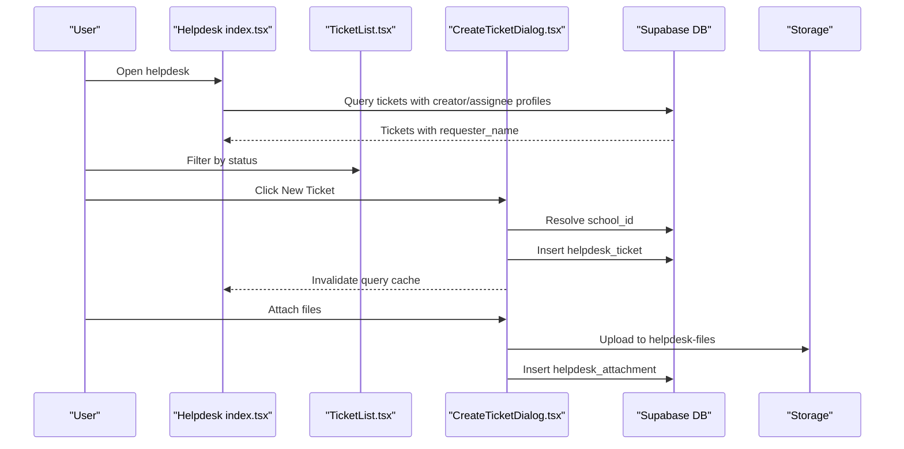
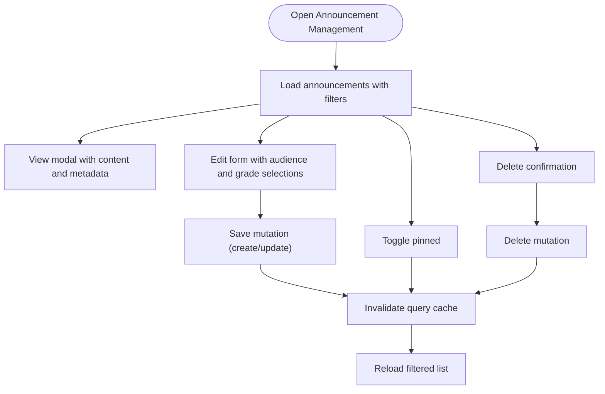
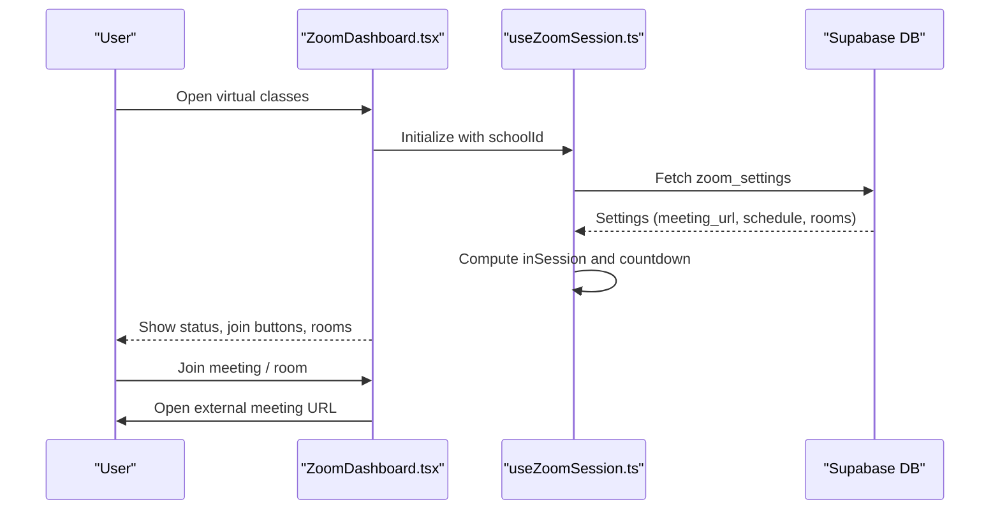
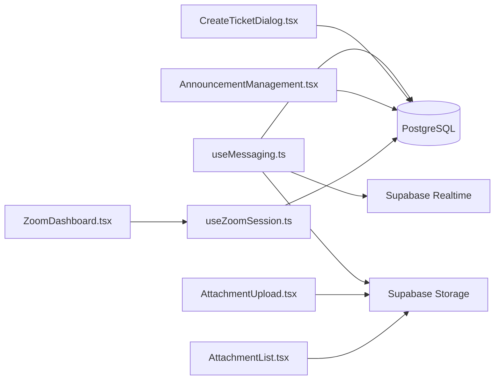

# Communication & Collaboration

<cite>
**Referenced Files in This Document**
- [MessagingPage.tsx](file://src/components/messaging/MessagingPage.tsx)
- [ChatPanel.tsx](file://src/components/messaging/ChatPanel.tsx)
- [ConversationList.tsx](file://src/components/messaging/ConversationList.tsx)
- [MessageBubble.tsx](file://src/components/messaging/MessageBubble.tsx)
- [useMessaging.ts](file://src/hooks/useMessaging.ts)
- [useChatSessions.ts](file://src/hooks/useChatSessions.ts)
- [TicketList.tsx](file://src/components/helpdesk/TicketList.tsx)
- [CreateTicketDialog.tsx](file://src/components/helpdesk/CreateTicketDialog.tsx)
- [AttachmentUpload.tsx](file://src/components/helpdesk/AttachmentUpload.tsx)
- [AttachmentList.tsx](file://src/components/helpdesk/AttachmentList.tsx)
- [index.tsx](file://src/pages/Helpdesk/index.tsx)
- [AnnouncementManagement.tsx](file://src/components/management/AnnouncementManagement.tsx)
- [ZoomDashboard.tsx](file://src/components/zoom/ZoomDashboard.tsx)
- [useZoomSession.ts](file://src/hooks/useZoomSession.ts)
- [20260210130000_create_helpdesk_tables.sql](file://supabase/migrations/20260210130000_create_helpdesk_tables.sql)
- [20260210140000_create_helpdesk_attachments.sql](file://supabase/migrations/20260210140000_create_helpdesk_attachments.sql)
</cite>

## Table of Contents
1. [Introduction](#introduction)
2. [Project Structure](#project-structure)
3. [Core Components](#core-components)
4. [Architecture Overview](#architecture-overview)
5. [Detailed Component Analysis](#detailed-component-analysis)
6. [Dependency Analysis](#dependency-analysis)
7. [Performance Considerations](#performance-considerations)
8. [Troubleshooting Guide](#troubleshooting-guide)
9. [Conclusion](#conclusion)

## Introduction
This document explains the communication and collaboration features of the portal, focusing on:
- Internal messaging with real-time chat, typing indicators, and file/image attachments
- Helpdesk ticketing with creation, listing, comments, and file attachments
- Announcement management with targeting, priorities, expiration, and pinning
- Virtual classroom integration via Zoom dashboard and session scheduling

It covers UI components, hooks, database schema, and workflows to help both developers and operators understand how these systems work together.

## Project Structure
The communication and collaboration features span frontend components, hooks, pages, and backend Supabase resources:
- Messaging: UI pages, panels, lists, and a central hook for real-time chat
- Helpdesk: Pages, dialogs, lists, and attachment handling
- Announcements: Management UI with filtering and CRUD operations
- Zoom: Dashboard and session hook for virtual classroom scheduling and controls

**Diagram sources**
- [MessagingPage.tsx](file://src/components/messaging/MessagingPage.tsx#L9-L91)
- [ConversationList.tsx](file://src/components/messaging/ConversationList.tsx#L22-L146)
- [ChatPanel.tsx](file://src/components/messaging/ChatPanel.tsx#L23-L141)
- [MessageBubble.tsx](file://src/components/messaging/MessageBubble.tsx#L12-L70)
- [useMessaging.ts](file://src/hooks/useMessaging.ts#L44-L434)
- [index.tsx](file://src/pages/Helpdesk/index.tsx#L20-L161)
- [TicketList.tsx](file://src/components/helpdesk/TicketList.tsx#L48-L121)
- [CreateTicketDialog.tsx](file://src/components/helpdesk/CreateTicketDialog.tsx#L49-L256)
- [AttachmentUpload.tsx](file://src/components/helpdesk/AttachmentUpload.tsx#L15-L105)
- [AttachmentList.tsx](file://src/components/helpdesk/AttachmentList.tsx#L15-L64)
- [AnnouncementManagement.tsx](file://src/components/management/AnnouncementManagement.tsx#L46-L568)
- [ZoomDashboard.tsx](file://src/components/zoom/ZoomDashboard.tsx#L14-L307)
- [useZoomSession.ts](file://src/hooks/useZoomSession.ts#L22-L112)

**Section sources**
- [MessagingPage.tsx](file://src/components/messaging/MessagingPage.tsx#L9-L91)
- [index.tsx](file://src/pages/Helpdesk/index.tsx#L20-L161)
- [AnnouncementManagement.tsx](file://src/components/management/AnnouncementManagement.tsx#L46-L568)
- [ZoomDashboard.tsx](file://src/components/zoom/ZoomDashboard.tsx#L14-L307)

## Core Components
- MessagingPage orchestrates the messaging UI, conversation selection, and chat panel rendering.
- useMessaging manages real-time channels, presence, typing indicators, uploads, and conversation/message queries.
- ChatPanel renders messages, handles input, file uploads, and typing indicators.
- ConversationList displays conversations with online indicators, unread badges, and previews.
- MessageBubble renders text, images, and files with metadata and timestamps.
- Helpdesk index page aggregates tickets, merges requester names, and exposes stats.
- CreateTicketDialog validates and submits tickets to Supabase.
- AttachmentUpload and AttachmentList handle file uploads and downloads for tickets/comments.
- AnnouncementManagement provides CRUD, filtering, pinning, and expiration handling.
- ZoomDashboard shows meeting status, join actions, breakout rooms, and settings.
- useZoomSession computes session state and countdown based on school settings.

**Section sources**
- [useMessaging.ts](file://src/hooks/useMessaging.ts#L44-L434)
- [ChatPanel.tsx](file://src/components/messaging/ChatPanel.tsx#L23-L141)
- [ConversationList.tsx](file://src/components/messaging/ConversationList.tsx#L22-L146)
- [MessageBubble.tsx](file://src/components/messaging/MessageBubble.tsx#L12-L70)
- [index.tsx](file://src/pages/Helpdesk/index.tsx#L20-L161)
- [CreateTicketDialog.tsx](file://src/components/helpdesk/CreateTicketDialog.tsx#L49-L256)
- [AttachmentUpload.tsx](file://src/components/helpdesk/AttachmentUpload.tsx#L15-L105)
- [AttachmentList.tsx](file://src/components/helpdesk/AttachmentList.tsx#L15-L64)
- [AnnouncementManagement.tsx](file://src/components/management/AnnouncementManagement.tsx#L46-L568)
- [ZoomDashboard.tsx](file://src/components/zoom/ZoomDashboard.tsx#L14-L307)
- [useZoomSession.ts](file://src/hooks/useZoomSession.ts#L22-L112)

## Architecture Overview
The system integrates Supabase for real-time messaging, presence, and storage, and uses React Query for caching and optimistic updates. The helpdesk leverages row-level security (RLS) policies to enforce access control. Announcements are stored in a dedicated table with targeting and expiration. Zoom integration reads school-specific settings and computes session availability.

**Diagram sources**
- [useMessaging.ts](file://src/hooks/useMessaging.ts#L296-L385)
- [ChatPanel.tsx](file://src/components/messaging/ChatPanel.tsx#L23-L141)
- [ConversationList.tsx](file://src/components/messaging/ConversationList.tsx#L22-L146)
- [MessageBubble.tsx](file://src/components/messaging/MessageBubble.tsx#L12-L70)
- [index.tsx](file://src/pages/Helpdesk/index.tsx#L24-L80)
- [CreateTicketDialog.tsx](file://src/components/helpdesk/CreateTicketDialog.tsx#L67-L126)
- [AttachmentUpload.tsx](file://src/components/helpdesk/AttachmentUpload.tsx#L19-L72)
- [AttachmentList.tsx](file://src/components/helpdesk/AttachmentList.tsx#L18-L37)
- [AnnouncementManagement.tsx](file://src/components/management/AnnouncementManagement.tsx#L69-L91)
- [ZoomDashboard.tsx](file://src/components/zoom/ZoomDashboard.tsx#L14-L307)
- [useZoomSession.ts](file://src/hooks/useZoomSession.ts#L34-L57)

## Detailed Component Analysis

### Messaging System
The messaging system centers around a real-time chat with presence and typing indicators, file/image attachments, and conversation threading.

**Diagram sources**
- [MessagingPage.tsx](file://src/components/messaging/MessagingPage.tsx#L14-L45)
- [ConversationList.tsx](file://src/components/messaging/ConversationList.tsx#L89-L139)
- [ChatPanel.tsx](file://src/components/messaging/ChatPanel.tsx#L39-L71)
- [MessageBubble.tsx](file://src/components/messaging/MessageBubble.tsx#L12-L70)
- [useMessaging.ts](file://src/hooks/useMessaging.ts#L147-L219)

Key capabilities:
- Real-time presence and typing indicators via Supabase presence channels
- Message enrichment with sender profiles
- Unread counters per conversation
- File/image upload to storage with public URL generation
- Private and group conversations with participant management

**Diagram sources**
- [useMessaging.ts](file://src/hooks/useMessaging.ts#L187-L219)

**Section sources**
- [useMessaging.ts](file://src/hooks/useMessaging.ts#L44-L434)
- [ChatPanel.tsx](file://src/components/messaging/ChatPanel.tsx#L23-L141)
- [ConversationList.tsx](file://src/components/messaging/ConversationList.tsx#L22-L146)
- [MessageBubble.tsx](file://src/components/messaging/MessageBubble.tsx#L12-L70)

### Helpdesk Ticketing
The helpdesk supports ticket creation, listing, filtering, and file attachments. It enforces access control via RLS policies.

**Diagram sources**
- [index.tsx](file://src/pages/Helpdesk/index.tsx#L24-L80)
- [TicketList.tsx](file://src/components/helpdesk/TicketList.tsx#L48-L121)
- [CreateTicketDialog.tsx](file://src/components/helpdesk/CreateTicketDialog.tsx#L67-L126)
- [AttachmentUpload.tsx](file://src/components/helpdesk/AttachmentUpload.tsx#L19-L72)

Helpdesk schema highlights:
- Tickets table with status, priority, category, and ownership
- Comments table for internal/external discussions
- Attachments table linking to either tickets or comments
- RLS policies ensuring users see only permitted records

**Section sources**
- [index.tsx](file://src/pages/Helpdesk/index.tsx#L20-L161)
- [TicketList.tsx](file://src/components/helpdesk/TicketList.tsx#L48-L121)
- [CreateTicketDialog.tsx](file://src/components/helpdesk/CreateTicketDialog.tsx#L49-L256)
- [AttachmentUpload.tsx](file://src/components/helpdesk/AttachmentUpload.tsx#L15-L105)
- [AttachmentList.tsx](file://src/components/helpdesk/AttachmentList.tsx#L15-L64)
- [20260210130000_create_helpdesk_tables.sql](file://supabase/migrations/20260210130000_create_helpdesk_tables.sql#L1-L132)
- [20260210140000_create_helpdesk_attachments.sql](file://supabase/migrations/20260210140000_create_helpdesk_attachments.sql#L1-L80)

### Announcement Management
Announcements support targeting by audience and grade levels, priority, expiration, and pinning. They are fetched with filters and persisted via mutations.

**Diagram sources**
- [AnnouncementManagement.tsx](file://src/components/management/AnnouncementManagement.tsx#L69-L161)

**Section sources**
- [AnnouncementManagement.tsx](file://src/components/management/AnnouncementManagement.tsx#L46-L568)

### Virtual Classroom Integration (Zoom)
The Zoom dashboard displays meeting status, join links, breakout rooms, and settings. It computes session state based on school settings and time zone.

**Diagram sources**
- [ZoomDashboard.tsx](file://src/components/zoom/ZoomDashboard.tsx#L14-L307)
- [useZoomSession.ts](file://src/hooks/useZoomSession.ts#L34-L111)

**Section sources**
- [ZoomDashboard.tsx](file://src/components/zoom/ZoomDashboard.tsx#L14-L307)
- [useZoomSession.ts](file://src/hooks/useZoomSession.ts#L22-L112)

## Dependency Analysis
- Messaging depends on Supabase Realtime for presence and message inserts, and on Supabase Storage for attachments.
- Helpdesk relies on RLS policies to restrict visibility and uploads to authorized users.
- Announcements use React Query for caching and optimistic updates.
- Zoom dashboard depends on school-specific settings and time zone calculations.

**Diagram sources**
- [useMessaging.ts](file://src/hooks/useMessaging.ts#L296-L385)
- [CreateTicketDialog.tsx](file://src/components/helpdesk/CreateTicketDialog.tsx#L67-L126)
- [AttachmentUpload.tsx](file://src/components/helpdesk/AttachmentUpload.tsx#L19-L72)
- [AttachmentList.tsx](file://src/components/helpdesk/AttachmentList.tsx#L18-L37)
- [AnnouncementManagement.tsx](file://src/components/management/AnnouncementManagement.tsx#L69-L91)
- [ZoomDashboard.tsx](file://src/components/zoom/ZoomDashboard.tsx#L14-L307)
- [useZoomSession.ts](file://src/hooks/useZoomSession.ts#L34-L57)

**Section sources**
- [useMessaging.ts](file://src/hooks/useMessaging.ts#L296-L385)
- [CreateTicketDialog.tsx](file://src/components/helpdesk/CreateTicketDialog.tsx#L67-L126)
- [AttachmentUpload.tsx](file://src/components/helpdesk/AttachmentUpload.tsx#L19-L72)
- [AttachmentList.tsx](file://src/components/helpdesk/AttachmentList.tsx#L18-L37)
- [AnnouncementManagement.tsx](file://src/components/management/AnnouncementManagement.tsx#L69-L91)
- [ZoomDashboard.tsx](file://src/components/zoom/ZoomDashboard.tsx#L14-L307)
- [useZoomSession.ts](file://src/hooks/useZoomSession.ts#L34-L57)

## Performance Considerations
- Realtime subscriptions: Presence and message channels are scoped to active conversation and typing presence to minimize bandwidth.
- Pagination and filtering: Helpdesk and announcements use server-side filters and efficient queries to reduce payload sizes.
- Caching: React Query caches tickets and announcements to avoid redundant network calls.
- Lazy loading: Chat scrolls to bottom on new messages; consider virtualization for very long threads.
- Storage uploads: Progress feedback is shown during multi-file uploads; consider chunked uploads for large files.

## Troubleshooting Guide
Common issues and resolutions:
- Cannot upload helpdesk attachments: Ensure the storage bucket exists and the user has permission; verify the ticket/comment ID is present before upload.
- Messages not appearing: Confirm the user is subscribed to the correct conversation channel and that the message insert succeeded.
- Helpdesk access denied: Verify RLS policies allow the user to view the ticket or comment; check created_by/assigned_to roles.
- Zoom meeting offline: Confirm school settings are configured, the current time falls within active days and schedule, and the meeting URL is valid.

**Section sources**
- [AttachmentUpload.tsx](file://src/components/helpdesk/AttachmentUpload.tsx#L19-L72)
- [useMessaging.ts](file://src/hooks/useMessaging.ts#L334-L362)
- [20260210130000_create_helpdesk_tables.sql](file://supabase/migrations/20260210130000_create_helpdesk_tables.sql#L30-L117)
- [ZoomDashboard.tsx](file://src/components/zoom/ZoomDashboard.tsx#L132-L143)

## Conclusion
The portal’s communication and collaboration features combine real-time messaging, secure helpdesk workflows, flexible announcement management, and integrated virtual classroom controls. The architecture leverages Supabase for data, storage, and real-time capabilities, while frontend hooks and components provide a responsive, accessible user experience. Proper configuration of RLS policies and Zoom settings ensures secure and reliable operation across environments.