# Helpdesk Ticketing System

<cite>
**Referenced Files in This Document**
- [index.tsx](file://src/pages/Helpdesk/index.tsx)
- [TicketDetail.tsx](file://src/pages/Helpdesk/TicketDetail.tsx)
- [CreateTicketDialog.tsx](file://src/components/helpdesk/CreateTicketDialog.tsx)
- [EditTicketDialog.tsx](file://src/components/helpdesk/EditTicketDialog.tsx)
- [TicketList.tsx](file://src/components/helpdesk/TicketList.tsx)
- [AttachmentUpload.tsx](file://src/components/helpdesk/AttachmentUpload.tsx)
- [AttachmentList.tsx](file://src/components/helpdesk/AttachmentList.tsx)
- [DeleteTicketDialog.tsx](file://src/components/helpdesk/DeleteTicketDialog.tsx)
- [20260210130000_create_helpdesk_tables.sql](file://supabase/migrations/20260210130000_create_helpdesk_tables.sql)
- [20260210140000_create_helpdesk_attachments.sql](file://supabase/migrations/20260210140000_create_helpdesk_attachments.sql)
- [20260210123441_121e8c0d-adba-494f-8b0d-f1ee080bc335.sql](file://supabase/migrations/20260210123441_121e8c0d-adba-494f-8b0d-f1ee080bc335.sql)
- [UserManagement.tsx](file://src/components/admin/UserManagement.tsx)
- [RoleAssignmentDialog.tsx](file://src/components/admin/RoleAssignmentDialog.tsx)
</cite>

## Table of Contents
1. [Introduction](#introduction)
2. [Project Structure](#project-structure)
3. [Core Components](#core-components)
4. [Architecture Overview](#architecture-overview)
5. [Detailed Component Analysis](#detailed-component-analysis)
6. [Dependency Analysis](#dependency-analysis)
7. [Performance Considerations](#performance-considerations)
8. [Troubleshooting Guide](#troubleshooting-guide)
9. [Conclusion](#conclusion)

## Introduction
This document describes the Helpdesk Ticketing System, covering the end-to-end workflow from ticket creation to resolution, including management interfaces, filtering and sorting, status tracking, attachments, and integration with user management for staff assignments. It targets both technical and non-technical readers, providing clear explanations and diagrams to illustrate how the system works.

## Project Structure
The Helpdesk module consists of:
- Pages: Helpdesk landing and ticket detail views
- Components: Dialogs for creating/editing/deleting tickets, list rendering, and attachment handling
- Database: Supabase tables for tickets, comments, and attachments with Row Level Security (RLS)
- Admin integration: User management and role assignment dialogs

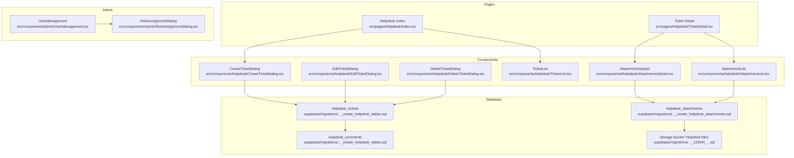

**Diagram sources**
- [index.tsx](file://src/pages/Helpdesk/index.tsx#L20-L161)
- [TicketDetail.tsx](file://src/pages/Helpdesk/TicketDetail.tsx#L30-L309)
- [CreateTicketDialog.tsx](file://src/components/helpdesk/CreateTicketDialog.tsx#L49-L256)
- [EditTicketDialog.tsx](file://src/components/helpdesk/EditTicketDialog.tsx#L52-L205)
- [DeleteTicketDialog.tsx](file://src/components/helpdesk/DeleteTicketDialog.tsx#L25-L77)
- [TicketList.tsx](file://src/components/helpdesk/TicketList.tsx#L48-L121)
- [AttachmentUpload.tsx](file://src/components/helpdesk/AttachmentUpload.tsx#L15-L105)
- [AttachmentList.tsx](file://src/components/helpdesk/AttachmentList.tsx#L15-L64)
- [20260210130000_create_helpdesk_tables.sql](file://supabase/migrations/20260210130000_create_helpdesk_tables.sql#L1-L132)
- [20260210140000_create_helpdesk_attachments.sql](file://supabase/migrations/20260210140000_create_helpdesk_attachments.sql#L1-L80)
- [20260210123441_121e8c0d-adba-494f-8b0d-f1ee080bc335.sql](file://supabase/migrations/20260210123441_121e8c0d-adba-494f-8b0d-f1ee080bc335.sql#L1-L14)
- [UserManagement.tsx](file://src/components/admin/UserManagement.tsx#L33-L200)
- [RoleAssignmentDialog.tsx](file://src/components/admin/RoleAssignmentDialog.tsx#L51-L209)

**Section sources**
- [index.tsx](file://src/pages/Helpdesk/index.tsx#L1-L162)
- [TicketDetail.tsx](file://src/pages/Helpdesk/TicketDetail.tsx#L1-L310)
- [CreateTicketDialog.tsx](file://src/components/helpdesk/CreateTicketDialog.tsx#L1-L257)
- [EditTicketDialog.tsx](file://src/components/helpdesk/EditTicketDialog.tsx#L1-L206)
- [TicketList.tsx](file://src/components/helpdesk/TicketList.tsx#L1-L122)
- [AttachmentUpload.tsx](file://src/components/helpdesk/AttachmentUpload.tsx#L1-L106)
- [AttachmentList.tsx](file://src/components/helpdesk/AttachmentList.tsx#L1-L65)
- [DeleteTicketDialog.tsx](file://src/components/helpdesk/DeleteTicketDialog.tsx#L1-L78)
- [20260210130000_create_helpdesk_tables.sql](file://supabase/migrations/20260210130000_create_helpdesk_tables.sql#L1-L132)
- [20260210140000_create_helpdesk_attachments.sql](file://supabase/migrations/20260210140000_create_helpdesk_attachments.sql#L1-L80)
- [20260210123441_121e8c0d-adba-494f-8b0d-f1ee080bc335.sql](file://supabase/migrations/20260210123441_121e8c0d-adba-494f-8b0d-f1ee080bc335.sql#L1-L14)
- [UserManagement.tsx](file://src/components/admin/UserManagement.tsx#L1-L200)
- [RoleAssignmentDialog.tsx](file://src/components/admin/RoleAssignmentDialog.tsx#L1-L209)

## Core Components
- Helpdesk Index Page: Displays statistics, filtering tabs, and the ticket list. Loads tickets with creator/assignee joins and enriches requester names from profiles.
- Ticket Detail Page: Shows ticket content, activity timeline (comments), status/priority controls for admins, and attachment management.
- Create/Edit/Delete Dialogs: Provide forms to submit, update, and remove tickets with validation and server-side persistence.
- Ticket List: Renders a sortable table-like view of tickets with status and priority badges.
- Attachment Management: Supports drag-and-drop uploads to a dedicated storage bucket and lists downloadable attachments.

**Section sources**
- [index.tsx](file://src/pages/Helpdesk/index.tsx#L20-L161)
- [TicketDetail.tsx](file://src/pages/Helpdesk/TicketDetail.tsx#L30-L309)
- [CreateTicketDialog.tsx](file://src/components/helpdesk/CreateTicketDialog.tsx#L49-L256)
- [EditTicketDialog.tsx](file://src/components/helpdesk/EditTicketDialog.tsx#L52-L205)
- [TicketList.tsx](file://src/components/helpdesk/TicketList.tsx#L48-L121)
- [AttachmentUpload.tsx](file://src/components/helpdesk/AttachmentUpload.tsx#L15-L105)
- [AttachmentList.tsx](file://src/components/helpdesk/AttachmentList.tsx#L15-L64)
- [DeleteTicketDialog.tsx](file://src/components/helpdesk/DeleteTicketDialog.tsx#L25-L77)

## Architecture Overview
The system integrates React UI components with Supabase for data and storage, enforcing fine-grained access control through Row Level Security (RLS).

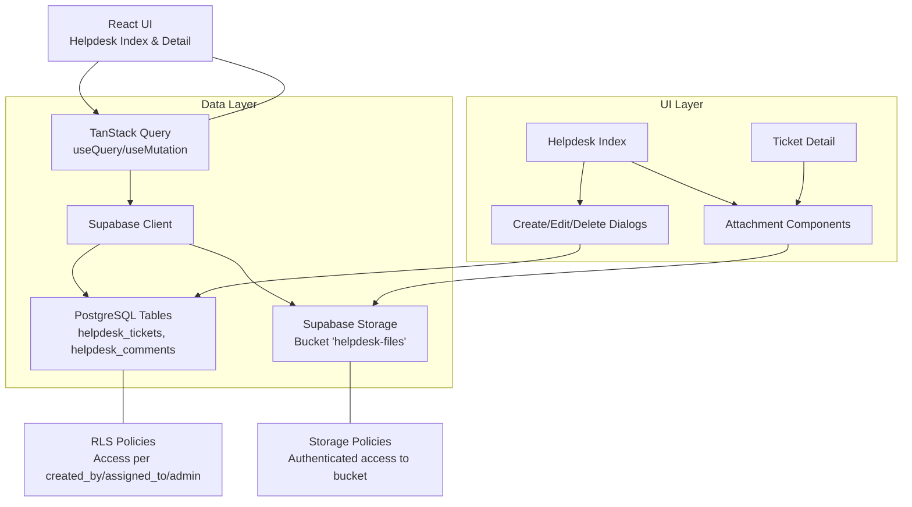

**Diagram sources**
- [index.tsx](file://src/pages/Helpdesk/index.tsx#L24-L47)
- [TicketDetail.tsx](file://src/pages/Helpdesk/TicketDetail.tsx#L37-L93)
- [CreateTicketDialog.tsx](file://src/components/helpdesk/CreateTicketDialog.tsx#L67-L126)
- [AttachmentUpload.tsx](file://src/components/helpdesk/AttachmentUpload.tsx#L19-L72)
- [20260210130000_create_helpdesk_tables.sql](file://supabase/migrations/20260210130000_create_helpdesk_tables.sql#L26-L132)
- [20260210140000_create_helpdesk_attachments.sql](file://supabase/migrations/20260210140000_create_helpdesk_attachments.sql#L18-L80)
- [20260210123441_121e8c0d-adba-494f-8b0d-f1ee080bc335.sql](file://supabase/migrations/20260210123441_121e8c0d-adba-494f-8b0d-f1ee080bc335.sql#L4-L14)

## Detailed Component Analysis

### Ticket Creation Workflow
- Trigger: New Ticket button opens the CreateTicketDialog.
- Validation: Zod schema enforces minimum lengths and enum constraints.
- Persistence: Inserts into helpdesk_tickets with created_by, school_id resolved from selected school context, and defaults for status/priority.
- Feedback: Success toast, form reset, and invalidation of ticket queries.

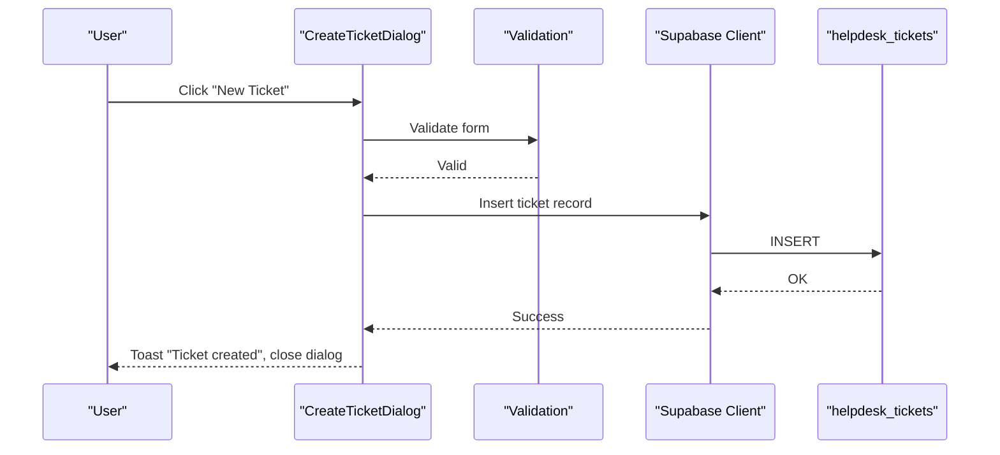

**Diagram sources**
- [CreateTicketDialog.tsx](file://src/components/helpdesk/CreateTicketDialog.tsx#L67-L126)
- [20260210130000_create_helpdesk_tables.sql](file://supabase/migrations/20260210130000_create_helpdesk_tables.sql#L2-L14)

**Section sources**
- [CreateTicketDialog.tsx](file://src/components/helpdesk/CreateTicketDialog.tsx#L49-L256)
- [index.tsx](file://src/pages/Helpdesk/index.tsx#L24-L47)

### Ticket Management Interfaces
- Helpdesk Index:
  - Tabs: All, Open/In Progress, Resolved/Closed.
  - Stats cards: Total, Open, In Progress, Resolved.
  - TicketList: Displays status, priority, subject, requester, device, category, created date.
- Ticket Detail:
  - Header: Title, requester, created time, status badge.
  - Description: Ticket body.
  - Activity: Comments list with timestamps and authors.
  - Controls: Status and priority selectors for admins; requester/assignee display.
  - Attachments: Upload area and list with download actions.

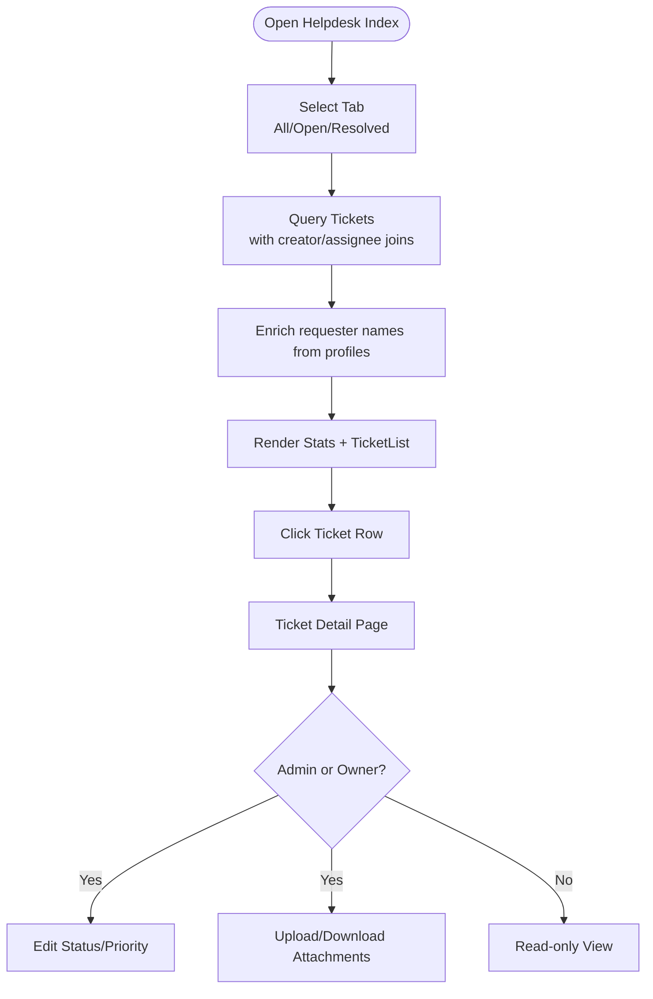

**Diagram sources**
- [index.tsx](file://src/pages/Helpdesk/index.tsx#L20-L161)
- [TicketList.tsx](file://src/components/helpdesk/TicketList.tsx#L48-L121)
- [TicketDetail.tsx](file://src/pages/Helpdesk/TicketDetail.tsx#L30-L309)

**Section sources**
- [index.tsx](file://src/pages/Helpdesk/index.tsx#L20-L161)
- [TicketList.tsx](file://src/components/helpdesk/TicketList.tsx#L48-L121)
- [TicketDetail.tsx](file://src/pages/Helpdesk/TicketDetail.tsx#L165-L309)

### Resolution Processes and Status Tracking
- Status updates: Admins can switch between open, in_progress, resolved, closed via a selector.
- Priority updates: Admins can adjust priority (low, medium, high, urgent).
- Timeline: Comments are ordered chronologically; each displays author and timestamp.
- Ownership checks: Only owners (created_by) or admins can edit tickets; assignees can view.

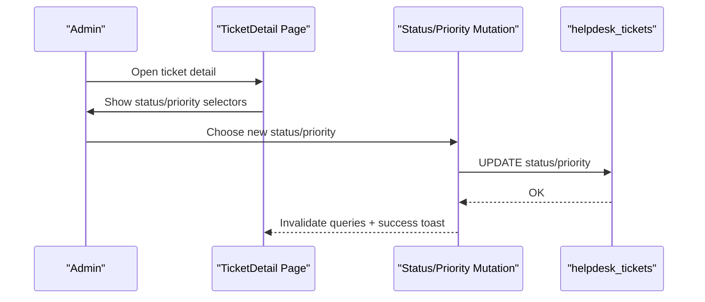

**Diagram sources**
- [TicketDetail.tsx](file://src/pages/Helpdesk/TicketDetail.tsx#L113-L135)
- [20260210130000_create_helpdesk_tables.sql](file://supabase/migrations/20260210130000_create_helpdesk_tables.sql#L30-L76)

**Section sources**
- [TicketDetail.tsx](file://src/pages/Helpdesk/TicketDetail.tsx#L236-L266)
- [TicketDetail.tsx](file://src/pages/Helpdesk/TicketDetail.tsx#L80-L93)

### Create and Edit Ticket Dialogs
- CreateTicketDialog:
  - Fields: title, category, priority, optional pc_name, description.
  - Submission: Validates, resolves school_id, inserts ticket, refreshes lists.
- EditTicketDialog:
  - Pre-populated form for existing ticket; mutation updates fields and refreshes caches.

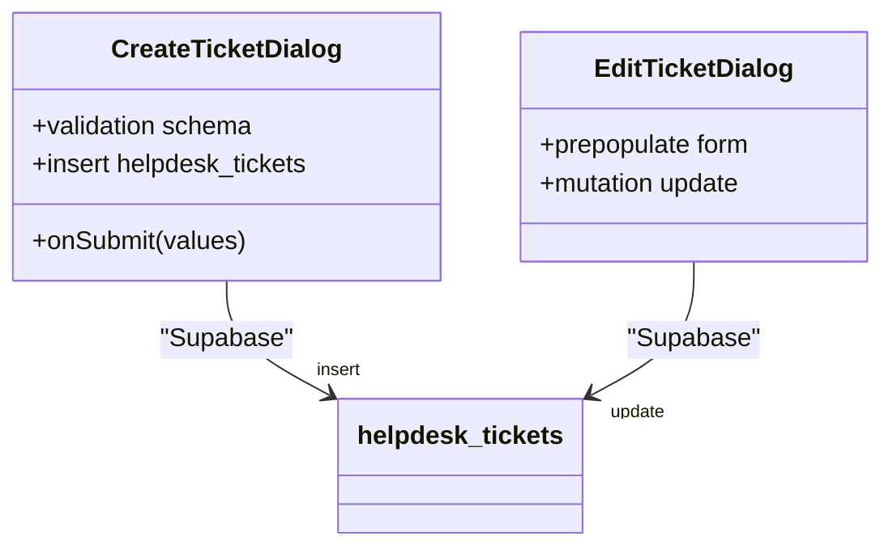

**Diagram sources**
- [CreateTicketDialog.tsx](file://src/components/helpdesk/CreateTicketDialog.tsx#L67-L126)
- [EditTicketDialog.tsx](file://src/components/helpdesk/EditTicketDialog.tsx#L67-L88)

**Section sources**
- [CreateTicketDialog.tsx](file://src/components/helpdesk/CreateTicketDialog.tsx#L49-L256)
- [EditTicketDialog.tsx](file://src/components/helpdesk/EditTicketDialog.tsx#L52-L205)

### Attachment Upload Functionality and File Management
- Upload:
  - Drag-and-drop zone; uploads to Supabase Storage under a ticket-specific path.
  - Creates a helpdesk_attachments record linking to ticket or comment.
- Download:
  - Lists attached files with names and sizes; downloads via client-side blob creation.
- Constraints:
  - Each attachment belongs to either a ticket or a comment (mutual exclusivity).
  - Storage bucket 'helpdesk-files' is configured with authenticated access policies.

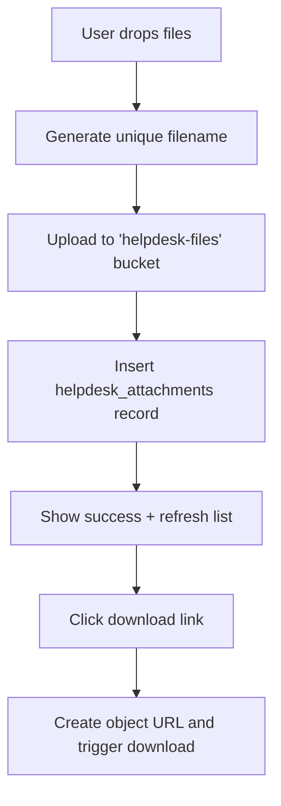

**Diagram sources**
- [AttachmentUpload.tsx](file://src/components/helpdesk/AttachmentUpload.tsx#L19-L72)
- [AttachmentList.tsx](file://src/components/helpdesk/AttachmentList.tsx#L18-L37)
- [20260210140000_create_helpdesk_attachments.sql](file://supabase/migrations/20260210140000_create_helpdesk_attachments.sql#L1-L16)
- [20260210123441_121e8c0d-adba-494f-8b0d-f1ee080bc335.sql](file://supabase/migrations/20260210123441_121e8c0d-adba-494f-8b0d-f1ee080bc335.sql#L4-L14)

**Section sources**
- [AttachmentUpload.tsx](file://src/components/helpdesk/AttachmentUpload.tsx#L15-L105)
- [AttachmentList.tsx](file://src/components/helpdesk/AttachmentList.tsx#L15-L64)
- [20260210140000_create_helpdesk_attachments.sql](file://supabase/migrations/20260210140000_create_helpdesk_attachments.sql#L1-L80)
- [20260210123441_121e8c0d-adba-494f-8b0d-f1ee080bc335.sql](file://supabase/migrations/20260210123441_121e8c0d-adba-494f-8b0d-f1ee080bc335.sql#L1-L14)

### Ticket Assignment, Priority Levels, and Communication Threads
- Assignment:
  - Tickets have assigned_to referencing auth.users; RLS allows access to assigned users.
- Priority:
  - Enum values: low, medium, high, urgent; displayed with contextual badges.
- Communication:
  - helpdesk_comments table stores threaded replies with user_id and timestamps.
  - RLS ensures only authorized users can view or add comments.

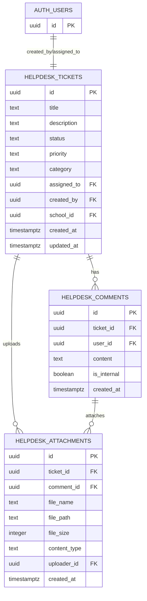

**Diagram sources**
- [20260210130000_create_helpdesk_tables.sql](file://supabase/migrations/20260210130000_create_helpdesk_tables.sql#L2-L24)
- [20260210140000_create_helpdesk_attachments.sql](file://supabase/migrations/20260210140000_create_helpdesk_attachments.sql#L2-L16)

**Section sources**
- [TicketDetail.tsx](file://src/pages/Helpdesk/TicketDetail.tsx#L290-L292)
- [TicketDetail.tsx](file://src/pages/Helpdesk/TicketDetail.tsx#L254-L266)
- [20260210130000_create_helpdesk_tables.sql](file://supabase/migrations/20260210130000_create_helpdesk_tables.sql#L30-L117)

### Ticket Detail View, Resolution Workflows, and Audit Trails
- Detail view:
  - Shows requester profile (from profiles), status/priority, category, PC/device, assignee.
  - Displays comments in chronological order; admins can update status/priority.
- Resolution workflow:
  - Admin sets status to resolved/closed after addressing the issue.
  - Optional internal notes via comments; attachments can be added during resolution.
- Audit trails:
  - RLS policies and triggers track access and modifications; logs can be extended via application events.

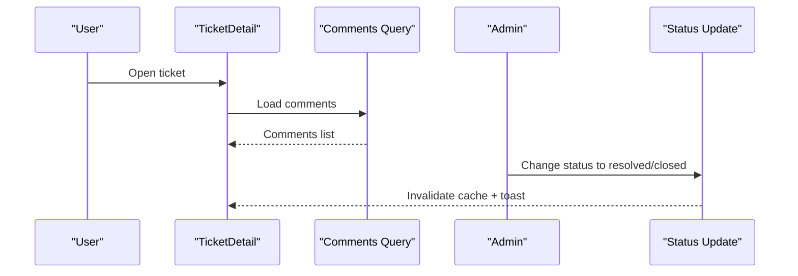

**Diagram sources**
- [TicketDetail.tsx](file://src/pages/Helpdesk/TicketDetail.tsx#L37-L93)
- [TicketDetail.tsx](file://src/pages/Helpdesk/TicketDetail.tsx#L113-L135)

**Section sources**
- [TicketDetail.tsx](file://src/pages/Helpdesk/TicketDetail.tsx#L165-L309)
- [20260210130000_create_helpdesk_tables.sql](file://supabase/migrations/20260210130000_create_helpdesk_tables.sql#L119-L132)

### Deletion and Escalation Procedures
- Deletion:
  - DeleteTicketDialog cascades deletes of comments and attachments before removing the ticket.
- Escalation:
  - Assign tickets to higher-priority users or categories; increase priority to urgent.
  - Use comments to communicate escalation reasons and stakeholders.

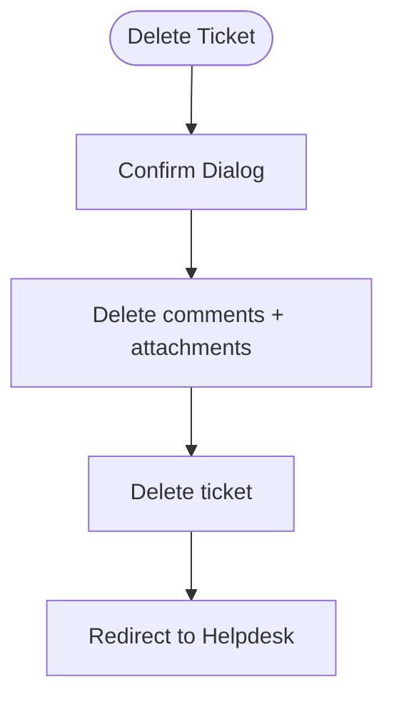

**Diagram sources**
- [DeleteTicketDialog.tsx](file://src/components/helpdesk/DeleteTicketDialog.tsx#L30-L46)

**Section sources**
- [DeleteTicketDialog.tsx](file://src/components/helpdesk/DeleteTicketDialog.tsx#L25-L77)

### Integration with User Management for Staff Assignments
- Role management:
  - Admins can assign roles via RoleAssignmentDialog; changes are logged.
- Staff visibility:
  - RLS allows admins and assigned users to view tickets; owners can update their own tickets.
- Practical assignment:
  - Assign tickets to staff by updating assigned_to; ensure the user has appropriate role.

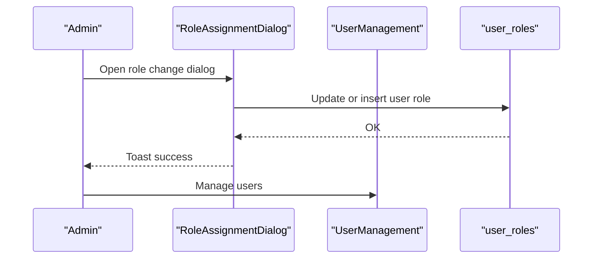

**Diagram sources**
- [RoleAssignmentDialog.tsx](file://src/components/admin/RoleAssignmentDialog.tsx#L58-L104)
- [UserManagement.tsx](file://src/components/admin/UserManagement.tsx#L33-L200)
- [20260210130000_create_helpdesk_tables.sql](file://supabase/migrations/20260210130000_create_helpdesk_tables.sql#L30-L76)

**Section sources**
- [RoleAssignmentDialog.tsx](file://src/components/admin/RoleAssignmentDialog.tsx#L51-L209)
- [UserManagement.tsx](file://src/components/admin/UserManagement.tsx#L33-L200)
- [20260210130000_create_helpdesk_tables.sql](file://supabase/migrations/20260210130000_create_helpdesk_tables.sql#L30-L76)

## Dependency Analysis
- UI depends on TanStack Query for data fetching and mutations.
- Supabase client handles database and storage operations.
- RLS policies enforce access control across tickets, comments, and attachments.
- Storage bucket 'helpdesk-files' requires authenticated users with proper policies.

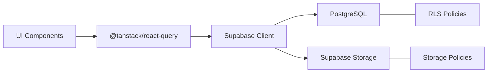

**Diagram sources**
- [index.tsx](file://src/pages/Helpdesk/index.tsx#L24-L47)
- [TicketDetail.tsx](file://src/pages/Helpdesk/TicketDetail.tsx#L37-L93)
- [20260210130000_create_helpdesk_tables.sql](file://supabase/migrations/20260210130000_create_helpdesk_tables.sql#L26-L132)
- [20260210140000_create_helpdesk_attachments.sql](file://supabase/migrations/20260210140000_create_helpdesk_attachments.sql#L18-L80)
- [20260210123441_121e8c0d-adba-494f-8b0d-f1ee080bc335.sql](file://supabase/migrations/20260210123441_121e8c0d-adba-494f-8b0d-f1ee080bc335.sql#L4-L14)

**Section sources**
- [index.tsx](file://src/pages/Helpdesk/index.tsx#L24-L47)
- [TicketDetail.tsx](file://src/pages/Helpdesk/TicketDetail.tsx#L37-L93)
- [20260210130000_create_helpdesk_tables.sql](file://supabase/migrations/20260210130000_create_helpdesk_tables.sql#L26-L132)
- [20260210140000_create_helpdesk_attachments.sql](file://supabase/migrations/20260210140000_create_helpdesk_attachments.sql#L18-L80)
- [20260210123441_121e8c0d-adba-494f-8b0d-f1ee080bc335.sql](file://supabase/migrations/20260210123441_121e8c0d-adba-494f-8b0d-f1ee080bc335.sql#L4-L14)

## Performance Considerations
- Queries:
  - Use targeted selects with joins and ordering to minimize payload.
  - Cache invalidation via queryClient.invalidateQueries after mutations.
- Attachments:
  - Batch uploads handled sequentially; consider parallelization with concurrency limits for large batches.
- Rendering:
  - Memoized computations for requester name enrichment reduce re-renders.
- Storage:
  - Unique filenames prevent collisions; ensure bucket policies restrict access appropriately.

## Troubleshooting Guide
- Authentication errors:
  - Ensure user is logged in and a school is selected before creating tickets.
- Upload failures:
  - Verify 'helpdesk-files' bucket exists and authenticated users have insert/select policies.
- Access denied:
  - Confirm RLS policies allow access based on created_by, assigned_to, or admin role.
- Deletion constraints:
  - Comments and attachments are deleted before the ticket; confirm cascade behavior.

**Section sources**
- [CreateTicketDialog.tsx](file://src/components/helpdesk/CreateTicketDialog.tsx#L67-L102)
- [20260210123441_121e8c0d-adba-494f-8b0d-f1ee080bc335.sql](file://supabase/migrations/20260210123441_121e8c0d-adba-494f-8b0d-f1ee080bc335.sql#L4-L14)
- [DeleteTicketDialog.tsx](file://src/components/helpdesk/DeleteTicketDialog.tsx#L30-L46)
- [20260210130000_create_helpdesk_tables.sql](file://supabase/migrations/20260210130000_create_helpdesk_tables.sql#L30-L117)

## Conclusion
The Helpdesk Ticketing System provides a robust, permission-aware platform for submitting, managing, and resolving support tickets. Its modular UI components integrate seamlessly with Supabase-backed data and storage, while RLS ensures secure access. Administrators can efficiently manage priorities, statuses, and assignments, and users can collaborate via threaded comments and attachments. The system’s design supports scalability and maintainability through clear separation of concerns and strong access controls.