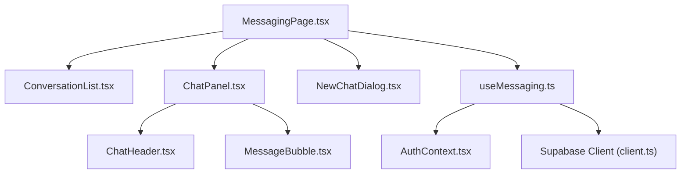
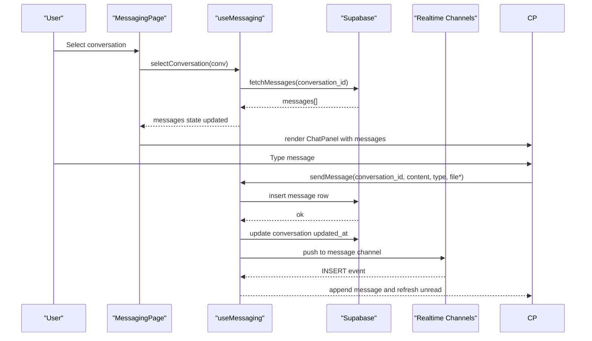
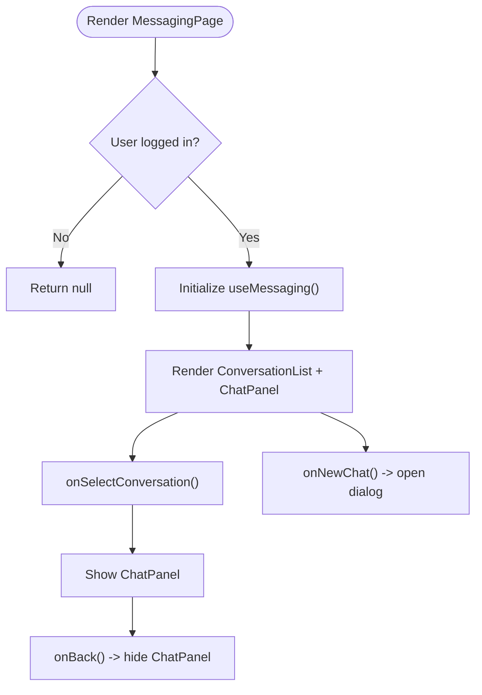
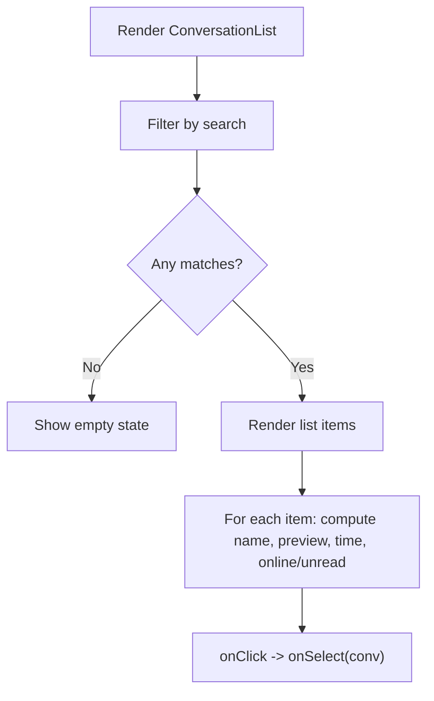
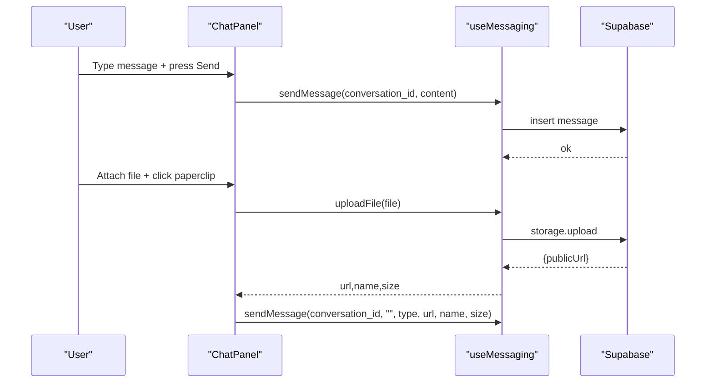
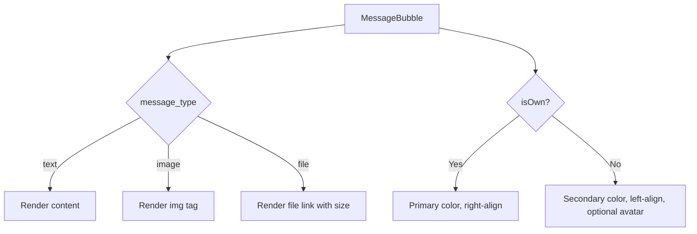
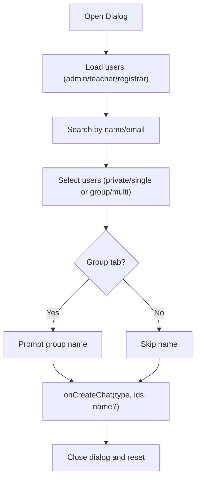
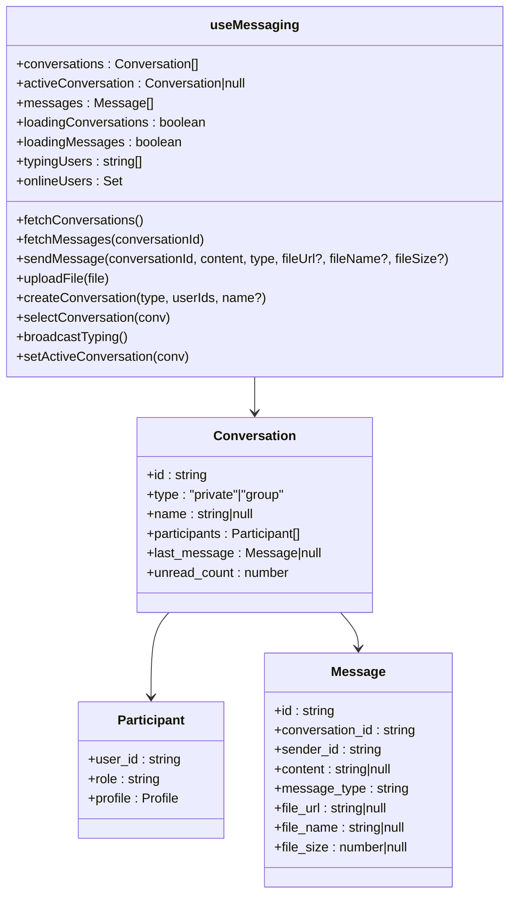
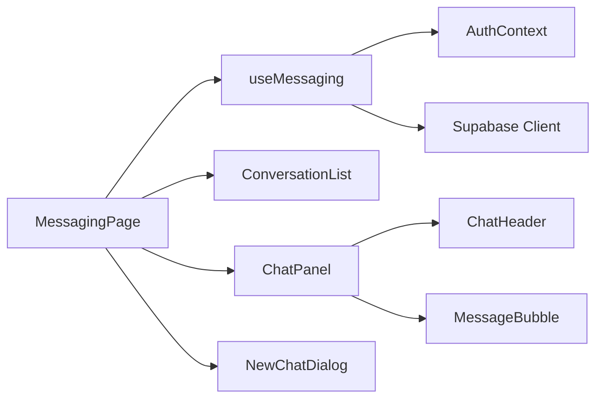

# Internal Messaging System

<cite>
**Referenced Files in This Document**
- [MessagingPage.tsx](file://src/components/messaging/MessagingPage.tsx)
- [ChatPanel.tsx](file://src/components/messaging/ChatPanel.tsx)
- [ConversationList.tsx](file://src/components/messaging/ConversationList.tsx)
- [MessageBubble.tsx](file://src/components/messaging/MessageBubble.tsx)
- [NewChatDialog.tsx](file://src/components/messaging/NewChatDialog.tsx)
- [ChatHeader.tsx](file://src/components/messaging/ChatHeader.tsx)
- [useMessaging.ts](file://src/hooks/useMessaging.ts)
- [AuthContext.tsx](file://src/contexts/AuthContext.tsx)
- [client.ts](file://src/integrations/supabase/client.ts)
</cite>

## Table of Contents
1. [Introduction](#introduction)
2. [Project Structure](#project-structure)
3. [Core Components](#core-components)
4. [Architecture Overview](#architecture-overview)
5. [Detailed Component Analysis](#detailed-component-analysis)
6. [Dependency Analysis](#dependency-analysis)
7. [Performance Considerations](#performance-considerations)
8. [Troubleshooting Guide](#troubleshooting-guide)
9. [Conclusion](#conclusion)

## Introduction
This document describes the internal messaging system used by staff members within the portal. It covers the chat interface components, conversation management, real-time messaging, user presence, attachments, and the useMessaging custom hook that orchestrates data fetching, state management, and Supabase integration. It also explains user interaction patterns, conversation filtering, and integration with the authentication system.

## Project Structure
The messaging system is organized around a responsive layout with a conversation list sidebar and a chat panel. The useMessaging hook centralizes all messaging logic, including fetching conversations/messages, sending messages, uploading attachments, real-time presence and typing indicators, and conversation creation.

**Diagram sources**
- [MessagingPage.tsx](file://src/components/messaging/MessagingPage.tsx#L1-L92)
- [ConversationList.tsx](file://src/components/messaging/ConversationList.tsx#L1-L147)
- [ChatPanel.tsx](file://src/components/messaging/ChatPanel.tsx#L1-L142)
- [MessageBubble.tsx](file://src/components/messaging/MessageBubble.tsx#L1-L71)
- [NewChatDialog.tsx](file://src/components/messaging/NewChatDialog.tsx#L1-L151)
- [ChatHeader.tsx](file://src/components/messaging/ChatHeader.tsx#L1-L53)
- [useMessaging.ts](file://src/hooks/useMessaging.ts#L1-L435)
- [AuthContext.tsx](file://src/contexts/AuthContext.tsx)
- [client.ts](file://src/integrations/supabase/client.ts)

**Section sources**
- [MessagingPage.tsx](file://src/components/messaging/MessagingPage.tsx#L1-L92)
- [useMessaging.ts](file://src/hooks/useMessaging.ts#L1-L435)

## Core Components
- MessagingPage: Orchestrates the overall layout, controls visibility of the conversation list and chat panel, and wires user actions to useMessaging.
- ConversationList: Renders the sidebar list of conversations with search, online indicators, unread badges, and last message previews.
- ChatPanel: Hosts the active conversation view, message rendering, typing indicators, input area, and file attachment handling.
- MessageBubble: Renders individual messages with sender avatars, timestamps, content, and file/image attachments.
- NewChatDialog: Provides a modal to create new private or group conversations by selecting participants.
- ChatHeader: Displays conversation metadata, participant presence, and back navigation on mobile.
- useMessaging: Centralized hook managing conversations, messages, real-time channels, typing presence, online users, uploads, and conversation lifecycle.

**Section sources**
- [MessagingPage.tsx](file://src/components/messaging/MessagingPage.tsx#L9-L91)
- [ConversationList.tsx](file://src/components/messaging/ConversationList.tsx#L22-L146)
- [ChatPanel.tsx](file://src/components/messaging/ChatPanel.tsx#L23-L141)
- [MessageBubble.tsx](file://src/components/messaging/MessageBubble.tsx#L12-L70)
- [NewChatDialog.tsx](file://src/components/messaging/NewChatDialog.tsx#L27-L150)
- [ChatHeader.tsx](file://src/components/messaging/ChatHeader.tsx#L14-L52)
- [useMessaging.ts](file://src/hooks/useMessaging.ts#L44-L434)

## Architecture Overview
The system integrates React components with Supabase for real-time messaging and storage:
- Authentication: AuthContext supplies the current user.
- Data Access: useMessaging queries and mutates Supabase tables for conversations, participants, messages, and profiles.
- Realtime: Presence channels track online users; message channels listen for new messages; typing channels broadcast typing indicators.
- Storage: Files are uploaded to Supabase Storage and referenced via public URLs.

**Diagram sources**
- [MessagingPage.tsx](file://src/components/messaging/MessagingPage.tsx#L24-L45)
- [useMessaging.ts](file://src/hooks/useMessaging.ts#L148-L185)
- [useMessaging.ts](file://src/hooks/useMessaging.ts#L188-L219)
- [useMessaging.ts](file://src/hooks/useMessaging.ts#L325-L385)

## Detailed Component Analysis

### MessagingPage
- Responsibilities:
  - Reads current user from AuthContext.
  - Delegates conversation selection, message sending, file uploads, and conversation creation to useMessaging.
  - Controls responsive layout: hides conversation list on small screens when chat is visible.
  - Opens NewChatDialog for creating new conversations.
- Interaction patterns:
  - Back navigation resets active conversation and toggles layout.
  - Creates conversations and immediately selects them to open the chat panel.

**Diagram sources**
- [MessagingPage.tsx](file://src/components/messaging/MessagingPage.tsx#L9-L91)

**Section sources**
- [MessagingPage.tsx](file://src/components/messaging/MessagingPage.tsx#L9-L91)

### ConversationList
- Features:
  - Search conversations by participant name or email.
  - Online indicators for private chats.
  - Unread badges derived from last_read_at vs last_message timestamps.
  - Last message preview (text, image, or file).
  - Responsive layout with scrollable area.
- Behavior:
  - Filters conversations based on search term.
  - Highlights active conversation.
  - Computes display names for private/group chats.

**Diagram sources**
- [ConversationList.tsx](file://src/components/messaging/ConversationList.tsx#L22-L146)

**Section sources**
- [ConversationList.tsx](file://src/components/messaging/ConversationList.tsx#L22-L146)

### ChatPanel
- Features:
  - Auto-scroll to bottom on new messages.
  - Typing indicators rendered below the message list.
  - Multi-line input with Enter-to-send and Shift+Enter for line break.
  - File upload with preview-type detection (image vs file).
  - Back navigation on mobile.
- Attachment handling:
  - Validates file type and size constraints.
  - Uploads to Supabase Storage and sends a message with file metadata.

**Diagram sources**
- [ChatPanel.tsx](file://src/components/messaging/ChatPanel.tsx#L39-L71)
- [useMessaging.ts](file://src/hooks/useMessaging.ts#L222-L240)
- [useMessaging.ts](file://src/hooks/useMessaging.ts#L188-L219)

**Section sources**
- [ChatPanel.tsx](file://src/components/messaging/ChatPanel.tsx#L23-L141)
- [useMessaging.ts](file://src/hooks/useMessaging.ts#L222-L240)

### MessageBubble
- Rendering logic:
  - Own messages vs others differ in alignment, color, and avatar visibility.
  - Shows sender name above message (for others).
  - Supports text, image, and file message types.
  - Formats file size and displays download link for files.
  - Shows timestamps and delivery status indicators for own messages.

**Diagram sources**
- [MessageBubble.tsx](file://src/components/messaging/MessageBubble.tsx#L12-L70)

**Section sources**
- [MessageBubble.tsx](file://src/components/messaging/MessageBubble.tsx#L12-L70)

### NewChatDialog
- Capabilities:
  - Tabbed interface for private vs group chat.
  - Searchable user list filtered by name/email.
  - Private chat: single-select participant.
  - Group chat: multi-select participants plus optional group name.
  - Creates conversation and participants, then triggers selection.
- Integration:
  - Uses AuthContext for current user.
  - Queries user_roles and profiles to populate user options.

**Diagram sources**
- [NewChatDialog.tsx](file://src/components/messaging/NewChatDialog.tsx#L27-L150)

**Section sources**
- [NewChatDialog.tsx](file://src/components/messaging/NewChatDialog.tsx#L27-L150)

### ChatHeader
- Displays:
  - Conversation avatar (group icon or initials).
  - Online status indicator for private chats.
  - Conversation title (group name or other participant).
  - Member count for group chats.
- Mobile behavior:
  - Shows a back button to return to the conversation list.

**Section sources**
- [ChatHeader.tsx](file://src/components/messaging/ChatHeader.tsx#L14-L52)

### useMessaging Hook
- State and data:
  - conversations, activeConversation, messages, loading flags.
  - typingUsers, onlineUsers sets.
- Data fetching:
  - fetchConversations: builds enriched conversation list with participants, last message, unread counts.
  - fetchMessages: loads messages for active conversation and enriches with sender profiles.
- Mutations:
  - sendMessage: inserts a message row; updates conversation updated_at.
  - uploadFile: stores file in Supabase Storage and returns public URL.
  - createConversation: creates a conversation and adds participants; deduplicates private chats.
- Realtime:
  - Presence channel "online-users" tracks online users.
  - Per-conversation message channel listens for INSERT events and updates last_read_at.
  - Typing presence channel broadcasts typing state and clears after timeout.
- Authentication:
  - Requires user context; guards all network operations.

**Diagram sources**
- [useMessaging.ts](file://src/hooks/useMessaging.ts#L7-L42)
- [useMessaging.ts](file://src/hooks/useMessaging.ts#L44-L434)

**Section sources**
- [useMessaging.ts](file://src/hooks/useMessaging.ts#L44-L434)

## Dependency Analysis
- Component dependencies:
  - MessagingPage depends on useMessaging, AuthContext, ConversationList, ChatPanel, NewChatDialog.
  - ChatPanel depends on ChatHeader, MessageBubble, and exposes callbacks for sending and uploading.
  - NewChatDialog depends on AuthContext and performs user queries.
- External dependencies:
  - Supabase client for database and storage operations.
  - Realtime channels for presence and message streaming.
  - date-fns for human-readable relative times.

**Diagram sources**
- [MessagingPage.tsx](file://src/components/messaging/MessagingPage.tsx#L1-L91)
- [useMessaging.ts](file://src/hooks/useMessaging.ts#L1-L6)
- [AuthContext.tsx](file://src/contexts/AuthContext.tsx)
- [client.ts](file://src/integrations/supabase/client.ts)

**Section sources**
- [MessagingPage.tsx](file://src/components/messaging/MessagingPage.tsx#L1-L91)
- [useMessaging.ts](file://src/hooks/useMessaging.ts#L1-L6)

## Performance Considerations
- Efficient conversation loading:
  - Uses batched queries to fetch participant and profile data for multiple conversations.
  - Calculates unread counts with targeted queries per conversation.
- Realtime efficiency:
  - Subscribes to a single message channel per active conversation.
  - Uses presence channels for global online status and per-conversation typing.
- Rendering optimizations:
  - Memoization of derived conversation metadata (unread counts, previews).
  - Conditional rendering for empty states and loading spinners.
- Storage:
  - Public URLs from Supabase Storage avoid embedding large binary data in state.

## Troubleshooting Guide
- No conversations appear:
  - Ensure the user is a participant in at least one conversation; otherwise, the list will be empty.
  - Verify that fetchConversations completes without errors.
- Messages not updating in real time:
  - Confirm the active conversation channel is subscribed and the user is present in the presence channel.
  - Check that broadcastTyping is invoked and cleared after the timeout.
- Upload failures:
  - Inspect storage upload errors and confirm bucket permissions.
  - Validate file types accepted by the input field.
- Typing indicators not clearing:
  - Ensure the typing timeout clears the presence state after 3 seconds.

**Section sources**
- [useMessaging.ts](file://src/hooks/useMessaging.ts#L296-L385)
- [useMessaging.ts](file://src/hooks/useMessaging.ts#L387-L416)
- [useMessaging.ts](file://src/hooks/useMessaging.ts#L222-L240)

## Conclusion
The internal messaging system provides a robust, real-time chat experience with clear separation of concerns. The useMessaging hook encapsulates Supabase interactions, real-time channels, and state management, while UI components remain focused on presentation and user interaction. The system supports private and group conversations, user presence, typing indicators, and file attachments, integrating seamlessly with the authentication context.