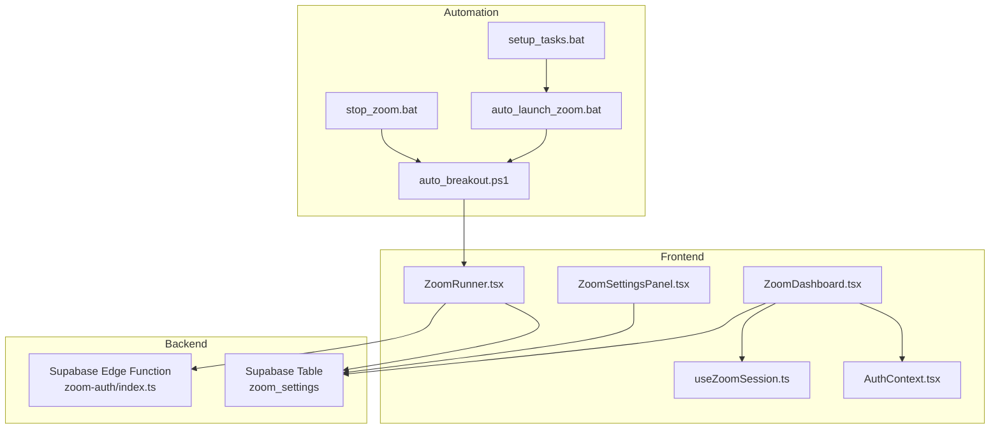
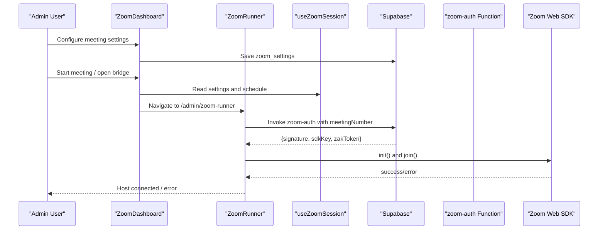
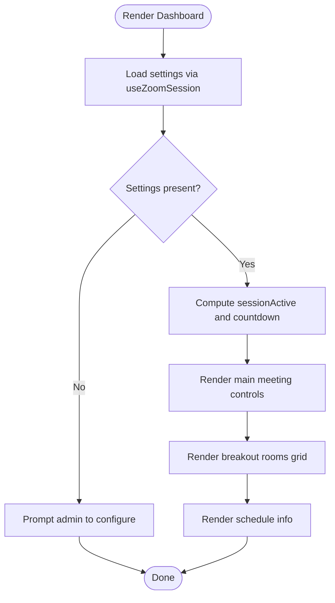
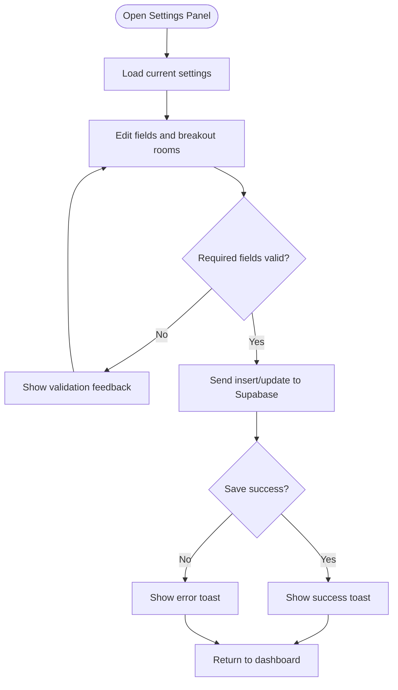
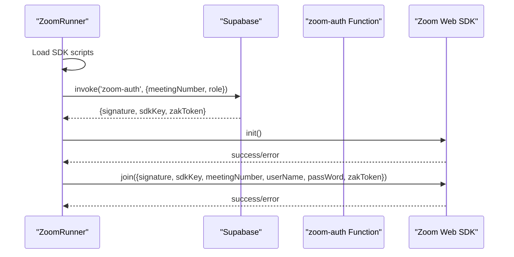
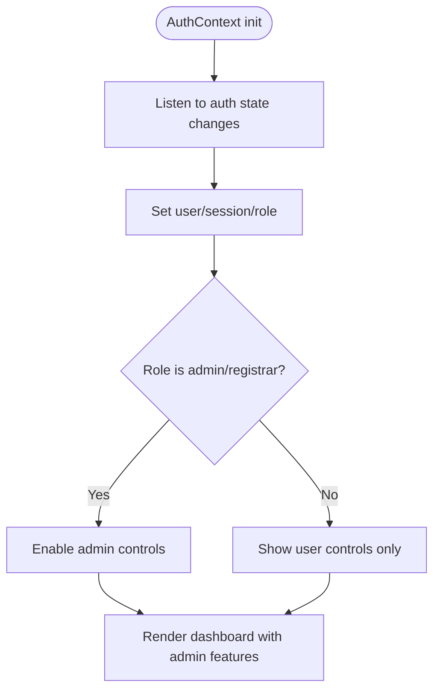
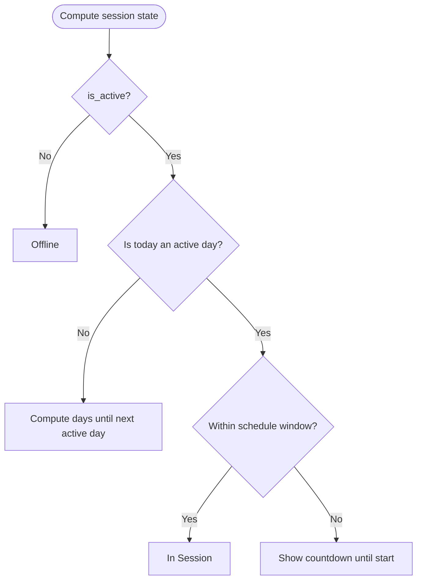
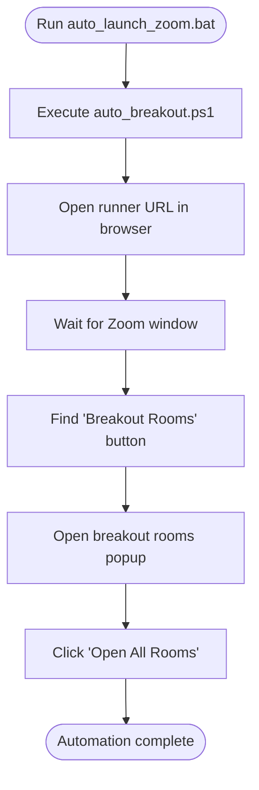
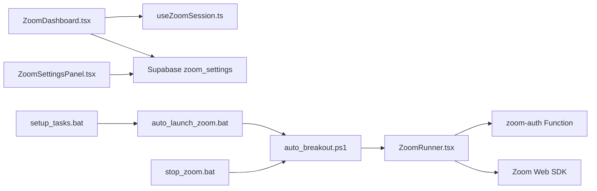
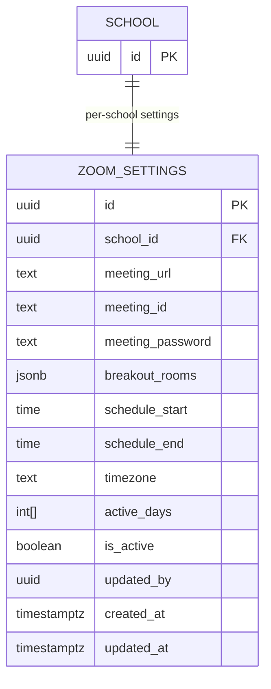

# Virtual Classroom Integration

<cite>
**Referenced Files in This Document**
- [ZoomDashboard.tsx](file://src/components/zoom/ZoomDashboard.tsx)
- [ZoomRunner.tsx](file://src/components/zoom/ZoomRunner.tsx)
- [ZoomSettingsPanel.tsx](file://src/components/zoom/ZoomSettingsPanel.tsx)
- [useZoomSession.ts](file://src/hooks/useZoomSession.ts)
- [AuthContext.tsx](file://src/contexts/AuthContext.tsx)
- [zoom-auth/index.ts](file://supabase/functions/zoom-auth/index.ts)
- [20260207182053_fa2e94aa-a202-48af-a991-a827efc574f4.sql](file://supabase/migrations/20260207182053_fa2e94aa-a202-48af-a991-a827efc574f4.sql)
- [types.ts](file://src/integrations/supabase/types.ts)
- [auto_breakout.ps1](file://bin/zoom-automation/auto_breakout.ps1)
- [auto_launch_zoom.bat](file://bin/zoom-automation/auto_launch_zoom.bat)
- [setup_tasks.bat](file://bin/zoom-automation/setup_tasks.bat)
- [stop_zoom.bat](file://bin/zoom-automation/stop_zoom.bat)
</cite>

## Table of Contents
1. [Introduction](#introduction)
2. [Project Structure](#project-structure)
3. [Core Components](#core-components)
4. [Architecture Overview](#architecture-overview)
5. [Detailed Component Analysis](#detailed-component-analysis)
6. [Dependency Analysis](#dependency-analysis)
7. [Performance Considerations](#performance-considerations)
8. [Troubleshooting Guide](#troubleshooting-guide)
9. [Conclusion](#conclusion)
10. [Appendices](#appendices)

## Introduction
This document explains the virtual classroom integration with Zoom in the portal. It covers the Zoom dashboard interface, meeting management, automation features, and administrative scripts. It documents the Zoom runner functionality, meeting scheduling, participant management, settings panel configuration, authentication workflows, and integration with the authentication system. It also describes automation scripts for launching meetings, managing breakout rooms, and terminating sessions, along with batch and PowerShell scripts for system integration.

## Project Structure
The Zoom integration spans React components, a Supabase Edge Function, and Windows automation scripts:
- Frontend components: dashboard, settings panel, and runner
- Hook for session state and schedule logic
- Supabase table and policies for Zoom settings
- Supabase Edge Function for Zoom credentials
- Windows automation scripts for meeting launch and breakout room management

**Diagram sources**
- [ZoomDashboard.tsx](file://src/components/zoom/ZoomDashboard.tsx#L1-L308)
- [ZoomSettingsPanel.tsx](file://src/components/zoom/ZoomSettingsPanel.tsx#L1-L274)
- [ZoomRunner.tsx](file://src/components/zoom/ZoomRunner.tsx#L1-L207)
- [useZoomSession.ts](file://src/hooks/useZoomSession.ts#L1-L113)
- [AuthContext.tsx](file://src/contexts/AuthContext.tsx#L71-L158)
- [zoom-auth/index.ts](file://supabase/functions/zoom-auth/index.ts#L1-L120)
- [20260207182053_fa2e94aa-a202-48af-a991-a827efc574f4.sql](file://supabase/migrations/20260207182053_fa2e94aa-a202-48af-a991-a827efc574f4.sql#L1-L52)

**Section sources**
- [ZoomDashboard.tsx](file://src/components/zoom/ZoomDashboard.tsx#L1-L308)
- [ZoomSettingsPanel.tsx](file://src/components/zoom/ZoomSettingsPanel.tsx#L1-L274)
- [ZoomRunner.tsx](file://src/components/zoom/ZoomRunner.tsx#L1-L207)
- [useZoomSession.ts](file://src/hooks/useZoomSession.ts#L1-L113)
- [AuthContext.tsx](file://src/contexts/AuthContext.tsx#L71-L158)
- [zoom-auth/index.ts](file://supabase/functions/zoom-auth/index.ts#L1-L120)
- [20260207182053_fa2e94aa-a202-48af-a991-a827efc574f4.sql](file://supabase/migrations/20260207182053_fa2e94aa-a202-48af-a991-a827efc574f4.sql#L1-L52)

## Core Components
- ZoomDashboard: Presents meeting status, controls, and breakout rooms; integrates with session hook and settings.
- ZoomSettingsPanel: Admin-only configuration for meeting URL, ID, password, breakout rooms, schedule, and active days.
- ZoomRunner: Automated host session launcher that loads the Zoom Web SDK, authenticates via the Edge Function, and joins the meeting.
- useZoomSession: Computes session status, countdown, and UAE-localized time from stored settings.
- AuthContext: Provides authentication state and roles used to gate admin actions.
- Supabase Edge Function (zoom-auth): Generates Zoom signatures and optional ZAK tokens for host authentication.
- Supabase zoom_settings table: Stores per-school meeting configuration with row-level security and policies.

**Section sources**
- [ZoomDashboard.tsx](file://src/components/zoom/ZoomDashboard.tsx#L14-L307)
- [ZoomSettingsPanel.tsx](file://src/components/zoom/ZoomSettingsPanel.tsx#L48-L273)
- [ZoomRunner.tsx](file://src/components/zoom/ZoomRunner.tsx#L15-L206)
- [useZoomSession.ts](file://src/hooks/useZoomSession.ts#L22-L112)
- [AuthContext.tsx](file://src/contexts/AuthContext.tsx#L71-L158)
- [zoom-auth/index.ts](file://supabase/functions/zoom-auth/index.ts#L81-L119)
- [20260207182053_fa2e94aa-a202-48af-a991-a827efc574f4.sql](file://supabase/migrations/20260207182053_fa2e94aa-a202-48af-a991-a827efc574f4.sql#L2-L51)

## Architecture Overview
The integration consists of:
- Frontend React components that render the dashboard and settings, and orchestrate the automated runner.
- Supabase Edge Function that securely generates Zoom credentials for host sessions.
- Windows automation scripts that launch the runner, locate the Zoom UI, and open breakout rooms.

**Diagram sources**
- [ZoomDashboard.tsx](file://src/components/zoom/ZoomDashboard.tsx#L132-L159)
- [ZoomRunner.tsx](file://src/components/zoom/ZoomRunner.tsx#L86-L119)
- [useZoomSession.ts](file://src/hooks/useZoomSession.ts#L34-L73)
- [zoom-auth/index.ts](file://supabase/functions/zoom-auth/index.ts#L81-L119)

## Detailed Component Analysis

### Zoom Dashboard
The dashboard displays:
- Session status and countdown
- Current UAE time
- Main meeting join button with meeting ID/password
- Breakout rooms grid with join links
- Schedule info (active days and times)

It supports manual override to start a meeting outside schedule for admin testing and provides a “Launch Bridge” shortcut to the runner page.

**Diagram sources**
- [ZoomDashboard.tsx](file://src/components/zoom/ZoomDashboard.tsx#L14-L307)
- [useZoomSession.ts](file://src/hooks/useZoomSession.ts#L59-L102)

**Section sources**
- [ZoomDashboard.tsx](file://src/components/zoom/ZoomDashboard.tsx#L14-L307)
- [useZoomSession.ts](file://src/hooks/useZoomSession.ts#L22-L112)

### Zoom Settings Panel
The settings panel allows administrators to:
- Set meeting URL, ID, and password
- Define breakout rooms with name and join URL
- Configure schedule start/end times
- Select active days
- Toggle classroom activation

On save, it writes to the zoom_settings table and triggers a success notification.

**Diagram sources**
- [ZoomSettingsPanel.tsx](file://src/components/zoom/ZoomSettingsPanel.tsx#L82-L119)
- [20260207182053_fa2e94aa-a202-48af-a991-a827efc574f4.sql](file://supabase/migrations/20260207182053_fa2e94aa-a202-48af-a991-a827efc574f4.sql#L2-L19)

**Section sources**
- [ZoomSettingsPanel.tsx](file://src/components/zoom/ZoomSettingsPanel.tsx#L48-L273)
- [20260207182053_fa2e94aa-a202-48af-a991-a827efc574f4.sql](file://supabase/migrations/20260207182053_fa2e94aa-a202-48af-a991-a827efc574f4.sql#L2-L51)

### Zoom Runner
The runner:
- Dynamically loads Zoom Web SDK dependencies
- Waits for session to be active and settings to be loaded
- Invokes the zoom-auth Edge Function to obtain signature and optional ZAK token
- Initializes and joins the meeting as host
- Displays status and error handling

**Diagram sources**
- [ZoomRunner.tsx](file://src/components/zoom/ZoomRunner.tsx#L23-L126)
- [zoom-auth/index.ts](file://supabase/functions/zoom-auth/index.ts#L81-L119)

**Section sources**
- [ZoomRunner.tsx](file://src/components/zoom/ZoomRunner.tsx#L15-L206)
- [zoom-auth/index.ts](file://supabase/functions/zoom-auth/index.ts#L1-L120)

### Authentication and Access Control
- AuthContext manages authentication state and role retrieval.
- The dashboard conditionally renders admin-only controls (manual start, settings, bridge link) based on role.
- Zoom settings table enforces row-level security with policies allowing admins/registrars to manage and authenticated users to view.

**Diagram sources**
- [AuthContext.tsx](file://src/contexts/AuthContext.tsx#L77-L109)
- [ZoomDashboard.tsx](file://src/components/zoom/ZoomDashboard.tsx#L132-L159)
- [20260207182053_fa2e94aa-a202-48af-a991-a827efc574f4.sql](file://supabase/migrations/20260207182053_fa2e94aa-a202-48af-a991-a827efc574f4.sql#L24-L45)

**Section sources**
- [AuthContext.tsx](file://src/contexts/AuthContext.tsx#L71-L158)
- [ZoomDashboard.tsx](file://src/components/zoom/ZoomDashboard.tsx#L132-L159)
- [20260207182053_fa2e94aa-a202-48af-a991-a827efc574f4.sql](file://supabase/migrations/20260207182053_fa2e94aa-a202-48af-a991-a827efc574f4.sql#L24-L45)

### Meeting Scheduling and Participant Management
- useZoomSession computes whether a session is currently in progress based on active days and schedule window.
- Countdown messages inform users when the next session starts.
- Participants join via the dashboard’s main meeting and breakout room links; passwords and IDs are copied from the dashboard.

**Diagram sources**
- [useZoomSession.ts](file://src/hooks/useZoomSession.ts#L59-L102)
- [ZoomDashboard.tsx](file://src/components/zoom/ZoomDashboard.tsx#L179-L183)

**Section sources**
- [useZoomSession.ts](file://src/hooks/useZoomSession.ts#L59-L102)
- [ZoomDashboard.tsx](file://src/components/zoom/ZoomDashboard.tsx#L176-L183)

### Automation Scripts for Meeting Launching, Breakout Room Management, and Termination
- auto_breakout.ps1: Opens the runner, waits for the Zoom window, locates the “Breakout Rooms” button (including “More”), opens the popup, and clicks “Open All Rooms.”
- auto_launch_zoom.bat: Executes the PowerShell automation script and handles failure.
- setup_tasks.bat: Creates Windows scheduled tasks to launch and stop Zoom at configured times.
- stop_zoom.bat: Terminates the Zoom process.

**Diagram sources**
- [auto_launch_zoom.bat](file://bin/zoom-automation/auto_launch_zoom.bat#L1-L11)
- [auto_breakout.ps1](file://bin/zoom-automation/auto_breakout.ps1#L1-L168)
- [setup_tasks.bat](file://bin/zoom-automation/setup_tasks.bat#L1-L16)
- [stop_zoom.bat](file://bin/zoom-automation/stop_zoom.bat#L1-L6)

**Section sources**
- [auto_breakout.ps1](file://bin/zoom-automation/auto_breakout.ps1#L1-L168)
- [auto_launch_zoom.bat](file://bin/zoom-automation/auto_launch_zoom.bat#L1-L11)
- [setup_tasks.bat](file://bin/zoom-automation/setup_tasks.bat#L1-L16)
- [stop_zoom.bat](file://bin/zoom-automation/stop_zoom.bat#L1-L6)

## Dependency Analysis
- Components depend on Supabase for settings persistence and the zoom-auth Edge Function for secure credentials.
- The runner depends on the Zoom Web SDK hosted externally.
- Automation scripts depend on Windows UI Automation and the local browser running the runner.

**Diagram sources**
- [ZoomDashboard.tsx](file://src/components/zoom/ZoomDashboard.tsx#L1-L308)
- [ZoomSettingsPanel.tsx](file://src/components/zoom/ZoomSettingsPanel.tsx#L1-L274)
- [ZoomRunner.tsx](file://src/components/zoom/ZoomRunner.tsx#L1-L207)
- [useZoomSession.ts](file://src/hooks/useZoomSession.ts#L1-L113)
- [zoom-auth/index.ts](file://supabase/functions/zoom-auth/index.ts#L1-L120)
- [auto_breakout.ps1](file://bin/zoom-automation/auto_breakout.ps1#L1-L168)
- [auto_launch_zoom.bat](file://bin/zoom-automation/auto_launch_zoom.bat#L1-L11)
- [setup_tasks.bat](file://bin/zoom-automation/setup_tasks.bat#L1-L16)
- [stop_zoom.bat](file://bin/zoom-automation/stop_zoom.bat#L1-L6)

**Section sources**
- [ZoomDashboard.tsx](file://src/components/zoom/ZoomDashboard.tsx#L1-L308)
- [ZoomRunner.tsx](file://src/components/zoom/ZoomRunner.tsx#L1-L207)
- [zoom-auth/index.ts](file://supabase/functions/zoom-auth/index.ts#L1-L120)
- [auto_breakout.ps1](file://bin/zoom-automation/auto_breakout.ps1#L1-L168)

## Performance Considerations
- SDK loading: The runner defers SDK initialization until the session is active to reduce unnecessary overhead.
- Network latency: Credentials are fetched via an Edge Function; ensure reliable network connectivity.
- UI responsiveness: Dashboard updates every second for accurate countdown; keep rendering lightweight.
- Automation reliability: The PowerShell script includes retries and logging; adjust timeouts for slower systems.

[No sources needed since this section provides general guidance]

## Troubleshooting Guide
Common issues and resolutions:
- Meeting does not join automatically:
  - Verify session is active and settings are saved.
  - Check zoom-auth function logs for credential generation errors.
  - Confirm browser allows pop-ups and the runner page is reachable.
- Breakout rooms not opening:
  - Ensure the Zoom window is visible and the “Breakout Rooms” button appears in the UI.
  - Run the automation again; it retries locating the button and “More” menu.
- Scheduled tasks not working:
  - Confirm scheduled task paths match the actual script locations.
  - Ensure the account running the task has permission to launch applications.
- Authentication failures:
  - Check that Zoom credentials are configured in environment variables for the Edge Function.
  - Verify the meetingNumber is correct and the meeting exists.

**Section sources**
- [ZoomRunner.tsx](file://src/components/zoom/ZoomRunner.tsx#L139-L159)
- [auto_breakout.ps1](file://bin/zoom-automation/auto_breakout.ps1#L36-L108)
- [setup_tasks.bat](file://bin/zoom-automation/setup_tasks.bat#L4-L8)
- [zoom-auth/index.ts](file://supabase/functions/zoom-auth/index.ts#L87-L89)

## Conclusion
The virtual classroom integration provides a robust, automated Zoom experience with a dashboard for monitoring, admin configuration, and scheduled automation. The system leverages Supabase for configuration and secure credential generation, while Windows automation streamlines breakout room management and lifecycle control.

[No sources needed since this section summarizes without analyzing specific files]

## Appendices

### Data Model: zoom_settings

**Diagram sources**
- [20260207182053_fa2e94aa-a202-48af-a991-a827efc574f4.sql](file://supabase/migrations/20260207182053_fa2e94aa-a202-48af-a991-a827efc574f4.sql#L2-L19)
- [types.ts](file://src/integrations/supabase/types.ts#L3806-L3864)

### Example Workflows

- Meeting launch workflow:
  - Admin configures settings in the dashboard.
  - Scheduled task launches the automation, which opens the runner and joins the meeting.
  - Host controls become available in the Zoom UI.

- Breakout room management:
  - Automation locates the breakout rooms UI and opens all rooms.
  - Teachers can then move participants into rooms.

- Session termination:
  - Scheduled task stops Zoom via the batch script.

[No sources needed since this section provides general guidance]