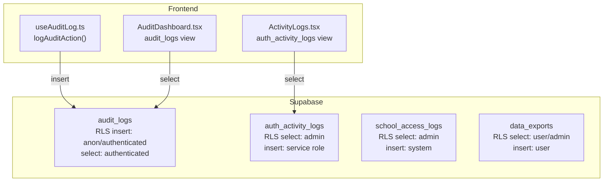
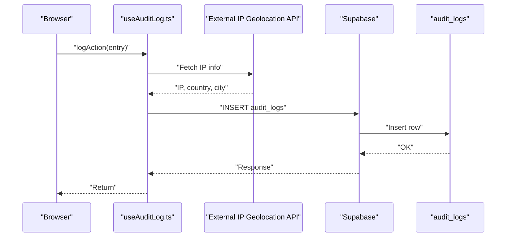
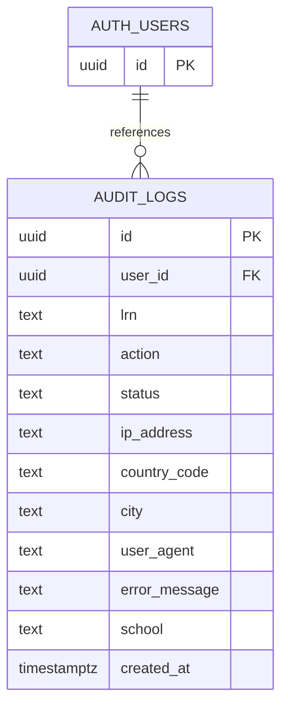
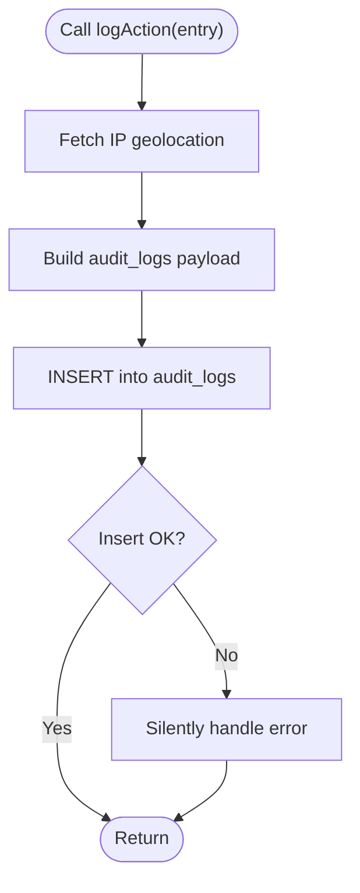
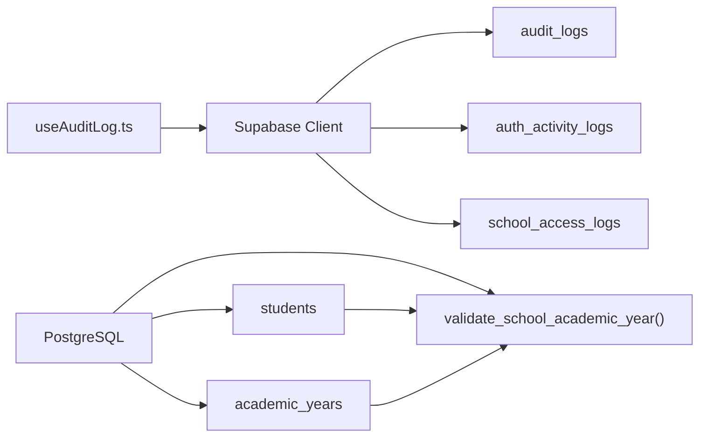

# Audit Logging & Data Integrity

<cite>
**Referenced Files in This Document**
- [useAuditLog.ts](file://src/hooks/useAuditLog.ts)
- [ActivityLogs.tsx](file://src/components/admin/ActivityLogs.tsx)
- [AuditDashboard.tsx](file://src/components/management/AuditDashboard.tsx)
- [create_audit_logs.sql](file://supabase/migrations/20260209100000_create_audit_logs.sql)
- [school_year_segregation.sql](file://supabase/migrations/20260205040000_school_year_segregation.sql)
- [verify_segregation.sql](file://supabase/migrations/verify_segregation.sql)
- [school_segregation_enhancements.sql](file://supabase/migrations/20260205041000_school_segregation_enhancements.sql)
- [types.ts](file://src/integrations/supabase/types.ts)
- [validation.ts](file://src/lib/validation.ts)
</cite>

## Table of Contents
1. [Introduction](#introduction)
2. [Project Structure](#project-structure)
3. [Core Components](#core-components)
4. [Architecture Overview](#architecture-overview)
5. [Detailed Component Analysis](#detailed-component-analysis)
6. [Dependency Analysis](#dependency-analysis)
7. [Performance Considerations](#performance-considerations)
8. [Troubleshooting Guide](#troubleshooting-guide)
9. [Conclusion](#conclusion)
10. [Appendices](#appendices)

## Introduction
This document describes the audit logging system and data integrity mechanisms implemented in the portal. It covers:
- Audit log table structure and policies
- Event tracking patterns for critical operations
- Data retention and access controls
- Automatic and manual logging procedures
- Audit trail querying and compliance reporting
- Data integrity constraints, validation rules, and business rule enforcement
- Guidance on configuring audit policies, managing log volume, and integrating audit data with external systems

## Project Structure
The audit and integrity features span frontend hooks, UI dashboards, Supabase database tables, and migration scripts:
- Frontend logging hook and dashboards for audit and activity logs
- Supabase tables for audit logs, authentication activity logs, and segregation-related audit trails
- Row Level Security (RLS) policies and indexes for performance and access control
- Validation schemas and helper functions ensuring data integrity

**Diagram sources**
- [useAuditLog.ts](file://src/hooks/useAuditLog.ts#L23-L60)
- [AuditDashboard.tsx](file://src/components/management/AuditDashboard.tsx#L40-L52)
- [ActivityLogs.tsx](file://src/components/admin/ActivityLogs.tsx#L58-L88)
- [create_audit_logs.sql](file://supabase/migrations/20260209100000_create_audit_logs.sql#L1-L38)
- [school_segregation_enhancements.sql](file://supabase/migrations/20260205041000_school_segregation_enhancements.sql#L46-L85)

**Section sources**
- [useAuditLog.ts](file://src/hooks/useAuditLog.ts#L1-L69)
- [AuditDashboard.tsx](file://src/components/management/AuditDashboard.tsx#L1-L205)
- [ActivityLogs.tsx](file://src/components/admin/ActivityLogs.tsx#L1-L312)
- [create_audit_logs.sql](file://supabase/migrations/20260209100000_create_audit_logs.sql#L1-L38)
- [school_segregation_enhancements.sql](file://supabase/migrations/20260205041000_school_segregation_enhancements.sql#L46-L85)

## Core Components
- Audit logging hook: Provides a typed interface to log actions with optional entity identifiers, status, error messages, and school context. It captures IP geolocation and user agent, inserts into the audit logs table, and handles failures gracefully.
- Audit dashboard: Displays recent audit logs with search and filter capabilities, showing action, status, location, and device metadata.
- Authentication activity logs dashboard: Lists login/logout/failure events with export to CSV.
- Supabase audit tables and policies: Define storage, access control, and indexes for audit trails.
- Data segregation and integrity: Enforce referential integrity between schools and academic years via triggers and indexes; provide helper functions and views for access logging and monitoring.

**Section sources**
- [useAuditLog.ts](file://src/hooks/useAuditLog.ts#L4-L21)
- [useAuditLog.ts](file://src/hooks/useAuditLog.ts#L23-L60)
- [AuditDashboard.tsx](file://src/components/management/AuditDashboard.tsx#L36-L110)
- [ActivityLogs.tsx](file://src/components/admin/ActivityLogs.tsx#L52-L127)
- [create_audit_logs.sql](file://supabase/migrations/20260209100000_create_audit_logs.sql#L1-L38)
- [school_year_segregation.sql](file://supabase/migrations/20260205040000_school_year_segregation.sql#L206-L229)
- [school_segregation_enhancements.sql](file://supabase/migrations/20260205041000_school_segregation_enhancements.sql#L286-L324)

## Architecture Overview
The audit logging architecture combines client-side automatic logging with server-side dashboards and database-level policies.

**Diagram sources**
- [useAuditLog.ts](file://src/hooks/useAuditLog.ts#L23-L60)
- [create_audit_logs.sql](file://supabase/migrations/20260209100000_create_audit_logs.sql#L1-L15)

**Section sources**
- [useAuditLog.ts](file://src/hooks/useAuditLog.ts#L23-L60)
- [create_audit_logs.sql](file://supabase/migrations/20260209100000_create_audit_logs.sql#L1-L15)

## Detailed Component Analysis

### Audit Log Table Structure and Policies
- Table: audit_logs
  - Columns include identifiers, action, status, IP geolocation, user agent, error message, and school context.
  - Timestamp defaults to UTC.
  - RLS enabled with:
    - Insert allowed for anonymous and authenticated users (for login attempts and other events).
    - Select allowed for authenticated users.
  - Indexes on user_id, created_at, and lrn for performance.

**Diagram sources**
- [create_audit_logs.sql](file://supabase/migrations/20260209100000_create_audit_logs.sql#L2-L15)
- [types.ts](file://src/integrations/supabase/types.ts#L412-L456)

**Section sources**
- [create_audit_logs.sql](file://supabase/migrations/20260209100000_create_audit_logs.sql#L1-L38)
- [types.ts](file://src/integrations/supabase/types.ts#L412-L456)

### Authentication Activity Logs
- Table: auth_activity_logs
  - Tracks login/logout/failure events with user email/name, IP, user agent, and status.
  - RLS policies:
    - Select restricted to authenticated users with admin role.
    - Insert allowed for service role to log from edge functions.

**Section sources**
- [school_segregation_enhancements.sql](file://supabase/migrations/20260205041000_school_segregation_enhancements.sql#L1-L129)

### Data Segregation and Access Audit Trail
- school_access_logs
  - Captures access/modification events with school and academic year context, IP, user agent, success flag, and error messages.
  - RLS policies:
    - Select restricted to admin.
    - Insert allowed for system/service role.
  - Indexes on created_at, user_id, and school_id for performance.
- Helper functions:
  - user_has_school_access: checks access for a user and school.
  - get_user_schools: lists accessible schools and roles.
  - log_school_access: inserts access log entries.
- Views:
  - school_access_stats: aggregates access counts and unique users over the last 30 days.

**Section sources**
- [school_segregation_enhancements.sql](file://supabase/migrations/20260205041000_school_segregation_enhancements.sql#L46-L85)
- [school_segregation_enhancements.sql](file://supabase/migrations/20260205041000_school_segregation_enhancements.sql#L246-L324)
- [school_segregation_enhancements.sql](file://supabase/migrations/20260205041000_school_segregation_enhancements.sql#L330-L345)

### Data Integrity Constraints and Business Rules
- Triggers and validation:
  - validate_school_academic_year enforces that academic_year_id belongs to the same school as the record’s school_id for students and raw_scores.
  - Triggers prevent cross-school academic-year mismatches.
- Composite indexes:
  - idx_students_school_year and similar indexes optimize queries filtering by school and academic year.
- Verification script:
  - Confirms zero violations, correct index and trigger counts, and proper index usage in query plans.

**Section sources**
- [school_year_segregation.sql](file://supabase/migrations/20260205040000_school_year_segregation.sql#L206-L229)
- [school_year_segregation.sql](file://supabase/migrations/20260205040000_school_year_segregation.sql#L185-L200)
- [verify_segregation.sql](file://supabase/migrations/verify_segregation.sql#L84-L158)

### Automatic Audit Logging Implementation
- Action types include login attempts, successes, failures, logout, impersonation start/stop, data export, and grade changes.
- The hook captures:
  - IP geolocation via external API (graceful fallback if unavailable).
  - User agent from the browser.
  - Optional LRN, school, and error message.
- Insert is performed asynchronously; failures are handled silently to avoid breaking the app.

**Diagram sources**
- [useAuditLog.ts](file://src/hooks/useAuditLog.ts#L23-L60)

**Section sources**
- [useAuditLog.ts](file://src/hooks/useAuditLog.ts#L4-L21)
- [useAuditLog.ts](file://src/hooks/useAuditLog.ts#L23-L60)

### Manual Logging Procedures
- Authentication activity logs:
  - Logged by service role via Supabase edge functions into auth_activity_logs.
- School access logs:
  - Logged via log_school_access function into school_access_logs.
- Data export tracking:
  - Records exports into data_exports with metadata for compliance.

**Section sources**
- [school_segregation_enhancements.sql](file://supabase/migrations/20260205041000_school_segregation_enhancements.sql#L18-L129)
- [school_segregation_enhancements.sql](file://supabase/migrations/20260205041000_school_segregation_enhancements.sql#L286-L324)
- [school_segregation_enhancements.sql](file://supabase/migrations/20260205041000_school_segregation_enhancements.sql#L351-L389)

### Audit Trail Querying and Compliance Reporting
- Frontend dashboards:
  - AuditDashboard: filters by status and search terms, displays action badges, location, and device info.
  - ActivityLogs: filters by action type and date range, supports CSV export.
- Backend views:
  - school_access_stats aggregates access metrics for the last 30 days.

**Section sources**
- [AuditDashboard.tsx](file://src/components/management/AuditDashboard.tsx#L36-L110)
- [ActivityLogs.tsx](file://src/components/admin/ActivityLogs.tsx#L52-L127)
- [school_segregation_enhancements.sql](file://supabase/migrations/20260205041000_school_segregation_enhancements.sql#L330-L345)

### Data Integrity Constraints, Validation Rules, and Business Rule Enforcement
- Validation schemas (Zod):
  - Student schema enforces LRN format, name length/format, date formats, numeric bounds, and URL formats.
  - Academic year schema enforces name format and date formats.
  - Finance and grade schemas enforce numeric ranges and enums.
- Validation helpers:
  - validateData and validatePartialData provide consistent parsing and error formatting.
- Database-level enforcement:
  - Triggers and indexes ensure referential integrity between schools and academic years.
  - RLS policies restrict access to sensitive audit tables.

**Section sources**
- [validation.ts](file://src/lib/validation.ts#L14-L96)
- [validation.ts](file://src/lib/validation.ts#L136-L148)
- [validation.ts](file://src/lib/validation.ts#L156-L187)
- [validation.ts](file://src/lib/validation.ts#L195-L221)
- [validation.ts](file://src/lib/validation.ts#L250-L292)
- [school_year_segregation.sql](file://supabase/migrations/20260205040000_school_year_segregation.sql#L206-L229)

## Dependency Analysis
- Frontend depends on Supabase client for database operations.
- Supabase tables depend on RLS policies and indexes for access and performance.
- Triggers depend on referential integrity between academic_years and records.

**Diagram sources**
- [useAuditLog.ts](file://src/hooks/useAuditLog.ts#L1-L2)
- [create_audit_logs.sql](file://supabase/migrations/20260209100000_create_audit_logs.sql#L1-L15)
- [school_segregation_enhancements.sql](file://supabase/migrations/20260205041000_school_segregation_enhancements.sql#L46-L85)
- [school_year_segregation.sql](file://supabase/migrations/20260205040000_school_year_segregation.sql#L206-L229)

**Section sources**
- [useAuditLog.ts](file://src/hooks/useAuditLog.ts#L1-L2)
- [create_audit_logs.sql](file://supabase/migrations/20260209100000_create_audit_logs.sql#L1-L15)
- [school_segregation_enhancements.sql](file://supabase/migrations/20260205041000_school_segregation_enhancements.sql#L46-L85)
- [school_year_segregation.sql](file://supabase/migrations/20260205040000_school_year_segregation.sql#L206-L229)

## Performance Considerations
- Indexes:
  - audit_logs: user_id, created_at, lrn.
  - auth_activity_logs: user_id, created_at DESC, action.
  - school_access_logs: created_at DESC, user_id, school_id.
  - data_exports: user_id, school_id.
- Triggers and composite indexes:
  - validate_school_academic_year and composite indexes improve query performance and prevent segregation violations.
- Recommendations:
  - Use date-range filters and action/status filters in dashboards to limit result sets.
  - Consider partitioning or retention policies for long-term audit tables.

[No sources needed since this section provides general guidance]

## Troubleshooting Guide
- Audit logs not appearing:
  - Check RLS policy for insert on audit_logs and network connectivity to the IP geolocation API.
- Authentication activity logs missing:
  - Verify service role insert policy and edge function invocation.
- Data segregation violations:
  - Review trigger error messages and ensure academic_year_id belongs to the same school as the record.
- Dashboard queries failing:
  - Confirm authenticated session and admin role for admin-only dashboards.

**Section sources**
- [create_audit_logs.sql](file://supabase/migrations/20260209100000_create_audit_logs.sql#L17-L32)
- [school_segregation_enhancements.sql](file://supabase/migrations/20260205041000_school_segregation_enhancements.sql#L18-L37)
- [school_year_segregation.sql](file://supabase/migrations/20260205040000_school_year_segregation.sql#L217-L225)

## Conclusion
The system provides robust audit logging and strong data integrity through:
- Typed, automatic client-side logging with graceful failure handling
- Comprehensive dashboards for real-time monitoring and export
- Database-level RLS policies, triggers, and indexes enforcing segregation and access control
- Validation schemas and helper functions ensuring input correctness
These mechanisms support compliance reporting, security monitoring, and operational oversight.

[No sources needed since this section summarizes without analyzing specific files]

## Appendices

### Audit Log Queries and Compliance Reporting Examples
- Retrieve recent login attempts for a user within a date range:
  - SELECT * FROM audit_logs WHERE user_id = '<user-id>' AND action IN ('login_attempt','login_success','login_failure') AND created_at BETWEEN '<from>' AND '<to>' ORDER BY created_at DESC LIMIT 100;
- Export failed login events for a period:
  - SELECT * FROM auth_activity_logs WHERE action = 'failed_login' AND created_at BETWEEN '<from>' AND '<to>' ORDER BY created_at DESC;
- Aggregate school access counts for the last 30 days:
  - SELECT * FROM school_access_stats WHERE access_date >= CURRENT_DATE - INTERVAL '30 days';

[No sources needed since this section provides general guidance]

### Configuring Audit Policies and Managing Log Volume
- Configure RLS:
  - Ensure insert/select policies match your security model (e.g., allow insert for anon/authenticated; restrict select to authenticated/admin).
- Manage volume:
  - Apply date-range filters in dashboards.
  - Consider partitioning or archiving older audit records.
  - Limit dashboard result sizes (already capped in queries).

[No sources needed since this section provides general guidance]

### Integrating Audit Data with External Systems
- Use the dashboards’ CSV export functionality to download audit data for external SIEM or analytics platforms.
- For programmatic access, query the relevant tables directly using Supabase client libraries and apply appropriate filters.

[No sources needed since this section provides general guidance]