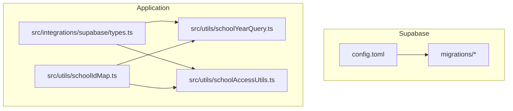
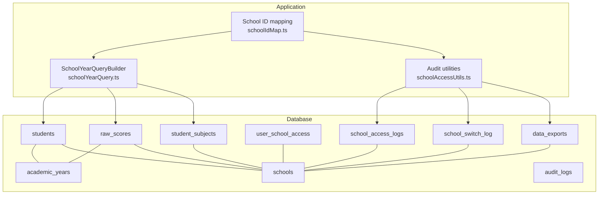
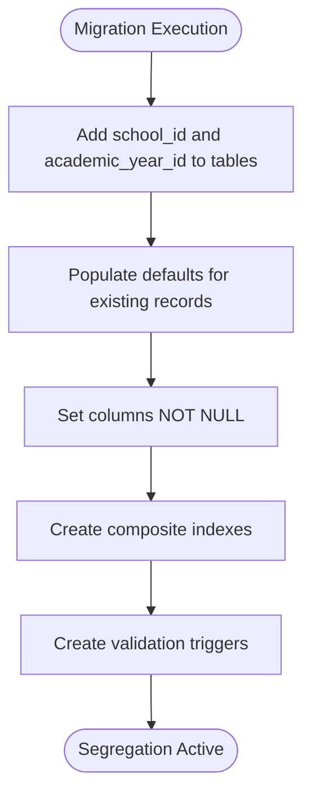
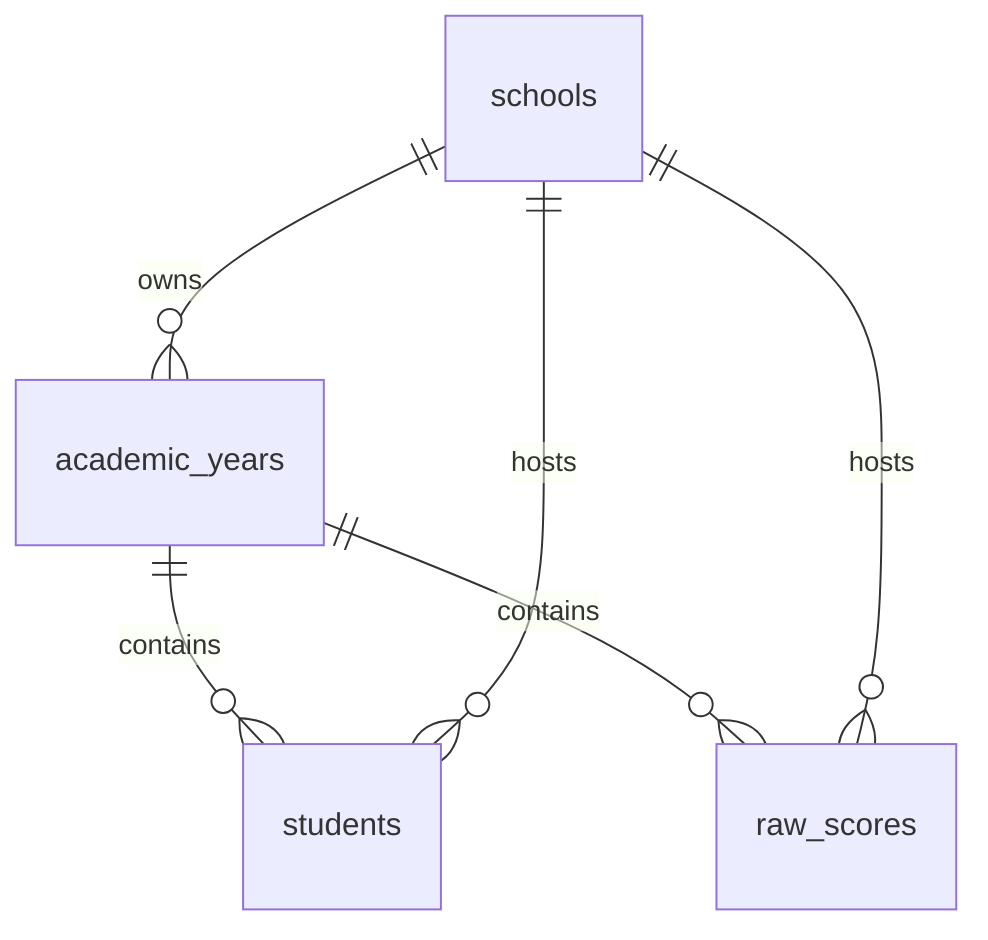
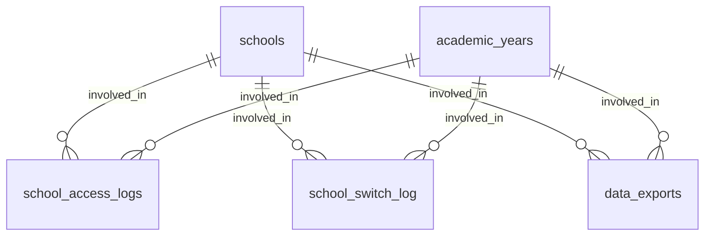
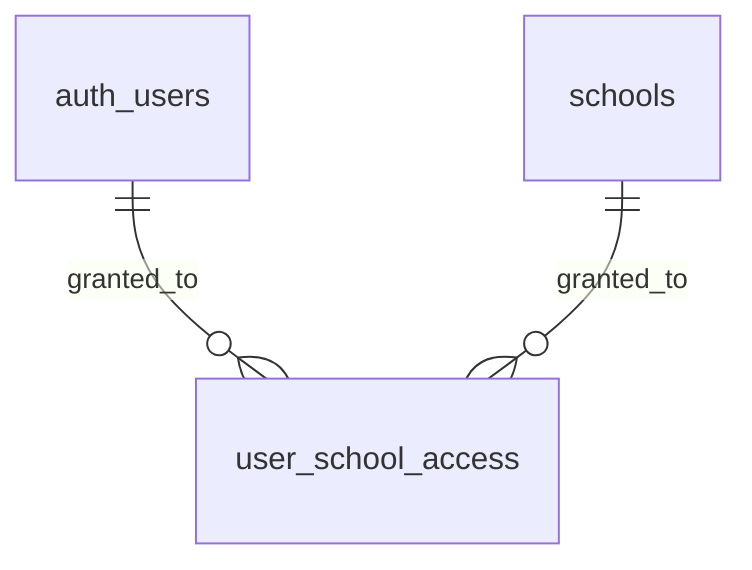
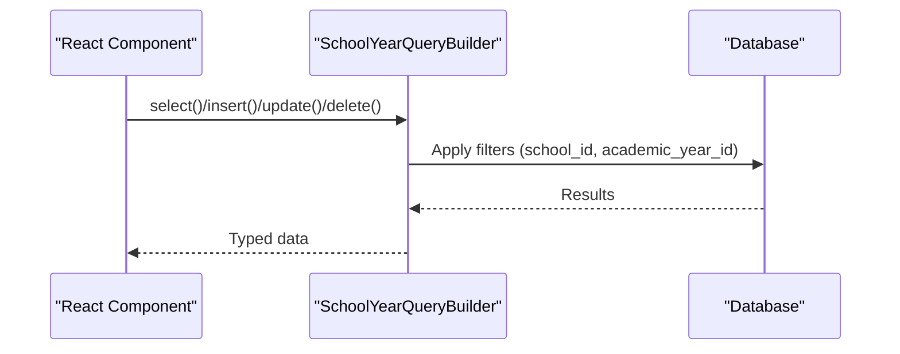
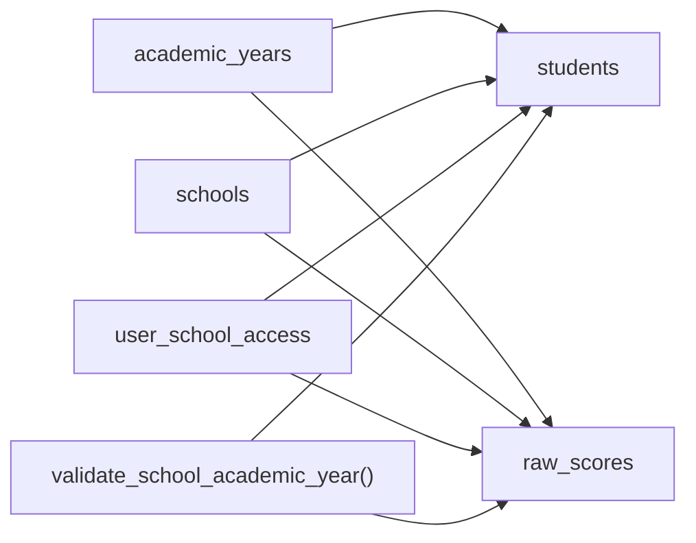
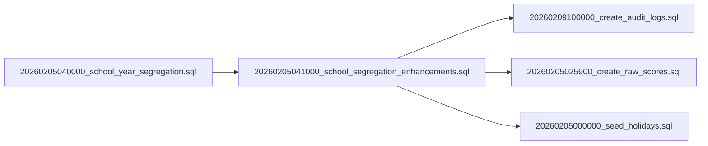

# Database Schema & Migrations

<cite>
**Referenced Files in This Document**
- [config.toml](file://supabase/config.toml)
- [20260205040000_school_year_segregation.sql](file://supabase/migrations/20260205040000_school_year_segregation.sql)
- [20260205041000_school_segregation_enhancements.sql](file://supabase/migrations/20260205041000_school_segregation_enhancements.sql)
- [20260209100000_create_audit_logs.sql](file://supabase/migrations/20260209100000_create_audit_logs.sql)
- [20260205000000_seed_holidays.sql](file://supabase/migrations/20260205000000_seed_holidays.sql)
- [20260205025900_create_raw_scores.sql](file://supabase/migrations/20260205025900_create_raw_scores.sql)
- [SCHOOL_SEGREGATION.md](file://docs/SCHOOL_SEGREGATION.md)
- [SCHOOL_SEGREGATION_ENHANCEMENTS.md](file://docs/SCHOOL_SEGREGATION_ENHANCEMENTS.md)
- [types.ts](file://src/integrations/supabase/types.ts)
- [schoolYearQuery.ts](file://src/utils/schoolYearQuery.ts)
- [schoolAccessUtils.ts](file://src/utils/schoolAccessUtils.ts)
- [schoolIdMap.ts](file://src/utils/schoolIdMap.ts)
</cite>

## Table of Contents
1. [Introduction](#introduction)
2. [Project Structure](#project-structure)
3. [Core Components](#core-components)
4. [Architecture Overview](#architecture-overview)
5. [Detailed Component Analysis](#detailed-component-analysis)
6. [Dependency Analysis](#dependency-analysis)
7. [Performance Considerations](#performance-considerations)
8. [Troubleshooting Guide](#troubleshooting-guide)
9. [Conclusion](#conclusion)
10. [Appendices](#appendices)

## Introduction
This document provides comprehensive data model documentation for the database schema, focusing on multi-school data segregation, academic year tracking, audit logging, constraints, indexes, and migration management. It explains how the system enforces data isolation, tracks access and exports, and maintains schema evolution through structured migrations. It also outlines integration patterns with TypeScript interfaces and utility helpers.

## Project Structure
The database schema is managed via Supabase migrations under the supabase/migrations directory. The application integrates with the database through Supabase client types and utility modules that enforce segregation and logging.

**Diagram sources**
- [config.toml](file://supabase/config.toml#L1-L1)
- [20260205040000_school_year_segregation.sql](file://supabase/migrations/20260205040000_school_year_segregation.sql#L1-L264)
- [20260205041000_school_segregation_enhancements.sql](file://supabase/migrations/20260205041000_school_segregation_enhancements.sql#L1-L403)
- [types.ts](file://src/integrations/supabase/types.ts#L1-L800)
- [schoolYearQuery.ts](file://src/utils/schoolYearQuery.ts#L1-L219)
- [schoolAccessUtils.ts](file://src/utils/schoolAccessUtils.ts#L1-L468)
- [schoolIdMap.ts](file://src/utils/schoolIdMap.ts#L1-L14)

**Section sources**
- [config.toml](file://supabase/config.toml#L1-L1)
- [SCHOOL_SEGREGATION.md](file://docs/SCHOOL_SEGREGATION.md#L1-L260)
- [SCHOOL_SEGREGATION_ENHANCEMENTS.md](file://docs/SCHOOL_SEGREGATION_ENHANCEMENTS.md#L1-L471)

## Core Components
- Multi-school data segregation enforced at database and application levels
- Academic year tracking with cross-table foreign keys
- Audit logging and access monitoring
- User-school access management with roles
- Data export tracking
- Migration-driven schema evolution with validation and RLS policies

**Section sources**
- [20260205040000_school_year_segregation.sql](file://supabase/migrations/20260205040000_school_year_segregation.sql#L1-L264)
- [20260205041000_school_segregation_enhancements.sql](file://supabase/migrations/20260205041000_school_segregation_enhancements.sql#L1-L403)
- [20260209100000_create_audit_logs.sql](file://supabase/migrations/20260209100000_create_audit_logs.sql#L1-L38)
- [20260205025900_create_raw_scores.sql](file://supabase/migrations/20260205025900_create_raw_scores.sql#L1-L48)
- [SCHOOL_SEGREGATION.md](file://docs/SCHOOL_SEGREGATION.md#L1-L260)
- [SCHOOL_SEGREGATION_ENHANCEMENTS.md](file://docs/SCHOOL_SEGREGATION_ENHANCEMENTS.md#L1-L471)

## Architecture Overview
The system separates data by school and academic year using:
- Composite indexes on (school_id, academic_year_id)
- Validation triggers to prevent cross-school/year violations
- Row Level Security (RLS) policies for fine-grained access
- Application-level query builders that inject filters and log operations

**Diagram sources**
- [20260205040000_school_year_segregation.sql](file://supabase/migrations/20260205040000_school_year_segregation.sql#L76-L171)
- [20260205041000_school_segregation_enhancements.sql](file://supabase/migrations/20260205041000_school_segregation_enhancements.sql#L8-L128)
- [20260209100000_create_audit_logs.sql](file://supabase/migrations/20260209100000_create_audit_logs.sql#L1-L38)
- [20260205025900_create_raw_scores.sql](file://supabase/migrations/20260205025900_create_raw_scores.sql#L1-L48)
- [schoolYearQuery.ts](file://src/utils/schoolYearQuery.ts#L62-L148)
- [schoolAccessUtils.ts](file://src/utils/schoolAccessUtils.ts#L376-L467)
- [schoolIdMap.ts](file://src/utils/schoolIdMap.ts#L1-L14)

## Detailed Component Analysis

### Multi-School Data Segregation
- Purpose: Ensure complete isolation between schools and academic years
- Implementation:
  - Adds school_id and academic_year_id to core tables
  - Populates defaults for existing records
  - Enforces NOT NULL constraints
  - Creates composite indexes for performance
  - Adds validation triggers to reject mismatches

**Diagram sources**
- [20260205040000_school_year_segregation.sql](file://supabase/migrations/20260205040000_school_year_segregation.sql#L76-L254)

**Section sources**
- [20260205040000_school_year_segregation.sql](file://supabase/migrations/20260205040000_school_year_segregation.sql#L1-L264)
- [SCHOOL_SEGREGATION.md](file://docs/SCHOOL_SEGREGATION.md#L9-L31)

### Academic Year Tracking
- Academic year belongs to a school and is referenced by student and score records
- Default academic year is created if none exists for the default school
- Unique constraints ensure single records per student/subject/year/quarter

**Diagram sources**
- [20260205040000_school_year_segregation.sql](file://supabase/migrations/20260205040000_school_year_segregation.sql#L42-L70)
- [20260205025900_create_raw_scores.sql](file://supabase/migrations/20260205025900_create_raw_scores.sql#L1-L30)

**Section sources**
- [20260205040000_school_year_segregation.sql](file://supabase/migrations/20260205040000_school_year_segregation.sql#L118-L127)
- [20260205025900_create_raw_scores.sql](file://supabase/migrations/20260205025900_create_raw_scores.sql#L28-L30)

### Audit Logging Structures
- school_access_logs: Tracks all SELECT/INSERT/UPDATE/DELETE/EXPORT events with IP, user agent, success flag, and error messages
- audit_logs: Authentication and system-wide audit entries
- data_exports: Tracks exports with type, table, record count, filename, and size
- school_switch_log: Records user switching between schools and academic years

**Diagram sources**
- [20260205041000_school_segregation_enhancements.sql](file://supabase/migrations/20260205041000_school_segregation_enhancements.sql#L46-L129)
- [20260209100000_create_audit_logs.sql](file://supabase/migrations/20260209100000_create_audit_logs.sql#L1-L38)

**Section sources**
- [20260205041000_school_segregation_enhancements.sql](file://supabase/migrations/20260205041000_school_segregation_enhancements.sql#L46-L129)
- [20260209100000_create_audit_logs.sql](file://supabase/migrations/20260209100000_create_audit_logs.sql#L1-L38)

### User-School Access Management
- user_school_access: Links users to schools with roles (admin, registrar, teacher, viewer)
- RLS policies restrict access to permitted schools and roles
- Helper functions check access and list accessible schools

**Diagram sources**
- [20260205041000_school_segregation_enhancements.sql](file://supabase/migrations/20260205041000_school_segregation_enhancements.sql#L8-L41)

**Section sources**
- [20260205041000_school_segregation_enhancements.sql](file://supabase/migrations/20260205041000_school_segregation_enhancements.sql#L8-L41)
- [SCHOOL_SEGREGATION_ENHANCEMENTS.md](file://docs/SCHOOL_SEGREGATION_ENHANCEMENTS.md#L9-L48)

### Application-Level Integration
- SchoolYearQueryBuilder: Automatically injects school_id and academic_year_id into queries and mutations
- AuditedSchoolYearQueryBuilder: Wraps operations to log access automatically
- Utility functions for access checks, logging, and export tracking
- School ID mapping resolves text codes to UUIDs

**Diagram sources**
- [schoolYearQuery.ts](file://src/utils/schoolYearQuery.ts#L62-L148)

**Section sources**
- [schoolYearQuery.ts](file://src/utils/schoolYearQuery.ts#L1-L219)
- [schoolAccessUtils.ts](file://src/utils/schoolAccessUtils.ts#L1-L468)
- [schoolIdMap.ts](file://src/utils/schoolIdMap.ts#L1-L14)

## Dependency Analysis
- Database-level dependencies:
  - students and raw_scores depend on academic_years and schools
  - RLS policies depend on user_school_access
  - Triggers depend on validate_school_academic_year function
- Application-level dependencies:
  - Types.ts defines table schemas consumed by components
  - schoolYearQuery.ts and schoolAccessUtils.ts depend on Supabase client
  - schoolIdMap.ts centralizes school code to UUID resolution

**Diagram sources**
- [20260205040000_school_year_segregation.sql](file://supabase/migrations/20260205040000_school_year_segregation.sql#L185-L254)
- [20260205041000_school_segregation_enhancements.sql](file://supabase/migrations/20260205041000_school_segregation_enhancements.sql#L136-L241)

**Section sources**
- [20260205040000_school_year_segregation.sql](file://supabase/migrations/20260205040000_school_year_segregation.sql#L185-L254)
- [20260205041000_school_segregation_enhancements.sql](file://supabase/migrations/20260205041000_school_segregation_enhancements.sql#L136-L241)

## Performance Considerations
- Composite indexes:
  - students: (school_id, academic_year_id)
  - raw_scores: (school_id, academic_year_id)
  - student_subjects: (school_id)
- Additional indexes:
  - user_school_access: (user_id, school_id) with active filter
  - school_access_logs: (user_id, created_at), (school_id, created_at), (created_at)
  - data_exports: (user_id, exported_at), (school_id, exported_at)
  - audit_logs: (user_id), (created_at), (lrn)
- RLS policies and triggers ensure correctness at the cost of minimal overhead; indexes mitigate query cost
- Partitioning for logs can be considered later for very large datasets

**Section sources**
- [20260205040000_school_year_segregation.sql](file://supabase/migrations/20260205040000_school_year_segregation.sql#L185-L201)
- [20260205041000_school_segregation_enhancements.sql](file://supabase/migrations/20260205041000_school_segregation_enhancements.sql#L20-L70)
- [20260209100000_create_audit_logs.sql](file://supabase/migrations/20260209100000_create_audit_logs.sql#L34-L38)

## Troubleshooting Guide
- Data segregation violation:
  - Symptom: Trigger rejects insert/update due to mismatched academic_year_id and school_id
  - Resolution: Ensure academic year belongs to the selected school; verify context
- RLS blocking access:
  - Symptom: SELECT/INSERT/UPDATE blocked despite valid credentials
  - Resolution: Grant user access via user_school_access; confirm role allows operation
- Missing indexes causing slow queries:
  - Symptom: Slow performance on filtered queries
  - Resolution: Verify composite indexes exist; run EXPLAIN ANALYZE
- Logs not appearing:
  - Symptom: Access/export logs not recorded
  - Resolution: Confirm RLS policies allow inserts; verify function calls

**Section sources**
- [SCHOOL_SEGREGATION.md](file://docs/SCHOOL_SEGREGATION.md#L225-L260)
- [SCHOOL_SEGREGATION_ENHANCEMENTS.md](file://docs/SCHOOL_SEGREGATION_ENHANCEMENTS.md#L429-L456)

## Conclusion
The database schema enforces robust multi-school and academic-year segregation through a combination of schema migrations, validation triggers, composite indexes, and RLS policies. Application utilities ensure consistent filtering and automatic logging, while TypeScript interfaces provide type safety. The documented migration order and troubleshooting steps support safe evolution and maintenance of the schema.

## Appendices

### Migration Management and Schema Evolution
- Base segregation migration adds school_id and academic_year_id, creates indexes, and sets NOT NULL constraints
- Enhancement migration introduces user-school access, audit logging, RLS policies, and helper functions
- Audit and export tables capture operational insights
- Verification scripts and tests validate segregation and performance

**Diagram sources**
- [20260205040000_school_year_segregation.sql](file://supabase/migrations/20260205040000_school_year_segregation.sql#L1-L264)
- [20260205041000_school_segregation_enhancements.sql](file://supabase/migrations/20260205041000_school_segregation_enhancements.sql#L1-L403)
- [20260209100000_create_audit_logs.sql](file://supabase/migrations/20260209100000_create_audit_logs.sql#L1-L38)
- [20260205025900_create_raw_scores.sql](file://supabase/migrations/20260205025900_create_raw_scores.sql#L1-L48)
- [20260205000000_seed_holidays.sql](file://supabase/migrations/20260205000000_seed_holidays.sql#L1-L37)

**Section sources**
- [SCHOOL_SEGREGATION.md](file://docs/SCHOOL_SEGREGATION.md#L187-L224)
- [SCHOOL_SEGREGATION_ENHANCEMENTS.md](file://docs/SCHOOL_SEGREGATION_ENHANCEMENTS.md#L457-L471)

### Data Integrity and Constraints
- Foreign keys link academic_years to schools and data tables to schools and academic years
- Unique constraints prevent duplicate records (e.g., raw_scores per student/subject/year/quarter)
- Triggers validate segregation rules
- RLS policies enforce row-level access controls

**Section sources**
- [20260205040000_school_year_segregation.sql](file://supabase/migrations/20260205040000_school_year_segregation.sql#L42-L70)
- [20260205025900_create_raw_scores.sql](file://supabase/migrations/20260205025900_create_raw_scores.sql#L28-L30)
- [20260205041000_school_segregation_enhancements.sql](file://supabase/migrations/20260205041000_school_segregation_enhancements.sql#L136-L241)

### TypeScript Interfaces and Integration Patterns
- Supabase-generated types define table Row/Insert/Update shapes and relationships
- Utility modules encapsulate segregation logic and logging
- Centralized school ID mapping supports consistent UUID resolution

**Section sources**
- [types.ts](file://src/integrations/supabase/types.ts#L16-L63)
- [schoolYearQuery.ts](file://src/utils/schoolYearQuery.ts#L62-L148)
- [schoolAccessUtils.ts](file://src/utils/schoolAccessUtils.ts#L376-L467)
- [schoolIdMap.ts](file://src/utils/schoolIdMap.ts#L1-L14)