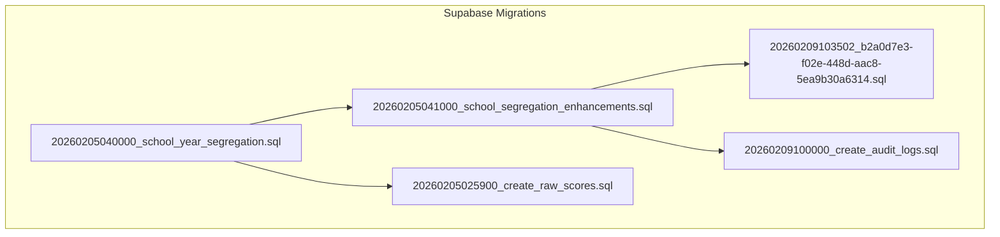
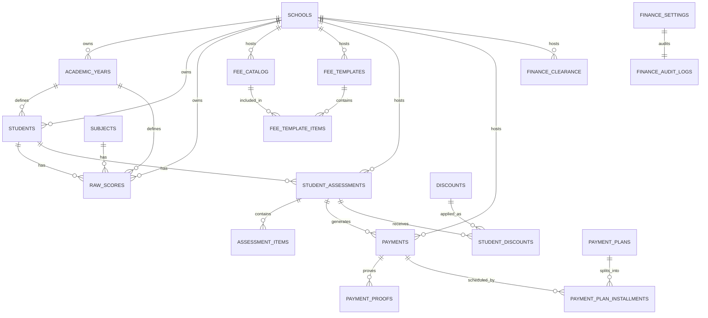
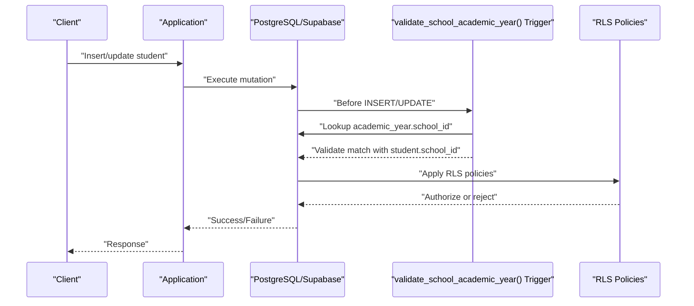
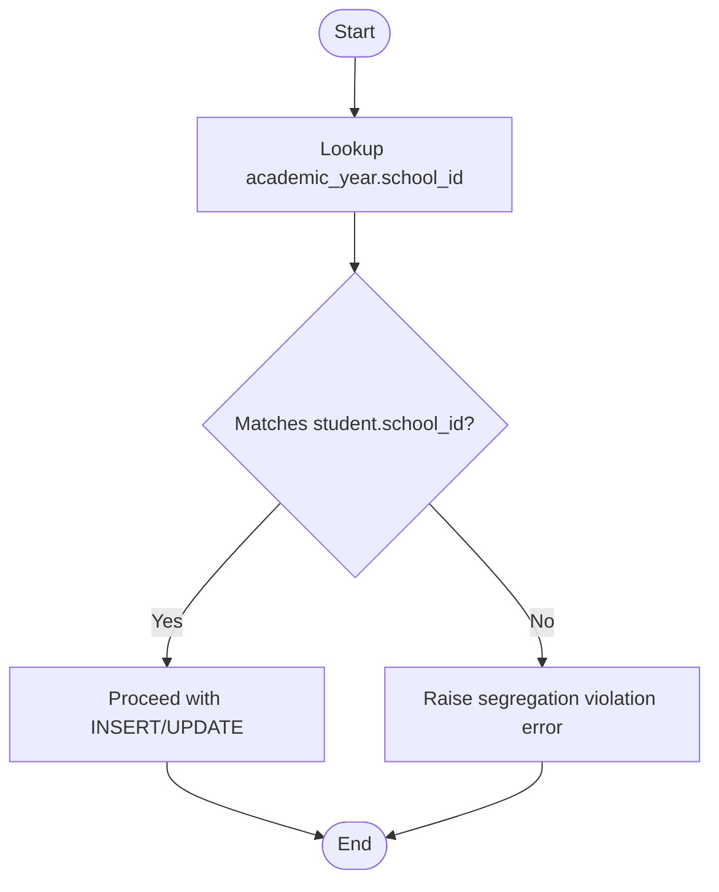
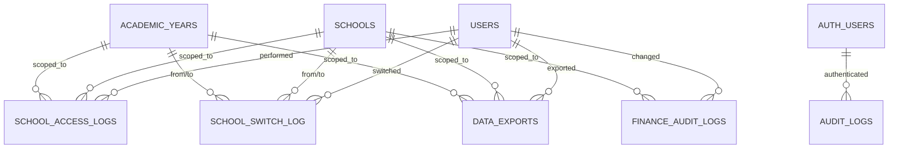
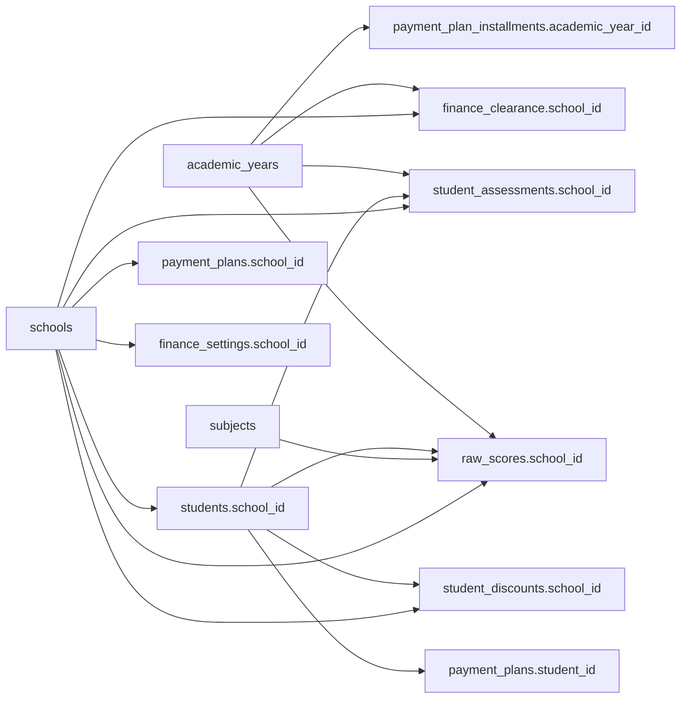

# Entity Relationships & Data Models

<cite>
**Referenced Files in This Document**
- [20260205040000_school_year_segregation.sql](file://supabase/migrations/20260205040000_school_year_segregation.sql)
- [20260205041000_school_segregation_enhancements.sql](file://supabase/migrations/20260205041000_school_segregation_enhancements.sql)
- [20260205025900_create_raw_scores.sql](file://supabase/migrations/20260205025900_create_raw_scores.sql)
- [20260209100000_create_audit_logs.sql](file://supabase/migrations/20260209100000_create_audit_logs.sql)
- [20260209103502_b2a0d7e3-f02e-448d-aac8-5ea9b30a6314.sql](file://supabase/migrations/20260209103502_b2a0d7e3-f02e-448d-aac8-5ea9b30a6314.sql)
- [20260209104034_edce6d0c-f158-4148-a2f9-00e214931442.sql](file://supabase/migrations/20260209104034_edce6d0c-f158-4148-a2f9-00e214931442.sql)
- [20260209112006_bf09bafc-8595-442f-a43c-f7a6676d0a87.sql](file://supabase/migrations/20260209112006_bf09bafc-8595-442f-a43c-f7a6676d0a87.sql)
- [20260209112348_c4eb92c5-113f-46e4-bde9-c54bd572e130.sql](file://supabase/migrations/20260209112348_c4eb92c5-113f-46e4-bde9-c54bd572e130.sql)
- [20260209113737_0d48749d-56a2-4616-960e-a7dad77d15d1.sql](file://supabase/migrations/20260209113737_0d48749d-56a2-4616-960e-a7dad77d15d1.sql)
- [20260209115804_aee2a993-a3c4-43fb-a98e-25e9120c87e7.sql](file://supabase/migrations/20260209115804_aee2a993-a3c4-43fb-a98e-25e9120c87e7.sql)
- [20260205000000_seed_holidays.sql](file://supabase/migrations/20260205000000_seed_holidays.sql)
- [20260205030800_format_student_text.sql](file://supabase/migrations/20260205030800_format_student_text.sql)
- [20260205040000_school_year_segregation.sql](file://supabase/migrations/20260205040000_school_year_segregation.sql)
- [20260205041000_school_segregation_enhancements.sql](file://supabase/migrations/20260205041000_school_segregation_enhancements.sql)
- [20260205173010_ba0bb451-3fca-4e84-a8f7-a007a84f9ca9.sql](file://supabase/migrations/20260205173010_ba0bb451-3fca-4e84-a8f7-a007a84f9ca9.sql)
- [20260205174027_43bcafdf-dce5-4153-b44d-f8ff3d2765db.sql](file://supabase/migrations/20260205174027_43bcafdf-dce5-4153-b44d-f8ff3d2765db.sql)
- [20260205175436_9782a261-cedc-492e-8661-d963b348e86e.sql](file://supabase/migrations/20260205175436_9782a261-cedc-492e-8661-d963b348e86e.sql)
- [20260205181533_07cf1289-2e7e-4e95-9ede-25bc979ea30f.sql](file://supabase/migrations/20260205181533_07cf1289-2e7e-4e95-9ede-25bc979ea30f.sql)
- [20260205185316_5cd4cb19-556f-4d79-80e2-9263104938ee.sql](file://supabase/migrations/20260205185316_5cd4cb19-556f-4d79-80e2-9263104938ee.sql)
- [20260205201205_b21fa2e1-664f-4a7e-a181-62d40fa90375.sql](file://supabase/migrations/20260205201205_b21fa2e1-664f-4a7e-a181-62d40fa90375.sql)
- [20260205202544_ed9e158e-1cb5-4d45-951e-ef0001dc7cef.sql](file://supabase/migrations/20260205202544_ed9e158e-1cb5-4d45-951e-ef0001dc7cef.sql)
- [20260205212242_b50fcbf5-591c-4efc-ab49-74b6f7a76198.sql](file://supabase/migrations/20260205212242_b50fcbf5-591c-4efc-ab49-74b6f7a76198.sql)
- [20260205214423_4a20f538-51fc-44ed-b2f1-8cf885f271b5.sql](file://supabase/migrations/20260205214423_4a20f538-51fc-44ed-b2f1-8cf885f271b5.sql)
- [20260205215204_bbba0ef8-36c1-4416-886a-434d861be595.sql](file://supabase/migrations/20260205215204_bbba0ef8-36c1-4416-886a-434d861be595.sql)
- [20260206041659_64784826-0d18-482a-9d41-efba2bd28b9a.sql](file://supabase/migrations/20260206041659_64784826-0d18-482a-9d41-efba2bd28b9a.sql)
- [20260206051934_ad262152-1ba2-4505-89d4-c36a4c06b657.sql](file://supabase/migrations/20260206051934_ad262152-1ba2-4505-89d4-c36a4c06b657.sql)
- [20260206053130_6766ca8e-537e-4339-983e-b33ecf7d10e8.sql](file://supabase/migrations/20260206053130_6766ca8e-537e-4339-983e-b33ecf7d10e8.sql)
- [20260207094817_56df74ea-893b-45f3-9591-a404d150a7a1.sql](file://supabase/migrations/20260207094817_56df74ea-893b-45f3-9591-a404d150a7a1.sql)
- [20260207101034_166d61a8-c756-447e-ade4-ab98acd604d8.sql](file://supabase/migrations/20260207101034_166d61a8-c756-447e-ade4-ab98acd604d8.sql)
- [20260207103337_bd445395-6bb4-41c4-b86e-5945fe1da529.sql](file://supabase/migrations/20260207103337_bd445395-6bb4-41c4-b86e-5945fe1da529.sql)
- [20260207110627_fce56029-cbd9-4c1d-b3f6-cc6861642277.sql](file://supabase/migrations/20260207110627_fce56029-cbd9-4c1d-b3f6-cc6861642277.sql)
- [20260207111145_98683b84-b3e3-472f-a342-67b741a88079.sql](file://supabase/migrations/20260207111145_98683b84-b3e3-472f-a342-67b741a88079.sql)
- [20260207111904_deca28e2-8e9c-4c57-9bc1-5cd3c2c7c76a.sql](file://supabase/migrations/20260207111904_deca28e2-8e9c-4c57-9bc1-5cd3c2c7c76a.sql)
- [20260207112158_c54ea27a-b501-4938-9dab-004de44879b0.sql](file://supabase/migrations/20260207112158_c54ea27a-b501-4938-9dab-004de44879b0.sql)
- [20260207182053_fa2e94aa-a202-48af-a991-a827efc574f4.sql](file://supabase/migrations/20260207182053_fa2e94aa-a202-48af-a991-a827efc574f4.sql)
- [20260207183455_b755883c-e46b-4140-87ba-2e5b9d9bd24b.sql](file://supabase/migrations/20260207183455_b755883c-e46b-4140-87ba-2e5b9d9bd24b.sql)
- [20260207192456_b8bdd671-a4e2-4621-b61a-09db8e3825a5.sql](file://supabase/migrations/20260207192456_b8bdd671-a4e2-4621-b61a-09db8e3825a5.sql)
- [20260207230259_6e499098-0e40-42e8-9ef1-3617061337e8.sql](file://supabase/migrations/20260207230259_6e499098-0e40-42e8-9ef1-3617061337e8.sql)
- [20260208002917_36c72448-99ea-4166-a6a7-2e2204d9acef.sql](file://supabase/migrations/20260208002917_36c72448-99ea-4166-a6a7-2e2204d9acef.sql)
- [20260208003211_2d6001ae-257e-4060-a3ef-e138bb973134.sql](file://supabase/migrations/20260208003211_2d6001ae-257e-4060-a3ef-e138bb973134.sql)
- [20260208003659_39356598-c156-47f6-aa3d-4a829b37cb35.sql](file://supabase/migrations/20260208003659_39356598-c156-47f6-aa3d-4a829b37cb35.sql)
- [20260208011932_28f8d2f4-1579-4159-8aa6-0c53262d92ea.sql](file://supabase/migrations/20260208011932_28f8d2f4-1579-4159-8aa6-0c53262d92ea.sql)
- [20260208155402_a8267428-9ac0-4d0e-adba-01689297bdd8.sql](file://supabase/migrations/20260208155402_a8267428-9ac0-4d0e-adba-01689297bdd8.sql)
- [20260208200000_book_annotations.sql](file://supabase/migrations/20260208200000_book_annotations.sql)
- [20260209070232_5ad08e01-903e-461c-9a03-279f22782b40.sql](file://supabase/migrations/20260209070232_5ad08e01-903e-461c-9a03-279f22782b40.sql)
- [20260209080000_add_mother_tongue_and_dialects.sql](file://supabase/migrations/20260209080000_add_mother_tongue_and_dialects.sql)
- [20260209103400_54926cd5-53f9-4511-855a-73c5808cff7a.sql](file://supabase/migrations/20260209103400_54926cd5-53f9-4511-855a-73c5808cff7a.sql)
- [20260210094143_11456faa-14f3-4a92-9c4d-e7afcd771d4d.sql](file://supabase/migrations/20260210094143_11456faa-14f3-4a92-9c4d-e7afcd771d4d.sql)
- [20260210120000_grant_stfxsa_finance_access.sql](file://supabase/migrations/20260210120000_grant_stfxsa_finance_access.sql)
- [20260210123441_121e8c0d-adba-494f-8b0d-f1ee080bc335.sql](file://supabase/migrations/20260210123441_121e8c0d-adba-494f-8b0d-f1ee080bc335.sql)
- [20260210124313_ed2e912a-67bd-46ec-b0b1-7b42a5c34033.sql](file://supabase/migrations/20260210124313_ed2e912a-67bd-46ec-b0b1-7b42a5c34033.sql)
- [20260210125323_30db24f6-55d8-46b0-af6e-a834a6bc0351.sql](file://supabase/migrations/20260210125323_30db24f6-55d8-46b0-af6e-a834a6bc0351.sql)
- [20260210130000_create_helpdesk_tables.sql](file://supabase/migrations/20260210130000_create_helpdesk_tables.sql)
- [20260210140000_create_helpdesk_attachments.sql](file://supabase/migrations/20260210140000_create_helpdesk_attachments.sql)
- [20260210150000_fix_helpdesk_access.sql](file://supabase/migrations/20260210150000_fix_helpdesk_access.sql)
- [20260210151404_7ab9ad31-b04d-4e7d-ad8e-8b1a2ae41d9e.sql](file://supabase/migrations/20260210151404_7ab9ad31-b04d-4e7d-ad8e-8b1a2ae41d9e.sql)
- [verify_segregation.sql](file://supabase/migrations/verify_segregation.sql)
</cite>

## Table of Contents
1. [Introduction](#introduction)
2. [Project Structure](#project-structure)
3. [Core Components](#core-components)
4. [Architecture Overview](#architecture-overview)
5. [Detailed Component Analysis](#detailed-component-analysis)
6. [Dependency Analysis](#dependency-analysis)
7. [Performance Considerations](#performance-considerations)
8. [Troubleshooting Guide](#troubleshooting-guide)
9. [Conclusion](#conclusion)
10. [Appendices](#appendices)

## Introduction
This document describes the database schema and entity relationships for the multi-school, multi-academic-year environment. It covers:
- Table structures and field definitions
- Primary and foreign keys
- Data types and constraints
- Multi-school segregation model and academic year tracking
- Audit logging and access monitoring
- Referential integrity and cascading behaviors
- ER diagrams and example query patterns

## Project Structure
The schema is primarily defined in Supabase SQL migration files under supabase/migrations. The most relevant migrations for this document are:
- Multi-school segregation and academic year tracking
- Enhanced RLS, audit logging, and access monitoring
- Finance domain tables and policies
- Audit logging for authentication events
- Supporting helpers and verification scripts



**Diagram sources**
- [20260205040000_school_year_segregation.sql](file://supabase/migrations/20260205040000_school_year_segregation.sql#L1-L264)
- [20260205041000_school_segregation_enhancements.sql](file://supabase/migrations/20260205041000_school_segregation_enhancements.sql#L1-L403)
- [20260209103502_b2a0d7e3-f02e-448d-aac8-5ea9b30a6314.sql](file://supabase/migrations/20260209103502_b2a0d7e3-f02e-448d-aac8-5ea9b30a6314.sql#L1-L350)
- [20260209100000_create_audit_logs.sql](file://supabase/migrations/20260209100000_create_audit_logs.sql#L1-L38)
- [20260205025900_create_raw_scores.sql](file://supabase/migrations/20260205025900_create_raw_scores.sql#L1-L48)

**Section sources**
- [20260205040000_school_year_segregation.sql](file://supabase/migrations/20260205040000_school_year_segregation.sql#L1-L264)
- [20260205041000_school_segregation_enhancements.sql](file://supabase/migrations/20260205041000_school_segregation_enhancements.sql#L1-L403)
- [20260209103502_b2a0d7e3-f02e-448d-aac8-5ea9b30a6314.sql](file://supabase/migrations/20260209103502_b2a0d7e3-f02e-448d-aac8-5ea9b30a6314.sql#L1-L350)
- [20260209100000_create_audit_logs.sql](file://supabase/migrations/20260209100000_create_audit_logs.sql#L1-L38)
- [20260205025900_create_raw_scores.sql](file://supabase/migrations/20260205025900_create_raw_scores.sql#L1-L48)

## Core Components
This section outlines the core entities and their attributes, focusing on multi-school segregation, academic year tracking, and audit/logging.

- Schools
  - Purpose: Hosts participating institutions (e.g., STFXS, STFXSA).
  - Key fields: id (UUID, PK), name, code (unique), address, contact_number, email, principal_name, is_active, timestamps.
  - Security: Row Level Security enabled; policies allow viewing active schools and admin management.

- Academic Years
  - Purpose: Tracks academic year periods per school.
  - Key fields: id (UUID, PK), school_id (FK to schools), name, start_date, end_date, is_current, timestamps.
  - Constraints: school_id added via migration; NOT NULL enforced after population; indexes on school_id.

- Students
  - Purpose: Student records with school and academic year segregation.
  - Key fields: id (UUID, PK), school_id (FK to schools), academic_year_id (FK to academic_years), and other personal fields.
  - Constraints: school_id and academic_year_id added and made NOT NULL; composite index on (school_id, academic_year_id); triggers enforce segregation via validate_school_academic_year.

- Raw Scores
  - Purpose: Stores raw scores per student, subject, academic year, and quarter with computed summary.
  - Key fields: id (UUID, PK), student_id (FK to students), subject_id (FK to subjects), academic_year_id (FK to academic_years), quarter, array fields for written work and performance tasks, qa_score, initial_grade, transmuted_grade, timestamps.
  - Constraints: Unique constraint on (student_id, subject_id, academic_year_id, quarter); indexes on student_id and subject_id; RLS enabled.

- User-School Access
  - Purpose: Links users to schools with roles and activity flags.
  - Key fields: id (UUID, PK), user_id, school_id (FK), role (admin, registrar, teacher, viewer, finance), granted_by, granted_at, is_active; unique(user_id, school_id).
  - Security: RLS enabled; policies for self-view and admin management.

- School Access Logs
  - Purpose: Audit trail for access/modification actions scoped to school and academic year.
  - Key fields: id (UUID, PK), user_id, school_id (FK), academic_year_id (FK), action, table_name, record_id, ip_address, user_agent, success, error_message, created_at.
  - Security: RLS enabled; admin-select and system-insert policies.

- School Switch Log
  - Purpose: Tracks user switching between schools and academic years.
  - Key fields: id (UUID, PK), user_id, from_school_id, to_school_id, from_academic_year_id, to_academic_year_id, session_id, ip_address, switched_at.
  - Security: RLS enabled; user-select and admin-select policies.

- Finance Domain Entities
  - Fee Catalog: Catalog items with amounts, categories, recurrence, and activity.
  - Fee Templates: Per-school and per-academic-year templates linking to catalog items.
  - Student Assessments: Per-student financial assessments with totals, balances, and status.
  - Assessment Items: Line items for assessments.
  - Payments: Payment records with methods, references, receipts, statuses, and voiding metadata.
  - Payment Proofs: Storage references for payment proof documents.
  - Payment Plans: Installment plans with due dates and statuses.
  - Payment Plan Installments: Individual installment records.
  - Discounts: Discount definitions with types, caps, approvals, and validity windows.
  - Student Discounts: Per-student discount applications.
  - Finance Clearance: Clearance status per student per academic year with blocking flags.
  - Clearance Rules: School-level clearance thresholds and rules.
  - Finance Audit Logs: Change audit for finance operations.
  - Finance Settings: School and academic-year settings for receipts, fees, and thresholds.

- Audit Logs (Auth)
  - Purpose: Authentication and login attempt audit trail.
  - Key fields: id (UUID, PK), user_id (FK to auth.users), lrn, action, status, ip_address, country_code, city, user_agent, error_message, school, created_at.
  - Security: RLS enabled; insert allowed for anon/authenticated; select allowed for authenticated.

- Helper Functions and Views
  - user_has_school_access: Checks if a user has access to a given school.
  - get_user_schools: Returns accessible schools and roles for a user.
  - log_school_access: Inserts a school access log entry.
  - school_access_stats: Aggregated access stats view for the last 30 days.

**Section sources**
- [20260205040000_school_year_segregation.sql](file://supabase/migrations/20260205040000_school_year_segregation.sql#L8-L19)
- [20260205040000_school_year_segregation.sql](file://supabase/migrations/20260205040000_school_year_segregation.sql#L42-L70)
- [20260205040000_school_year_segregation.sql](file://supabase/migrations/20260205040000_school_year_segregation.sql#L76-L170)
- [20260205040000_school_year_segregation.sql](file://supabase/migrations/20260205040000_school_year_segregation.sql#L206-L253)
- [20260205041000_school_segregation_enhancements.sql](file://supabase/migrations/20260205041000_school_segregation_enhancements.sql#L8-L17)
- [20260205041000_school_segregation_enhancements.sql](file://supabase/migrations/20260205041000_school_segregation_enhancements.sql#L46-L85)
- [20260205041000_school_segregation_enhancements.sql](file://supabase/migrations/20260205041000_school_segregation_enhancements.sql#L91-L128)
- [20260209103502_b2a0d7e3-f02e-448d-aac8-5ea9b30a6314.sql](file://supabase/migrations/20260209103502_b2a0d7e3-f02e-448d-aac8-5ea9b30a6314.sql#L3-L15)
- [20260209103502_b2a0d7e3-f02e-448d-aac8-5ea9b30a6314.sql](file://supabase/migrations/20260209103502_b2a0d7e3-f02e-448d-aac8-5ea9b30a6314.sql#L61-L108)
- [20260209103502_b2a0d7e3-f02e-448d-aac8-5ea9b30a6314.sql](file://supabase/migrations/20260209103502_b2a0d7e3-f02e-448d-aac8-5ea9b30a6314.sql#L110-L150)
- [20260209103502_b2a0d7e3-f02e-448d-aac8-5ea9b30a6314.sql](file://supabase/migrations/20260209103502_b2a0d7e3-f02e-448d-aac8-5ea9b30a6314.sql#L156-L187)
- [20260209103502_b2a0d7e3-f02e-448d-aac8-5ea9b30a6314.sql](file://supabase/migrations/20260209103502_b2a0d7e3-f02e-448d-aac8-5ea9b30a6314.sql#L196-L232)
- [20260209103502_b2a0d7e3-f02e-448d-aac8-5ea9b30a6314.sql](file://supabase/migrations/20260209103502_b2a0d7e3-f02e-448d-aac8-5ea9b30a6314.sql#L241-L256)
- [20260209103502_b2a0d7e3-f02e-448d-aac8-5ea9b30a6314.sql](file://supabase/migrations/20260209103502_b2a0d7e3-f02e-448d-aac8-5ea9b30a6314.sql#L269-L278)
- [20260209103502_b2a0d7e3-f02e-448d-aac8-5ea9b30a6314.sql](file://supabase/migrations/20260209103502_b2a0d7e3-f02e-448d-aac8-5ea9b30a6314.sql#L285-L304)
- [20260209103502_b2a0d7e3-f02e-448d-aac8-5ea9b30a6314.sql](file://supabase/migrations/20260209103502_b2a0d7e3-f02e-448d-aac8-5ea9b30a6314.sql#L312-L324)
- [20260209100000_create_audit_logs.sql](file://supabase/migrations/20260209100000_create_audit_logs.sql#L2-L15)
- [20260205025900_create_raw_scores.sql](file://supabase/migrations/20260205025900_create_raw_scores.sql#L2-L30)
- [20260205041000_school_segregation_enhancements.sql](file://supabase/migrations/20260205041000_school_segregation_enhancements.sql#L247-L260)
- [20260205041000_school_segregation_enhancements.sql](file://supabase/migrations/20260205041000_school_segregation_enhancements.sql#L263-L284)
- [20260205041000_school_segregation_enhancements.sql](file://supabase/migrations/20260205041000_school_segregation_enhancements.sql#L287-L324)
- [20260205041000_school_segregation_enhancements.sql](file://supabase/migrations/20260205041000_school_segregation_enhancements.sql#L330-L342)

## Architecture Overview
The system enforces multi-school segregation by embedding school_id and academic_year_id into core data tables. RLS policies restrict visibility and modification to authorized users. Audit logging captures access and changes for compliance and monitoring.



**Diagram sources**
- [20260205040000_school_year_segregation.sql](file://supabase/migrations/20260205040000_school_year_segregation.sql#L8-L170)
- [20260205025900_create_raw_scores.sql](file://supabase/migrations/20260205025900_create_raw_scores.sql#L2-L30)
- [20260209103502_b2a0d7e3-f02e-448d-aac8-5ea9b30a6314.sql](file://supabase/migrations/20260209103502_b2a0d7e3-f02e-448d-aac8-5ea9b30a6314.sql#L3-L108)
- [20260209103502_b2a0d7e3-f02e-448d-aac8-5ea9b30a6314.sql](file://supabase/migrations/20260209103502_b2a0d7e3-f02e-448d-aac8-5ea9b30a6314.sql#L110-L187)
- [20260209103502_b2a0d7e3-f02e-448d-aac8-5ea9b30a6314.sql](file://supabase/migrations/20260209103502_b2a0d7e3-f02e-448d-aac8-5ea9b30a6314.sql#L196-L256)
- [20260209103502_b2a0d7e3-f02e-448d-aac8-5ea9b30a6314.sql](file://supabase/migrations/20260209103502_b2a0d7e3-f02e-448d-aac8-5ea9b30a6314.sql#L269-L324)

## Detailed Component Analysis

### Multi-School Segregation Model
- Embedding school_id and academic_year_id into core tables ensures data isolation across schools and academic years.
- Triggers and validation functions enforce referential integrity and segregation rules.
- RLS policies restrict access based on user_school_access and roles.



**Diagram sources**
- [20260205040000_school_year_segregation.sql](file://supabase/migrations/20260205040000_school_year_segregation.sql#L206-L253)
- [20260205041000_school_segregation_enhancements.sql](file://supabase/migrations/20260205041000_school_segregation_enhancements.sql#L143-L187)

**Section sources**
- [20260205040000_school_year_segregation.sql](file://supabase/migrations/20260205040000_school_year_segregation.sql#L76-L170)
- [20260205040000_school_year_segregation.sql](file://supabase/migrations/20260205040000_school_year_segregation.sql#L206-L253)
- [20260205041000_school_segregation_enhancements.sql](file://supabase/migrations/20260205041000_school_segregation_enhancements.sql#L143-L187)

### Academic Year Tracking System
- Academic years are linked to schools and used to anchor student and score records.
- Unique constraints and indexes optimize lookups and prevent duplicates.
- Validation trigger prevents cross-school academic year assignments.



**Diagram sources**
- [20260205040000_school_year_segregation.sql](file://supabase/migrations/20260205040000_school_year_segregation.sql#L206-L225)

**Section sources**
- [20260205040000_school_year_segregation.sql](file://supabase/migrations/20260205040000_school_year_segregation.sql#L42-L70)
- [20260205040000_school_year_segregation.sql](file://supabase/migrations/20260205040000_school_year_segregation.sql#L185-L200)

### Audit Logging Tables
- school_access_logs: Captures actions on school-scoped data with optional record_id linkage.
- school_switch_log: Tracks user transitions between schools and academic years.
- data_exports: Records export events with metadata.
- finance_audit_logs: Change audit for finance operations.
- audit_logs (auth): Authentication and login attempt logs.



**Diagram sources**
- [20260205041000_school_segregation_enhancements.sql](file://supabase/migrations/20260205041000_school_segregation_enhancements.sql#L46-L85)
- [20260205041000_school_segregation_enhancements.sql](file://supabase/migrations/20260205041000_school_segregation_enhancements.sql#L91-L128)
- [20260205041000_school_segregation_enhancements.sql](file://supabase/migrations/20260205041000_school_segregation_enhancements.sql#L351-L369)
- [20260209103502_b2a0d7e3-f02e-448d-aac8-5ea9b30a6314.sql](file://supabase/migrations/20260209103502_b2a0d7e3-f02e-448d-aac8-5ea9b30a6314.sql#L312-L324)
- [20260209100000_create_audit_logs.sql](file://supabase/migrations/20260209100000_create_audit_logs.sql#L2-L15)

**Section sources**
- [20260205041000_school_segregation_enhancements.sql](file://supabase/migrations/20260205041000_school_segregation_enhancements.sql#L46-L128)
- [20260205041000_school_segregation_enhancements.sql](file://supabase/migrations/20260205041000_school_segregation_enhancements.sql#L351-L389)
- [20260209103502_b2a0d7e3-f02e-448d-aac8-5ea9b30a6314.sql](file://supabase/migrations/20260209103502_b2a0d7e3-f02e-448d-aac8-5ea9b30a6314.sql#L312-L324)
- [20260209100000_create_audit_logs.sql](file://supabase/migrations/20260209100000_create_audit_logs.sql#L2-L15)

### Finance Domain Entities
- Comprehensive coverage of fee catalog, templates, assessments, payments, plans, discounts, clearance, rules, settings, and audit logs.
- Strong RLS policies and helper functions support fine-grained access control.

```mermaid
classDiagram
class FeeCatalog {
+id
+school_id
+name
+description
+category
+amount
+is_mandatory
+is_recurring
+is_active
+created_at
+updated_at
}
class FeeTemplates {
+id
+school_id
+academic_year_id
+name
+grade_level
+strand
+is_active
+created_at
+updated_at
}
class FeeTemplateItems {
+id
+template_id
+fee_catalog_id
+amount
+is_mandatory
+created_at
}
class StudentAssessments {
+id
+student_id
+school_id
+academic_year_id
+template_id
+total_amount
+discount_amount
+net_amount
+total_paid
+balance
+status
+assessed_by
+assessed_at
+created_at
+updated_at
}
class AssessmentItems {
+id
+assessment_id
+fee_catalog_id
+name
+amount
+is_mandatory
+created_at
}
class Payments {
+id
+assessment_id
+student_id
+school_id
+academic_year_id
+amount
+payment_method
+reference_number
+or_number
+receipt_type
+payment_date
+received_by
+status
+void_reason
+voided_by
+voided_at
+notes
+created_at
+updated_at
}
class PaymentProofs {
+id
+payment_id
+file_url
+file_name
+uploaded_by
+created_at
}
class PaymentPlans {
+id
+assessment_id
+student_id
+school_id
+plan_type
+total_installments
+grace_period_days
+late_fee_type
+late_fee_amount
+created_by
+created_at
}
class PaymentPlanInstallments {
+id
+plan_id
+installment_number
+amount
+due_date
+paid_amount
+status
+paid_at
+created_at
}
class Discounts {
+id
+school_id
+name
+type
+value
+applies_to
+fee_item_ids
+max_cap
+stackable
+requires_approval
+required_documents
+valid_from
+valid_until
+is_active
+created_at
}
class StudentDiscounts {
+id
+student_id
+discount_id
+assessment_id
+school_id
+status
+approved_by
+approved_at
+applied_amount
+created_at
}
class FinanceClearance {
+id
+student_id
+school_id
+academic_year_id
+is_cleared
+cleared_at
+cleared_by
+balance_threshold
+blocks_exams
+blocks_grades
+blocks_enrollment
+auto_generated
+created_at
+updated_at
}
class ClearanceRules {
+id
+school_id
+rule_name
+rule_type
+threshold
+is_active
+created_at
+updated_at
}
class FinanceSettings {
+id
+school_id
+academic_year_id
+default_payment_terms
+late_fee_enabled
+late_fee_type
+late_fee_amount
+refund_policy
+or_number_format
+or_next_number
+ar_number_format
+ar_next_number
+convenience_fee_mode
+convenience_fee_amount
+clearance_threshold
+auto_clearance
+created_at
+updated_at
}
class FinanceAuditLogs {
+id
+school_id
+user_id
+action
+table_name
+record_id
+old_values
+new_values
+reason
+ip_address
+created_at
}
FeeTemplates --> FeeTemplateItems : "contains"
FeeCatalog --> FeeTemplateItems : "included_in"
StudentAssessments --> AssessmentItems : "contains"
Payments --> PaymentProofs : "proves"
PaymentPlans --> PaymentPlanInstallments : "splits_into"
Discounts --> StudentDiscounts : "applied_as"
StudentAssessments --> Payments : "generates"
StudentAssessments --> StudentDiscounts : "receives"
Students ||--o{ StudentAssessments : "has"
Schools ||--o{ FeeCatalog : "hosts"
Schools ||--o{ FeeTemplates : "hosts"
Schools ||--o{ Payments : "hosts"
Schools ||--o{ FinanceClearance : "hosts"
Schools ||--o{ FinanceSettings : "hosts"
Schools ||--o{ FinanceAuditLogs : "audits"
```

**Diagram sources**
- [20260209103502_b2a0d7e3-f02e-448d-aac8-5ea9b30a6314.sql](file://supabase/migrations/20260209103502_b2a0d7e3-f02e-448d-aac8-5ea9b30a6314.sql#L3-L324)

**Section sources**
- [20260209103502_b2a0d7e3-f02e-448d-aac8-5ea9b30a6314.sql](file://supabase/migrations/20260209103502_b2a0d7e3-f02e-448d-aac8-5ea9b30a6314.sql#L3-L350)

### Example Queries Demonstrating Relationships
Below are example query patterns that demonstrate how relationships and segregation are used in practice. Replace placeholders with actual identifiers and adjust filters as needed.

- List students in a user’s accessible schools for a given academic year
  - Join students with user_school_access on school_id and filter by auth.uid() and is_active=true.
  - Filter by academic_year_id to scope to current or target year.

- Compute quarterly raw scores for a student across subjects and quarters
  - Join raw_scores with subjects and academic_years; filter by student_id and academic_year_id.
  - Aggregate arrays and compute derived fields as needed.

- Retrieve a student’s financial profile (assessments, payments, clearance)
  - Join student_assessments with payments and finance_clearance on student_id and academic_year_id.
  - Optionally join fee_catalog and fee_template_items to reconstruct fee breakdowns.

- Audit access by school and date range
  - Query school_access_logs filtered by school_id and created_at window.
  - Group by action and table_name to produce access summaries.

- Track user school switches
  - Query school_switch_log by user_id and order by switched_at descending.
  - Join with schools and academic_years to enrich display.

[No sources needed since this section provides conceptual examples]

## Dependency Analysis
- Referential Integrity
  - school_id FKs ensure segregation; academic_year_id FKs tie records to academic periods.
  - ON DELETE behaviors:
    - Raw scores: student_id and subject_id cascade deletes; academic_year_id set null on delete.
    - Student assessments and payments: academic_year_id set null on delete.
    - Payment proofs: payment_id cascade delete.
    - Payment plans: assessment_id cascade delete.
    - Student discounts: student_id and discount_id cascade deletes.
    - Finance audit logs: school_id FK; user_id FK.

- Cascading Behaviors
  - Academic year deletion: controlled via ON DELETE SET NULL for academic_year_id in several tables to preserve historical records.
  - Student deletion: raw_scores cascades via student_id to maintain referential integrity.



**Diagram sources**
- [20260205025900_create_raw_scores.sql](file://supabase/migrations/20260205025900_create_raw_scores.sql#L2-L30)
- [20260209103502_b2a0d7e3-f02e-448d-aac8-5ea9b30a6314.sql](file://supabase/migrations/20260209103502_b2a0d7e3-f02e-448d-aac8-5ea9b30a6314.sql#L61-L187)

**Section sources**
- [20260205025900_create_raw_scores.sql](file://supabase/migrations/20260205025900_create_raw_scores.sql#L2-L30)
- [20260209103502_b2a0d7e3-f02e-448d-aac8-5ea9b30a6314.sql](file://supabase/migrations/20260209103502_b2a0d7e3-f02e-448d-aac8-5ea9b30a6314.sql#L110-L150)

## Performance Considerations
- Indexes
  - Composite indexes on (school_id, academic_year_id) for students and raw_scores.
  - Single-column indexes on school_id for student_subjects and user_school_access.
  - Dedicated indexes on user_id and created_at for audit and access logs.
- Partitioning
  - Optional monthly partitioning for school_access_logs to improve long-term performance.
- RLS Overhead
  - Policies add evaluation overhead; keep conditions selective and leverage indexes.
- Triggers
  - validate_school_academic_year runs on INSERT/UPDATE; minimize heavy computation inside triggers.

[No sources needed since this section provides general guidance]

## Troubleshooting Guide
- Segregation Violation Errors
  - Symptom: Validation trigger raises an error indicating mismatch between academic_year.school_id and record’s school_id.
  - Resolution: Ensure academic_year_id belongs to the same school as school_id; re-run with correct academic year.

- Access Denied Due to RLS
  - Symptom: SELECT/INSERT/UPDATE blocked despite valid credentials.
  - Resolution: Verify user_school_access entries for the user and school; confirm role and is_active flags; check helper functions and policies.

- Audit Log Not Recorded
  - Symptom: Expected access or change not visible in logs.
  - Resolution: Confirm log insertion functions are invoked; verify RLS policies allow inserts; check retention and partitioning strategy.

- Finance Operations Blocked
  - Symptom: Finance-related mutations denied.
  - Resolution: Confirm app_role includes finance; verify user_school_access grants access to the relevant school; review RLS policies on finance tables.

**Section sources**
- [20260205040000_school_year_segregation.sql](file://supabase/migrations/20260205040000_school_year_segregation.sql#L222-L225)
- [20260205041000_school_segregation_enhancements.sql](file://supabase/migrations/20260205041000_school_segregation_enhancements.sql#L143-L187)
- [20260209103502_b2a0d7e3-f02e-448d-aac8-5ea9b30a6314.sql](file://supabase/migrations/20260209103502_b2a0d7e3-f02e-448d-aac8-5ea9b30a6314.sql#L19-L22)

## Conclusion
The schema enforces robust multi-school and academic-year segregation through embedded keys, validation triggers, and RLS policies. Audit logging and access monitoring provide transparency and compliance. Finance entities are comprehensively modeled with strong referential integrity and role-based access controls. Proper indexing and policy design ensure performance and security at scale.

[No sources needed since this section summarizes without analyzing specific files]

## Appendices

### Appendix A: Roles and Access Control Summary
- Roles: admin, registrar, teacher, viewer, finance
- Access scope: Controlled via user_school_access and RLS policies
- Finance-specific: Additional policies enable finance users to view student profiles and students’ own assessments/payments

**Section sources**
- [20260205041000_school_segregation_enhancements.sql](file://supabase/migrations/20260205041000_school_segregation_enhancements.sql#L11-L17)
- [20260209104034_edce6d0c-f158-4148-a2f9-00e214931442.sql](file://supabase/migrations/20260209104034_edce6d0c-f158-4148-a2f9-00e214931442.sql#L1-L2)
- [20260209112006_bf09bafc-8595-442f-a43c-f7a6676d0a87.sql](file://supabase/migrations/20260209112006_bf09bafc-8595-442f-a43c-f7a6676d0a87.sql#L1-L8)
- [20260209112348_c4eb92c5-113f-46e4-bde9-c54bd572e130.sql](file://supabase/migrations/20260209112348_c4eb92c5-113f-46e4-bde9-c54bd572e130.sql#L1-L12)

### Appendix B: Verification and Maintenance
- Verification script: validate segregation constraints and data consistency
- Seed data: sample holidays for demonstration and testing

**Section sources**
- [verify_segregation.sql](file://supabase/migrations/verify_segregation.sql)
- [20260205000000_seed_holidays.sql](file://supabase/migrations/20260205000000_seed_holidays.sql#L1-L37)