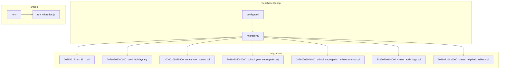
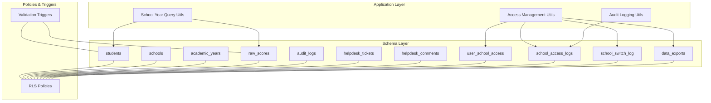
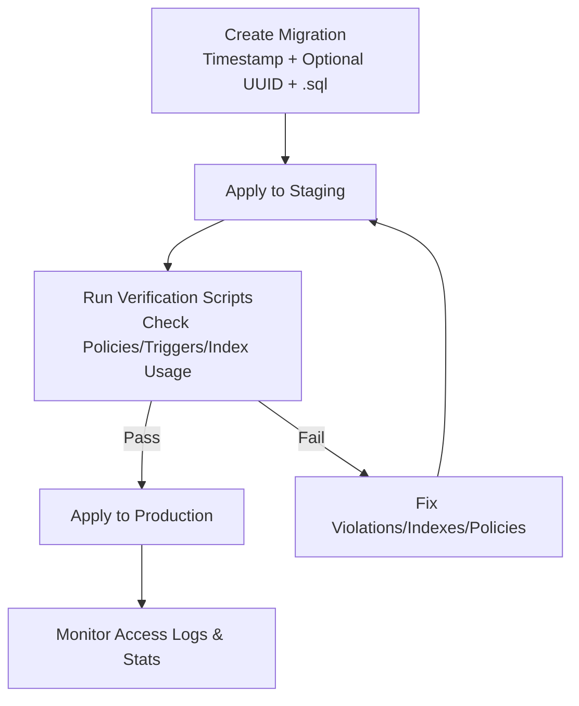
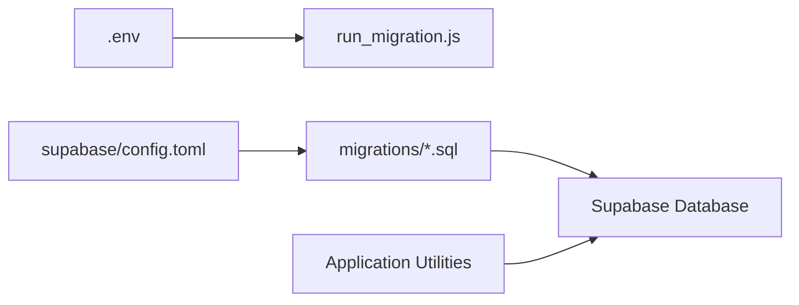

# Migration Management & Schema Evolution

<cite>
**Referenced Files in This Document**
- [20251217184133_59f306e7-bb2b-4574-9bbc-3aa9fbfc4c53.sql](file://supabase/migrations/20251217184133_59f306e7-bb2b-4574-9bbc-3aa9fbfc4c53.sql)
- [20260205000000_seed_holidays.sql](file://supabase/migrations/20260205000000_seed_holidays.sql)
- [20260205025900_create_raw_scores.sql](file://supabase/migrations/20260205025900_create_raw_scores.sql)
- [20260205040000_school_year_segregation.sql](file://supabase/migrations/20260205040000_school_year_segregation.sql)
- [20260205041000_school_segregation_enhancements.sql](file://supabase/migrations/20260205041000_school_segregation_enhancements.sql)
- [20260209100000_create_audit_logs.sql](file://supabase/migrations/20260209100000_create_audit_logs.sql)
- [20260210130000_create_helpdesk_tables.sql](file://supabase/migrations/20260210130000_create_helpdesk_tables.sql)
- [run_migration.js](file://run_migration.js)
- [.env](file://.env)
- [.env.example](file://.env.example)
- [SCHOOL_SEGREGATION.md](file://docs/SCHOOL_SEGREGATION.md)
- [SCHOOL_SEGREGATION_ENHANCEMENTS.md](file://docs/SCHOOL_SEGREGATION_ENHANCEMENTS.md)
- [config.toml](file://supabase/config.toml)
</cite>

## Table of Contents
1. [Introduction](#introduction)
2. [Project Structure](#project-structure)
3. [Core Components](#core-components)
4. [Architecture Overview](#architecture-overview)
5. [Detailed Component Analysis](#detailed-component-analysis)
6. [Dependency Analysis](#dependency-analysis)
7. [Performance Considerations](#performance-considerations)
8. [Troubleshooting Guide](#troubleshooting-guide)
9. [Conclusion](#conclusion)
10. [Appendices](#appendices)

## Introduction
This document explains how the project manages database migrations and evolves schemas safely across environments. It covers migration file structure, naming conventions, execution order, lifecycle from development to production, rollback strategies, conflict resolution, schema evolution patterns, testing, environment configuration, and deployment automation. It also includes examples of complex migrations, data transformations, and troubleshooting techniques grounded in the repository’s migration files and documentation.

## Project Structure
The migration system lives under the Supabase configuration directory and is composed of SQL migration files and supporting documentation. Environment configuration is managed via Vite-style environment variables.

**Diagram sources**
- [config.toml](file://supabase/config.toml#L1-L1)
- [20251217184133_59f306e7-bb2b-4574-9bbc-3aa9fbfc4c53.sql](file://supabase/migrations/20251217184133_59f306e7-bb2b-4574-9bbc-3aa9fbfc4c53.sql#L1-L66)
- [20260205000000_seed_holidays.sql](file://supabase/migrations/20260205000000_seed_holidays.sql#L1-L37)
- [20260205025900_create_raw_scores.sql](file://supabase/migrations/20260205025900_create_raw_scores.sql#L1-L48)
- [20260205040000_school_year_segregation.sql](file://supabase/migrations/20260205040000_school_year_segregation.sql#L1-L264)
- [20260205041000_school_segregation_enhancements.sql](file://supabase/migrations/20260205041000_school_segregation_enhancements.sql#L1-L403)
- [20260209100000_create_audit_logs.sql](file://supabase/migrations/20260209100000_create_audit_logs.sql#L1-L38)
- [20260210130000_create_helpdesk_tables.sql](file://supabase/migrations/20260210130000_create_helpdesk_tables.sql#L1-L132)
- [.env](file://.env#L1-L4)
- [run_migration.js](file://run_migration.js#L1-L24)

**Section sources**
- [config.toml](file://supabase/config.toml#L1-L1)
- [.env](file://.env#L1-L4)
- [run_migration.js](file://run_migration.js#L1-L24)

## Core Components
- Migration files: SQL scripts named with timestamp prefixes and optional UUID suffixes to guarantee deterministic ordering.
- Supabase project configuration: Defines the project identifier used by Supabase tooling.
- Environment configuration: Vite-style variables for Supabase URL, project ID, and publishable key.
- Documentation: Guides for segregation, enhancements, and verification.

Key observations:
- Naming convention: Timestamp prefix followed by optional UUID suffix and .sql extension.
- Execution order: Deterministic ascending order by filename.
- RLS and triggers: Enforced at the database level for data segregation and integrity.
- Audit and monitoring: Tables and views for access logging and statistics.

**Section sources**
- [20251217184133_59f306e7-bb2b-4574-9bbc-3aa9fbfc4c53.sql](file://supabase/migrations/20251217184133_59f306e7-bb2b-4574-9bbc-3aa9fbfc4c53.sql#L1-L66)
- [20260205040000_school_year_segregation.sql](file://supabase/migrations/20260205040000_school_year_segregation.sql#L1-L264)
- [20260205041000_school_segregation_enhancements.sql](file://supabase/migrations/20260205041000_school_segregation_enhancements.sql#L1-L403)
- [20260209100000_create_audit_logs.sql](file://supabase/migrations/20260209100000_create_audit_logs.sql#L1-L38)
- [config.toml](file://supabase/config.toml#L1-L1)
- [.env](file://.env#L1-L4)

## Architecture Overview
The migration architecture enforces schema evolution through ordered SQL scripts, database-level RLS policies, validation triggers, and auxiliary audit/logging tables. The application layer integrates with these constraints via helper utilities and context validation.

**Diagram sources**
- [20260205040000_school_year_segregation.sql](file://supabase/migrations/20260205040000_school_year_segregation.sql#L206-L253)
- [20260205041000_school_segregation_enhancements.sql](file://supabase/migrations/20260205041000_school_segregation_enhancements.sql#L134-L241)
- [20260209100000_create_audit_logs.sql](file://supabase/migrations/20260209100000_create_audit_logs.sql#L1-L38)
- [20260210130000_create_helpdesk_tables.sql](file://supabase/migrations/20260210130000_create_helpdesk_tables.sql#L1-L132)

## Detailed Component Analysis

### Migration File Structure and Naming Conventions
- Structure: Each migration is a single SQL file.
- Naming: Timestamp prefix plus optional UUID suffix plus .sql. Ordering is guaranteed by lexicographic sort of filenames.
- Content: Typically includes DDL statements, RLS enablement, policies, indexes, triggers, and seed data.

Examples:
- Initial table creation with RLS and indexes.
- Seed data for events.
- Creation of specialized tables (e.g., raw scores, helpdesk).
- Data segregation enhancement with RLS, audit tables, and helper functions.

**Section sources**
- [20251217184133_59f306e7-bb2b-4574-9bbc-3aa9fbfc4c53.sql](file://supabase/migrations/20251217184133_59f306e7-bb2b-4574-9bbc-3aa9fbfc4c53.sql#L1-L66)
- [20260205000000_seed_holidays.sql](file://supabase/migrations/20260205000000_seed_holidays.sql#L1-L37)
- [20260205025900_create_raw_scores.sql](file://supabase/migrations/20260205025900_create_raw_scores.sql#L1-L48)
- [20260210130000_create_helpdesk_tables.sql](file://supabase/migrations/20260210130000_create_helpdesk_tables.sql#L1-L132)

### Execution Order and Lifecycle
- Order: Ascending by filename. The presence of timestamp prefixes ensures deterministic sequencing.
- Lifecycle stages:
  - Development: Create incremental migrations locally; keep related changes in separate files.
  - Testing: Apply to staging; run verification scripts and performance checks.
  - Production: Apply with caution; ensure backups and rollback plans.
  - Monitoring: Use audit logs and statistics views to monitor access and performance.

**Diagram sources**
- [SCHOOL_SEGREGATION.md](file://docs/SCHOOL_SEGREGATION.md#L187-L208)
- [20260205040000_school_year_segregation.sql](file://supabase/migrations/20260205040000_school_year_segregation.sql#L1-L264)
- [20260205041000_school_segregation_enhancements.sql](file://supabase/migrations/20260205041000_school_segregation_enhancements.sql#L1-L403)

**Section sources**
- [SCHOOL_SEGREGATION.md](file://docs/SCHOOL_SEGREGATION.md#L187-L208)

### Rollback Procedures and Conflict Resolution
- Rollback strategy:
  - Use reversible migrations where possible (e.g., drop indexes, remove columns, revert policies).
  - Maintain a dedicated rollback plan per migration if destructive changes are involved.
  - Prefer adding columns, indexes, and tables over dropping them; if removal is necessary, stage carefully.
- Conflict resolution:
  - For data segregation violations, ensure academic year belongs to the same school as indicated by the school_id.
  - Use helper functions and triggers to prevent mismatches during inserts/updates.
  - Audit logs capture failed operations for review.

**Section sources**
- [20260205040000_school_year_segregation.sql](file://supabase/migrations/20260205040000_school_year_segregation.sql#L206-L253)
- [20260205041000_school_segregation_enhancements.sql](file://supabase/migrations/20260205041000_school_segregation_enhancements.sql#L438-L446)

### Schema Evolution Patterns
Common patterns observed across migrations:

- Table additions:
  - Create core tables with UUID primary keys and standardized timestamps.
  - Enable RLS and define policies early.
  - Add indexes for performance-sensitive columns.

- Modifications:
  - Add foreign keys to enforce referential integrity.
  - Add NOT NULL constraints after data population.
  - Add indexes concurrently with column additions.

- Deletions:
  - Prefer soft-deletion patterns or careful staged removals with backups.

- Data seeding:
  - Insert predefined reference data (e.g., school events) with appropriate school context.

- Complex transformations:
  - Add segregation columns (school_id, academic_year_id) to existing tables.
  - Populate defaults for historical data.
  - Enforce constraints with triggers and validation functions.

**Section sources**
- [20251217184133_59f306e7-bb2b-4574-9bbc-3aa9fbfc4c53.sql](file://supabase/migrations/20251217184133_59f306e7-bb2b-4574-9bbc-3aa9fbfc4c53.sql#L1-L66)
- [20260205025900_create_raw_scores.sql](file://supabase/migrations/20260205025900_create_raw_scores.sql#L1-L48)
- [20260205040000_school_year_segregation.sql](file://supabase/migrations/20260205040000_school_year_segregation.sql#L76-L170)
- [20260205041000_school_segregation_enhancements.sql](file://supabase/migrations/20260205041000_school_segregation_enhancements.sql#L8-L128)
- [20260205000000_seed_holidays.sql](file://supabase/migrations/20260205000000_seed_holidays.sql#L1-L37)

### Migration Testing Strategies
- Verification scripts: Use provided verification scripts to confirm segregation correctness and index usage.
- Manual testing checklist: School switching, academic year switching, insert validation, and performance checks.
- Automated checks: Integrate EXPLAIN ANALYZE to ensure composite indexes are used.

**Section sources**
- [SCHOOL_SEGREGATION.md](file://docs/SCHOOL_SEGREGATION.md#L123-L162)

### Environment-Specific Configurations
- Supabase environment variables:
  - Project ID, URL, and publishable key configured via Vite-style variables.
- Runtime migration execution:
  - A JavaScript runner demonstrates how to connect to Supabase and outlines limitations with anonymous keys for schema changes.

**Section sources**
- [.env](file://.env#L1-L4)
- [.env.example](file://.env.example#L1-L9)
- [run_migration.js](file://run_migration.js#L1-L24)

### Deployment Automation
- Supabase project configuration defines the project identifier used by Supabase tooling.
- Recommended approach:
  - Keep migrations ordered and self-contained.
  - Apply to staging first, then production with backups and rollback plans.
  - Use CI/CD to automate application of migrations against staging and production databases.

**Section sources**
- [config.toml](file://supabase/config.toml#L1-L1)

### Examples of Complex Migrations and Data Transformation
- Data segregation migration:
  - Adds school_id and academic_year_id to existing tables.
  - Populates defaults for historical records.
  - Enforces constraints with triggers and validation functions.
  - Creates composite indexes and updates policies.

- Enhancements migration:
  - Adds user-school access management.
  - Adds audit logging, school-switching history, and data export tracking.
  - Updates RLS policies to enforce access by school and role.
  - Provides helper functions for access checks and logging.

- Helpdesk tables:
  - Creates tickets and comments tables with RLS and triggers for updated_at.

**Section sources**
- [20260205040000_school_year_segregation.sql](file://supabase/migrations/20260205040000_school_year_segregation.sql#L1-L264)
- [20260205041000_school_segregation_enhancements.sql](file://supabase/migrations/20260205041000_school_segregation_enhancements.sql#L1-L403)
- [20260210130000_create_helpdesk_tables.sql](file://supabase/migrations/20260210130000_create_helpdesk_tables.sql#L1-L132)

### Migration Troubleshooting Techniques
- Data segregation violations:
  - Ensure academic year belongs to the same school as indicated by school_id.
  - Review validation triggers and error messages.
- RLS blocking legitimate access:
  - Grant user access to the school with the appropriate role.
- Logs not appearing:
  - Verify RLS policies allow log insertion.
- Performance issues:
  - Confirm composite indexes exist and are used by running EXPLAIN ANALYZE.

**Section sources**
- [20260205040000_school_year_segregation.sql](file://supabase/migrations/20260205040000_school_year_segregation.sql#L206-L253)
- [20260205041000_school_segregation_enhancements.sql](file://supabase/migrations/20260205041000_school_segregation_enhancements.sql#L438-L455)
- [SCHOOL_SEGREGATION.md](file://docs/SCHOOL_SEGREGATION.md#L225-L238)

## Dependency Analysis
The migration system depends on:
- Supabase project configuration for project identification.
- Environment variables for connection details.
- Ordered migration files for deterministic schema evolution.
- Application utilities that rely on RLS, triggers, and helper functions.

**Diagram sources**
- [.env](file://.env#L1-L4)
- [config.toml](file://supabase/config.toml#L1-L1)
- [run_migration.js](file://run_migration.js#L1-L24)

**Section sources**
- [.env](file://.env#L1-L4)
- [config.toml](file://supabase/config.toml#L1-L1)
- [run_migration.js](file://run_migration.js#L1-L24)

## Performance Considerations
- Composite indexes: Used to optimize queries filtering by both school_id and academic_year_id.
- Triggers: Ensure data integrity and updated_at timestamps.
- RLS policies: Provide database-level filtering to avoid cross-school data leakage.
- Audit logging: Enables monitoring and performance insights via access logs and statistics views.

**Section sources**
- [20260205040000_school_year_segregation.sql](file://supabase/migrations/20260205040000_school_year_segregation.sql#L185-L200)
- [20260205041000_school_segregation_enhancements.sql](file://supabase/migrations/20260205041000_school_segregation_enhancements.sql#L330-L342)
- [20260209100000_create_audit_logs.sql](file://supabase/migrations/20260209100000_create_audit_logs.sql#L1-L38)

## Troubleshooting Guide
- School context required but not set:
  - Cause: Attempting database operation without school context.
  - Solution: Ensure school context is initialized and selected.
- Data segregation violation:
  - Cause: Attempting to insert/update with mismatched school-academic year.
  - Solution: Verify academic year belongs to the correct school.
- Performance issues:
  - Cause: Queries not using composite indexes.
  - Solution: Run EXPLAIN ANALYZE and verify index usage.

**Section sources**
- [SCHOOL_SEGREGATION.md](file://docs/SCHOOL_SEGREGATION.md#L225-L238)

## Conclusion
The project’s migration system follows a disciplined approach to schema evolution: ordered, deterministic migrations with strong database-level safeguards (RLS, triggers, validation functions), comprehensive auditing, and clear documentation. By adhering to the naming conventions, applying migrations in order, verifying segregation and performance, and using the provided utilities, teams can safely evolve the schema from development to production while maintaining data integrity and security.

## Appendices

### Appendix A: Migration Execution Sequence
- Base tables and RLS
- Seed data
- Specialized tables (e.g., raw scores, helpdesk)
- Data segregation enhancement
- Audit and monitoring tables
- Environment configuration and runtime execution

**Section sources**
- [20251217184133_59f306e7-bb2b-4574-9bbc-3aa9fbfc4c53.sql](file://supabase/migrations/20251217184133_59f306e7-bb2b-4574-9bbc-3aa9fbfc4c53.sql#L1-L66)
- [20260205000000_seed_holidays.sql](file://supabase/migrations/20260205000000_seed_holidays.sql#L1-L37)
- [20260205025900_create_raw_scores.sql](file://supabase/migrations/20260205025900_create_raw_scores.sql#L1-L48)
- [20260210130000_create_helpdesk_tables.sql](file://supabase/migrations/20260210130000_create_helpdesk_tables.sql#L1-L132)
- [20260205040000_school_year_segregation.sql](file://supabase/migrations/20260205040000_school_year_segregation.sql#L1-L264)
- [20260205041000_school_segregation_enhancements.sql](file://supabase/migrations/20260205041000_school_segregation_enhancements.sql#L1-L403)
- [20260209100000_create_audit_logs.sql](file://supabase/migrations/20260209100000_create_audit_logs.sql#L1-L38)