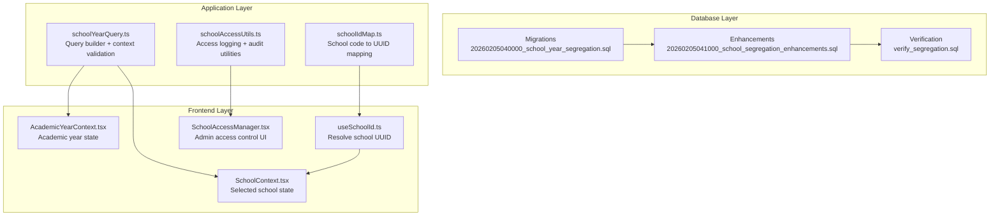
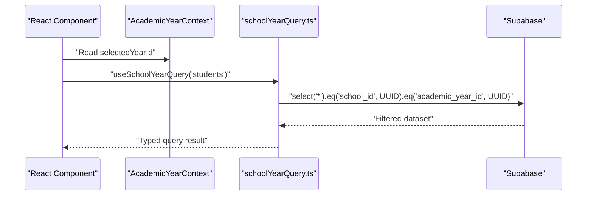
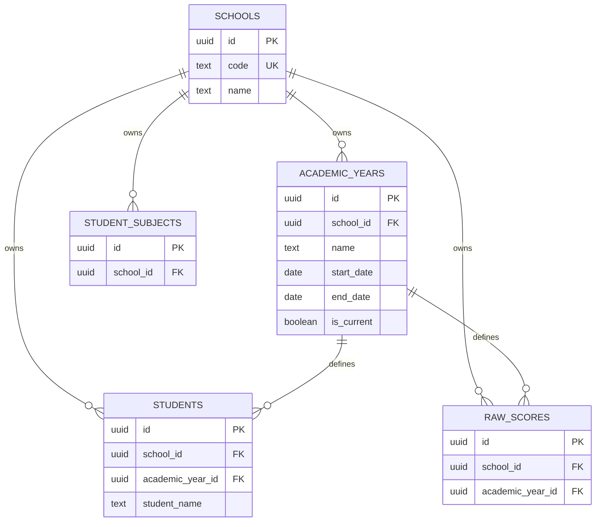
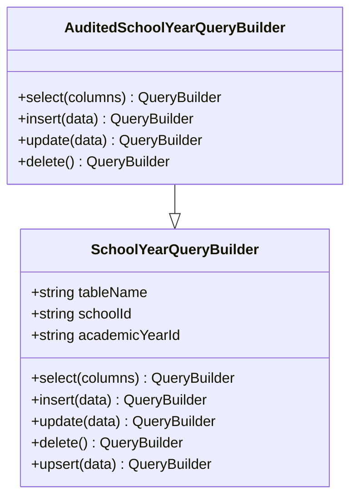
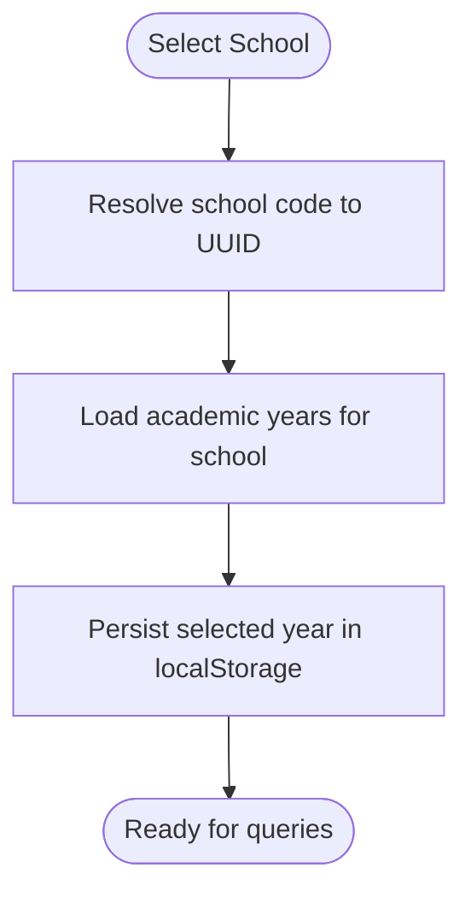
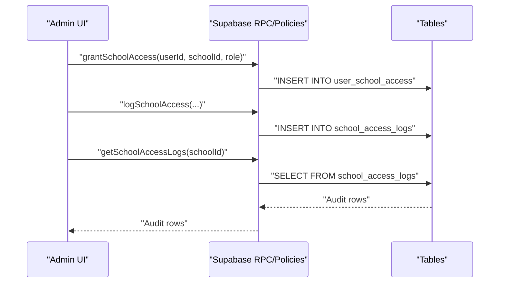
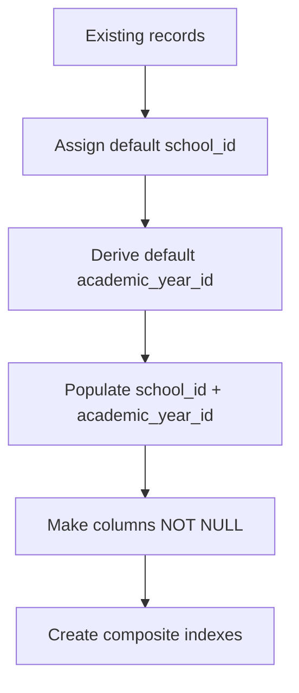
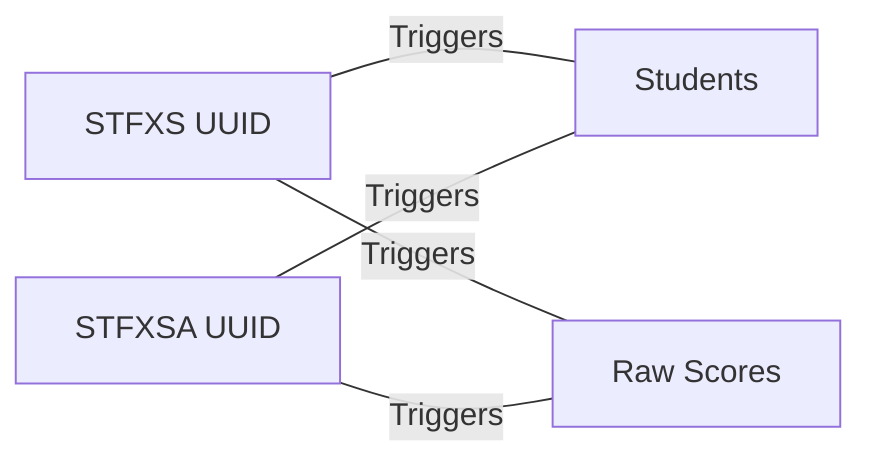
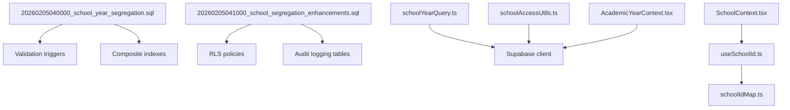

# Multi-School Data Segregation

<cite>
**Referenced Files in This Document**
- [SCHOOL_SEGREGATION.md](file://docs/SCHOOL_SEGREGATION.md)
- [SCHOOL_SEGREGATION_ENHANCEMENTS.md](file://docs/SCHOOL_SEGREGATION_ENHANCEMENTS.md)
- [schoolYearQuery.ts](file://src/utils/schoolYearQuery.ts)
- [schoolAccessUtils.ts](file://src/utils/schoolAccessUtils.ts)
- [AcademicYearContext.tsx](file://src/contexts/AcademicYearContext.tsx)
- [SchoolContext.tsx](file://src/contexts/SchoolContext.tsx)
- [useSchoolId.ts](file://src/hooks/useSchoolId.ts)
- [20260205040000_school_year_segregation.sql](file://supabase/migrations/20260205040000_school_year_segregation.sql)
- [20260205041000_school_segregation_enhancements.sql](file://supabase/migrations/20260205041000_school_segregation_enhancements.sql)
- [verify_segregation.sql](file://supabase/migrations/verify_segregation.sql)
- [20260210151404_7ab9ad31-b04d-4e7d-ad8e-8b1a2ae41d9e.sql](file://supabase/migrations/20260210151404_7ab9ad31-b04d-4e7d-ad8e-8b1a2ae41d9e.sql)
- [20260210120000_grant_stfxsa_finance_access.sql](file://supabase/migrations/20260210120000_grant_stfxsa_finance_access.sql)
- [SchoolAccessManager.tsx](file://src/components/admin/SchoolAccessManager.tsx)
- [AdminPanel.tsx](file://src/components/admin/AdminPanel.tsx)
- [schoolIdMap.ts](file://src/utils/schoolIdMap.ts)
</cite>

## Table of Contents
1. [Introduction](#introduction)
2. [Project Structure](#project-structure)
3. [Core Components](#core-components)
4. [Architecture Overview](#architecture-overview)
5. [Detailed Component Analysis](#detailed-component-analysis)
6. [Dependency Analysis](#dependency-analysis)
7. [Performance Considerations](#performance-considerations)
8. [Troubleshooting Guide](#troubleshooting-guide)
9. [Conclusion](#conclusion)
10. [Appendices](#appendices)

## Introduction
This document explains the multi-school data segregation system that enforces strict cross-institutional isolation for STFXS and STFXSA while preserving seamless academic year filtering. It covers the database-level constraints, application-level enforcement, school context management, security policies, and operational procedures for adding new schools, testing segregation, and troubleshooting issues.

## Project Structure
The segregation system spans three layers:
- Database migrations define schema, constraints, and policies
- Application utilities enforce context and query filtering
- Frontend contexts and components manage school/year selection and access control

**Diagram sources**
- [20260205040000_school_year_segregation.sql](file://supabase/migrations/20260205040000_school_year_segregation.sql#L1-L264)
- [20260205041000_school_segregation_enhancements.sql](file://supabase/migrations/20260205041000_school_segregation_enhancements.sql#L1-L403)
- [verify_segregation.sql](file://supabase/migrations/verify_segregation.sql#L1-L159)
- [schoolYearQuery.ts](file://src/utils/schoolYearQuery.ts#L1-L219)
- [schoolAccessUtils.ts](file://src/utils/schoolAccessUtils.ts#L1-L468)
- [schoolIdMap.ts](file://src/utils/schoolIdMap.ts#L1-L13)
- [SchoolContext.tsx](file://src/contexts/SchoolContext.tsx#L1-L79)
- [AcademicYearContext.tsx](file://src/contexts/AcademicYearContext.tsx#L1-L116)
- [useSchoolId.ts](file://src/hooks/useSchoolId.ts#L1-L45)
- [SchoolAccessManager.tsx](file://src/components/admin/SchoolAccessManager.tsx#L1-L349)

**Section sources**
- [SCHOOL_SEGREGATION.md](file://docs/SCHOOL_SEGREGATION.md#L1-L260)
- [SCHOOL_SEGREGATION_ENHANCEMENTS.md](file://docs/SCHOOL_SEGREGATION_ENHANCEMENTS.md#L1-L471)

## Core Components
- Database segregation via composite indexes and validation triggers
- Application-level query builder that injects school and academic-year filters
- Context providers for school and academic year selection
- Access control utilities for user-school association and audit logging
- Administrative UI for managing access and viewing logs

**Section sources**
- [schoolYearQuery.ts](file://src/utils/schoolYearQuery.ts#L1-L219)
- [AcademicYearContext.tsx](file://src/contexts/AcademicYearContext.tsx#L1-L116)
- [SchoolContext.tsx](file://src/contexts/SchoolContext.tsx#L1-L79)
- [schoolAccessUtils.ts](file://src/utils/schoolAccessUtils.ts#L1-L468)

## Architecture Overview
The system enforces segregation at two levels:
- Database level: schema changes, foreign keys, composite indexes, and validation triggers
- Application level: query builders, context validation, and RLS policies

**Diagram sources**
- [AcademicYearContext.tsx](file://src/contexts/AcademicYearContext.tsx#L88-L93)
- [schoolYearQuery.ts](file://src/utils/schoolYearQuery.ts#L155-L171)

## Detailed Component Analysis

### Database-Level Segregation
- Schema additions: school_id and academic_year_id columns on key tables
- Composite indexes for efficient filtering
- Validation triggers to prevent cross-school/year mismatches
- RLS policies to restrict access based on user-school associations

**Diagram sources**
- [20260205040000_school_year_segregation.sql](file://supabase/migrations/20260205040000_school_year_segregation.sql#L76-L170)
- [20260205041000_school_segregation_enhancements.sql](file://supabase/migrations/20260205041000_school_segregation_enhancements.sql#L136-L241)

**Section sources**
- [20260205040000_school_year_segregation.sql](file://supabase/migrations/20260205040000_school_year_segregation.sql#L182-L254)
- [20260205041000_school_segregation_enhancements.sql](file://supabase/migrations/20260205041000_school_segregation_enhancements.sql#L131-L241)
- [verify_segregation.sql](file://supabase/migrations/verify_segregation.sql#L11-L150)

### Application-Level Enforcement
- Query builder injects school_id and academic_year_id into all operations
- Context validation throws explicit errors when context is missing
- Helper utilities support typed filters and ownership verification

**Diagram sources**
- [schoolYearQuery.ts](file://src/utils/schoolYearQuery.ts#L62-L148)
- [schoolAccessUtils.ts](file://src/utils/schoolAccessUtils.ts#L376-L467)

**Section sources**
- [schoolYearQuery.ts](file://src/utils/schoolYearQuery.ts#L12-L35)
- [schoolYearQuery.ts](file://src/utils/schoolYearQuery.ts#L62-L148)
- [schoolAccessUtils.ts](file://src/utils/schoolAccessUtils.ts#L376-L467)

### School Context Management
- SchoolContext maintains the selected school and theme
- AcademicYearContext resolves academic years per school and persists selection
- useSchoolId resolves the database UUID for the selected school code

**Diagram sources**
- [SchoolContext.tsx](file://src/contexts/SchoolContext.tsx#L51-L70)
- [AcademicYearContext.tsx](file://src/contexts/AcademicYearContext.tsx#L25-L106)
- [useSchoolId.ts](file://src/hooks/useSchoolId.ts#L8-L44)

**Section sources**
- [SchoolContext.tsx](file://src/contexts/SchoolContext.tsx#L1-L79)
- [AcademicYearContext.tsx](file://src/contexts/AcademicYearContext.tsx#L1-L116)
- [useSchoolId.ts](file://src/hooks/useSchoolId.ts#L1-L45)
- [schoolIdMap.ts](file://src/utils/schoolIdMap.ts#L1-L13)

### Security Policies and Access Control
- RLS policies restrict data visibility to authorized users
- Helper functions and views support access checks and audit reporting
- Administrative UI manages grants and displays logs

**Diagram sources**
- [schoolAccessUtils.ts](file://src/utils/schoolAccessUtils.ts#L112-L154)
- [schoolAccessUtils.ts](file://src/utils/schoolAccessUtils.ts#L163-L192)
- [schoolAccessUtils.ts](file://src/utils/schoolAccessUtils.ts#L197-L214)
- [20260205041000_school_segregation_enhancements.sql](file://supabase/migrations/20260205041000_school_segregation_enhancements.sql#L246-L284)

**Section sources**
- [20260205041000_school_segregation_enhancements.sql](file://supabase/migrations/20260205041000_school_segregation_enhancements.sql#L131-L241)
- [schoolAccessUtils.ts](file://src/utils/schoolAccessUtils.ts#L75-L107)
- [SchoolAccessManager.tsx](file://src/components/admin/SchoolAccessManager.tsx#L61-L101)

### Academic Year Segregation Implementation
- Academic year records are associated with a school via school_id
- Queries are filtered by both school_id and academic_year_id
- Migration populates historical records with default school/year

**Diagram sources**
- [20260205040000_school_year_segregation.sql](file://supabase/migrations/20260205040000_school_year_segregation.sql#L62-L155)
- [20260205040000_school_year_segregation.sql](file://supabase/migrations/20260205040000_school_year_segregation.sql#L182-L201)

**Section sources**
- [AcademicYearContext.tsx](file://src/contexts/AcademicYearContext.tsx#L25-L106)
- [20260205040000_school_year_segregation.sql](file://supabase/migrations/20260205040000_school_year_segregation.sql#L62-L155)

### STFXS vs STFXSA Data Separation
- Two distinct schools are represented by separate UUIDs
- Validation triggers ensure academic year belongs to the same school as the record
- Migrations normalize legacy codes and update references

**Diagram sources**
- [20260205040000_school_year_segregation.sql](file://supabase/migrations/20260205040000_school_year_segregation.sql#L53-L57)
- [20260205040000_school_year_segregation.sql](file://supabase/migrations/20260205040000_school_year_segregation.sql#L232-L253)
- [20260210151404_7ab9ad31-b04d-4e7d-ad8e-8b1a2ae41d9e.sql](file://supabase/migrations/20260210151404_7ab9ad31-b04d-4e7d-ad8e-8b1a2ae41d9e.sql#L3-L10)

**Section sources**
- [20260205040000_school_year_segregation.sql](file://supabase/migrations/20260205040000_school_year_segregation.sql#L53-L57)
- [20260210151404_7ab9ad31-b04d-4e7d-ad8e-8b1a2ae41d9e.sql](file://supabase/migrations/20260210151404_7ab9ad31-b04d-4e7d-ad8e-8b1a2ae41d9e.sql#L3-L10)

### Data Access Patterns and Query Filtering Strategies
- All reads/writes automatically include both school_id and academic_year_id
- Typed helpers ensure compile-time safety and reduce mistakes
- Ownership verification supports explicit checks for sensitive operations

**Section sources**
- [schoolYearQuery.ts](file://src/utils/schoolYearQuery.ts#L77-L126)
- [schoolYearQuery.ts](file://src/utils/schoolYearQuery.ts#L188-L203)

### Administrative Controls
- Admin panel provides access management and audit dashboards
- Grants and revocations are tracked with timestamps and roles
- Logs capture actions, success/failure, and optional error messages

**Section sources**
- [AdminPanel.tsx](file://src/components/admin/AdminPanel.tsx#L1-L229)
- [SchoolAccessManager.tsx](file://src/components/admin/SchoolAccessManager.tsx#L1-L349)
- [schoolAccessUtils.ts](file://src/utils/schoolAccessUtils.ts#L112-L154)
- [20260205041000_school_segregation_enhancements.sql](file://supabase/migrations/20260205041000_school_segregation_enhancements.sql#L246-L324)

## Dependency Analysis
- Database migrations define the canonical constraints and policies
- Application utilities depend on Supabase client and React Query
- Frontend contexts depend on database-resolved identifiers

**Diagram sources**
- [20260205040000_school_year_segregation.sql](file://supabase/migrations/20260205040000_school_year_segregation.sql#L182-L254)
- [20260205041000_school_segregation_enhancements.sql](file://supabase/migrations/20260205041000_school_segregation_enhancements.sql#L131-L324)
- [schoolYearQuery.ts](file://src/utils/schoolYearQuery.ts#L9)
- [schoolAccessUtils.ts](file://src/utils/schoolAccessUtils.ts#L8)
- [AcademicYearContext.tsx](file://src/contexts/AcademicYearContext.tsx#L1-L116)
- [SchoolContext.tsx](file://src/contexts/SchoolContext.tsx#L1-L79)
- [useSchoolId.ts](file://src/hooks/useSchoolId.ts#L1-L45)
- [schoolIdMap.ts](file://src/utils/schoolIdMap.ts#L1-L13)

**Section sources**
- [20260205040000_school_year_segregation.sql](file://supabase/migrations/20260205040000_school_year_segregation.sql#L1-L264)
- [20260205041000_school_segregation_enhancements.sql](file://supabase/migrations/20260205041000_school_segregation_enhancements.sql#L1-L403)
- [schoolYearQuery.ts](file://src/utils/schoolYearQuery.ts#L1-L219)
- [schoolAccessUtils.ts](file://src/utils/schoolAccessUtils.ts#L1-L468)

## Performance Considerations
- Composite indexes on (school_id, academic_year_id) improve query performance
- Triggers ensure data integrity at write time
- RLS policies add minimal overhead and protect against unauthorized access
- Use the verification script to confirm index usage and detect violations

**Section sources**
- [verify_segregation.sql](file://supabase/migrations/verify_segregation.sql#L123-L127)
- [20260205040000_school_year_segregation.sql](file://supabase/migrations/20260205040000_school_year_segregation.sql#L185-L200)

## Troubleshooting Guide
Common issues and resolutions:
- Missing school context: ensure AcademicYearContext is initialized and selected year is persisted
- Data segregation violation: verify academic year belongs to the selected school
- RLS blocking access: grant user access via user_school_access
- Logs not appearing: confirm RLS allows inserts into audit tables
- Performance regressions: run EXPLAIN ANALYZE and verify composite index usage

**Section sources**
- [SCHOOL_SEGREGATION.md](file://docs/SCHOOL_SEGREGATION.md#L225-L260)
- [SCHOOL_SEGREGATION_ENHANCEMENTS.md](file://docs/SCHOOL_SEGREGATION_ENHANCEMENTS.md#L429-L456)
- [AcademicYearContext.tsx](file://src/contexts/AcademicYearContext.tsx#L88-L93)
- [20260205041000_school_segregation_enhancements.sql](file://supabase/migrations/20260205041000_school_segregation_enhancements.sql#L74-L82)

## Conclusion
The multi-school data segregation system combines robust database constraints with application-level safeguards to ensure strict cross-institutional isolation. By enforcing context validation, using typed query builders, and implementing RLS policies, the system minimizes risk of data leakage while maintaining developer productivity and operational transparency.

## Appendices

### Migration Procedures for Adding New Schools
- Apply base segregation migration to add schema and constraints
- Apply enhancements migration to enable RLS and audit tables
- Seed default schools and update legacy references
- Grant access to users via administrative UI
- Verify segregation with the provided verification script

**Section sources**
- [20260205040000_school_year_segregation.sql](file://supabase/migrations/20260205040000_school_year_segregation.sql#L1-L264)
- [20260205041000_school_segregation_enhancements.sql](file://supabase/migrations/20260205041000_school_segregation_enhancements.sql#L1-L403)
- [20260210151404_7ab9ad31-b04d-4e7d-ad8e-8b1a2ae41d9e.sql](file://supabase/migrations/20260210151404_7ab9ad31-b04d-4e7d-ad8e-8b1a2ae41d9e.sql#L3-L10)
- [verify_segregation.sql](file://supabase/migrations/verify_segregation.sql#L1-L159)

### Data Segregation Testing
- Run verification script to check for violations and confirm indexes/triggers
- Perform manual tests: switching schools, switching academic years, insert validation, and performance checks
- Review audit logs for anomalies

**Section sources**
- [verify_segregation.sql](file://supabase/migrations/verify_segregation.sql#L1-L159)
- [SCHOOL_SEGREGATION.md](file://docs/SCHOOL_SEGREGATION.md#L138-L186)

### Secure Data Access Patterns
- Always use the query builder to ensure automatic filtering
- Verify ownership before performing sensitive operations
- Log all access and modifications for auditability
- Restrict direct SQL queries to administrators only

**Section sources**
- [schoolYearQuery.ts](file://src/utils/schoolYearQuery.ts#L77-L126)
- [schoolAccessUtils.ts](file://src/utils/schoolAccessUtils.ts#L387-L425)
- [20260205041000_school_segregation_enhancements.sql](file://supabase/migrations/20260205041000_school_segregation_enhancements.sql#L286-L324)

### Administrative Controls
- Manage user-school access via the admin panel
- Monitor access logs and export statistics
- Enforce role-based permissions with RLS policies

**Section sources**
- [AdminPanel.tsx](file://src/components/admin/AdminPanel.tsx#L1-L229)
- [SchoolAccessManager.tsx](file://src/components/admin/SchoolAccessManager.tsx#L1-L349)
- [20260205041000_school_segregation_enhancements.sql](file://supabase/migrations/20260205041000_school_segregation_enhancements.sql#L131-L241)