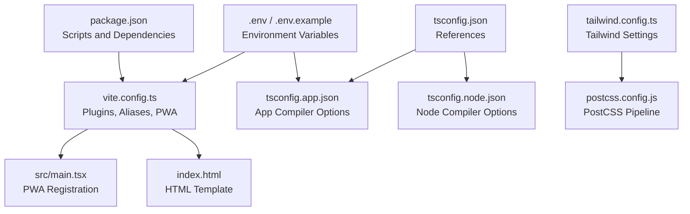
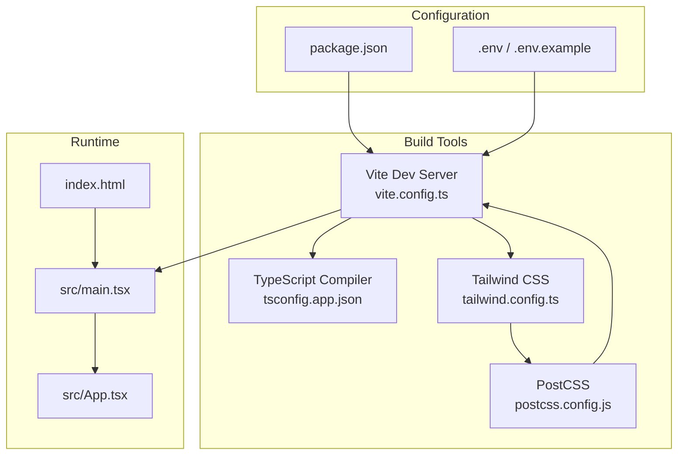
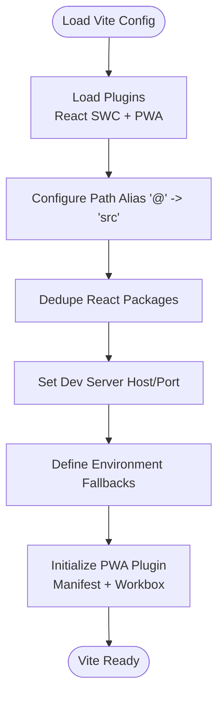
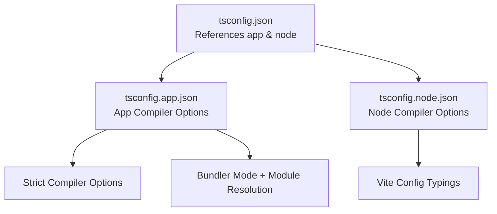
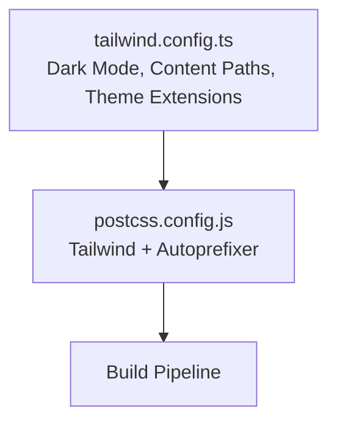
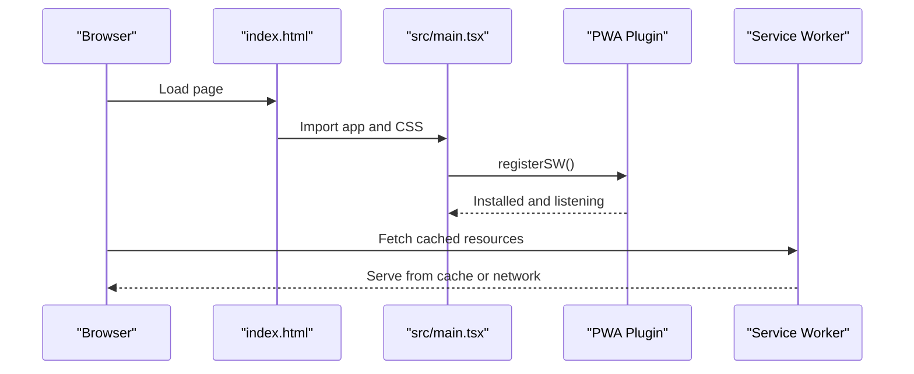
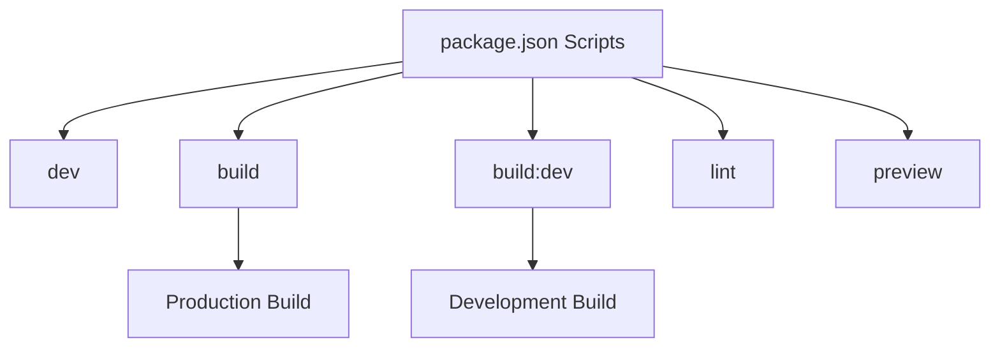
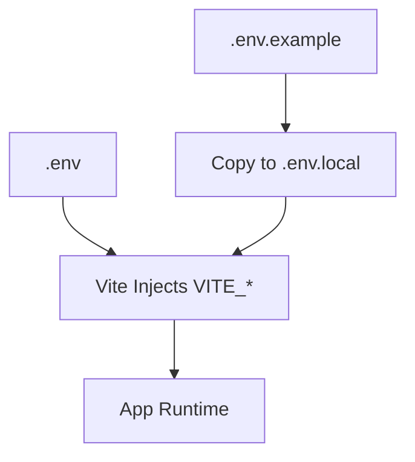
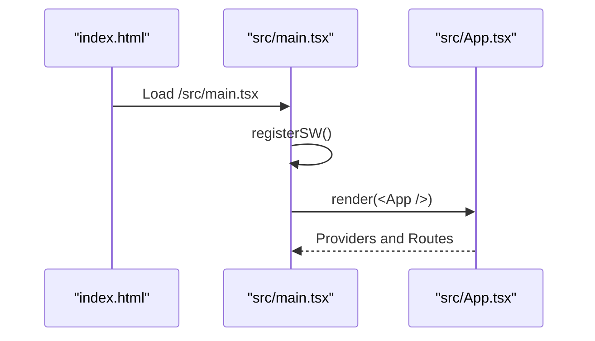
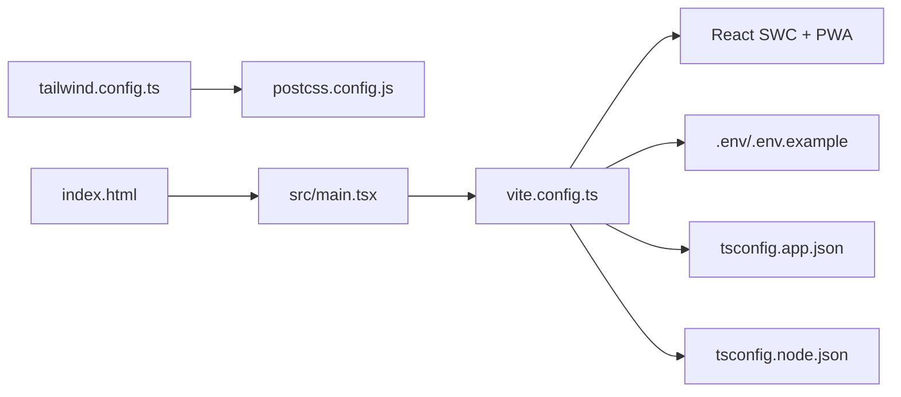

# Build Configuration

<cite>
**Referenced Files in This Document**
- [vite.config.ts](file://vite.config.ts)
- [package.json](file://package.json)
- [tailwind.config.ts](file://tailwind.config.ts)
- [postcss.config.js](file://postcss.config.js)
- [tsconfig.json](file://tsconfig.json)
- [tsconfig.app.json](file://tsconfig.app.json)
- [tsconfig.node.json](file://tsconfig.node.json)
- [.env](file://.env)
- [.env.example](file://.env.example)
- [index.html](file://index.html)
- [src/main.tsx](file://src/main.tsx)
- [src/App.tsx](file://src/App.tsx)
</cite>

## Table of Contents
1. [Introduction](#introduction)
2. [Project Structure](#project-structure)
3. [Core Components](#core-components)
4. [Architecture Overview](#architecture-overview)
5. [Detailed Component Analysis](#detailed-component-analysis)
6. [Dependency Analysis](#dependency-analysis)
7. [Performance Considerations](#performance-considerations)
8. [Troubleshooting Guide](#troubleshooting-guide)
9. [Conclusion](#conclusion)

## Introduction
This document explains the build configuration and compilation processes for the project. It covers the Vite build system setup, TypeScript configuration, and Tailwind CSS integration. It also documents build scripts, environment modes, optimization settings, PWA configuration, asset handling, and bundling strategies. Practical examples of build customization, performance optimization, and troubleshooting common build issues are included to help developers maintain and improve the build pipeline.

## Project Structure
The build system centers around Vite, TypeScript, and Tailwind CSS. Key configuration files and their roles:
- Vite configuration defines plugins, aliases, server settings, and PWA behavior.
- TypeScript configurations split app and node environments for strictness and bundler mode.
- Tailwind CSS configuration controls design tokens, animations, and content scanning.
- PostCSS wiring enables Tailwind and autoprefixing.
- Environment files supply runtime configuration for Supabase integration.
- HTML template and entry point initialize the PWA service worker registration and app bootstrap.

**Diagram sources**
- [package.json](file://package.json#L1-L106)
- [vite.config.ts](file://vite.config.ts#L1-L87)
- [src/main.tsx](file://src/main.tsx#L1-L20)
- [index.html](file://index.html#L1-L30)
- [tsconfig.json](file://tsconfig.json#L1-L17)
- [tsconfig.app.json](file://tsconfig.app.json#L1-L37)
- [tsconfig.node.json](file://tsconfig.node.json#L1-L23)
- [tailwind.config.ts](file://tailwind.config.ts#L1-L125)
- [postcss.config.js](file://postcss.config.js#L1-L7)
- [.env](file://.env#L1-L4)
- [.env.example](file://.env.example#L1-L9)

**Section sources**
- [package.json](file://package.json#L1-L106)
- [vite.config.ts](file://vite.config.ts#L1-L87)
- [tsconfig.json](file://tsconfig.json#L1-L17)
- [tsconfig.app.json](file://tsconfig.app.json#L1-L37)
- [tsconfig.node.json](file://tsconfig.node.json#L1-L23)
- [tailwind.config.ts](file://tailwind.config.ts#L1-L125)
- [postcss.config.js](file://postcss.config.js#L1-L7)
- [.env](file://.env#L1-L4)
- [.env.example](file://.env.example#L1-L9)
- [index.html](file://index.html#L1-L30)
- [src/main.tsx](file://src/main.tsx#L1-L20)

## Core Components
- Vite configuration
  - Plugins: React SWC and PWA plugin with caching strategies and manifest.
  - Aliases: @ resolves to src for clean imports.
  - Server: Host and port settings for local development.
  - Environment fallbacks: Define injection of Supabase defaults when environment variables are missing.
- TypeScript configuration
  - Root references two TS configs: app and node.
  - App config sets ES target, DOM libs, bundler module resolution, JSX transform, and strict compiler options.
  - Node config restricts to bundler mode for Vite config typing.
- Tailwind CSS
  - Dark mode via class strategy.
  - Content scanning across pages, components, app, and src.
  - Extends theme with fonts, semantic color palette, border radius, keyframes, and animations.
  - Uses Tailwind animations plugin.
- PostCSS
  - Enables Tailwind and autoprefixer.
- Environment variables
  - Supabase credentials loaded from .env and exposed via Vite’s VITE_* prefix.
- HTML template and PWA registration
  - HTML includes theme metadata and Apple touch icon references.
  - Service worker registration via virtual module for PWA updates.

**Section sources**
- [vite.config.ts](file://vite.config.ts#L1-L87)
- [tsconfig.app.json](file://tsconfig.app.json#L1-L37)
- [tsconfig.node.json](file://tsconfig.node.json#L1-L23)
- [tailwind.config.ts](file://tailwind.config.ts#L1-L125)
- [postcss.config.js](file://postcss.config.js#L1-L7)
- [.env](file://.env#L1-L4)
- [index.html](file://index.html#L1-L30)
- [src/main.tsx](file://src/main.tsx#L1-L20)

## Architecture Overview
The build pipeline integrates Vite, TypeScript, and Tailwind CSS with PWA support and environment-driven configuration.

**Diagram sources**
- [vite.config.ts](file://vite.config.ts#L1-L87)
- [tsconfig.app.json](file://tsconfig.app.json#L1-L37)
- [tailwind.config.ts](file://tailwind.config.ts#L1-L125)
- [postcss.config.js](file://postcss.config.js#L1-L7)
- [package.json](file://package.json#L1-L106)
- [.env](file://.env#L1-L4)
- [index.html](file://index.html#L1-L30)
- [src/main.tsx](file://src/main.tsx#L1-L20)
- [src/App.tsx](file://src/App.tsx#L1-L86)

## Detailed Component Analysis

### Vite Build System Setup
- Plugins
  - React SWC: Fast React transform and JSX handling.
  - PWA: Auto-update registration, asset inclusion, manifest definition, Workbox configuration, and runtime caching.
- Aliasing and deduplication
  - Alias @ to src for concise imports.
  - Dedupe React packages to avoid multiple instances.
- Server configuration
  - Host and port for development.
- Environment injection
  - Define fallbacks for Supabase environment variables when not present in the environment.

**Diagram sources**
- [vite.config.ts](file://vite.config.ts#L1-L87)

**Section sources**
- [vite.config.ts](file://vite.config.ts#L1-L87)

### TypeScript Configuration
- Root configuration
  - References app and node TS configs.
  - Path mapping for @ resolves to src.
  - Loose compiler checks for development ergonomics.
- App configuration
  - ES2020 target, DOM and DOM.Iterable libs.
  - Bundler module resolution, isolated modules, and module detection.
  - JSX transform and strict compiler options.
- Node configuration
  - Bundler mode for Vite config typing and strictness.

**Diagram sources**
- [tsconfig.json](file://tsconfig.json#L1-L17)
- [tsconfig.app.json](file://tsconfig.app.json#L1-L37)
- [tsconfig.node.json](file://tsconfig.node.json#L1-L23)

**Section sources**
- [tsconfig.json](file://tsconfig.json#L1-L17)
- [tsconfig.app.json](file://tsconfig.app.json#L1-L37)
- [tsconfig.node.json](file://tsconfig.node.json#L1-L23)

### Tailwind CSS Integration
- Dark mode strategy via class.
- Content scanning across pages, components, app, and src.
- Theme extensions for fonts, semantic colors, border radius, keyframes, and animations.
- Animations plugin enabled.

**Diagram sources**
- [tailwind.config.ts](file://tailwind.config.ts#L1-L125)
- [postcss.config.js](file://postcss.config.js#L1-L7)

**Section sources**
- [tailwind.config.ts](file://tailwind.config.ts#L1-L125)
- [postcss.config.js](file://postcss.config.js#L1-L7)

### PWA Configuration and Asset Handling
- PWA plugin settings
  - Auto-update registration type.
  - Included assets: favicon and PWA icons.
  - Manifest with name, short name, description, theme/background colors, display, start URL, and icons.
  - Workbox configuration:
    - Increased maximum file size for caching.
    - Glob patterns for cached assets.
    - Runtime caching:
      - Network-first caching for Supabase API requests with cache expiration and response filtering.
      - Cache-first caching for images with extended TTL.
- Service worker registration
  - Virtual module registers the service worker and handles refresh prompts and offline readiness.

**Diagram sources**
- [index.html](file://index.html#L1-L30)
- [src/main.tsx](file://src/main.tsx#L1-L20)
- [vite.config.ts](file://vite.config.ts#L20-L79)

**Section sources**
- [vite.config.ts](file://vite.config.ts#L20-L79)
- [index.html](file://index.html#L1-L30)
- [src/main.tsx](file://src/main.tsx#L1-L20)

### Build Scripts and Environment Modes
- Scripts
  - dev: Start Vite dev server.
  - build: Production build.
  - build:dev: Development mode build.
  - lint: Run ESLint.
  - preview: Preview production build locally.
- Environment modes
  - Development mode uses Vite’s default behavior.
  - Production mode enables minification and optimized caching via PWA and Workbox.

**Diagram sources**
- [package.json](file://package.json#L6-L12)

**Section sources**
- [package.json](file://package.json#L6-L12)

### Environment Configuration
- Supabase credentials are supplied via Vite environment variables with VITE_ prefix.
- Defaults are injected when environment variables are missing, ensuring local development stability.
- Example template is provided to guide secure local configuration.

**Diagram sources**
- [.env](file://.env#L1-L4)
- [.env.example](file://.env.example#L1-L9)
- [vite.config.ts](file://vite.config.ts#L12-L19)

**Section sources**
- [.env](file://.env#L1-L4)
- [.env.example](file://.env.example#L1-L9)
- [vite.config.ts](file://vite.config.ts#L12-L19)

### Entry Point and Bootstrapping
- HTML template initializes the root div and loads the main script.
- The main entry registers the service worker and renders the root React component.

**Diagram sources**
- [index.html](file://index.html#L25-L29)
- [src/main.tsx](file://src/main.tsx#L1-L20)
- [src/App.tsx](file://src/App.tsx#L1-L86)

**Section sources**
- [index.html](file://index.html#L25-L29)
- [src/main.tsx](file://src/main.tsx#L1-L20)
- [src/App.tsx](file://src/App.tsx#L1-L86)

## Dependency Analysis
- Internal dependencies
  - Vite depends on plugins and environment variables.
  - TypeScript configs depend on bundler module resolution and strictness settings.
  - Tailwind depends on PostCSS and content paths.
  - PWA depends on manifest and Workbox runtime caching.
- External dependencies
  - React ecosystem and UI libraries.
  - Supabase client and related utilities.
  - Tailwind and PostCSS toolchain.

**Diagram sources**
- [vite.config.ts](file://vite.config.ts#L1-L87)
- [tsconfig.app.json](file://tsconfig.app.json#L1-L37)
- [tsconfig.node.json](file://tsconfig.node.json#L1-L23)
- [tailwind.config.ts](file://tailwind.config.ts#L1-L125)
- [postcss.config.js](file://postcss.config.js#L1-L7)
- [src/main.tsx](file://src/main.tsx#L1-L20)
- [index.html](file://index.html#L1-L30)

**Section sources**
- [vite.config.ts](file://vite.config.ts#L1-L87)
- [tsconfig.app.json](file://tsconfig.app.json#L1-L37)
- [tsconfig.node.json](file://tsconfig.node.json#L1-L23)
- [tailwind.config.ts](file://tailwind.config.ts#L1-L125)
- [postcss.config.js](file://postcss.config.js#L1-L7)
- [src/main.tsx](file://src/main.tsx#L1-L20)
- [index.html](file://index.html#L1-L30)

## Performance Considerations
- PWA caching strategies
  - Increase maximum file size for caching to accommodate larger assets.
  - Use runtime caching to reduce network requests for images and API calls.
- Bundle optimization
  - Keep dedupe settings to prevent duplicate React packages.
  - Prefer bundler module resolution for faster builds.
- Tailwind optimization
  - Scope content paths to reduce unnecessary CSS generation.
  - Use purge-like behavior via content globs to minimize CSS size.
- Environment-driven configuration
  - Provide defaults to avoid runtime errors and reduce build-time checks.

[No sources needed since this section provides general guidance]

## Troubleshooting Guide
- Missing environment variables during development
  - Symptom: Supabase-related errors or warnings.
  - Resolution: Ensure VITE_SUPABASE_* variables are present or rely on built-in fallbacks.
- PWA update prompts not appearing
  - Symptom: No reload prompt despite new versions.
  - Resolution: Verify PWA plugin registration and confirm service worker installation.
- Large asset caching failures
  - Symptom: Assets exceeding default cache limits fail to cache.
  - Resolution: Adjust maximum file size setting in Workbox configuration.
- Incorrect Tailwind styles
  - Symptom: Styles not applied or purged unexpectedly.
  - Resolution: Confirm content paths in Tailwind config and rebuild.

**Section sources**
- [vite.config.ts](file://vite.config.ts#L12-L19)
- [vite.config.ts](file://vite.config.ts#L47-L79)
- [tailwind.config.ts](file://tailwind.config.ts#L5)

## Conclusion
The project’s build configuration leverages Vite, TypeScript, and Tailwind CSS with robust PWA support and environment-driven settings. By understanding the Vite configuration, TypeScript setups, Tailwind integration, and PWA caching strategies, developers can customize builds, optimize performance, and troubleshoot common issues effectively. The documented scripts, environment modes, and optimization settings provide a solid foundation for maintaining a fast and reliable build pipeline.