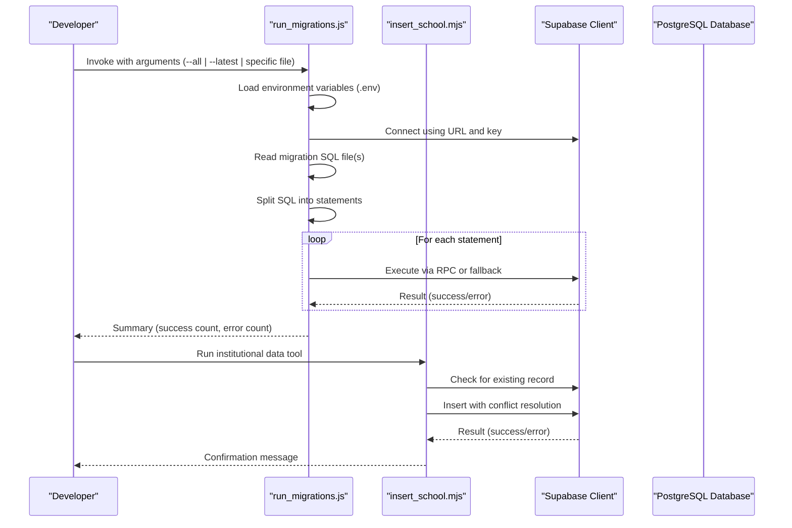
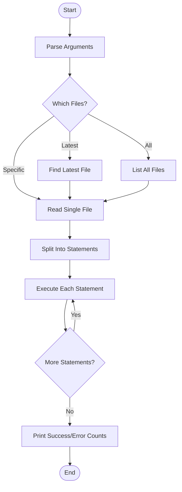
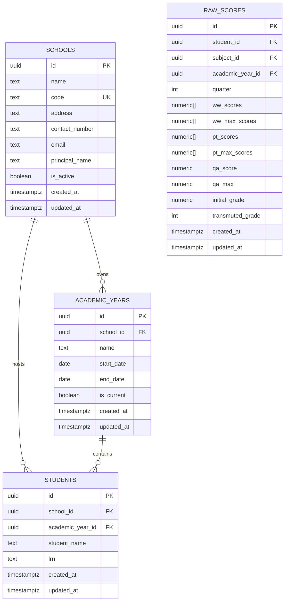
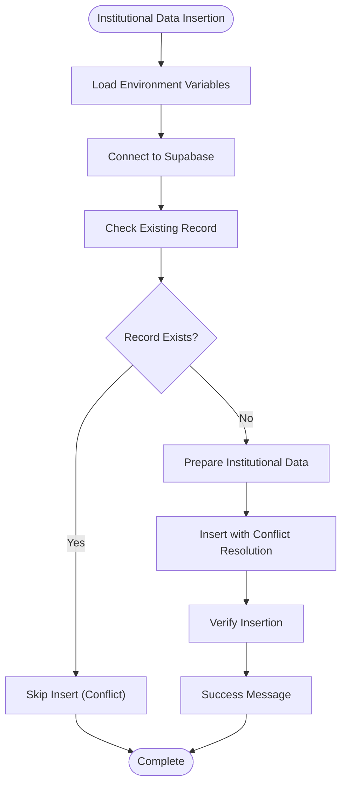
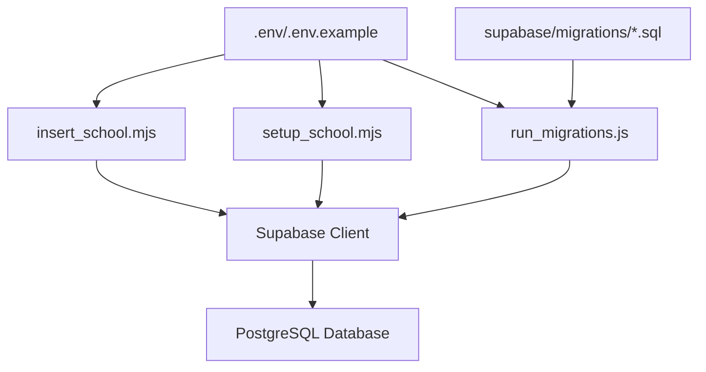

# Database Migrations

<cite>
**Referenced Files in This Document**
- [run_migrations.js](file://run_migrations.js)
- [execute_migration.mjs](file://execute_migration.mjs)
- [run_migration.js](file://run_migration.js)
- [insert_school.mjs](file://insert_school.mjs)
- [setup_school.mjs](file://setup_school.mjs)
- [.env](file://.env)
- [.env.example](file://.env.example)
- [supabase/config.toml](file://supabase/config.toml)
- [supabase/migrations/20260205040000_school_year_segregation.sql](file://supabase/migrations/20260205040000_school_year_segregation.sql)
- [supabase/migrations/20260205041000_school_segregation_enhancements.sql](file://supabase/migrations/20260205041000_school_segregation_enhancements.sql)
- [supabase/migrations/20260205000000_seed_holidays.sql](file://supabase/migrations/20260205000000_seed_holidays.sql)
- [supabase/migrations/20260205025900_create_raw_scores.sql](file://supabase/migrations/20260205025900_create_raw_scores.sql)
- [supabase/migrations/20260209100000_create_audit_logs.sql](file://supabase/migrations/20260209100000_create_audit_logs.sql)
- [supabase/migrations/20260210130000_create_helpdesk_tables.sql](file://supabase/migrations/20260210130000_create_helpdesk_tables.sql)
- [supabase/migrations/20260210200000_insert_sfxsai_school.sql](file://supabase/migrations/20260210200000_insert_sfxsai_school.sql)
- [supabase/migrations/20260205173010_ba0bb451-3fca-4e84-a8f7-a007a84f9ca9.sql](file://supabase/migrations/20260205173010_ba0bb451-3fca-4e84-a8f7-a007a84f9ca9.sql)
- [supabase/migrations/20260205174027_43bcafdf-dce5-4153-b44d-f8ff3d2765db.sql](file://supabase/migrations/20260205174027_43bcafdf-dce5-4153-b44d-f8ff3d2765db.sql)
- [supabase/migrations/20260207230259_6e499098-0e40-42e8-9ef1-3617061337e8.sql](file://supabase/migrations/20260207230259_6e499098-0e40-42e8-9ef1-3617061337e8.sql)
- [supabase/migrations/verify_segregation.sql](file://supabase/migrations/verify_segregation.sql)
</cite>

## Update Summary
**Changes Made**
- Added documentation for the new St. Francis Xavier Smart Academy Inc school record insertion migration
- Updated migration scripts section to include the new institutional data insertion pattern
- Enhanced data seeding section with specific examples of school record insertion
- Added new section covering institutional data management and conflict resolution
- Updated migration runner capabilities to handle both SQL migrations and JavaScript-based data operations

## Table of Contents
1. [Introduction](#introduction)
2. [Project Structure](#project-structure)
3. [Core Components](#core-components)
4. [Architecture Overview](#architecture-overview)
5. [Detailed Component Analysis](#detailed-component-analysis)
6. [Dependency Analysis](#dependency-analysis)
7. [Performance Considerations](#performance-considerations)
8. [Troubleshooting Guide](#troubleshooting-guide)
9. [Conclusion](#conclusion)
10. [Appendices](#appendices)

## Introduction
This document explains how database migrations are managed in the project, focusing on the migration execution process, schema versioning, rollback procedures, migration scripts, data seeding, environment-specific configurations, best practices, testing strategies, and troubleshooting failed migrations. It also covers custom migration scripts and database maintenance procedures, grounded in the actual migration files and runner scripts present in the repository.

**Updated** Added coverage of institutional data management including the new St. Francis Xavier Smart Academy Inc school record insertion with conflict resolution to prevent duplicates.

## Project Structure
The migration system is organized under the Supabase configuration directory with a dedicated migrations folder containing timestamped SQL files. A Node.js migration runner automates applying these migrations locally, while environment variables configure Supabase connection details. The Supabase project identifier is defined in the configuration file. Additionally, JavaScript-based tools provide programmatic data insertion capabilities with conflict resolution.

```mermaid
graph TB
subgraph "Supabase Configuration"
CFG["supabase/config.toml"]
ENV[".env"]
ENV_EX[".env.example"]
end
subgraph "Migration Scripts"
MIG_DIR["supabase/migrations/*.sql"]
JS_TOOLS["JavaScript Data Tools"]
VERIFY["verify_segregation.sql"]
END
subgraph "Data Management Tools"
INSERT_SCHOOL["insert_school.mjs"]
SETUP_SCHOOL["setup_school.mjs"]
EXEC_MIG["execute_migration.mjs"]
END
RUNNER["run_migrations.js"]
RUNNER --> MIG_DIR
RUNNER --> ENV
CFG --> RUNNER
ENV_EX --> ENV
JS_TOOLS --> INSERT_SCHOOL
JS_TOOLS --> SETUP_SCHOOL
JS_TOOLS --> EXEC_MIG
VERIFY --> MIG_DIR
```

**Diagram sources**
- [supabase/config.toml](file://supabase/config.toml#L1-L1)
- [.env](file://.env#L1-L4)
- [.env.example](file://.env.example#L1-L9)
- [run_migrations.js](file://run_migrations.js#L1-L155)
- [insert_school.mjs](file://insert_school.mjs#L1-L89)
- [setup_school.mjs](file://setup_school.mjs#L1-L72)
- [execute_migration.mjs](file://execute_migration.mjs#L1-L114)
- [supabase/migrations/verify_segregation.sql](file://supabase/migrations/verify_segregation.sql#L1-L159)

**Section sources**
- [supabase/config.toml](file://supabase/config.toml#L1-L1)
- [.env](file://.env#L1-L4)
- [.env.example](file://.env.example#L1-L9)
- [run_migrations.js](file://run_migrations.js#L1-L155)
- [insert_school.mjs](file://insert_school.mjs#L1-L89)
- [setup_school.mjs](file://setup_school.mjs#L1-L72)
- [execute_migration.mjs](file://execute_migration.mjs#L1-L114)
- [supabase/migrations/verify_segregation.sql](file://supabase/migrations/verify_segregation.sql#L1-L159)

## Core Components
- Migration runner: A Node.js script that reads migration files and executes SQL statements against the Supabase database using the Supabase client. It supports running a single migration, the latest migration, or all migrations sequentially.
- Environment configuration: Local environment variables define Supabase project ID, URL, and publishable key. These are loaded by the runner to connect to the database.
- Migration scripts: Timestamped SQL files under the migrations directory that define schema changes, data seeding, and enhancements.
- Verification script: A dedicated SQL script to validate segregation correctness, indexes, triggers, and performance.
- Institutional data tools: JavaScript-based utilities for programmatically inserting institutional records with conflict resolution to prevent duplicates.

Key responsibilities:
- Versioning: Migrations are ordered by timestamp prefixes to ensure deterministic ordering.
- Execution: The runner splits SQL content into statements and attempts execution via RPC or an alternative insertion mechanism.
- Environment isolation: Different environments can be supported by swapping environment variable values.
- Data integrity: Institutional data insertion tools use conflict resolution to prevent duplicate entries.

**Section sources**
- [run_migrations.js](file://run_migrations.js#L1-L155)
- [.env](file://.env#L1-L4)
- [.env.example](file://.env.example#L1-L9)
- [supabase/migrations/20260205040000_school_year_segregation.sql](file://supabase/migrations/20260205040000_school_year_segregation.sql#L1-L264)
- [supabase/migrations/20260205041000_school_segregation_enhancements.sql](file://supabase/migrations/20260205041000_school_segregation_enhancements.sql#L1-L403)
- [supabase/migrations/20260205000000_seed_holidays.sql](file://supabase/migrations/20260205000000_seed_holidays.sql#L1-L37)
- [supabase/migrations/20260205025900_create_raw_scores.sql](file://supabase/migrations/20260205025900_create_raw_scores.sql#L1-L48)
- [supabase/migrations/20260209100000_create_audit_logs.sql](file://supabase/migrations/20260209100000_create_audit_logs.sql#L1-L38)
- [supabase/migrations/20260210130000_create_helpdesk_tables.sql](file://supabase/migrations/20260210130000_create_helpdesk_tables.sql#L1-L132)
- [supabase/migrations/20260210200000_insert_sfxsai_school.sql](file://supabase/migrations/20260210200000_insert_sfxsai_school.sql#L1-L11)
- [supabase/migrations/20260205173010_ba0bb451-3fca-4e84-a8f7-a007a84f9ca9.sql](file://supabase/migrations/20260205173010_ba0bb451-3fca-4e84-a8f7-a007a84f9ca9.sql#L1-L86)
- [supabase/migrations/20260205174027_43bcafdf-dce5-4153-b44d-f8ff3d2765db.sql](file://supabase/migrations/20260205174027_43bcafdf-dce5-4153-b44d-f8ff3d2765db.sql#L1-L21)
- [supabase/migrations/20260207230259_6e499098-0e40-42e8-9ef1-3617061337e8.sql](file://supabase/migrations/20260207230259_6e499098-0e40-42e8-9ef1-3617061337e8.sql#L1-L31)
- [supabase/migrations/verify_segregation.sql](file://supabase/migrations/verify_segregation.sql#L1-L159)

## Architecture Overview
The migration architecture centers on a timestamped migration set applied through a Node.js runner. The runner connects to Supabase using environment-provided credentials and executes SQL statements. The migration set evolves the schema incrementally, introduces data, and enforces data segregation and auditing. Institutional data management is handled through both SQL migrations and JavaScript-based tools with conflict resolution.



**Diagram sources**
- [run_migrations.js](file://run_migrations.js#L1-L155)
- [insert_school.mjs](file://insert_school.mjs#L1-L89)
- [.env](file://.env#L1-L4)

**Section sources**
- [run_migrations.js](file://run_migrations.js#L1-L155)
- [insert_school.mjs](file://insert_school.mjs#L1-L89)
- [.env](file://.env#L1-L4)

## Detailed Component Analysis

### Migration Runner
The runner script:
- Accepts arguments to run a specific migration, the latest migration, or all migrations.
- Loads Supabase URL and key from environment variables.
- Reads migration files, splits SQL into statements, and attempts execution.
- Provides a summary of successes and errors.

Operational notes:
- Uses the Supabase client's RPC capability to execute statements when available.
- Falls back to an alternative insertion mechanism if RPC fails.
- Designed for local development and CI scenarios where environment variables are configured.



**Diagram sources**
- [run_migrations.js](file://run_migrations.js#L85-L151)

**Section sources**
- [run_migrations.js](file://run_migrations.js#L1-L155)

### Environment Configuration
Environment variables:
- Project ID, URL, and publishable key are defined in the environment files.
- The runner loads these values to establish a connection to the Supabase project.

Best practices:
- Keep sensitive keys out of version control by copying the example file to a local environment file and adding real values.
- Use separate environment files for different deployment targets (development, staging, production).

**Section sources**
- [.env](file://.env#L1-L4)
- [.env.example](file://.env.example#L1-L9)

### Schema Versioning and Ordering
Migrations are named with timestamp prefixes followed by a unique identifier. This ensures deterministic ordering during execution.

Examples of migration naming:
- Timestamped SQL files under the migrations directory follow the pattern: YYYYMMDDHHMMSS_<uuid>.sql
- Examples include:
  - 20260205040000_school_year_segregation.sql
  - 20260205041000_school_segregation_enhancements.sql
  - 20260205000000_seed_holidays.sql
  - 20260205025900_create_raw_scores.sql
  - 20260209100000_create_audit_logs.sql
  - 20260210130000_create_helpdesk_tables.sql
  - 20260210200000_insert_sfxsai_school.sql
  - 20260205173010_ba0bb451-3fca-4e84-a8f7-a007a84f9ca9.sql
  - 20260205174027_43bcafdf-dce5-4153-b44d-f8ff3d2765db.sql
  - 20260207230259_6e499098-0e40-42e8-9ef1-3617061337e8.sql

**Section sources**
- [supabase/migrations/20260205040000_school_year_segregation.sql](file://supabase/migrations/20260205040000_school_year_segregation.sql#L1-L264)
- [supabase/migrations/20260205041000_school_segregation_enhancements.sql](file://supabase/migrations/20260205041000_school_segregation_enhancements.sql#L1-L403)
- [supabase/migrations/20260205000000_seed_holidays.sql](file://supabase/migrations/20260205000000_seed_holidays.sql#L1-L37)
- [supabase/migrations/20260205025900_create_raw_scores.sql](file://supabase/migrations/20260205025900_create_raw_scores.sql#L1-L48)
- [supabase/migrations/20260209100000_create_audit_logs.sql](file://supabase/migrations/20260209100000_create_audit_logs.sql#L1-L38)
- [supabase/migrations/20260210130000_create_helpdesk_tables.sql](file://supabase/migrations/20260210130000_create_helpdesk_tables.sql#L1-L132)
- [supabase/migrations/20260210200000_insert_sfxsai_school.sql](file://supabase/migrations/20260210200000_insert_sfxsai_school.sql#L1-L11)
- [supabase/migrations/20260205173010_ba0bb451-3fca-4e84-a8f7-a007a84f9ca9.sql](file://supabase/migrations/20260205173010_ba0bb451-3fca-4e84-a8f7-a007a84f9ca9.sql#L1-L86)
- [supabase/migrations/20260205174027_43bcafdf-dce5-4153-b44d-f8ff3d2765db.sql](file://supabase/migrations/20260205174027_43bcafdf-dce5-4153-b44d-f8ff3d2765db.sql#L1-L21)
- [supabase/migrations/20260207230259_6e499098-0e40-42e8-9ef1-3617061337e8.sql](file://supabase/migrations/20260207230259_6e499098-0e40-42e8-9ef1-3617061337e8.sql#L1-L31)

### Rollback Procedures
Rollback capability is not explicitly implemented in the provided migration files or runner. To support rollbacks:
- Maintain reversible SQL statements in migrations (e.g., drop indexes/triggers, revert column changes).
- Introduce down-migration files or reversible blocks within each migration.
- Use transactional execution with explicit rollback on failure.

Current state:
- The runner executes statements sequentially without transactional rollback.
- Some migrations introduce irreversible data changes (e.g., seeding).

Recommendation:
- Adopt a convention where each migration includes a "down" counterpart or reversible logic to enable safe rollbacks.

**Section sources**
- [run_migrations.js](file://run_migrations.js#L32-L80)

### Migration Scripts and Data Seeding
- School-year segregation migration:
  - Creates the schools table, adds school_id to academic_years, and propagates school_id to related tables.
  - Enforces NOT NULL constraints and creates composite indexes for performance.
  - Adds triggers to validate school-academic-year consistency.
- School segregation enhancements:
  - Adds user-school access tracking, audit logs, switch logs, and helper functions.
  - Updates RLS policies to enforce school-aware access controls.
- Data seeding:
  - Seeds school events for multiple schools.
  - **New**: Inserts St. Francis Xavier Smart Academy Inc school record with conflict resolution to prevent duplicates.
- Raw scores table:
  - Creates a table for DepEd transmutation system with array-based scores and computed fields.
- Audit logs:
  - Creates audit_logs table with RLS policies and indexes.
- Helpdesk tables:
  - Creates tickets and comments tables with RLS policies and triggers for updated_at.
- Additional features:
  - Data validation issues table and academic year archiving support.

**Updated** Added institutional data management with conflict resolution for preventing duplicate school records.



**Diagram sources**
- [supabase/migrations/20260205040000_school_year_segregation.sql](file://supabase/migrations/20260205040000_school_year_segregation.sql#L8-L171)
- [supabase/migrations/20260205025900_create_raw_scores.sql](file://supabase/migrations/20260205025900_create_raw_scores.sql#L2-L30)

**Section sources**
- [supabase/migrations/20260205040000_school_year_segregation.sql](file://supabase/migrations/20260205040000_school_year_segregation.sql#L1-L264)
- [supabase/migrations/20260205041000_school_segregation_enhancements.sql](file://supabase/migrations/20260205041000_school_segregation_enhancements.sql#L1-L403)
- [supabase/migrations/20260205000000_seed_holidays.sql](file://supabase/migrations/20260205000000_seed_holidays.sql#L1-L37)
- [supabase/migrations/20260205025900_create_raw_scores.sql](file://supabase/migrations/20260205025900_create_raw_scores.sql#L1-L48)
- [supabase/migrations/20260209100000_create_audit_logs.sql](file://supabase/migrations/20260209100000_create_audit_logs.sql#L1-L38)
- [supabase/migrations/20260210130000_create_helpdesk_tables.sql](file://supabase/migrations/20260210130000_create_helpdesk_tables.sql#L1-L132)
- [supabase/migrations/20260210200000_insert_sfxsai_school.sql](file://supabase/migrations/20260210200000_insert_sfxsai_school.sql#L1-L11)
- [supabase/migrations/20260205173010_ba0bb451-3fca-4e84-a8f7-a007a84f9ca9.sql](file://supabase/migrations/20260205173010_ba0bb451-3fca-4e84-a8f7-a007a84f9ca9.sql#L1-L86)
- [supabase/migrations/20260205174027_43bcafdf-dce5-4153-b44d-f8ff3d2765db.sql](file://supabase/migrations/20260205174027_43bcafdf-dce5-4153-b44d-f8ff3d2765db.sql#L1-L21)
- [supabase/migrations/20260207230259_6e499098-0e40-42e8-9ef1-3617061337e8.sql](file://supabase/migrations/20260207230259_6e499098-0e40-42e8-9ef1-3617061337e8.sql#L1-L31)

### Institutional Data Management and Conflict Resolution
**New Section** The project now includes comprehensive institutional data management capabilities designed to handle school records and other institutional entities with built-in conflict resolution to prevent duplicates.

#### School Record Insertion Pattern
The new institutional data management follows a standardized pattern for inserting school records:

- **Conflict Resolution**: Uses `ON CONFLICT (code) DO NOTHING` to prevent duplicate school codes
- **Standardized Fields**: Inserts essential school information including ID, code, name, and address
- **Active Status**: Sets default active status for new institutions
- **UUID Generation**: Uses predefined UUIDs for consistent identification across systems

#### JavaScript-Based Data Tools
Multiple JavaScript tools provide programmatic data insertion capabilities:

- **insert_school.mjs**: Comprehensive tool with environment variable loading and detailed feedback
- **setup_school.mjs**: Simplified version for quick school record creation
- **execute_migration.mjs**: Direct SQL execution with fallback methods and verification

#### Conflict Resolution Strategies
- **Code-based Conflict**: Prevents duplicate school codes using unique constraints
- **Service Role Keys**: Supports both anonymous and service role key usage
- **Fallback Mechanisms**: Multiple approaches to ensure data insertion succeeds



**Diagram sources**
- [insert_school.mjs](file://insert_school.mjs#L29-L86)
- [execute_migration.mjs](file://execute_migration.mjs#L11-L111)

**Section sources**
- [supabase/migrations/20260210200000_insert_sfxsai_school.sql](file://supabase/migrations/20260210200000_insert_sfxsai_school.sql#L1-L11)
- [insert_school.mjs](file://insert_school.mjs#L1-L89)
- [setup_school.mjs](file://setup_school.mjs#L1-L72)
- [execute_migration.mjs](file://execute_migration.mjs#L1-L114)

### Custom Migration Scripts and Maintenance
Custom migration examples:
- School segregation validation script verifies data consistency, indexes, triggers, and query performance.
- Additional migrations introduce specialized tables and policies for helpdesk, audit trails, and data validation.
- **New**: Institutional data insertion migrations that follow conflict resolution patterns.

Maintenance procedures:
- Use the verification script to confirm segregation correctness after schema changes.
- Monitor access logs and switch logs for anomalies.
- Periodically review and optimize indexes and policies.
- **New**: Regularly verify institutional data integrity and conflict resolution effectiveness.

**Section sources**
- [supabase/migrations/verify_segregation.sql](file://supabase/migrations/verify_segregation.sql#L1-L159)
- [supabase/migrations/20260205041000_school_segregation_enhancements.sql](file://supabase/migrations/20260205041000_school_segregation_enhancements.sql#L46-L128)
- [supabase/migrations/20260207230259_6e499098-0e40-42e8-9ef1-3617061337e8.sql](file://supabase/migrations/20260207230259_6e499098-0e40-42e8-9ef1-3617061337e8.sql#L5-L31)
- [supabase/migrations/20260210200000_insert_sfxsai_school.sql](file://supabase/migrations/20260210200000_insert_sfxsai_school.sql#L1-L11)

## Dependency Analysis
The migration runner depends on:
- Environment variables for Supabase connectivity.
- The presence of migration files in the migrations directory.
- Supabase client capabilities for executing SQL statements.
- **New**: Institutional data tools depend on environment configuration and Supabase authentication.



**Diagram sources**
- [.env](file://.env#L1-L4)
- [.env.example](file://.env.example#L1-L9)
- [run_migrations.js](file://run_migrations.js#L1-L155)
- [insert_school.mjs](file://insert_school.mjs#L1-L89)
- [setup_school.mjs](file://setup_school.mjs#L1-L72)
- [supabase/migrations/20260205040000_school_year_segregation.sql](file://supabase/migrations/20260205040000_school_year_segregation.sql#L1-L264)

**Section sources**
- [run_migrations.js](file://run_migrations.js#L1-L155)
- [insert_school.mjs](file://insert_school.mjs#L1-L89)
- [setup_school.mjs](file://setup_school.mjs#L1-L72)
- [.env](file://.env#L1-L4)
- [.env.example](file://.env.example#L1-L9)

## Performance Considerations
- Composite indexes: School-segmented queries benefit from composite indexes on (school_id, academic_year_id) to avoid table scans.
- Triggers: Validation triggers prevent cross-school violations but add overhead; ensure they are only on necessary tables.
- RLS policies: Fine-grained access control improves security but can impact query performance; monitor with EXPLAIN ANALYZE.
- Audit and logging: Dedicated tables for audit logs and access logs should be indexed appropriately to maintain performance.
- **New**: Conflict resolution operations: ON CONFLICT clauses add minimal overhead but ensure data integrity for institutional records.

## Troubleshooting Guide
Common issues and resolutions:
- Data segregation violation: Occurs when academic_year_id does not belong to the specified school. Use the verification script to identify violations and correct data.
- Performance issues: Run EXPLAIN ANALYZE to confirm index usage and adjust indexes or queries accordingly.
- Policy conflicts: Review RLS policies for tables involved in segregation to ensure correct access rules.
- Runner limitations: The runner uses an anon key which has limited permissions. For full access, use the Supabase CLI or Dashboard SQL Editor.
- **New**: Institutional data conflicts: When inserting school records, ensure the school code is unique. The ON CONFLICT clause will prevent duplicates automatically.

Operational tips:
- Use the verification script to validate segregation correctness after applying migrations.
- Monitor access logs and switch logs for suspicious activity.
- Keep environment variables up-to-date for the target environment.
- **New**: Test institutional data insertion tools with existing records to verify conflict resolution works correctly.

**Section sources**
- [supabase/migrations/verify_segregation.sql](file://supabase/migrations/verify_segregation.sql#L1-L159)
- [supabase/migrations/20260205040000_school_year_segregation.sql](file://supabase/migrations/20260205040000_school_year_segregation.sql#L206-L253)
- [run_migrations.js](file://run_migrations.js#L93-L95)
- [supabase/migrations/20260210200000_insert_sfxsai_school.sql](file://supabase/migrations/20260210200000_insert_sfxsai_school.sql#L10)

## Conclusion
The project employs a robust, timestamped migration system with a Node.js runner for local execution and environment-specific configuration. Migrations enforce data segregation, introduce specialized tables, and implement auditing and access controls. The addition of institutional data management tools provides comprehensive support for school record insertion with conflict resolution. While the current runner lacks explicit rollback mechanisms, adopting reversible migrations and transactional execution would enhance safety. The verification script and auxiliary tables support ongoing maintenance and monitoring.

**Updated** Enhanced with institutional data management capabilities that follow established patterns for conflict resolution and duplicate prevention.

## Appendices

### Best Practices
- Always test migrations in a staging environment before applying to production.
- Keep migration files small and focused on a single concern.
- Include comments explaining the purpose and expected outcomes of each migration.
- Use reversible changes where possible to support rollbacks.
- Maintain environment-specific configuration files and never commit secrets.
- **New**: Follow conflict resolution patterns for institutional data insertion to prevent duplicates.
- **New**: Use standardized field formats and UUID generation for consistent institutional record management.