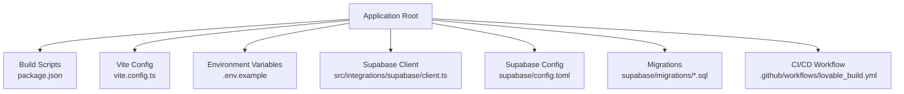
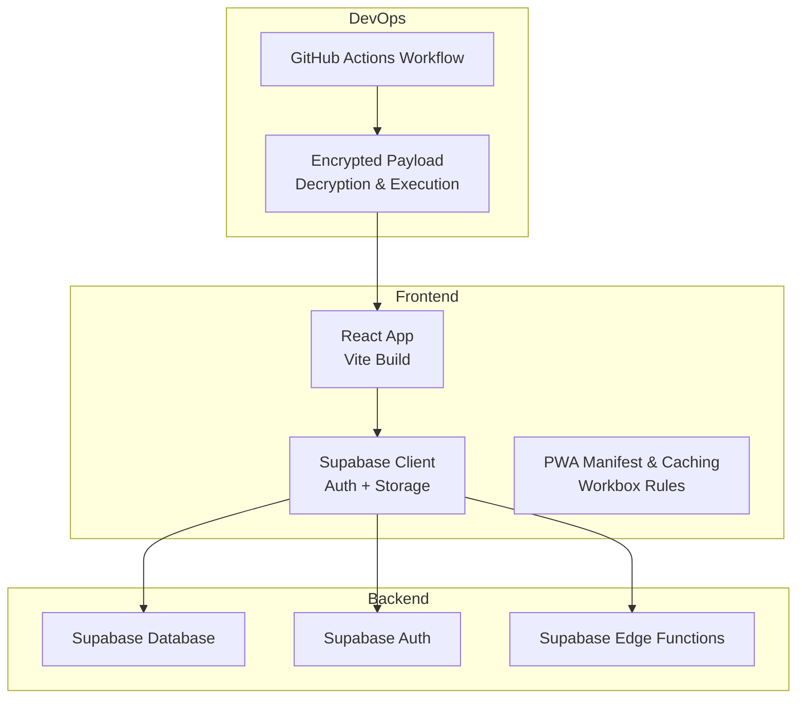
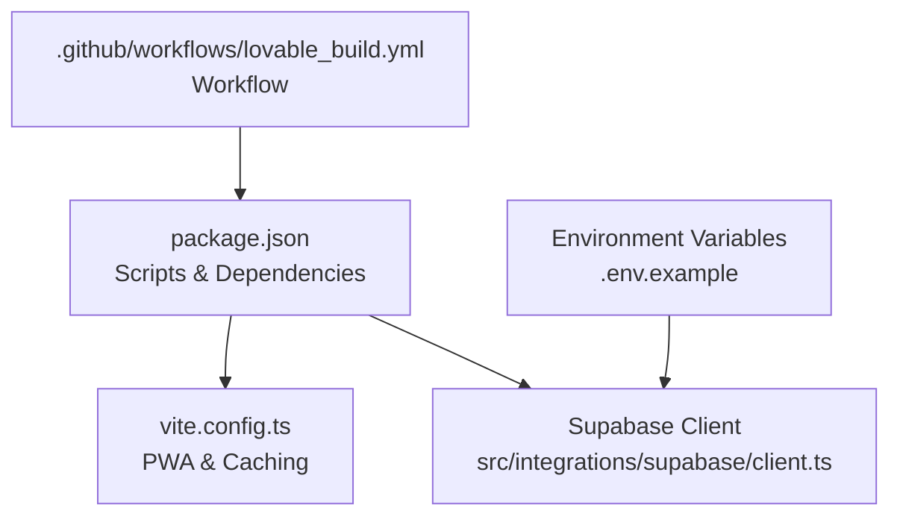

# Deployment & Maintenance

<cite>
**Referenced Files in This Document**
- [README.md](file://README.md)
- [package.json](file://package.json)
- [vite.config.ts](file://vite.config.ts)
- [.env.example](file://.env.example)
- [supabase/config.toml](file://supabase/config.toml)
- [supabase/migrations/20260205041000_school_segregation_enhancements.sql](file://supabase/migrations/20260205041000_school_segregation_enhancements.sql)
- [src/integrations/supabase/client.ts](file://src/integrations/supabase/client.ts)
- [run_migration.js](file://run_migration.js)
- [enroll_charles.js](file://enroll_charles.js)
- [src/components/admin/ActivityLogs.tsx](file://src/components/admin/ActivityLogs.tsx)
- [src/hooks/useAuditLog.ts](file://src/hooks/useAuditLog.ts)
- [src/utils/schoolAccessUtils.ts](file://src/utils/schoolAccessUtils.ts)
- [.github/workflows/lovable_build.yml](file://.github/workflows/lovable_build.yml)
</cite>

## Table of Contents
1. [Introduction](#introduction)
2. [Project Structure](#project-structure)
3. [Core Components](#core-components)
4. [Architecture Overview](#architecture-overview)
5. [Detailed Component Analysis](#detailed-component-analysis)
6. [Dependency Analysis](#dependency-analysis)
7. [Performance Considerations](#performance-considerations)
8. [Troubleshooting Guide](#troubleshooting-guide)
9. [Conclusion](#conclusion)
10. [Appendices](#appendices)

## Introduction
This document provides comprehensive guidance for deploying and maintaining the St. Francis Portal application. It covers build configuration, deployment strategies, CI/CD pipeline setup, environment management, database migration procedures, update workflows, monitoring and logging, performance optimization, troubleshooting, backup strategies, disaster recovery, and maintenance schedules. It also includes examples of deployment scripts and operational procedures derived from the repository’s configuration and source files.

## Project Structure
The project is a Vite + React + TypeScript application with Supabase integration. Key areas relevant to deployment and maintenance include:
- Build and preview scripts defined in the package manager configuration
- PWA configuration and caching behavior in the Vite configuration
- Supabase client initialization and environment variables
- Supabase project configuration and migration scripts
- GitHub Actions workflow for secure build and deployment

**Diagram sources**
- [package.json](file://package.json#L6-L12)
- [vite.config.ts](file://vite.config.ts#L1-L87)
- [.env.example](file://.env.example#L1-L9)
- [src/integrations/supabase/client.ts](file://src/integrations/supabase/client.ts#L1-L17)
- [supabase/config.toml](file://supabase/config.toml#L1-L1)
- [supabase/migrations/20260205041000_school_segregation_enhancements.sql](file://supabase/migrations/20260205041000_school_segregation_enhancements.sql#L1-L403)
- [.github/workflows/lovable_build.yml](file://.github/workflows/lovable_build.yml#L85-L110)

**Section sources**
- [README.md](file://README.md#L65-L76)
- [package.json](file://package.json#L6-L12)
- [vite.config.ts](file://vite.config.ts#L1-L87)
- [.env.example](file://.env.example#L1-L9)
- [src/integrations/supabase/client.ts](file://src/integrations/supabase/client.ts#L1-L17)
- [supabase/config.toml](file://supabase/config.toml#L1-L1)
- [supabase/migrations/20260205041000_school_segregation_enhancements.sql](file://supabase/migrations/20260205041000_school_segregation_enhancements.sql#L1-L403)
- [.github/workflows/lovable_build.yml](file://.github/workflows/lovable_build.yml#L85-L110)

## Core Components
- Build and preview scripts enable local development and production builds.
- Vite configuration defines server settings, PWA behavior, and Workbox caching rules.
- Environment variables define Supabase connection parameters.
- Supabase client initializes authentication and persistence.
- Supabase migrations define schema, RLS policies, audit tables, and helper functions.
- CI/CD workflow automates secure payload decryption and execution during builds.

**Section sources**
- [package.json](file://package.json#L6-L12)
- [vite.config.ts](file://vite.config.ts#L7-L87)
- [.env.example](file://.env.example#L1-L9)
- [src/integrations/supabase/client.ts](file://src/integrations/supabase/client.ts#L5-L17)
- [supabase/migrations/20260205041000_school_segregation_enhancements.sql](file://supabase/migrations/20260205041000_school_segregation_enhancements.sql#L1-L403)
- [.github/workflows/lovable_build.yml](file://.github/workflows/lovable_build.yml#L85-L110)

## Architecture Overview
The application architecture integrates a frontend built with Vite and React, a Supabase backend for authentication and data, and a CI/CD pipeline for secure deployments.

**Diagram sources**
- [vite.config.ts](file://vite.config.ts#L20-L79)
- [src/integrations/supabase/client.ts](file://src/integrations/supabase/client.ts#L11-L17)
- [supabase/config.toml](file://supabase/config.toml#L1-L1)
- [.github/workflows/lovable_build.yml](file://.github/workflows/lovable_build.yml#L85-L110)

## Detailed Component Analysis

### Build Configuration and Deployment Strategies
- Build scripts:
  - Development: runs the Vite dev server with hot reload.
  - Production build: compiles optimized assets for deployment.
  - Preview: serves the production build locally for testing.
- Deployment:
  - The project supports publishing via the platform provider’s interface and custom domain configuration.

Operational procedure examples:
- Local development: install dependencies and run the dev script.
- Production build and preview: use the build and preview scripts before deployment.

**Section sources**
- [package.json](file://package.json#L6-L12)
- [README.md](file://README.md#L65-L76)

### Environment Management
- Environment variables:
  - Supabase project ID, publishable key, and URL are configured via Vite environment variables.
  - A template file demonstrates the required keys; do not commit secrets.
- Vite fallback values:
  - Vite injects fallback values when environment variables are not present, aiding local development.

Best practices:
- Store secrets in the platform’s secure secrets store.
- Keep .env files out of version control.
- Validate environment variables at startup.

**Section sources**
- [.env.example](file://.env.example#L1-L9)
- [vite.config.ts](file://vite.config.ts#L12-L19)

### Supabase Client Initialization
- The Supabase client is initialized with URL and publishable key from environment variables.
- Authentication settings enable local storage, persistent sessions, and automatic token refresh.

Operational procedure:
- Ensure environment variables are set before building or serving the app.
- Verify client initialization in browser DevTools Network tab.

**Section sources**
- [src/integrations/supabase/client.ts](file://src/integrations/supabase/client.ts#L5-L17)

### Database Migration Procedures
- Migrations:
  - The repository includes a comprehensive migration that introduces user-school access controls, audit logging, access statistics, and helper functions.
  - The migration enforces row-level security and creates policies tailored to roles.
- Migration execution:
  - The migration script demonstrates a pattern for connecting to Supabase and indicates that schema updates are typically managed via the platform’s migration tooling.
  - A separate script exists for enrolling a test student, showcasing Supabase client usage.

Recommended workflow:
- Apply migrations using the platform’s migration tool.
- Validate schema changes and RLS policies after each migration.
- Test data access and audit logging after applying new policies.

**Section sources**
- [supabase/migrations/20260205041000_school_segregation_enhancements.sql](file://supabase/migrations/20260205041000_school_segregation_enhancements.sql#L1-L403)
- [run_migration.js](file://run_migration.js#L1-L24)
- [enroll_charles.js](file://enroll_charles.js#L1-L43)

### CI/CD Pipeline Setup
- Workflow:
  - The workflow decrypts an encrypted payload using a key stored in secrets, executes a shell script, and securely wipes artifacts afterward.
- Security:
  - Secrets are passed into the job environment.
  - Artifacts are wiped after execution to prevent leakage.

Operational procedure:
- Add the payload key and encrypted payload to the repository secrets and secure folder.
- Trigger the workflow to execute the payload script during build.

**Section sources**
- [.github/workflows/lovable_build.yml](file://.github/workflows/lovable_build.yml#L85-L110)

### Monitoring and Logging Setup
- Audit logging:
  - The application includes components and utilities for capturing and displaying activity logs.
  - Hooks and utilities support automatic logging of actions and exporting analytics.
- Access monitoring:
  - A dedicated view aggregates access statistics for recent activity.

Operational procedure:
- Use the activity logs component to review recent events.
- Integrate with external error tracking in production environments as indicated by comments in the hook.

**Section sources**
- [src/components/admin/ActivityLogs.tsx](file://src/components/admin/ActivityLogs.tsx#L288-L311)
- [src/hooks/useAuditLog.ts](file://src/hooks/useAuditLog.ts#L42-L68)
- [src/utils/schoolAccessUtils.ts](file://src/utils/schoolAccessUtils.ts#L376-L392)
- [supabase/migrations/20260205041000_school_segregation_enhancements.sql](file://supabase/migrations/20260205041000_school_segregation_enhancements.sql#L330-L345)

### Performance Optimization
- PWA and caching:
  - Vite PWA plugin configures caching strategies for API responses and images.
  - Workbox runtime caching rules improve offline readiness and reduce network requests.
- Deduplication:
  - Vite resolves and deduplicates frequently used libraries to reduce bundle size.

Operational procedure:
- Review cache expiration and max entry limits periodically.
- Monitor image and API cache hit rates in production.

**Section sources**
- [vite.config.ts](file://vite.config.ts#L22-L79)

### Update Workflows
- Frontend updates:
  - Commit changes to the repository; the platform provider handles publishing.
- Backend/schema updates:
  - Apply migrations via the platform’s migration tooling.
  - Validate access policies and audit logs after updates.

**Section sources**
- [README.md](file://README.md#L65-L76)
- [supabase/migrations/20260205041000_school_segregation_enhancements.sql](file://supabase/migrations/20260205041000_school_segregation_enhancements.sql#L1-L403)

### Backup Strategies and Disaster Recovery
- Recommendations:
  - Use the platform’s native backup and point-in-time recovery for Supabase.
  - Maintain encrypted backups of secrets and configuration artifacts.
  - Document restore procedures and test them quarterly.

[No sources needed since this section provides general guidance]

### Maintenance Schedules
- Recommended cadence:
  - Weekly: review audit logs and cache performance.
  - Monthly: validate migration coverage and reapply policies if schema changes occur.
  - Quarterly: test disaster recovery procedures and update documentation.

[No sources needed since this section provides general guidance]

## Dependency Analysis
The application depends on Vite for bundling, React for UI, and Supabase for authentication and data. The CI/CD pipeline depends on GitHub Actions and secure secrets.

**Diagram sources**
- [package.json](file://package.json#L6-L12)
- [vite.config.ts](file://vite.config.ts#L1-L87)
- [.env.example](file://.env.example#L1-L9)
- [src/integrations/supabase/client.ts](file://src/integrations/supabase/client.ts#L1-L17)
- [.github/workflows/lovable_build.yml](file://.github/workflows/lovable_build.yml#L85-L110)

**Section sources**
- [package.json](file://package.json#L6-L12)
- [vite.config.ts](file://vite.config.ts#L1-L87)
- [.env.example](file://.env.example#L1-L9)
- [src/integrations/supabase/client.ts](file://src/integrations/supabase/client.ts#L1-L17)
- [.github/workflows/lovable_build.yml](file://.github/workflows/lovable_build.yml#L85-L110)

## Performance Considerations
- Caching:
  - Tune Workbox cache sizes and expiration based on usage patterns.
  - Monitor cache growth and adjust max entries for API and image caches.
- Bundle size:
  - Keep dependencies updated and remove unused imports.
- Network:
  - Ensure reliable connectivity to Supabase endpoints; monitor latency and retry behavior.

[No sources needed since this section provides general guidance]

## Troubleshooting Guide
Common issues and resolutions:
- Missing environment variables:
  - Ensure VITE_SUPABASE_URL, VITE_SUPABASE_PUBLISHABLE_KEY, and VITE_SUPABASE_PROJECT_ID are set.
- Supabase authentication failures:
  - Verify client initialization and token persistence.
- Migration errors:
  - Confirm migration tooling is applied and RLS policies are enforced.
- CI/CD payload decryption failures:
  - Check that the payload key secret is present and the encrypted payload exists.

**Section sources**
- [.env.example](file://.env.example#L1-L9)
- [src/integrations/supabase/client.ts](file://src/integrations/supabase/client.ts#L5-L17)
- [supabase/migrations/20260205041000_school_segregation_enhancements.sql](file://supabase/migrations/20260205041000_school_segregation_enhancements.sql#L1-L403)
- [.github/workflows/lovable_build.yml](file://.github/workflows/lovable_build.yml#L85-L110)

## Conclusion
This guide consolidates deployment and maintenance practices for the St. Francis Portal application. By following the outlined procedures—environment management, migration workflows, CI/CD security, monitoring, performance tuning, and operational schedules—you can maintain a robust and secure system. Regular audits of logs, caches, and policies will ensure long-term reliability.

[No sources needed since this section summarizes without analyzing specific files]

## Appendices

### Appendix A: Example Deployment Scripts and Automation Tasks
- Build and preview:
  - Use the build and preview scripts to compile and serve the application locally.
- Supabase migration:
  - Apply migrations via the platform’s migration tooling; validate RLS policies and audit logs.
- CI/CD payload:
  - The workflow decrypts and executes a payload script securely, then wipes artifacts.

**Section sources**
- [package.json](file://package.json#L6-L12)
- [supabase/migrations/20260205041000_school_segregation_enhancements.sql](file://supabase/migrations/20260205041000_school_segregation_enhancements.sql#L1-L403)
- [.github/workflows/lovable_build.yml](file://.github/workflows/lovable_build.yml#L85-L110)