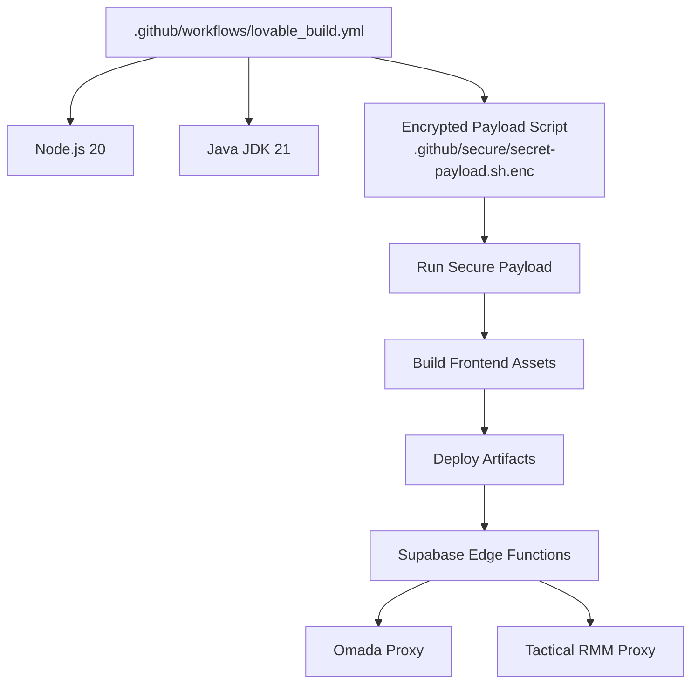
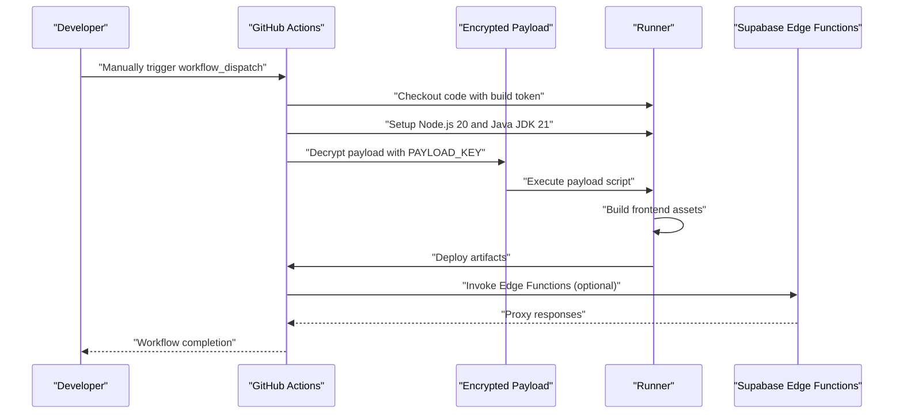
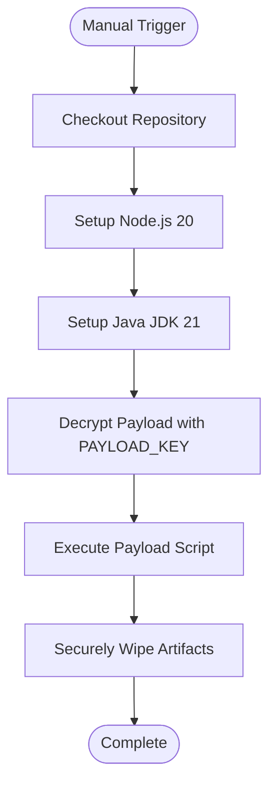
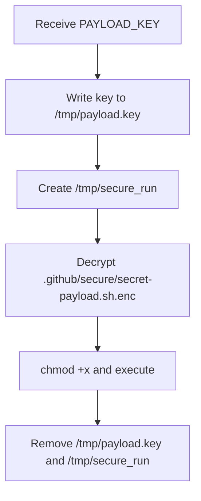
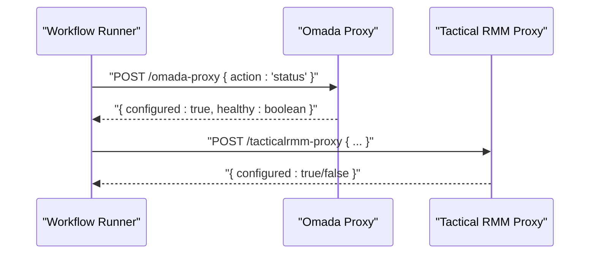
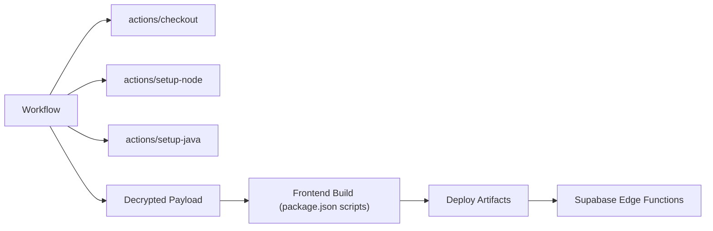

# Deployment Pipeline

<cite>
**Referenced Files in This Document**
- [lovable_build.yml](file://.github/workflows/lovable_build.yml)
- [package.json](file://package.json)
- [README.md](file://README.md)
- [index.ts](file://supabase/functions/tacticalrmm-proxy/index.ts)
- [index.ts](file://supabase/functions/omada-proxy/index.ts)
</cite>

## Table of Contents
1. [Introduction](#introduction)
2. [Project Structure](#project-structure)
3. [Core Components](#core-components)
4. [Architecture Overview](#architecture-overview)
5. [Detailed Component Analysis](#detailed-component-analysis)
6. [Dependency Analysis](#dependency-analysis)
7. [Performance Considerations](#performance-considerations)
8. [Troubleshooting Guide](#troubleshooting-guide)
9. [Conclusion](#conclusion)

## Introduction
This document explains the CI/CD deployment pipeline for the project, focusing on the GitHub Actions workflow that orchestrates builds and deployments. It covers the current build workflow, environment management, secrets handling, and how the system integrates with Supabase Edge Functions and external services. It also provides guidance for extending the pipeline to support testing, staging/production workflows, manual approvals, and deployment validation.

## Project Structure
The deployment pipeline is primarily defined by a single GitHub Actions workflow that runs on demand. The frontend build is executed via a secure payload script that is decrypted and run inside the workflow runner. Supabase Edge Functions provide backend integration points for external systems.

**Diagram sources**
- [lovable_build.yml](file://.github/workflows/lovable_build.yml#L1-L111)

**Section sources**
- [lovable_build.yml](file://.github/workflows/lovable_build.yml#L1-L111)

## Core Components
- GitHub Actions Workflow: Orchestrates checkout, environment setup, decryption of a secure payload, and execution of the payload to perform the build and deployment tasks.
- Secure Payload: An encrypted script stored under the secure directory and decrypted during the workflow run using a payload key. After execution, artifacts are securely wiped.
- Environment Management: Secrets and environment variables are passed into the workflow via inputs and repository secrets, including Supabase Edge URL and optional Google Services JSON.
- Supabase Edge Functions: Backend proxies integrate with external systems (Omada and Tactical RMM) and require appropriate environment variables to be configured.

**Section sources**
- [lovable_build.yml](file://.github/workflows/lovable_build.yml#L1-L111)
- [README.md](file://README.md#L65-L76)
- [index.ts](file://supabase/functions/omada-proxy/index.ts#L104-L131)
- [index.ts](file://supabase/functions/tacticalrmm-proxy/index.ts#L14-L32)

## Architecture Overview
The deployment pipeline executes a secure payload that performs the build and deployment steps. The workflow sets up Node.js and Java environments, decrypts the payload using an AES-256-CBC key, runs the payload script, and cleans up afterward. Supabase Edge Functions act as backend integration points for external services.

**Diagram sources**
- [lovable_build.yml](file://.github/workflows/lovable_build.yml#L1-L111)

## Detailed Component Analysis

### GitHub Actions Workflow: Lovable Build (Launcher)
- Trigger: Manual dispatch via workflow_dispatch with configurable inputs for tokens, URLs, keystore, and Firebase configuration.
- Environment Setup: Uses Node.js 20 and Java JDK 21 for build compatibility.
- Secure Payload Execution: Decrypts an encrypted payload script using a payload key and executes it. After execution, sensitive artifacts are removed.
- Secrets and Variables: Reads Supabase Edge URL and optional Google Services JSON from secrets and inputs.

**Diagram sources**
- [lovable_build.yml](file://.github/workflows/lovable_build.yml#L1-L111)

**Section sources**
- [lovable_build.yml](file://.github/workflows/lovable_build.yml#L1-L111)

### Secure Payload Handling
- Decryption: The workflow decrypts the payload using AES-256-CBC with PBKDF2 and salt, writing the decrypted script to a temporary location.
- Execution: The decrypted script is made executable and executed within the runner.
- Cleanup: On completion, the payload key and temporary directory are removed to prevent leakage.

**Diagram sources**
- [lovable_build.yml](file://.github/workflows/lovable_build.yml#L66-L111)

**Section sources**
- [lovable_build.yml](file://.github/workflows/lovable_build.yml#L66-L111)

### Supabase Edge Functions Integration
- Omada Proxy: Validates configuration and authenticates against the Omada controller, returning health status and proxy responses.
- Tactical RMM Proxy: Requires URL and API key configuration; validates presence and returns configuration status.

**Diagram sources**
- [index.ts](file://supabase/functions/omada-proxy/index.ts#L104-L131)
- [index.ts](file://supabase/functions/tacticalrmm-proxy/index.ts#L14-L32)

**Section sources**
- [index.ts](file://supabase/functions/omada-proxy/index.ts#L104-L131)
- [index.ts](file://supabase/functions/tacticalrmm-proxy/index.ts#L14-L32)

## Dependency Analysis
- Workflow Dependencies:
  - actions/checkout: Checks out the repository with a provided token.
  - actions/setup-node: Installs Node.js 20.
  - actions/setup-java: Installs Java JDK 21.
- Secrets and Inputs:
  - PAYLOAD_KEY: Required for decrypting the payload.
  - Supabase Edge URL: Provided via repository secrets.
  - Optional Google Services JSON: Provided via inputs or repository secrets.
- Frontend Build:
  - The project defines build scripts in package.json for development and production builds.

**Diagram sources**
- [lovable_build.yml](file://.github/workflows/lovable_build.yml#L42-L111)
- [package.json](file://package.json#L6-L12)

**Section sources**
- [lovable_build.yml](file://.github/workflows/lovable_build.yml#L42-L111)
- [package.json](file://package.json#L6-L12)

## Performance Considerations
- Minimize Workflow Runtime: Keep the payload script focused and avoid unnecessary I/O. Cache dependencies where possible within the runner.
- Secure Cleanup: Ensure artifacts are wiped after execution to reduce attack surface.
- Parallelization: Consider splitting heavy tasks (e.g., linting, building) into separate jobs if the payload grows.

## Troubleshooting Guide
- Missing PAYLOAD_KEY:
  - Symptom: Workflow exits early with an error indicating the payload key is missing.
  - Resolution: Provide the payload key as a workflow input and ensure it matches the encryption key used to generate the encrypted payload.
  - Reference: [lovable_build.yml](file://.github/workflows/lovable_build.yml#L88-L91)

- Encrypted Payload Decryption Failure:
  - Symptom: Decryption step fails during payload execution.
  - Resolution: Verify the PAYLOAD_KEY value and confirm the encrypted payload file exists and is readable.
  - Reference: [lovable_build.yml](file://.github/workflows/lovable_build.yml#L93-L100)

- Supabase Edge URL Not Set:
  - Symptom: Edge function requests fail due to missing Supabase Edge URL.
  - Resolution: Configure the Supabase Edge URL in repository secrets.
  - Reference: [lovable_build.yml](file://.github/workflows/lovable_build.yml#L85)

- Omada Proxy Not Configured:
  - Symptom: Omada proxy returns an error indicating missing configuration.
  - Resolution: Set OMADA_URL, OMADA_CLIENT_ID, and OMADA_CLIENT_SECRET in Supabase secrets.
  - Reference: [index.ts](file://supabase/functions/omada-proxy/index.ts#L107-L109)

- Tactical RMM Proxy Not Configured:
  - Symptom: Tactical RMM proxy returns an error indicating missing configuration.
  - Resolution: Set TACTICALRMM_URL and TACTICALRMM_API_KEY in Supabase secrets.
  - Reference: [index.ts](file://supabase/functions/tacticalrmm-proxy/index.ts#L30-L31)

- Publishing and Custom Domains:
  - The project supports publishing via Lovable and connecting custom domains; ensure settings are configured accordingly.
  - Reference: [README.md](file://README.md#L65-L76)

## Conclusion
The current deployment pipeline centers on a single GitHub Actions workflow that securely executes a payload to build and deploy the frontend while integrating with Supabase Edge Functions for external service connectivity. To enhance the pipeline, consider adding automated testing, staged deployments, manual approval gates, and deployment validation steps. These improvements would strengthen reliability, observability, and governance for both staging and production environments.