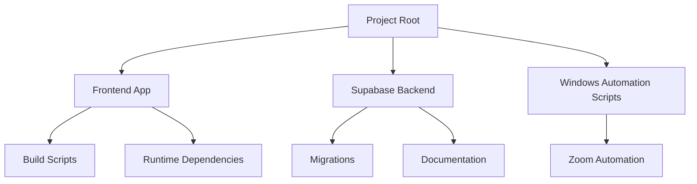
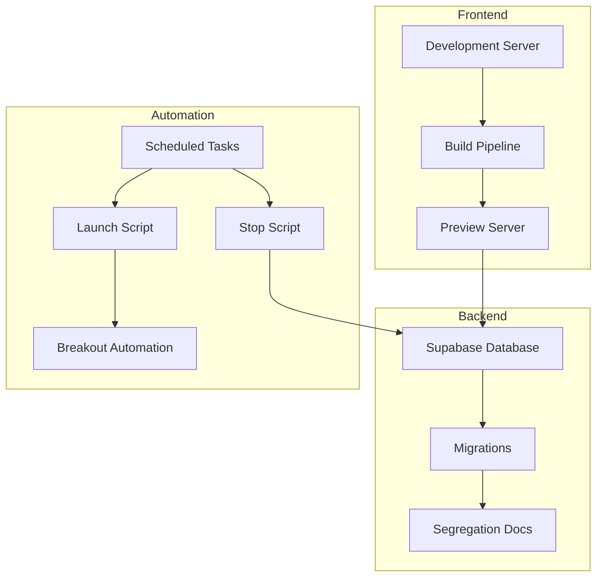
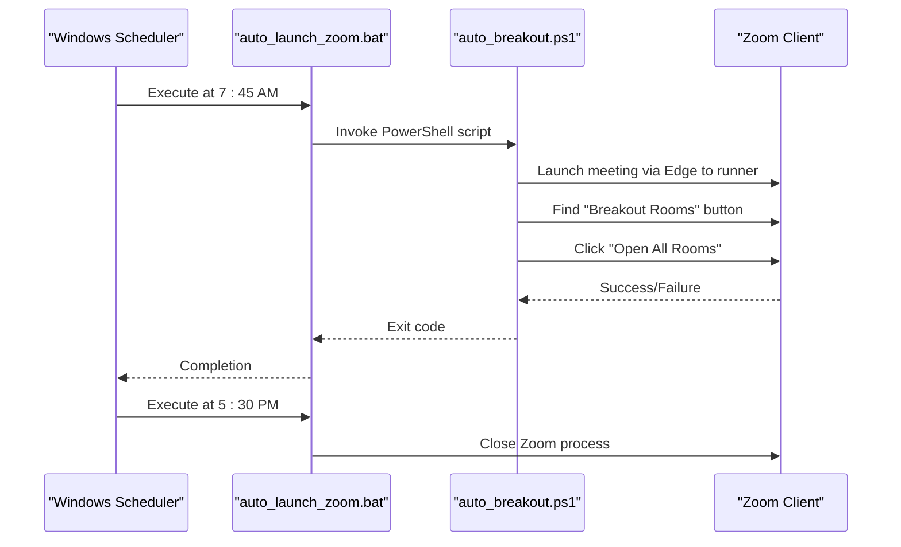
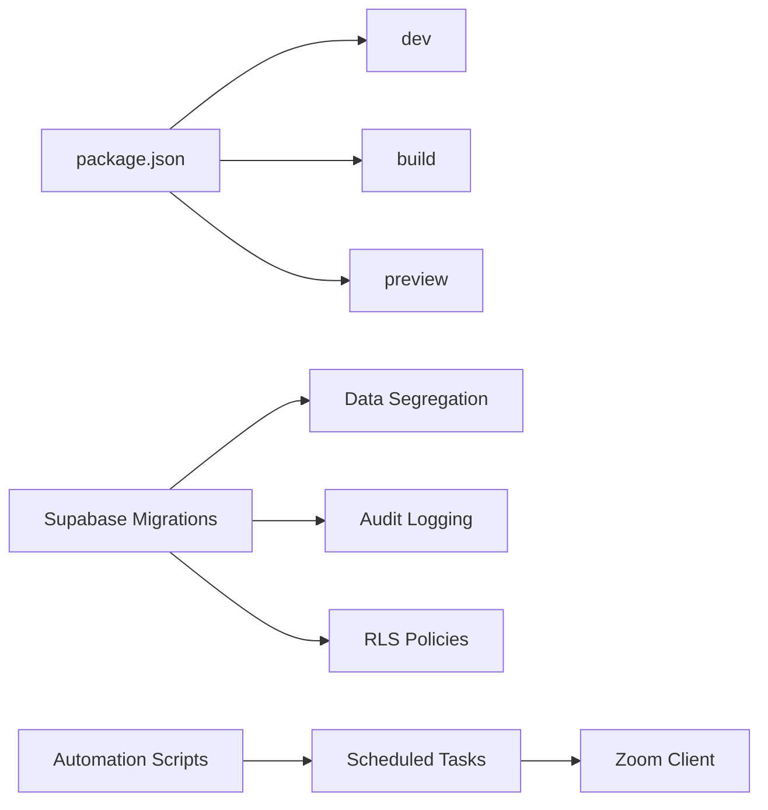

# Maintenance Procedures

<cite>
**Referenced Files in This Document**
- [README.md](file://README.md)
- [package.json](file://package.json)
- [SCHOOL_SEGREGATION.md](file://docs/SCHOOL_SEGREGATION.md)
- [SCHOOL_SEGREGATION_ENHANCEMENTS.md](file://docs/SCHOOL_SEGREGATION_ENHANCEMENTS.md)
- [auto_breakout.ps1](file://bin/zoom-automation/auto_breakout.ps1)
- [auto_launch_zoom.bat](file://bin/zoom-automation/auto_launch_zoom.bat)
- [setup_tasks.bat](file://bin/zoom-automation/setup_tasks.bat)
- [stop_zoom.bat](file://bin/zoom-automation/stop_zoom.bat)
</cite>

## Table of Contents
1. [Introduction](#introduction)
2. [Project Structure](#project-structure)
3. [Core Components](#core-components)
4. [Architecture Overview](#architecture-overview)
5. [Detailed Component Analysis](#detailed-component-analysis)
6. [Dependency Analysis](#dependency-analysis)
7. [Performance Considerations](#performance-considerations)
8. [Troubleshooting Guide](#troubleshooting-guide)
9. [Conclusion](#conclusion)
10. [Appendices](#appendices)

## Introduction
This document provides comprehensive maintenance procedures and operational tasks for the project. It covers system maintenance schedules, backup and restore procedures, routine updates, administrative tasks, user account management, system cleanup, maintenance scripting, automation tasks, operational checklists, and troubleshooting for common maintenance issues and emergencies.

## Project Structure
The repository is a frontend-heavy application with a Supabase backend and a small set of Windows automation scripts for Zoom meetings. Key areas relevant to maintenance include:
- Frontend build and deployment scripts
- Supabase migrations and documentation for data segregation and enhancements
- Windows batch and PowerShell automation for Zoom meeting lifecycle

**Section sources**
- [README.md](file://README.md#L1-L76)
- [package.json](file://package.json#L1-L106)

## Core Components
- Build and deployment scripts for local development and preview
- Supabase data segregation and enhancements documentation
- Zoom automation scripts for launching and stopping meetings

**Section sources**
- [package.json](file://package.json#L6-L11)
- [SCHOOL_SEGREGATION.md](file://docs/SCHOOL_SEGREGATION.md#L1-L260)
- [SCHOOL_SEGREGATION_ENHANCEMENTS.md](file://docs/SCHOOL_SEGREGATION_ENHANCEMENTS.md#L1-L471)

## Architecture Overview
The maintenance architecture centers around three pillars:
- Frontend build pipeline and deployment
- Supabase data segregation and audit/logging infrastructure
- Windows automation for Zoom meeting orchestration

**Diagram sources**
- [package.json](file://package.json#L6-L11)
- [SCHOOL_SEGREGATION.md](file://docs/SCHOOL_SEGREGATION.md#L1-L260)
- [SCHOOL_SEGREGATION_ENHANCEMENTS.md](file://docs/SCHOOL_SEGREGATION_ENHANCEMENTS.md#L1-L471)
- [auto_launch_zoom.bat](file://bin/zoom-automation/auto_launch_zoom.bat#L1-L11)
- [setup_tasks.bat](file://bin/zoom-automation/setup_tasks.bat#L1-L16)
- [stop_zoom.bat](file://bin/zoom-automation/stop_zoom.bat#L1-L6)
- [auto_breakout.ps1](file://bin/zoom-automation/auto_breakout.ps1#L1-L168)

## Detailed Component Analysis

### Maintenance Schedules and Routine Updates
- Development and build lifecycle:
  - Local development server startup
  - Production builds
  - Preview server for testing
- Routine updates:
  - Dependency updates via package manager
  - Supabase migration application and verification

Operational checklist:
- Daily
  - Verify development server runs without errors
  - Review dependency update advisories
- Weekly
  - Apply and test Supabase migrations
  - Verify segregation and audit features
- Monthly
  - Rotate secrets and reconfigure automation tasks
  - Archive logs and backups

**Section sources**
- [README.md](file://README.md#L25-L53)
- [package.json](file://package.json#L6-L11)
- [SCHOOL_SEGREGATION.md](file://docs/SCHOOL_SEGREGATION.md#L187-L224)

### Backup and Restore Procedures
- Database backup
  - Use Supabase’s native backup capabilities prior to applying migrations
- Migration verification
  - Run verification scripts after migrations to ensure correctness
- Rollback strategy
  - Re-apply previous migrations if verification fails

Operational checklist:
- Before migration
  - Create database backup
  - Document current migration state
- After migration
  - Execute verification script
  - Fix any violations found
  - Update application code to use new utilities

**Section sources**
- [SCHOOL_SEGREGATION.md](file://docs/SCHOOL_SEGREGATION.md#L191-L208)

### Administrative Tasks and User Account Management
- User-school access management
  - Track which users have access to which schools and their roles
  - Grant/revoke access programmatically
- Audit logging
  - Automatically track data access and modifications
  - Use audited query builders for automatic logging
- School switching history
  - Track when users switch between schools and academic years
- Data export tracking
  - Monitor all data exports with school context

Operational checklist:
- Initial setup
  - Run enhancement migration
  - Grant users access to schools
  - Integrate logging into export functions
- Ongoing
  - Monitor access logs
  - Alert on unusual export activity
  - Maintain access logs dashboard

**Section sources**
- [SCHOOL_SEGREGATION_ENHANCEMENTS.md](file://docs/SCHOOL_SEGREGATION_ENHANCEMENTS.md#L9-L48)
- [SCHOOL_SEGREGATION_ENHANCEMENTS.md](file://docs/SCHOOL_SEGREGATION_ENHANCEMENTS.md#L50-L104)
- [SCHOOL_SEGREGATION_ENHANCEMENTS.md](file://docs/SCHOOL_SEGREGATION_ENHANCEMENTS.md#L105-L139)
- [SCHOOL_SEGREGATION_ENHANCEMENTS.md](file://docs/SCHOOL_SEGREGATION_ENHANCEMENTS.md#L141-L187)
- [SCHOOL_SEGREGATION_ENHANCEMENTS.md](file://docs/SCHOOL_SEGREGATION_ENHANCEMENTS.md#L390-L427)

### System Cleanup Procedures
- Temporary files and logs
  - Clear browser cache and temporary files after builds
- Automation artifacts
  - Remove stale automation logs and temporary files
- Dependency hygiene
  - Periodically clean unused dependencies and rebuild

Operational checklist:
- Post-build
  - Clean generated assets
  - Remove temporary build artifacts
- Monthly
  - Review and prune automation logs
  - Audit dependency usage

**Section sources**
- [package.json](file://package.json#L6-L11)

### Maintenance Scripting and Automation Tasks
- Zoom meeting automation
  - Scheduled launch and shutdown of Zoom meetings
  - Breakout room automation
- Task scheduling
  - Configure Windows scheduled tasks for recurring automation

**Diagram sources**
- [setup_tasks.bat](file://bin/zoom-automation/setup_tasks.bat#L4-L8)
- [auto_launch_zoom.bat](file://bin/zoom-automation/auto_launch_zoom.bat#L1-L11)
- [auto_breakout.ps1](file://bin/zoom-automation/auto_breakout.ps1#L1-L168)
- [stop_zoom.bat](file://bin/zoom-automation/stop_zoom.bat#L1-L6)

**Section sources**
- [setup_tasks.bat](file://bin/zoom-automation/setup_tasks.bat#L1-L16)
- [auto_launch_zoom.bat](file://bin/zoom-automation/auto_launch_zoom.bat#L1-L11)
- [auto_breakout.ps1](file://bin/zoom-automation/auto_breakout.ps1#L1-L168)
- [stop_zoom.bat](file://bin/zoom-automation/stop_zoom.bat#L1-L6)

### Operational Checklists
- Daily
  - Verify development server and build pipeline
  - Check automation task logs
- Weekly
  - Apply and verify Supabase migrations
  - Review access logs and export statistics
- Monthly
  - Rotate credentials and reconfigure automation tasks
  - Archive and review audit logs

**Section sources**
- [SCHOOL_SEGREGATION.md](file://docs/SCHOOL_SEGREGATION.md#L138-L162)
- [SCHOOL_SEGREGATION_ENHANCEMENTS.md](file://docs/SCHOOL_SEGREGATION_ENHANCEMENTS.md#L360-L388)

## Dependency Analysis
- Frontend dependencies drive build and runtime behavior
- Supabase migrations define data segregation and audit capabilities
- Automation scripts depend on Windows scheduler and Zoom client availability

**Diagram sources**
- [package.json](file://package.json#L6-L11)
- [SCHOOL_SEGREGATION.md](file://docs/SCHOOL_SEGREGATION.md#L1-L260)
- [SCHOOL_SEGREGATION_ENHANCEMENTS.md](file://docs/SCHOOL_SEGREGATION_ENHANCEMENTS.md#L1-L471)
- [setup_tasks.bat](file://bin/zoom-automation/setup_tasks.bat#L1-L16)

**Section sources**
- [package.json](file://package.json#L1-L106)
- [SCHOOL_SEGREGATION.md](file://docs/SCHOOL_SEGREGATION.md#L1-L260)
- [SCHOOL_SEGREGATION_ENHANCEMENTS.md](file://docs/SCHOOL_SEGREGATION_ENHANCEMENTS.md#L1-L471)

## Performance Considerations
- Data segregation relies on composite indexes and validation triggers
- Audit logging and export tracking should be monitored for performance impact
- Automation scripts should minimize UI polling and use targeted element detection

[No sources needed since this section provides general guidance]

## Troubleshooting Guide
- Data segregation violations
  - Cause: Attempting to insert/update with mismatched school-academic year
  - Solution: Verify academic year belongs to the correct school
- School context errors
  - Cause: Attempting database operation without school context
  - Solution: Ensure school context is properly initialized
- RLS blocking legitimate access
  - Cause: User lacks access to the target school
  - Solution: Grant user access to the school
- Logs not appearing
  - Cause: RLS policies prevent log insertion
  - Solution: Allow system insertion for logs
- Performance degradation
  - Cause: Missing indexes or inefficient queries
  - Solution: Ensure indexes are created and verify query plans

**Section sources**
- [SCHOOL_SEGREGATION.md](file://docs/SCHOOL_SEGREGATION.md#L225-L238)
- [SCHOOL_SEGREGATION_ENHANCEMENTS.md](file://docs/SCHOOL_SEGREGATION_ENHANCEMENTS.md#L429-L456)

## Conclusion
This document outlines a comprehensive maintenance and operations framework for the project, covering development workflows, database integrity, administrative controls, and automation. By following the provided schedules, checklists, and troubleshooting steps, administrators can maintain a reliable and secure system.

[No sources needed since this section summarizes without analyzing specific files]

## Appendices
- Emergency procedures
  - Immediate rollback of failing migrations
  - Disable automation tasks during incidents
  - Notify stakeholders and escalate as needed

[No sources needed since this section provides general guidance]