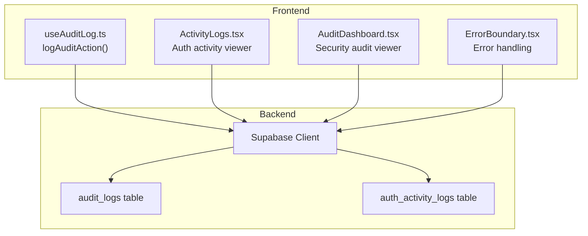
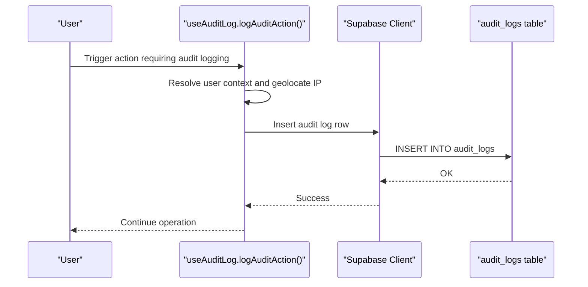
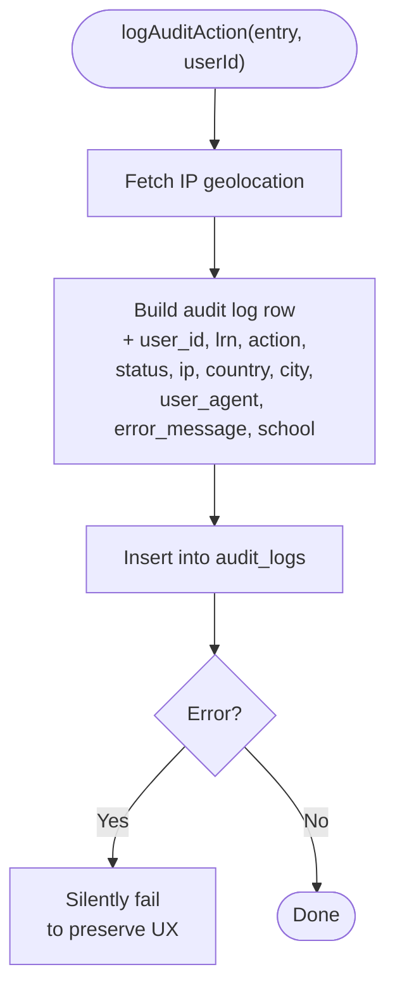
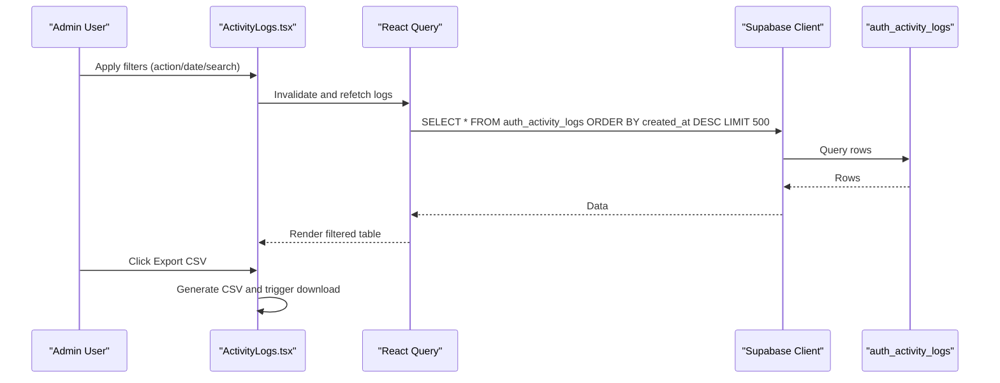
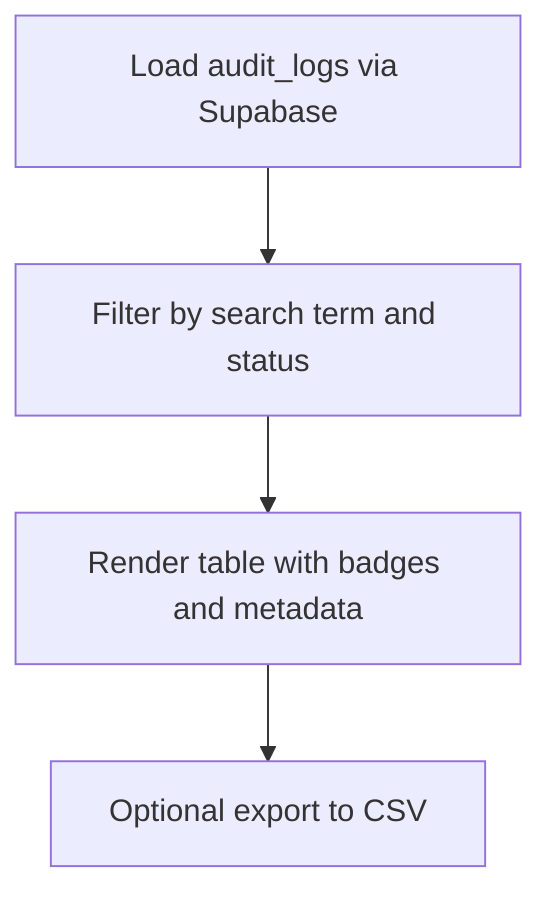
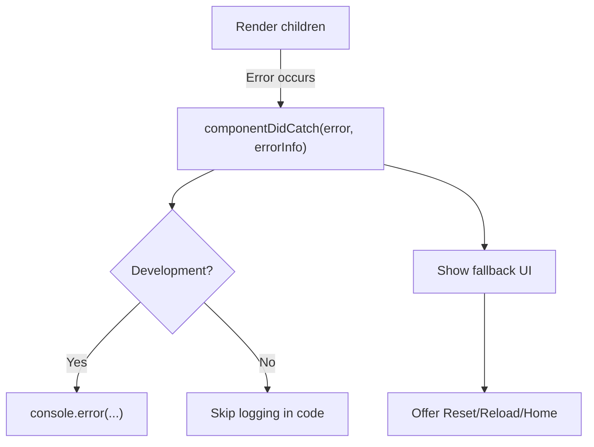
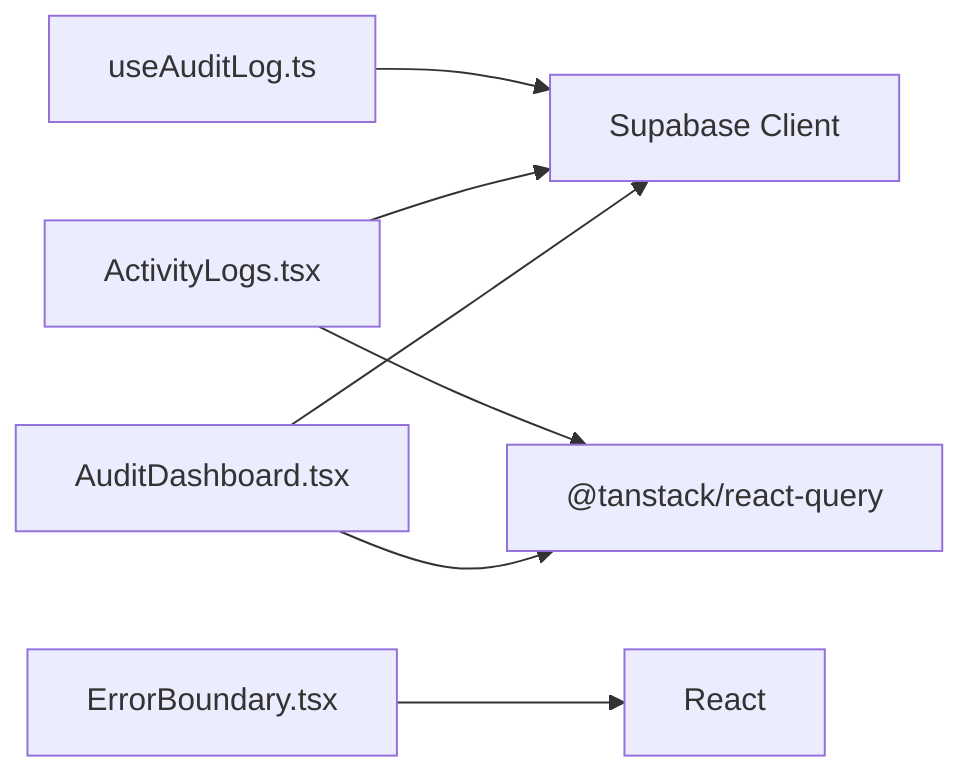
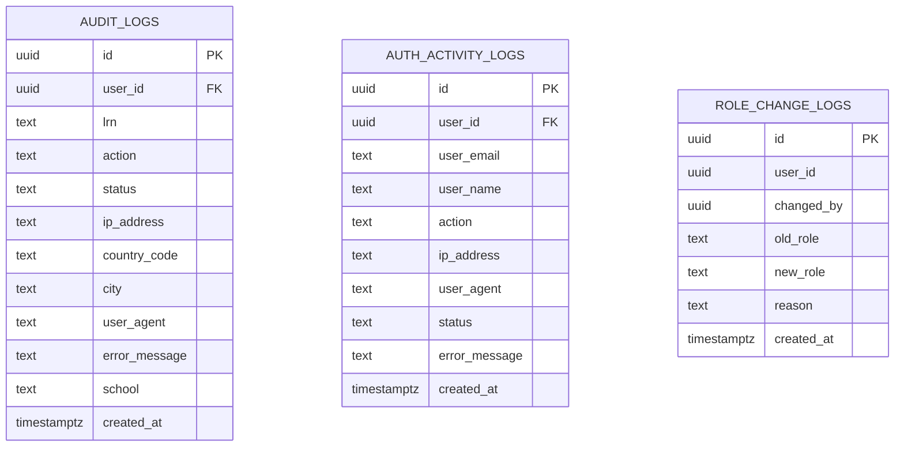

# Monitoring & Logging

<cite>
**Referenced Files in This Document**
- [useAuditLog.ts](file://src/hooks/useAuditLog.ts)
- [ActivityLogs.tsx](file://src/components/admin/ActivityLogs.tsx)
- [AuditDashboard.tsx](file://src/components/management/AuditDashboard.tsx)
- [ErrorBoundary.tsx](file://src/components/ErrorBoundary.tsx)
- [create_audit_logs.sql](file://supabase/migrations/20260209100000_create_audit_logs.sql)
- [auth_activity_logs.sql](file://supabase/migrations/20260205175436_9782a261-cedc-492e-8661-d963b348e86e.sql)
- [package.json](file://package.json)
</cite>

## Table of Contents
1. [Introduction](#introduction)
2. [Project Structure](#project-structure)
3. [Core Components](#core-components)
4. [Architecture Overview](#architecture-overview)
5. [Detailed Component Analysis](#detailed-component-analysis)
6. [Dependency Analysis](#dependency-analysis)
7. [Performance Considerations](#performance-considerations)
8. [Troubleshooting Guide](#troubleshooting-guide)
9. [Conclusion](#conclusion)
10. [Appendices](#appendices)

## Introduction
This document explains the system monitoring and logging infrastructure implemented in the project. It covers audit logging, activity tracking, error handling, and the foundation for performance monitoring and system health checks. It also outlines how to configure dashboards, alerts, and metrics collection, and provides practical examples for log analysis and troubleshooting.

## Project Structure
The monitoring and logging system spans frontend components and backend database tables:
- Frontend logging hook and UI dashboards for audit and authentication activity
- Backend tables for storing audit logs and authentication activity logs
- Error boundary for catching runtime errors and providing fallback UI

**Diagram sources**
- [useAuditLog.ts](file://src/hooks/useAuditLog.ts#L23-L60)
- [ActivityLogs.tsx](file://src/components/admin/ActivityLogs.tsx#L58-L88)
- [AuditDashboard.tsx](file://src/components/management/AuditDashboard.tsx#L40-L52)
- [ErrorBoundary.tsx](file://src/components/ErrorBoundary.tsx#L25-L50)
- [create_audit_logs.sql](file://supabase/migrations/20260209100000_create_audit_logs.sql#L1-L38)
- [auth_activity_logs.sql](file://supabase/migrations/20260205175436_9782a261-cedc-492e-8661-d963b348e86e.sql#L1-L64)

**Section sources**
- [useAuditLog.ts](file://src/hooks/useAuditLog.ts#L1-L69)
- [ActivityLogs.tsx](file://src/components/admin/ActivityLogs.tsx#L1-L312)
- [AuditDashboard.tsx](file://src/components/management/AuditDashboard.tsx#L1-L205)
- [ErrorBoundary.tsx](file://src/components/ErrorBoundary.tsx#L1-L206)
- [create_audit_logs.sql](file://supabase/migrations/20260209100000_create_audit_logs.sql#L1-L38)
- [auth_activity_logs.sql](file://supabase/migrations/20260205175436_9782a261-cedc-492e-8661-d963b348e86e.sql#L1-L64)

## Core Components
- Audit logging hook: Centralized function to record security-relevant actions with location and device metadata.
- Authentication activity dashboard: Real-time view of login/logout/failure events with filtering and export.
- Security audit dashboard: Historical view of system-wide audit events with search and status filters.
- Error boundary: React error boundary to gracefully handle runtime errors and present actionable feedback.

**Section sources**
- [useAuditLog.ts](file://src/hooks/useAuditLog.ts#L23-L60)
- [ActivityLogs.tsx](file://src/components/admin/ActivityLogs.tsx#L58-L88)
- [AuditDashboard.tsx](file://src/components/management/AuditDashboard.tsx#L40-L52)
- [ErrorBoundary.tsx](file://src/components/ErrorBoundary.tsx#L25-L50)

## Architecture Overview
The logging architecture integrates frontend actions with backend persistence via Supabase. Audit events are captured client-side and inserted into dedicated tables. Dashboards query these tables to present filtered views and enable exports. Error boundaries capture frontend exceptions and provide fallback UI.

**Diagram sources**
- [useAuditLog.ts](file://src/hooks/useAuditLog.ts#L23-L60)
- [create_audit_logs.sql](file://supabase/migrations/20260209100000_create_audit_logs.sql#L1-L38)

## Detailed Component Analysis

### Audit Logging Hook
The hook centralizes audit logging with:
- Action typing and structured entry schema
- Optional user identification
- IP geolocation lookup for location metadata
- Supabase insertion with error handling
- Graceful failure to avoid breaking UX

**Diagram sources**
- [useAuditLog.ts](file://src/hooks/useAuditLog.ts#L23-L60)

**Section sources**
- [useAuditLog.ts](file://src/hooks/useAuditLog.ts#L1-L69)

### Authentication Activity Dashboard
The dashboard provides:
- Filtering by action type and date range
- Search across user email, name, and IP address
- Export to CSV for external analysis
- Status badges and icon indicators

**Diagram sources**
- [ActivityLogs.tsx](file://src/components/admin/ActivityLogs.tsx#L58-L88)
- [auth_activity_logs.sql](file://supabase/migrations/20260205175436_9782a261-cedc-492e-8661-d963b348e86e.sql#L1-L64)

**Section sources**
- [ActivityLogs.tsx](file://src/components/admin/ActivityLogs.tsx#L1-L312)

### Security Audit Dashboard
The dashboard enables:
- Search across LRN, action, and error messages
- Status filter (all, success, failure)
- Rich display of location, device, and timestamps

**Diagram sources**
- [AuditDashboard.tsx](file://src/components/management/AuditDashboard.tsx#L40-L52)
- [create_audit_logs.sql](file://supabase/migrations/20260209100000_create_audit_logs.sql#L1-L38)

**Section sources**
- [AuditDashboard.tsx](file://src/components/management/AuditDashboard.tsx#L1-L205)

### Error Boundary
The error boundary:
- Catches JavaScript errors in the component tree
- Provides fallback UI with reset/reload/home actions
- Logs error details in development
- Leaves room for integrating external error tracking in production

**Diagram sources**
- [ErrorBoundary.tsx](file://src/components/ErrorBoundary.tsx#L25-L50)

**Section sources**
- [ErrorBoundary.tsx](file://src/components/ErrorBoundary.tsx#L1-L206)

## Dependency Analysis
- Frontend dependencies relevant to monitoring:
  - Supabase client for database operations
  - React Query for caching and querying logs
  - UI libraries for dashboards and tables
  - Date formatting and CSV export utilities

**Diagram sources**
- [useAuditLog.ts](file://src/hooks/useAuditLog.ts#L1-L3)
- [ActivityLogs.tsx](file://src/components/admin/ActivityLogs.tsx#L1-L37)
- [AuditDashboard.tsx](file://src/components/management/AuditDashboard.tsx#L1-L28)
- [ErrorBoundary.tsx](file://src/components/ErrorBoundary.tsx#L8-L11)
- [package.json](file://package.json#L42-L84)

**Section sources**
- [package.json](file://package.json#L13-L84)

## Performance Considerations
- Database indexing: The audit and auth activity tables include indexes on frequently queried columns to improve filter and sort performance.
- Pagination and limits: Dashboards limit returned rows and rely on server-side ordering to keep queries fast.
- Client-side filtering: Additional client-side filtering is applied after fetching limited datasets to reduce payload sizes.
- Graceful degradation: Logging failures do not block user actions, ensuring resilience under network or database issues.

**Section sources**
- [create_audit_logs.sql](file://supabase/migrations/20260209100000_create_audit_logs.sql#L34-L38)
- [auth_activity_logs.sql](file://supabase/migrations/20260205175436_9782a261-cedc-492e-8661-d963b348e86e.sql#L59-L64)
- [ActivityLogs.tsx](file://src/components/admin/ActivityLogs.tsx#L64-L65)
- [AuditDashboard.tsx](file://src/components/management/AuditDashboard.tsx#L46-L47)

## Troubleshooting Guide
- Audit logs not appearing:
  - Verify the logging hook is invoked for target actions.
  - Confirm Supabase policies allow inserts for the current session.
  - Check browser console for network errors during insertion.
- Authentication activity logs missing:
  - Ensure the auth activity table exists and is populated by the authentication flow.
  - Confirm the dashboard filters are not excluding the desired date range or action type.
- Export to CSV yields empty results:
  - Adjust filters to broaden the dataset.
  - Confirm the table has recent entries.
- Frontend crashes:
  - Inspect the error boundary fallback UI for immediate feedback.
  - In development, review the console for captured error details.
  - In production, integrate an external error tracking service in the error boundary.

**Section sources**
- [useAuditLog.ts](file://src/hooks/useAuditLog.ts#L53-L59)
- [ActivityLogs.tsx](file://src/components/admin/ActivityLogs.tsx#L81-L84)
- [ErrorBoundary.tsx](file://src/components/ErrorBoundary.tsx#L44-L49)

## Conclusion
The project implements a robust client-driven audit logging system with dedicated backend storage and user-friendly dashboards for monitoring authentication activity and security events. Error boundaries provide resilient error handling. With proper indexing and dashboard filters, the system supports efficient log analysis and troubleshooting. Extending the infrastructure to include performance metrics and alerting requires adding metrics collection and integrating with a monitoring platform.

## Appendices

### Database Schema Overview
- audit_logs: Stores security-relevant actions with user identity, location, device, and error context.
- auth_activity_logs: Tracks login/logout/failure events with user identifiers and timestamps.

**Diagram sources**
- [create_audit_logs.sql](file://supabase/migrations/20260209100000_create_audit_logs.sql#L1-L38)
- [auth_activity_logs.sql](file://supabase/migrations/20260205175436_9782a261-cedc-492e-8661-d963b348e86e.sql#L1-L64)

### Log Analysis Examples
- Investigating failed login spikes:
  - Filter authentication activity logs by action “failed_login” and a recent date range.
  - Export CSV and analyze by IP address or user agent to detect patterns.
- Reviewing impersonation activity:
  - Query audit logs for actions “impersonation_start” and “impersonation_stop”.
  - Cross-reference with user roles and timestamps to confirm authorization.
- Tracking data exports:
  - Filter audit logs by action “data_export” and review LRN and error messages for anomalies.

[No sources needed since this section provides general guidance]