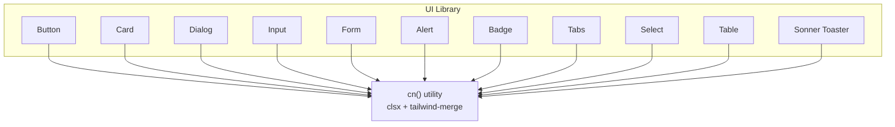
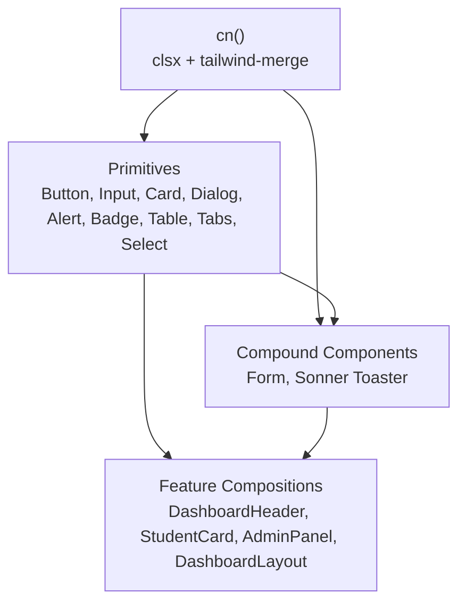
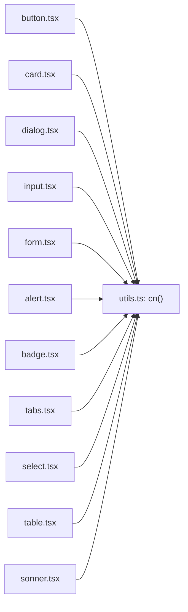

# Component Library & UI Patterns

<cite>
**Referenced Files in This Document**
- [components.json](file://components.json)
- [utils.ts](file://src/lib/utils.ts)
- [button.tsx](file://src/components/ui/button.tsx)
- [card.tsx](file://src/components/ui/card.tsx)
- [dialog.tsx](file://src/components/ui/dialog.tsx)
- [input.tsx](file://src/components/ui/input.tsx)
- [form.tsx](file://src/components/ui/form.tsx)
- [alert.tsx](file://src/components/ui/alert.tsx)
- [badge.tsx](file://src/components/ui/badge.tsx)
- [table.tsx](file://src/components/ui/table.tsx)
- [tabs.tsx](file://src/components/ui/tabs.tsx)
- [select.tsx](file://src/components/ui/select.tsx)
- [sonner.tsx](file://src/components/ui/sonner.tsx)
- [use-toast.ts](file://src/components/ui/use-toast.ts)
- [DashboardHeader.tsx](file://src/components/dashboard/DashboardHeader.tsx)
- [StudentCard.tsx](file://src/components/students/StudentCard.tsx)
- [AdminPanel.tsx](file://src/components/admin/AdminPanel.tsx)
- [DashboardLayout.tsx](file://src/components/layout/DashboardLayout.tsx)
</cite>

## Table of Contents
1. [Introduction](#introduction)
2. [Project Structure](#project-structure)
3. [Core Components](#core-components)
4. [Architecture Overview](#architecture-overview)
5. [Detailed Component Analysis](#detailed-component-analysis)
6. [Dependency Analysis](#dependency-analysis)
7. [Performance Considerations](#performance-considerations)
8. [Troubleshooting Guide](#troubleshooting-guide)
9. [Conclusion](#conclusion)
10. [Appendices](#appendices)

## Introduction
This document describes the component library and UI patterns used across the application. It explains how shadcn/ui is integrated, how components are composed, and how reusable UI elements are standardized. It also documents the custom utility function for conditional class merging, common prop interfaces, styling approaches, accessibility considerations, and practical patterns for combining components across features.

## Project Structure
The UI system is organized around a dedicated components/ui directory that mirrors shadcn/ui primitives and compound components. A shared utility function centralizes Tailwind class merging. The configuration file components.json defines the framework’s conventions and aliases.

**Diagram sources**
- [button.tsx](file://src/components/ui/button.tsx#L1-L59)
- [card.tsx](file://src/components/ui/card.tsx#L1-L44)
- [dialog.tsx](file://src/components/ui/dialog.tsx#L1-L96)
- [input.tsx](file://src/components/ui/input.tsx#L1-L23)
- [form.tsx](file://src/components/ui/form.tsx#L1-L130)
- [alert.tsx](file://src/components/ui/alert.tsx#L1-L44)
- [badge.tsx](file://src/components/ui/badge.tsx#L1-L33)
- [table.tsx](file://src/components/ui/table.tsx#L1-L73)
- [tabs.tsx](file://src/components/ui/tabs.tsx#L1-L54)
- [select.tsx](file://src/components/ui/select.tsx#L1-L144)
- [sonner.tsx](file://src/components/ui/sonner.tsx#L1-L28)
- [utils.ts](file://src/lib/utils.ts#L1-L7)

**Section sources**
- [components.json](file://components.json#L1-L21)
- [utils.ts](file://src/lib/utils.ts#L1-L7)

## Core Components
This section outlines the core UI primitives and compound components that form the foundation of the design system.

- Button
  - Variants: default, destructive, outline, secondary, ghost, link, success, warning, info, gradient
  - Sizes: default, sm, lg, xl, icon
  - Props: standard button attributes plus variant, size, asChild
  - Accessibility: inherits native button semantics; supports focus-visible ring styles
  - Styling: uses class variance authority (CVA) with consistent spacing and transitions

- Card
  - Composition: Card, CardHeader, CardTitle, CardDescription, CardContent, CardFooter
  - Styling: consistent rounded corners, borders, shadows, and typography scales
  - Accessibility: semantic headings and paragraphs for content hierarchy

- Dialog
  - Composition: Root, Portal, Overlay, Content, Trigger, Close, Header, Footer, Title, Description
  - Behavior: overlay backdrop, centered content, close button with sr-only label
  - Accessibility: manages focus trapping and keyboard interactions via Radix UI

- Input
  - Styling: consistent padding, border, placeholder, focus-visible ring
  - Accessibility: integrates with form components and labels

- Form
  - Composition: Form, FormField, FormItem, FormLabel, FormControl, FormDescription, FormMessage, useFormField
  - Behavior: integrates with react-hook-form; manages aria attributes and error states
  - Accessibility: sets aria-invalid and aria-describedby based on field state

- Alert
  - Variants: default, destructive
  - Accessibility: role="alert"; supports nested SVG icons

- Badge
  - Variants: default, secondary, destructive, outline
  - Accessibility: inline element; suitable for status indicators

- Tabs
  - Composition: Root, List, Trigger, Content
  - Accessibility: uses Radix UI primitives for keyboard navigation and focus management

- Select
  - Composition: Root, Group, Value, Trigger, Content, Label, Item, Separator, ScrollUp/DownButton
  - Behavior: portal-based overlay, viewport sizing, scroll buttons, selection indicators
  - Accessibility: supports keyboard navigation and screen reader announcements

- Table
  - Composition: Table, TableHeader, TableBody, TableFooter, TableHead, TableRow, TableCell, TableCaption
  - Styling: responsive wrapper, alternating row backgrounds, header emphasis

- Sonner Toaster
  - Composition: Toaster, toast
  - Theming: adapts to current theme (light/dark/system) and applies consistent class names

**Section sources**
- [button.tsx](file://src/components/ui/button.tsx#L1-L59)
- [card.tsx](file://src/components/ui/card.tsx#L1-L44)
- [dialog.tsx](file://src/components/ui/dialog.tsx#L1-L96)
- [input.tsx](file://src/components/ui/input.tsx#L1-L23)
- [form.tsx](file://src/components/ui/form.tsx#L1-L130)
- [alert.tsx](file://src/components/ui/alert.tsx#L1-L44)
- [badge.tsx](file://src/components/ui/badge.tsx#L1-L33)
- [table.tsx](file://src/components/ui/table.tsx#L1-L73)
- [tabs.tsx](file://src/components/ui/tabs.tsx#L1-L54)
- [select.tsx](file://src/components/ui/select.tsx#L1-L144)
- [sonner.tsx](file://src/components/ui/sonner.tsx#L1-L28)

## Architecture Overview
The UI architecture follows a layered pattern:
- Utility layer: cn() merges classes safely using clsx and tailwind-merge
- Primitive layer: shadcn/ui-inspired components built with Radix UI and CVA
- Compound component layer: composed patterns (e.g., Form, Tabs, Select)
- Feature layer: page-specific compositions (e.g., DashboardHeader, StudentCard, AdminPanel)

**Diagram sources**
- [utils.ts](file://src/lib/utils.ts#L1-L7)
- [button.tsx](file://src/components/ui/button.tsx#L1-L59)
- [input.tsx](file://src/components/ui/input.tsx#L1-L23)
- [card.tsx](file://src/components/ui/card.tsx#L1-L44)
- [dialog.tsx](file://src/components/ui/dialog.tsx#L1-L96)
- [alert.tsx](file://src/components/ui/alert.tsx#L1-L44)
- [badge.tsx](file://src/components/ui/badge.tsx#L1-L33)
- [table.tsx](file://src/components/ui/table.tsx#L1-L73)
- [tabs.tsx](file://src/components/ui/tabs.tsx#L1-L54)
- [select.tsx](file://src/components/ui/select.tsx#L1-L144)
- [form.tsx](file://src/components/ui/form.tsx#L1-L130)
- [sonner.tsx](file://src/components/ui/sonner.tsx#L1-L28)
- [DashboardHeader.tsx](file://src/components/dashboard/DashboardHeader.tsx#L1-L105)
- [StudentCard.tsx](file://src/components/students/StudentCard.tsx#L1-L128)
- [AdminPanel.tsx](file://src/components/admin/AdminPanel.tsx#L1-L229)
- [DashboardLayout.tsx](file://src/components/layout/DashboardLayout.tsx#L1-L800)

## Detailed Component Analysis

### cn() Utility Function
Purpose:
- Merge conditional Tailwind classes reliably, resolving conflicts with tailwind-merge
- Centralized utility consumed by all UI components

Usage pattern:
- Accepts multiple inputs and returns a single merged class string
- Ensures later classes override earlier ones appropriately

Guidelines:
- Prefer cn() over manual concatenation
- Combine base styles with variant-driven classes from CVA

**Section sources**
- [utils.ts](file://src/lib/utils.ts#L1-L7)

### Button Component
Composition:
- Uses Slot for polymorphic rendering (asChild)
- CVA-driven variants and sizes
- Focus-visible ring and transition effects

Accessibility:
- Inherits button semantics; supports keyboard activation
- Disabled state prevents interaction and reduces opacity

Common patterns:
- Icon buttons with size="icon"
- Gradient variant for prominent actions
- Ghost variant for subtle secondary actions

**Section sources**
- [button.tsx](file://src/components/ui/button.tsx#L1-L59)

### Card Component Family
Composition:
- Card container with background and border
- CardHeader, CardTitle, CardDescription, CardContent, CardFooter
- Consistent spacing and typography

Patterns:
- Use CardHeader + CardTitle for section headers
- Place actions in CardFooter
- Use CardContent to wrap dense content

**Section sources**
- [card.tsx](file://src/components/ui/card.tsx#L1-L44)

### Dialog Component Family
Composition:
- Overlay with backdrop blur and fade animations
- Content with slide/fade/zoom transitions
- Close button with sr-only label for accessibility

Patterns:
- Use DialogTrigger to open dialogs
- Wrap actionable content in DialogFooter
- Pair DialogTitle and DialogDescription for context

**Section sources**
- [dialog.tsx](file://src/components/ui/dialog.tsx#L1-L96)

### Input Component
Styling:
- Consistent height, padding, border, placeholder, and focus ring
- Responsive font sizing

Patterns:
- Combine with FormLabel and FormMessage for form layouts
- Use type="password" and similar HTML5 types

**Section sources**
- [input.tsx](file://src/components/ui/input.tsx#L1-L23)

### Form Component Family
Composition:
- Form provider context
- FormField wraps react-hook-form Controller
- FormItem manages IDs and aria attributes
- FormLabel, FormControl, FormDescription, FormMessage
- useFormField hook centralizes field state and aria attributes

Accessibility:
- Sets aria-invalid and aria-describedby automatically
- Ensures labels are associated with controls

Patterns:
- Wrap inputs in FormItem/FormLabel/FormControl/FormMessage
- Use FormDescription for helper text

**Section sources**
- [form.tsx](file://src/components/ui/form.tsx#L1-L130)

### Alert Component
Variants:
- default: neutral background
- destructive: red-based palette with destructive border

Patterns:
- Use Alert with AlertTitle and AlertDescription for notifications
- Place icon as the first child for proper spacing

**Section sources**
- [alert.tsx](file://src/components/ui/alert.tsx#L1-L44)

### Badge Component
Variants:
- default, secondary, destructive, outline

Patterns:
- Use for status indicators (active/inactive, priority)
- Combine with icons for richer meaning

**Section sources**
- [badge.tsx](file://src/components/ui/badge.tsx#L1-L33)

### Table Component Family
Composition:
- Responsive wrapper with overflow handling
- Header/body/footer sections with alternating row styles
- Emphasized header text and hover states

Patterns:
- Use TableCaption for summaries
- Pair TableHead with TableRow/TableCell for structured data

**Section sources**
- [table.tsx](file://src/components/ui/table.tsx#L1-L73)

### Tabs Component Family
Composition:
- Root, List, Trigger, Content
- Active state styling and focus-visible rings

Patterns:
- Use TabsList for trigger arrangement
- Keep TabContent minimal and focused

**Section sources**
- [tabs.tsx](file://src/components/ui/tabs.tsx#L1-L54)

### Select Component Family
Composition:
- Root, Trigger, Content, Item, Label, Separator, ScrollUp/DownButton
- Portal-based overlay with positioning variants
- Selection indicators and scroll buttons

Patterns:
- Use SelectValue for display text
- Use SelectLabel for grouping
- Use SelectSeparator for dividers

**Section sources**
- [select.tsx](file://src/components/ui/select.tsx#L1-L144)

### Sonner Toaster
Composition:
- Toaster with theme-aware styling
- toast helper for imperative notifications

Patterns:
- Use toast.success/info/warning/error for feedback
- Use use-toast export for hook-based usage

**Section sources**
- [sonner.tsx](file://src/components/ui/sonner.tsx#L1-L28)
- [use-toast.ts](file://src/components/ui/use-toast.ts#L1-L4)

### Feature-Level Compositions

#### DashboardHeader
- Integrates Button, Avatar, DropdownMenu, and themed badges
- Uses cn() for dynamic class composition
- Demonstrates icon-button patterns and notification badges

**Section sources**
- [DashboardHeader.tsx](file://src/components/dashboard/DashboardHeader.tsx#L1-L105)

#### StudentCard
- Combines Button, Badge, and layout utilities
- Uses motion for entrance animations
- Shows hover-triggered actions and status indicators

**Section sources**
- [StudentCard.tsx](file://src/components/students/StudentCard.tsx#L1-L128)

#### AdminPanel
- Uses Tabs, Button, and form-like cards
- Implements destructive actions with confirmation patterns
- Demonstrates danger-zone banners and loading states

**Section sources**
- [AdminPanel.tsx](file://src/components/admin/AdminPanel.tsx#L1-L229)

#### DashboardLayout
- Complex navigation with collapsible groups and role-based visibility
- Uses Button, Collapsible, DropdownMenu, and themed badges
- Implements animated transitions and responsive behavior

**Section sources**
- [DashboardLayout.tsx](file://src/components/layout/DashboardLayout.tsx#L1-L800)

## Dependency Analysis
The UI library exhibits low coupling and high cohesion:
- All primitives depend on cn() for class merging
- Compound components depend on primitives and Radix UI
- Feature components depend on primitives and compound components
- No circular dependencies observed among UI components

**Diagram sources**
- [utils.ts](file://src/lib/utils.ts#L1-L7)
- [button.tsx](file://src/components/ui/button.tsx#L1-L59)
- [card.tsx](file://src/components/ui/card.tsx#L1-L44)
- [dialog.tsx](file://src/components/ui/dialog.tsx#L1-L96)
- [input.tsx](file://src/components/ui/input.tsx#L1-L23)
- [form.tsx](file://src/components/ui/form.tsx#L1-L130)
- [alert.tsx](file://src/components/ui/alert.tsx#L1-L44)
- [badge.tsx](file://src/components/ui/badge.tsx#L1-L33)
- [table.tsx](file://src/components/ui/table.tsx#L1-L73)
- [tabs.tsx](file://src/components/ui/tabs.tsx#L1-L54)
- [select.tsx](file://src/components/ui/select.tsx#L1-L144)
- [sonner.tsx](file://src/components/ui/sonner.tsx#L1-L28)

**Section sources**
- [utils.ts](file://src/lib/utils.ts#L1-L7)
- [button.tsx](file://src/components/ui/button.tsx#L1-L59)
- [card.tsx](file://src/components/ui/card.tsx#L1-L44)
- [dialog.tsx](file://src/components/ui/dialog.tsx#L1-L96)
- [input.tsx](file://src/components/ui/input.tsx#L1-L23)
- [form.tsx](file://src/components/ui/form.tsx#L1-L130)
- [alert.tsx](file://src/components/ui/alert.tsx#L1-L44)
- [badge.tsx](file://src/components/ui/badge.tsx#L1-L33)
- [table.tsx](file://src/components/ui/table.tsx#L1-L73)
- [tabs.tsx](file://src/components/ui/tabs.tsx#L1-L54)
- [select.tsx](file://src/components/ui/select.tsx#L1-L144)
- [sonner.tsx](file://src/components/ui/sonner.tsx#L1-L28)

## Performance Considerations
- Prefer CVA variants for consistent class generation and reduced runtime overhead
- Use cn() to avoid redundant class concatenations and minimize reflows
- Limit heavy animations to interactive states (e.g., hover/tap) to maintain responsiveness
- Defer non-critical DOM updates in feature compositions (e.g., DashboardLayout) to keep UI snappy

## Troubleshooting Guide
Common issues and resolutions:
- Conflicting Tailwind classes
  - Symptom: unexpected overrides or missing styles
  - Resolution: use cn() to merge classes; ensure order places desired overrides last
- Form accessibility errors
  - Symptom: screen readers announce incorrect labels or states
  - Resolution: ensure FormLabel associates with the control and FormMessage renders when errors exist
- Dialog focus issues
  - Symptom: focus escapes or remains trapped
  - Resolution: rely on Dialog primitives; ensure Close button exists and is reachable via keyboard
- Select scrolling and alignment
  - Symptom: viewport misalignment or scroll buttons not visible
  - Resolution: use SelectScrollUp/DownButton and ensure SelectContent portal is rendered

**Section sources**
- [utils.ts](file://src/lib/utils.ts#L1-L7)
- [form.tsx](file://src/components/ui/form.tsx#L1-L130)
- [dialog.tsx](file://src/components/ui/dialog.tsx#L1-L96)
- [select.tsx](file://src/components/ui/select.tsx#L1-L144)

## Conclusion
The component library establishes a consistent, accessible, and extensible UI foundation. By centralizing class merging with cn(), leveraging CVA for variants, and composing primitives into compound components, the system promotes reuse and maintainability. Feature-level compositions demonstrate practical patterns for building complex interfaces while preserving accessibility and performance.

## Appendices

### Shadcn/UI Integration Summary
- Style: default
- RSC: false
- TSX: true
- Tailwind config: tailwind.config.ts
- CSS: src/index.css
- Base color: slate
- CSS variables: enabled
- Aliases:
  - components → @/components
  - utils → @/lib/utils
  - ui → @/components/ui
  - lib → @/lib
  - hooks → @/hooks

**Section sources**
- [components.json](file://components.json#L1-L21)