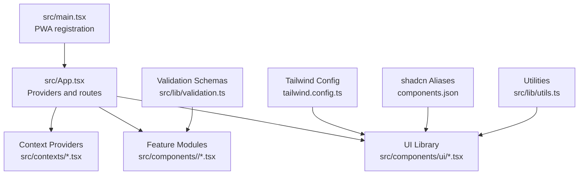
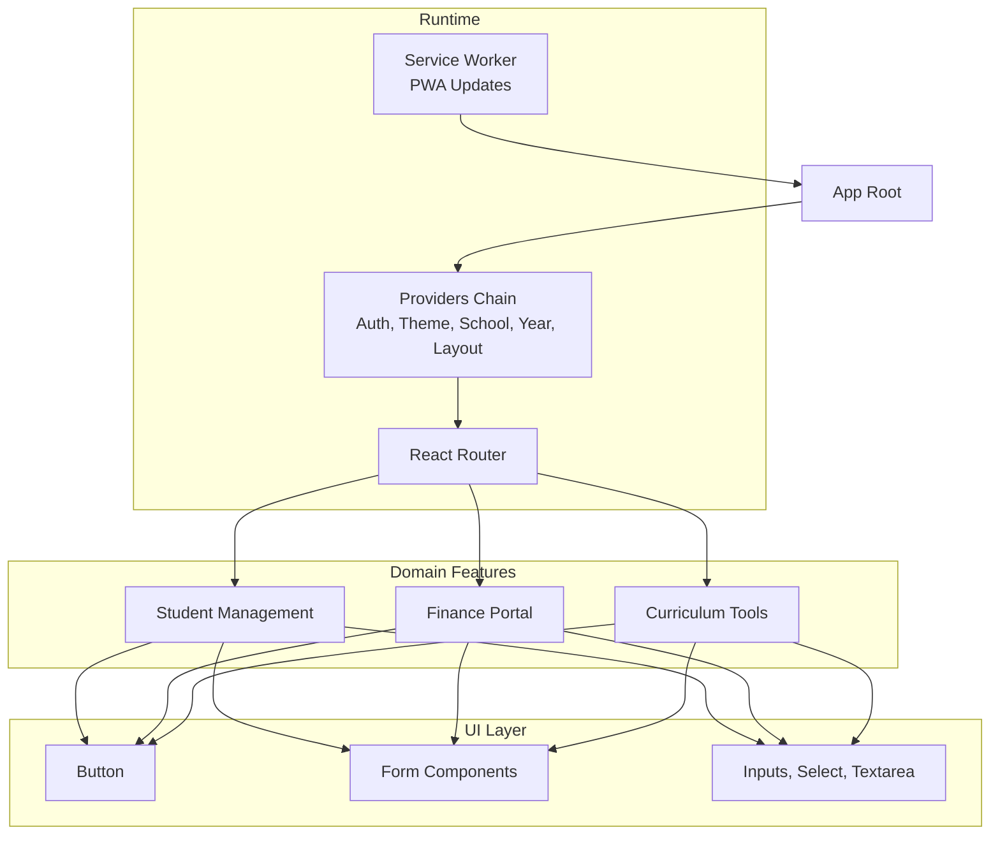
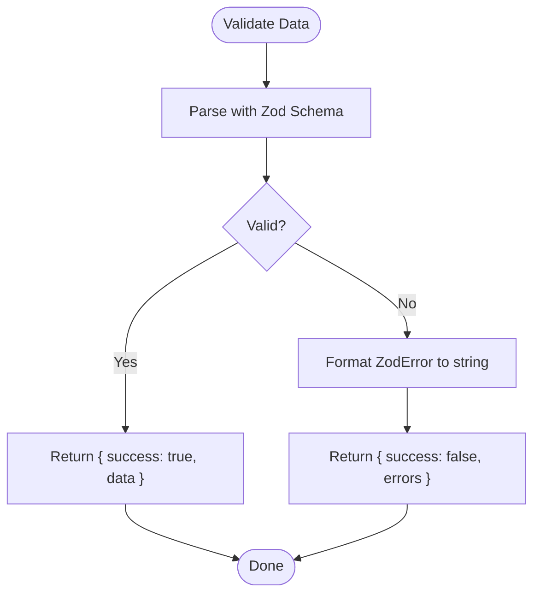
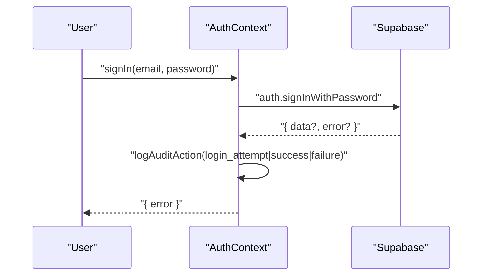
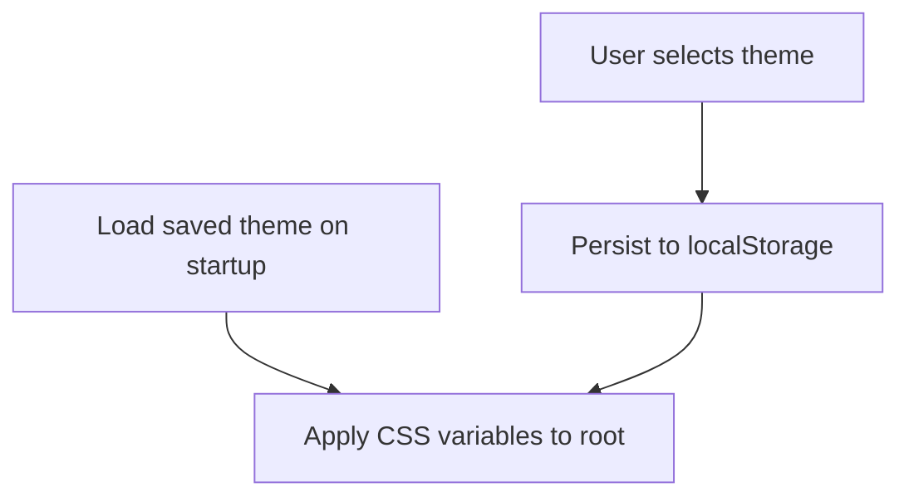
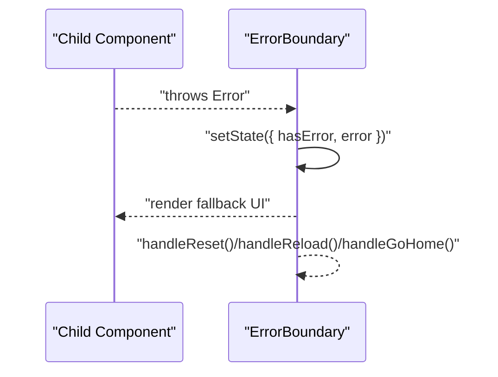
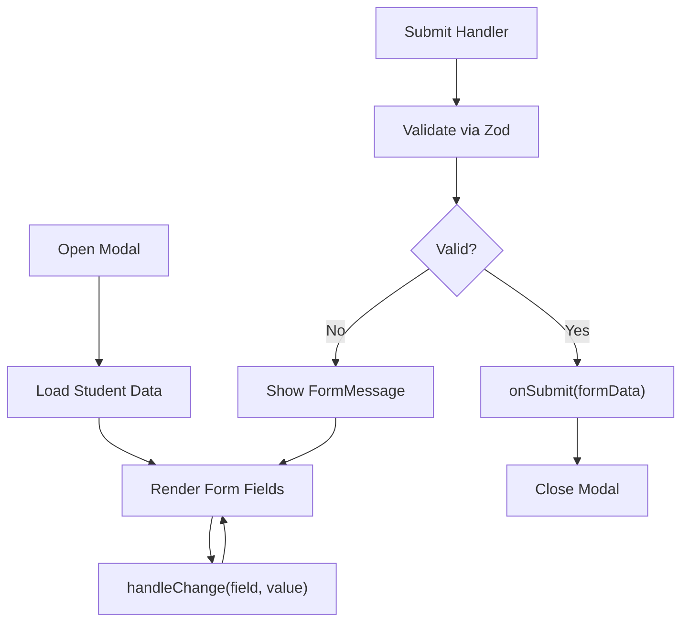
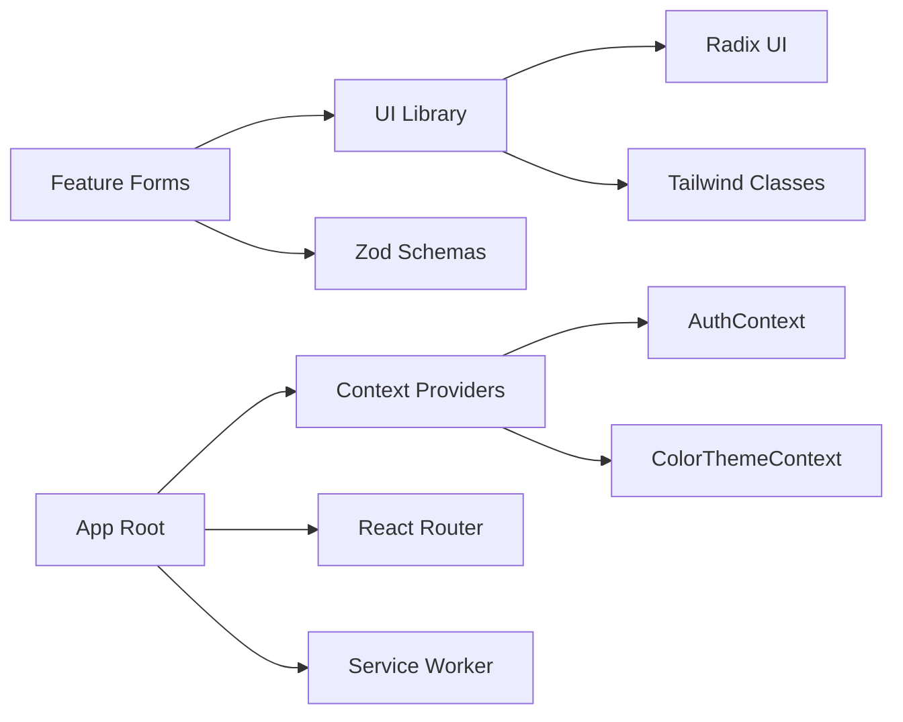

# Development Guide

<cite>
**Referenced Files in This Document**
- [package.json](file://package.json)
- [tailwind.config.ts](file://tailwind.config.ts)
- [components.json](file://components.json)
- [src/App.tsx](file://src/App.tsx)
- [src/main.tsx](file://src/main.tsx)
- [README.md](file://README.md)
- [src/components/ui/button.tsx](file://src/components/ui/button.tsx)
- [src/lib/utils.ts](file://src/lib/utils.ts)
- [src/components/ui/form.tsx](file://src/components/ui/form.tsx)
- [src/lib/validation.ts](file://src/lib/validation.ts)
- [src/contexts/AuthContext.tsx](file://src/contexts/AuthContext.tsx)
- [src/contexts/ColorThemeContext.tsx](file://src/contexts/ColorThemeContext.tsx)
- [src/components/students/StudentFormModal.tsx](file://src/components/students/StudentFormModal.tsx)
- [src/components/ErrorBoundary.tsx](file://src/components/ErrorBoundary.tsx)
- [eslint.config.js](file://eslint.config.js)
</cite>

## Table of Contents
1. [Introduction](#introduction)
2. [Project Structure](#project-structure)
3. [Core Components](#core-components)
4. [Architecture Overview](#architecture-overview)
5. [Detailed Component Analysis](#detailed-component-analysis)
6. [Dependency Analysis](#dependency-analysis)
7. [Performance Considerations](#performance-considerations)
8. [Troubleshooting Guide](#troubleshooting-guide)
9. [Conclusion](#conclusion)
10. [Appendices](#appendices)

## Introduction
This guide provides comprehensive development documentation for contributors and developers working on the portal. It explains how to use the component library, adhere to UI patterns, and implement the design system. It also documents code organization, naming conventions, development workflows, shadcn/ui integration, Tailwind CSS configuration, styling patterns, form validation, error handling, testing strategies, and guidelines for adding new features while maintaining code quality.

## Project Structure
The project is a Vite + React + TypeScript application with shadcn/ui and Tailwind CSS. Key areas:
- Application bootstrap and routing are defined in the root application file.
- UI primitives and compound components live under the UI library folder.
- Feature-specific components are grouped by domain (e.g., students, finance, curriculum).
- Shared utilities and validation schemas are centralized.
- Context providers manage global state (authentication, color themes, school/year).
- Styling is configured via Tailwind with a JSON schema-compliant configuration and aliases for clean imports.



**Diagram sources**
- [src/main.tsx](file://src/main.tsx#L1-L20)
- [src/App.tsx](file://src/App.tsx#L1-L86)
- [tailwind.config.ts](file://tailwind.config.ts#L1-L125)
- [components.json](file://components.json#L1-L21)

**Section sources**
- [README.md](file://README.md#L55-L64)
- [src/App.tsx](file://src/App.tsx#L1-L86)
- [tailwind.config.ts](file://tailwind.config.ts#L1-L125)
- [components.json](file://components.json#L1-L21)

## Core Components
This section covers the foundational building blocks used across the application.

- UI Utilities
  - Utility function for merging Tailwind classes safely.
  - Used by UI components to compose variants and sizes.

- UI Library (shadcn/ui)
  - Reusable primitives and compound components (buttons, inputs, forms, dialogs, etc.) built with Radix UI and styled with Tailwind.
  - Variants and sizes are standardized for consistent UI behavior.

- Validation Layer
  - Centralized Zod schemas for form inputs and API payloads.
  - Helpers for safe parsing, partial validation, and error formatting.

- Context Providers
  - Authentication provider with Supabase integration, role management, and impersonation support.
  - Color theme provider with preset themes persisted in local storage.

- Error Handling
  - Error boundaries for synchronous and asynchronous failures with actionable fallback UIs.

**Section sources**
- [src/lib/utils.ts](file://src/lib/utils.ts#L1-L7)
- [src/components/ui/button.tsx](file://src/components/ui/button.tsx#L1-L59)
- [src/components/ui/form.tsx](file://src/components/ui/form.tsx#L1-L130)
- [src/lib/validation.ts](file://src/lib/validation.ts#L1-L293)
- [src/contexts/AuthContext.tsx](file://src/contexts/AuthContext.tsx#L1-L214)
- [src/contexts/ColorThemeContext.tsx](file://src/contexts/ColorThemeContext.tsx#L1-L232)
- [src/components/ErrorBoundary.tsx](file://src/components/ErrorBoundary.tsx#L1-L206)

## Architecture Overview
The application initializes providers and routes, then renders feature pages. UI components are composed from the shared UI library. Validation schemas enforce data integrity. Contexts manage cross-cutting concerns like auth and theming.



**Diagram sources**
- [src/main.tsx](file://src/main.tsx#L1-L20)
- [src/App.tsx](file://src/App.tsx#L1-L86)
- [src/components/ui/button.tsx](file://src/components/ui/button.tsx#L1-L59)
- [src/components/ui/form.tsx](file://src/components/ui/form.tsx#L1-L130)

## Detailed Component Analysis

### UI Library: Button and Form Patterns
- Button
  - Implements variant and size variants using class variance authority.
  - Supports slottable children and accessibility attributes.
- Form
  - Provides a structured form abstraction using react-hook-form and Radix UI labels.
  - Includes helpers for labels, controls, descriptions, and messages with proper ARIA attributes.

```mermaid
classDiagram
class Button {
+variant : "default|destructive|outline|secondary|ghost|link|success|warning|info|gradient"
+size : "default|sm|lg|xl|icon"
+asChild : boolean
}
class FormComponents {
+Form
+FormField
+FormItem
+FormLabel
+FormControl
+FormDescription
+FormMessage
+useFormField()
}
Button --> "uses" Utils["cn(...)"]
FormComponents --> "uses" Utils
```

**Diagram sources**
- [src/components/ui/button.tsx](file://src/components/ui/button.tsx#L1-L59)
- [src/components/ui/form.tsx](file://src/components/ui/form.tsx#L1-L130)
- [src/lib/utils.ts](file://src/lib/utils.ts#L1-L7)

**Section sources**
- [src/components/ui/button.tsx](file://src/components/ui/button.tsx#L1-L59)
- [src/components/ui/form.tsx](file://src/components/ui/form.tsx#L1-L130)
- [src/lib/utils.ts](file://src/lib/utils.ts#L1-L7)

### Validation Strategy
- Centralized Zod schemas define strict typing and validation rules for domain entities.
- Helpers support full and partial validation and produce user-friendly error messages.



**Diagram sources**
- [src/lib/validation.ts](file://src/lib/validation.ts#L250-L293)

**Section sources**
- [src/lib/validation.ts](file://src/lib/validation.ts#L1-L293)

### Authentication and Role Management
- Authentication provider integrates with Supabase, manages sessions, roles, and impersonation.
- Logs audit actions for login/logout and impersonation events.



**Diagram sources**
- [src/contexts/AuthContext.tsx](file://src/contexts/AuthContext.tsx#L110-L128)

**Section sources**
- [src/contexts/AuthContext.tsx](file://src/contexts/AuthContext.tsx#L1-L214)

### Color Theme Provider
- Manages preset themes and persists selections in local storage.
- Exposes a selector to apply themes across the app.



**Diagram sources**
- [src/contexts/ColorThemeContext.tsx](file://src/contexts/ColorThemeContext.tsx#L198-L223)

**Section sources**
- [src/contexts/ColorThemeContext.tsx](file://src/contexts/ColorThemeContext.tsx#L1-L232)

### Error Boundaries
- Catches JavaScript errors and provides fallback UIs with retry and navigation actions.
- Includes specialized variants for async operations and small sections.



**Diagram sources**
- [src/components/ErrorBoundary.tsx](file://src/components/ErrorBoundary.tsx#L25-L136)

**Section sources**
- [src/components/ErrorBoundary.tsx](file://src/components/ErrorBoundary.tsx#L1-L206)

### Example: Student Form Modal
- Demonstrates composition of UI primitives, controlled form state, and submit handling.
- Uses the shared UI components and Tailwind classes for consistent styling.



**Diagram sources**
- [src/components/students/StudentFormModal.tsx](file://src/components/students/StudentFormModal.tsx#L1-L300)
- [src/components/ui/form.tsx](file://src/components/ui/form.tsx#L1-L130)
- [src/lib/validation.ts](file://src/lib/validation.ts#L1-L96)

**Section sources**
- [src/components/students/StudentFormModal.tsx](file://src/components/students/StudentFormModal.tsx#L1-L300)

## Dependency Analysis
- UI primitives and compound components depend on Radix UI and Tailwind utilities.
- Validation schemas are consumed by forms and services.
- Context providers encapsulate cross-cutting concerns and are wired at the root.
- PWA registration and router orchestrate runtime behavior.



**Diagram sources**
- [package.json](file://package.json#L13-L84)
- [src/App.tsx](file://src/App.tsx#L1-L86)
- [src/components/ui/button.tsx](file://src/components/ui/button.tsx#L1-L59)
- [src/components/ui/form.tsx](file://src/components/ui/form.tsx#L1-L130)
- [src/lib/validation.ts](file://src/lib/validation.ts#L1-L293)

**Section sources**
- [package.json](file://package.json#L13-L84)
- [src/App.tsx](file://src/App.tsx#L1-L86)

## Performance Considerations
- Prefer lazy loading for heavy feature bundles and images.
- Use CSS variables for theming to avoid expensive reflows.
- Memoize derived data and avoid unnecessary re-renders in forms.
- Keep Tailwind content globs scoped to reduce rebuild times.
- Minimize deep component trees in hot paths; use composition and context to pass data efficiently.

## Troubleshooting Guide
- Authentication
  - Verify Supabase credentials and auth state callbacks.
  - Check audit logs for login/logout events and impersonation attempts.
- Theming
  - Confirm theme presets and local storage persistence.
  - Ensure CSS variables are applied to the root element.
- Forms
  - Validate data against Zod schemas before submission.
  - Inspect FormMessage outputs for field-level errors.
- Error Boundaries
  - Use AsyncErrorBoundary for data-fetching components.
  - Use SectionErrorBoundary for isolated UI sections.

**Section sources**
- [src/contexts/AuthContext.tsx](file://src/contexts/AuthContext.tsx#L110-L128)
- [src/contexts/ColorThemeContext.tsx](file://src/contexts/ColorThemeContext.tsx#L202-L208)
- [src/components/ui/form.tsx](file://src/components/ui/form.tsx#L111-L127)
- [src/components/ErrorBoundary.tsx](file://src/components/ErrorBoundary.tsx#L158-L173)

## Conclusion
This guide outlined how to use the component library, implement UI patterns, and follow the design system. It described validation, error handling, and provider architecture, along with Tailwind and shadcn configuration. By adhering to the conventions and patterns documented here, contributors can add new features consistently and maintain high code quality.

## Appendices

### Shadcn/UI Integration and Tailwind Configuration
- shadcn configuration defines style, TSX usage, Tailwind config path, base color, and aliases for components, utils, and hooks.
- Tailwind is configured with dark mode, content scanning, custom colors, typography, animations, and plugins.

**Section sources**
- [components.json](file://components.json#L1-L21)
- [tailwind.config.ts](file://tailwind.config.ts#L1-L125)

### Development Workflows and Conventions
- Scripts for dev, build, lint, and preview are defined in package scripts.
- ESLint configuration enforces TypeScript strictness, React Hooks rules, and common best practices.

**Section sources**
- [package.json](file://package.json#L6-L12)
- [eslint.config.js](file://eslint.config.js#L1-L39)

### Adding New Features
- Create a new component under the appropriate feature folder or extend the UI library if reusable.
- Compose UI primitives and use the shared cn utility for class merging.
- Add or reuse Zod schemas in the validation module and integrate with react-hook-form.
- Wrap data-fetching components with AsyncErrorBoundary.
- Persist user preferences in local storage if applicable.
- Keep styling consistent with Tailwind utilities and the design tokens defined in the theme.

[No sources needed since this section provides general guidance]