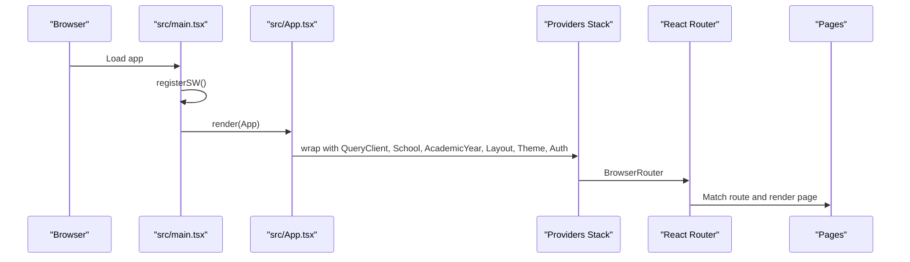
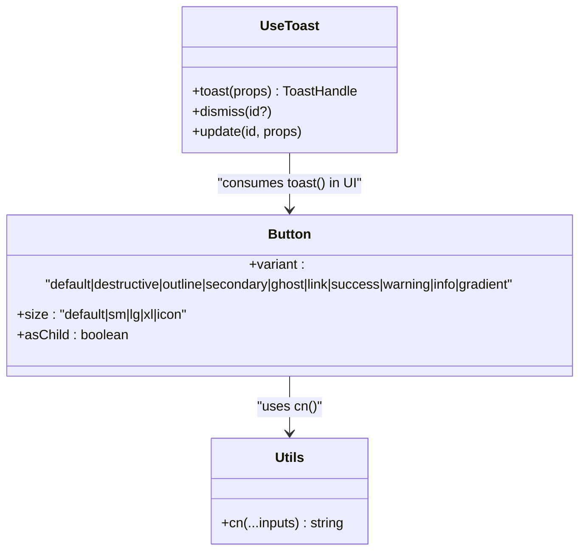
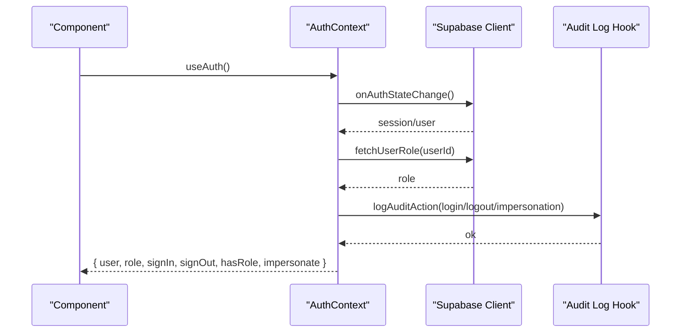
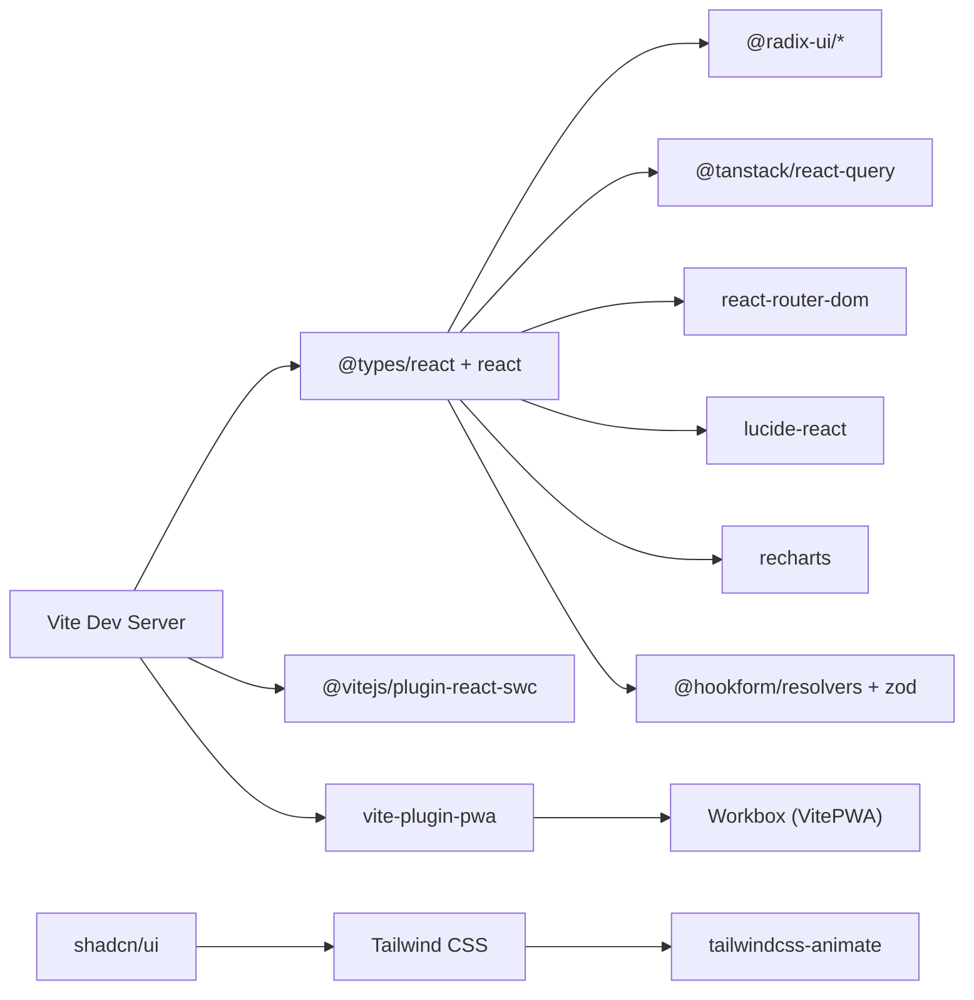

# Development Workflow & Conventions

<cite>
**Referenced Files in This Document**
- [package.json](file://package.json)
- [eslint.config.js](file://eslint.config.js)
- [vite.config.ts](file://vite.config.ts)
- [tsconfig.json](file://tsconfig.json)
- [tsconfig.app.json](file://tsconfig.app.json)
- [tsconfig.node.json](file://tsconfig.node.json)
- [tailwind.config.ts](file://tailwind.config.ts)
- [postcss.config.js](file://postcss.config.js)
- [components.json](file://components.json)
- [.gitignore](file://.gitignore)
- [src/App.tsx](file://src/App.tsx)
- [src/main.tsx](file://src/main.tsx)
- [src/hooks/use-toast.ts](file://src/hooks/use-toast.ts)
- [src/lib/utils.ts](file://src/lib/utils.ts)
- [src/contexts/AuthContext.tsx](file://src/contexts/AuthContext.tsx)
- [src/components/ui/button.tsx](file://src/components/ui/button.tsx)
</cite>

## Table of Contents
1. [Introduction](#introduction)
2. [Project Structure](#project-structure)
3. [Core Components](#core-components)
4. [Architecture Overview](#architecture-overview)
5. [Detailed Component Analysis](#detailed-component-analysis)
6. [Dependency Analysis](#dependency-analysis)
7. [Performance Considerations](#performance-considerations)
8. [Troubleshooting Guide](#troubleshooting-guide)
9. [Conclusion](#conclusion)
10. [Appendices](#appendices)

## Introduction
This document describes the development workflow, coding standards, and project conventions for the frontend application. It covers ESLint configuration, TypeScript setup, build processes, naming conventions, file organization patterns, component architecture guidelines, pre-commit hooks, code formatting standards, and development environment setup. It also provides guidelines for adding new features, maintaining code quality, and following project-specific conventions for React components, hooks, and TypeScript interfaces.

## Project Structure
The project is a Vite-powered React application with TypeScript and Tailwind CSS. Key conventions:
- Feature-based organization under src/components (e.g., admin/, admissions/, finance/)
- Shared UI primitives under src/components/ui/
- Hooks under src/hooks/
- Context providers under src/contexts/
- Utilities under src/lib/
- Types under src/types/
- Page routes under src/pages/
- Supabase integration under src/integrations/supabase/

```mermaid
graph TB
subgraph "Application Root"
APP["src/App.tsx"]
MAIN["src/main.tsx"]
end
subgraph "Providers"
AUTH["src/contexts/AuthContext.tsx"]
THEME["ColorThemeContext Provider"]
SCHOOL["SchoolContext Provider"]
AY["AcademicYearContext Provider"]
LAYOUT["DashboardLayoutContext Provider"]
end
subgraph "Pages"
INDEX["src/pages/Index.tsx"]
STUDPROF["src/pages/StudentProfile.tsx"]
AUTH_PAGE["src/pages/Auth.tsx"]
ATT["src/pages/Attendance.tsx"]
INSTALL["src/pages/Install.tsx"]
HELPIDX["src/pages/Helpdesk/index.tsx"]
TICKDET["src/pages/Helpdesk/TicketDetail.tsx"]
end
subgraph "Components"
UI["src/components/ui/"]
ADMIN["src/components/admin/"]
FINANCE["src/components/finance/"]
PORTALS["src/components/portals/"]
end
MAIN --> APP
APP --> AUTH
APP --> THEME
APP --> SCHOOL
APP --> AY
APP --> LAYOUT
APP --> INDEX
APP --> STUDPROF
APP --> AUTH_PAGE
APP --> ATT
APP --> INSTALL
APP --> HELPIDX
APP --> TICKDET
APP --> UI
APP --> ADMIN
APP --> FINANCE
APP --> PORTALS
```

**Diagram sources**
- [src/App.tsx](file://src/App.tsx#L39-L84)
- [src/main.tsx](file://src/main.tsx#L1-L20)

**Section sources**
- [src/App.tsx](file://src/App.tsx#L1-L86)
- [src/main.tsx](file://src/main.tsx#L1-L20)

## Core Components
- Build and scripts: Vite dev/build/preview with linting via ESLint.
- Linting: ESLint with TypeScript strict configs, React Hooks plugin, and React Refresh plugin.
- Type checking: TypeScript strict mode enabled per tsconfig.app.json; loose compiler options in root tsconfig.json to allow mixed JS/TS.
- Styling: Tailwind CSS with shadcn/ui component system configured via components.json.
- PWA: Vite PWA plugin with Workbox caching strategies and manifest.

**Section sources**
- [package.json](file://package.json#L6-L12)
- [eslint.config.js](file://eslint.config.js#L1-L39)
- [tsconfig.app.json](file://tsconfig.app.json#L18-L28)
- [tsconfig.json](file://tsconfig.json#L4-L15)
- [tailwind.config.ts](file://tailwind.config.ts#L1-L125)
- [components.json](file://components.json#L1-L21)
- [vite.config.ts](file://vite.config.ts#L20-L86)

## Architecture Overview
The application initializes providers around the routing tree. Authentication state is managed centrally and exposed via a context. UI components follow a variant/size pattern using shadcn/ui primitives. Utility functions centralize cross-cutting concerns like class merging.

**Diagram sources**
- [src/main.tsx](file://src/main.tsx#L1-L20)
- [src/App.tsx](file://src/App.tsx#L39-L84)

**Section sources**
- [src/main.tsx](file://src/main.tsx#L1-L20)
- [src/App.tsx](file://src/App.tsx#L39-L84)

## Detailed Component Analysis

### ESLint Configuration
- Extends recommended TypeScript configs and strict rulesets.
- Enforces unused variable rules with underscore prefixes allowed.
- Disallows explicit any and non-null assertions with warnings.
- Prefers const, disallows var, enforces curly braces, and restricts console usage to specific methods.
- Integrates React Hooks and React Refresh plugins with recommended rules.

**Section sources**
- [eslint.config.js](file://eslint.config.js#L7-L38)

### TypeScript Setup
- Root tsconfig.json references app and node configs and sets path aliases.
- tsconfig.app.json enables strict mode and JSX transform for React.
- tsconfig.node.json configures bundler mode for Vite config.
- Path alias @/* resolves to src/.

**Section sources**
- [tsconfig.json](file://tsconfig.json#L1-L17)
- [tsconfig.app.json](file://tsconfig.app.json#L1-L37)
- [tsconfig.node.json](file://tsconfig.node.json#L1-L23)

### Build Processes
- Scripts: dev, build, build:dev, lint, preview.
- Vite dev server binds to all hosts on port 8080.
- PWA manifest defines app metadata and icons; Workbox caches Supabase API calls and images with TTLs.
- Aliasing for @ resolves to src.

**Section sources**
- [package.json](file://package.json#L6-L12)
- [vite.config.ts](file://vite.config.ts#L7-L86)

### Tailwind and shadcn/ui
- Tailwind scans components, pages, app, and src for class usage.
- CSS variables enable dynamic theming; animations plugin included.
- components.json configures shadcn/ui with TSX, Tailwind CSS, and aliases for components, utils, ui, lib, and hooks.

**Section sources**
- [tailwind.config.ts](file://tailwind.config.ts#L1-L125)
- [components.json](file://components.json#L1-L21)

### PostCSS Pipeline
- Autoprefixer and Tailwind CSS plugins applied in order.

**Section sources**
- [postcss.config.js](file://postcss.config.js#L1-L7)

### Naming Conventions and File Organization
- Feature folders: src/components/{feature}/
- UI primitives: src/components/ui/*.tsx with variants and sizes.
- Hooks: src/hooks/use-*.ts
- Contexts: src/contexts/*.tsx
- Utilities: src/lib/utils.ts
- Types: src/types/*
- Pages: src/pages/*

**Section sources**
- [src/components/ui/button.tsx](file://src/components/ui/button.tsx#L1-L59)
- [src/hooks/use-toast.ts](file://src/hooks/use-toast.ts#L1-L187)
- [src/lib/utils.ts](file://src/lib/utils.ts#L1-L7)

### Component Architecture Guidelines
- UI components use variant/size props and forward refs.
- Utilities like cn merge classes safely.
- Contexts expose typed hooks and guard against misuse.

**Diagram sources**
- [src/components/ui/button.tsx](file://src/components/ui/button.tsx#L38-L58)
- [src/lib/utils.ts](file://src/lib/utils.ts#L4-L6)
- [src/hooks/use-toast.ts](file://src/hooks/use-toast.ts#L137-L164)

**Section sources**
- [src/components/ui/button.tsx](file://src/components/ui/button.tsx#L1-L59)
- [src/lib/utils.ts](file://src/lib/utils.ts#L1-L7)
- [src/hooks/use-toast.ts](file://src/hooks/use-toast.ts#L1-L187)

### Authentication Context Pattern
- Centralized auth state with role resolution and impersonation support.
- Uses Supabase client and logs audit actions.
- Provides typed hook and provider wrapper.

**Diagram sources**
- [src/contexts/AuthContext.tsx](file://src/contexts/AuthContext.tsx#L35-L215)

**Section sources**
- [src/contexts/AuthContext.tsx](file://src/contexts/AuthContext.tsx#L1-L216)

### Adding New Features
- Create a new feature folder under src/components/{feature}/.
- Add UI primitives under src/components/ui/ if reusable.
- Implement hooks under src/hooks/ if stateful logic is shared.
- Define types under src/types/ if domain-specific.
- Wire pages under src/pages/ and integrate routes in src/App.tsx.
- Respect existing patterns: variant/size props for UI, underscore prefix for intentionally unused variables, and strict TypeScript usage.

**Section sources**
- [src/App.tsx](file://src/App.tsx#L62-L74)
- [eslint.config.js](file://eslint.config.js#L20-L36)

### Pre-commit Hooks and Formatting Standards
- Pre-commit hooks are not defined in the repository. Use a tool like Husky with lint-staged to run ESLint and format checks before commits.
- Formatting is enforced by ESLint rules; ensure your editor runs ESLint on save or configure a formatter compatible with TypeScript/JSX.

**Section sources**
- [.gitignore](file://.gitignore#L1-L30)

### Development Environment Setup
- Install dependencies using your preferred package manager.
- Run dev server with npm run dev or equivalent.
- Configure environment variables via .env or .env.local as needed.
- Use the PWA manifest and service worker registration for offline-ready builds.

**Section sources**
- [package.json](file://package.json#L6-L12)
- [src/main.tsx](file://src/main.tsx#L7-L17)

## Dependency Analysis
The application relies on React, Radix UI primitives, TanStack Query for data fetching, Supabase for auth and database, Tailwind CSS with shadcn/ui, and Vite with PWA capabilities.

**Diagram sources**
- [package.json](file://package.json#L13-L84)
- [vite.config.ts](file://vite.config.ts#L20-L86)
- [tailwind.config.ts](file://tailwind.config.ts#L123-L124)

**Section sources**
- [package.json](file://package.json#L13-L84)
- [vite.config.ts](file://vite.config.ts#L20-L86)
- [tailwind.config.ts](file://tailwind.config.ts#L1-L125)

## Performance Considerations
- PWA caching reduces network requests for images and Supabase APIs with sensible TTLs.
- Dedupe dependencies in Vite resolve configuration helps avoid duplicate React bundles.
- Prefer memoization and selective re-renders in components; leverage TanStack Query for efficient caching and invalidation.
- Keep UI components pure and avoid unnecessary re-renders by passing stable callbacks and avoiding inline object/function creation in render.

**Section sources**
- [vite.config.ts](file://vite.config.ts#L80-L85)
- [vite.config.ts](file://vite.config.ts#L47-L77)

## Troubleshooting Guide
- Lint errors: Run npm run lint to identify issues; fix unused variables with underscore prefixes or remove unused parameters/vars.
- Console warnings: Limit console usage to error/warn as configured.
- TypeScript strictness: Enable strict mode in local IDE; address implicit any and non-null assertion warnings.
- PWA updates: Service worker prompts for refresh; confirm reload when prompted.
- Environment variables: Ensure .env or .env.local is present and loaded; fallback values are defined in Vite config for local development.

**Section sources**
- [eslint.config.js](file://eslint.config.js#L20-L36)
- [src/main.tsx](file://src/main.tsx#L7-L17)
- [vite.config.ts](file://vite.config.ts#L12-L19)

## Conclusion
This project follows a structured React + TypeScript + Tailwind + Vite stack with strong linting and PWA support. By adhering to the established naming conventions, component architecture guidelines, and TypeScript strictness, contributors can maintain high code quality and consistency across features.

## Appendices

### ESLint Rules Summary
- React Hooks recommended rules
- React Refresh restricted exports
- No unused vars with underscore allowances
- No explicit any
- Non-null assertion warnings
- Prefer const, disallow var
- Curly brace enforcement
- Console restrictions

**Section sources**
- [eslint.config.js](file://eslint.config.js#L20-L36)

### TypeScript Strictness Summary
- App config: strict mode enabled with strictNullChecks and related flags.
- Root config: relaxed compiler options to allow mixed JS/TS during transition.

**Section sources**
- [tsconfig.app.json](file://tsconfig.app.json#L18-L28)
- [tsconfig.json](file://tsconfig.json#L9-L14)