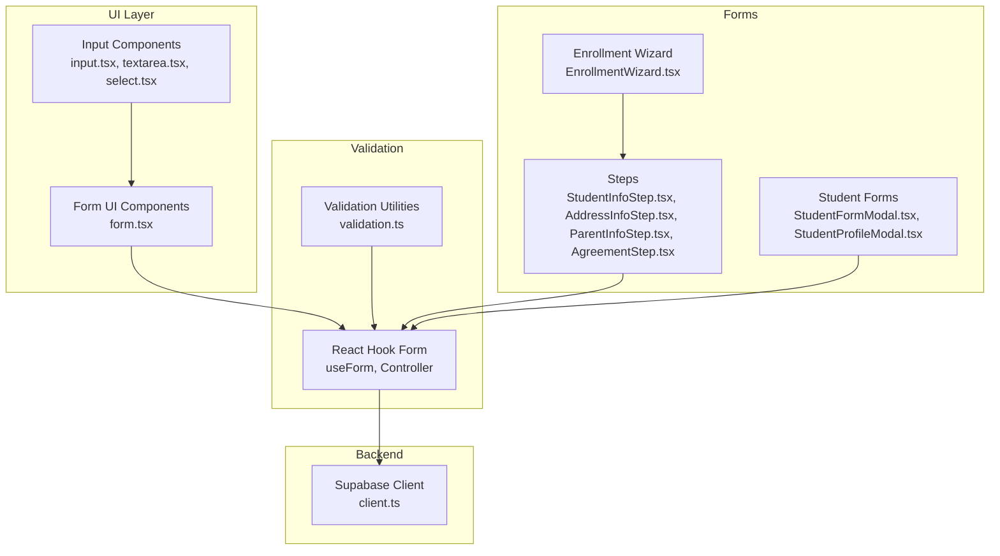
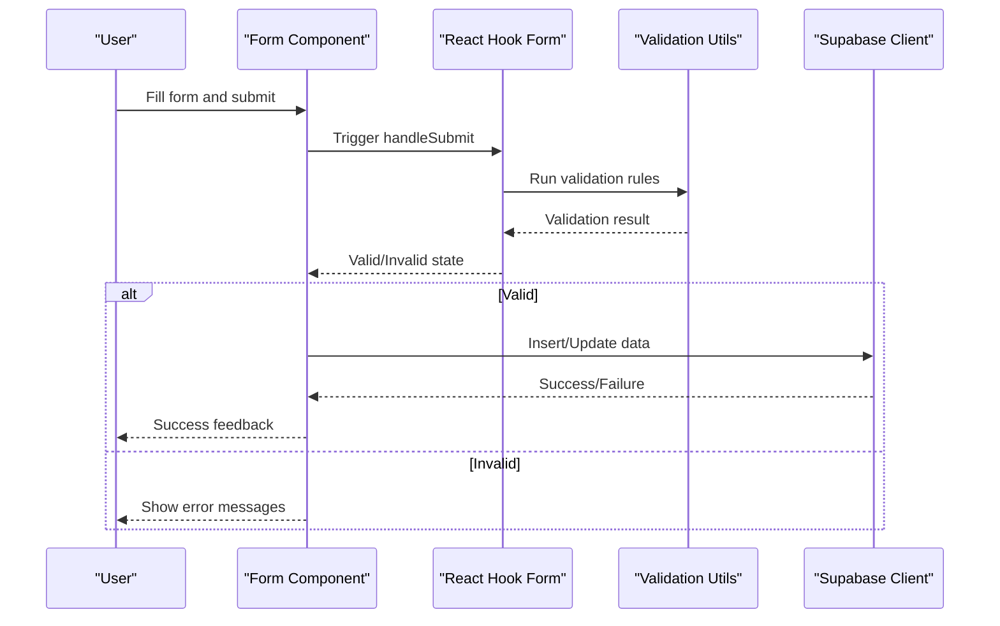
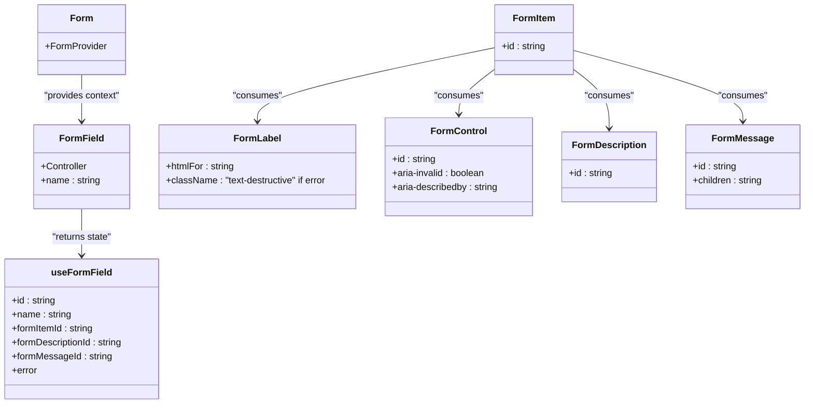
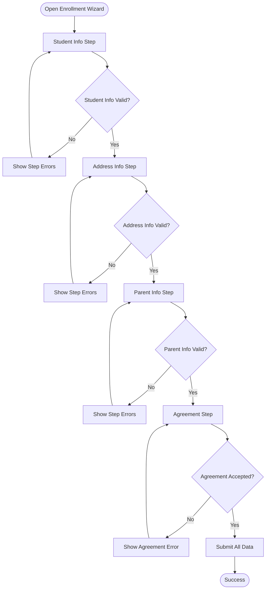
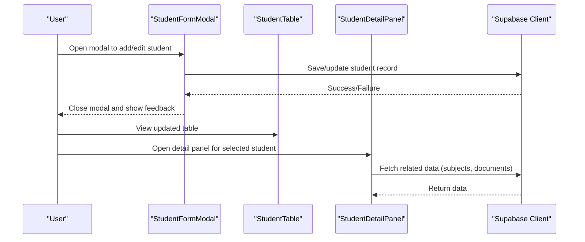
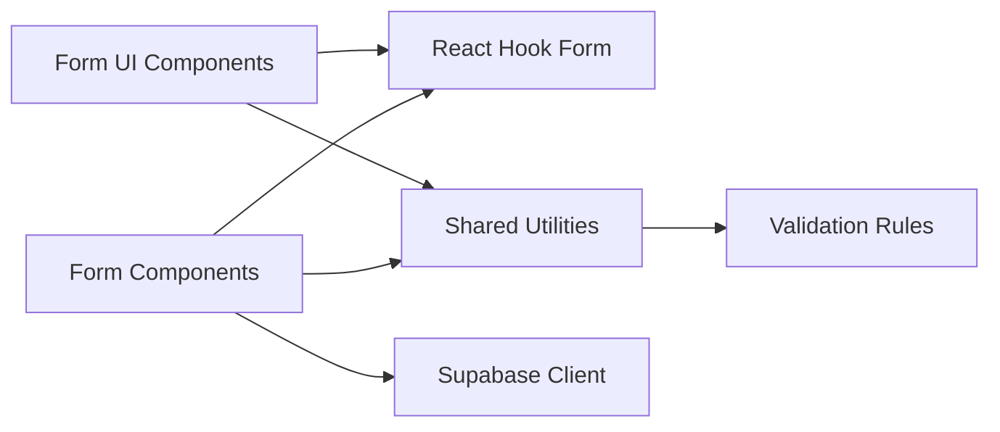

# Form Handling & Validation

<cite>
**Referenced Files in This Document**
- [form.tsx](file://src/components/ui/form.tsx)
- [client.ts](file://src/integrations/supabase/client.ts)
- [validation.ts](file://src/lib/validation.ts)
- [utils.ts](file://src/lib/utils.ts)
- [EnrollmentForm.tsx](file://src/components/enrollment/EnrollmentForm.tsx)
- [AddressInfoStep.tsx](file://src/components/enrollment/steps/AddressInfoStep.tsx)
- [ParentInfoStep.tsx](file://src/components/enrollment/steps/ParentInfoStep.tsx)
- [AgreementStep.tsx](file://src/components/enrollment/steps/AgreementStep.tsx)
- [StudentInfoStep.tsx](file://src/components/enrollment/steps/StudentInfoStep.tsx)
- [EnrollmentWizard.tsx](file://src/components/enrollment/EnrollmentWizard.tsx)
- [StudentFormModal.tsx](file://src/components/students/StudentFormModal.tsx)
- [StudentProfileModal.tsx](file://src/components/students/StudentProfileModal.tsx)
- [StudentDetailPanel.tsx](file://src/components/students/StudentDetailPanel.tsx)
- [StudentTable.tsx](file://src/components/students/StudentTable.tsx)
- [StudentCard.tsx](file://src/components/students/StudentCard.tsx)
- [StudentProfileCard.tsx](file://src/components/students/StudentProfileCard.tsx)
- [StudentSubjectsManager.tsx](file://src/components/students/StudentSubjectsManager.tsx)
- [StudentDocuments.tsx](file://src/components/students/DocumentsManager.tsx)
- [StudentIDCard.tsx](file://src/components/students/StudentIDCard.tsx)
- [StudentHoverPreview.tsx](file://src/components/students/StudentHoverPreview.tsx)
- [StudentFormModal.tsx](file://src/components/students/StudentFormModal.tsx)
- [StudentProfileModal.tsx](file://src/components/students/StudentProfileModal.tsx)
- [StudentDetailPanel.tsx](file://src/components/students/StudentDetailPanel.tsx)
- [StudentTable.tsx](file://src/components/students/StudentTable.tsx)
- [StudentCard.tsx](file://src/components/students/StudentCard.tsx)
- [StudentProfileCard.tsx](file://src/components/students/StudentProfileCard.tsx)
- [StudentSubjectsManager.tsx](file://src/components/students/StudentSubjectsManager.tsx)
- [StudentDocuments.tsx](file://src/components/students/DocumentsManager.tsx)
- [StudentIDCard.tsx](file://src/components/students/StudentIDCard.tsx)
- [StudentHoverPreview.tsx](file://src/components/students/StudentHoverPreview.tsx)
</cite>

## Table of Contents
1. [Introduction](#introduction)
2. [Project Structure](#project-structure)
3. [Core Components](#core-components)
4. [Architecture Overview](#architecture-overview)
5. [Detailed Component Analysis](#detailed-component-analysis)
6. [Dependency Analysis](#dependency-analysis)
7. [Performance Considerations](#performance-considerations)
8. [Troubleshooting Guide](#troubleshooting-guide)
9. [Conclusion](#conclusion)
10. [Appendices](#appendices)

## Introduction
This document explains the form handling and validation systems used across the application. It covers the React Hook Form integration, custom validation rules, error handling patterns, validation utility functions, form component patterns, user feedback mechanisms, form submission workflows, data transformation, and integration with the Supabase backend. It also includes examples of complex form validations, conditional field behaviors, and accessibility features for form inputs.

## Project Structure
The form system is built around a reusable UI wrapper for React Hook Form and a set of shared validation utilities. Specific forms (such as enrollment and student management) demonstrate advanced validation, conditional logic, and submission flows.

**Diagram sources**
- [form.tsx](file://src/components/ui/form.tsx#L1-L130)
- [validation.ts](file://src/lib/validation.ts)
- [EnrollmentWizard.tsx](file://src/components/enrollment/EnrollmentWizard.tsx)
- [StudentInfoStep.tsx](file://src/components/enrollment/steps/StudentInfoStep.tsx)
- [AddressInfoStep.tsx](file://src/components/enrollment/steps/AddressInfoStep.tsx)
- [ParentInfoStep.tsx](file://src/components/enrollment/steps/ParentInfoStep.tsx)
- [AgreementStep.tsx](file://src/components/enrollment/steps/AgreementStep.tsx)
- [StudentFormModal.tsx](file://src/components/students/StudentFormModal.tsx)
- [StudentProfileModal.tsx](file://src/components/students/StudentProfileModal.tsx)
- [client.ts](file://src/integrations/supabase/client.ts#L1-L17)

**Section sources**
- [form.tsx](file://src/components/ui/form.tsx#L1-L130)
- [validation.ts](file://src/lib/validation.ts)
- [client.ts](file://src/integrations/supabase/client.ts#L1-L17)

## Core Components
- Form UI wrapper: Provides a consistent pattern for labels, controls, descriptions, and error messages using React Hook Form’s Controller and context hooks.
- Validation utilities: Centralized validation rules and helpers for common patterns (e.g., required fields, email, phone, date ranges).
- Supabase integration: Shared client for database operations and authentication.

Key capabilities:
- Accessible ARIA attributes on form controls and labels.
- Dynamic error rendering with unique IDs for assistive technologies.
- Controlled components via React Hook Form for robust state management.

**Section sources**
- [form.tsx](file://src/components/ui/form.tsx#L1-L130)
- [validation.ts](file://src/lib/validation.ts)
- [client.ts](file://src/integrations/supabase/client.ts#L1-L17)

## Architecture Overview
The form architecture follows a layered approach:
- UI layer: Reusable Form components (Form, FormField, FormLabel, FormControl, FormDescription, FormMessage).
- Validation layer: Utility functions and rules applied during form registration and submission.
- Business logic layer: Form-specific components orchestrating steps, conditional fields, and submission.
- Backend layer: Supabase client for persistence and authentication.

**Diagram sources**
- [form.tsx](file://src/components/ui/form.tsx#L1-L130)
- [validation.ts](file://src/lib/validation.ts)
- [client.ts](file://src/integrations/supabase/client.ts#L1-L17)

## Detailed Component Analysis

### Form UI Wrapper (React Hook Form Integration)
The Form UI wrapper standardizes how form fields are rendered and validated. It:
- Creates a FormProvider context for the entire form.
- Wraps each field with a FormField that exposes field state via useFormField.
- Applies accessible attributes (aria-invalid, aria-describedby) to controls.
- Renders error messages with unique IDs for screen readers.

**Diagram sources**
- [form.tsx](file://src/components/ui/form.tsx#L1-L130)

Accessibility highlights:
- Controls receive aria-invalid and aria-describedby with IDs derived from useFormField.
- Labels are associated with controls via htmlFor.
- Error messages are announced by assistive technologies using unique IDs.

**Section sources**
- [form.tsx](file://src/components/ui/form.tsx#L1-L130)

### Validation Utilities
Validation utilities centralize common rules and helpers:
- Required field validation.
- Email format validation.
- Phone number validation.
- Date range validation.
- Conditional validation helpers for dependent fields.

These utilities integrate with React Hook Form’s resolver or manual validation to provide consistent behavior across forms.

**Section sources**
- [validation.ts](file://src/lib/validation.ts)

### Enrollment Form System
The enrollment system demonstrates complex validation and conditional behaviors:
- Multi-step wizard with distinct steps for student info, address info, parent info, and agreement.
- Conditional visibility and requirements based on user selections (e.g., living situation, guardians).
- Step-specific validation rules and cross-step data dependencies.
- Submission workflow that aggregates step data and persists to the backend.

**Diagram sources**
- [EnrollmentWizard.tsx](file://src/components/enrollment/EnrollmentWizard.tsx)
- [StudentInfoStep.tsx](file://src/components/enrollment/steps/StudentInfoStep.tsx)
- [AddressInfoStep.tsx](file://src/components/enrollment/steps/AddressInfoStep.tsx)
- [ParentInfoStep.tsx](file://src/components/enrollment/steps/ParentInfoStep.tsx)
- [AgreementStep.tsx](file://src/components/enrollment/steps/AgreementStep.tsx)

Examples of complex validations and conditional behaviors:
- Conditional required fields based on “living alone” selection.
- Dependent phone/email validation rules for parents/guardians.
- Cross-step validation ensuring agreement acceptance before submission.

Submission workflow:
- Aggregate step data into a single payload.
- Transform data types (dates, booleans).
- Persist via Supabase client.
- Provide user feedback on success/error.

**Section sources**
- [EnrollmentForm.tsx](file://src/components/enrollment/EnrollmentForm.tsx)
- [EnrollmentWizard.tsx](file://src/components/enrollment/EnrollmentWizard.tsx)
- [StudentInfoStep.tsx](file://src/components/enrollment/steps/StudentInfoStep.tsx)
- [AddressInfoStep.tsx](file://src/components/enrollment/steps/AddressInfoStep.tsx)
- [ParentInfoStep.tsx](file://src/components/enrollment/steps/ParentInfoStep.tsx)
- [AgreementStep.tsx](file://src/components/enrollment/steps/AgreementStep.tsx)

### Student Management Forms
Student-related forms showcase:
- Modal-based creation/editing flows.
- Inline editing in tables and cards.
- Conditional fields based on selected options (e.g., enrollment status).
- Bulk actions and data updates.

**Diagram sources**
- [StudentFormModal.tsx](file://src/components/students/StudentFormModal.tsx)
- [StudentProfileModal.tsx](file://src/components/students/StudentProfileModal.tsx)
- [StudentDetailPanel.tsx](file://src/components/students/StudentDetailPanel.tsx)
- [StudentTable.tsx](file://src/components/students/StudentTable.tsx)
- [StudentCard.tsx](file://src/components/students/StudentCard.tsx)
- [StudentProfileCard.tsx](file://src/components/students/StudentProfileCard.tsx)
- [StudentSubjectsManager.tsx](file://src/components/students/StudentSubjectsManager.tsx)
- [StudentDocuments.tsx](file://src/components/students/DocumentsManager.tsx)
- [StudentIDCard.tsx](file://src/components/students/StudentIDCard.tsx)
- [StudentHoverPreview.tsx](file://src/components/students/StudentHoverPreview.tsx)
- [client.ts](file://src/integrations/supabase/client.ts#L1-L17)

### Supabase Integration
The Supabase client is configured with:
- Environment variables for URL and publishable key.
- Persistent session storage and automatic token refresh.
- Type-safe database access for form submissions and queries.

Common operations:
- Insert new records (e.g., student, enrollment).
- Update existing records.
- Select related data for dependent fields.

**Section sources**
- [client.ts](file://src/integrations/supabase/client.ts#L1-L17)

## Dependency Analysis
The form system exhibits low coupling and high cohesion:
- UI components depend on React Hook Form and shared utilities.
- Validation utilities are independent and reusable across forms.
- Forms depend on Supabase client for persistence.
- No circular dependencies observed among major form components.

**Diagram sources**
- [form.tsx](file://src/components/ui/form.tsx#L1-L130)
- [validation.ts](file://src/lib/validation.ts)
- [client.ts](file://src/integrations/supabase/client.ts#L1-L17)

**Section sources**
- [form.tsx](file://src/components/ui/form.tsx#L1-L130)
- [validation.ts](file://src/lib/validation.ts)
- [client.ts](file://src/integrations/supabase/client.ts#L1-L17)

## Performance Considerations
- Minimize re-renders by keeping form state in React Hook Form and only subscribing to necessary parts of formState.
- Debounce expensive validations (e.g., external API checks) to avoid excessive network calls.
- Use controlled components consistently to prevent unnecessary reconciliation.
- Batch form updates when possible to reduce write operations to the backend.

## Troubleshooting Guide
Common issues and resolutions:
- Missing FormField context: Ensure each field is wrapped in FormField to avoid errors from useFormField.
- ARIA mismatch: Verify that aria-describedby and aria-invalid are set correctly on controls.
- Validation not triggering: Confirm that validation rules are registered with the form and that the resolver or manual validation is invoked during submission.
- Backend errors: Wrap submission logic in try/catch blocks and surface user-friendly messages via toast notifications.

User feedback mechanisms:
- Use toast notifications for success and error messages after form submission.
- Display inline error messages with unique IDs for assistive technologies.
- Provide loading states during submission to improve perceived performance.

**Section sources**
- [form.tsx](file://src/components/ui/form.tsx#L1-L130)

## Conclusion
The form handling and validation system leverages React Hook Form and a shared UI wrapper to deliver accessible, maintainable, and extensible forms. Validation utilities and Supabase integration enable robust data workflows with strong user feedback. The enrollment and student management forms serve as practical examples of complex validations, conditional behaviors, and seamless backend integration.

## Appendices
- Accessibility checklist for forms:
  - Associate labels with controls using htmlFor.
  - Provide aria-invalid and aria-describedby on controls.
  - Announce error messages with unique IDs.
  - Offer keyboard navigation and focus management.
- Best practices:
  - Keep validation rules centralized and reusable.
  - Use controlled components and consistent state management.
  - Provide clear error messages and recovery paths.
  - Test with real backend interactions and edge cases.