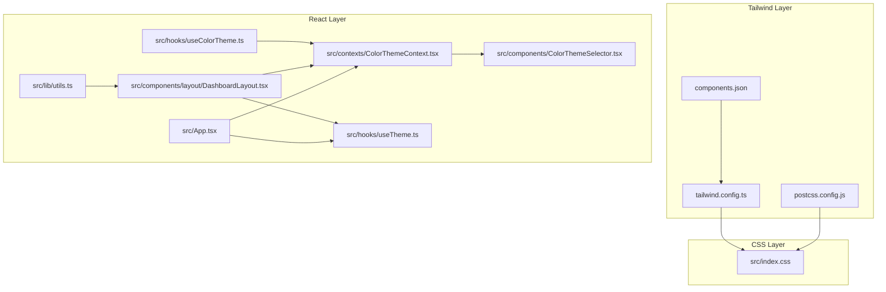
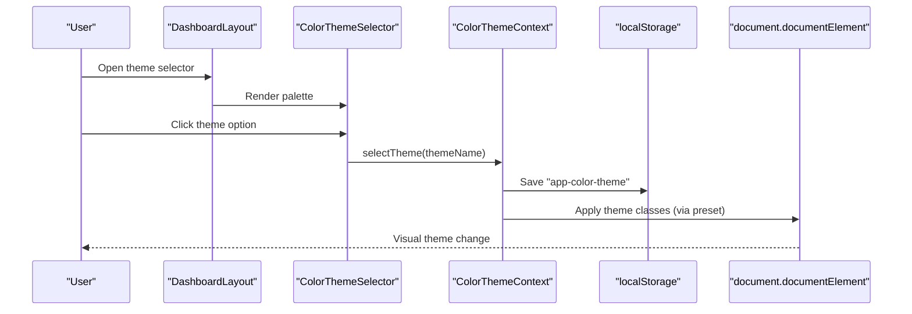
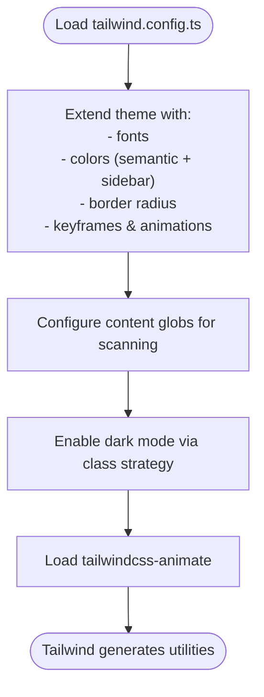
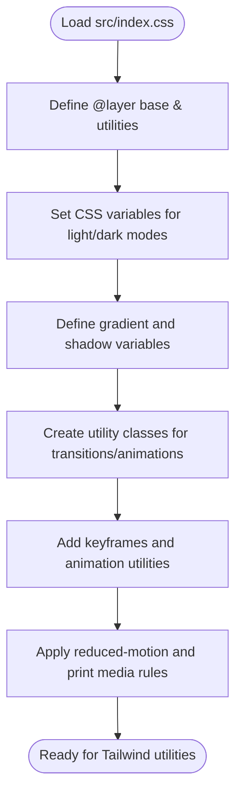
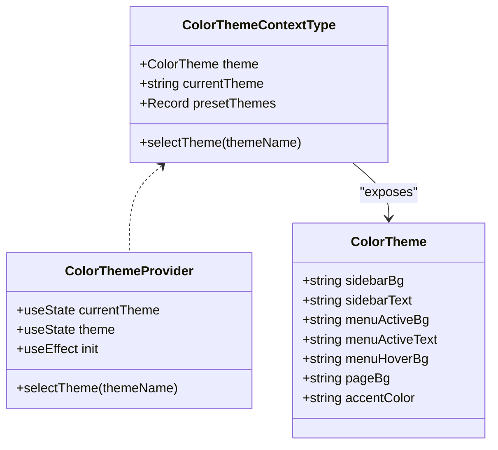
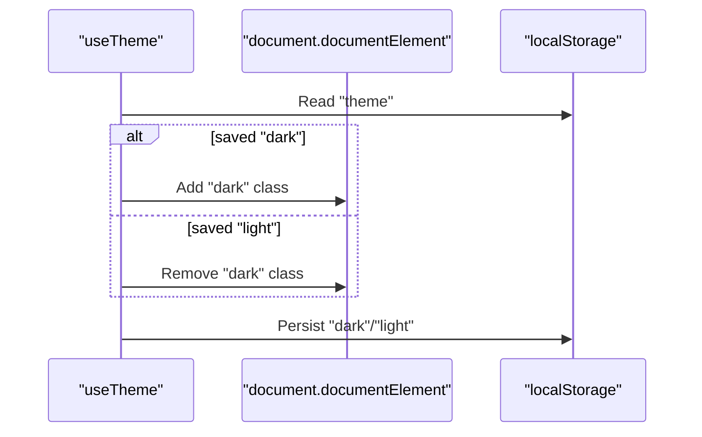
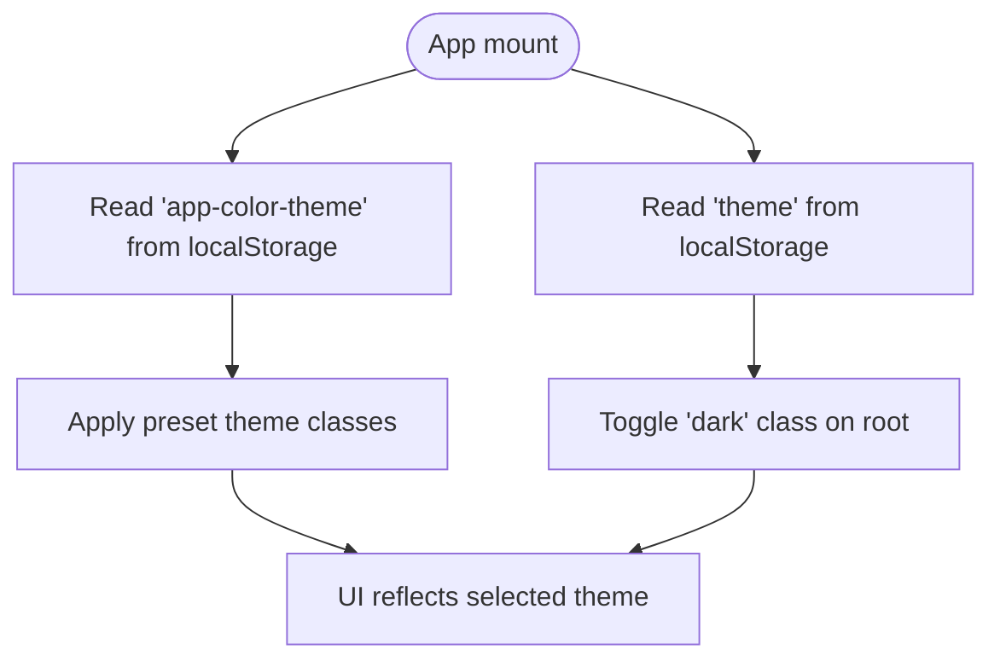
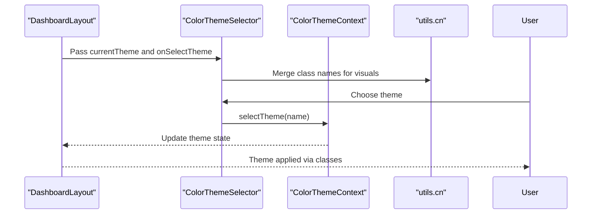
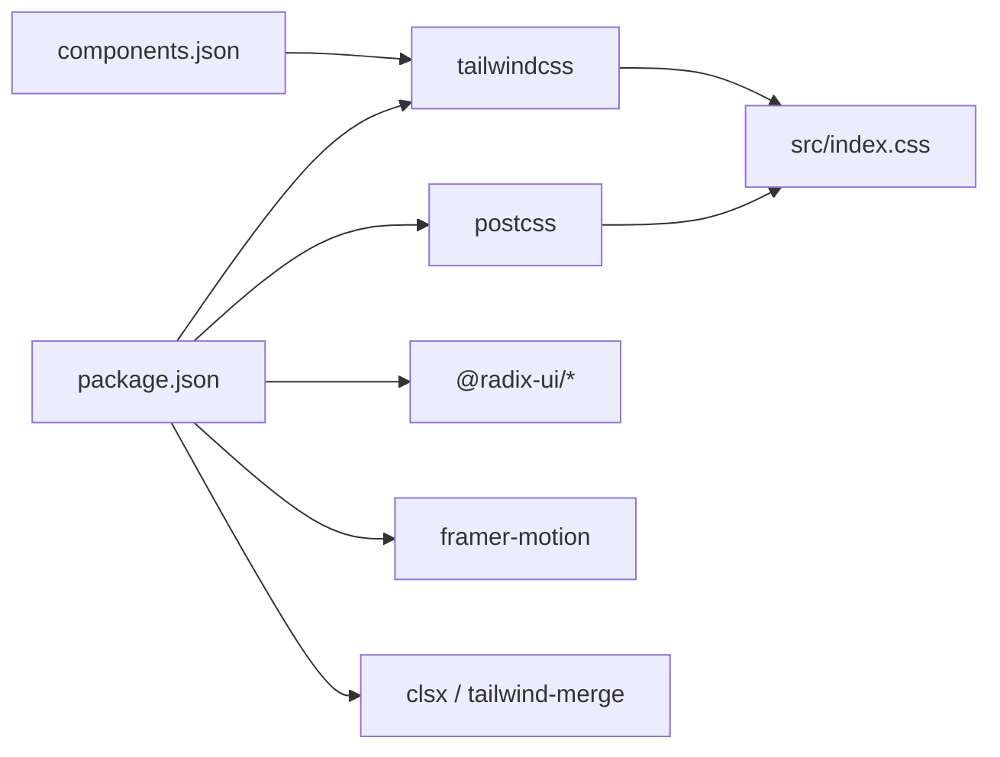

# Styling & Theming System

<cite>
**Referenced Files in This Document**
- [tailwind.config.ts](file://tailwind.config.ts)
- [index.css](file://src/index.css)
- [ColorThemeContext.tsx](file://src/contexts/ColorThemeContext.tsx)
- [useTheme.ts](file://src/hooks/useTheme.ts)
- [useColorTheme.ts](file://src/hooks/useColorTheme.ts)
- [ColorThemeSelector.tsx](file://src/components/ColorThemeSelector.tsx)
- [DashboardLayout.tsx](file://src/components/layout/DashboardLayout.tsx)
- [App.tsx](file://src/App.tsx)
- [utils.ts](file://src/lib/utils.ts)
- [components.json](file://components.json)
- [postcss.config.js](file://postcss.config.js)
- [package.json](file://package.json)
</cite>

## Table of Contents
1. [Introduction](#introduction)
2. [Project Structure](#project-structure)
3. [Core Components](#core-components)
4. [Architecture Overview](#architecture-overview)
5. [Detailed Component Analysis](#detailed-component-analysis)
6. [Dependency Analysis](#dependency-analysis)
7. [Performance Considerations](#performance-considerations)
8. [Troubleshooting Guide](#troubleshooting-guide)
9. [Conclusion](#conclusion)
10. [Appendices](#appendices)

## Introduction
This document explains the styling and theming system of the application, focusing on Tailwind CSS configuration, color theme management, and dynamic theming capabilities. It covers the ColorThemeContext provider, theme switching mechanisms, persistent theme preferences, custom color palettes, responsive design patterns, and accessibility considerations. It also provides practical guidelines for adding new themes, modifying existing styles, and maintaining design consistency across components.

## Project Structure
The styling system is built around:
- Tailwind CSS configuration that defines design tokens and extends color families and animations.
- A CSS layer that defines CSS variables for light and dark modes, gradients, shadows, and utility classes.
- A React context provider that manages color themes and persists user choices.
- A hook-based theme controller for system dark mode preferences.
- UI components that render theme selectors and apply theme classes.

**Diagram sources**
- [tailwind.config.ts](file://tailwind.config.ts#L1-L125)
- [postcss.config.js](file://postcss.config.js#L1-L7)
- [components.json](file://components.json#L1-L21)
- [index.css](file://src/index.css#L1-L575)
- [App.tsx](file://src/App.tsx#L1-L86)
- [ColorThemeContext.tsx](file://src/contexts/ColorThemeContext.tsx#L1-L232)
- [useTheme.ts](file://src/hooks/useTheme.ts#L1-L28)
- [useColorTheme.ts](file://src/hooks/useColorTheme.ts#L1-L4)
- [DashboardLayout.tsx](file://src/components/layout/DashboardLayout.tsx#L1-L200)
- [ColorThemeSelector.tsx](file://src/components/ColorThemeSelector.tsx#L1-L78)
- [utils.ts](file://src/lib/utils.ts#L1-L7)

**Section sources**
- [tailwind.config.ts](file://tailwind.config.ts#L1-L125)
- [index.css](file://src/index.css#L1-L575)
- [components.json](file://components.json#L1-L21)
- [postcss.config.js](file://postcss.config.js#L1-L7)
- [App.tsx](file://src/App.tsx#L1-L86)
- [ColorThemeContext.tsx](file://src/contexts/ColorThemeContext.tsx#L1-L232)
- [useTheme.ts](file://src/hooks/useTheme.ts#L1-L28)
- [useColorTheme.ts](file://src/hooks/useColorTheme.ts#L1-L4)
- [DashboardLayout.tsx](file://src/components/layout/DashboardLayout.tsx#L1-L200)
- [ColorThemeSelector.tsx](file://src/components/ColorThemeSelector.tsx#L1-L78)
- [utils.ts](file://src/lib/utils.ts#L1-L7)

## Core Components
- Tailwind configuration: Defines design tokens, extended colors, border radius, and keyframe animations. Uses CSS variables for theme-aware values.
- CSS base and utilities: Establishes light/dark mode variables, gradients, shadows, and reusable utility classes. Includes animations and accessibility helpers.
- ColorThemeContext: Manages preset color themes, current selection, persistence, and exposes a selector function.
- useTheme hook: Controls system dark mode preference with persistence and DOM class toggling.
- ColorThemeSelector: Renders a themed palette picker and applies visual feedback for the current selection.
- DashboardLayout: Integrates theme controls and applies theme classes to layout elements.
- Utility functions: Provide class merging and composition helpers.

**Section sources**
- [tailwind.config.ts](file://tailwind.config.ts#L1-L125)
- [index.css](file://src/index.css#L45-L278)
- [ColorThemeContext.tsx](file://src/contexts/ColorThemeContext.tsx#L1-L232)
- [useTheme.ts](file://src/hooks/useTheme.ts#L1-L28)
- [ColorThemeSelector.tsx](file://src/components/ColorThemeSelector.tsx#L1-L78)
- [DashboardLayout.tsx](file://src/components/layout/DashboardLayout.tsx#L1-L200)
- [utils.ts](file://src/lib/utils.ts#L1-L7)

## Architecture Overview
The theming system combines CSS variables, Tailwind utilities, and React hooks/providers to deliver dynamic, persistent, and accessible theming.

**Diagram sources**
- [DashboardLayout.tsx](file://src/components/layout/DashboardLayout.tsx#L1-L200)
- [ColorThemeSelector.tsx](file://src/components/ColorThemeSelector.tsx#L1-L78)
- [ColorThemeContext.tsx](file://src/contexts/ColorThemeContext.tsx#L198-L223)
- [index.css](file://src/index.css#L263-L277)

## Detailed Component Analysis

### Tailwind CSS Configuration
- Design tokens: Container sizing, spacing, and responsive breakpoints.
- Extended colors: Semantic color groups mapped to CSS variables for light/dark modes.
- Custom palettes: Sidebar-specific tokens and stat color variants.
- Animations: Accordion, fade-in, slide-up, scale-in, and custom shimmer effects.
- Plugins: Tailwind CSS animate plugin enabled.

**Diagram sources**
- [tailwind.config.ts](file://tailwind.config.ts#L1-L125)

**Section sources**
- [tailwind.config.ts](file://tailwind.config.ts#L1-L125)

### CSS Base and Utilities
- Light/dark mode variables: Centralized HSL values for backgrounds, foregrounds, surfaces, and sidebar tokens.
- Gradients and shadows: Reusable CSS variables for primary/accent/surface gradients and layered shadows.
- Utilities: Transition helpers, animation utilities, and theme transition classes.
- Animations: Fade-in, slide-up, scale-in, shimmer, and avatar micro-animations.
- Accessibility: Respects reduced motion preferences and includes print styles.

**Diagram sources**
- [index.css](file://src/index.css#L45-L278)

**Section sources**
- [index.css](file://src/index.css#L1-L575)

### ColorThemeContext Provider
- Purpose: Centralizes color theme management with preset themes and current selection.
- Presets: Rich set of named themes with gradient backgrounds, sidebar styles, active/hover states, and page backgrounds.
- Persistence: Reads and writes "app-color-theme" to localStorage.
- API: Provides current theme object, theme name, and a selector function.

**Diagram sources**
- [ColorThemeContext.tsx](file://src/contexts/ColorThemeContext.tsx#L3-L21)
- [ColorThemeContext.tsx](file://src/contexts/ColorThemeContext.tsx#L189-L194)
- [ColorThemeContext.tsx](file://src/contexts/ColorThemeContext.tsx#L198-L223)

**Section sources**
- [ColorThemeContext.tsx](file://src/contexts/ColorThemeContext.tsx#L1-L232)

### Theme Switching Mechanisms
- System dark mode: Controlled by a dedicated hook that reads/writes "theme" in localStorage and toggles the "dark" class on the root element.
- Application color theme: Controlled by ColorThemeContext that persists "app-color-theme" and updates UI classes.

**Diagram sources**
- [useTheme.ts](file://src/hooks/useTheme.ts#L1-L28)

**Section sources**
- [useTheme.ts](file://src/hooks/useTheme.ts#L1-L28)
- [App.tsx](file://src/App.tsx#L39-L49)

### Persistent Theme Preferences
- Color theme persistence: ColorThemeContext reads "app-color-theme" on mount and saves selections.
- System theme persistence: useTheme reads "theme" on mount and sets the root class accordingly.

**Diagram sources**
- [ColorThemeContext.tsx](file://src/contexts/ColorThemeContext.tsx#L202-L208)
- [useTheme.ts](file://src/hooks/useTheme.ts#L4-L11)
- [App.tsx](file://src/App.tsx#L41-L49)

**Section sources**
- [ColorThemeContext.tsx](file://src/contexts/ColorThemeContext.tsx#L202-L216)
- [useTheme.ts](file://src/hooks/useTheme.ts#L1-L28)
- [App.tsx](file://src/App.tsx#L39-L49)

### Custom Color Palettes and Responsive Patterns
- Semantic color groups: Primary, secondary, muted, accent, destructive, success, warning, info, and popover/card tokens.
- Sidebar palette: Dedicated tokens for sidebar background, foreground, primary/accent variants, borders, and rings.
- Stat color variants: Named stat colors for cards and charts.
- Responsive design: Tailwind breakpoints and container constraints; component-level responsiveness via grid layouts and scroll areas.

**Section sources**
- [tailwind.config.ts](file://tailwind.config.ts#L20-L86)
- [index.css](file://src/index.css#L83-L91)
- [index.css](file://src/index.css#L99-L107)

### Accessibility Considerations
- Reduced motion: Animations are disabled when the user prefers reduced motion.
- Print styles: Removes shadows and hides non-essential elements for print.
- Contrast and readability: Semantic color tokens adapt to light/dark modes for legibility.

**Section sources**
- [index.css](file://src/index.css#L384-L391)
- [index.css](file://src/index.css#L558-L575)
- [index.css](file://src/index.css#L120-L186)

### Dynamic Theming in Components
- DashboardLayout integrates theme controls and applies theme classes to menus and containers.
- ColorThemeSelector renders a palette of themes and highlights the current selection.
- Utility functions merge Tailwind classes safely.

**Diagram sources**
- [DashboardLayout.tsx](file://src/components/layout/DashboardLayout.tsx#L1-L200)
- [ColorThemeSelector.tsx](file://src/components/ColorThemeSelector.tsx#L1-L78)
- [utils.ts](file://src/lib/utils.ts#L1-L7)

**Section sources**
- [DashboardLayout.tsx](file://src/components/layout/DashboardLayout.tsx#L1-L200)
- [ColorThemeSelector.tsx](file://src/components/ColorThemeSelector.tsx#L1-L78)
- [utils.ts](file://src/lib/utils.ts#L1-L7)

## Dependency Analysis
- Tailwind CSS and PostCSS: Tailwind scans TS/TSX files and generates utilities; PostCSS runs Tailwind and autoprefixer.
- UI library: shadcn/ui configured via components.json with Tailwind CSS variables enabled.
- Runtime dependencies: React, Radix UI primitives, Framer Motion, and Tailwind utilities.

**Diagram sources**
- [package.json](file://package.json#L13-L84)
- [components.json](file://components.json#L1-L21)
- [postcss.config.js](file://postcss.config.js#L1-L7)

**Section sources**
- [package.json](file://package.json#L1-L106)
- [components.json](file://components.json#L1-L21)
- [postcss.config.js](file://postcss.config.js#L1-L7)

## Performance Considerations
- CSS variable updates are efficient and avoid reflows when switching themes.
- Tailwind utilities are generated once at build time; runtime theme changes rely on class toggling and CSS variables.
- Minimize unnecessary animations for users who prefer reduced motion.
- Keep preset themes concise to reduce bundle size; leverage shared gradients and variables.

## Troubleshooting Guide
- Theme not persisting:
  - Verify localStorage keys "app-color-theme" and "theme" are present.
  - Confirm useEffect in ColorThemeContext and useTheme executes on mount.
- Theme not applying:
  - Ensure Tailwind content globs include component paths.
  - Confirm CSS variables are defined in :root and .dark layers.
- Animation issues:
  - Check reduced-motion media query behavior.
  - Validate keyframes and animation utilities are included.

**Section sources**
- [ColorThemeContext.tsx](file://src/contexts/ColorThemeContext.tsx#L202-L216)
- [useTheme.ts](file://src/hooks/useTheme.ts#L1-L28)
- [tailwind.config.ts](file://tailwind.config.ts#L4-L5)
- [index.css](file://src/index.css#L384-L391)

## Conclusion
The styling and theming system leverages Tailwind CSS variables, semantic color tokens, and React providers to deliver a flexible, persistent, and accessible theming experience. By centralizing theme definitions and using CSS variables, the system ensures consistent visuals across components while allowing users to customize their experience.

## Appendices

### Guidelines for Adding New Themes
- Define a new preset in ColorThemeContext with gradient backgrounds, sidebar styles, active/hover states, and page backgrounds.
- Optionally add a palette preview in ColorThemeSelector.
- Persist the new theme name in localStorage via selectTheme.
- Test in light and dark modes to ensure contrast and readability.

**Section sources**
- [ColorThemeContext.tsx](file://src/contexts/ColorThemeContext.tsx#L23-L187)
- [ColorThemeSelector.tsx](file://src/components/ColorThemeSelector.tsx#L16-L24)

### Guidelines for Modifying Existing Styles
- Prefer CSS variables for colors and shadows to maintain consistency across light/dark modes.
- Use Tailwind utilities for layout and spacing; define custom utilities in src/index.css when needed.
- Keep animations minimal and respect reduced-motion preferences.
- Validate print styles and ensure critical UI remains readable.

**Section sources**
- [index.css](file://src/index.css#L45-L278)
- [tailwind.config.ts](file://tailwind.config.ts#L15-L121)

### Maintaining Design Consistency
- Centralize design tokens in CSS variables and Tailwind extensions.
- Use the cn utility to compose classes safely.
- Encapsulate theme-dependent rendering in components that consume ColorThemeContext and useTheme.

**Section sources**
- [utils.ts](file://src/lib/utils.ts#L1-L7)
- [DashboardLayout.tsx](file://src/components/layout/DashboardLayout.tsx#L1-L200)