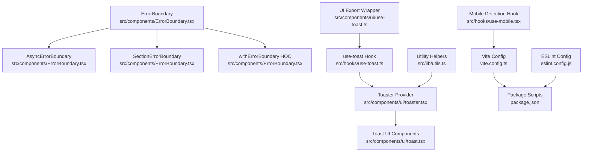
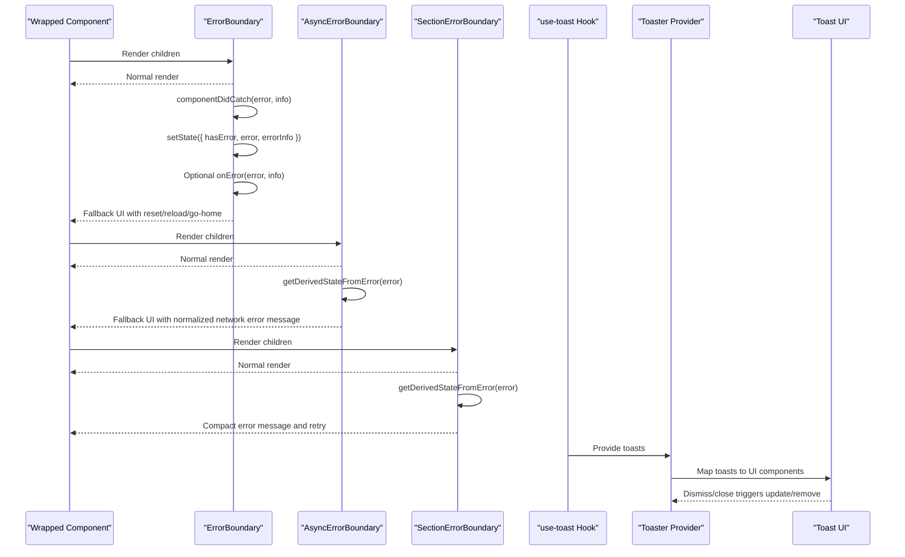
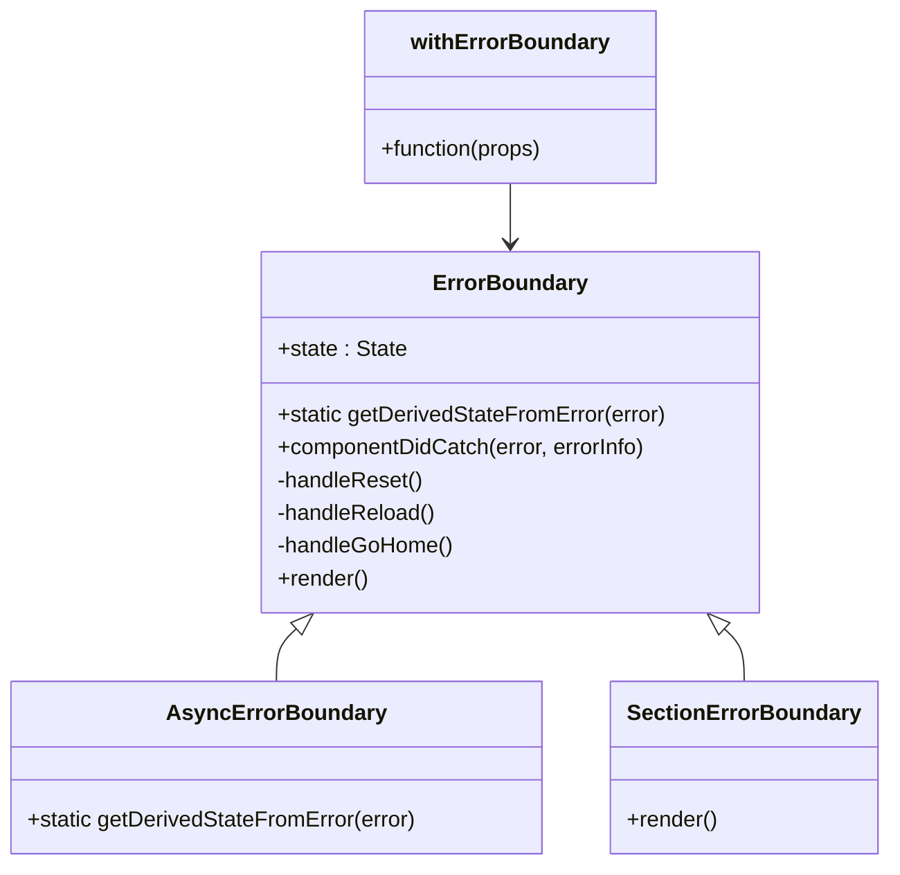
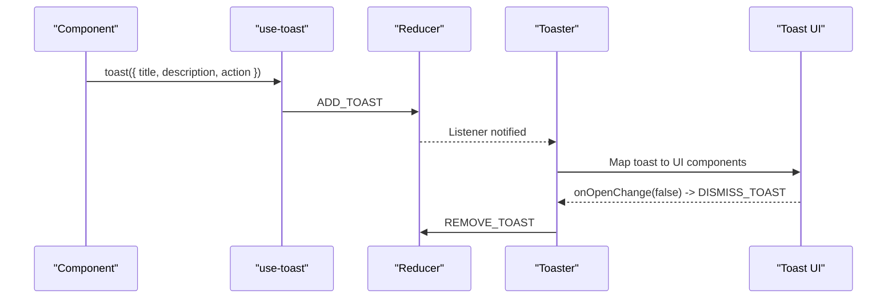
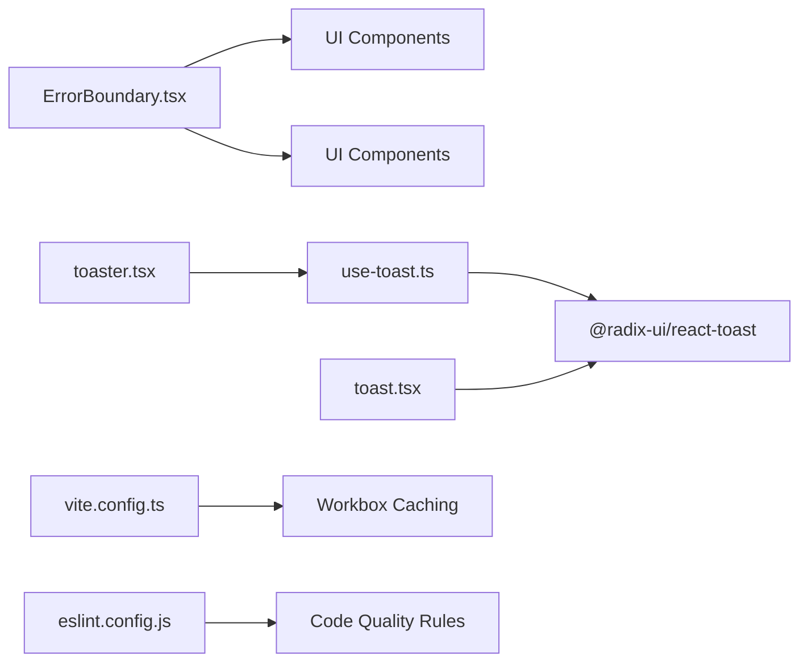

# Testing & Debugging Practices

<cite>
**Referenced Files in This Document**
- [ErrorBoundary.tsx](file://src/components/ErrorBoundary.tsx)
- [use-toast.ts](file://src/hooks/use-toast.ts)
- [toast.tsx](file://src/components/ui/toast.tsx)
- [toaster.tsx](file://src/components/ui/toaster.tsx)
- [use-toast.ts (UI export)](file://src/components/ui/use-toast.ts)
- [vite.config.ts](file://vite.config.ts)
- [eslint.config.js](file://eslint.config.js)
- [package.json](file://package.json)
- [utils.ts](file://src/lib/utils.ts)
- [use-mobile.tsx](file://src/hooks/use-mobile.tsx)
</cite>

## Table of Contents
1. [Introduction](#introduction)
2. [Project Structure](#project-structure)
3. [Core Components](#core-components)
4. [Architecture Overview](#architecture-overview)
5. [Detailed Component Analysis](#detailed-component-analysis)
6. [Dependency Analysis](#dependency-analysis)
7. [Performance Considerations](#performance-considerations)
8. [Troubleshooting Guide](#troubleshooting-guide)
9. [Conclusion](#conclusion)
10. [Appendices](#appendices)

## Introduction
This document consolidates testing strategies, debugging techniques, and quality assurance practices for the project. It focuses on:
- Error boundary implementation and recovery patterns
- Toast notification system for user feedback
- Debugging approaches for React components and hooks
- Unit and integration testing considerations
- Performance monitoring and caching strategies
- Error tracking readiness and development tooling integration
- Guidelines for testing edge cases, handling async operations, and maintaining reliability

## Project Structure
The testing and debugging ecosystem centers around:
- Error handling via a robust error boundary hierarchy
- A toast notification system built on Radix UI with a custom reducer and provider pattern
- Development tooling via ESLint and Vite configuration
- Utility helpers for class merging and responsive detection

**Diagram sources**
- [ErrorBoundary.tsx](file://src/components/ErrorBoundary.tsx#L25-L136)
- [use-toast.ts](file://src/hooks/use-toast.ts#L166-L184)
- [toast.tsx](file://src/components/ui/toast.tsx#L8-L112)
- [toaster.tsx](file://src/components/ui/toaster.tsx#L4-L24)
- [use-toast.ts (UI export)](file://src/components/ui/use-toast.ts#L1-L4)
- [vite.config.ts](file://vite.config.ts#L1-L87)
- [eslint.config.js](file://eslint.config.js#L1-L39)
- [package.json](file://package.json#L1-L106)
- [utils.ts](file://src/lib/utils.ts#L1-L7)
- [use-mobile.tsx](file://src/hooks/use-mobile.tsx#L1-L20)

**Section sources**
- [ErrorBoundary.tsx](file://src/components/ErrorBoundary.tsx#L1-L206)
- [use-toast.ts](file://src/hooks/use-toast.ts#L1-L187)
- [toast.tsx](file://src/components/ui/toast.tsx#L1-L112)
- [toaster.tsx](file://src/components/ui/toaster.tsx#L1-L25)
- [use-toast.ts (UI export)](file://src/components/ui/use-toast.ts#L1-L4)
- [vite.config.ts](file://vite.config.ts#L1-L87)
- [eslint.config.js](file://eslint.config.js#L1-L39)
- [package.json](file://package.json#L1-L106)
- [utils.ts](file://src/lib/utils.ts#L1-L7)
- [use-mobile.tsx](file://src/hooks/use-mobile.tsx#L1-L20)

## Core Components
- Error Boundary: Catches JavaScript errors, logs them, and renders a user-friendly fallback UI with recovery actions. Includes specialized variants for async operations and small sections.
- Toast System: A Redux-like reducer-driven toast manager with a provider and UI components, enabling declarative user feedback and controlled dismissal.
- Development Tooling: ESLint enforces strict TypeScript and React rules; Vite provides dev server, environment variable fallbacks, and PWA caching.

Key implementation references:
- Error Boundary lifecycle and fallback rendering
  - [ErrorBoundary class](file://src/components/ErrorBoundary.tsx#L25-L136)
  - [AsyncErrorBoundary](file://src/components/ErrorBoundary.tsx#L158-L173)
  - [SectionErrorBoundary](file://src/components/ErrorBoundary.tsx#L179-L205)
  - [withErrorBoundary HOC](file://src/components/ErrorBoundary.tsx#L141-L152)
- Toast system internals and provider
  - [use-toast hook and reducer](file://src/hooks/use-toast.ts#L166-L184)
  - [toast function and dispatch](file://src/hooks/use-toast.ts#L137-L164)
  - [Toast UI primitives](file://src/components/ui/toast.tsx#L8-L112)
  - [Toaster provider](file://src/components/ui/toaster.tsx#L4-L24)
  - [UI export wrapper](file://src/components/ui/use-toast.ts#L1-L4)
- Dev tooling and environment
  - [Vite PWA and caching](file://vite.config.ts#L22-L78)
  - [ESLint rules](file://eslint.config.js#L20-L36)
  - [Package scripts](file://package.json#L6-L11)

**Section sources**
- [ErrorBoundary.tsx](file://src/components/ErrorBoundary.tsx#L25-L136)
- [ErrorBoundary.tsx](file://src/components/ErrorBoundary.tsx#L158-L173)
- [ErrorBoundary.tsx](file://src/components/ErrorBoundary.tsx#L179-L205)
- [ErrorBoundary.tsx](file://src/components/ErrorBoundary.tsx#L141-L152)
- [use-toast.ts](file://src/hooks/use-toast.ts#L166-L184)
- [use-toast.ts](file://src/hooks/use-toast.ts#L137-L164)
- [toast.tsx](file://src/components/ui/toast.tsx#L8-L112)
- [toaster.tsx](file://src/components/ui/toaster.tsx#L4-L24)
- [use-toast.ts (UI export)](file://src/components/ui/use-toast.ts#L1-L4)
- [vite.config.ts](file://vite.config.ts#L22-L78)
- [eslint.config.js](file://eslint.config.js#L20-L36)
- [package.json](file://package.json#L6-L11)

## Architecture Overview
The error handling and feedback architecture integrates boundary-level resilience with user-facing notifications.

**Diagram sources**
- [ErrorBoundary.tsx](file://src/components/ErrorBoundary.tsx#L32-L50)
- [ErrorBoundary.tsx](file://src/components/ErrorBoundary.tsx#L158-L173)
- [ErrorBoundary.tsx](file://src/components/ErrorBoundary.tsx#L179-L205)
- [use-toast.ts](file://src/hooks/use-toast.ts#L166-L184)
- [toaster.tsx](file://src/components/ui/toaster.tsx#L4-L24)
- [toast.tsx](file://src/components/ui/toast.tsx#L8-L112)

## Detailed Component Analysis

### Error Boundary Implementation
- Purpose: Prevent app crashes by catching JavaScript errors in the component tree and rendering a graceful fallback.
- Behavior:
  - Captures errors via lifecycle methods and updates internal state.
  - Supports a custom fallback prop or a default UI with recovery actions.
  - Provides an optional onError callback for logging or analytics.
  - Specialized variants:
    - AsyncErrorBoundary normalizes network-related errors for better UX.
    - SectionErrorBoundary provides a compact, inline error indicator for subsections.
  - HOC wrapper enables easy composition around any component.

**Diagram sources**
- [ErrorBoundary.tsx](file://src/components/ErrorBoundary.tsx#L25-L136)
- [ErrorBoundary.tsx](file://src/components/ErrorBoundary.tsx#L158-L173)
- [ErrorBoundary.tsx](file://src/components/ErrorBoundary.tsx#L179-L205)
- [ErrorBoundary.tsx](file://src/components/ErrorBoundary.tsx#L141-L152)

**Section sources**
- [ErrorBoundary.tsx](file://src/components/ErrorBoundary.tsx#L25-L136)
- [ErrorBoundary.tsx](file://src/components/ErrorBoundary.tsx#L158-L173)
- [ErrorBoundary.tsx](file://src/components/ErrorBoundary.tsx#L179-L205)
- [ErrorBoundary.tsx](file://src/components/ErrorBoundary.tsx#L141-L152)

### Toast Notification System
- Purpose: Provide non-blocking, user-friendly feedback for operations and errors.
- Mechanism:
  - use-toast manages a reducer-backed queue of toasts with IDs, titles, descriptions, and actions.
  - Toaster renders the toast stack using Radix UI primitives with swipe/close behavior.
  - UI wrappers expose ToastProvider, Viewport, Root, Title, Description, Close, and Action.
  - A lightweight UI export re-exports the hook for convenience.

**Diagram sources**
- [use-toast.ts](file://src/hooks/use-toast.ts#L137-L164)
- [use-toast.ts](file://src/hooks/use-toast.ts#L71-L122)
- [toaster.tsx](file://src/components/ui/toaster.tsx#L4-L24)
- [toast.tsx](file://src/components/ui/toast.tsx#L8-L112)

**Section sources**
- [use-toast.ts](file://src/hooks/use-toast.ts#L1-L187)
- [toast.tsx](file://src/components/ui/toast.tsx#L1-L112)
- [toaster.tsx](file://src/components/ui/toaster.tsx#L1-L25)
- [use-toast.ts (UI export)](file://src/components/ui/use-toast.ts#L1-L4)

### Debugging Approaches for React Components and Hooks
- Error Boundaries:
  - Wrap unstable sections with ErrorBoundary or AsyncErrorBoundary to isolate failures and provide recovery controls.
  - Use onError to integrate with external error tracking services.
- Console Logging:
  - DEV-only logging in ErrorBoundary aids quick diagnosis during development.
- Responsive and Utility Helpers:
  - use-mobile detects viewport breakpoints for responsive tests.
  - utils.cn merges Tailwind classes safely to avoid conflicts in UI snapshots/tests.
- ESLint Rules:
  - Strict linting prevents common pitfalls and encourages defensive coding practices.

**Section sources**
- [ErrorBoundary.tsx](file://src/components/ErrorBoundary.tsx#L46-L49)
- [use-mobile.tsx](file://src/hooks/use-mobile.tsx#L1-L20)
- [utils.ts](file://src/lib/utils.ts#L1-L7)
- [eslint.config.js](file://eslint.config.js#L20-L36)

### Unit Testing Patterns
- Component-level:
  - Test render paths with and without errors using boundary props.
  - Simulate componentDidCatch and getDerivedStateFromError transitions.
- Hook-level:
  - Mock dispatch and listeners to assert state transitions (ADD_TOAST, DISMISS_TOAST, REMOVE_TOAST).
  - Verify toast ID generation and timeouts.
- UI-level:
  - Snapshot or DOM assertions for Toaster and Toast UI components.
  - Interaction tests for close/action buttons and viewport behavior.

[No sources needed since this section provides general guidance]

### Integration Testing Considerations
- Boundary coverage:
  - Verify fallback UI appears after simulated errors and that recovery actions reset state.
  - Validate AsyncErrorBoundary normalization of network-related errors.
- Toast integration:
  - Confirm Provider wraps app routes/components and that toasts appear/disappear as expected.
  - Test concurrent toasts respecting limits and dismissal semantics.
- Environment and caching:
  - Validate Vite environment fallbacks and PWA caching behavior under different network conditions.

[No sources needed since this section provides general guidance]

### Debugging Tools Usage
- ESLint:
  - Enforce recommended and strict TypeScript rules; catch unused variables, explicit any, and equality checks.
- Vite:
  - Use dev server host/port configuration and environment fallbacks for local testing.
  - Leverage PWA caching strategies to simulate offline scenarios and measure cache hits.

**Section sources**
- [eslint.config.js](file://eslint.config.js#L20-L36)
- [vite.config.ts](file://vite.config.ts#L8-L19)
- [vite.config.ts](file://vite.config.ts#L47-L78)

## Dependency Analysis
- Error Boundary depends on UI primitives for buttons and cards.
- Toast system depends on Radix UI and a custom reducer with a provider.
- Vite config defines caching and PWA behavior affecting performance and reliability.
- ESLint config influences code quality and testability.

**Diagram sources**
- [ErrorBoundary.tsx](file://src/components/ErrorBoundary.tsx#L8-L12)
- [use-toast.ts](file://src/hooks/use-toast.ts#L1-L3)
- [toast.tsx](file://src/components/ui/toast.tsx#L1-L3)
- [toaster.tsx](file://src/components/ui/toaster.tsx#L1-L2)
- [vite.config.ts](file://vite.config.ts#L47-L78)
- [eslint.config.js](file://eslint.config.js#L16-L36)

**Section sources**
- [ErrorBoundary.tsx](file://src/components/ErrorBoundary.tsx#L8-L12)
- [use-toast.ts](file://src/hooks/use-toast.ts#L1-L3)
- [toast.tsx](file://src/components/ui/toast.tsx#L1-L3)
- [toaster.tsx](file://src/components/ui/toaster.tsx#L1-L2)
- [vite.config.ts](file://vite.config.ts#L47-L78)
- [eslint.config.js](file://eslint.config.js#L16-L36)

## Performance Considerations
- Caching and Offline Resilience:
  - Vite PWA Workbox caches Supabase API responses and images with TTL and entry limits to reduce latency and improve reliability.
- Bundle Deduplication:
  - Vite resolves aliases and deduplicates core libraries to minimize bundle size and duplicate runtime overhead.
- Toast Limits:
  - The toast system enforces a limit and delayed removal to prevent UI overload and memory leaks.

**Section sources**
- [vite.config.ts](file://vite.config.ts#L47-L78)
- [vite.config.ts](file://vite.config.ts#L80-L85)
- [use-toast.ts](file://src/hooks/use-toast.ts#L5-L6)
- [use-toast.ts](file://src/hooks/use-toast.ts#L55-L69)

## Troubleshooting Guide
- Error Boundary not triggering:
  - Ensure the boundary is placed above the component throwing the error.
  - Verify getDerivedStateFromError and componentDidCatch are invoked; check onError integration.
- AsyncErrorBoundary not normalizing errors:
  - Confirm error messages include expected keywords for network detection.
- Toasts not appearing:
  - Verify Toaster is rendered at the app root and Provider wraps components.
  - Check toast function is called and reducer listeners are active.
- Network caching issues:
  - Inspect Workbox runtime caching configuration and cache names.
- Lint failures:
  - Review ESLint rule violations and adjust code accordingly.

**Section sources**
- [ErrorBoundary.tsx](file://src/components/ErrorBoundary.tsx#L32-L50)
- [ErrorBoundary.tsx](file://src/components/ErrorBoundary.tsx#L158-L173)
- [toaster.tsx](file://src/components/ui/toaster.tsx#L4-L24)
- [use-toast.ts](file://src/hooks/use-toast.ts#L128-L133)
- [vite.config.ts](file://vite.config.ts#L47-L78)
- [eslint.config.js](file://eslint.config.js#L20-L36)

## Conclusion
The project implements a layered approach to reliability and user feedback:
- Error boundaries isolate failures and guide users back on track
- A robust toast system delivers timely, dismissible feedback
- Strong development tooling ensures code quality and predictable behavior
- PWA caching improves performance and resilience

Adopting the testing and debugging practices outlined here will help maintain application stability, improve user experience, and streamline maintenance.

## Appendices
- Testing Edge Cases:
  - Boundary: simulate constructor errors, render throws, and async promise rejections.
  - Toast: rapid successive toasts, immediate dismissal, and empty states.
- Handling Async Operations:
  - Wrap data-fetching components with AsyncErrorBoundary.
  - Use toast for loading, success, and error states during async flows.
- Reliability Checklist:
  - Every major route/page wrapped with ErrorBoundary
  - All user-visible actions trigger appropriate toasts
  - Lint rules enforced in CI
  - PWA caching validated across network conditions

[No sources needed since this section provides general guidance]