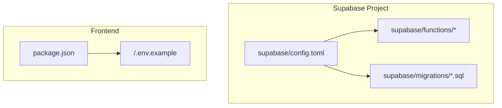
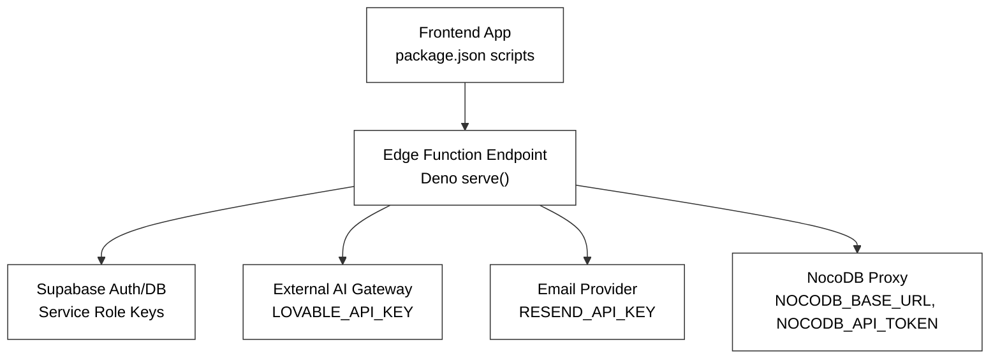
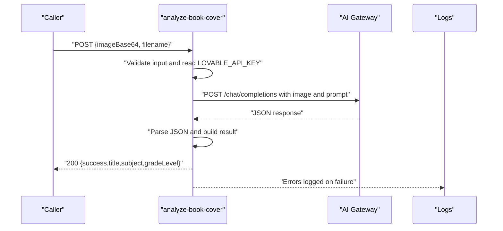
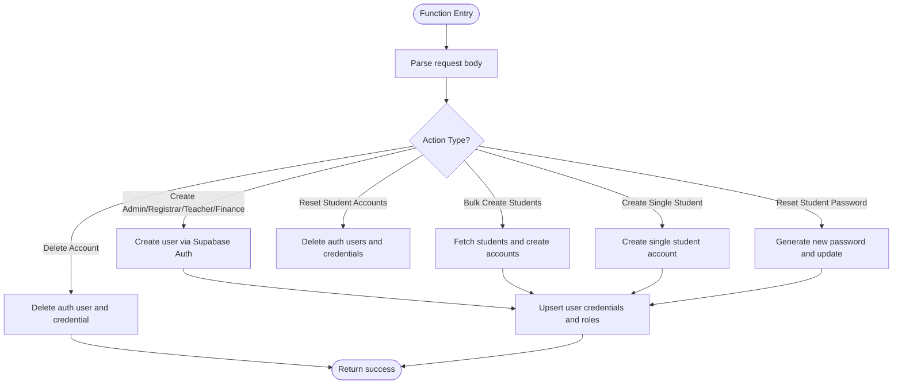
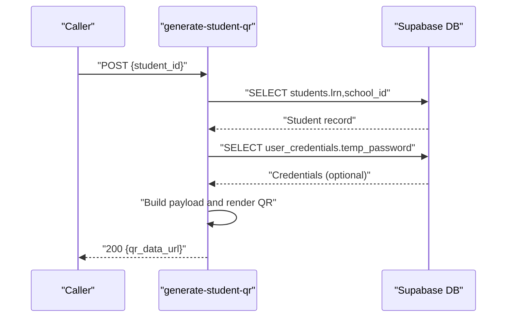
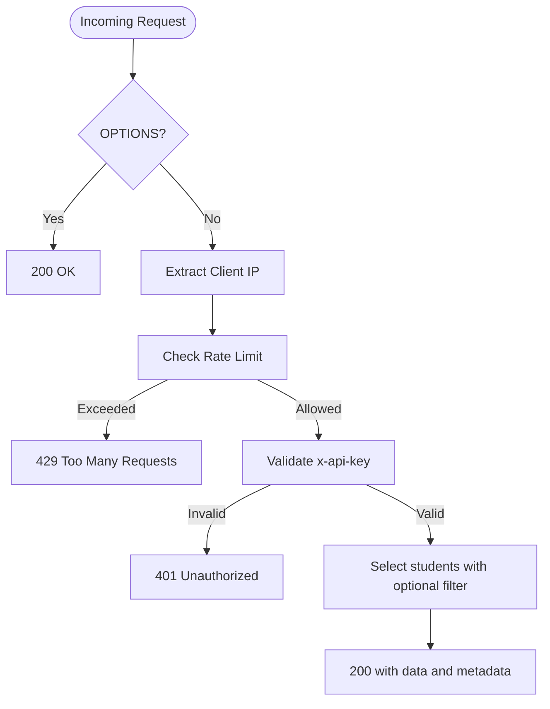
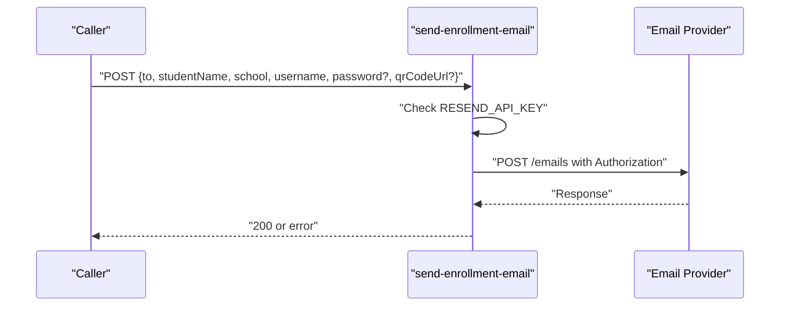
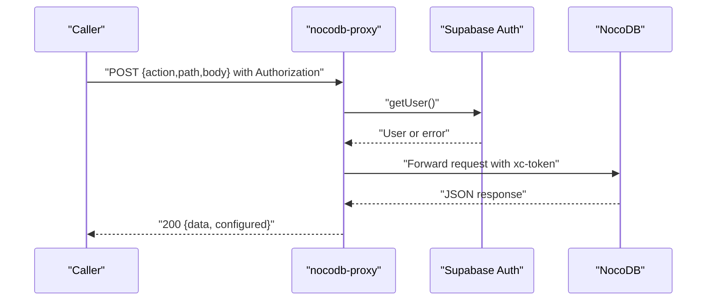
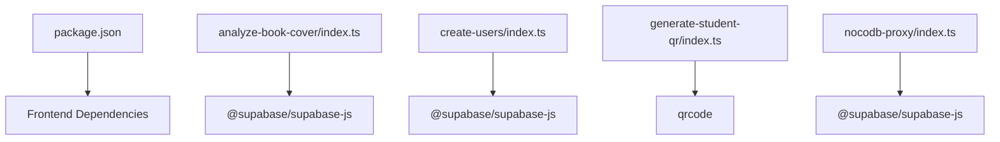

# Deployment & Configuration

<cite>
**Referenced Files in This Document**
- [config.toml](file://supabase/config.toml)
- [.env.example](file://.env.example)
- [package.json](file://package.json)
- [analyze-book-cover/index.ts](file://supabase/functions/analyze-book-cover/index.ts)
- [create-users/index.ts](file://supabase/functions/create-users/index.ts)
- [generate-student-qr/index.ts](file://supabase/functions/generate-student-qr/index.ts)
- [sync-students/index.ts](file://supabase/functions/sync-students/index.ts)
- [send-enrollment-email/index.ts](file://supabase/functions/send-enrollment-email/index.ts)
- [nocodb-proxy/index.ts](file://supabase/functions/nocodb-proxy/index.ts)
</cite>

## Table of Contents
1. [Introduction](#introduction)
2. [Project Structure](#project-structure)
3. [Core Components](#core-components)
4. [Architecture Overview](#architecture-overview)
5. [Detailed Component Analysis](#detailed-component-analysis)
6. [Dependency Analysis](#dependency-analysis)
7. [Performance Considerations](#performance-considerations)
8. [Troubleshooting Guide](#troubleshooting-guide)
9. [Conclusion](#conclusion)
10. [Appendices](#appendices)

## Introduction
This document explains how edge functions are deployed and configured in the Supabase environment for this project. It covers the Supabase configuration structure, environment variable management, function deployment workflows, build processes, dependency management, version control strategies, configuration examples for different environments, security considerations, monitoring setup, scaling and resource limits, cost optimization, and troubleshooting for common deployment issues.

## Project Structure
The Supabase project is organized under the supabase directory with two primary areas:
- Edge Functions: Located under supabase/functions/<function-name>/index.ts
- Migrations: SQL migration files under supabase/migrations/
- Supabase project configuration: supabase/config.toml

The frontend project defines build scripts and dependencies in package.json, while environment variables for the frontend are defined in .env.example.

**Diagram sources**
- [config.toml](file://supabase/config.toml#L1-L1)
- [package.json](file://package.json#L1-L106)
- [.env.example](file://.env.example#L1-L9)

**Section sources**
- [config.toml](file://supabase/config.toml#L1-L1)
- [package.json](file://package.json#L1-L106)
- [.env.example](file://.env.example#L1-L9)

## Core Components
- Supabase project identifier: The project is identified by a project_id in the Supabase configuration file.
- Edge Functions: Each function is a Deno-based HTTP endpoint located under supabase/functions/<function-name>/index.ts.
- Environment Variables: Functions rely on environment variables for third-party APIs and Supabase credentials.
- Frontend Environment: Frontend variables are defined in .env.example and should be copied to a local .env file for development.

Key responsibilities:
- Supabase configuration: Defines the project identity and is used by Supabase CLI/tooling.
- Edge functions: Implement HTTP endpoints for tasks such as OCR/book analysis, user creation, QR generation, student synchronization, email sending, and proxying external services.
- Environment variables: Provide secrets and configuration to functions at runtime.

**Section sources**
- [config.toml](file://supabase/config.toml#L1-L1)
- [analyze-book-cover/index.ts](file://supabase/functions/analyze-book-cover/index.ts#L1-L161)
- [create-users/index.ts](file://supabase/functions/create-users/index.ts#L1-L545)
- [generate-student-qr/index.ts](file://supabase/functions/generate-student-qr/index.ts#L1-L100)
- [sync-students/index.ts](file://supabase/functions/sync-students/index.ts#L1-L167)
- [send-enrollment-email/index.ts](file://supabase/functions/send-enrollment-email/index.ts#L1-L104)
- [nocodb-proxy/index.ts](file://supabase/functions/nocodb-proxy/index.ts#L1-L72)
- [.env.example](file://.env.example#L1-L9)

## Architecture Overview
The system integrates the frontend with Supabase edge functions. Functions are invoked by the frontend or internal flows and interact with Supabase Auth/DB and external services using environment variables.

**Diagram sources**
- [create-users/index.ts](file://supabase/functions/create-users/index.ts#L63-L72)
- [analyze-book-cover/index.ts](file://supabase/functions/analyze-book-cover/index.ts#L37-L44)
- [send-enrollment-email/index.ts](file://supabase/functions/send-enrollment-email/index.ts#L3-L34)
- [nocodb-proxy/index.ts](file://supabase/functions/nocodb-proxy/index.ts#L26-L31)

## Detailed Component Analysis

### Supabase Configuration Structure
- Project identity: The project_id in supabase/config.toml identifies the Supabase project for CLI/tooling.
- Supabase CLI usage: Tooling typically reads this file to target the correct project.

Operational notes:
- Keep the project_id unchanged unless migrating projects.
- Ensure Supabase CLI is configured to use the correct project context.

**Section sources**
- [config.toml](file://supabase/config.toml#L1-L1)

### Environment Variable Management
Frontend variables:
- VITE_SUPABASE_PROJECT_ID, VITE_SUPABASE_PUBLISHABLE_KEY, VITE_SUPABASE_URL define frontend integration with Supabase.
- Copy .env.example to .env.local for local overrides and never commit .env.local to version control.

Function variables:
- SUPABASE_URL, SUPABASE_SERVICE_ROLE_KEY, SUPABASE_ANON_KEY are used by functions to connect to Supabase.
- Third-party keys: LOVABLE_API_KEY, RESEND_API_KEY, OMADA_* secrets are used by specific functions.
- NocoDB proxy requires NOCODB_BASE_URL and NOCODB_API_TOKEN.

Security guidance:
- Store secrets in Supabase Edge Functions secrets, not in code.
- Limit exposure of publishable keys in client-side code.
- Rotate keys periodically and revoke unused ones.

**Section sources**
- [.env.example](file://.env.example#L1-L9)
- [create-users/index.ts](file://supabase/functions/create-users/index.ts#L63-L72)
- [analyze-book-cover/index.ts](file://supabase/functions/analyze-book-cover/index.ts#L37-L44)
- [send-enrollment-email/index.ts](file://supabase/functions/send-enrollment-email/index.ts#L3-L34)
- [nocodb-proxy/index.ts](file://supabase/functions/nocodb-proxy/index.ts#L26-L31)

### Function Deployment Workflows
- Local development: Functions are served locally by Deno’s HTTP server. The Supabase CLI can deploy them to the cloud project.
- Cloud deployment: Use Supabase CLI commands to push functions to the project defined by supabase/config.toml.
- Version control: Commit function source code and migrations; avoid committing secrets.

Recommended workflow:
- Develop and test locally using Deno.
- Stage changes in version control.
- Deploy to staging, then production after review.
- Monitor logs and metrics post-deployment.

**Section sources**
- [config.toml](file://supabase/config.toml#L1-L1)
- [package.json](file://package.json#L1-L106)

### Build Processes and Dependency Management
- Frontend build: The project uses Vite with React and TypeScript. Scripts include dev, build, build:dev, lint, and preview.
- Edge function dependencies: Functions import npm packages via Deno imports (e.g., @supabase/supabase-js, qrcode). These are resolved at runtime by Deno.
- Lockfiles: bun.lockb and package-lock.json indicate lockfiles exist; keep them updated to ensure reproducible builds.

Best practices:
- Pin versions of external npm dependencies in functions where possible.
- Keep function code minimal and focused to reduce cold start times.
- Prefer lightweight libraries and avoid bundling unnecessary code.

**Section sources**
- [package.json](file://package.json#L1-L106)
- [generate-student-qr/index.ts](file://supabase/functions/generate-student-qr/index.ts#L1-L3)
- [create-users/index.ts](file://supabase/functions/create-users/index.ts#L1-L2)

### Version Control Strategies
- Track function source code and migrations in version control.
- Exclude environment-specific .env files and local secrets.
- Use feature branches for function changes; merge to main after testing.
- Tag releases and associate migrations with deployment tags.

**Section sources**
- [.env.example](file://.env.example#L7-L9)

### Configuration Examples for Different Environments
- Development:
  - Frontend: Copy .env.example to .env.local and set VITE_SUPABASE_* variables.
  - Functions: Set SUPABASE_URL, SUPABASE_SERVICE_ROLE_KEY, and third-party keys in Supabase Edge Functions secrets.
- Staging:
  - Point to staging Supabase project and configure corresponding secrets.
- Production:
  - Use production Supabase project and secrets; enable monitoring and alerts.

Note: Replace placeholder values with actual values from your Supabase project and third-party providers.

**Section sources**
- [.env.example](file://.env.example#L1-L9)
- [config.toml](file://supabase/config.toml#L1-L1)

### Security Considerations
- Secrets storage: Store all secrets in Supabase Edge Functions secrets, not in code or environment files.
- Access control:
  - Use Supabase Auth for protected endpoints (e.g., nocodb-proxy validates Authorization header).
  - Use API keys for endpoints like sync-students (x-api-key header).
- CORS: Functions set Access-Control-Allow-* headers; ensure they match expected origins.
- Rate limiting: Some functions implement basic rate limiting; consider upgrading to distributed rate limiting in production.

**Section sources**
- [nocodb-proxy/index.ts](file://supabase/functions/nocodb-proxy/index.ts#L15-L24)
- [sync-students/index.ts](file://supabase/functions/sync-students/index.ts#L75-L91)
- [analyze-book-cover/index.ts](file://supabase/functions/analyze-book-cover/index.ts#L3-L7)

### Monitoring Setup
- Enable Supabase Edge Functions logging to capture function invocations, errors, and latency.
- Use external monitoring for third-party services (e.g., Resend, NocoDB) and track error rates and response times.
- Alert on frequent 429 (rate limit), 401 (unauthorized), and 5xx errors.

[No sources needed since this section provides general guidance]

### Scaling, Resource Limits, and Cost Optimization
- Cold starts: Keep functions small and lean to minimize cold start overhead.
- Concurrency: Adjust function concurrency limits in Supabase settings to balance throughput and cost.
- Rate limiting: Implement robust rate limiting at the function level and at upstream services.
- Caching: Use cache-control headers appropriately; avoid caching sensitive data.
- Costs: Reduce external API calls by batching or caching results where feasible.

[No sources needed since this section provides general guidance]

## Detailed Component Analysis

### Analyze Book Cover Function
Purpose:
- Accepts a base64 image and filename, queries an AI gateway, and returns extracted metadata (title, subject, grade level).

Key behaviors:
- Validates input and checks for LOVABLE_API_KEY.
- Calls external AI gateway with structured prompt and image.
- Parses JSON from AI response, handling markdown code blocks.
- Returns standardized response or error codes.

**Diagram sources**
- [analyze-book-cover/index.ts](file://supabase/functions/analyze-book-cover/index.ts#L22-L160)

**Section sources**
- [analyze-book-cover/index.ts](file://supabase/functions/analyze-book-cover/index.ts#L1-L161)

### Create Users Function
Purpose:
- Creates admin/registrar/teacher/finance users and manages student accounts (bulk creation, reset, deletion).

Key behaviors:
- Uses Supabase service role client to manage auth and DB.
- Generates secure passwords and emails for students.
- Handles idempotent creation and updates roles.
- Supports bulk operations with detailed results.

**Diagram sources**
- [create-users/index.ts](file://supabase/functions/create-users/index.ts#L57-L542)

**Section sources**
- [create-users/index.ts](file://supabase/functions/create-users/index.ts#L1-L545)

### Generate Student QR Function
Purpose:
- Generates a QR code containing student LRN, temporary password, and school code.

Key behaviors:
- Validates input student_id.
- Queries Supabase for student and school details.
- Builds QR payload and renders as data URL.
- Sets cache-control headers to prevent caching.

**Diagram sources**
- [generate-student-qr/index.ts](file://supabase/functions/generate-student-qr/index.ts#L15-L99)

**Section sources**
- [generate-student-qr/index.ts](file://supabase/functions/generate-student-qr/index.ts#L1-L100)

### Sync Students Function
Purpose:
- Exposes a filtered list of students with rate limiting and API key protection.

Key behaviors:
- Validates x-api-key header against SYNC_API_KEY.
- Applies optional school filter from request body.
- Uses Supabase service role client for read access.
- Implements in-memory rate limiting per IP.

**Diagram sources**
- [sync-students/index.ts](file://supabase/functions/sync-students/index.ts#L49-L166)

**Section sources**
- [sync-students/index.ts](file://supabase/functions/sync-students/index.ts#L1-L167)

### Send Enrollment Email Function
Purpose:
- Sends an enrollment confirmation email via an external provider, optionally including a QR code.

Key behaviors:
- Validates presence of RESEND_API_KEY.
- Constructs HTML email with dynamic content.
- Calls external email API and returns response or error.

**Diagram sources**
- [send-enrollment-email/index.ts](file://supabase/functions/send-enrollment-email/index.ts#L19-L101)

**Section sources**
- [send-enrollment-email/index.ts](file://supabase/functions/send-enrollment-email/index.ts#L1-L104)

### NocoDB Proxy Function
Purpose:
- Proxies authenticated requests to NocoDB using Supabase Auth for authorization.

Key behaviors:
- Validates Authorization header via Supabase Auth.
- Reads NOCODB_BASE_URL and NOCODB_API_TOKEN from environment.
- Forwards actions/methods and bodies to NocoDB and returns JSON responses.

**Diagram sources**
- [nocodb-proxy/index.ts](file://supabase/functions/nocodb-proxy/index.ts#L9-L71)

**Section sources**
- [nocodb-proxy/index.ts](file://supabase/functions/nocodb-proxy/index.ts#L1-L72)

## Dependency Analysis
- Frontend dependencies: Managed via package.json; includes React, Supabase JS SDK, and related libraries.
- Edge function dependencies: Managed via Deno imports of npm packages; ensure versions align with function requirements.
- Supabase connectivity: Functions use Supabase service role keys for admin operations and anon keys for authenticated flows.

**Diagram sources**
- [package.json](file://package.json#L13-L84)
- [analyze-book-cover/index.ts](file://supabase/functions/analyze-book-cover/index.ts#L1-L2)
- [create-users/index.ts](file://supabase/functions/create-users/index.ts#L1-L2)
- [generate-student-qr/index.ts](file://supabase/functions/generate-student-qr/index.ts#L1-L2)
- [nocodb-proxy/index.ts](file://supabase/functions/nocodb-proxy/index.ts#L1-L2)

**Section sources**
- [package.json](file://package.json#L1-L106)
- [analyze-book-cover/index.ts](file://supabase/functions/analyze-book-cover/index.ts#L1-L2)
- [create-users/index.ts](file://supabase/functions/create-users/index.ts#L1-L2)
- [generate-student-qr/index.ts](file://supabase/functions/generate-student-qr/index.ts#L1-L2)
- [nocodb-proxy/index.ts](file://supabase/functions/nocodb-proxy/index.ts#L1-L2)

## Performance Considerations
- Minimize function payload sizes and avoid heavy synchronous I/O.
- Cache external API responses when safe and appropriate.
- Use Supabase’s built-in rate limiting and consider adding distributed rate limiting for high-traffic endpoints.
- Monitor function durations and adjust concurrency limits accordingly.

[No sources needed since this section provides general guidance]

## Troubleshooting Guide
Common issues and resolutions:
- Missing environment variables:
  - Symptoms: 500 errors indicating missing keys (e.g., LOVABLE_API_KEY, RESEND_API_KEY).
  - Resolution: Set the required secrets in Supabase Edge Functions secrets.
- Unauthorized access:
  - Symptoms: 401 errors on protected endpoints (e.g., nocodb-proxy).
  - Resolution: Ensure Authorization header is present and valid; verify Supabase Auth configuration.
- Invalid API key:
  - Symptoms: 401 errors on sync-students.
  - Resolution: Set x-api-key header to match SYNC_API_KEY.
- Non-JSON responses from external services:
  - Symptoms: 502 errors from proxies.
  - Resolution: Verify URLs and tokens; check external service status.
- CORS errors:
  - Symptoms: Browser blocked requests.
  - Resolution: Confirm Access-Control-Allow-Origin and headers are set in functions.
- Rate limiting:
  - Symptoms: 429 responses.
  - Resolution: Implement client-side retry with backoff; increase limits if justified.

**Section sources**
- [analyze-book-cover/index.ts](file://supabase/functions/analyze-book-cover/index.ts#L37-L44)
- [send-enrollment-email/index.ts](file://supabase/functions/send-enrollment-email/index.ts#L27-L34)
- [nocodb-proxy/index.ts](file://supabase/functions/nocodb-proxy/index.ts#L21-L24)
- [sync-students/index.ts](file://supabase/functions/sync-students/index.ts#L75-L91)
- [nocodb-proxy/index.ts](file://supabase/functions/nocodb-proxy/index.ts#L48-L60)

## Conclusion
This project’s edge functions integrate tightly with Supabase for user management, QR generation, student synchronization, email delivery, and external service proxying. By following secure environment variable management, implementing robust error handling, and adopting monitoring and rate limiting, teams can maintain reliable, scalable, and cost-efficient deployments across development, staging, and production environments.

[No sources needed since this section summarizes without analyzing specific files]

## Appendices
- Supabase project_id: Ensure this matches your project for CLI operations.
- Frontend environment variables: Define VITE_SUPABASE_* in .env.local for local development.
- Function secrets: Configure SUPABASE_URL, SUPABASE_SERVICE_ROLE_KEY, SUPABASE_ANON_KEY, and third-party keys in Supabase Edge Functions secrets.

**Section sources**
- [config.toml](file://supabase/config.toml#L1-L1)
- [.env.example](file://.env.example#L1-L9)