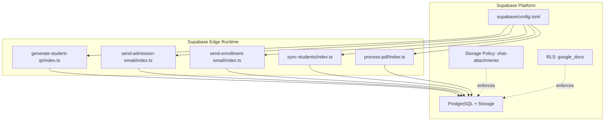
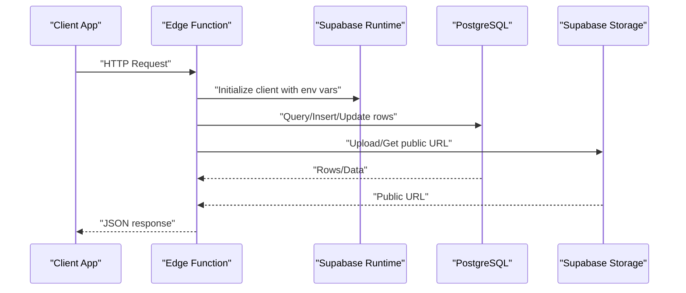
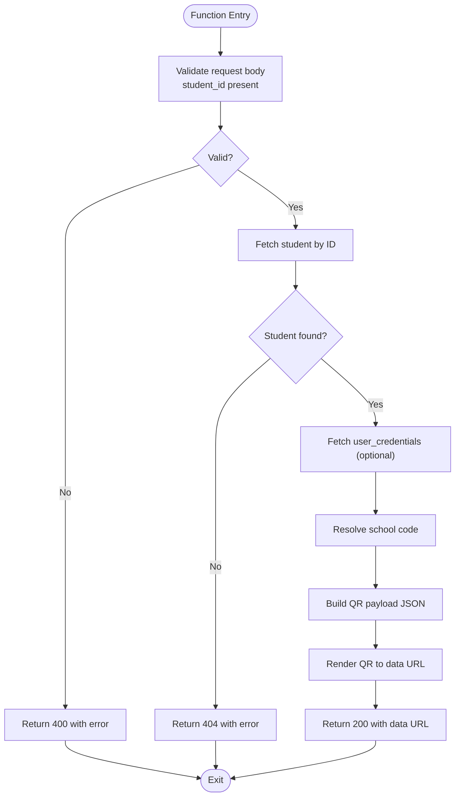
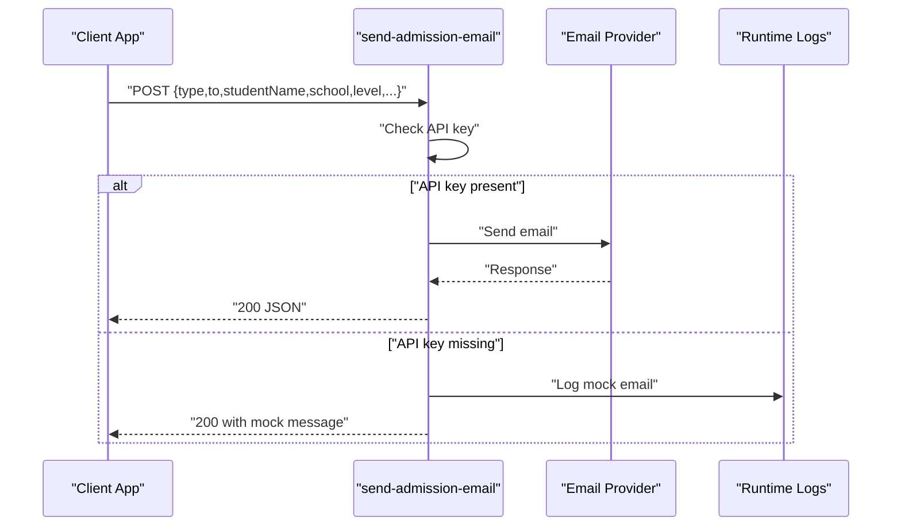
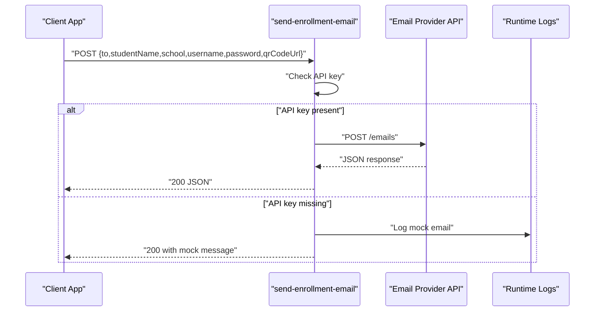
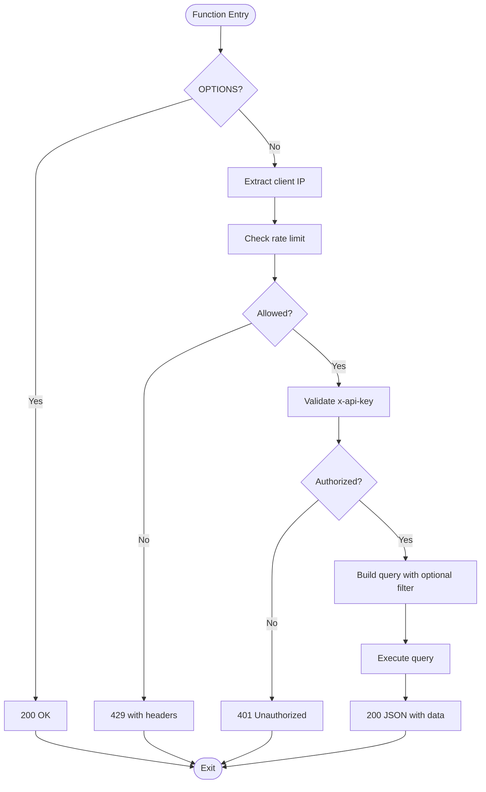
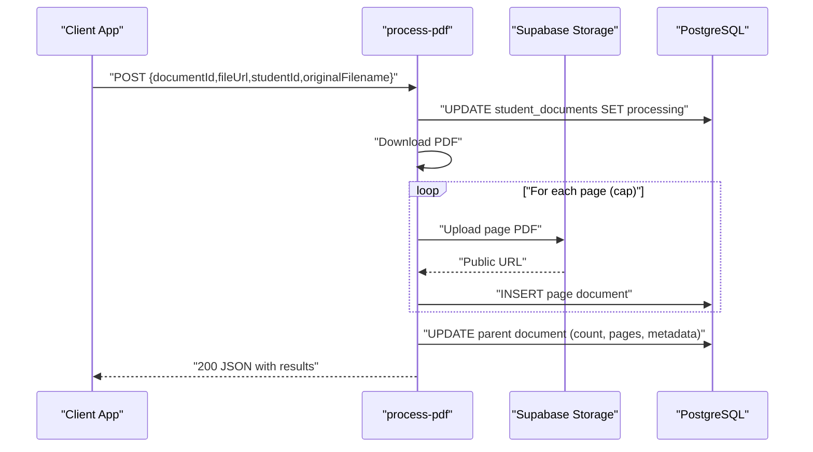
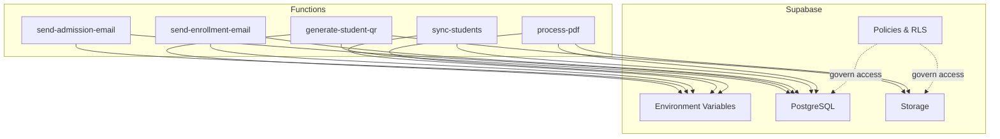

# Edge Functions & Serverless

<cite>
**Referenced Files in This Document**
- [config.toml](file://supabase/config.toml)
- [generate-student-qr/index.ts](file://supabase/functions/generate-student-qr/index.ts)
- [send-admission-email/index.ts](file://supabase/functions/send-admission-email/index.ts)
- [send-enrollment-email/index.ts](file://supabase/functions/send-enrollment-email/index.ts)
- [sync-students/index.ts](file://supabase/functions/sync-students/index.ts)
- [process-pdf/index.ts](file://supabase/functions/process-pdf/index.ts)
- [20260208003211_2d6001ae-257e-4060-a3ef-e138bb973134.sql](file://supabase/migrations/20260208003211_2d6001ae-257e-4060-a3ef-e138bb973134.sql)
- [20260208003659_39356598-c156-47f6-aa3d-4a829b37cb35.sql](file://supabase/migrations/20260208003659_39356598-c156-47f6-aa3d-4a829b37cb35.sql)
- [package.json](file://package.json)
- [README.md](file://README.md)
</cite>

## Table of Contents
1. [Introduction](#introduction)
2. [Project Structure](#project-structure)
3. [Core Components](#core-components)
4. [Architecture Overview](#architecture-overview)
5. [Detailed Component Analysis](#detailed-component-analysis)
6. [Dependency Analysis](#dependency-analysis)
7. [Performance Considerations](#performance-considerations)
8. [Troubleshooting Guide](#troubleshooting-guide)
9. [Conclusion](#conclusion)
10. [Appendices](#appendices)

## Introduction
This document explains the Supabase edge functions and serverless architecture used by the project. It catalogs key functions for QR code generation, email automation, document processing, and data synchronization. It also covers deployment, configuration, monitoring, triggers, execution patterns, error handling, limits, performance optimization, debugging, and integration examples with the main application.

## Project Structure
The serverless functions live under the Supabase functions directory. Each function is a self-contained module exposing a Deno HTTP endpoint. Configuration is centralized in the Supabase config file, while database policies and tables relevant to functions are defined in migrations.

**Diagram sources**
- [generate-student-qr/index.ts](file://supabase/functions/generate-student-qr/index.ts#L1-L100)
- [send-admission-email/index.ts](file://supabase/functions/send-admission-email/index.ts#L1-L126)
- [send-enrollment-email/index.ts](file://supabase/functions/send-enrollment-email/index.ts#L1-L104)
- [sync-students/index.ts](file://supabase/functions/sync-students/index.ts#L1-L167)
- [process-pdf/index.ts](file://supabase/functions/process-pdf/index.ts#L1-L194)
- [config.toml](file://supabase/config.toml#L1-L1)
- [20260208003211_2d6001ae-257e-4060-a3ef-e138bb973134.sql](file://supabase/migrations/20260208003211_2d6001ae-257e-4060-a3ef-e138bb973134.sql#L1-L8)
- [20260208003659_39356598-c156-47f6-aa3d-4a829b37cb35.sql](file://supabase/migrations/20260208003659_39356598-c156-47f6-aa3d-4a829b37cb35.sql#L1-L22)

**Section sources**
- [config.toml](file://supabase/config.toml#L1-L1)
- [README.md](file://README.md#L1-L76)

## Core Components
- QR code generation function: Builds a payload from student and credential data, generates a QR image, and returns a data URL.
- Admission email function: Sends approval/rejection/admin notification emails via a provider, with mock mode when API key is missing.
- Enrollment email function: Sends enrollment confirmation with optional QR code attachment using a provider API.
- Student synchronization function: Provides filtered student data with API key auth and basic rate limiting.
- PDF processing function: Splits multi-page PDFs into page-level documents, uploads pages to storage, and updates metadata.

**Section sources**
- [generate-student-qr/index.ts](file://supabase/functions/generate-student-qr/index.ts#L1-L100)
- [send-admission-email/index.ts](file://supabase/functions/send-admission-email/index.ts#L1-L126)
- [send-enrollment-email/index.ts](file://supabase/functions/send-enrollment-email/index.ts#L1-L104)
- [sync-students/index.ts](file://supabase/functions/sync-students/index.ts#L1-L167)
- [process-pdf/index.ts](file://supabase/functions/process-pdf/index.ts#L1-L194)

## Architecture Overview
The functions are invoked over HTTP and operate within the Supabase edge runtime. They use Supabase client libraries to interact with PostgreSQL and Supabase Storage. Authentication and authorization are enforced via Supabase service role keys and Row-Level Security policies.

**Diagram sources**
- [generate-student-qr/index.ts](file://supabase/functions/generate-student-qr/index.ts#L27-L45)
- [process-pdf/index.ts](file://supabase/functions/process-pdf/index.ts#L44-L50)
- [20260208003211_2d6001ae-257e-4060-a3ef-e138bb973134.sql](file://supabase/migrations/20260208003211_2d6001ae-257e-4060-a3ef-e138bb973134.sql#L1-L8)

## Detailed Component Analysis

### QR Code Generation Function
Purpose: Generate a QR code containing student identity and credentials, returning a data URL for immediate rendering.

Key behaviors:
- Validates input and returns structured errors.
- Fetches student details and associated credentials.
- Resolves school code for context.
- Renders QR image with fixed dimensions and colors.
- Returns cache-control headers to prevent caching.

**Diagram sources**
- [generate-student-qr/index.ts](file://supabase/functions/generate-student-qr/index.ts#L15-L99)

**Section sources**
- [generate-student-qr/index.ts](file://supabase/functions/generate-student-qr/index.ts#L1-L100)

### Admission Email Function
Purpose: Send admission-related emails (approval, rejection, admin notification) with rich HTML templates.

Key behaviors:
- Supports three email types via a type discriminator.
- Uses a provider SDK when API key is present; otherwise logs and returns a mock success.
- Constructs subject and HTML content based on type and payload.
- Returns standardized JSON responses.

**Diagram sources**
- [send-admission-email/index.ts](file://supabase/functions/send-admission-email/index.ts#L20-L125)

**Section sources**
- [send-admission-email/index.ts](file://supabase/functions/send-admission-email/index.ts#L1-L126)

### Enrollment Email Function
Purpose: Send enrollment confirmation email with optional QR code image.

Key behaviors:
- Validates request payload.
- Uses a provider API when API key is present; otherwise logs and returns a mock success.
- Embeds QR code image if provided.
- Returns standardized JSON responses.

**Diagram sources**
- [send-enrollment-email/index.ts](file://supabase/functions/send-enrollment-email/index.ts#L19-L103)

**Section sources**
- [send-enrollment-email/index.ts](file://supabase/functions/send-enrollment-email/index.ts#L1-L104)

### Student Synchronization Function
Purpose: Provide filtered student data to external systems with API key auth and rate limiting.

Key behaviors:
- Extracts client IP from forwarded headers.
- Enforces in-memory rate limit per IP.
- Validates API key header against environment variable.
- Queries students with optional school filter.
- Returns JSON with counts and timestamps.

**Diagram sources**
- [sync-students/index.ts](file://supabase/functions/sync-students/index.ts#L49-L166)

**Section sources**
- [sync-students/index.ts](file://supabase/functions/sync-students/index.ts#L1-L167)

### PDF Processing Function
Purpose: Split multi-page PDFs into page-level documents, upload pages to storage, and update metadata.

Key behaviors:
- Validates required parameters.
- Updates document status to processing.
- Downloads PDF and loads with a PDF library.
- Iterates pages (with a safe cap), uploads single-page PDFs to storage, and creates child document records.
- Updates parent document with page count, thumbnails, and metadata.

**Diagram sources**
- [process-pdf/index.ts](file://supabase/functions/process-pdf/index.ts#L43-L173)

**Section sources**
- [process-pdf/index.ts](file://supabase/functions/process-pdf/index.ts#L1-L194)

## Dependency Analysis
- Runtime and SDKs: Functions rely on the Deno runtime and Supabase client libraries for database and storage operations.
- Environment variables: Functions read SUPABASE_URL and SUPABASE_SERVICE_ROLE_KEY for database access, and provider-specific keys for email delivery.
- Storage policies: Access to storage buckets is governed by policies; for example, chat attachments are restricted to authenticated users and specific naming rules.
- RLS: Certain tables enforce row-level security policies to restrict access based on roles.

**Diagram sources**
- [generate-student-qr/index.ts](file://supabase/functions/generate-student-qr/index.ts#L27-L30)
- [send-admission-email/index.ts](file://supabase/functions/send-admission-email/index.ts#L26-L35)
- [send-enrollment-email/index.ts](file://supabase/functions/send-enrollment-email/index.ts#L3-L3)
- [sync-students/index.ts](file://supabase/functions/sync-students/index.ts#L77-L77)
- [process-pdf/index.ts](file://supabase/functions/process-pdf/index.ts#L39-L41)
- [20260208003211_2d6001ae-257e-4060-a3ef-e138bb973134.sql](file://supabase/migrations/20260208003211_2d6001ae-257e-4060-a3ef-e138bb973134.sql#L1-L8)
- [20260208003659_39356598-c156-47f6-aa3d-4a829b37cb35.sql](file://supabase/migrations/20260208003659_39356598-c156-47f6-aa3d-4a829b37cb35.sql#L1-L22)

**Section sources**
- [20260208003211_2d6001ae-257e-4060-a3ef-e138bb973134.sql](file://supabase/migrations/20260208003211_2d6001ae-257e-4060-a3ef-e138bb973134.sql#L1-L8)
- [20260208003659_39356598-c156-47f6-aa3d-4a829b37cb35.sql](file://supabase/migrations/20260208003659_39356598-c156-47f6-aa3d-4a829b37cb35.sql#L1-L22)

## Performance Considerations
- Concurrency and cold starts: Edge functions scale automatically but may incur cold-start latency; keep functions small and avoid heavy initialization.
- Network I/O: PDF processing downloads large files; ensure adequate timeouts and consider chunking or streaming where applicable.
- Storage operations: Batch writes and minimize round-trips; upload page-level PDFs efficiently and reuse URLs.
- Caching: Return appropriate cache-control headers to reduce redundant processing.
- Rate limiting: Use distributed rate limiting for production-scale ingestion; the student sync function demonstrates an in-memory approach suitable for low traffic.
- Dependencies: Prefer static imports for libraries to reduce startup overhead.

[No sources needed since this section provides general guidance]

## Troubleshooting Guide
Common issues and resolutions:
- Missing environment variables: Functions check for keys like SUPABASE_URL, SUPABASE_SERVICE_ROLE_KEY, and provider API keys. Verify environment configuration in the Supabase project settings.
- CORS errors: Ensure Access-Control-Allow-Origin and Access-Control-Allow-Headers are set consistently across functions.
- Authentication failures: For the student sync function, verify the x-api-key header matches the configured value.
- Storage upload failures: Confirm bucket permissions and policy compliance; the chat-attachments policy restricts uploads to authenticated users and specific naming.
- Database errors: Check RLS policies and service role key permissions; ensure queries target the correct tables and columns.
- Logging: Use console logging to capture request flow and error messages; monitor runtime logs for stack traces.

**Section sources**
- [generate-student-qr/index.ts](file://supabase/functions/generate-student-qr/index.ts#L15-L23)
- [send-admission-email/index.ts](file://supabase/functions/send-admission-email/index.ts#L26-L35)
- [send-enrollment-email/index.ts](file://supabase/functions/send-enrollment-email/index.ts#L27-L34)
- [sync-students/index.ts](file://supabase/functions/sync-students/index.ts#L75-L91)
- [process-pdf/index.ts](file://supabase/functions/process-pdf/index.ts#L31-L37)
- [20260208003211_2d6001ae-257e-4060-a3ef-e138bb973134.sql](file://supabase/migrations/20260208003211_2d6001ae-257e-4060-a3ef-e138bb973134.sql#L1-L8)

## Conclusion
The edge functions implement core workflows for QR generation, email automation, document processing, and data synchronization. They leverage Supabase’s edge runtime, database, and storage with clear separation of concerns. By following the patterns outlined here—secure environment configuration, robust error handling, and thoughtful performance tuning—you can extend and maintain the serverless architecture effectively.

[No sources needed since this section summarizes without analyzing specific files]

## Appendices

### Function Catalog
- generate-student-qr: Creates QR data URL for student identity and credentials.
- send-admission-email: Sends admission-related emails with rich HTML templates.
- send-enrollment-email: Sends enrollment confirmation with optional QR code.
- sync-students: Provides filtered student data with API key auth and rate limiting.
- process-pdf: Splits PDFs into page-level documents and updates metadata.

**Section sources**
- [generate-student-qr/index.ts](file://supabase/functions/generate-student-qr/index.ts#L1-L100)
- [send-admission-email/index.ts](file://supabase/functions/send-admission-email/index.ts#L1-L126)
- [send-enrollment-email/index.ts](file://supabase/functions/send-enrollment-email/index.ts#L1-L104)
- [sync-students/index.ts](file://supabase/functions/sync-students/index.ts#L1-L167)
- [process-pdf/index.ts](file://supabase/functions/process-pdf/index.ts#L1-L194)

### Deployment and Configuration
- Project configuration: The Supabase project identifier is defined centrally.
- Environment variables: Functions expect SUPABASE_URL and SUPABASE_SERVICE_ROLE_KEY; provider keys are required for email functions.
- Frontend integration: The main application depends on Supabase client libraries; functions can be invoked via HTTPS endpoints exposed by the Supabase platform.

**Section sources**
- [config.toml](file://supabase/config.toml#L1-L1)
- [package.json](file://package.json#L42-L42)
- [README.md](file://README.md#L65-L76)

### Monitoring and Observability
- Runtime logs: Use console logging to trace request lifecycle and errors.
- Health checks: Implement lightweight endpoints to verify function availability.
- Metrics: Track invocation counts, latency, and error rates at the platform level.

[No sources needed since this section provides general guidance]