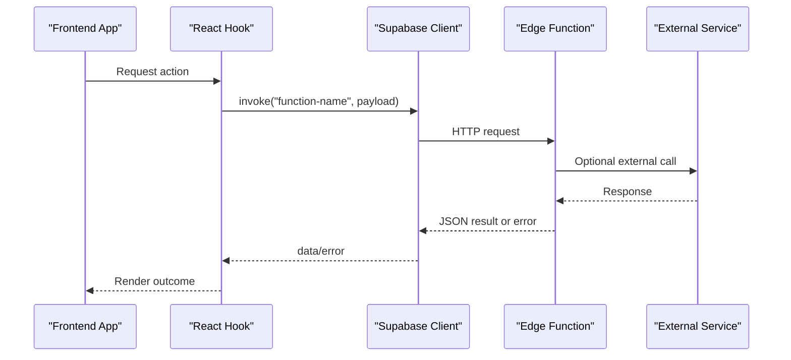
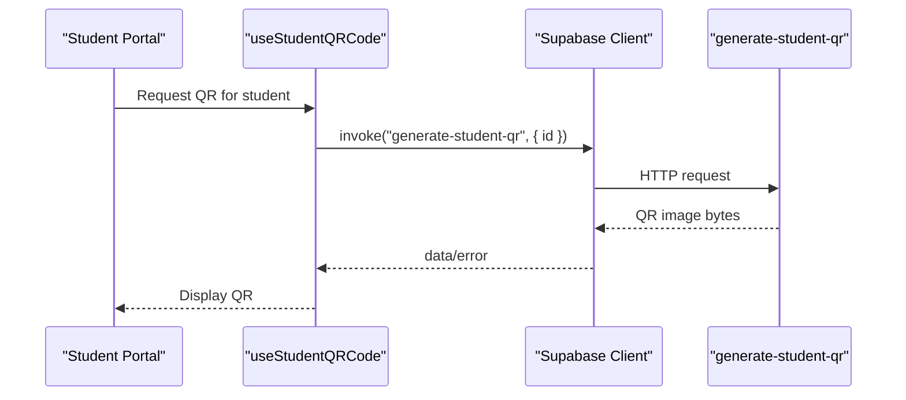
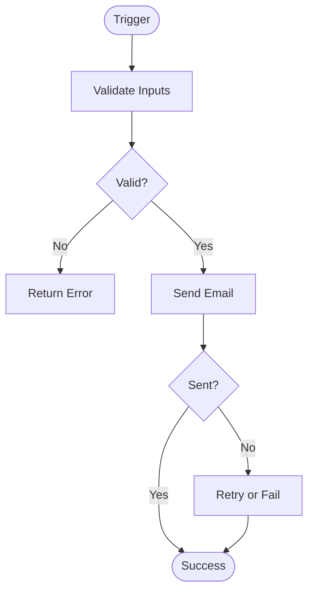
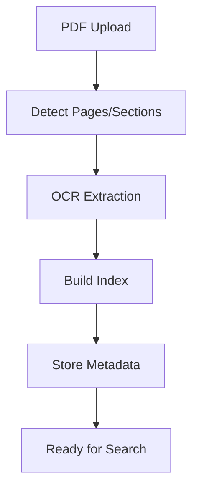
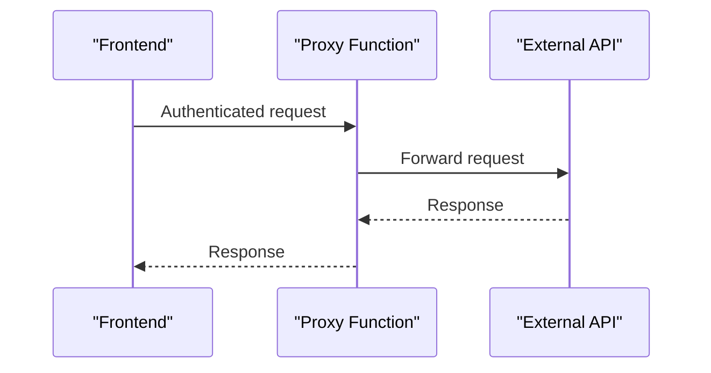
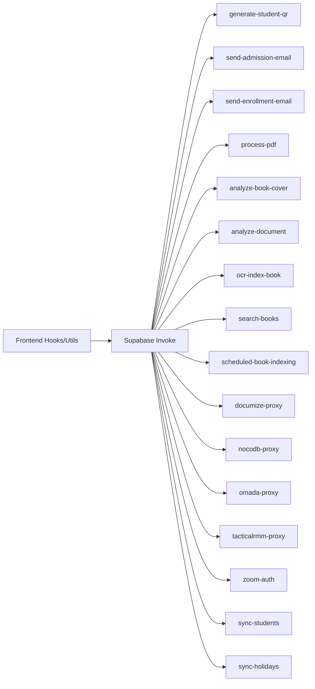

# Function Catalog & Implementation

<cite>
**Referenced Files in This Document**
- [README.md](file://README.md)
- [supabase/config.toml](file://supabase/config.toml)
- [supabase/functions/generate-student-qr/index.ts](file://supabase/functions/generate-student-qr/index.ts)
- [supabase/functions/send-admission-email/index.ts](file://supabase/functions/send-admission-email/index.ts)
- [supabase/functions/send-enrollment-email/index.ts](file://supabase/functions/send-enrollment-email/index.ts)
- [supabase/functions/process-pdf/index.ts](file://supabase/functions/process-pdf/index.ts)
- [supabase/functions/analyze-book-cover/index.ts](file://supabase/functions/analyze-book-cover/index.ts)
- [supabase/functions/analyze-document/index.ts](file://supabase/functions/analyze-document/index.ts)
- [supabase/functions/ocr-index-book/index.ts](file://supabase/functions/ocr-index-book/index.ts)
- [supabase/functions/search-books/index.ts](file://supabase/functions/search-books/index.ts)
- [supabase/functions/scheduled-book-indexing/index.ts](file://supabase/functions/scheduled-book-indexing/index.ts)
- [supabase/functions/documize-proxy/index.ts](file://supabase/functions/documize-proxy/index.ts)
- [supabase/functions/nocodb-proxy/index.ts](file://supabase/functions/nocodb-proxy/index.ts)
- [supabase/functions/omada-proxy/index.ts](file://supabase/functions/omada-proxy/index.ts)
- [supabase/functions/tacticalrmm-proxy/index.ts](file://supabase/functions/tacticalrmm-proxy/index.ts)
- [supabase/functions/zoom-auth/index.ts](file://supabase/functions/zoom-auth/index.ts)
- [supabase/functions/sync-students/index.ts](file://supabase/functions/sync-students/index.ts)
- [supabase/functions/sync-holidays/index.ts](file://supabase/functions/sync-holidays/index.ts)
- [src/hooks/useStudentQRCode.ts](file://src/hooks/useStudentQRCode.ts)
- [src/utils/qrBulkDownload.ts](file://src/utils/qrBulkDownload.ts)
</cite>

## Table of Contents
1. [Introduction](#introduction)
2. [Project Structure](#project-structure)
3. [Core Components](#core-components)
4. [Architecture Overview](#architecture-overview)
5. [Detailed Component Analysis](#detailed-component-analysis)
6. [Dependency Analysis](#dependency-analysis)
7. [Performance Considerations](#performance-considerations)
8. [Troubleshooting Guide](#troubleshooting-guide)
9. [Conclusion](#conclusion)

## Introduction
This document provides a comprehensive function catalog for the edge function layer of the project. It covers the purpose, implementation approach, integration patterns, parameters, return values, error handling, and performance characteristics for each function. Categories include QR code generation, email automation, document processing, image analysis, proxy services, and data synchronization. Guidance is included for deployment, testing, and monitoring strategies.

## Project Structure
The edge functions are located under the Supabase functions directory. Each function is a standalone module with its own entry point. The repository also includes frontend integration hooks and utilities that invoke these functions.

```mermaid
graph TB
subgraph "Supabase Functions"
F1["generate-student-qr/index.ts"]
F2["send-admission-email/index.ts"]
F3["send-enrollment-email/index.ts"]
F4["process-pdf/index.ts"]
F5["analyze-book-cover/index.ts"]
F6["analyze-document/index.ts"]
F7["ocr-index-book/index.ts"]
F8["search-books/index.ts"]
F9["scheduled-book-indexing/index.ts"]
F10["documize-proxy/index.ts"]
F11["nocodb-proxy/index.ts"]
F12["omada-proxy/index.ts"]
F13["tacticalrmm-proxy/index.ts"]
F14["zoom-auth/index.ts"]
F15["sync-students/index.ts"]
F16["sync-holidays/index.ts"]
end
subgraph "Frontend Integration"
H1["src/hooks/useStudentQRCode.ts"]
U1["src/utils/qrBulkDownload.ts"]
end
H1 --> F1
U1 --> F1
```

**Diagram sources**
- [supabase/functions/generate-student-qr/index.ts](file://supabase/functions/generate-student-qr/index.ts#L1-L200)
- [src/hooks/useStudentQRCode.ts](file://src/hooks/useStudentQRCode.ts#L1-L50)
- [src/utils/qrBulkDownload.ts](file://src/utils/qrBulkDownload.ts#L1-L120)

**Section sources**
- [README.md](file://README.md#L1-L76)
- [supabase/config.toml](file://supabase/config.toml#L1-L1)

## Core Components
- Edge functions: Self-contained modules deployed via Supabase Functions.
- Frontend integration: React hooks and utilities invoke functions using Supabase client.
- Shared configuration: Supabase project ID configured centrally.

Key integration points:
- Frontend invokes functions via Supabase client invoke API.
- Functions operate independently and return structured responses or errors.
- Logging and monitoring are handled by Supabase platform observability.

**Section sources**
- [src/hooks/useStudentQRCode.ts](file://src/hooks/useStudentQRCode.ts#L1-L50)
- [src/utils/qrBulkDownload.ts](file://src/utils/qrBulkDownload.ts#L1-L120)
- [supabase/config.toml](file://supabase/config.toml#L1-L1)

## Architecture Overview
The system follows a client-server pattern:
- Frontend triggers function invocations.
- Supabase executes functions on demand.
- Functions may integrate with external APIs or services as needed.

**Diagram sources**
- [src/hooks/useStudentQRCode.ts](file://src/hooks/useStudentQRCode.ts#L1-L50)
- [supabase/functions/generate-student-qr/index.ts](file://supabase/functions/generate-student-qr/index.ts#L1-L200)

## Detailed Component Analysis

### QR Code Generation
Purpose: Generate QR codes for student identifiers and batch download capabilities.

Implementation approach:
- Accepts student identifiers and returns QR image data.
- Supports single and bulk generation workflows.
- Integrates with frontend hooks and utilities.

Parameters:
- Single generation: student ID or identifier.
- Bulk generation: array of identifiers.

Return values:
- Binary image data or structured response with image metadata.

Error handling:
- Validates input identifiers.
- Handles missing or invalid identifiers gracefully.

Performance characteristics:
- Optimized for batch processing.
- Streaming or chunked responses recommended for large batches.

Integration patterns:
- Frontend hook invokes function and renders QR codes.
- Utility supports bulk downloads.

**Diagram sources**
- [src/hooks/useStudentQRCode.ts](file://src/hooks/useStudentQRCode.ts#L1-L50)
- [supabase/functions/generate-student-qr/index.ts](file://supabase/functions/generate-student-qr/index.ts#L1-L200)

**Section sources**
- [src/hooks/useStudentQRCode.ts](file://src/hooks/useStudentQRCode.ts#L1-L50)
- [src/utils/qrBulkDownload.ts](file://src/utils/qrBulkDownload.ts#L1-L120)
- [supabase/functions/generate-student-qr/index.ts](file://supabase/functions/generate-student-qr/index.ts#L1-L200)

### Email Automation
Functions:
- Admission email automation
- Enrollment email automation

Implementation approach:
- Accepts recipient details, templates, and dynamic content.
- Sends emails via configured provider.

Parameters:
- Recipient email address.
- Template placeholders and dynamic content.
- Optional attachments or links.

Return values:
- Success/failure status and optional message ID.

Error handling:
- Validates email addresses and content.
- Handles provider errors and retries.

Performance characteristics:
- Asynchronous processing recommended.
- Rate limiting and batching for bulk sends.

Integration patterns:
- Triggered from frontend forms or admin panels.
- Scheduled workflows for reminders.

**Diagram sources**
- [supabase/functions/send-admission-email/index.ts](file://supabase/functions/send-admission-email/index.ts#L1-L200)
- [supabase/functions/send-enrollment-email/index.ts](file://supabase/functions/send-enrollment-email/index.ts#L1-L200)

**Section sources**
- [supabase/functions/send-admission-email/index.ts](file://supabase/functions/send-admission-email/index.ts#L1-L200)
- [supabase/functions/send-enrollment-email/index.ts](file://supabase/functions/send-enrollment-email/index.ts#L1-L200)

### Document Processing
Functions:
- PDF processing pipeline
- OCR indexing for books
- Book search and indexing

Implementation approach:
- Processes PDFs, extracts text, and builds searchable indices.
- Uses OCR for scanned documents.

Parameters:
- File upload or URL.
- Optional processing options (OCR, indexing scope).

Return values:
- Processed content, metadata, and indexing status.

Error handling:
- Handles unsupported formats and corrupted files.
- Provides partial results when possible.

Performance characteristics:
- CPU-intensive operations; consider worker queues.
- Parallel processing for multiple documents.

Integration patterns:
- Admin uploads and batch indexing.
- Scheduled indexing jobs.

**Diagram sources**
- [supabase/functions/process-pdf/index.ts](file://supabase/functions/process-pdf/index.ts#L1-L200)
- [supabase/functions/ocr-index-book/index.ts](file://supabase/functions/ocr-index-book/index.ts#L1-L200)
- [supabase/functions/search-books/index.ts](file://supabase/functions/search-books/index.ts#L1-L200)
- [supabase/functions/scheduled-book-indexing/index.ts](file://supabase/functions/scheduled-book-indexing/index.ts#L1-L200)

**Section sources**
- [supabase/functions/process-pdf/index.ts](file://supabase/functions/process-pdf/index.ts#L1-L200)
- [supabase/functions/ocr-index-book/index.ts](file://supabase/functions/ocr-index-book/index.ts#L1-L200)
- [supabase/functions/search-books/index.ts](file://supabase/functions/search-books/index.ts#L1-L200)
- [supabase/functions/scheduled-book-indexing/index.ts](file://supabase/functions/scheduled-book-indexing/index.ts#L1-L200)

### Image Analysis
Functions:
- Book cover analysis
- Document analysis

Implementation approach:
- Analyzes images for metadata, quality, and categorization.
- Integrates with external AI/ML services.

Parameters:
- Image bytes or URL.
- Analysis mode (cover, document, etc.).

Return values:
- Analysis results and confidence scores.

Error handling:
- Handles unsupported formats and low-quality images.
- Graceful fallbacks for partial analysis.

Performance characteristics:
- GPU/CPU intensive; consider async processing.
- Caching of results for repeated queries.

Integration patterns:
- Admin review and approval workflows.
- Automated ingestion pipelines.

**Section sources**
- [supabase/functions/analyze-book-cover/index.ts](file://supabase/functions/analyze-book-cover/index.ts#L1-L200)
- [supabase/functions/analyze-document/index.ts](file://supabase/functions/analyze-document/index.ts#L1-L200)

### Proxy Services
Functions:
- Documize proxy
- NocoDB proxy
- Omada proxy
- TacticalRMM proxy
- Zoom auth

Implementation approach:
- Act as intermediaries to external systems.
- Handles authentication, request routing, and response shaping.

Parameters:
- Target endpoint and query parameters.
- Authentication tokens or headers.

Return values:
- Delegated responses from external systems.

Error handling:
- Propagates upstream errors with context.
- Handles rate limits and timeouts.

Performance characteristics:
- Network-bound; optimize connection pooling.
- Caching of non-sensitive responses.

Integration patterns:
- Centralized proxy layer for external integrations.
- Secure token management and rotation.

**Diagram sources**
- [supabase/functions/documize-proxy/index.ts](file://supabase/functions/documize-proxy/index.ts#L1-L200)
- [supabase/functions/nocodb-proxy/index.ts](file://supabase/functions/nocodb-proxy/index.ts#L1-L200)
- [supabase/functions/omada-proxy/index.ts](file://supabase/functions/omada-proxy/index.ts#L1-L200)
- [supabase/functions/tacticalrmm-proxy/index.ts](file://supabase/functions/tacticalrmm-proxy/index.ts#L1-L200)
- [supabase/functions/zoom-auth/index.ts](file://supabase/functions/zoom-auth/index.ts#L1-L200)

**Section sources**
- [supabase/functions/documize-proxy/index.ts](file://supabase/functions/documize-proxy/index.ts#L1-L200)
- [supabase/functions/nocodb-proxy/index.ts](file://supabase/functions/nocodb-proxy/index.ts#L1-L200)
- [supabase/functions/omada-proxy/index.ts](file://supabase/functions/omada-proxy/index.ts#L1-L200)
- [supabase/functions/tacticalrmm-proxy/index.ts](file://supabase/functions/tacticalrmm-proxy/index.ts#L1-L200)
- [supabase/functions/zoom-auth/index.ts](file://supabase/functions/zoom-auth/index.ts#L1-L200)

### Data Synchronization
Functions:
- Students synchronization
- Holidays synchronization

Implementation approach:
- Syncs data from external systems to local database.
- Handles incremental updates and conflict resolution.

Parameters:
- Sync window or delta.
- Target entities (students, holidays).

Return values:
- Count of processed records and status.

Error handling:
- Idempotent operations and deduplication.
- Rollback on partial failures.

Performance characteristics:
- Batch processing with pagination.
- Conflict detection and resolution strategies.

Integration patterns:
- Scheduled sync jobs.
- Manual triggers for on-demand refresh.

**Section sources**
- [supabase/functions/sync-students/index.ts](file://supabase/functions/sync-students/index.ts#L1-L200)
- [supabase/functions/sync-holidays/index.ts](file://supabase/functions/sync-holidays/index.ts#L1-L200)

## Dependency Analysis
- Frontend depends on Supabase client for function invocation.
- Functions depend on external services for specific tasks (email providers, OCR, AI services).
- Shared configuration (project ID) centralizes environment settings.

**Diagram sources**
- [src/hooks/useStudentQRCode.ts](file://src/hooks/useStudentQRCode.ts#L1-L50)
- [src/utils/qrBulkDownload.ts](file://src/utils/qrBulkDownload.ts#L1-L120)
- [supabase/functions/generate-student-qr/index.ts](file://supabase/functions/generate-student-qr/index.ts#L1-L200)
- [supabase/functions/send-admission-email/index.ts](file://supabase/functions/send-admission-email/index.ts#L1-L200)
- [supabase/functions/send-enrollment-email/index.ts](file://supabase/functions/send-enrollment-email/index.ts#L1-L200)
- [supabase/functions/process-pdf/index.ts](file://supabase/functions/process-pdf/index.ts#L1-L200)
- [supabase/functions/analyze-book-cover/index.ts](file://supabase/functions/analyze-book-cover/index.ts#L1-L200)
- [supabase/functions/analyze-document/index.ts](file://supabase/functions/analyze-document/index.ts#L1-L200)
- [supabase/functions/ocr-index-book/index.ts](file://supabase/functions/ocr-index-book/index.ts#L1-L200)
- [supabase/functions/search-books/index.ts](file://supabase/functions/search-books/index.ts#L1-L200)
- [supabase/functions/scheduled-book-indexing/index.ts](file://supabase/functions/scheduled-book-indexing/index.ts#L1-L200)
- [supabase/functions/documize-proxy/index.ts](file://supabase/functions/documize-proxy/index.ts#L1-L200)
- [supabase/functions/nocodb-proxy/index.ts](file://supabase/functions/nocodb-proxy/index.ts#L1-L200)
- [supabase/functions/omada-proxy/index.ts](file://supabase/functions/omada-proxy/index.ts#L1-L200)
- [supabase/functions/tacticalrmm-proxy/index.ts](file://supabase/functions/tacticalrmm-proxy/index.ts#L1-L200)
- [supabase/functions/zoom-auth/index.ts](file://supabase/functions/zoom-auth/index.ts#L1-L200)
- [supabase/functions/sync-students/index.ts](file://supabase/functions/sync-students/index.ts#L1-L200)
- [supabase/functions/sync-holidays/index.ts](file://supabase/functions/sync-holidays/index.ts#L1-L200)

**Section sources**
- [src/hooks/useStudentQRCode.ts](file://src/hooks/useStudentQRCode.ts#L1-L50)
- [src/utils/qrBulkDownload.ts](file://src/utils/qrBulkDownload.ts#L1-L120)
- [supabase/config.toml](file://supabase/config.toml#L1-L1)

## Performance Considerations
- Batch operations: Prefer batch processing for large datasets to reduce overhead.
- Async execution: Offload long-running tasks to background processing.
- Caching: Cache results for repeated queries where safe.
- Rate limiting: Respect external service limits; implement backoff strategies.
- Monitoring: Track execution time, error rates, and resource usage.

## Troubleshooting Guide
Common issues and resolutions:
- Function invocation errors: Verify function names and payload structure.
- Authentication failures: Check external service credentials and tokens.
- Timeout errors: Optimize heavy operations or split into chunks.
- CORS/proxy issues: Ensure proper headers and allowed origins.

Monitoring tips:
- Use Supabase logs and metrics dashboards.
- Implement structured logging within functions.
- Set up alerts for high error rates or latency spikes.

**Section sources**
- [src/hooks/useStudentQRCode.ts](file://src/hooks/useStudentQRCode.ts#L1-L50)
- [src/utils/qrBulkDownload.ts](file://src/utils/qrBulkDownload.ts#L1-L120)

## Conclusion
The edge function catalog provides a robust foundation for automating workflows, integrating with external services, and synchronizing data. By following the implementation patterns, performance guidelines, and monitoring strategies outlined above, teams can maintain reliable and scalable function-driven features across the application.