# Integration Patterns & Best Practices

<cite>
**Referenced Files in This Document**
- [README.md](file://README.md)
- [supabase/functions/documize-proxy/index.ts](file://supabase/functions/documize-proxy/index.ts)
- [supabase/functions/tacticalrmm-proxy/index.ts](file://supabase/functions/tacticalrmm-proxy/index.ts)
- [supabase/functions/omada-proxy/index.ts](file://supabase/functions/omada-proxy/index.ts)
- [supabase/functions/canva-api/index.ts](file://supabase/functions/canva-api/index.ts)
- [supabase/functions/canva-auth/index.ts](file://supabase/functions/canva-auth/index.ts)
- [supabase/functions/nocodb-proxy/index.ts](file://supabase/functions/nocodb-proxy/index.ts)
- [supabase/functions/zoom-auth/index.ts](file://supabase/functions/zoom-auth/index.ts)
- [supabase/functions/sync-students/index.ts](file://supabase/functions/sync-students/index.ts)
- [supabase/functions/create-users/index.ts](file://supabase/functions/create-users/index.ts)
- [supabase/functions/generate-student-qr/index.ts](file://supabase/functions/generate-student-qr/index.ts)
- [supabase/functions/notebook-chat/index.ts](file://supabase/functions/notebook-chat/index.ts)
- [src/components/ErrorBoundary.tsx](file://src/components/ErrorBoundary.tsx)
</cite>

## Table of Contents
1. [Introduction](#introduction)
2. [Project Structure](#project-structure)
3. [Core Components](#core-components)
4. [Architecture Overview](#architecture-overview)
5. [Detailed Component Analysis](#detailed-component-analysis)
6. [Dependency Analysis](#dependency-analysis)
7. [Performance Considerations](#performance-considerations)
8. [Troubleshooting Guide](#troubleshooting-guide)
9. [Conclusion](#conclusion)
10. [Appendices](#appendices)

## Introduction
This document consolidates integration patterns and best practices for edge functions that proxy external APIs, manage authentication flows, and handle webhooks. It focuses on:
- Proxy function implementation for external API integration
- Authentication flow patterns (including OAuth with PKCE and JWT signatures)
- Webhook handling and status checks
- Error handling, retries, and fallback procedures
- Security considerations for external integrations, rate limiting, and data validation
- Monitoring, logging, and debugging approaches

The patterns documented here are derived from the edge functions under the Supabase functions directory and the frontend error boundary utilities.

**Section sources**
- [README.md](file://README.md#L1-L76)

## Project Structure
The integration surface is primarily implemented in edge functions located under the Supabase functions directory. These functions:
- Enforce CORS and validate authentication
- Forward requests to external APIs
- Manage tokens and secrets via environment variables
- Implement health/status endpoints and robust error handling

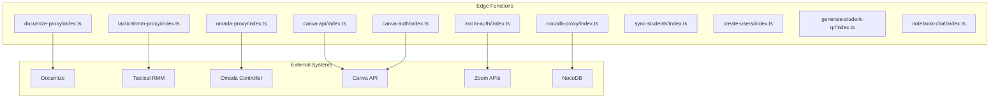

**Diagram sources**
- [supabase/functions/documize-proxy/index.ts](file://supabase/functions/documize-proxy/index.ts#L32-L84)
- [supabase/functions/tacticalrmm-proxy/index.ts](file://supabase/functions/tacticalrmm-proxy/index.ts#L9-L115)
- [supabase/functions/omada-proxy/index.ts](file://supabase/functions/omada-proxy/index.ts#L87-L144)
- [supabase/functions/canva-api/index.ts](file://supabase/functions/canva-api/index.ts#L73-L160)
- [supabase/functions/canva-auth/index.ts](file://supabase/functions/canva-auth/index.ts#L44-L335)
- [supabase/functions/nocodb-proxy/index.ts](file://supabase/functions/nocodb-proxy/index.ts#L9-L71)
- [supabase/functions/zoom-auth/index.ts](file://supabase/functions/zoom-auth/index.ts#L81-L119)

**Section sources**
- [supabase/functions/documize-proxy/index.ts](file://supabase/functions/documize-proxy/index.ts#L1-L85)
- [supabase/functions/tacticalrmm-proxy/index.ts](file://supabase/functions/tacticalrmm-proxy/index.ts#L1-L116)
- [supabase/functions/omada-proxy/index.ts](file://supabase/functions/omada-proxy/index.ts#L1-L145)
- [supabase/functions/canva-api/index.ts](file://supabase/functions/canva-api/index.ts#L1-L161)
- [supabase/functions/canva-auth/index.ts](file://supabase/functions/canva-auth/index.ts#L1-L336)
- [supabase/functions/nocodb-proxy/index.ts](file://supabase/functions/nocodb-proxy/index.ts#L1-L72)
- [supabase/functions/zoom-auth/index.ts](file://supabase/functions/zoom-auth/index.ts#L1-L120)

## Core Components
- Proxy functions with authentication checks and CORS support
- OAuth with PKCE for third-party integrations
- Token management and refresh flows
- Health/status endpoints for external systems
- Rate limiting and API key validation
- Error handling and structured responses

Key implementation patterns:
- Authentication verification via Supabase client
- Environment-driven configuration for external endpoints and secrets
- Robust response validation and non-JSON detection
- TLS fallback for external endpoints when appropriate
- Streaming responses for AI gateway integrations

**Section sources**
- [supabase/functions/documize-proxy/index.ts](file://supabase/functions/documize-proxy/index.ts#L32-L84)
- [supabase/functions/tacticalrmm-proxy/index.ts](file://supabase/functions/tacticalrmm-proxy/index.ts#L9-L115)
- [supabase/functions/omada-proxy/index.ts](file://supabase/functions/omada-proxy/index.ts#L87-L144)
- [supabase/functions/canva-api/index.ts](file://supabase/functions/canva-api/index.ts#L73-L160)
- [supabase/functions/canva-auth/index.ts](file://supabase/functions/canva-auth/index.ts#L44-L335)
- [supabase/functions/nocodb-proxy/index.ts](file://supabase/functions/nocodb-proxy/index.ts#L9-L71)
- [supabase/functions/zoom-auth/index.ts](file://supabase/functions/zoom-auth/index.ts#L81-L119)
- [supabase/functions/sync-students/index.ts](file://supabase/functions/sync-students/index.ts#L49-L86)
- [supabase/functions/notebook-chat/index.ts](file://supabase/functions/notebook-chat/index.ts#L136-L179)

## Architecture Overview
The edge functions act as controlled proxies and orchestrators:
- Validate caller identity and permissions
- Resolve environment-specific configuration
- Forward requests to external systems
- Normalize responses and propagate errors
- Provide health/status endpoints for monitoring

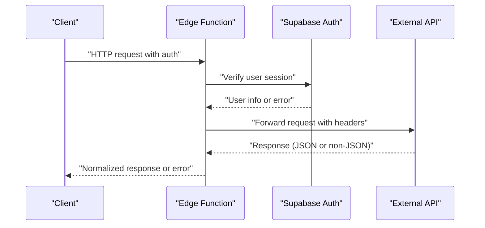

**Diagram sources**
- [supabase/functions/documize-proxy/index.ts](file://supabase/functions/documize-proxy/index.ts#L32-L84)
- [supabase/functions/tacticalrmm-proxy/index.ts](file://supabase/functions/tacticalrmm-proxy/index.ts#L14-L115)
- [supabase/functions/omada-proxy/index.ts](file://supabase/functions/omada-proxy/index.ts#L92-L144)
- [supabase/functions/canva-api/index.ts](file://supabase/functions/canva-api/index.ts#L78-L160)
- [supabase/functions/nocodb-proxy/index.ts](file://supabase/functions/nocodb-proxy/index.ts#L14-L71)

## Detailed Component Analysis

### Proxy Function Pattern (Documize)
- Authentication: Uses Supabase client to verify the incoming Authorization header.
- Configuration: Reads Documize base URL and credentials from environment variables.
- Actions: Supports status checks and proxying arbitrary endpoints with optional query parameters.
- Response handling: Validates JSON and returns structured errors.

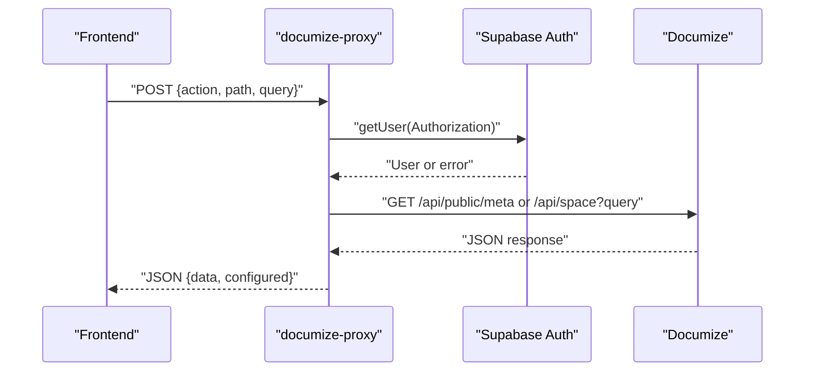

**Diagram sources**
- [supabase/functions/documize-proxy/index.ts](file://supabase/functions/documize-proxy/index.ts#L32-L84)

**Section sources**
- [supabase/functions/documize-proxy/index.ts](file://supabase/functions/documize-proxy/index.ts#L32-L84)

### Proxy Function Pattern (Tactical RMM)
- Authentication: Verifies user via Supabase and enforces API key for Tactical RMM.
- Actions: status, takecontrol, and generic proxy with configurable HTTP method and body.
- Response validation: Ensures JSON responses and handles non-JSON gracefully.
- Additional metadata: Returns URLs for mesh and web interfaces when available.

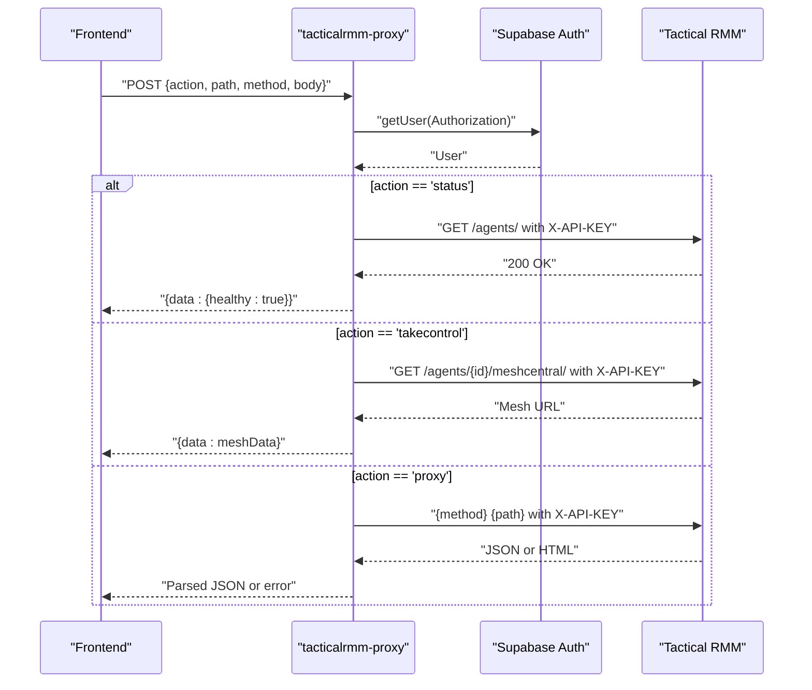

**Diagram sources**
- [supabase/functions/tacticalrmm-proxy/index.ts](file://supabase/functions/tacticalrmm-proxy/index.ts#L34-L115)

**Section sources**
- [supabase/functions/tacticalrmm-proxy/index.ts](file://supabase/functions/tacticalrmm-proxy/index.ts#L9-L115)

### Proxy Function Pattern (NocoDB)
- Authentication: Validates user via Supabase and reads API token from environment.
- Actions: Accepts action/method and path; forwards request with xc-token header.
- Response validation: Detects non-JSON responses and returns structured errors.

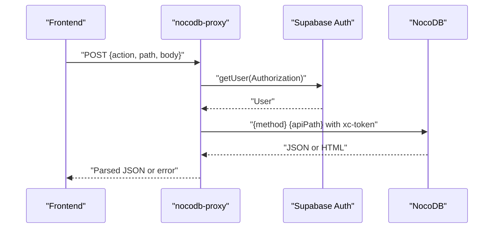

**Diagram sources**
- [supabase/functions/nocodb-proxy/index.ts](file://supabase/functions/nocodb-proxy/index.ts#L33-L71)

**Section sources**
- [supabase/functions/nocodb-proxy/index.ts](file://supabase/functions/nocodb-proxy/index.ts#L9-L72)

### Proxy Function Pattern (Omada)
- Authentication: Verifies user via Supabase and reads client credentials from environment.
- Token caching: Stores access token with expiry and caches omadacId.
- TLS fallback: Attempts HTTPS; falls back to HTTP when TLS-related errors occur.
- Actions: status and proxy with automatic token acquisition.

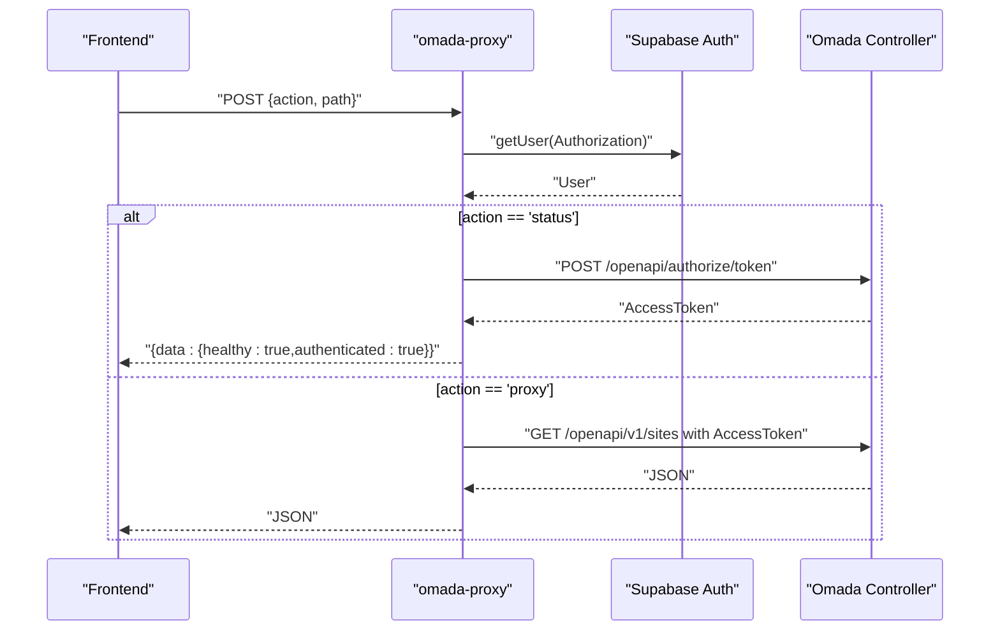

**Diagram sources**
- [supabase/functions/omada-proxy/index.ts](file://supabase/functions/omada-proxy/index.ts#L87-L144)

**Section sources**
- [supabase/functions/omada-proxy/index.ts](file://supabase/functions/omada-proxy/index.ts#L1-L145)

### Authentication Flow Pattern (Canva OAuth with PKCE)
- Initialization: Generates PKCE code_verifier and code_challenge; stores code_verifier securely in database with state key.
- Authorization: Builds authorization URL with state and code_challenge.
- Callback: Exchanges code for tokens using code_verifier; stores tokens and updates user profile.
- Refresh: Refreshes access tokens using refresh_token and updates records.
- Status: Checks connection status and expiration.

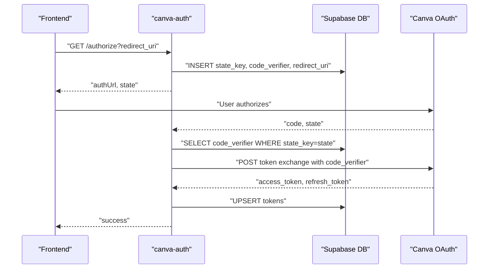

**Diagram sources**
- [supabase/functions/canva-auth/index.ts](file://supabase/functions/canva-auth/index.ts#L72-L225)

**Section sources**
- [supabase/functions/canva-auth/index.ts](file://supabase/functions/canva-auth/index.ts#L44-L335)

### API Proxy Pattern (Canva API)
- Authentication: Validates Bearer token and retrieves user from Supabase.
- Token management: Retrieves and refreshes Canva access tokens with 5-minute buffer.
- Proxying: Forwards requests to Canva API with proper headers and query parameters.

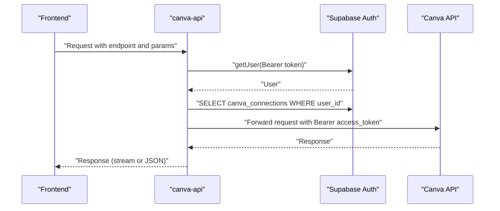

**Diagram sources**
- [supabase/functions/canva-api/index.ts](file://supabase/functions/canva-api/index.ts#L78-L160)

**Section sources**
- [supabase/functions/canva-api/index.ts](file://supabase/functions/canva-api/index.ts#L1-L161)

### Authentication Flow Pattern (Zoom)
- Access token retrieval: Uses Basic auth with account credentials grant.
- ZAK token: Optional ZAK token for host role meetings.
- Signature generation: Generates Meeting SDK JWT signature with HMAC SHA-256.

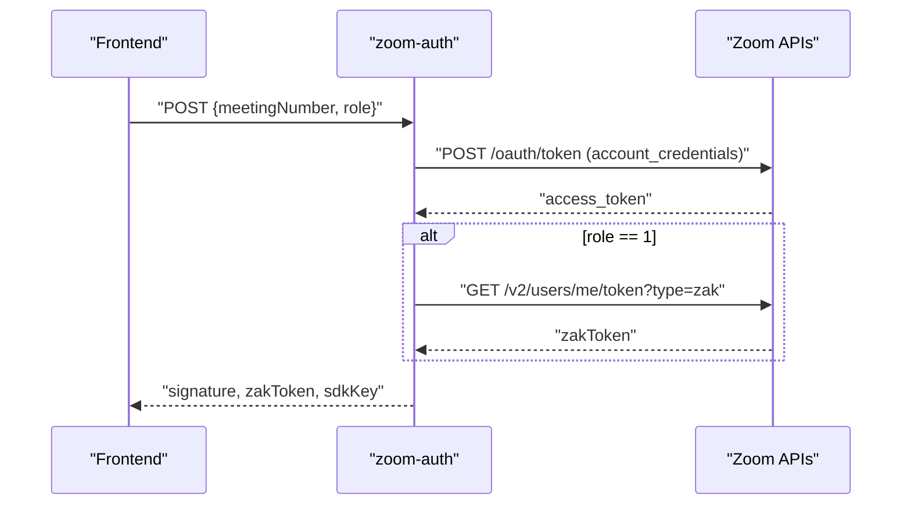

**Diagram sources**
- [supabase/functions/zoom-auth/index.ts](file://supabase/functions/zoom-auth/index.ts#L81-L119)

**Section sources**
- [supabase/functions/zoom-auth/index.ts](file://supabase/functions/zoom-auth/index.ts#L1-L120)

### Webhook Handling and Status Checks
- Status endpoints: Many proxies expose a status action to probe external system health.
- Non-JSON detection: Proxies validate content-type and reject non-JSON responses.
- Structured errors: Responses include configured flags and actionable messages.

Examples:
- Documize status: Calls public meta endpoint and returns health status.
- Tactical RMM status: Calls agents endpoint with API key and returns health and URLs.
- Omada status: Acquires token and validates controller info.

**Section sources**
- [supabase/functions/documize-proxy/index.ts](file://supabase/functions/documize-proxy/index.ts#L55-L66)
- [supabase/functions/tacticalrmm-proxy/index.ts](file://supabase/functions/tacticalrmm-proxy/index.ts#L41-L54)
- [supabase/functions/omada-proxy/index.ts](file://supabase/functions/omada-proxy/index.ts#L113-L125)

### Error Handling Strategies
- Centralized error logging: Functions log detailed errors for diagnostics.
- Structured responses: Errors include error messages and configured flags.
- Non-JSON handling: Proxies detect non-JSON responses and return 502 with guidance.
- Frontend error boundaries: React components wrap rendering to present user-friendly error UI and retry actions.

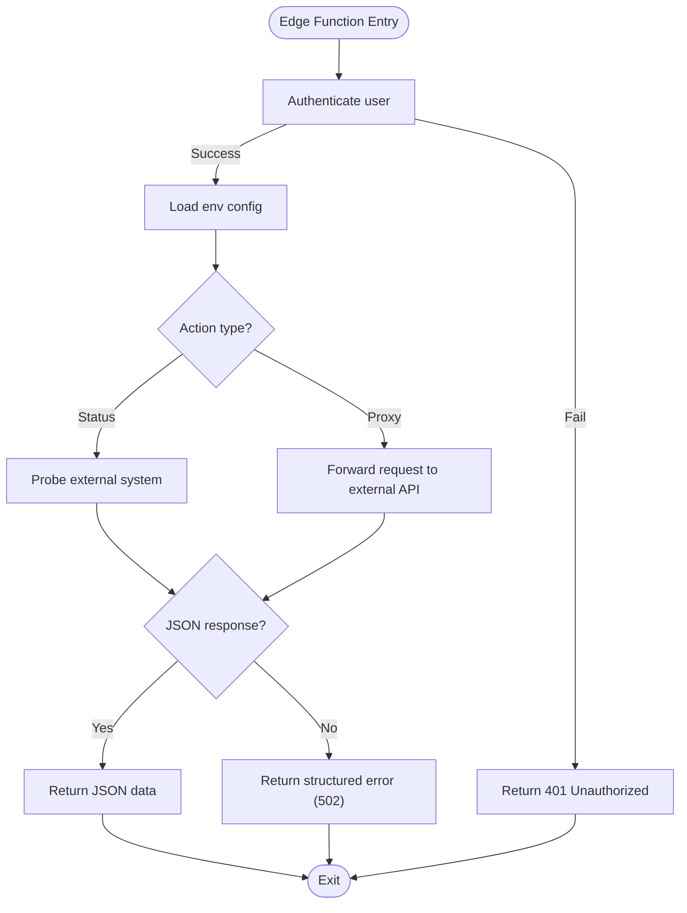

**Diagram sources**
- [supabase/functions/tacticalrmm-proxy/index.ts](file://supabase/functions/tacticalrmm-proxy/index.ts#L96-L110)
- [supabase/functions/nocodb-proxy/index.ts](file://supabase/functions/nocodb-proxy/index.ts#L48-L66)

**Section sources**
- [supabase/functions/tacticalrmm-proxy/index.ts](file://supabase/functions/tacticalrmm-proxy/index.ts#L96-L110)
- [supabase/functions/nocodb-proxy/index.ts](file://supabase/functions/nocodb-proxy/index.ts#L48-L66)
- [src/components/ErrorBoundary.tsx](file://src/components/ErrorBoundary.tsx#L44-L205)

### Retry Mechanisms and Fallback Procedures
- TLS fallback: Omada proxy attempts HTTP fallback when TLS certificate errors are detected.
- Token caching and refresh: Canva API and Omada proxies cache tokens with expiry and refresh as needed.
- Graceful degradation: Status endpoints provide health signals even when external systems are down.

**Section sources**
- [supabase/functions/omada-proxy/index.ts](file://supabase/functions/omada-proxy/index.ts#L23-L37)
- [supabase/functions/omada-proxy/index.ts](file://supabase/functions/omada-proxy/index.ts#L58-L85)
- [supabase/functions/canva-api/index.ts](file://supabase/functions/canva-api/index.ts#L16-L71)

### Security Considerations
- Secrets management: Credentials and tokens are loaded from environment variables.
- CORS enforcement: All functions set Access-Control-Allow-Origin and required headers.
- Token storage: OAuth state and tokens are stored in Supabase tables with appropriate constraints.
- API key validation: Sync-students function validates API keys for webhook-like endpoints.
- JWT signature generation: Zoom function generates signed JWTs for Meeting SDK.

**Section sources**
- [supabase/functions/documize-proxy/index.ts](file://supabase/functions/documize-proxy/index.ts#L4-L7)
- [supabase/functions/canva-auth/index.ts](file://supabase/functions/canva-auth/index.ts#L89-L102)
- [supabase/functions/sync-students/index.ts](file://supabase/functions/sync-students/index.ts#L75-L86)
- [supabase/functions/zoom-auth/index.ts](file://supabase/functions/zoom-auth/index.ts#L46-L79)

### Rate Limiting and Data Validation
- In-memory rate limiter: Sync-students implements a simple sliding-window rate limiter keyed by client IP.
- API key validation: Validates x-api-key header for protected endpoints.
- Input validation: Proxy functions validate presence of required parameters and enforce method/path safety.

**Section sources**
- [supabase/functions/sync-students/index.ts](file://supabase/functions/sync-students/index.ts#L15-L47)
- [supabase/functions/sync-students/index.ts](file://supabase/functions/sync-students/index.ts#L75-L86)
- [supabase/functions/tacticalrmm-proxy/index.ts](file://supabase/functions/tacticalrmm-proxy/index.ts#L34-L36)

### Examples of Successful Integration Patterns
- Documize: Status check and space listing via proxy.
- Tactical RMM: Agents listing, take control URL retrieval, and generic proxy.
- NocoDB: Base metadata and CRUD-like actions via method/action routing.
- Omada: Token acquisition with TLS fallback and site listing.
- Canva: OAuth with PKCE, token refresh, and API proxying.
- Zoom: Access token, ZAK token, and JWT signature generation.

**Section sources**
- [supabase/functions/documize-proxy/index.ts](file://supabase/functions/documize-proxy/index.ts#L55-L79)
- [supabase/functions/tacticalrmm-proxy/index.ts](file://supabase/functions/tacticalrmm-proxy/index.ts#L41-L110)
- [supabase/functions/nocodb-proxy/index.ts](file://supabase/functions/nocodb-proxy/index.ts#L33-L66)
- [supabase/functions/omada-proxy/index.ts](file://supabase/functions/omada-proxy/index.ts#L113-L137)
- [supabase/functions/canva-auth/index.ts](file://supabase/functions/canva-auth/index.ts#L72-L225)
- [supabase/functions/zoom-auth/index.ts](file://supabase/functions/zoom-auth/index.ts#L97-L110)

### Common Pitfalls
- Missing environment variables: Functions return configured=false and error messages when required variables are missing.
- Non-JSON responses: Proxies detect HTML or non-JSON responses and return structured errors.
- Expired or invalid tokens: OAuth flows handle token refresh or deletion and prompt reconnection.
- Unauthenticated requests: Functions return 401 Unauthorized when Supabase auth fails.

**Section sources**
- [supabase/functions/documize-proxy/index.ts](file://supabase/functions/documize-proxy/index.ts#L48-L51)
- [supabase/functions/tacticalrmm-proxy/index.ts](file://supabase/functions/tacticalrmm-proxy/index.ts#L99-L104)
- [supabase/functions/canva-auth/index.ts](file://supabase/functions/canva-auth/index.ts#L244-L261)

### Performance Optimization Techniques
- Token caching: Reduce repeated token exchanges by caching with expiry.
- Minimal parsing: Use streaming for large responses (e.g., AI gateway).
- Response normalization: Validate content-type early to avoid unnecessary processing.
- Rate limiting: Protect downstream systems and control resource usage.

**Section sources**
- [supabase/functions/omada-proxy/index.ts](file://supabase/functions/omada-proxy/index.ts#L9-L10)
- [supabase/functions/notebook-chat/index.ts](file://supabase/functions/notebook-chat/index.ts#L136-L179)

## Dependency Analysis
The edge functions depend on:
- Supabase client for authentication and database operations
- External APIs for business logic
- Environment variables for configuration
- Standard libraries for crypto, encoding, and HTTP

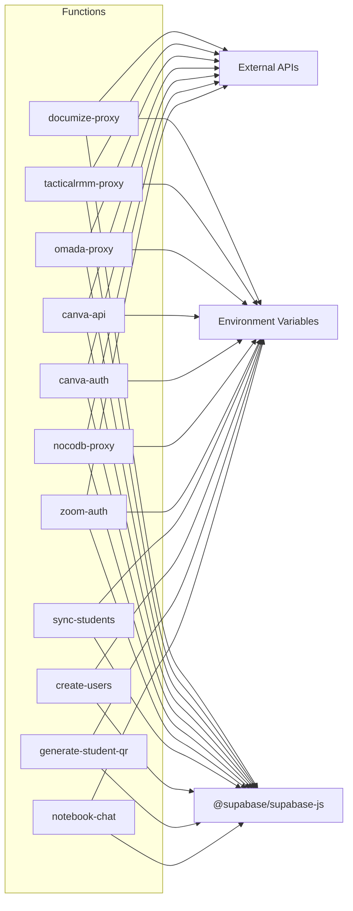

**Diagram sources**
- [supabase/functions/documize-proxy/index.ts](file://supabase/functions/documize-proxy/index.ts#L1-L2)
- [supabase/functions/tacticalrmm-proxy/index.ts](file://supabase/functions/tacticalrmm-proxy/index.ts#L1-L2)
- [supabase/functions/omada-proxy/index.ts](file://supabase/functions/omada-proxy/index.ts#L1-L2)
- [supabase/functions/canva-api/index.ts](file://supabase/functions/canva-api/index.ts#L1-L2)
- [supabase/functions/canva-auth/index.ts](file://supabase/functions/canva-auth/index.ts#L1-L2)
- [supabase/functions/nocodb-proxy/index.ts](file://supabase/functions/nocodb-proxy/index.ts#L1-L2)
- [supabase/functions/zoom-auth/index.ts](file://supabase/functions/zoom-auth/index.ts#L1-L3)
- [supabase/functions/sync-students/index.ts](file://supabase/functions/sync-students/index.ts#L1-L2)
- [supabase/functions/create-users/index.ts](file://supabase/functions/create-users/index.ts#L1-L2)
- [supabase/functions/generate-student-qr/index.ts](file://supabase/functions/generate-student-qr/index.ts#L1-L2)
- [supabase/functions/notebook-chat/index.ts](file://supabase/functions/notebook-chat/index.ts#L1-L2)

**Section sources**
- [supabase/functions/documize-proxy/index.ts](file://supabase/functions/documize-proxy/index.ts#L1-L2)
- [supabase/functions/tacticalrmm-proxy/index.ts](file://supabase/functions/tacticalrmm-proxy/index.ts#L1-L2)
- [supabase/functions/omada-proxy/index.ts](file://supabase/functions/omada-proxy/index.ts#L1-L2)
- [supabase/functions/canva-api/index.ts](file://supabase/functions/canva-api/index.ts#L1-L2)
- [supabase/functions/canva-auth/index.ts](file://supabase/functions/canva-auth/index.ts#L1-L2)
- [supabase/functions/nocodb-proxy/index.ts](file://supabase/functions/nocodb-proxy/index.ts#L1-L2)
- [supabase/functions/zoom-auth/index.ts](file://supabase/functions/zoom-auth/index.ts#L1-L3)
- [supabase/functions/sync-students/index.ts](file://supabase/functions/sync-students/index.ts#L1-L2)
- [supabase/functions/create-users/index.ts](file://supabase/functions/create-users/index.ts#L1-L2)
- [supabase/functions/generate-student-qr/index.ts](file://supabase/functions/generate-student-qr/index.ts#L1-L2)
- [supabase/functions/notebook-chat/index.ts](file://supabase/functions/notebook-chat/index.ts#L1-L2)

## Performance Considerations
- Minimize round trips: Cache tokens and metadata where feasible.
- Validate early: Check content-type and required parameters before heavy processing.
- Stream responses: For AI or large payloads, stream responses to reduce latency.
- Respect rate limits: Implement client-side throttling and backoff strategies.

[No sources needed since this section provides general guidance]

## Troubleshooting Guide
- Verify environment variables: Ensure all required variables are set for the target integration.
- Check status endpoints: Use the status action to confirm connectivity and authentication.
- Inspect logs: Functions log detailed errors; use them to diagnose failures.
- Handle non-JSON responses: When external systems return HTML or non-JSON, adjust configuration or credentials.
- Frontend error boundaries: Use the provided error boundary components to present user-friendly error UI and retry actions.

**Section sources**
- [supabase/functions/documize-proxy/index.ts](file://supabase/functions/documize-proxy/index.ts#L48-L51)
- [supabase/functions/tacticalrmm-proxy/index.ts](file://supabase/functions/tacticalrmm-proxy/index.ts#L99-L104)
- [src/components/ErrorBoundary.tsx](file://src/components/ErrorBoundary.tsx#L44-L205)

## Conclusion
The edge functions demonstrate robust patterns for integrating with external systems:
- Secure authentication and authorization
- Reliable proxying with validation and fallbacks
- Comprehensive error handling and monitoring
- Practical rate limiting and data validation
These patterns provide a strong foundation for building scalable, maintainable integrations.

[No sources needed since this section summarizes without analyzing specific files]

## Appendices
- Monitoring and logging: Functions log to stdout; integrate with your platform’s logging stack.
- Debugging: Use structured error responses and status endpoints to isolate issues.
- Testing: Validate environment configuration, token flows, and response handling before deployment.

[No sources needed since this section provides general guidance]