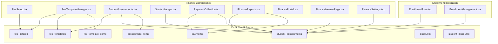
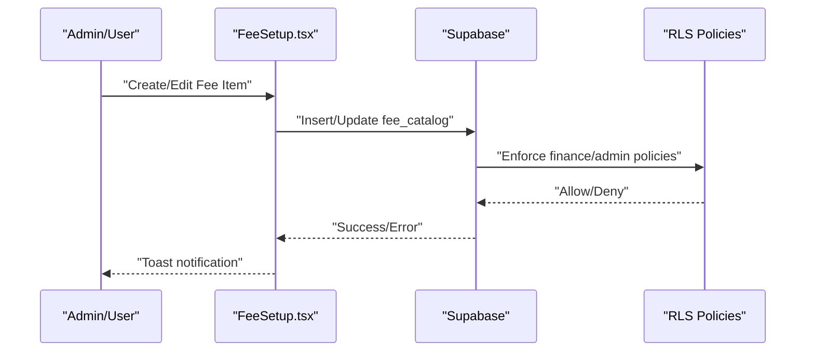
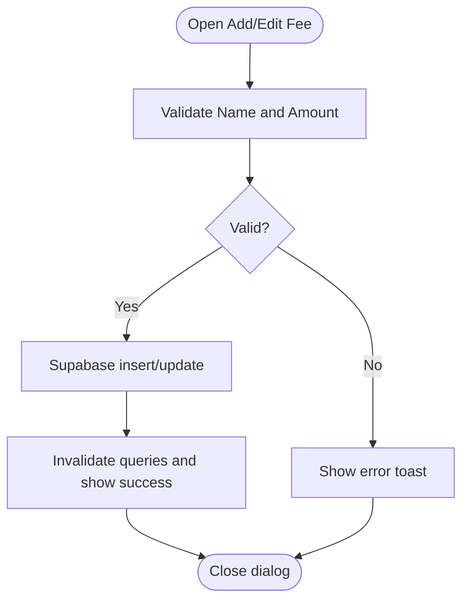
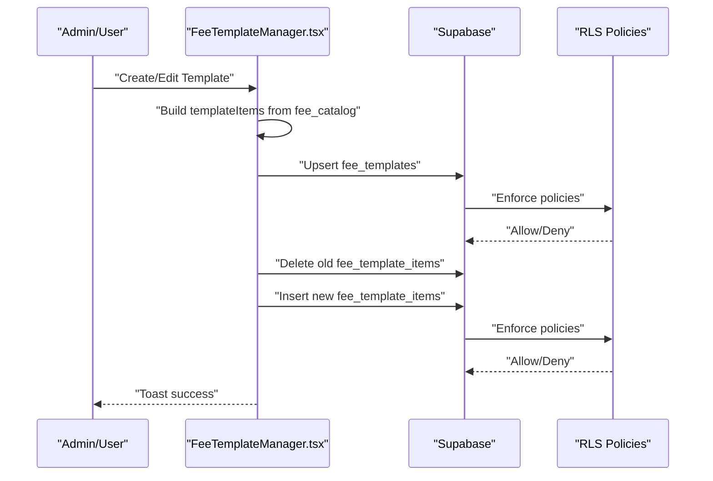
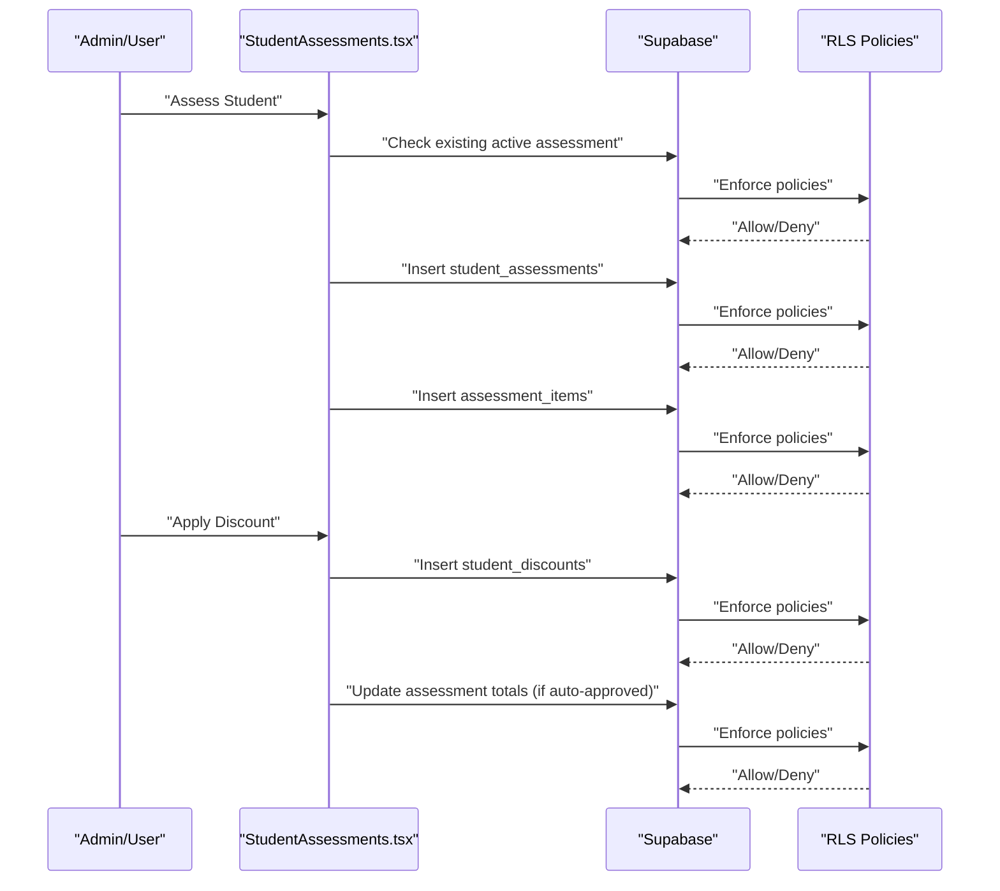
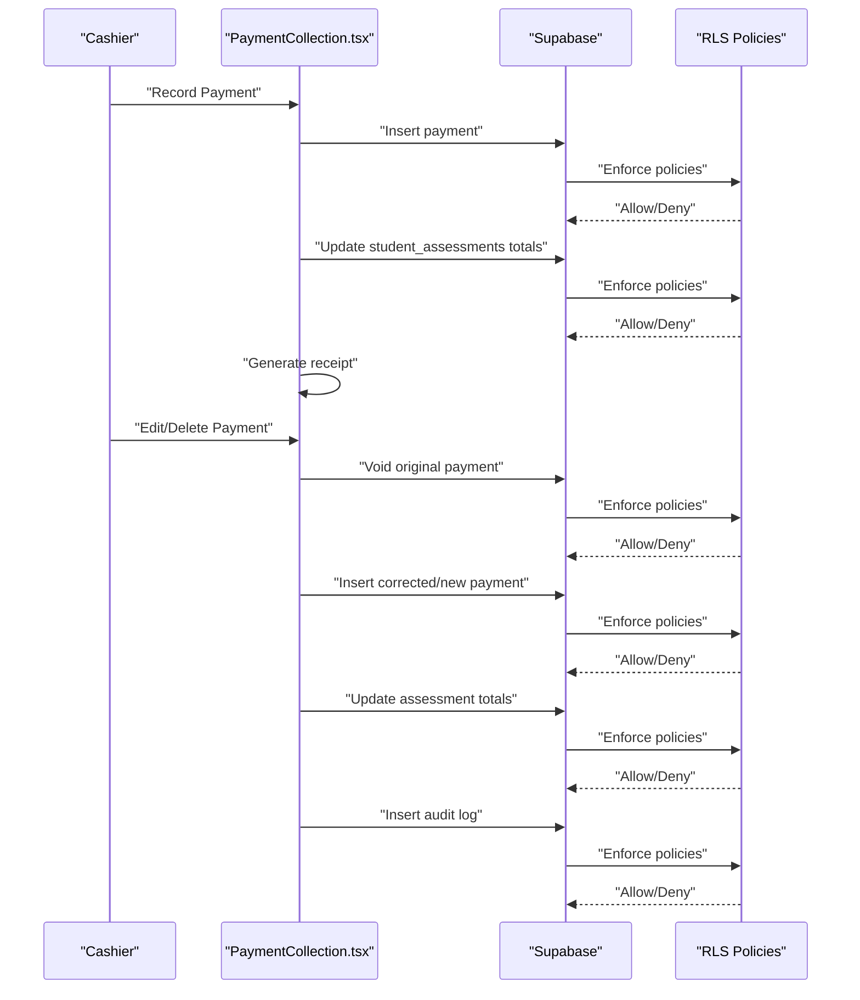
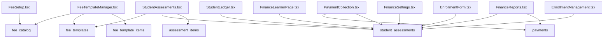

# Fee Structure Management

<cite>
**Referenced Files in This Document**
- [FeeSetup.tsx](file://src/components/finance/FeeSetup.tsx)
- [FeeTemplateManager.tsx](file://src/components/finance/FeeTemplateManager.tsx)
- [StudentAssessments.tsx](file://src/components/finance/StudentAssessments.tsx)
- [StudentLedger.tsx](file://src/components/finance/StudentLedger.tsx)
- [FinancePortal.tsx](file://src/components/finance/FinancePortal.tsx)
- [FinanceReports.tsx](file://src/components/finance/FinanceReports.tsx)
- [FinanceSettings.tsx](file://src/components/finance/FinanceSettings.tsx)
- [PaymentCollection.tsx](file://src/components/finance/PaymentCollection.tsx)
- [FinanceLearnerPage.tsx](file://src/components/finance/FinanceLearnerPage.tsx)
- [EnrollmentForm.tsx](file://src/components/enrollment/EnrollmentForm.tsx)
- [EnrollmentManagement.tsx](file://src/components/curriculum/EnrollmentManagement.tsx)
- [20260209103502_b2a0d7e3-f02e-448d-aac8-5ea9b30a6314.sql](file://supabase/migrations/20260209103502_b2a0d7e3-f02e-448d-aac8-5ea9b30a6314.sql)
</cite>

## Table of Contents
1. [Introduction](#introduction)
2. [Project Structure](#project-structure)
3. [Core Components](#core-components)
4. [Architecture Overview](#architecture-overview)
5. [Detailed Component Analysis](#detailed-component-analysis)
6. [Dependency Analysis](#dependency-analysis)
7. [Performance Considerations](#performance-considerations)
8. [Troubleshooting Guide](#troubleshooting-guide)
9. [Conclusion](#conclusion)

## Introduction
This document provides comprehensive documentation for the fee structure management system. It explains how to set up fee categories, configure amounts, create reusable fee templates, validate and manage assessments, and integrate with student enrollment processes. The system supports different student types (grade levels and strands), academic years, and provides robust validation, inheritance patterns, and customization options for schools.

## Project Structure
The fee structure management spans several frontend components and a well-defined backend schema:
- Frontend components under `src/components/finance/` implement fee setup, template management, assessments, ledger, cashier operations, reporting, and settings.
- The backend schema in `supabase/migrations/` defines tables for fee catalogs, templates, assessments, payments, and supporting entities.

**Diagram sources**
- [FeeSetup.tsx](file://src/components/finance/FeeSetup.tsx#L1-L162)
- [FeeTemplateManager.tsx](file://src/components/finance/FeeTemplateManager.tsx#L1-L325)
- [StudentAssessments.tsx](file://src/components/finance/StudentAssessments.tsx#L1-L450)
- [StudentLedger.tsx](file://src/components/finance/StudentLedger.tsx#L1-L193)
- [PaymentCollection.tsx](file://src/components/finance/PaymentCollection.tsx#L1-L854)
- [FinanceReports.tsx](file://src/components/finance/FinanceReports.tsx#L1-L322)
- [FinancePortal.tsx](file://src/components/finance/FinancePortal.tsx#L1-L100)
- [FinanceLearnerPage.tsx](file://src/components/finance/FinanceLearnerPage.tsx#L1-L284)
- [FinanceSettings.tsx](file://src/components/finance/FinanceSettings.tsx#L1-L185)
- [EnrollmentForm.tsx](file://src/components/enrollment/EnrollmentForm.tsx#L1-L782)
- [EnrollmentManagement.tsx](file://src/components/curriculum/EnrollmentManagement.tsx#L1-L451)
- [20260209103502_b2a0d7e3-f02e-448d-aac8-5ea9b30a6314.sql](file://supabase/migrations/20260209103502_b2a0d7e3-f02e-448d-aac8-5ea9b30a6314.sql#L2-L350)

**Section sources**
- [FeeSetup.tsx](file://src/components/finance/FeeSetup.tsx#L1-L162)
- [FeeTemplateManager.tsx](file://src/components/finance/FeeTemplateManager.tsx#L1-L325)
- [20260209103502_b2a0d7e3-f02e-448d-aac8-5ea9b30a6314.sql](file://supabase/migrations/20260209103502_b2a0d7e3-f02e-448d-aac8-5ea9b30a6314.sql#L2-L350)

## Core Components
- Fee Setup: Manage individual fee items per school, including category, amount, mandatory/recurring flags, and activation.
- Fee Template Manager: Bundle fee items into grade-level or strand-specific packages for streamlined assessment creation.
- Student Assessments: Create student-specific assessments from templates, apply discounts, and track balances.
- Student Ledger: View detailed payment history and account status per student.
- Cashier Operations: Record payments, manage receipts, and handle edits/deletions with audit trails.
- Reporting and Analytics: Financial dashboards and charts for collections, outstanding balances, and trends.
- Finance Settings: Configure payment terms, numbering schemes, late fees, convenience fees, and clearance thresholds.
- Finance Portal: Central dashboard for finance operations and quick actions.

**Section sources**
- [FeeSetup.tsx](file://src/components/finance/FeeSetup.tsx#L18-L162)
- [FeeTemplateManager.tsx](file://src/components/finance/FeeTemplateManager.tsx#L21-L325)
- [StudentAssessments.tsx](file://src/components/finance/StudentAssessments.tsx#L26-L450)
- [StudentLedger.tsx](file://src/components/finance/StudentLedger.tsx#L90-L193)
- [PaymentCollection.tsx](file://src/components/finance/PaymentCollection.tsx#L133-L854)
- [FinanceReports.tsx](file://src/components/finance/FinanceReports.tsx#L15-L322)
- [FinanceSettings.tsx](file://src/components/finance/FinanceSettings.tsx#L16-L185)
- [FinancePortal.tsx](file://src/components/finance/FinancePortal.tsx#L14-L100)

## Architecture Overview
The system follows a layered architecture:
- UI Layer: React components using TanStack Query for data fetching and Sonner for notifications.
- Data Access: Supabase client queries and mutations against normalized tables.
- Business Logic: Mutations encapsulate validation, calculations, and cascading updates (e.g., assessment totals, payment adjustments).
- Security: Row-level security policies restrict access to authorized roles (finance, admin, registrar, students).

**Diagram sources**
- [FeeSetup.tsx](file://src/components/finance/FeeSetup.tsx#L44-L60)
- [20260209103502_b2a0d7e3-f02e-448d-aac8-5ea9b30a6314.sql](file://supabase/migrations/20260209103502_b2a0d7e3-f02e-448d-aac8-5ea9b30a6314.sql#L17-L22)

**Section sources**
- [FeeSetup.tsx](file://src/components/finance/FeeSetup.tsx#L20-L162)
- [20260209103502_b2a0d7e3-f02e-448d-aac8-5ea9b30a6314.sql](file://supabase/migrations/20260209103502_b2a0d7e3-f02e-448d-aac8-5ea9b30a6314.sql#L17-L22)

## Detailed Component Analysis

### Fee Setup: Fee Categories and Amount Configuration
- Purpose: Define reusable fee items per school with metadata (category, amount, mandatory, recurring, active).
- Validation: Ensures name and amount are provided before saving.
- Persistence: Uses Supabase insert/update with RLS policies for finance/admin roles.
- UI: Dialog-based form with category selection, amount input, and toggles for mandatory/recurring.

**Diagram sources**
- [FeeSetup.tsx](file://src/components/finance/FeeSetup.tsx#L85-L88)
- [FeeSetup.tsx](file://src/components/finance/FeeSetup.tsx#L44-L60)

**Section sources**
- [FeeSetup.tsx](file://src/components/finance/FeeSetup.tsx#L18-L162)

### Fee Template Management: Bundling and Customization
- Purpose: Create grade-level or strand-specific fee packages by selecting and customizing amounts from the fee catalog.
- Inheritance Pattern: Templates inherit fee items; amounts can be customized per template for flexibility.
- Validation: Requires template name, grade level, academic year selection, and at least one selected item.
- Persistence: Creates/updates template header and replaces template items with new selections.

**Diagram sources**
- [FeeTemplateManager.tsx](file://src/components/finance/FeeTemplateManager.tsx#L125-L169)
- [FeeTemplateManager.tsx](file://src/components/finance/FeeTemplateManager.tsx#L171-L182)
- [20260209103502_b2a0d7e3-f02e-448d-aac8-5ea9b30a6314.sql](file://supabase/migrations/20260209103502_b2a0d7e3-f02e-448d-aac8-5ea9b30a6314.sql#L24-L58)

**Section sources**
- [FeeTemplateManager.tsx](file://src/components/finance/FeeTemplateManager.tsx#L34-L325)

### Student Assessments: Validation, Inheritance, and Customization
- Purpose: Generate student-specific assessments from templates, compute totals, and apply discounts.
- Validation: Prevents duplicate active assessments per academic year per student.
- Inheritance: Assessment items mirror template items with customizable amounts and mandatory flags.
- Discounts: Supports percentage, fixed, and coverage discounts; can require approval.

**Diagram sources**
- [StudentAssessments.tsx](file://src/components/finance/StudentAssessments.tsx#L123-L171)
- [StudentAssessments.tsx](file://src/components/finance/StudentAssessments.tsx#L173-L220)
- [20260209103502_b2a0d7e3-f02e-448d-aac8-5ea9b30a6314.sql](file://supabase/migrations/20260209103502_b2a0d7e3-f02e-448d-aac8-5ea9b30a6314.sql#L60-L107)

**Section sources**
- [StudentAssessments.tsx](file://src/components/finance/StudentAssessments.tsx#L26-L450)

### Payment Collection: Validation, Receipts, and Audit Trails
- Purpose: Record payments, manage receipts, and maintain audit trails for edits/deletes.
- Validation: Requires student, active assessment, and non-cash methods require reference numbers.
- Receipts: Dynamically generates printable receipts with current balances.
- Edits/Deletes: Voids original payment and creates corrected/new records; updates assessment totals and logs deletions.

**Diagram sources**
- [PaymentCollection.tsx](file://src/components/finance/PaymentCollection.tsx#L234-L299)
- [PaymentCollection.tsx](file://src/components/finance/PaymentCollection.tsx#L301-L376)
- [PaymentCollection.tsx](file://src/components/finance/PaymentCollection.tsx#L378-L465)
- [20260209103502_b2a0d7e3-f02e-448d-aac8-5ea9b30a6314.sql](file://supabase/migrations/20260209103502_b2a0d7e3-f02e-448d-aac8-5ea9b30a6314.sql#L109-L149)

**Section sources**
- [PaymentCollection.tsx](file://src/components/finance/PaymentCollection.tsx#L133-L854)

### Student Ledger: Payment History and Account View
- Purpose: Provide a comprehensive view of student accounts, including payment history and expandable details.
- Features: Search by name/LRN, filter by grade, expandable rows for payment history, and formatted currency displays.

**Section sources**
- [StudentLedger.tsx](file://src/components/finance/StudentLedger.tsx#L90-L193)

### Finance Reports and Analytics
- Purpose: Deliver financial insights with charts and summary cards for collections, outstanding balances, and trends.
- Data Sources: Aggregates from payments and student assessments with grouped metrics by payment method, status, and grade level.

**Section sources**
- [FinanceReports.tsx](file://src/components/finance/FinanceReports.tsx#L15-L322)

### Finance Settings: Customization Options
- Purpose: Configure payment terms, numbering schemes, late fees, convenience fees, and clearance thresholds.
- Persistence: Upserts settings keyed by school and academic year.

**Section sources**
- [FinanceSettings.tsx](file://src/components/finance/FinanceSettings.tsx#L16-L185)

### Finance Portal and Learner Page
- Finance Portal: Central dashboard with quick actions and financial stats.
- Finance Learner Page: Browse learners with financial summaries and filters.

**Section sources**
- [FinancePortal.tsx](file://src/components/finance/FinancePortal.tsx#L14-L100)
- [FinanceLearnerPage.tsx](file://src/components/finance/FinanceLearnerPage.tsx#L18-L284)

### Integration with Student Enrollment
- Enrollment Form: Captures student information and creates student records; integrates with finance via assessment creation.
- Enrollment Management: Auto-enrolls students to subjects by grade level; complements fee assessments by ensuring accurate student data.

**Section sources**
- [EnrollmentForm.tsx](file://src/components/enrollment/EnrollmentForm.tsx#L67-L782)
- [EnrollmentManagement.tsx](file://src/components/curriculum/EnrollmentManagement.tsx#L35-L451)

## Dependency Analysis
The system exhibits clear separation of concerns:
- Components depend on Supabase client for data operations and TanStack Query for caching and invalidation.
- Backend schema defines foreign keys and RLS policies to enforce access control.
- Mutations coordinate multiple table updates (e.g., assessments and items, payments and totals).

**Diagram sources**
- [FeeSetup.tsx](file://src/components/finance/FeeSetup.tsx#L35-L42)
- [FeeTemplateManager.tsx](file://src/components/finance/FeeTemplateManager.tsx#L60-L80)
- [StudentAssessments.tsx](file://src/components/finance/StudentAssessments.tsx#L50-L95)
- [PaymentCollection.tsx](file://src/components/finance/PaymentCollection.tsx#L172-L223)
- [StudentLedger.tsx](file://src/components/finance/StudentLedger.tsx#L104-L113)
- [FinanceReports.tsx](file://src/components/finance/FinanceReports.tsx#L26-L122)
- [FinanceLearnerPage.tsx](file://src/components/finance/FinanceLearnerPage.tsx#L61-L97)
- [FinanceSettings.tsx](file://src/components/finance/FinanceSettings.tsx#L29-L36)
- [EnrollmentForm.tsx](file://src/components/enrollment/EnrollmentForm.tsx#L239-L290)
- [EnrollmentManagement.tsx](file://src/components/curriculum/EnrollmentManagement.tsx#L64-L105)

**Section sources**
- [20260209103502_b2a0d7e3-f02e-448d-aac8-5ea9b30a6314.sql](file://supabase/migrations/20260209103502_b2a0d7e3-f02e-448d-aac8-5ea9b30a6314.sql#L2-L350)

## Performance Considerations
- Query Keys: Use specific query keys with school and academic year identifiers to avoid cross-school data leakage and enable targeted invalidations.
- Batch Operations: Template creation deletes and re-inserts items; ensure minimal frequency to reduce write amplification.
- UI Responsiveness: Use skeletons and controlled loading states during heavy computations (e.g., receipts generation).
- Indexes: Backend tables include indexes on frequently filtered columns (e.g., school_id, academic_year_id).

[No sources needed since this section provides general guidance]

## Troubleshooting Guide
Common issues and resolutions:
- Missing Academic Year: Many components require a selected academic year; ensure the AcademicYearContext is properly initialized.
- Insufficient Permissions: RLS policies restrict access; verify user roles (finance, admin, registrar, student).
- Duplicate Active Assessments: Prevented by validation; ensure no open assessment exists for the student in the selected year.
- Payment Validation Errors: Non-cash payments require reference numbers; ensure required fields are filled.
- Template Validation Errors: Template name, grade level, and at least one selected item are mandatory.

**Section sources**
- [FeeTemplateManager.tsx](file://src/components/finance/FeeTemplateManager.tsx#L125-L131)
- [StudentAssessments.tsx](file://src/components/finance/StudentAssessments.tsx#L123-L133)
- [PaymentCollection.tsx](file://src/components/finance/PaymentCollection.tsx#L234-L242)

## Conclusion
The fee structure management system provides a robust, role-secured framework for managing fee items, templates, assessments, and payments. Its modular components, strong validation, and integration with enrollment processes support scalable and maintainable financial operations across schools and academic years.