# Financial Management System

<cite>
**Referenced Files in This Document**
- [FeeSetup.tsx](file://src/components/finance/FeeSetup.tsx)
- [FeeTemplateManager.tsx](file://src/components/finance/FeeTemplateManager.tsx)
- [StudentAssessments.tsx](file://src/components/finance/StudentAssessments.tsx)
- [PaymentCollection.tsx](file://src/components/finance/PaymentCollection.tsx)
- [StudentLedger.tsx](file://src/components/finance/StudentLedger.tsx)
- [FinanceReports.tsx](file://src/components/finance/FinanceReports.tsx)
- [DiscountScholarships.tsx](file://src/components/finance/DiscountScholarships.tsx)
- [FinanceClearance.tsx](file://src/components/finance/FinanceClearance.tsx)
- [YearEndClose.tsx](file://src/components/finance/YearEndClose.tsx)
- [FinanceSettings.tsx](file://src/components/finance/FinanceSettings.tsx)
- [FinanceAuditLogs.tsx](file://src/components/finance/FinanceAuditLogs.tsx)
- [create_audit_logs.sql](file://supabase/migrations/20260209100000_create_audit_logs.sql)
- [grant_stfxsa_finance_access.sql](file://supabase/migrations/20260210120000_grant_stfxsa_finance_access.sql)
</cite>

## Table of Contents
1. [Introduction](#introduction)
2. [Project Structure](#project-structure)
3. [Core Components](#core-components)
4. [Architecture Overview](#architecture-overview)
5. [Detailed Component Analysis](#detailed-component-analysis)
6. [Dependency Analysis](#dependency-analysis)
7. [Performance Considerations](#performance-considerations)
8. [Troubleshooting Guide](#troubleshooting-guide)
9. [Conclusion](#conclusion)
10. [Appendices](#appendices)

## Introduction
This document describes the Financial Management System built into the portal. It covers fee structure configuration, payment processing workflows, financial reporting, scholarship and discount administration, student ledger management, financial clearance, and year-end closing procedures. It also outlines financial audit trails, receipt generation, and integration points with the Supabase backend. The goal is to provide both technical depth and practical guidance for administrators, cashiers, and developers.

## Project Structure
The financial domain is organized under the finance folder with modular React components. Each component encapsulates a specific financial function and integrates with Supabase for data persistence and real-time updates via React Query.

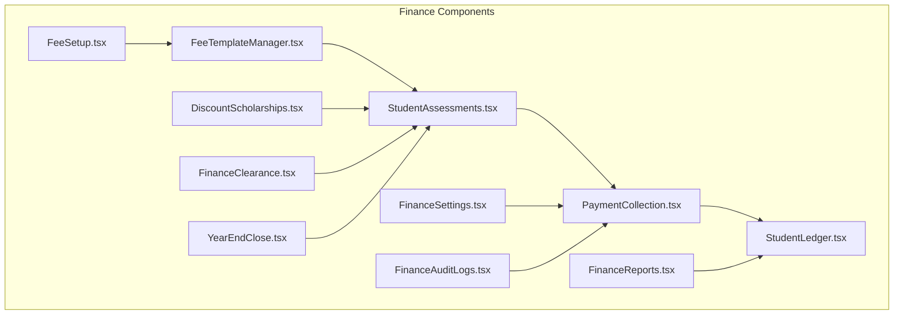

**Diagram sources**
- [FeeSetup.tsx](file://src/components/finance/FeeSetup.tsx#L1-L162)
- [FeeTemplateManager.tsx](file://src/components/finance/FeeTemplateManager.tsx#L1-L325)
- [StudentAssessments.tsx](file://src/components/finance/StudentAssessments.tsx#L1-L450)
- [PaymentCollection.tsx](file://src/components/finance/PaymentCollection.tsx#L1-L854)
- [StudentLedger.tsx](file://src/components/finance/StudentLedger.tsx#L1-L193)
- [FinanceReports.tsx](file://src/components/finance/FinanceReports.tsx#L1-L322)
- [DiscountScholarships.tsx](file://src/components/finance/DiscountScholarships.tsx#L1-L163)
- [FinanceClearance.tsx](file://src/components/finance/FinanceClearance.tsx#L1-L117)
- [YearEndClose.tsx](file://src/components/finance/YearEndClose.tsx#L1-L380)
- [FinanceSettings.tsx](file://src/components/finance/FinanceSettings.tsx#L1-L185)
- [FinanceAuditLogs.tsx](file://src/components/finance/FinanceAuditLogs.tsx#L1-L80)

**Section sources**
- [FeeSetup.tsx](file://src/components/finance/FeeSetup.tsx#L1-L162)
- [FeeTemplateManager.tsx](file://src/components/finance/FeeTemplateManager.tsx#L1-L325)
- [StudentAssessments.tsx](file://src/components/finance/StudentAssessments.tsx#L1-L450)
- [PaymentCollection.tsx](file://src/components/finance/PaymentCollection.tsx#L1-L854)
- [StudentLedger.tsx](file://src/components/finance/StudentLedger.tsx#L1-L193)
- [FinanceReports.tsx](file://src/components/finance/FinanceReports.tsx#L1-L322)
- [DiscountScholarships.tsx](file://src/components/finance/DiscountScholarships.tsx#L1-L163)
- [FinanceClearance.tsx](file://src/components/finance/FinanceClearance.tsx#L1-L117)
- [YearEndClose.tsx](file://src/components/finance/YearEndClose.tsx#L1-L380)
- [FinanceSettings.tsx](file://src/components/finance/FinanceSettings.tsx#L1-L185)
- [FinanceAuditLogs.tsx](file://src/components/finance/FinanceAuditLogs.tsx#L1-L80)

## Core Components
- Fee Setup and Templates: Define fee catalog items and group them into grade-level templates for assessments.
- Student Assessments: Create student-specific financial assessments from templates and apply discounts/scholarships.
- Payment Collection: Record payments, manage receipts, and maintain audit trails.
- Student Ledger: View comprehensive payment history per student.
- Reports and Analytics: Financial summaries, trends, and distribution charts.
- Discounts and Scholarships: Manage discount types and apply them to assessments.
- Clearance: Track and manage student financial clearance status.
- Year-End Close: Carry forward outstanding balances between academic years.
- Settings: Configure payment terms, numbering, convenience fees, and clearance thresholds.
- Audit Logs: Track finance-related actions for compliance and troubleshooting.

**Section sources**
- [FeeSetup.tsx](file://src/components/finance/FeeSetup.tsx#L1-L162)
- [FeeTemplateManager.tsx](file://src/components/finance/FeeTemplateManager.tsx#L1-L325)
- [StudentAssessments.tsx](file://src/components/finance/StudentAssessments.tsx#L1-L450)
- [PaymentCollection.tsx](file://src/components/finance/PaymentCollection.tsx#L1-L854)
- [StudentLedger.tsx](file://src/components/finance/StudentLedger.tsx#L1-L193)
- [FinanceReports.tsx](file://src/components/finance/FinanceReports.tsx#L1-L322)
- [DiscountScholarships.tsx](file://src/components/finance/DiscountScholarships.tsx#L1-L163)
- [FinanceClearance.tsx](file://src/components/finance/FinanceClearance.tsx#L1-L117)
- [YearEndClose.tsx](file://src/components/finance/YearEndClose.tsx#L1-L380)
- [FinanceSettings.tsx](file://src/components/finance/FinanceSettings.tsx#L1-L185)
- [FinanceAuditLogs.tsx](file://src/components/finance/FinanceAuditLogs.tsx#L1-L80)

## Architecture Overview
The system follows a layered architecture:
- UI Layer: React components using TanStack Query for data fetching and state.
- Backend Integration: Supabase client for database operations and RLS policies.
- Business Logic: Mutations and queries encapsulate financial workflows.
- Data Model: Relational model with tables for assessments, payments, templates, discounts, and audit logs.

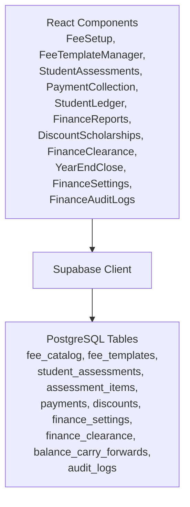

**Diagram sources**
- [PaymentCollection.tsx](file://src/components/finance/PaymentCollection.tsx#L1-L854)
- [StudentAssessments.tsx](file://src/components/finance/StudentAssessments.tsx#L1-L450)
- [StudentLedger.tsx](file://src/components/finance/StudentLedger.tsx#L1-L193)
- [FinanceReports.tsx](file://src/components/finance/FinanceReports.tsx#L1-L322)
- [DiscountScholarships.tsx](file://src/components/finance/DiscountScholarships.tsx#L1-L163)
- [FinanceClearance.tsx](file://src/components/finance/FinanceClearance.tsx#L1-L117)
- [YearEndClose.tsx](file://src/components/finance/YearEndClose.tsx#L1-L380)
- [FinanceSettings.tsx](file://src/components/finance/FinanceSettings.tsx#L1-L185)
- [FinanceAuditLogs.tsx](file://src/components/finance/FinanceAuditLogs.tsx#L1-L80)
- [create_audit_logs.sql](file://supabase/migrations/20260209100000_create_audit_logs.sql#L1-L38)

## Detailed Component Analysis

### Fee Structure Configuration
- Fee Catalog: Create and manage individual fee items with categories, amounts, and recurrence flags.
- Fee Templates: Bundle fee items into grade-level packages; supports strand for senior high.
- Active Templates: Used during assessments; templates link to fee catalog items with overrideable amounts.

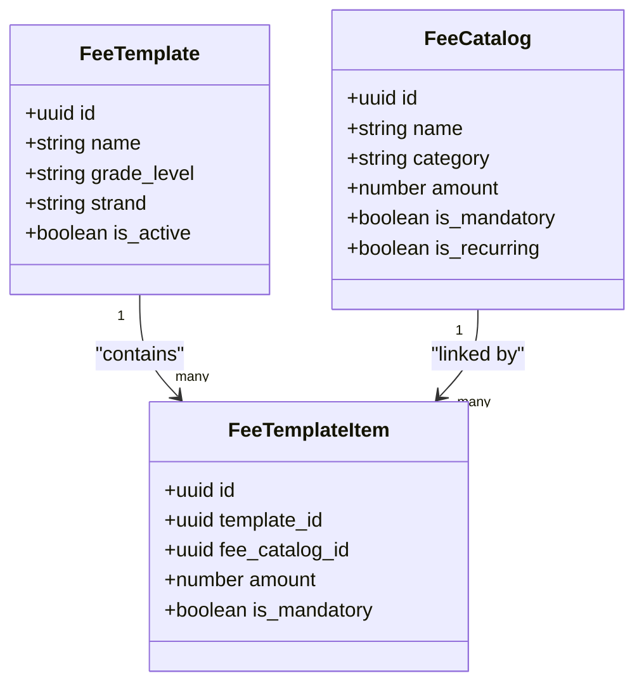

**Diagram sources**
- [FeeSetup.tsx](file://src/components/finance/FeeSetup.tsx#L18-L42)
- [FeeTemplateManager.tsx](file://src/components/finance/FeeTemplateManager.tsx#L26-L86)

**Section sources**
- [FeeSetup.tsx](file://src/components/finance/FeeSetup.tsx#L1-L162)
- [FeeTemplateManager.tsx](file://src/components/finance/FeeTemplateManager.tsx#L1-L325)

### Assessment Management and Discount Administration
- Assess Students: Create assessments from templates; compute totals and balances.
- Apply Discounts/Scholarships: Choose active discount types; preview deduction amounts; optional approval gating.
- Validation: Prevent duplicate active assessments per student per year; enforce required selections.

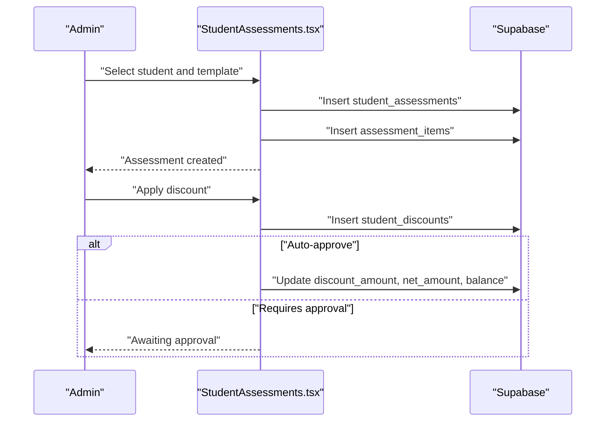

**Diagram sources**
- [StudentAssessments.tsx](file://src/components/finance/StudentAssessments.tsx#L123-L220)

**Section sources**
- [StudentAssessments.tsx](file://src/components/finance/StudentAssessments.tsx#L1-L450)
- [DiscountScholarships.tsx](file://src/components/finance/DiscountScholarships.tsx#L1-L163)

### Payment Processing Workflows
- Cashier Dashboard: Search students, select active assessment, enter payment details.
- Validation: Non-cash payments require reference numbers; amount must be positive.
- Receipt Numbering: Configurable OR/AR formats with sequence increment.
- Real-time Updates: Assessment totals updated (total_paid, balance, status).
- Receipt Generation: Print receipts with student info, payment method, and current balances.
- Edit/Delete: Void original payment and re-record corrected payment; delete logs audit trail.

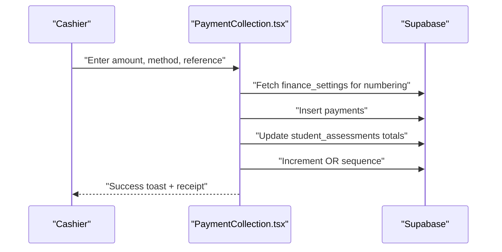

**Diagram sources**
- [PaymentCollection.tsx](file://src/components/finance/PaymentCollection.tsx#L234-L299)

**Section sources**
- [PaymentCollection.tsx](file://src/components/finance/PaymentCollection.tsx#L1-L854)
- [FinanceSettings.tsx](file://src/components/finance/FinanceSettings.tsx#L1-L185)

### Student Ledger Management
- Comprehensive View: Per-student ledger with totals, discounts, paid, and balance.
- Expandable Rows: Drill down to see payment history with status and notes.
- Filtering: Search by name/LRN; expand/collapse rows.

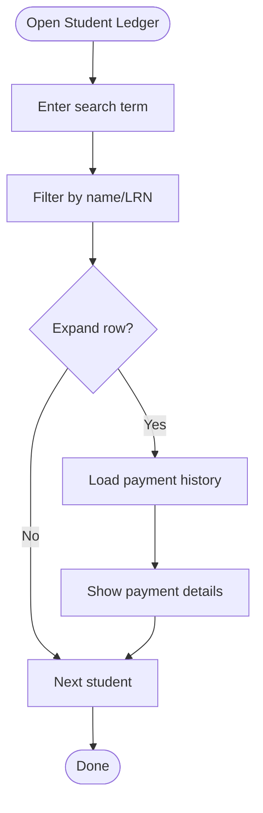

**Diagram sources**
- [StudentLedger.tsx](file://src/components/finance/StudentLedger.tsx#L16-L87)

**Section sources**
- [StudentLedger.tsx](file://src/components/finance/StudentLedger.tsx#L1-L193)

### Financial Reporting and Analytics
- Summary Cards: Total assessed, collected, outstanding, discounts.
- KPIs: Collection rate, total students, fully paid, with balance.
- Charts: Daily collections trend, cumulative collections, by payment method, assessment status, grade-level breakdown, payment status pie.

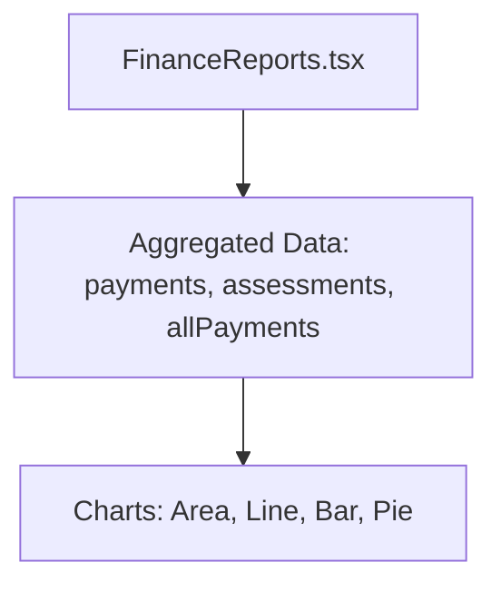

**Diagram sources**
- [FinanceReports.tsx](file://src/components/finance/FinanceReports.tsx#L26-L122)

**Section sources**
- [FinanceReports.tsx](file://src/components/finance/FinanceReports.tsx#L1-L322)

### Financial Clearance Processes
- Clearance Tracking: Toggle clearance status per student with blocking flags for exams, grades, and enrollment.
- Search and Filter: Find students by name; quick status toggle.

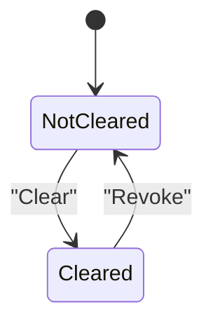

**Diagram sources**
- [FinanceClearance.tsx](file://src/components/finance/FinanceClearance.tsx#L42-L55)

**Section sources**
- [FinanceClearance.tsx](file://src/components/finance/FinanceClearance.tsx#L1-L117)

### Year-End Closing and Carry Forward
- Selection: Choose source and target academic years; exclude already-carry students.
- Batch Processing: For each selected assessment, create or update target assessment, add prior year balance item, close source assessment, and record carry-forward.
- Audit Logging: Log carry-forward actions.

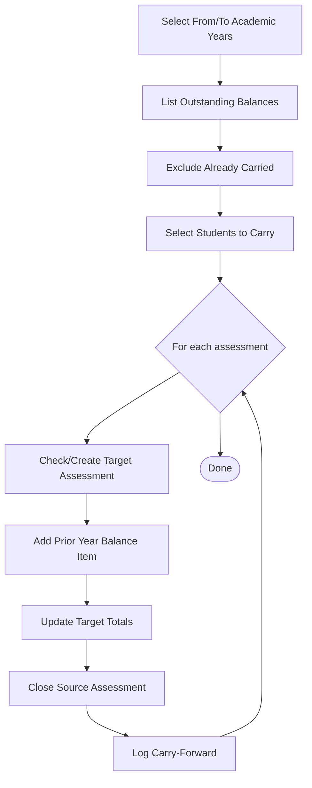

**Diagram sources**
- [YearEndClose.tsx](file://src/components/finance/YearEndClose.tsx#L100-L231)

**Section sources**
- [YearEndClose.tsx](file://src/components/finance/YearEndClose.tsx#L1-L380)

### Financial Audit Trails
- Audit Logs: Track finance-related actions with user, action, status, and details.
- Finance Audit Logs Page: Filter by action or table; view recent entries.

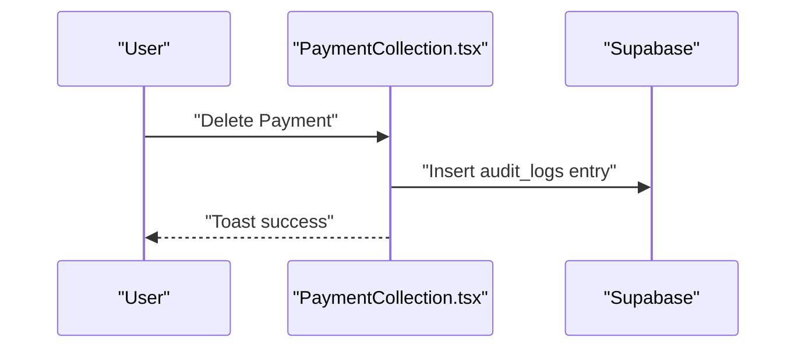

**Diagram sources**
- [PaymentCollection.tsx](file://src/components/finance/PaymentCollection.tsx#L350-L363)
- [create_audit_logs.sql](file://supabase/migrations/20260209100000_create_audit_logs.sql#L1-L38)

**Section sources**
- [FinanceAuditLogs.tsx](file://src/components/finance/FinanceAuditLogs.tsx#L1-L80)
- [create_audit_logs.sql](file://supabase/migrations/20260209100000_create_audit_logs.sql#L1-L38)

### Financial Templates and Settings
- Receipt Numbering: Configurable formats and sequences for OR/AR.
- Payment Terms: Default terms, late fees, convenience fees, and clearance thresholds.
- Access Control: Grants finance access to specific users and schools.

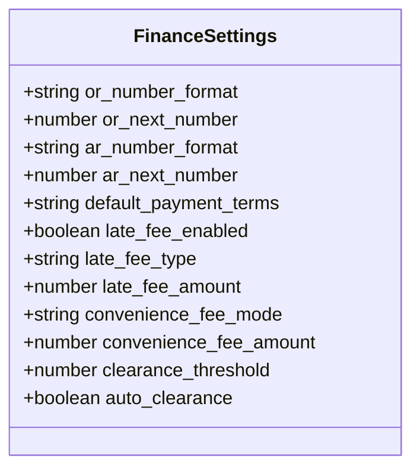

**Diagram sources**
- [FinanceSettings.tsx](file://src/components/finance/FinanceSettings.tsx#L38-L51)

**Section sources**
- [FinanceSettings.tsx](file://src/components/finance/FinanceSettings.tsx#L1-L185)
- [grant_stfxsa_finance_access.sql](file://supabase/migrations/20260210120000_grant_stfxsa_finance_access.sql#L1-L70)

## Dependency Analysis
- Component Coupling: PaymentCollection depends on FinanceSettings for numbering; StudentAssessments depends on FeeTemplateManager for templates; YearEndClose depends on Assessment and Template data.
- Data Dependencies: Payments reference assessments; assessments reference templates and discounts; clearance references students; carry-forward links source/target assessments.
- External Integrations: Supabase client for all data operations; TanStack Query for caching and optimistic updates; Sonner for notifications.

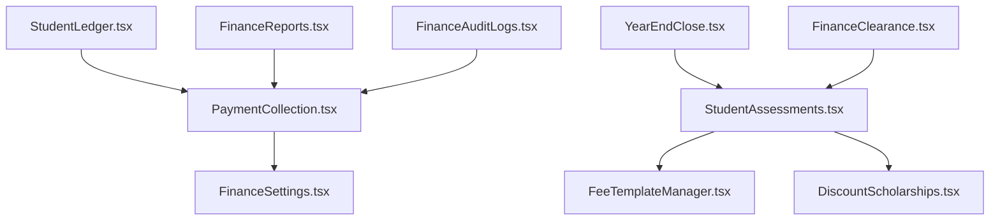

**Diagram sources**
- [PaymentCollection.tsx](file://src/components/finance/PaymentCollection.tsx#L1-L854)
- [StudentAssessments.tsx](file://src/components/finance/StudentAssessments.tsx#L1-L450)
- [StudentLedger.tsx](file://src/components/finance/StudentLedger.tsx#L1-L193)
- [FinanceReports.tsx](file://src/components/finance/FinanceReports.tsx#L1-L322)
- [YearEndClose.tsx](file://src/components/finance/YearEndClose.tsx#L1-L380)
- [FinanceClearance.tsx](file://src/components/finance/FinanceClearance.tsx#L1-L117)
- [FinanceAuditLogs.tsx](file://src/components/finance/FinanceAuditLogs.tsx#L1-L80)
- [FinanceSettings.tsx](file://src/components/finance/FinanceSettings.tsx#L1-L185)

**Section sources**
- [PaymentCollection.tsx](file://src/components/finance/PaymentCollection.tsx#L1-L854)
- [StudentAssessments.tsx](file://src/components/finance/StudentAssessments.tsx#L1-L450)
- [StudentLedger.tsx](file://src/components/finance/StudentLedger.tsx#L1-L193)
- [FinanceReports.tsx](file://src/components/finance/FinanceReports.tsx#L1-L322)
- [YearEndClose.tsx](file://src/components/finance/YearEndClose.tsx#L1-L380)
- [FinanceClearance.tsx](file://src/components/finance/FinanceClearance.tsx#L1-L117)
- [FinanceAuditLogs.tsx](file://src/components/finance/FinanceAuditLogs.tsx#L1-L80)
- [FinanceSettings.tsx](file://src/components/finance/FinanceSettings.tsx#L1-L185)

## Performance Considerations
- Query Keys: Use scoped keys with school and academic year IDs to avoid cross-school data leaks and improve cache invalidation.
- Pagination and Limits: Use limits on recent lists (e.g., recent payments) to keep UI responsive.
- Conditional Queries: Enable queries only when required IDs are present to prevent unnecessary network calls.
- Optimistic Updates: Invalidate queries after mutations to reflect changes instantly.
- Chart Data Aggregation: Compute aggregates client-side from fetched datasets to reduce server load.

[No sources needed since this section provides general guidance]

## Troubleshooting Guide
- Payment Validation Errors: Ensure amount > 0, reference number for non-cash, and active assessment exists before recording.
- Edit/Delete Restrictions: Only users with finance/admin roles can void/delete payments; verify user roles before proceeding.
- Audit Trail Checks: Use Finance Audit Logs page to track actions and reasons for deletions.
- Access Issues: Confirm finance role and school access grants for users.

**Section sources**
- [PaymentCollection.tsx](file://src/components/finance/PaymentCollection.tsx#L234-L299)
- [PaymentCollection.tsx](file://src/components/finance/PaymentCollection.tsx#L301-L376)
- [FinanceAuditLogs.tsx](file://src/components/finance/FinanceAuditLogs.tsx#L1-L80)
- [grant_stfxsa_finance_access.sql](file://supabase/migrations/20260210120000_grant_stfxsa_finance_access.sql#L1-L70)

## Conclusion
The Financial Management System provides a comprehensive, modular solution for managing fees, assessments, payments, and year-end processes. Its design emphasizes data integrity, auditability, and user experience through clear workflows and robust validation. Administrators can configure fee structures, apply discounts, process payments, monitor performance, and ensure compliance via audit logs.

[No sources needed since this section summarizes without analyzing specific files]

## Appendices

### Payment Processing Logic Examples
- Recording a payment: Validate amount and method, generate receipt number from settings, insert payment, update assessment totals, increment sequence.
- Editing a payment: Void original, generate new receipt number, insert corrected payment, recalculate assessment totals, increment sequence.
- Deleting a payment: Void payment, reverse amount from assessment, log deletion with reason.

**Section sources**
- [PaymentCollection.tsx](file://src/components/finance/PaymentCollection.tsx#L234-L299)
- [PaymentCollection.tsx](file://src/components/finance/PaymentCollection.tsx#L378-L465)
- [PaymentCollection.tsx](file://src/components/finance/PaymentCollection.tsx#L301-L376)

### Financial Data Validation Rules
- Payment amount must be positive.
- Non-cash payments require a reference number.
- Duplicate active assessments per student per year are prevented.
- Discount application respects approval requirements and caps.

**Section sources**
- [PaymentCollection.tsx](file://src/components/finance/PaymentCollection.tsx#L234-L242)
- [StudentAssessments.tsx](file://src/components/finance/StudentAssessments.tsx#L129-L133)
- [StudentAssessments.tsx](file://src/components/finance/StudentAssessments.tsx#L173-L220)