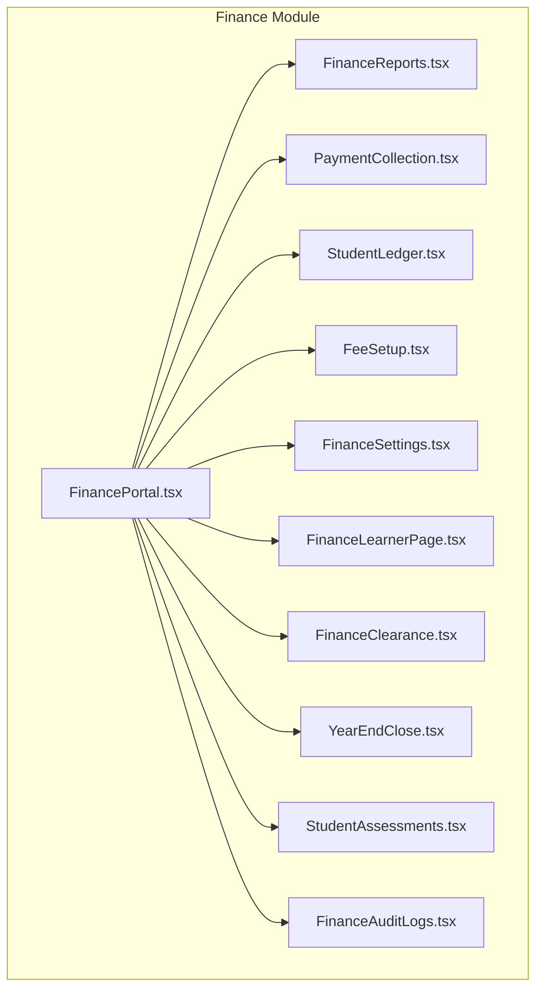
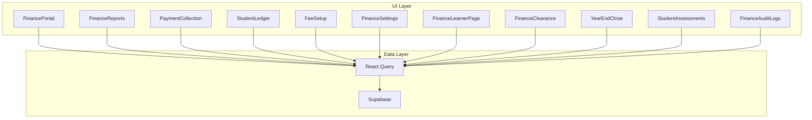
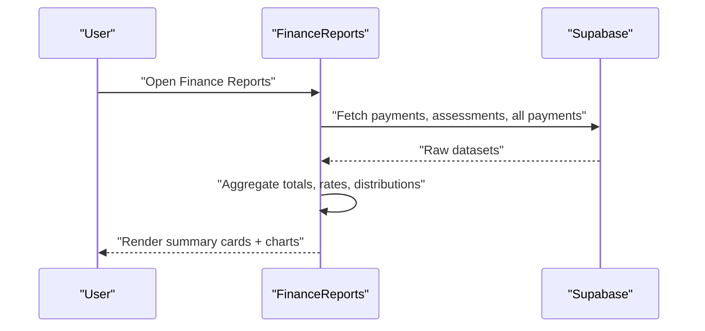
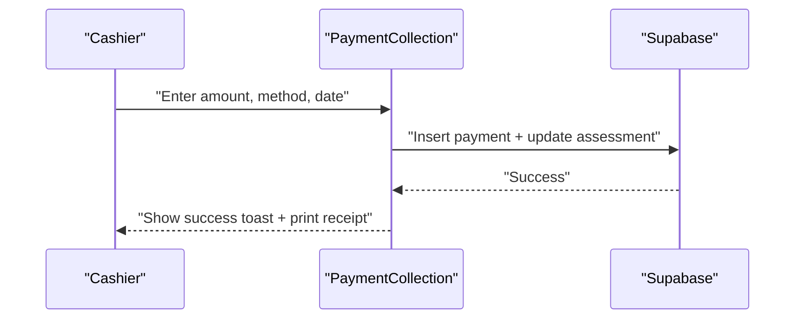
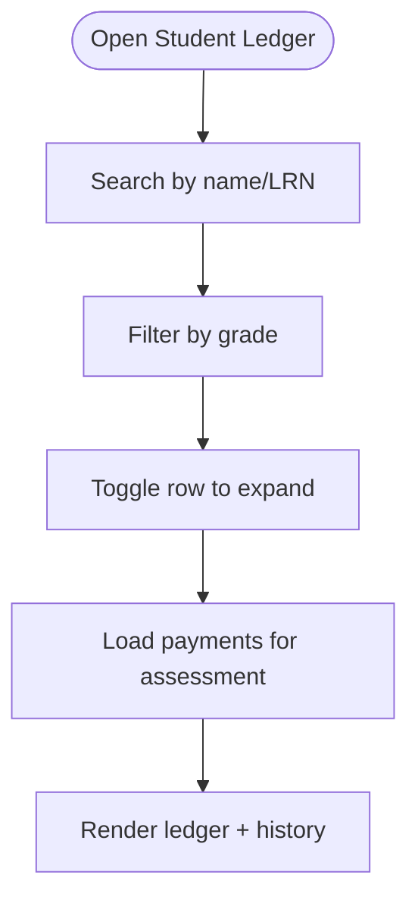
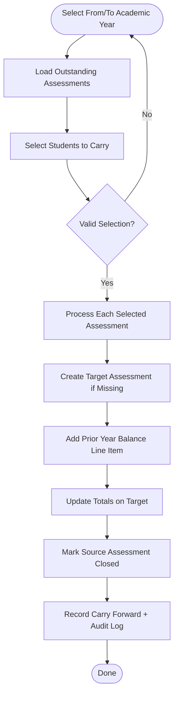
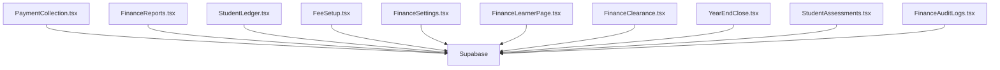

# Financial Reporting & Analytics

<cite>
**Referenced Files in This Document**
- [FinancePortal.tsx](file://src/components/finance/FinancePortal.tsx)
- [FinanceReports.tsx](file://src/components/finance/FinanceReports.tsx)
- [FinanceAuditLogs.tsx](file://src/components/finance/FinanceAuditLogs.tsx)
- [PaymentCollection.tsx](file://src/components/finance/PaymentCollection.tsx)
- [StudentLedger.tsx](file://src/components/finance/StudentLedger.tsx)
- [FeeSetup.tsx](file://src/components/finance/FeeSetup.tsx)
- [FinanceSettings.tsx](file://src/components/finance/FinanceSettings.tsx)
- [FinanceLearnerPage.tsx](file://src/components/finance/FinanceLearnerPage.tsx)
- [FinanceClearance.tsx](file://src/components/finance/FinanceClearance.tsx)
- [YearEndClose.tsx](file://src/components/finance/YearEndClose.tsx)
- [StudentAssessments.tsx](file://src/components/finance/StudentAssessments.tsx)
</cite>

## Table of Contents
1. [Introduction](#introduction)
2. [Project Structure](#project-structure)
3. [Core Components](#core-components)
4. [Architecture Overview](#architecture-overview)
5. [Detailed Component Analysis](#detailed-component-analysis)
6. [Dependency Analysis](#dependency-analysis)
7. [Performance Considerations](#performance-considerations)
8. [Troubleshooting Guide](#troubleshooting-guide)
9. [Conclusion](#conclusion)
10. [Appendices](#appendices)

## Introduction
This document describes the financial reporting and analytics capabilities of the portal, focusing on revenue reporting, payment analytics, financial performance metrics, audit log management, compliance reporting, financial transparency, report generation, export capabilities, and financial dashboards. It synthesizes the implementation patterns across the finance module to help both technical and non-technical users understand how financial data is captured, processed, visualized, and audited.

## Project Structure
The finance domain is organized as a cohesive set of React components under the finance folder. Each component encapsulates a distinct functional area: revenue capture (payments), financial analytics (reports), ledger maintenance (student accounts), fee configuration (setup), policy settings (settings), learner overview, clearance, year-end close, and audit logging. These components share common data access patterns via Supabase and React Query, and rely on shared UI primitives.

**Diagram sources**
- [FinancePortal.tsx](file://src/components/finance/FinancePortal.tsx#L14-L99)
- [FinanceReports.tsx](file://src/components/finance/FinanceReports.tsx#L15-L322)
- [FinanceAuditLogs.tsx](file://src/components/finance/FinanceAuditLogs.tsx#L11-L80)
- [PaymentCollection.tsx](file://src/components/finance/PaymentCollection.tsx#L133-L854)
- [StudentLedger.tsx](file://src/components/finance/StudentLedger.tsx#L90-L193)
- [FeeSetup.tsx](file://src/components/finance/FeeSetup.tsx#L20-L162)
- [FinanceSettings.tsx](file://src/components/finance/FinanceSettings.tsx#L16-L185)
- [FinanceLearnerPage.tsx](file://src/components/finance/FinanceLearnerPage.tsx#L18-L284)
- [FinanceClearance.tsx](file://src/components/finance/FinanceClearance.tsx#L16-L117)
- [YearEndClose.tsx](file://src/components/finance/YearEndClose.tsx#L17-L380)
- [StudentAssessments.tsx](file://src/components/finance/StudentAssessments.tsx#L26-L450)

**Section sources**
- [FinancePortal.tsx](file://src/components/finance/FinancePortal.tsx#L14-L99)

## Core Components
- Revenue reporting and payment analytics: PaymentCollection and FinanceReports provide real-time cash flow insights, payment method distribution, daily trends, and grade-level collections.
- Financial performance metrics: FinancePortal aggregates high-level KPIs (collections, outstanding, cleared, pending) for quick situational awareness.
- Audit log management: FinanceAuditLogs surfaces finance-related audit events for traceability.
- Compliance reporting and transparency: YearEndClose and FinanceClearance support year-end closure and clearance thresholds; FinanceSettings configures policies (late fees, receipts, convenience fees).
- Report generation and export: FinanceReports renders charts and summary cards; receipts can be printed from PaymentCollection.
- Financial dashboards: FinancePortal and FinanceLearnerPage present summarized views for operational oversight.

**Section sources**
- [FinancePortal.tsx](file://src/components/finance/FinancePortal.tsx#L18-L49)
- [FinanceReports.tsx](file://src/components/finance/FinanceReports.tsx#L26-L122)
- [FinanceAuditLogs.tsx](file://src/components/finance/FinanceAuditLogs.tsx#L23-L30)
- [PaymentCollection.tsx](file://src/components/finance/PaymentCollection.tsx#L234-L465)
- [FinanceSettings.tsx](file://src/components/finance/FinanceSettings.tsx#L72-L104)
- [FinanceLearnerPage.tsx](file://src/components/finance/FinanceLearnerPage.tsx#L137-L163)
- [FinanceClearance.tsx](file://src/components/finance/FinanceClearance.tsx#L42-L55)
- [YearEndClose.tsx](file://src/components/finance/YearEndClose.tsx#L100-L231)

## Architecture Overview
The finance module follows a data-driven React architecture:
- Data access: Supabase client is used to query and mutate financial entities (payments, assessments, receipts, settings).
- State management: React Query manages caching, invalidation, and optimistic updates for forms and lists.
- UI composition: Shared UI components (cards, tables, dialogs, inputs) provide consistent experiences.
- Real-time dashboards: Queries compute derived metrics and render charts using responsive chart libraries.

**Diagram sources**
- [FinancePortal.tsx](file://src/components/finance/FinancePortal.tsx#L18-L42)
- [FinanceReports.tsx](file://src/components/finance/FinanceReports.tsx#L26-L122)
- [PaymentCollection.tsx](file://src/components/finance/PaymentCollection.tsx#L164-L184)
- [StudentLedger.tsx](file://src/components/finance/StudentLedger.tsx#L104-L113)
- [FeeSetup.tsx](file://src/components/finance/FeeSetup.tsx#L35-L42)
- [FinanceSettings.tsx](file://src/components/finance/FinanceSettings.tsx#L29-L36)
- [FinanceLearnerPage.tsx](file://src/components/finance/FinanceLearnerPage.tsx#L40-L57)
- [FinanceClearance.tsx](file://src/components/finance/FinanceClearance.tsx#L31-L40)
- [YearEndClose.tsx](file://src/components/finance/YearEndClose.tsx#L43-L57)
- [StudentAssessments.tsx](file://src/components/finance/StudentAssessments.tsx#L50-L59)
- [FinanceAuditLogs.tsx](file://src/components/finance/FinanceAuditLogs.tsx#L23-L30)

## Detailed Component Analysis

### Revenue Reporting and Payment Analytics
- Purpose: Track and visualize cash collections, payment methods, daily trends, and grade-level performance.
- Key features:
  - Summary cards for total assessed, collected, outstanding, and discounts.
  - Collection rate, total assessed students, fully paid, and overdue counts.
  - Charts: daily collections trend (area), cumulative collections (line), collections by payment method (bar), assessment status distribution (pie), grade-level collections vs assessed vs balance (grouped bar).
  - Transaction status distribution pie and total transaction count.
- Data sources: payments, student_assessments, and payments again for status aggregation.
- Export capability: Receipt printing from PaymentCollection; reports are visual dashboards.

**Diagram sources**
- [FinanceReports.tsx](file://src/components/finance/FinanceReports.tsx#L26-L122)

**Section sources**
- [FinanceReports.tsx](file://src/components/finance/FinanceReports.tsx#L124-L322)

### Cashier Dashboard and Payment Collection
- Purpose: Accept payments, validate amounts, enforce reference numbers for non-cash methods, and maintain audit trails.
- Key features:
  - Student search by name/LRN with live results.
  - Auto-fill of current assessment totals and remaining balance.
  - Payment recording with OR numbering policy and receipt printing.
  - Edit and delete payment with voiding and reversal logic.
  - Audit logging for deletions.
- Workflows:
  - Record payment: insert payment, update assessment totals, increment OR sequence.
  - Edit payment: void original, insert corrected, recalculate assessment.
  - Delete payment: void payment, reverse assessment, log audit event.

**Diagram sources**
- [PaymentCollection.tsx](file://src/components/finance/PaymentCollection.tsx#L234-L299)

**Section sources**
- [PaymentCollection.tsx](file://src/components/finance/PaymentCollection.tsx#L133-L854)

### Student Ledger and Assessments
- Purpose: Provide a complete view of a student’s financial account, including history and status.
- Key features:
  - Expandable rows to show payment history per assessment.
  - Filters by search and grade.
  - Status badges for paid/partial/unpaid/no assessment.
- Data access: Queries linked assessments and payments by assessment ID and school ID.

**Diagram sources**
- [StudentLedger.tsx](file://src/components/finance/StudentLedger.tsx#L16-L29)

**Section sources**
- [StudentLedger.tsx](file://src/components/finance/StudentLedger.tsx#L90-L193)

### Fee Setup and Templates
- Purpose: Define fee catalog items and templates for assessments.
- Key features:
  - CRUD for fee catalog items (name, description, category, amount, mandatory/recurring).
  - Template manager integration.
- Data access: Queries and mutations against fee catalog and templates.

**Section sources**
- [FeeSetup.tsx](file://src/components/finance/FeeSetup.tsx#L20-L162)

### Finance Settings and Policies
- Purpose: Configure payment terms, receipt numbering, late fees, convenience fees, and clearance thresholds.
- Key features:
  - Default payment terms (cash/installment).
  - Late fee configuration (type and amount).
  - Receipt number formats and sequences (OR/AR).
  - Convenience fee mode and amount.
  - Clearance threshold and auto-clearance toggle.
- Persistence: Upsert into finance_settings with validation.

**Section sources**
- [FinanceSettings.tsx](file://src/components/finance/FinanceSettings.tsx#L16-L185)

### Finance Learners Overview
- Purpose: Browse learners with financial summaries and filters.
- Key features:
  - Summary cards for total learners, assessed, collected, and outstanding.
  - Search by name/LRN and filter by grade.
  - Status badges per student.

**Section sources**
- [FinanceLearnerPage.tsx](file://src/components/finance/FinanceLearnerPage.tsx#L18-L284)

### Finance Clearance
- Purpose: Manage student finance clearance status and block flags.
- Key features:
  - Toggle clearance with audit info.
  - Search by student name.
  - Block indicators for exams, grades, and enrollment.

**Section sources**
- [FinanceClearance.tsx](file://src/components/finance/FinanceClearance.tsx#L16-L117)

### Year-End Close and Carry Forward
- Purpose: Close academic year financials and carry outstanding balances to the next year.
- Key features:
  - Select source and target academic years.
  - Bulk selection of students with outstanding balances.
  - Create target assessments if missing, add prior year balance line item, update totals, mark source closed, record carry-forward, and log audit event.
- Safety: Prevents same-year transfers and excludes already-carried students.

**Diagram sources**
- [YearEndClose.tsx](file://src/components/finance/YearEndClose.tsx#L100-L231)

**Section sources**
- [YearEndClose.tsx](file://src/components/finance/YearEndClose.tsx#L17-L380)

### Finance Audit Logs
- Purpose: Track finance-related actions for compliance and transparency.
- Key features:
  - Search by action or table.
  - Paginated retrieval of recent entries with user and timestamp.

**Section sources**
- [FinanceAuditLogs.tsx](file://src/components/finance/FinanceAuditLogs.tsx#L11-L80)

### Student Assessments and Discounts
- Purpose: Create assessments from templates and apply discounts with optional approvals.
- Key features:
  - Create assessment from template with items.
  - Apply discounts with preview and approval gating.
  - Status badges and grade filtering.

**Section sources**
- [StudentAssessments.tsx](file://src/components/finance/StudentAssessments.tsx#L26-L450)

## Dependency Analysis
- Data access pattern: All components use Supabase client and React Query for data fetching and mutations.
- Cohesion: Each component focuses on a single responsibility (e.g., payments, reports, ledger).
- Coupling: Components depend on shared contexts (school/year) and Supabase tables; minimal cross-component coupling.
- External dependencies: Chart rendering (via chart libraries) and UI primitives (shared components).

**Diagram sources**
- [PaymentCollection.tsx](file://src/components/finance/PaymentCollection.tsx#L17-L21)
- [FinanceReports.tsx](file://src/components/finance/FinanceReports.tsx#L7-L9)
- [StudentLedger.tsx](file://src/components/finance/StudentLedger.tsx#L10-L13)
- [FeeSetup.tsx](file://src/components/finance/FeeSetup.tsx#L13-L15)
- [FinanceSettings.tsx](file://src/components/finance/FinanceSettings.tsx#L10-L13)
- [FinanceLearnerPage.tsx](file://src/components/finance/FinanceLearnerPage.tsx#L11-L13)
- [FinanceClearance.tsx](file://src/components/finance/FinanceClearance.tsx#L9-L13)
- [YearEndClose.tsx](file://src/components/finance/YearEndClose.tsx#L11-L14)
- [StudentAssessments.tsx](file://src/components/finance/StudentAssessments.tsx#L12-L15)
- [FinanceAuditLogs.tsx](file://src/components/finance/FinanceAuditLogs.tsx#L7-L9)

**Section sources**
- [FinancePortal.tsx](file://src/components/finance/FinancePortal.tsx#L1-L12)

## Performance Considerations
- Efficient queries: Components use targeted selects and filters to minimize payload sizes.
- Parallelization: Aggregations leverage Promise.all for concurrent reads.
- Pagination and limits: Audit logs and recent payments limit result sets.
- Memoization: Client-side computed totals and previews reduce re-computation.
- Recommendations:
  - Add server-side aggregations for large datasets.
  - Implement server-side filtering for audit logs.
  - Consider background jobs for heavy year-end operations.

[No sources needed since this section provides general guidance]

## Troubleshooting Guide
- Payment recording fails:
  - Verify amount > 0 and student selected.
  - Non-cash methods require reference numbers.
  - Check OR numbering settings and increment logic.
- Edit/delete payment errors:
  - Ensure sufficient permissions (finance/admin).
  - Confirm assessment exists and recalculation logic applies.
- Reports show zero or stale data:
  - Confirm selected school and academic year.
  - Trigger manual refresh or wait for cache invalidation.
- Year-end carry-forward issues:
  - Ensure source and target years differ.
  - Exclude students already carried in the target year.
- Audit logs missing:
  - Confirm finance_audit_logs table exists and queries are scoped to school.

**Section sources**
- [PaymentCollection.tsx](file://src/components/finance/PaymentCollection.tsx#L234-L299)
- [YearEndClose.tsx](file://src/components/finance/YearEndClose.tsx#L100-L108)
- [FinanceAuditLogs.tsx](file://src/components/finance/FinanceAuditLogs.tsx#L23-L30)

## Conclusion
The finance module delivers a robust, data-driven suite of tools for revenue reporting, payment analytics, financial transparency, and compliance. Its modular design, strong audit logging, and policy controls support both day-to-day operations and long-term financial governance. Extending visualization, export formats, and automated compliance checks would further enhance reporting capabilities.

[No sources needed since this section summarizes without analyzing specific files]

## Appendices

### Financial Data Visualization Examples
- Daily Collections Trend (area chart): Tracks 30-day rolling collections.
- Cumulative Collections (line chart): Shows running total over time.
- Collections by Payment Method (bar chart): Compares cash, bank deposits, online transfers, e-wallets, and cards.
- Assessment Status Distribution (pie chart): Visualizes pending, partial, paid, overpaid, closed.
- Grade-Level Collections vs Assessed vs Balance (grouped bar chart): Compares charges, collections, and outstanding by grade.
- Payment Status Distribution (pie chart): Verified, pending, voided across all transactions.

**Section sources**
- [FinanceReports.tsx](file://src/components/finance/FinanceReports.tsx#L210-L295)

### Regulatory Reporting Requirements
- Audit trail retention: Maintain finance_audit_logs for all payment and clearance actions.
- Receipt compliance: Enforce OR numbering formats and print receipts with required fields.
- Year-end closure: Close assessments and carry balances per academic year with explicit logging.
- Clearance thresholds: Enforce policy-defined thresholds for blocking services until balances are resolved.

**Section sources**
- [FinanceAuditLogs.tsx](file://src/components/finance/FinanceAuditLogs.tsx#L23-L30)
- [PaymentCollection.tsx](file://src/components/finance/PaymentCollection.tsx#L53-L131)
- [YearEndClose.tsx](file://src/components/finance/YearEndClose.tsx#L194-L207)
- [FinanceSettings.tsx](file://src/components/finance/FinanceSettings.tsx#L72-L104)