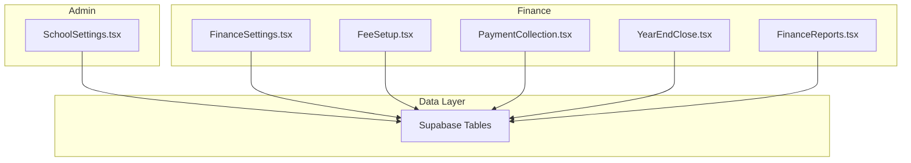
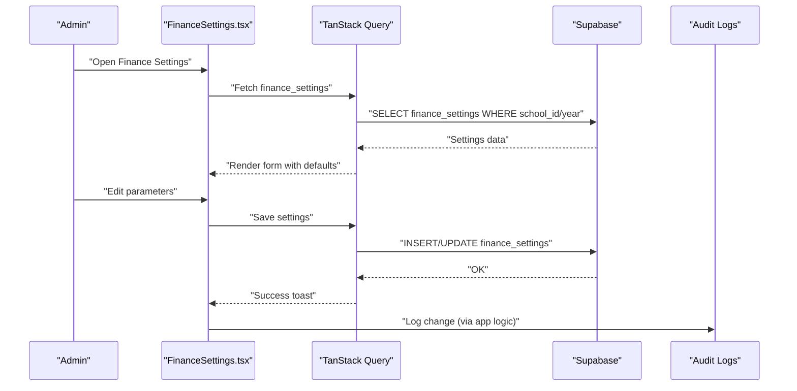
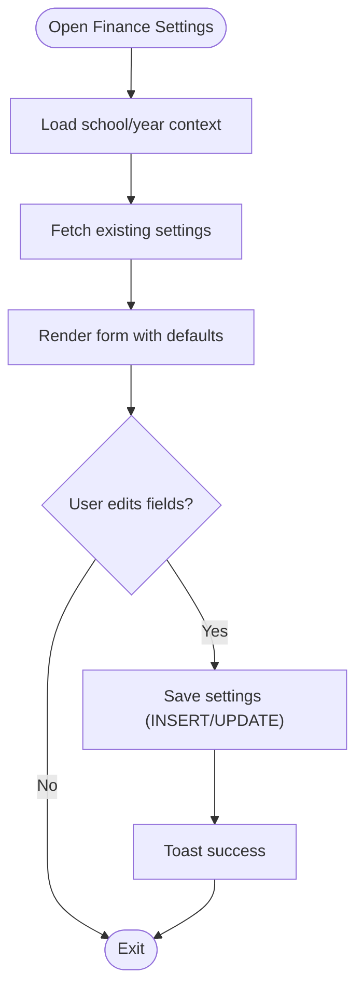
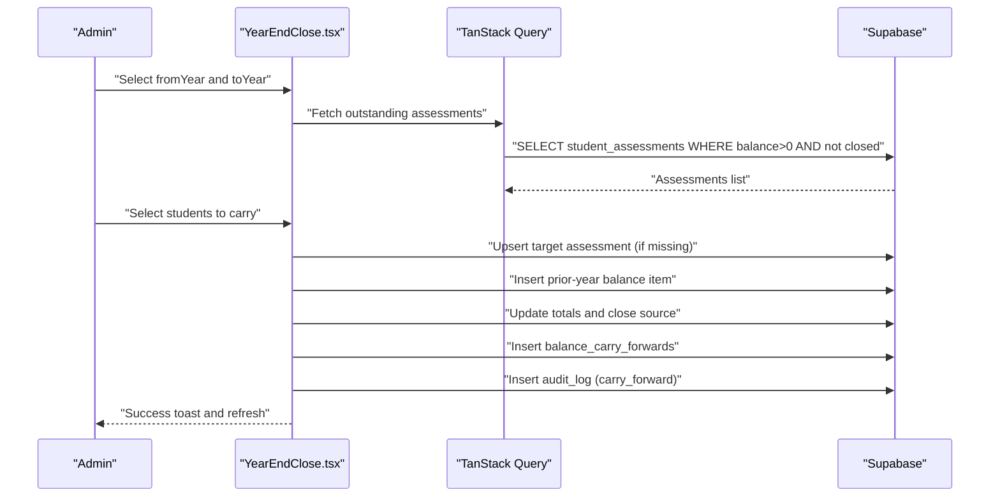
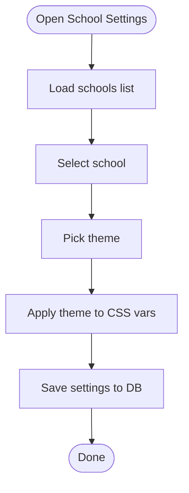
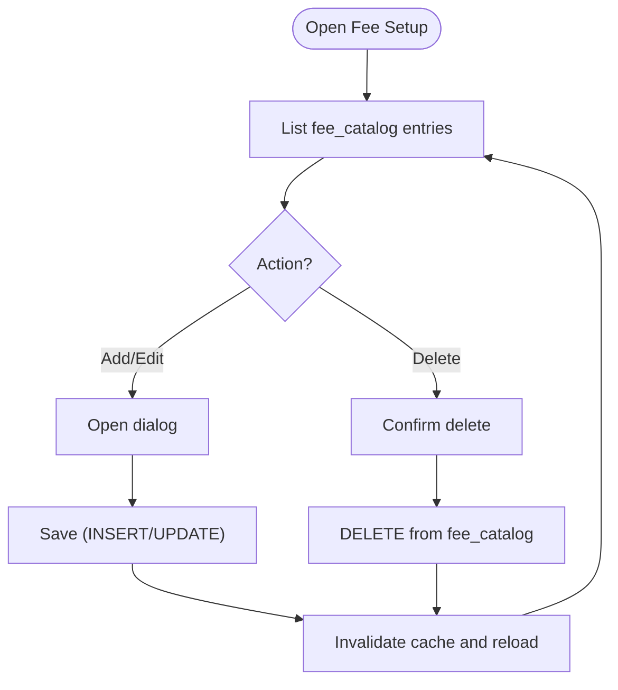
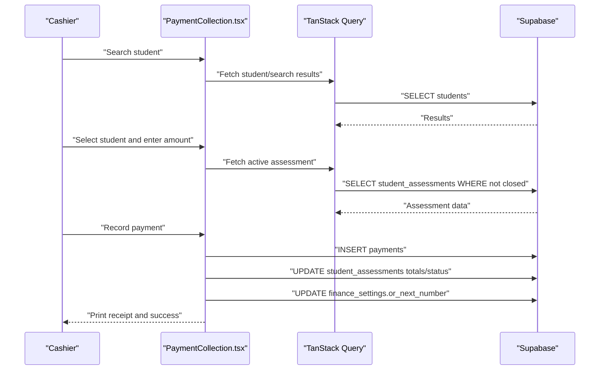
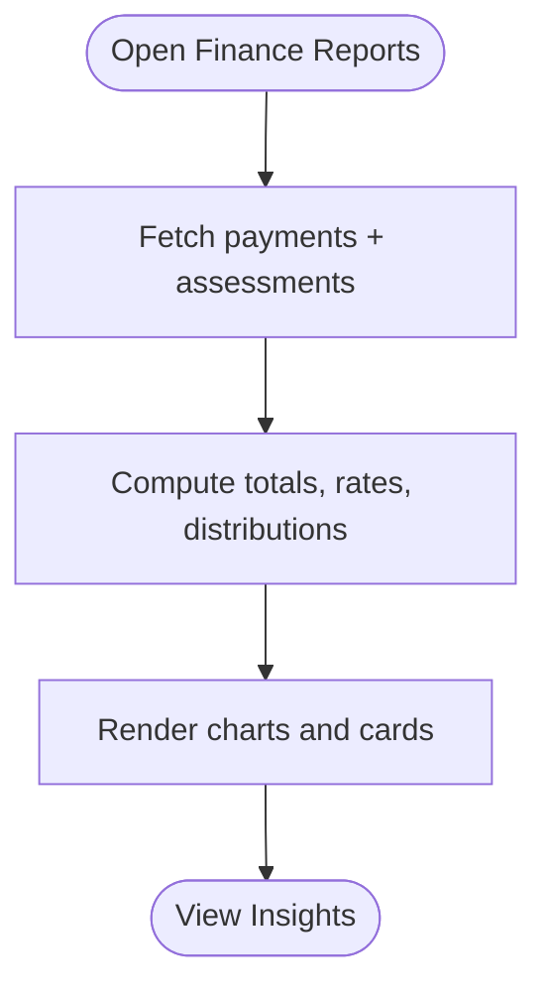
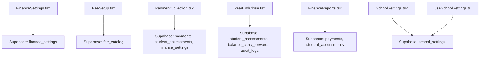

# Financial Settings & Configuration

<cite>
**Referenced Files in This Document**
- [FinanceSettings.tsx](file://src/components/finance/FinanceSettings.tsx)
- [YearEndClose.tsx](file://src/components/finance/YearEndClose.tsx)
- [SchoolSettings.tsx](file://src/components/admin/SchoolSettings.tsx)
- [FeeSetup.tsx](file://src/components/finance/FeeSetup.tsx)
- [PaymentCollection.tsx](file://src/components/finance/PaymentCollection.tsx)
- [FinanceReports.tsx](file://src/components/finance/FinanceReports.tsx)
- [useSchoolSettings.ts](file://src/hooks/useSchoolSettings.ts)
</cite>

## Table of Contents
1. [Introduction](#introduction)
2. [Project Structure](#project-structure)
3. [Core Components](#core-components)
4. [Architecture Overview](#architecture-overview)
5. [Detailed Component Analysis](#detailed-component-analysis)
6. [Dependency Analysis](#dependency-analysis)
7. [Performance Considerations](#performance-considerations)
8. [Troubleshooting Guide](#troubleshooting-guide)
9. [Conclusion](#conclusion)

## Introduction
This document explains the financial system configuration and administrative settings within the portal. It covers system-wide financial parameters, tax configurations, accounting period management, year-end closing procedures, financial data reporting, and administrative controls for financial data management. The goal is to provide practical guidance for administrators to configure, operate, and maintain the financial subsystem effectively.

## Project Structure
The financial domain is implemented as React components integrated with Supabase for data persistence. Administrative settings for schools and financial parameters are exposed via dedicated UI components. Reporting and analytics are provided through visualization components.

**Diagram sources**
- [SchoolSettings.tsx](file://src/components/admin/SchoolSettings.tsx#L150-L614)
- [FinanceSettings.tsx](file://src/components/finance/FinanceSettings.tsx#L16-L185)
- [FeeSetup.tsx](file://src/components/finance/FeeSetup.tsx#L20-L162)
- [PaymentCollection.tsx](file://src/components/finance/PaymentCollection.tsx#L133-L854)
- [YearEndClose.tsx](file://src/components/finance/YearEndClose.tsx#L17-L380)
- [FinanceReports.tsx](file://src/components/finance/FinanceReports.tsx#L15-L322)

**Section sources**
- [SchoolSettings.tsx](file://src/components/admin/SchoolSettings.tsx#L150-L614)
- [FinanceSettings.tsx](file://src/components/finance/FinanceSettings.tsx#L16-L185)
- [FeeSetup.tsx](file://src/components/finance/FeeSetup.tsx#L20-L162)
- [PaymentCollection.tsx](file://src/components/finance/PaymentCollection.tsx#L133-L854)
- [YearEndClose.tsx](file://src/components/finance/YearEndClose.tsx#L17-L380)
- [FinanceReports.tsx](file://src/components/finance/FinanceReports.tsx#L15-L322)

## Core Components
- FinanceSettings: Configures payment terms, late fees, receipt numbering, convenience fees, and clearance thresholds per school and academic year.
- YearEndClose: Manages closing an academic year and carrying forward outstanding balances to the next year with audit logging.
- SchoolSettings: Manages school branding, themes, and multiple school profiles.
- FeeSetup: Defines the fee catalog with categories, amounts, mandatory/recurring flags, and templates.
- PaymentCollection: Records payments, generates receipts, enforces validation, and maintains audit trails.
- FinanceReports: Provides financial dashboards and analytics across collections, statuses, and trends.

**Section sources**
- [FinanceSettings.tsx](file://src/components/finance/FinanceSettings.tsx#L16-L185)
- [YearEndClose.tsx](file://src/components/finance/YearEndClose.tsx#L17-L380)
- [SchoolSettings.tsx](file://src/components/admin/SchoolSettings.tsx#L150-L614)
- [FeeSetup.tsx](file://src/components/finance/FeeSetup.tsx#L20-L162)
- [PaymentCollection.tsx](file://src/components/finance/PaymentCollection.tsx#L133-L854)
- [FinanceReports.tsx](file://src/components/finance/FinanceReports.tsx#L15-L322)

## Architecture Overview
The financial system relies on Supabase tables for persistence. Components query and mutate data using TanStack Query and react-hook-form patterns. Administrative controls enforce permissions and validations, while reporting components aggregate data for insights.

**Diagram sources**
- [FinanceSettings.tsx](file://src/components/finance/FinanceSettings.tsx#L21-L104)

## Detailed Component Analysis

### Finance Settings
- Purpose: Configure system-wide financial parameters per school and academic year.
- Key parameters:
  - Payment terms: Cash or Installment.
  - Late fees: Enable/disable, type (fixed, percentage, per day), amount.
  - Receipt numbering: OR and AR number formats and next numbers.
  - Convenience fees: Mode (absorb or pass to payer), amount.
  - Clearance: Threshold and auto-clearance toggle.
- Persistence: Uses INSERT/UPDATE against the finance_settings table keyed by school_id and academic_year_id.
- Validation: Form state updates trigger mutations; errors surfaced via toast notifications.

**Diagram sources**
- [FinanceSettings.tsx](file://src/components/finance/FinanceSettings.tsx#L21-L104)

**Section sources**
- [FinanceSettings.tsx](file://src/components/finance/FinanceSettings.tsx#L16-L185)

### Year-End Close & Carry Forward
- Purpose: Close an academic year and carry forward outstanding balances to the next year.
- Workflow:
  1. Select source year (to close) and target year (carry to).
  2. Identify eligible assessments with outstanding balances and exclude those already carried.
  3. For each selected assessment:
     - Locate or create target assessment in the new year.
     - Add a prior-year balance line item.
     - Update totals and mark source assessment as closed.
     - Record carry-forward metadata.
     - Log audit entry.
  4. Invalidate queries and show summary feedback.
- Controls:
  - Prevents same-year carry.
  - Excludes students already carried in the target year.
  - Requires confirmation before processing.

**Diagram sources**
- [YearEndClose.tsx](file://src/components/finance/YearEndClose.tsx#L100-L231)

**Section sources**
- [YearEndClose.tsx](file://src/components/finance/YearEndClose.tsx#L17-L380)

### School Settings (Administrative)
- Purpose: Manage school branding, themes, and multiple school profiles.
- Features:
  - Theme selection with live preview and persistent storage.
  - Logo upload to Supabase storage.
  - CRUD operations for schools (create/delete with validation).
  - Apply selected theme to CSS variables and persist in local storage.
- Permissions: Deletion guarded by count checks.

**Diagram sources**
- [SchoolSettings.tsx](file://src/components/admin/SchoolSettings.tsx#L150-L323)

**Section sources**
- [SchoolSettings.tsx](file://src/components/admin/SchoolSettings.tsx#L150-L614)
- [useSchoolSettings.ts](file://src/hooks/useSchoolSettings.ts#L17-L59)

### Fee Setup
- Purpose: Define and manage the fee catalog per school.
- Functionality:
  - Create, update, delete fee items with name, description, category, amount, mandatory/recurring flags.
  - Persist to fee_catalog table with school_id.
  - Integrate with template manager for reusable fee structures.
- Validation: Enforces required fields and mutation error handling.

**Diagram sources**
- [FeeSetup.tsx](file://src/components/finance/FeeSetup.tsx#L20-L162)

**Section sources**
- [FeeSetup.tsx](file://src/components/finance/FeeSetup.tsx#L20-L162)

### Payment Collection
- Purpose: Record payments, generate receipts, and maintain audit trails.
- Features:
  - Search students by name/LRN.
  - Auto-fill assessment totals and remaining balance.
  - Validate non-cash payments require reference numbers.
  - Generate official receipt (OR) with formatted number and printing.
  - Edit and delete payments with voiding and recalculation.
  - Enforce permission checks for deletions (finance/admin roles).
- Receipt generation:
  - Builds printable receipt with school info, student details, payment method, and balance reconciliation.
  - Uses finance_settings for OR number formatting and sequence increment.

**Diagram sources**
- [PaymentCollection.tsx](file://src/components/finance/PaymentCollection.tsx#L133-L465)

**Section sources**
- [PaymentCollection.tsx](file://src/components/finance/PaymentCollection.tsx#L133-L854)

### Finance Reports
- Purpose: Provide financial dashboards and analytics.
- Metrics:
  - Totals: Assessed, Collected, Outstanding, Discounts.
  - KPIs: Collection rate, total students, fully paid, with balance.
  - Charts: Daily collections trend, cumulative collections, payment methods, assessment status distribution, grade-level breakdown, payment status pie.
- Data aggregation: Computes summaries and distributions from payments and assessments.

**Diagram sources**
- [FinanceReports.tsx](file://src/components/finance/FinanceReports.tsx#L15-L122)

**Section sources**
- [FinanceReports.tsx](file://src/components/finance/FinanceReports.tsx#L15-L322)

## Dependency Analysis
- Components depend on Supabase for data access and react-query for caching and optimistic updates.
- Cross-component dependencies:
  - PaymentCollection reads FinanceSettings for receipt numbering.
  - YearEndClose integrates with student assessments and audit logs.
  - FinanceReports aggregates data from payments and assessments.
- Hooks:
  - useSchoolSettings centralizes retrieval of school branding and settings.

**Diagram sources**
- [FinanceSettings.tsx](file://src/components/finance/FinanceSettings.tsx#L21-L36)
- [FeeSetup.tsx](file://src/components/finance/FeeSetup.tsx#L27-L42)
- [PaymentCollection.tsx](file://src/components/finance/PaymentCollection.tsx#L164-L184)
- [YearEndClose.tsx](file://src/components/finance/YearEndClose.tsx#L26-L41)
- [FinanceReports.tsx](file://src/components/finance/FinanceReports.tsx#L26-L33)
- [SchoolSettings.tsx](file://src/components/admin/SchoolSettings.tsx#L180-L195)
- [useSchoolSettings.ts](file://src/hooks/useSchoolSettings.ts#L17-L38)

**Section sources**
- [FinanceSettings.tsx](file://src/components/finance/FinanceSettings.tsx#L21-L36)
- [FeeSetup.tsx](file://src/components/finance/FeeSetup.tsx#L27-L42)
- [PaymentCollection.tsx](file://src/components/finance/PaymentCollection.tsx#L164-L184)
- [YearEndClose.tsx](file://src/components/finance/YearEndClose.tsx#L26-L41)
- [FinanceReports.tsx](file://src/components/finance/FinanceReports.tsx#L26-L33)
- [SchoolSettings.tsx](file://src/components/admin/SchoolSettings.tsx#L180-L195)
- [useSchoolSettings.ts](file://src/hooks/useSchoolSettings.ts#L17-L38)

## Performance Considerations
- Use TanStack Query’s query keys to avoid redundant network requests and enable efficient invalidation after mutations.
- Batch operations: Prefer bulk updates for receipt numbering increments and status recalculations.
- Debounce search inputs (student search) to reduce unnecessary queries.
- Pagination and limits for recent payments and reports to keep UI responsive.
- Memoization for computed metrics in reports to prevent re-computation on minor UI changes.

## Troubleshooting Guide
- Payment recording fails:
  - Ensure a valid student and active assessment are selected.
  - Non-cash payments require a reference number.
  - Verify receipt numbering settings and sequence.
- Editing/deleting payments:
  - Only users with finance or admin roles can delete payments.
  - Deleting voids the payment and reverses the assessment totals; confirm actions carefully.
- Year-end close:
  - Ensure source and target years differ.
  - Exclude students already carried in the target year.
  - Review audit logs for failed records.
- Reports show unexpected totals:
  - Confirm selected school and academic year filters.
  - Check payment status (only verified payments included in some metrics).

**Section sources**
- [PaymentCollection.tsx](file://src/components/finance/PaymentCollection.tsx#L234-L376)
- [YearEndClose.tsx](file://src/components/finance/YearEndClose.tsx#L100-L231)
- [FinanceReports.tsx](file://src/components/finance/FinanceReports.tsx#L26-L122)

## Conclusion
The financial system provides a comprehensive suite of configuration, operational, and analytical capabilities. Administrators can tailor payment policies, manage fees, collect payments with robust validation, close accounting periods with auditability, and monitor performance through insightful reports. Proper configuration of financial parameters and adherence to administrative controls ensures accurate financial data management and compliance.