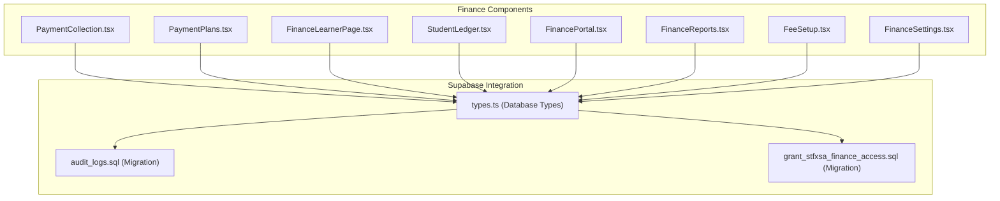
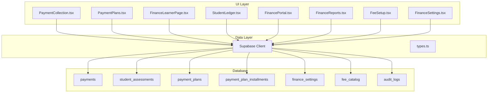
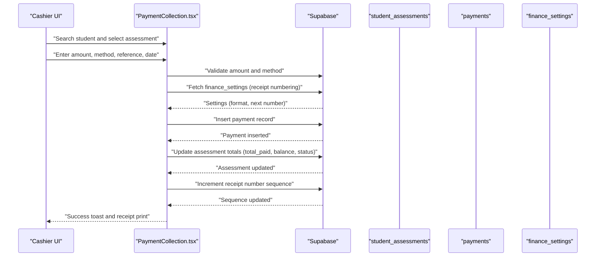
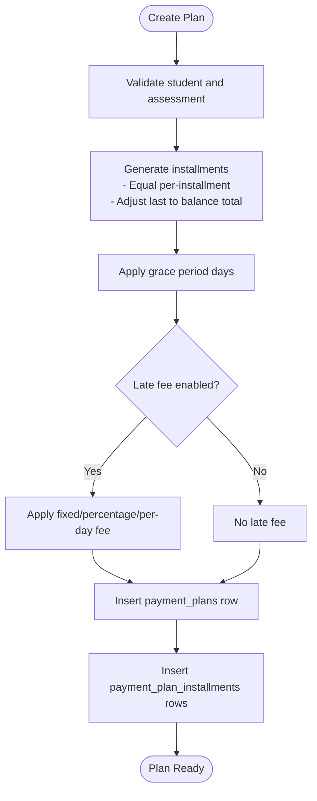
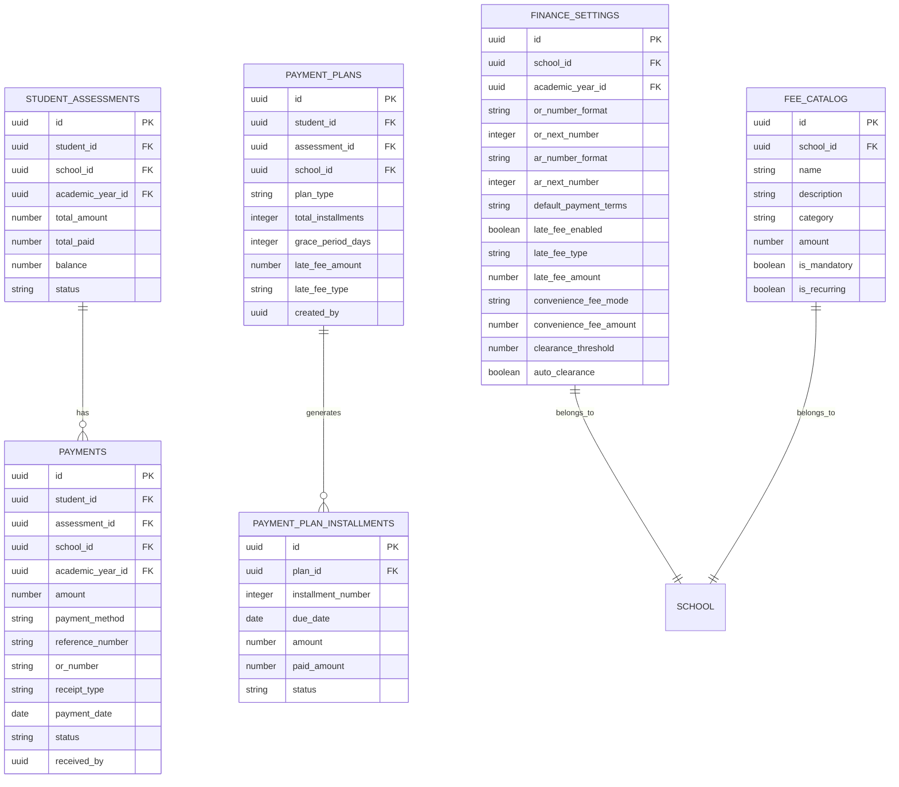

# Payment Processing System

<cite>
**Referenced Files in This Document**
- [PaymentCollection.tsx](file://src/components/finance/PaymentCollection.tsx)
- [PaymentPlans.tsx](file://src/components/finance/PaymentPlans.tsx)
- [FinanceLearnerPage.tsx](file://src/components/finance/FinanceLearnerPage.tsx)
- [StudentLedger.tsx](file://src/components/finance/StudentLedger.tsx)
- [FinancePortal.tsx](file://src/components/finance/FinancePortal.tsx)
- [FinanceReports.tsx](file://src/components/finance/FinanceReports.tsx)
- [FeeSetup.tsx](file://src/components/finance/FeeSetup.tsx)
- [FinanceSettings.tsx](file://src/components/finance/FinanceSettings.tsx)
- [types.ts](file://src/integrations/supabase/types.ts)
- [20260209100000_create_audit_logs.sql](file://supabase/migrations/20260209100000_create_audit_logs.sql)
- [20260210120000_grant_stfxsa_finance_access.sql](file://supabase/migrations/20260210120000_grant_stfxsa_finance_access.sql)
</cite>

## Table of Contents
1. [Introduction](#introduction)
2. [Project Structure](#project-structure)
3. [Core Components](#core-components)
4. [Architecture Overview](#architecture-overview)
5. [Detailed Component Analysis](#detailed-component-analysis)
6. [Dependency Analysis](#dependency-analysis)
7. [Performance Considerations](#performance-considerations)
8. [Troubleshooting Guide](#troubleshooting-guide)
9. [Conclusion](#conclusion)

## Introduction
This document describes the payment processing system within the st.francis-portal application. It covers payment collection workflows, installment payment plans, online payment processing, validation, reconciliation, cash flow management, learner payment interfaces, payment tracking, automated reminders, and integration with accounting systems. The system is built with React, TypeScript, Supabase for backend/data, and integrates with real-time query libraries for efficient data synchronization.

## Project Structure
The payment processing system is organized around several finance-focused components under the `src/components/finance/` directory. These components collaborate with Supabase-defined tables and migrations to manage assessments, payments, receipts, and reporting.

**Diagram sources**
- [PaymentCollection.tsx](file://src/components/finance/PaymentCollection.tsx#L1-L854)
- [PaymentPlans.tsx](file://src/components/finance/PaymentPlans.tsx#L1-L444)
- [FinanceLearnerPage.tsx](file://src/components/finance/FinanceLearnerPage.tsx#L1-L284)
- [StudentLedger.tsx](file://src/components/finance/StudentLedger.tsx#L1-L193)
- [FinancePortal.tsx](file://src/components/finance/FinancePortal.tsx#L1-L100)
- [FinanceReports.tsx](file://src/components/finance/FinanceReports.tsx#L1-L322)
- [FeeSetup.tsx](file://src/components/finance/FeeSetup.tsx#L1-L162)
- [FinanceSettings.tsx](file://src/components/finance/FinanceSettings.tsx#L1-L185)
- [types.ts](file://src/integrations/supabase/types.ts#L1-L4078)
- [20260209100000_create_audit_logs.sql](file://supabase/migrations/20260209100000_create_audit_logs.sql#L1-L38)
- [20260210120000_grant_stfxsa_finance_access.sql](file://supabase/migrations/20260210120000_grant_stfxsa_finance_access.sql#L1-L70)

**Section sources**
- [PaymentCollection.tsx](file://src/components/finance/PaymentCollection.tsx#L1-L854)
- [PaymentPlans.tsx](file://src/components/finance/PaymentPlans.tsx#L1-L444)
- [FinanceLearnerPage.tsx](file://src/components/finance/FinanceLearnerPage.tsx#L1-L284)
- [StudentLedger.tsx](file://src/components/finance/StudentLedger.tsx#L1-L193)
- [FinancePortal.tsx](file://src/components/finance/FinancePortal.tsx#L1-L100)
- [FinanceReports.tsx](file://src/components/finance/FinanceReports.tsx#L1-L322)
- [FeeSetup.tsx](file://src/components/finance/FeeSetup.tsx#L1-L162)
- [FinanceSettings.tsx](file://src/components/finance/FinanceSettings.tsx#L1-L185)
- [types.ts](file://src/integrations/supabase/types.ts#L1-L4078)
- [20260209100000_create_audit_logs.sql](file://supabase/migrations/20260209100000_create_audit_logs.sql#L1-L38)
- [20260210120000_grant_stfxsa_finance_access.sql](file://supabase/migrations/20260210120000_grant_stfxsa_finance_access.sql#L1-L70)

## Core Components
- Payment Collection: Handles real-time cash and non-cash payments, receipt numbering, and immediate assessment updates.
- Payment Plans: Creates and manages installment plans with grace periods and late fees.
- Finance Learner Page: Provides learner financial summaries and filters.
- Student Ledger: Offers detailed student account views with payment histories.
- Finance Portal: Displays high-level financial statistics and quick actions.
- Finance Reports: Generates analytics and charts for collections, balances, and trends.
- Fee Setup: Manages fee catalog items and templates.
- Finance Settings: Configures payment defaults, receipts, late fees, convenience fees, and clearance thresholds.

**Section sources**
- [PaymentCollection.tsx](file://src/components/finance/PaymentCollection.tsx#L133-L854)
- [PaymentPlans.tsx](file://src/components/finance/PaymentPlans.tsx#L48-L444)
- [FinanceLearnerPage.tsx](file://src/components/finance/FinanceLearnerPage.tsx#L18-L284)
- [StudentLedger.tsx](file://src/components/finance/StudentLedger.tsx#L90-L193)
- [FinancePortal.tsx](file://src/components/finance/FinancePortal.tsx#L14-L100)
- [FinanceReports.tsx](file://src/components/finance/FinanceReports.tsx#L15-L322)
- [FeeSetup.tsx](file://src/components/finance/FeeSetup.tsx#L20-L162)
- [FinanceSettings.tsx](file://src/components/finance/FinanceSettings.tsx#L16-L185)

## Architecture Overview
The system follows a component-driven architecture with Supabase as the backend. Components use React Query for data fetching and mutations, maintain local state for forms and dialogs, and integrate with Supabase tables for persistence. Real-time updates are supported via reactive queries and optimistic UI patterns.

**Diagram sources**
- [PaymentCollection.tsx](file://src/components/finance/PaymentCollection.tsx#L1-L854)
- [PaymentPlans.tsx](file://src/components/finance/PaymentPlans.tsx#L1-L444)
- [FinanceLearnerPage.tsx](file://src/components/finance/FinanceLearnerPage.tsx#L1-L284)
- [StudentLedger.tsx](file://src/components/finance/StudentLedger.tsx#L1-L193)
- [FinancePortal.tsx](file://src/components/finance/FinancePortal.tsx#L1-L100)
- [FinanceReports.tsx](file://src/components/finance/FinanceReports.tsx#L1-L322)
- [FeeSetup.tsx](file://src/components/finance/FeeSetup.tsx#L1-L162)
- [FinanceSettings.tsx](file://src/components/finance/FinanceSettings.tsx#L1-L185)
- [types.ts](file://src/integrations/supabase/types.ts#L2347-L2450)
- [20260209100000_create_audit_logs.sql](file://supabase/migrations/20260209100000_create_audit_logs.sql#L1-L38)

## Detailed Component Analysis

### Payment Collection Workflow
The payment collection component enables cashier staff to accept payments, validate inputs, generate receipts, and reconcile with student assessments.

**Diagram sources**
- [PaymentCollection.tsx](file://src/components/finance/PaymentCollection.tsx#L234-L299)
- [types.ts](file://src/integrations/supabase/types.ts#L2347-L2450)

Key behaviors:
- Payment validation enforces positive amounts, selected student, active assessment, and required reference for non-cash methods.
- Receipt numbering uses configurable format and increments atomically.
- Assessment totals are recalculated and status updated (pending/partial/paid).
- Receipt printing displays current balance and payment details.

**Section sources**
- [PaymentCollection.tsx](file://src/components/finance/PaymentCollection.tsx#L133-L854)
- [types.ts](file://src/integrations/supabase/types.ts#L2347-L2450)

### Installment Payment Plans
The payment plans component creates structured installment schedules with grace periods and optional late fees.

**Diagram sources**
- [PaymentPlans.tsx](file://src/components/finance/PaymentPlans.tsx#L24-L46)
- [PaymentPlans.tsx](file://src/components/finance/PaymentPlans.tsx#L151-L192)
- [types.ts](file://src/integrations/supabase/types.ts#L2248-L2310)

**Section sources**
- [PaymentPlans.tsx](file://src/components/finance/PaymentPlans.tsx#L48-L444)
- [types.ts](file://src/integrations/supabase/types.ts#L2248-L2310)

### Online Payment Processing
Online payment processing is supported through non-cash payment methods requiring reference numbers. The system validates reference presence for bank transfers, e-wallets, and card payments.

Validation logic:
- Non-cash methods require a reference number.
- Amount must be greater than zero.
- Active assessment must exist for the selected student and academic year.

**Section sources**
- [PaymentCollection.tsx](file://src/components/finance/PaymentCollection.tsx#L234-L242)

### Payment Validation and Reconciliation
Validation and reconciliation are enforced during payment recording and edits:

- Recording a payment:
  - Validates amount and method.
  - Requires reference number for non-cash.
  - Updates assessment totals and status.
  - Increments receipt number sequence.

- Editing a payment:
  - Voids the original payment.
  - Generates a new receipt number.
  - Inserts corrected payment.
  - Recalculates assessment totals.

- Deleting a payment:
  - Requires finance/admin role.
  - Voids payment and reverses assessment totals.
  - Logs deletion in audit logs.

**Section sources**
- [PaymentCollection.tsx](file://src/components/finance/PaymentCollection.tsx#L301-L376)
- [PaymentCollection.tsx](file://src/components/finance/PaymentCollection.tsx#L378-L465)
- [20260209100000_create_audit_logs.sql](file://supabase/migrations/20260209100000_create_audit_logs.sql#L1-L38)

### Cash Flow Management
Cash flow is tracked through:
- Verified payments contributing to total collections.
- Outstanding balances per student and school.
- Daily collections trend and cumulative charts.
- Clearance thresholds and auto-clearance settings.

**Section sources**
- [FinancePortal.tsx](file://src/components/finance/FinancePortal.tsx#L18-L42)
- [FinanceReports.tsx](file://src/components/finance/FinanceReports.tsx#L26-L122)
- [FinanceSettings.tsx](file://src/components/finance/FinanceSettings.tsx#L72-L104)

### Learner Payment Interface and Tracking
Learner-facing and administrative tracking features:
- Learner summary cards show assessed, collected, and outstanding amounts.
- Student ledger expands to show payment history with statuses and void reasons.
- Recent payments table shows verification status and actions (edit/delete/print).

**Section sources**
- [FinanceLearnerPage.tsx](file://src/components/finance/FinanceLearnerPage.tsx#L18-L284)
- [StudentLedger.tsx](file://src/components/finance/StudentLedger.tsx#L90-L193)
- [PaymentCollection.tsx](file://src/components/finance/PaymentCollection.tsx#L522-L586)

### Automated Payment Reminders
While explicit reminder automation is not implemented in the provided components, the system supports:
- Installment plans with due dates and grace periods.
- Late fee configurations for overdue installments.
- Reporting on overdue students and payment status distribution.

These features can be extended to trigger reminders based on due dates and grace periods.

**Section sources**
- [PaymentPlans.tsx](file://src/components/finance/PaymentPlans.tsx#L48-L444)
- [FinanceReports.tsx](file://src/components/finance/FinanceReports.tsx#L15-L322)
- [FinanceSettings.tsx](file://src/components/finance/FinanceSettings.tsx#L72-L104)

### Integration with Accounting Systems
Integration touchpoints:
- Receipt numbering and formats stored in finance settings.
- Audit logging for payment deletions and corrections.
- Financial reporting tables (payments, assessments, plans) support external analytics.

**Section sources**
- [FinanceSettings.tsx](file://src/components/finance/FinanceSettings.tsx#L72-L104)
- [20260209100000_create_audit_logs.sql](file://supabase/migrations/20260209100000_create_audit_logs.sql#L1-L38)
- [types.ts](file://src/integrations/supabase/types.ts#L2347-L2450)

## Dependency Analysis
The components depend on Supabase tables and typed definitions. Key relationships:
- payments → student_assessments (assessment_id)
- payment_plans → student_assessments (assessment_id)
- payment_plan_installments → payment_plans (plan_id)
- finance_settings → schools (school_id)
- fee_catalog → schools (school_id)

**Diagram sources**
- [types.ts](file://src/integrations/supabase/types.ts#L2248-L2450)

**Section sources**
- [types.ts](file://src/integrations/supabase/types.ts#L2248-L2450)

## Performance Considerations
- Use paginated and filtered queries to limit data transfer.
- Cache frequently accessed data (e.g., recent payments, learner lists) with React Query invalidation.
- Batch updates for receipt numbering and assessment totals to minimize round trips.
- Optimize rendering by expanding only necessary ledger rows and deferring heavy computations until data is available.

## Troubleshooting Guide
Common issues and resolutions:
- Payment validation errors: Ensure amount > 0, student selected, active assessment exists, and reference provided for non-cash methods.
- Receipt numbering gaps: Verify finance settings format and sequence values; increment atomically.
- Edit/Delete permission denied: Confirm user has finance or admin role; check audit logs for deletion entries.
- Missing assessment data: Confirm academic year context and school selection; ensure assessments are not closed.

**Section sources**
- [PaymentCollection.tsx](file://src/components/finance/PaymentCollection.tsx#L234-L242)
- [PaymentCollection.tsx](file://src/components/finance/PaymentCollection.tsx#L301-L317)
- [20260209100000_create_audit_logs.sql](file://supabase/migrations/20260209100000_create_audit_logs.sql#L1-L38)

## Conclusion
The payment processing system provides a robust foundation for collecting payments, managing installment plans, tracking cash flow, and generating financial insights. Its modular components, Supabase-backed data model, and audit capabilities support both operational efficiency and compliance. Extending the system with automated reminders and deeper accounting integrations can further enhance its capabilities.