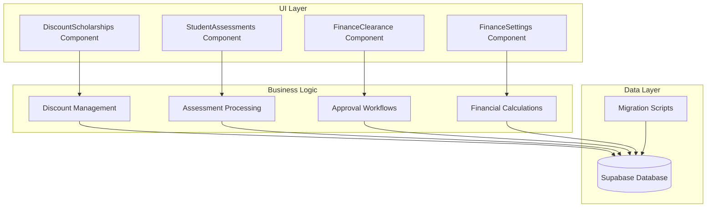
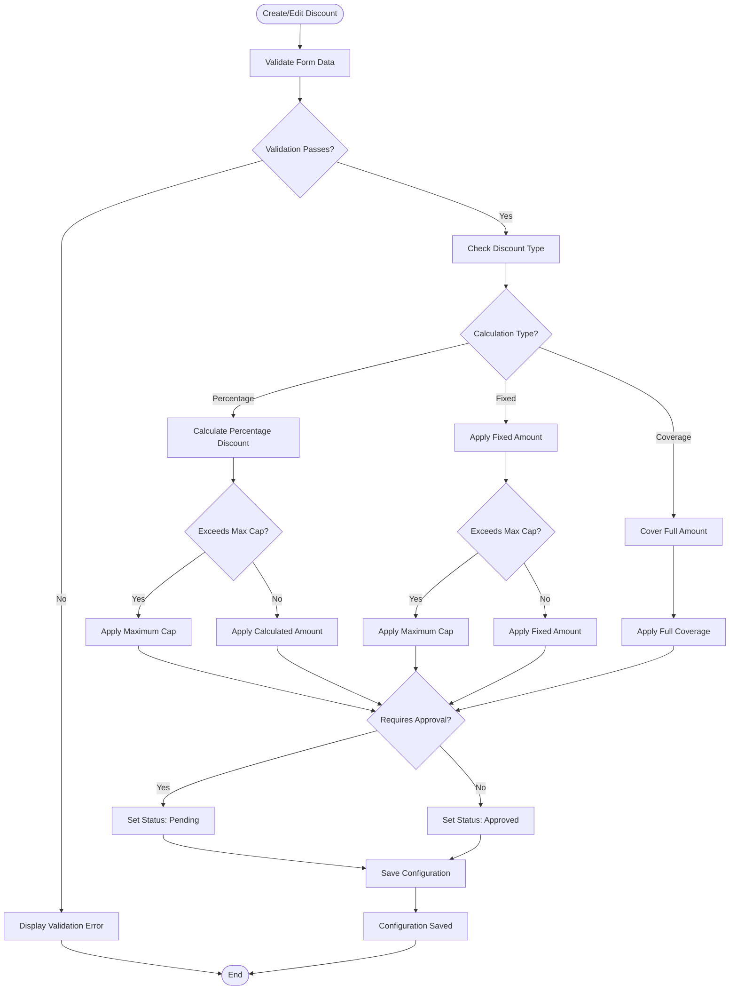
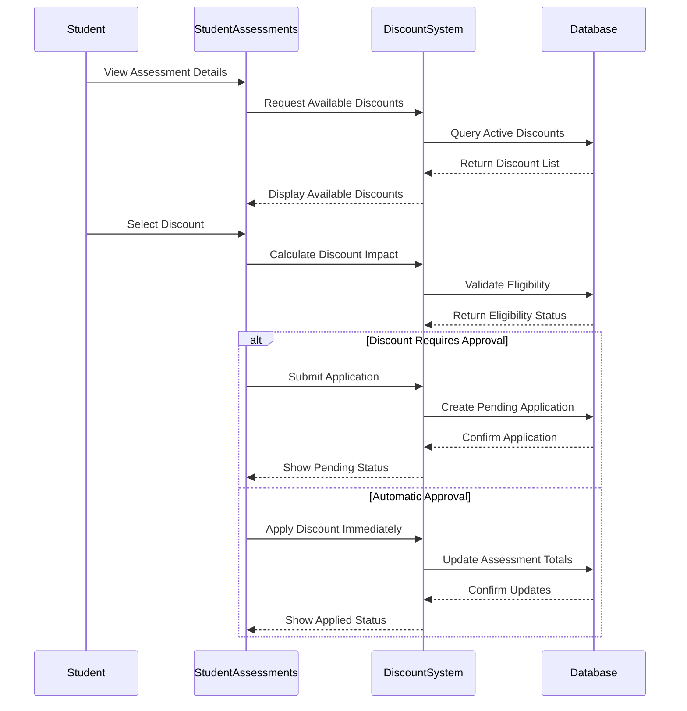
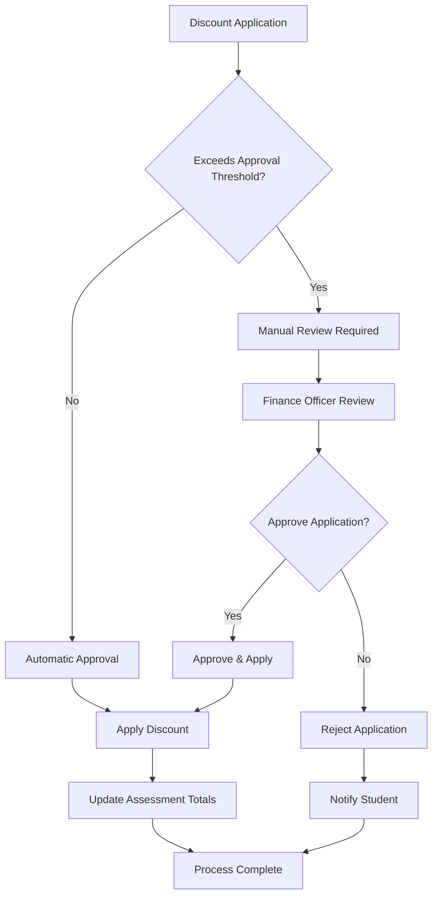
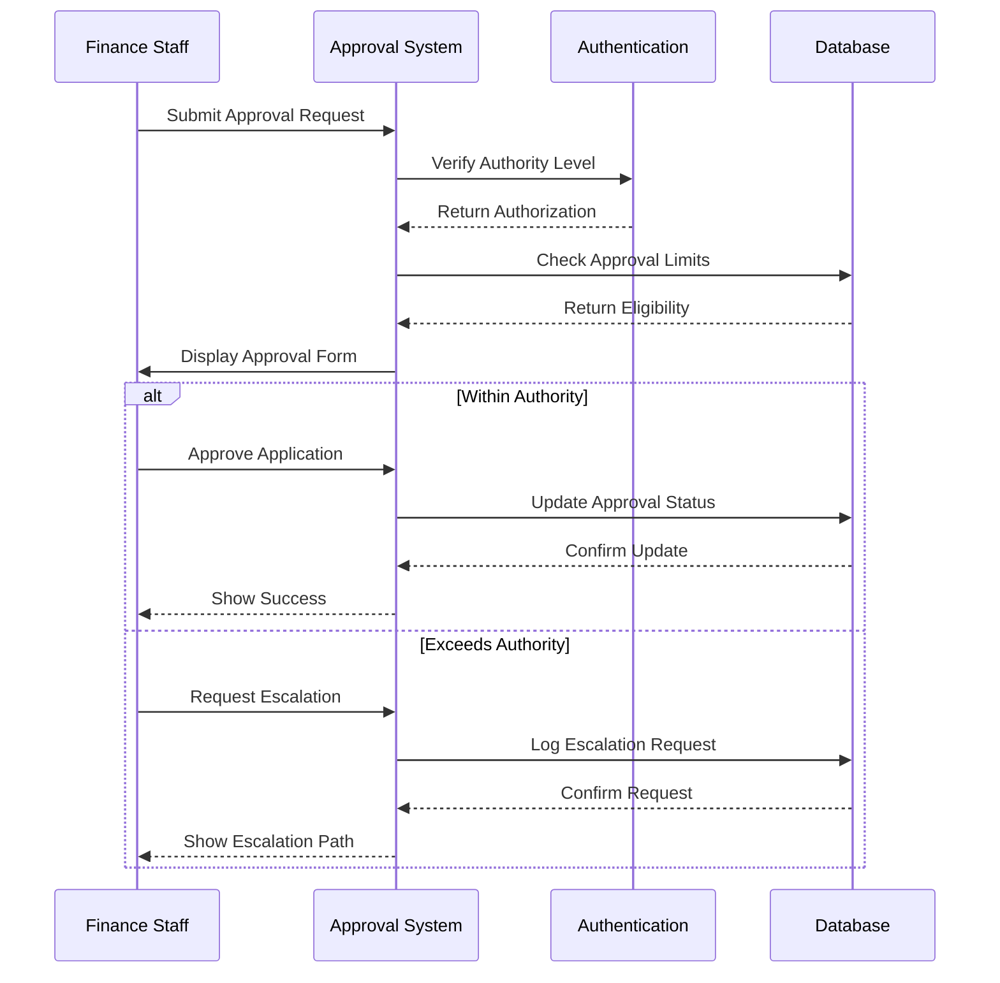
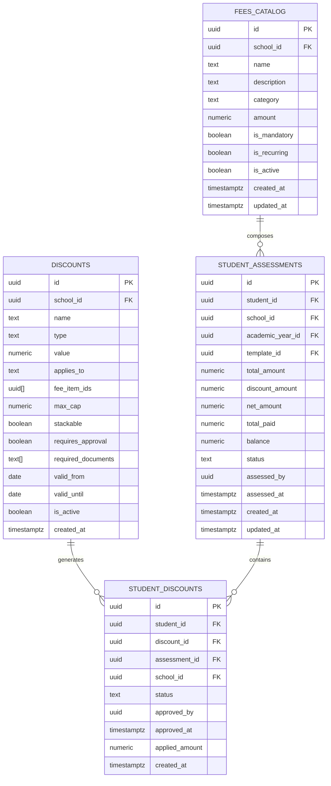
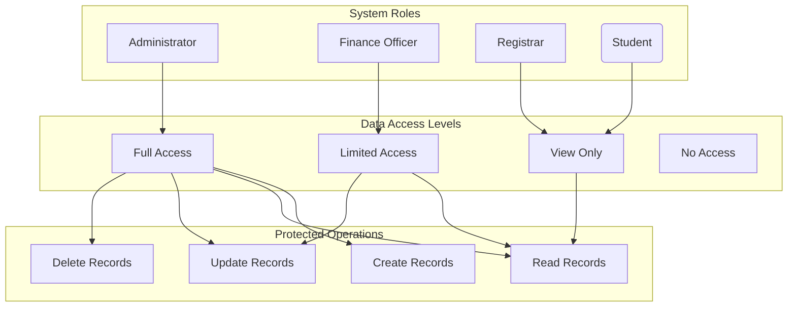

# Scholarship & Discount System

<cite>
**Referenced Files in This Document**
- [DiscountScholarships.tsx](file://src/components/finance/DiscountScholarships.tsx)
- [StudentAssessments.tsx](file://src/components/finance/StudentAssessments.tsx)
- [FinanceSettings.tsx](file://src/components/finance/FinanceSettings.tsx)
- [FinancePortal.tsx](file://src/components/finance/FinancePortal.tsx)
- [FinanceClearance.tsx](file://src/components/finance/FinanceClearance.tsx)
- [DashboardLayout.tsx](file://src/components/layout/DashboardLayout.tsx)
- [20260209103502_b2a0d7e3-f02e-448d-aac8-5ea9b30a6314.sql](file://supabase/migrations/20260209103502_b2a0d7e3-f02e-448d-aac8-5ea9b30a6314.sql)
</cite>

## Table of Contents
1. [Introduction](#introduction)
2. [System Architecture](#system-architecture)
3. [Core Components](#core-components)
4. [Discount Configuration Management](#discount-configuration-management)
5. [Eligibility & Application Workflows](#eligibility--application-workflows)
6. [Approval Processes](#approval-processes)
7. [Financial Impact Calculations](#financial-impact-calculations)
8. [Administrative Approvals](#administrative-approvals)
9. [Funding Sources & Types](#funding-sources--types)
10. [Data Model](#data-model)
11. [Security & Access Control](#security--access-control)
12. [Performance Considerations](#performance-considerations)
13. [Troubleshooting Guide](#troubleshooting-guide)
14. [Conclusion](#conclusion)

## Introduction

The Scholarship and Discount Management System is a comprehensive financial aid solution integrated into the st.francis-portal platform. This system manages various forms of financial assistance including scholarships, discounts, and fee waivers for students across multiple schools and academic years.

The system provides a complete lifecycle for managing financial aid, from configuration and eligibility determination to application processing and approval workflows. It supports multiple discount types, approval mechanisms, and integrates seamlessly with the broader finance management ecosystem.

## System Architecture

The scholarship and discount system follows a modular architecture with clear separation of concerns:



**Diagram sources**
- [DiscountScholarships.tsx](file://src/components/finance/DiscountScholarships.tsx#L18-L163)
- [StudentAssessments.tsx](file://src/components/finance/StudentAssessments.tsx#L26-L450)
- [FinanceSettings.tsx](file://src/components/finance/FinanceSettings.tsx#L16-L185)

## Core Components

### Discount Configuration Component

The primary interface for managing discount and scholarship configurations is built around the `DiscountScholarships` component, which provides:

- **Multi-type Support**: Handles percentage, fixed amount, and coverage-based discounts
- **Approval Integration**: Configurable approval requirements per discount type
- **Stackable Options**: Allows multiple discounts to be combined when permitted
- **Active Status Management**: Real-time activation/deactivation controls

### Student Assessment Integration

The `StudentAssessments` component serves as the central hub for applying discounts during the assessment process:

- **Real-time Preview**: Shows discount impact before application
- **Automated Calculations**: Computes financial impact instantly
- **Approval Workflow Integration**: Seamlessly handles both automatic and manual approvals
- **Status Tracking**: Monitors discount application status throughout the process

### Financial Settings Management

The `FinanceSettings` component provides institutional-wide configuration options:

- **Payment Term Policies**: Controls default payment methods and terms
- **Late Fee Configuration**: Manages penalty structures and calculation methods
- **Receipt Numbering**: Standardizes financial documentation formats
- **Clearance Thresholds**: Defines financial thresholds for various operations

**Section sources**
- [DiscountScholarships.tsx](file://src/components/finance/DiscountScholarships.tsx#L18-L163)
- [StudentAssessments.tsx](file://src/components/finance/StudentAssessments.tsx#L26-L450)
- [FinanceSettings.tsx](file://src/components/finance/FinanceSettings.tsx#L16-L185)

## Discount Configuration Management

### Configuration Parameters

The system supports comprehensive discount configuration through the following parameters:

| Parameter | Description | Allowed Values | Default |
|-----------|-------------|----------------|---------|
| **Name** | Human-readable discount identifier | Text (1-100 chars) | Required |
| **Type** | Calculation method | percentage, fixed, coverage | percentage |
| **Value** | Discount amount or percentage | Numeric (0-999999.99) | 0 |
| **Applies To** | Target audience | all, specific groups | all |
| **Stackable** | Allow multiple discounts | boolean | false |
| **Requires Approval** | Manual approval requirement | boolean | false |
| **Max Cap** | Maximum discount limit | Numeric | None |
| **Valid Period** | Active date range | Date range | Permanent |

### Configuration Workflow



**Diagram sources**
- [DiscountScholarships.tsx](file://src/components/finance/DiscountScholarships.tsx#L83-L86)
- [DiscountScholarships.tsx](file://src/components/finance/DiscountScholarships.tsx#L42-L58)

**Section sources**
- [DiscountScholarships.tsx](file://src/components/finance/DiscountScholarships.tsx#L18-L163)

## Eligibility & Application Workflows

### Student Assessment Integration

The discount application process is tightly integrated with the student assessment workflow:



**Diagram sources**
- [StudentAssessments.tsx](file://src/components/finance/StudentAssessments.tsx#L396-L446)
- [StudentAssessments.tsx](file://src/components/finance/StudentAssessments.tsx#L173-L220)

### Eligibility Determination

The system evaluates student eligibility through multiple criteria:

1. **Academic Year Validation**: Ensures discounts apply to the current academic period
2. **Student Classification**: Matches discount target groups with student profiles
3. **Financial Status**: Verifies student meets financial need requirements
4. **Enrollment Status**: Confirms student is properly enrolled
5. **Discount Limits**: Checks remaining discount availability and caps

**Section sources**
- [StudentAssessments.tsx](file://src/components/finance/StudentAssessments.tsx#L26-L450)

## Approval Processes

### Multi-Level Approval System

The system implements a flexible approval hierarchy based on discount value and institutional policies:



**Diagram sources**
- [StudentAssessments.tsx](file://src/components/finance/StudentAssessments.tsx#L173-L220)

### Approval Threshold Configuration

| Discount Type | Approval Threshold | Required Documents |
|---------------|-------------------|-------------------|
| **Standard** | ₱0-₱5,000 | None |
| **Substantial** | ₱5,001-₱20,000 | Financial Statement |
| **Major** | ₱20,001-₱50,000 | Income Verification |
| **Full Coverage** | Above ₱50,000 | Comprehensive Documentation |

**Section sources**
- [StudentAssessments.tsx](file://src/components/finance/StudentAssessments.tsx#L173-L220)

## Financial Impact Calculations

### Discount Calculation Engine

The system employs sophisticated calculation logic to determine financial impact:

```mermaid
flowchart TD
Start([Calculate Discount Impact]) --> GetBase[Get Base Assessment Amount]
GetBase --> CheckType{Discount Type?}
CheckType --> |Percentage| CalcPercent[Amount × (Value/100)]
CheckType --> |Fixed| CalcFixed[Fixed Amount]
CheckType --> |Coverage| CalcCoverage[Full Assessment Amount]
CalcPercent --> CheckCap{Exceeds Max Cap?}
CalcFixed --> CheckCap
CalcCoverage --> ApplyCoverage[Apply Full Coverage]
CheckCap --> |Yes| ApplyCap[Apply Maximum Cap]
CheckCap --> |No| ApplyAmount[Apply Calculated Amount]
ApplyCoverage --> FinalCalc[Final Calculation]
ApplyCap --> FinalCalc
ApplyAmount --> FinalCalc
FinalCalc --> UpdateTotals[Update Assessment Totals]
UpdateTotals --> CheckBalance{Remaining Balance?}
CheckBalance --> |Positive| UpdateStatus[Update Status: Partial]
CheckBalance --> |Zero| CloseAssessment[Close Assessment]
UpdateStatus --> End([Calculation Complete])
CloseAssessment --> End
```

**Diagram sources**
- [StudentAssessments.tsx](file://src/components/finance/StudentAssessments.tsx#L110-L121)

### Calculation Methods

The system supports three primary calculation methods:

1. **Percentage-Based Discounts**: `(Assessment Total × Discount Percentage) ÷ 100`
2. **Fixed Amount Discounts**: Direct monetary deduction up to maximum cap
3. **Full Coverage Discounts**: Complete waiver of assessment amounts

### Precision & Rounding

All calculations use two-decimal precision with standardized rounding:
- Applied amounts are rounded to nearest cent
- Cumulative totals maintain financial accuracy
- Display values formatted for user readability

**Section sources**
- [StudentAssessments.tsx](file://src/components/finance/StudentAssessments.tsx#L110-L121)

## Administrative Approvals

### Approval Authority Matrix

The system defines clear approval hierarchies based on discount value and institutional policies:

| Authority Level | Maximum Approval Amount | Required Documents |
|----------------|------------------------|-------------------|
| **Finance Officer** | ₱0-₱10,000 | None |
| **Department Head** | ₱10,001-₱25,000 | Financial Statement |
| **Principal** | ₱25,001-₱50,000 | Income Verification |
| **Board of Directors** | Above ₱50,000 | Comprehensive Documentation |

### Approval Workflow Integration



**Diagram sources**
- [StudentAssessments.tsx](file://src/components/finance/StudentAssessments.tsx#L173-L220)

**Section sources**
- [StudentAssessments.tsx](file://src/components/finance/StudentAssessments.tsx#L173-L220)

## Funding Sources & Types

### Supported Discount Types

The system categorizes discounts into distinct types with specific characteristics:

| Type | Description | Calculation Method | Typical Range |
|------|-------------|-------------------|---------------|
| **Merit-Based** | Academic excellence rewards | Percentage/Fixed | 10%-50% or ₱5,000-₱20,000 |
| **Need-Based** | Financial hardship assistance | Coverage/Percentage | 25%-100% |
| **Early Bird** | Early payment incentives | Fixed | ₱1,000-₱5,000 |
| **Legacy** | Alumni/employee benefits | Fixed | ₱2,500-₱15,000 |
| **Siblings** | Multiple child enrollment | Percentage | 5%-25% |
| **Program** | Specific course/program support | Coverage | 50%-100% |

### Funding Sources Integration

The system supports multiple funding sources:

1. **Institutional Funds**: Direct school budget allocation
2. **Donor Foundations**: External funding partnerships
3. **Government Programs**: Public assistance programs
4. **External Grants**: Corporate sponsorships
5. **Community Support**: Local community initiatives

**Section sources**
- [DiscountScholarships.tsx](file://src/components/finance/DiscountScholarships.tsx#L18-L163)

## Data Model

### Core Database Schema

The scholarship and discount system utilizes a normalized relational database design:



**Diagram sources**
- [20260209103502_b2a0d7e3-f02e-448d-aac8-5ea9b30a6314.sql](file://supabase/migrations/20260209103502_b2a0d7e3-f02e-448d-aac8-5ea9b30a6314.sql#L195-L232)

### Security & Access Control

The system implements comprehensive row-level security policies:

| Table | Roles with Full Access | Select Access | Notes |
|-------|----------------------|---------------|-------|
| **discounts** | finance, admin | anyone (active only) | Active discounts visible to all |
| **student_discounts** | finance, admin, student | self | Students can view own applications |
| **student_assessments** | finance, admin, registrar | self, registrar | Students see own assessments |
| **finance_clearance** | finance, admin, registrar | self, registrar | Clearance visibility by role |

**Section sources**
- [20260209103502_b2a0d7e3-f02e-448d-aac8-5ea9b30a6314.sql](file://supabase/migrations/20260209103502_b2a0d7e3-f02e-448d-aac8-5ea9b30a6314.sql#L215-L238)

## Security & Access Control

### Role-Based Permissions

The system implements a comprehensive role-based access control system:



**Diagram sources**
- [20260209103502_b2a0d7e3-f02e-448d-aac8-5ea9b30a6314.sql](file://supabase/migrations/20260209103502_b2a0d7e3-f02e-448d-aac8-5ea9b30a6314.sql#L19-L266)

### Audit Trail Implementation

All financial operations are tracked through comprehensive audit logging:

- **Transaction Logging**: Every discount application and approval
- **User Activity**: Detailed user action tracking
- **System Changes**: Database modification timestamps
- **Compliance**: Regulatory compliance reporting capabilities

**Section sources**
- [20260209103502_b2a0d7e3-f02e-448d-aac8-5ea9b30a6314.sql](file://supabase/migrations/20260209103502_b2a0d7e3-f02e-448d-aac8-5ea9b30a6314.sql#L311-L329)

## Performance Considerations

### Database Optimization

The system implements several performance optimization strategies:

1. **Indexing Strategy**: Strategic indexing on frequently queried columns
2. **Query Optimization**: Efficient query patterns for real-time calculations
3. **Caching Layers**: React Query caching for reduced database load
4. **Pagination**: Large dataset pagination for improved responsiveness

### Scalability Features

- **Horizontal Scaling**: Database connection pooling
- **Asynchronous Processing**: Background job processing for heavy calculations
- **Load Balancing**: Distributed query execution
- **Monitoring**: Real-time performance metrics and alerts

## Troubleshooting Guide

### Common Issues & Solutions

| Issue | Symptoms | Solution |
|-------|----------|----------|
| **Discount Not Applying** | Discount appears but doesn't reduce balance | Check discount validity dates and active status |
| **Approval Pending** | Application shows pending status | Verify approval authority and required documents |
| **Calculation Errors** | Incorrect discount amounts | Review discount type and value configuration |
| **Permission Denied** | Cannot access discount records | Verify user role and school assignment |

### Debugging Tools

The system provides comprehensive debugging capabilities:

- **Console Logging**: Detailed operation logs
- **Error Tracking**: Centralized error reporting
- **Performance Monitoring**: Slow query identification
- **Audit Trails**: Complete transaction history

**Section sources**
- [StudentAssessments.tsx](file://src/components/finance/StudentAssessments.tsx#L219-L220)

## Conclusion

The Scholarship and Discount Management System provides a robust, scalable solution for educational institutions seeking to streamline financial aid administration. The system's modular architecture, comprehensive security model, and flexible approval workflows make it suitable for institutions of all sizes.

Key strengths include:

- **Comprehensive Coverage**: Supports all major discount types and funding sources
- **Flexible Approval**: Multi-level approval system with configurable thresholds
- **Real-time Processing**: Instant calculation and application capabilities
- **Strong Security**: Enterprise-grade access control and audit trails
- **Scalable Design**: Built to handle growing institutional needs

The system successfully balances institutional control with operational efficiency, providing both administrative oversight and streamlined student experiences. Its integration with the broader finance management ecosystem ensures seamless operations across the entire financial aid lifecycle.